# Benchmark of `typescript-json`
> CPU: 11th Gen Intel(R) Core(TM) i5-1135G7 @ 2.40GHz
> Memory: 16,218 MB
> NodeJS version: v16.17.1
> TypeScript-JSON version: 3.3.12

## is
 Components | typescript-json | typebox | ajv | io-ts | class-validator | zod 
------------|-----------------|---------|-----|-------|-----------------|-----
object (hierarchical) | 108210.18756895918 | 184181.2811519291 | 74299.2341356674 | 9138.838143953233 | 62.60177311380495 | 401.32304299889745
object (recursive) | 66304.31602048282 | 84578.3940547399 | Failed | 4415.937272064187 | 40.39463886820551 | 71.25581395348837
object (union, explicit) | 15859.748072946042 | 11516.663631396832 | 1117.5094475436385 | 3193.8794209272496 | 16.305354826755604 | 32.13003213003213
object (union, implicit) | 11555.311355311356 | 76721.90013091452 | 4082.611100866679 | Failed | 16.37852593266606 | 45.85798816568047
array (recursive) | 6734.898727370497 | 6862.402380066939 | Failed | 466.87580734452854 | 3.3815517565282733 | 9.095971783924263
array (union, explicit) | 3723.4714737037725 | 1976.873265494912 | Failed | 391.80962921970115 | 7.663551401869159 | 2.822732404968009
array (union, implicit) | 3689.2798839107563 | 2275.968710205567 | Failed | 460.33519553072625 | 8.64397622906537 | 3.549411544928078
ultimate union | 548.9229645856152 | 252.66582324236398 | Failed | Failed | Failed | 0.3459609064175748

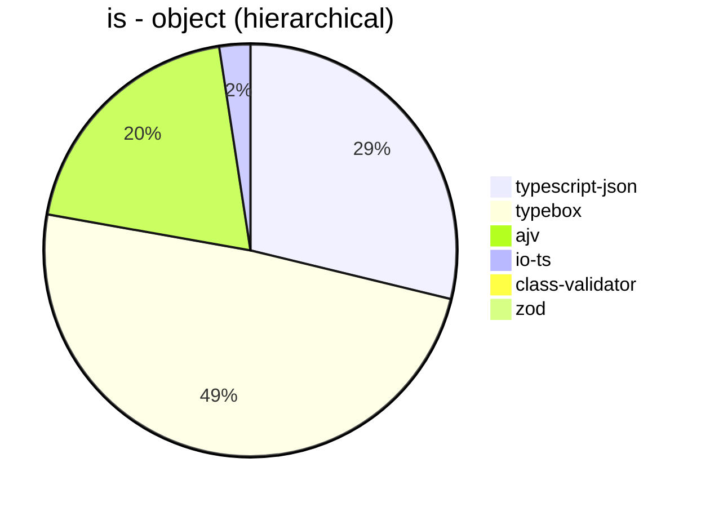
```mermaid
pie title is - object (hierarchical)
  "typescript-json": 108210.18756895918
  "typebox": 184181.2811519291
  "ajv": 74299.2341356674
  "io-ts": 9138.838143953233
  "class-validator": 62.60177311380495
  "zod": 401.32304299889745
```

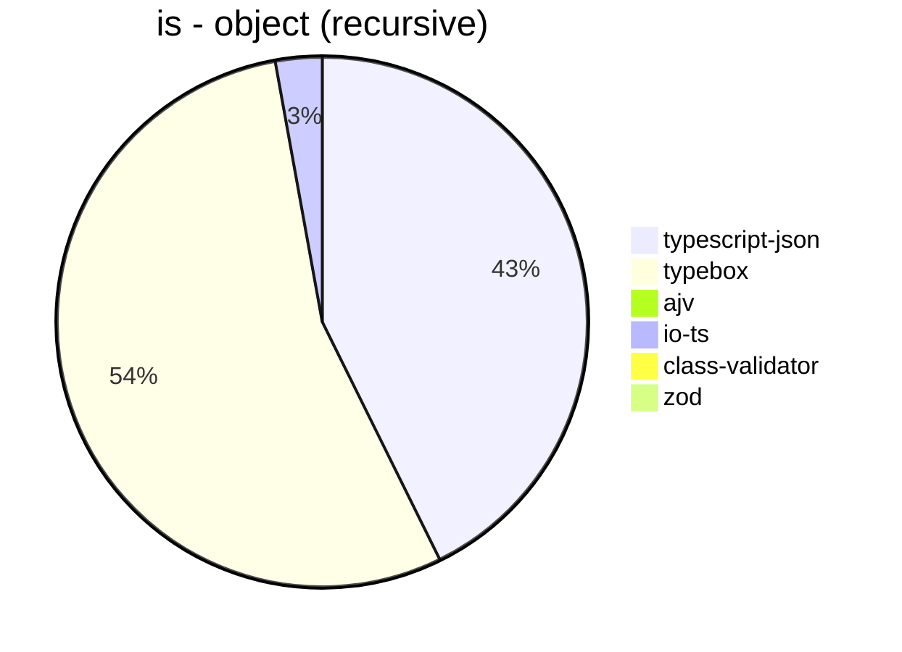
```mermaid
pie title is - object (recursive)
  "typescript-json": 66304.31602048282
  "typebox": 84578.3940547399
  "ajv": 0
  "io-ts": 4415.937272064187
  "class-validator": 40.39463886820551
  "zod": 71.25581395348837
```

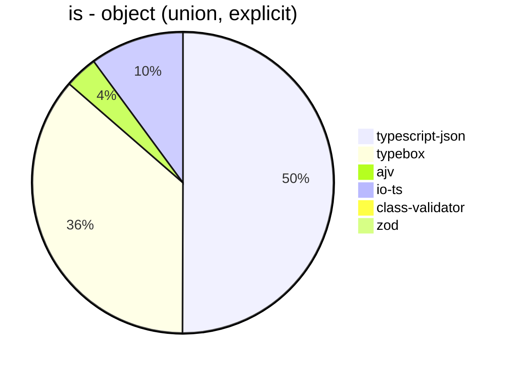
```mermaid
pie title is - object (union, explicit)
  "typescript-json": 15859.748072946042
  "typebox": 11516.663631396832
  "ajv": 1117.5094475436385
  "io-ts": 3193.8794209272496
  "class-validator": 16.305354826755604
  "zod": 32.13003213003213
```

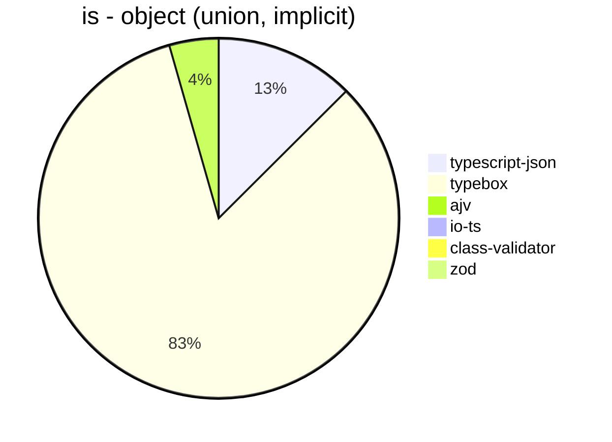
```mermaid
pie title is - object (union, implicit)
  "typescript-json": 11555.311355311356
  "typebox": 76721.90013091452
  "ajv": 4082.611100866679
  "io-ts": 0
  "class-validator": 16.37852593266606
  "zod": 45.85798816568047
```

```mermaid
pie title is - array (recursive)
  "typescript-json": 6734.898727370497
  "typebox": 6862.402380066939
  "ajv": 0
  "io-ts": 466.87580734452854
  "class-validator": 3.3815517565282733
  "zod": 9.095971783924263
```

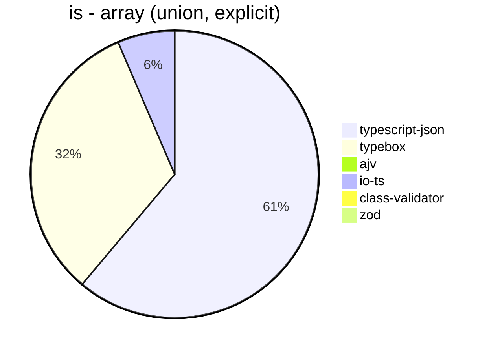
```mermaid
pie title is - array (union, explicit)
  "typescript-json": 3723.4714737037725
  "typebox": 1976.873265494912
  "ajv": 0
  "io-ts": 391.80962921970115
  "class-validator": 7.663551401869159
  "zod": 2.822732404968009
```

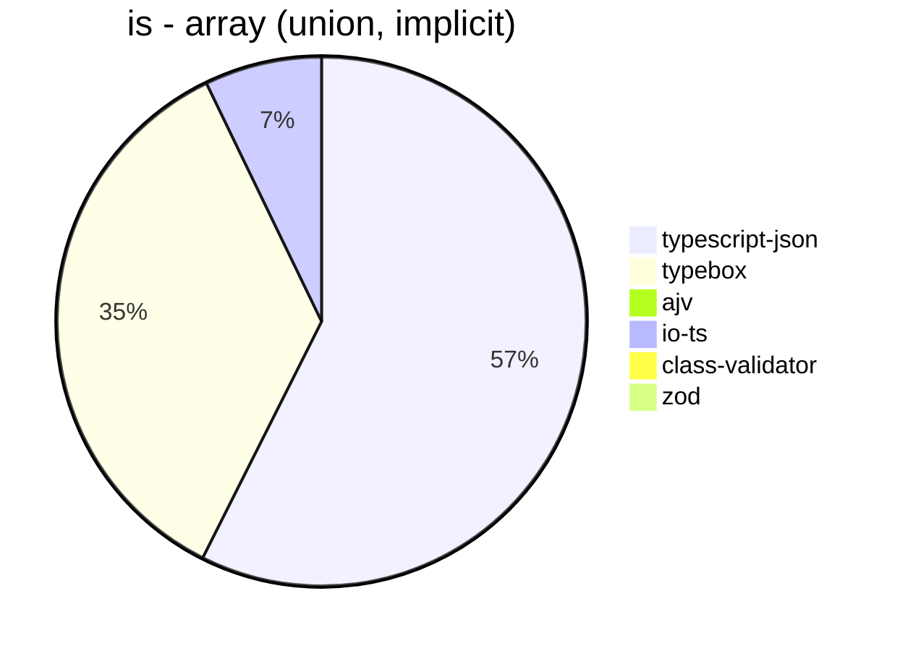
```mermaid
pie title is - array (union, implicit)
  "typescript-json": 3689.2798839107563
  "typebox": 2275.968710205567
  "ajv": 0
  "io-ts": 460.33519553072625
  "class-validator": 8.64397622906537
  "zod": 3.549411544928078
```

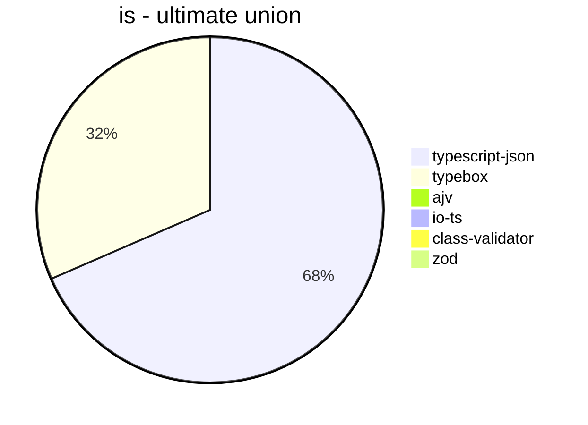
```mermaid
pie title is - ultimate union
  "typescript-json": 548.9229645856152
  "typebox": 252.66582324236398
  "ajv": 0
  "io-ts": 0
  "class-validator": 0
  "zod": 0.3459609064175748
```

## assert
 Components | typescript-json | typebox | io-ts | zod | class-validator 
------------|-----------------|---------|-------|-----|-----------------
object (hierarchical) | 22107.07669507225 | 821.2906784335356 | 3357.6873024725787 | 395.8333333333333 | 63.68140943292347
object (recursive) | 28218.86582653818 | 335.99854624750134 | 1673.6744186046512 | 73.63687464867904 | 39.48576675849403
object (union, explicit) | 4403.040415276233 | 149.78786201807785 | 1087.713004484305 | 33.771106941838646 | 16.299314687905166
object (union, implicit) | 4578.986039676708 | Failed | 502.2956841138659 | 45.82311898925137 | 16.577638607478356
array (recursive) | 1496.1313455368936 | 34.68208092485549 | 151.48830616583982 | 9.292622795372655 | 3.3764772087788404
array (union, explicit) | 1874.1958541815582 | 19.872515935508062 | 78.3478421929987 | 2.810567734682406 | 7.113440658929241
array (union, implicit) | 1695.8734775495363 | 26.750142287990894 | 92.49183895538629 | 3.5747883349012226 | 8.654023200147302
ultimate union | 230.2132273220094 | Failed | Failed | Failed | Failed

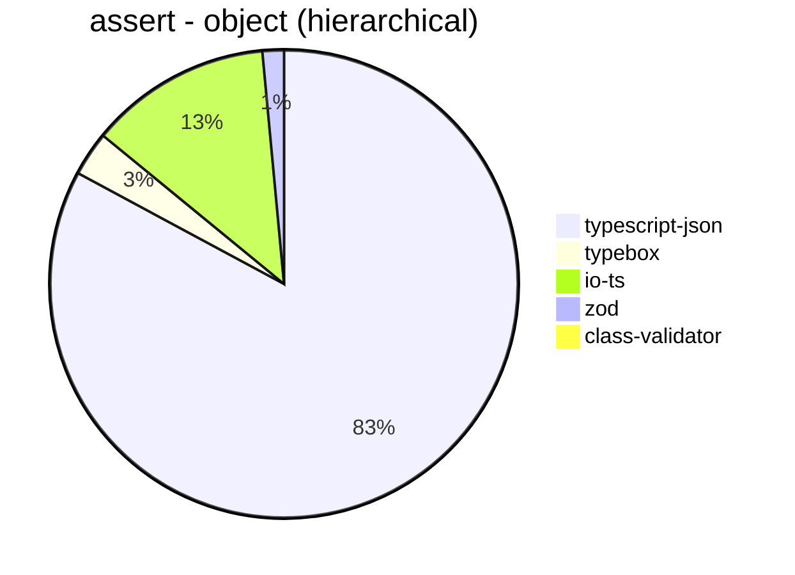
```mermaid
pie title assert - object (hierarchical)
  "typescript-json": 22107.07669507225
  "typebox": 821.2906784335356
  "io-ts": 3357.6873024725787
  "zod": 395.8333333333333
  "class-validator": 63.68140943292347
```

```mermaid
pie title assert - object (recursive)
  "typescript-json": 28218.86582653818
  "typebox": 335.99854624750134
  "io-ts": 1673.6744186046512
  "zod": 73.63687464867904
  "class-validator": 39.48576675849403
```

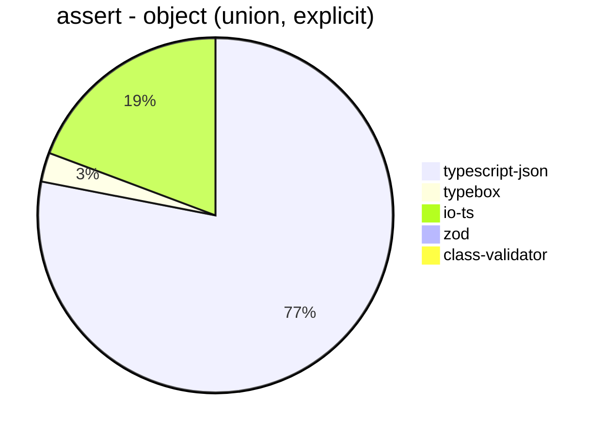
```mermaid
pie title assert - object (union, explicit)
  "typescript-json": 4403.040415276233
  "typebox": 149.78786201807785
  "io-ts": 1087.713004484305
  "zod": 33.771106941838646
  "class-validator": 16.299314687905166
```

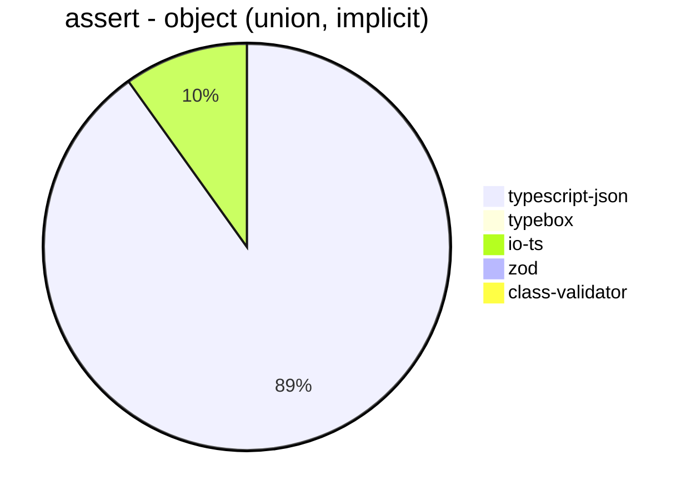
```mermaid
pie title assert - object (union, implicit)
  "typescript-json": 4578.986039676708
  "typebox": 0
  "io-ts": 502.2956841138659
  "zod": 45.82311898925137
  "class-validator": 16.577638607478356
```

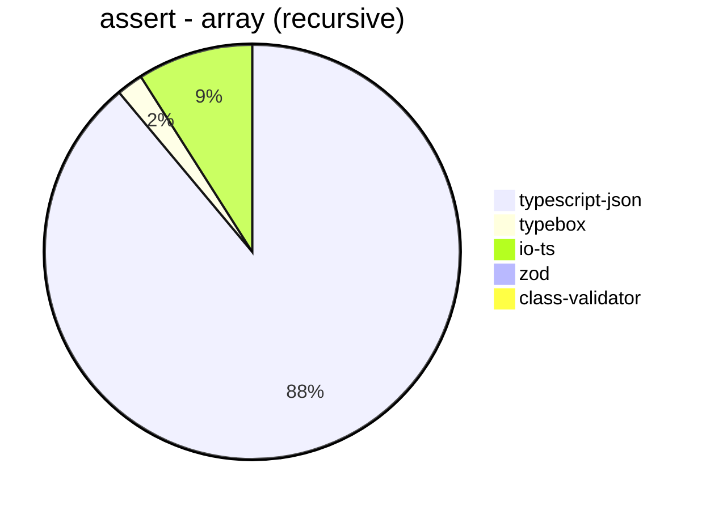
```mermaid
pie title assert - array (recursive)
  "typescript-json": 1496.1313455368936
  "typebox": 34.68208092485549
  "io-ts": 151.48830616583982
  "zod": 9.292622795372655
  "class-validator": 3.3764772087788404
```

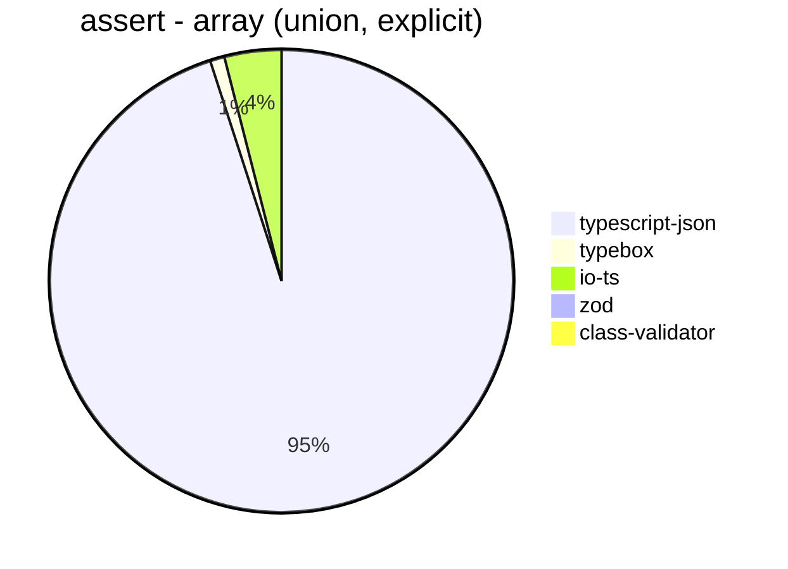
```mermaid
pie title assert - array (union, explicit)
  "typescript-json": 1874.1958541815582
  "typebox": 19.872515935508062
  "io-ts": 78.3478421929987
  "zod": 2.810567734682406
  "class-validator": 7.113440658929241
```

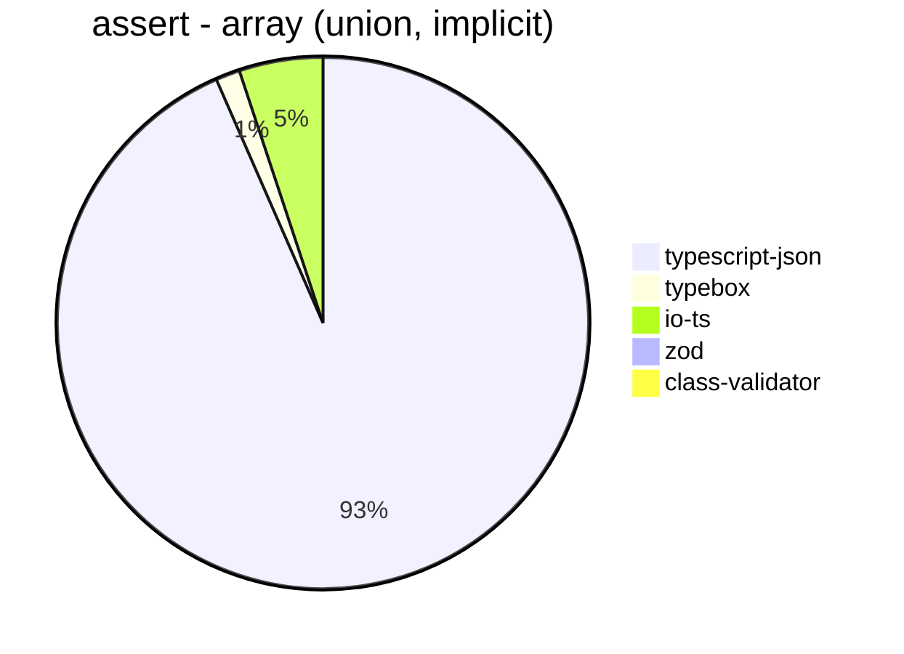
```mermaid
pie title assert - array (union, implicit)
  "typescript-json": 1695.8734775495363
  "typebox": 26.750142287990894
  "io-ts": 92.49183895538629
  "zod": 3.5747883349012226
  "class-validator": 8.654023200147302
```

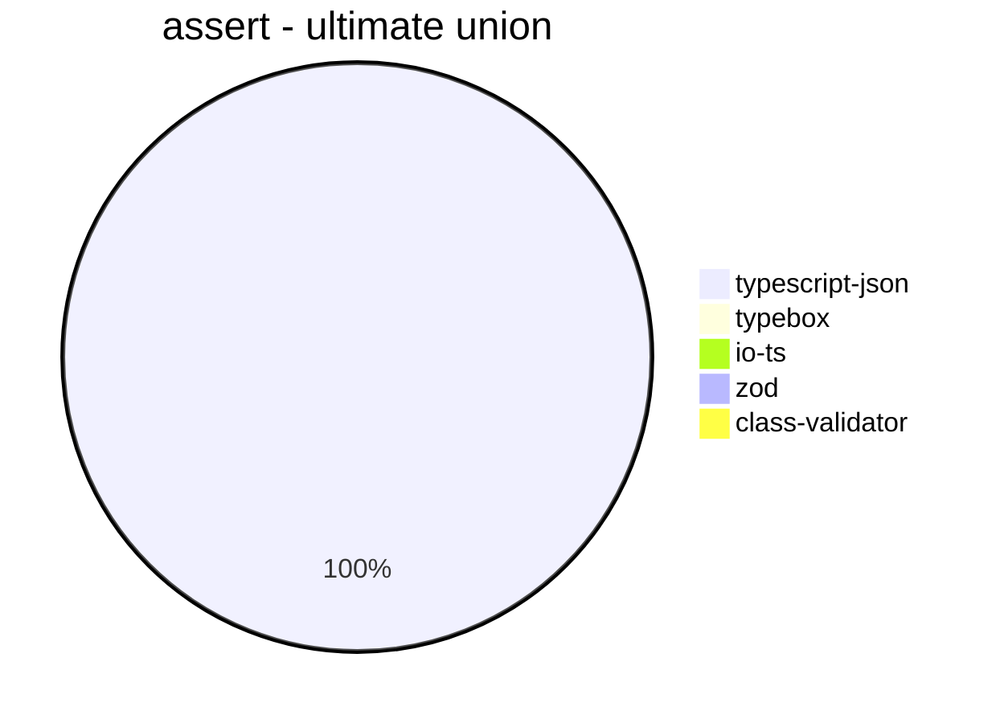
```mermaid
pie title assert - ultimate union
  "typescript-json": 230.2132273220094
  "typebox": 0
  "io-ts": 0
  "zod": 0
  "class-validator": 0
```

## valiadate
 Components | typescript-json | typebox | io-ts | zod | class-validator 
------------|-----------------|---------|-------|-----|-----------------
object (hierarchical) | 14552.436440677968 | 842.1348314606741 | 3338.0703066566944 | 379.6714208340856 | 61.41473222445622
object (recursive) | 15484.938638899219 | 318.94484412470024 | 1475.2971768202078 | 71.50943396226415 | 39.26701570680628
object (union, explicit) | 3425.086473693792 | 154.6021546021546 | 1103.6870671907168 | 33.19426809359695 | 16.29026286560533
object (union, implicit) | 3369.7373155811442 | Failed | 453.75722543352606 | 45.13953923955797 | 16.286644951140065
array (recursive) | 958.1621217781098 | 36.51844843897824 | 160.45899172310007 | 9.283819628647215 | 3.3588356036573987
array (union, explicit) | 1588.027547236447 | 20.7782395164337 | 76.1199696279423 | 2.628614344723996 | 7.295276308590188
array (union, implicit) | 1422.712358731316 | 26.755218216318788 | 102.05593628449712 | 3.7735849056603774 | 8.786689100766498
ultimate union | 118.20288821536816 | Failed | Failed | Failed | Failed

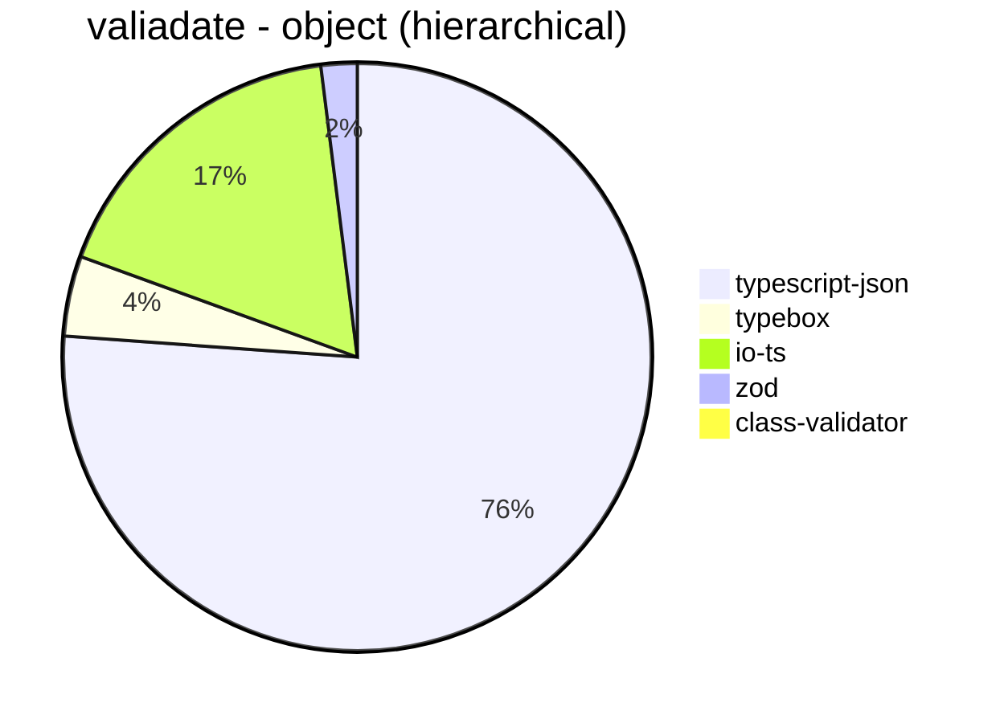
```mermaid
pie title valiadate - object (hierarchical)
  "typescript-json": 14552.436440677968
  "typebox": 842.1348314606741
  "io-ts": 3338.0703066566944
  "zod": 379.6714208340856
  "class-validator": 61.41473222445622
```

```mermaid
pie title valiadate - object (recursive)
  "typescript-json": 15484.938638899219
  "typebox": 318.94484412470024
  "io-ts": 1475.2971768202078
  "zod": 71.50943396226415
  "class-validator": 39.26701570680628
```

```mermaid
pie title valiadate - object (union, explicit)
  "typescript-json": 3425.086473693792
  "typebox": 154.6021546021546
  "io-ts": 1103.6870671907168
  "zod": 33.19426809359695
  "class-validator": 16.29026286560533
```

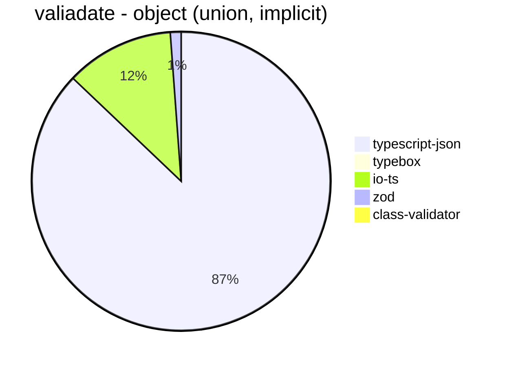
```mermaid
pie title valiadate - object (union, implicit)
  "typescript-json": 3369.7373155811442
  "typebox": 0
  "io-ts": 453.75722543352606
  "zod": 45.13953923955797
  "class-validator": 16.286644951140065
```

```mermaid
pie title valiadate - array (recursive)
  "typescript-json": 958.1621217781098
  "typebox": 36.51844843897824
  "io-ts": 160.45899172310007
  "zod": 9.283819628647215
  "class-validator": 3.3588356036573987
```

```mermaid
pie title valiadate - array (union, explicit)
  "typescript-json": 1588.027547236447
  "typebox": 20.7782395164337
  "io-ts": 76.1199696279423
  "zod": 2.628614344723996
  "class-validator": 7.295276308590188
```

```mermaid
pie title valiadate - array (union, implicit)
  "typescript-json": 1422.712358731316
  "typebox": 26.755218216318788
  "io-ts": 102.05593628449712
  "zod": 3.7735849056603774
  "class-validator": 8.786689100766498
```

```mermaid
pie title valiadate - ultimate union
  "typescript-json": 118.20288821536816
  "typebox": 0
  "io-ts": 0
  "zod": 0
  "class-validator": 0
```

## optimizer
 Components | typescript-json | ajv | typebox 
------------|-----------------|-----|---------
object (hierarchical) | 82439.29683208204 | 4.333694474539545 | 169.93693062368604
object (recursive) | 62906.81399631676 | 7.9970919665576155 | 758.5243152599218
object (union) | 13693.929946818265 | 4.266369875718791 | 140.43406894036113
array (hierarchical) | 8241.085972850678 | 5.830903790087463 | 868.5968819599109
array (recursive) | 5528.958254983077 | 8.717074095129808 | 754.8588192152549
array (union) | 3750.721500721501 | 5.5432372505543235 | 229.0245251705698
ultimate union | 481.2161453782981 | 0.72846476051721 | 10.447214076246334

```mermaid
pie title optimizer - object (hierarchical)
  "typescript-json": 82439.29683208204
  "ajv": 4.333694474539545
  "typebox": 169.93693062368604
```

```mermaid
pie title optimizer - object (recursive)
  "typescript-json": 62906.81399631676
  "ajv": 7.9970919665576155
  "typebox": 758.5243152599218
```

```mermaid
pie title optimizer - object (union)
  "typescript-json": 13693.929946818265
  "ajv": 4.266369875718791
  "typebox": 140.43406894036113
```

```mermaid
pie title optimizer - array (hierarchical)
  "typescript-json": 8241.085972850678
  "ajv": 5.830903790087463
  "typebox": 868.5968819599109
```

```mermaid
pie title optimizer - array (recursive)
  "typescript-json": 5528.958254983077
  "ajv": 8.717074095129808
  "typebox": 754.8588192152549
```

```mermaid
pie title optimizer - array (union)
  "typescript-json": 3750.721500721501
  "ajv": 5.5432372505543235
  "typebox": 229.0245251705698
```

```mermaid
pie title optimizer - ultimate union
  "typescript-json": 481.2161453782981
  "ajv": 0.72846476051721
  "typebox": 10.447214076246334
```

## stringify
 Components | typescript-json | fast-json-stringify | JSON.stringify() 
------------|-----------------|---------------------|------------------
object (simple) | 112059.05077262693 | 27211.53146598763 | 6107.156238291494
object (hierarchical) | 4778.547360539124 | 4505.30627443679 | 1561.2187323678766
object (recursive) | 5329.095264418648 | 1245.6505295007564 | 1246.3576158940398
object (union) | 1894.3484521238302 | 1419.5589298626176 | 927.8064992614475
array (hierarchical) | 96.29219701162147 | 126.77106636838181 | 48.28747894441325
array (recursive) | 248.56984683520946 | 134.37268002969563 | 135.63132259273135
array (union) | 315.77991646994735 | 235.3589131632091 | 260.4920405209841
ultimate union | 115.97569692637597 | 62.46808510638298 | 182.67831149927218

```mermaid
pie title stringify - object (simple)
  "typescript-json": 112059.05077262693
  "fast-json-stringify": 27211.53146598763
  "JSON.stringify()": 6107.156238291494
```

```mermaid
pie title stringify - object (hierarchical)
  "typescript-json": 4778.547360539124
  "fast-json-stringify": 4505.30627443679
  "JSON.stringify()": 1561.2187323678766
```

```mermaid
pie title stringify - object (recursive)
  "typescript-json": 5329.095264418648
  "fast-json-stringify": 1245.6505295007564
  "JSON.stringify()": 1246.3576158940398
```

```mermaid
pie title stringify - object (union)
  "typescript-json": 1894.3484521238302
  "fast-json-stringify": 1419.5589298626176
  "JSON.stringify()": 927.8064992614475
```

```mermaid
pie title stringify - array (hierarchical)
  "typescript-json": 96.29219701162147
  "fast-json-stringify": 126.77106636838181
  "JSON.stringify()": 48.28747894441325
```

```mermaid
pie title stringify - array (recursive)
  "typescript-json": 248.56984683520946
  "fast-json-stringify": 134.37268002969563
  "JSON.stringify()": 135.63132259273135
```

```mermaid
pie title stringify - array (union)
  "typescript-json": 315.77991646994735
  "fast-json-stringify": 235.3589131632091
  "JSON.stringify()": 260.4920405209841
```

```mermaid
pie title stringify - ultimate union
  "typescript-json": 115.97569692637597
  "fast-json-stringify": 62.46808510638298
  "JSON.stringify()": 182.67831149927218
```

