# Benchmark of `typescript-json`
> CPU: 11th Gen Intel(R) Core(TM) i5-1135G7 @ 2.40GHz
> Memory: 16,218 MB
> NodeJS version: v16.17.1
> TypeScript-JSON version: 3.3.12

## is
 Components | typescript-json | typebox | ajv | io-ts | zod | class-validator 
------------|-----------------|---------|-----|-------|-----|-----------------
object (hierarchical) | 111761.74682144832 | 172630.19810815636 | 41537.56079985588 | 8124.932102118414 | 376.022767698328 | 62.681686046511636
object (recursive) | 69259.59577229743 | 83967.53246753247 | 36916.357566765575 | 4180.8413767983975 | 71.50858849887976 | 40
object (union, explicit) | 16044.460509669256 | 12158.848813305924 | 6694.100240429073 | 3306.3923585598823 | 32.83527024534219 | 16.01914932793224
object (union, implicit) | 14551.141470429626 | Failed | Failed | Failed | 18.467220683287167 | 15.352930162890845
array (recursive) | 6543.650064326411 | 6299.339167708519 | 2116.1856046766534 | 472.784111805811 | 8.862907788044502 | 3.325327914280436
array (union, explicit) | 2627.5584795321633 | 1921.0139603232917 | 709.0032154340836 | 358.6614901090775 | 2.833931607783865 | 7.951533510034078
array (union, implicit) | 1541.6967509025271 | Failed | Failed | Failed | 1.8284878405558602 | 4.908438738908816
ultimate union | 549.2520977745348 | Failed | Failed | Failed | 0.3562522265764161 | Failed

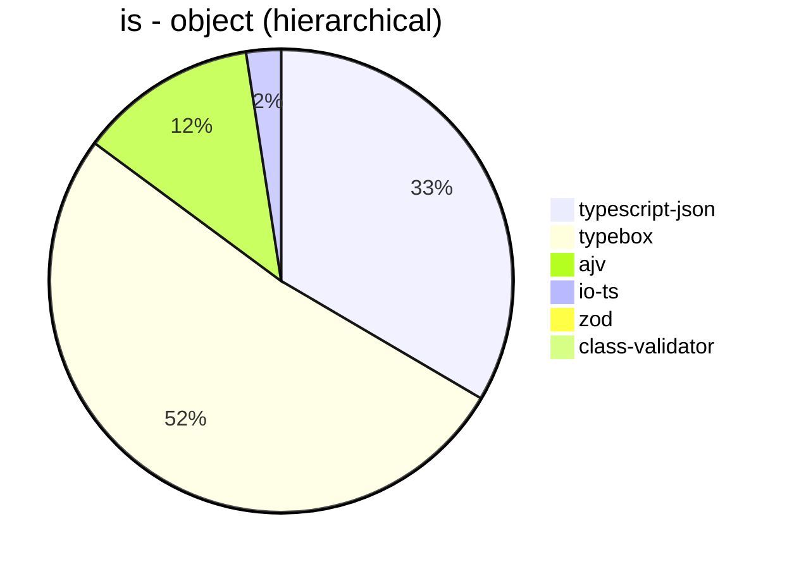
```mermaid
pie title is - object (hierarchical)
  "typescript-json": 111761.74682144832
  "typebox": 172630.19810815636
  "ajv": 41537.56079985588
  "io-ts": 8124.932102118414
  "zod": 376.022767698328
  "class-validator": 62.681686046511636
```

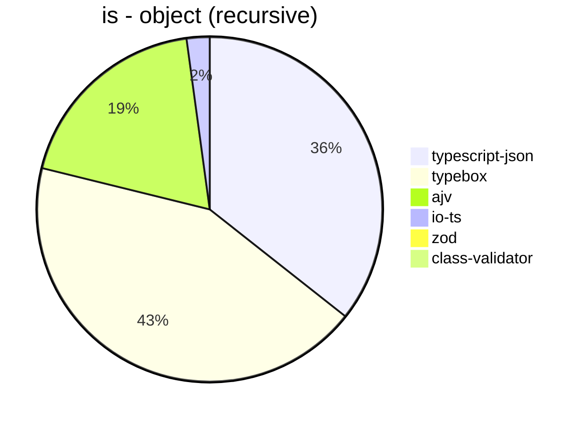
```mermaid
pie title is - object (recursive)
  "typescript-json": 69259.59577229743
  "typebox": 83967.53246753247
  "ajv": 36916.357566765575
  "io-ts": 4180.8413767983975
  "zod": 71.50858849887976
  "class-validator": 40
```

```mermaid
pie title is - object (union, explicit)
  "typescript-json": 16044.460509669256
  "typebox": 12158.848813305924
  "ajv": 6694.100240429073
  "io-ts": 3306.3923585598823
  "zod": 32.83527024534219
  "class-validator": 16.01914932793224
```

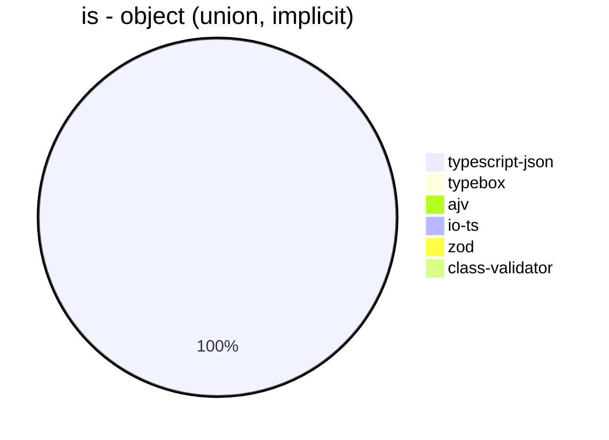
```mermaid
pie title is - object (union, implicit)
  "typescript-json": 14551.141470429626
  "typebox": 0
  "ajv": 0
  "io-ts": 0
  "zod": 18.467220683287167
  "class-validator": 15.352930162890845
```

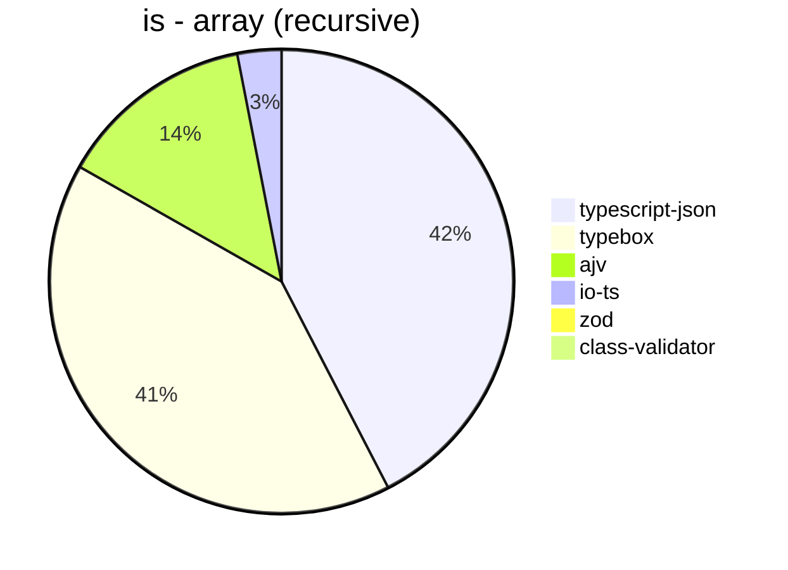
```mermaid
pie title is - array (recursive)
  "typescript-json": 6543.650064326411
  "typebox": 6299.339167708519
  "ajv": 2116.1856046766534
  "io-ts": 472.784111805811
  "zod": 8.862907788044502
  "class-validator": 3.325327914280436
```

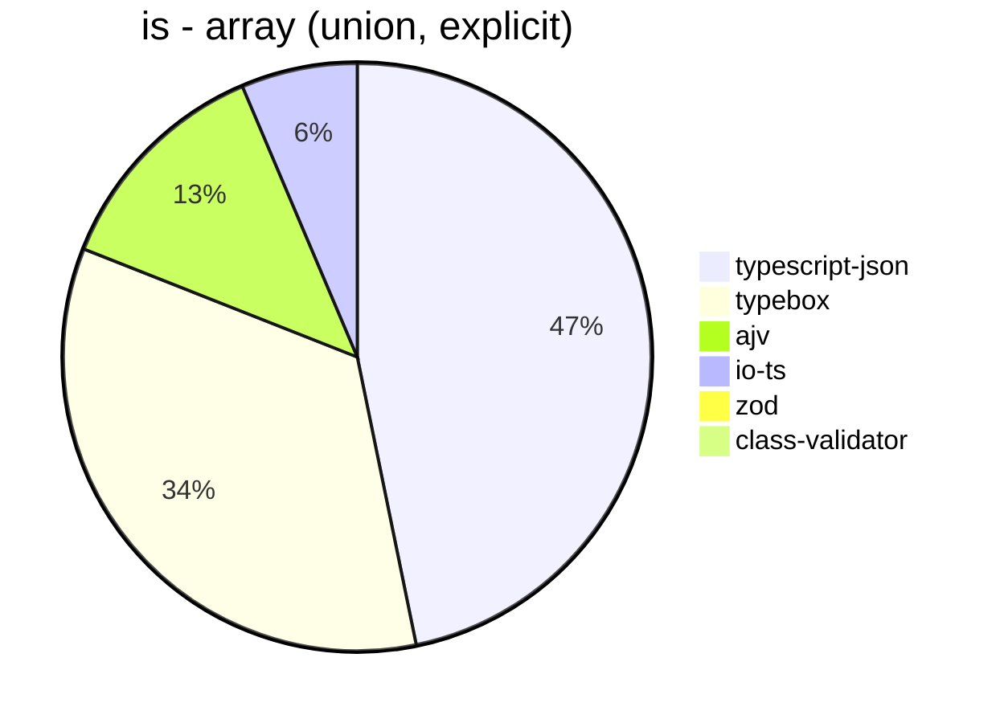
```mermaid
pie title is - array (union, explicit)
  "typescript-json": 2627.5584795321633
  "typebox": 1921.0139603232917
  "ajv": 709.0032154340836
  "io-ts": 358.6614901090775
  "zod": 2.833931607783865
  "class-validator": 7.951533510034078
```

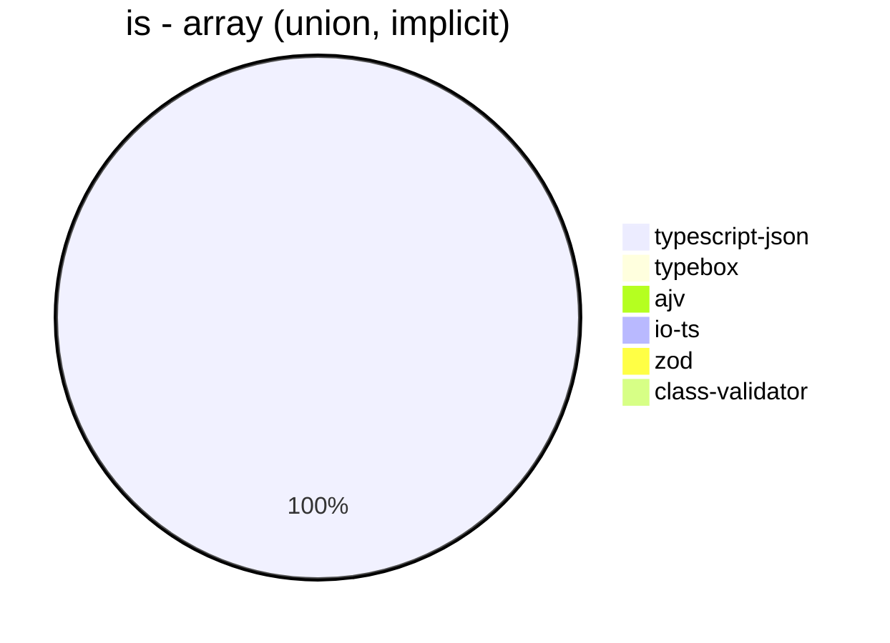
```mermaid
pie title is - array (union, implicit)
  "typescript-json": 1541.6967509025271
  "typebox": 0
  "ajv": 0
  "io-ts": 0
  "zod": 1.8284878405558602
  "class-validator": 4.908438738908816
```

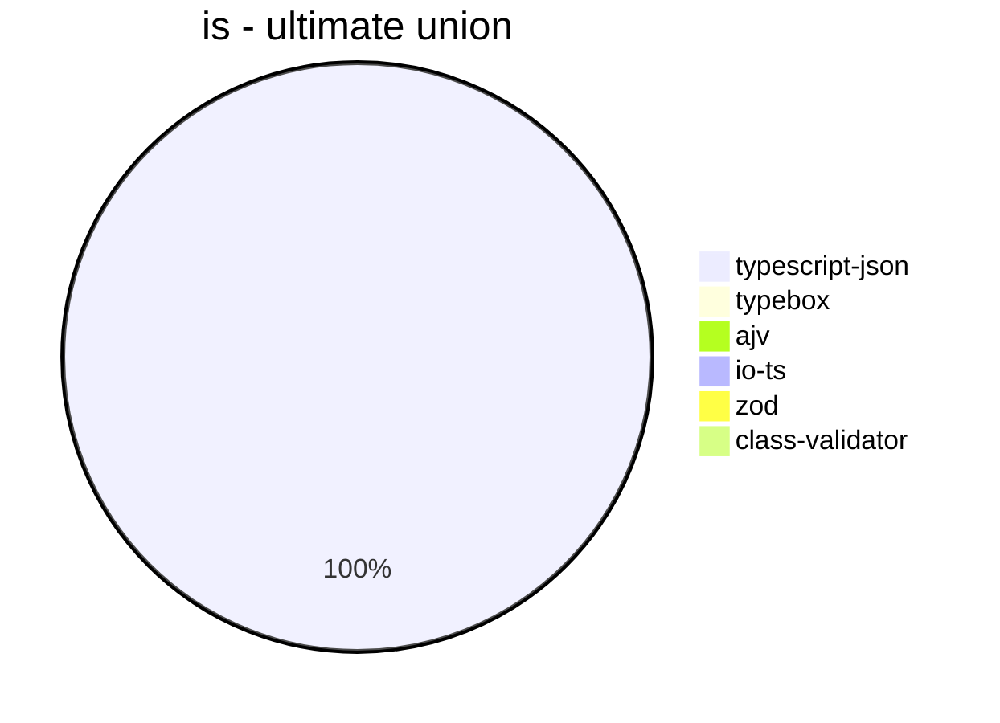
```mermaid
pie title is - ultimate union
  "typescript-json": 549.2520977745348
  "typebox": 0
  "ajv": 0
  "io-ts": 0
  "zod": 0.3562522265764161
  "class-validator": 0
```

## assert
 Components | typescript-json | typebox | io-ts | zod | class-validator 
------------|-----------------|---------|-------|-----|-----------------
object (hierarchical) | 21352.768070627182 | 747.4555804726583 | 3317.1732239418234 | 384.64398587097975 | 62.14894002536691
object (recursive) | 25638.297872340423 | 332.7868852459016 | 1624.0117668689097 | 70.26233718583747 | 38.97303287772442
object (union, explicit) | 4397.815623843021 | 149.18243615653134 | 1045.0254175744371 | 32.826861752016505 | 16.396497111980622
object (union, implicit) | 4364.976958525346 | Failed | Failed | 19.65188096574958 | 14.605120807789397
array (recursive) | 1519.5467422096317 | 35.950804162724694 | 168.7150837988827 | 9.056603773584905 | 3.3994334277620397
array (union, explicit) | 1915.793344364773 | 19.801980198019802 | 78.1981981981982 | 2.800074668657831 | 7.369614512471656
array (union, implicit) | 1131.6273932253314 | Failed | Failed | 1.689189189189189 | 4.715270221254987
ultimate union | 227.5460010930953 | Failed | Failed | 0.3561253561253562 | Failed

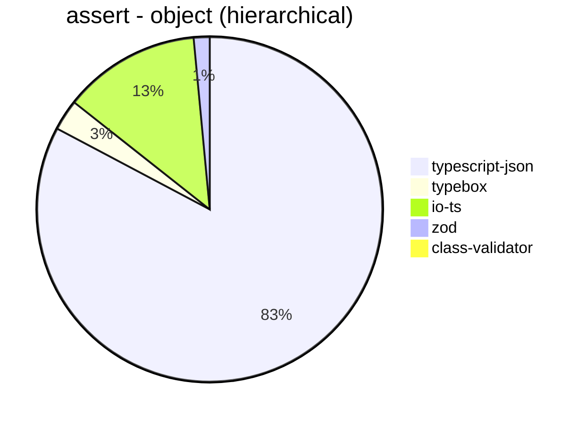
```mermaid
pie title assert - object (hierarchical)
  "typescript-json": 21352.768070627182
  "typebox": 747.4555804726583
  "io-ts": 3317.1732239418234
  "zod": 384.64398587097975
  "class-validator": 62.14894002536691
```

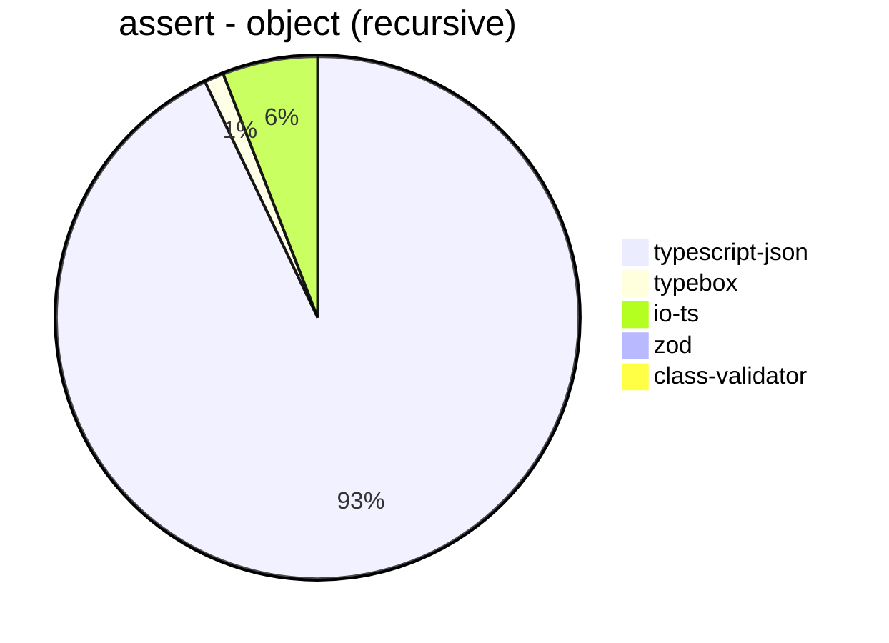
```mermaid
pie title assert - object (recursive)
  "typescript-json": 25638.297872340423
  "typebox": 332.7868852459016
  "io-ts": 1624.0117668689097
  "zod": 70.26233718583747
  "class-validator": 38.97303287772442
```

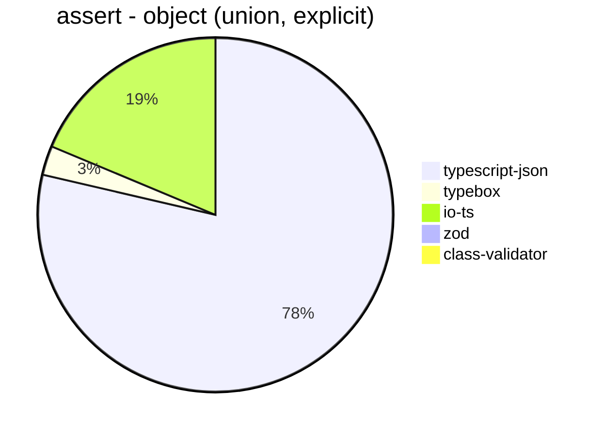
```mermaid
pie title assert - object (union, explicit)
  "typescript-json": 4397.815623843021
  "typebox": 149.18243615653134
  "io-ts": 1045.0254175744371
  "zod": 32.826861752016505
  "class-validator": 16.396497111980622
```

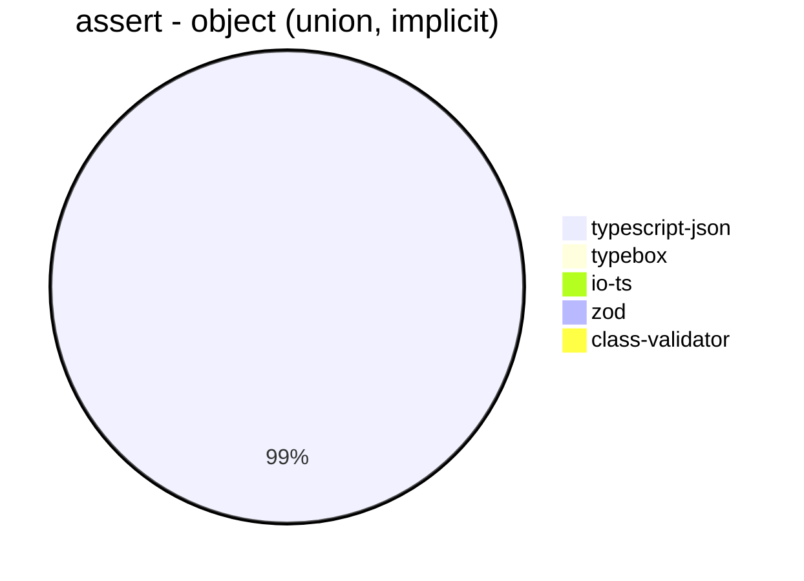
```mermaid
pie title assert - object (union, implicit)
  "typescript-json": 4364.976958525346
  "typebox": 0
  "io-ts": 0
  "zod": 19.65188096574958
  "class-validator": 14.605120807789397
```

```mermaid
pie title assert - array (recursive)
  "typescript-json": 1519.5467422096317
  "typebox": 35.950804162724694
  "io-ts": 168.7150837988827
  "zod": 9.056603773584905
  "class-validator": 3.3994334277620397
```

```mermaid
pie title assert - array (union, explicit)
  "typescript-json": 1915.793344364773
  "typebox": 19.801980198019802
  "io-ts": 78.1981981981982
  "zod": 2.800074668657831
  "class-validator": 7.369614512471656
```

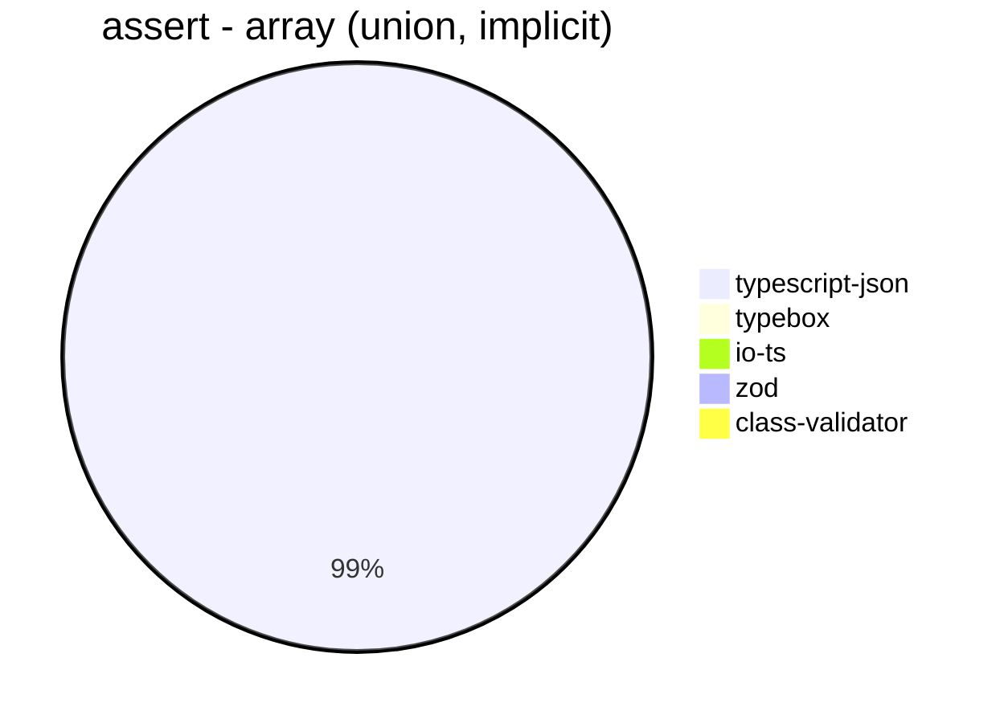
```mermaid
pie title assert - array (union, implicit)
  "typescript-json": 1131.6273932253314
  "typebox": 0
  "io-ts": 0
  "zod": 1.689189189189189
  "class-validator": 4.715270221254987
```

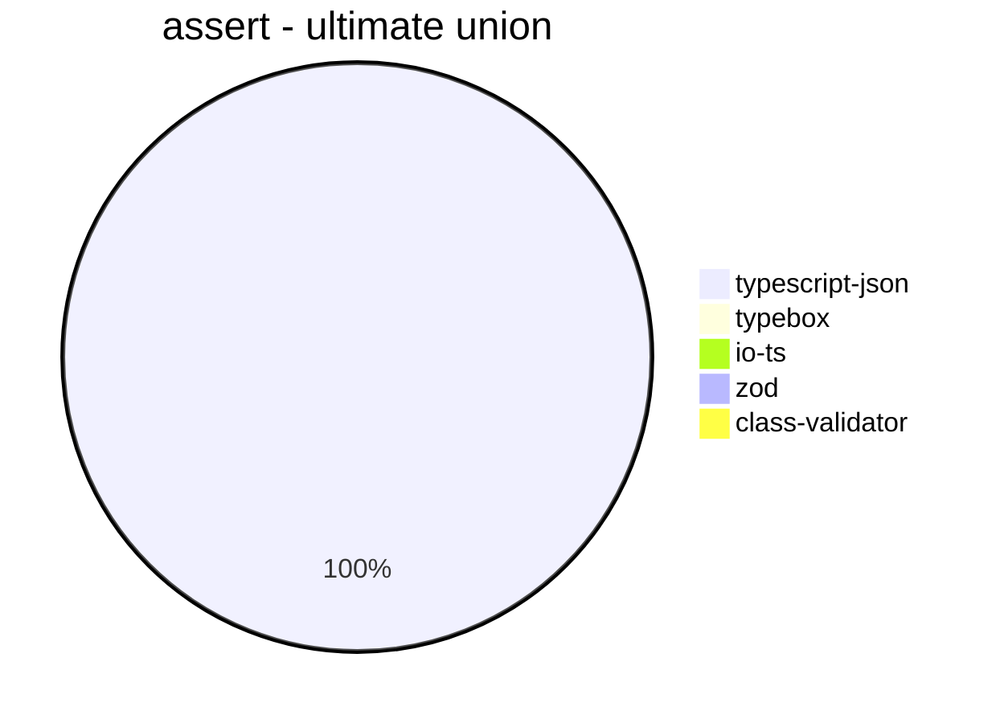
```mermaid
pie title assert - ultimate union
  "typescript-json": 227.5460010930953
  "typebox": 0
  "io-ts": 0
  "zod": 0.3561253561253562
  "class-validator": 0
```

## valiadate
 Components | typescript-json | typebox | io-ts | zod | class-validator 
------------|-----------------|---------|-------|-----|-----------------
object (hierarchical) | 16432.237079869898 | 826.4017823988117 | 3290.490341753343 | 399.9243284146803 | 60.19945602901179
object (recursive) | 15842.967599410897 | 335.57926258656187 | 1612.7722406792175 | 74.42387608613525 | 40.5780989438577
object (union, explicit) | 3373.4455010972933 | 156.04274134119382 | 1143.8862209087551 | 33.358181140514354 | 15.898825654923215
object (union, implicit) | 3251.8585675430645 | Failed | Failed | 16.414371694327922 | 15.126050420168067
array (recursive) | 892.4750679963736 | 35.04241977130211 | 160.88791047514218 | 8.527994067482387 | 3.580851865812288
array (union, explicit) | 1583.5557928457022 | 20.61270801815431 | 76.09302325581395 | 2.8280542986425337 | 7.315288953913679
array (union, implicit) | 784.1480948957584 | Failed | Failed | 1.8611576400521124 | 4.895499905855771
ultimate union | 134.14634146341464 | Failed | Failed | 0.35454706612302783 | Failed

```mermaid
pie title valiadate - object (hierarchical)
  "typescript-json": 16432.237079869898
  "typebox": 826.4017823988117
  "io-ts": 3290.490341753343
  "zod": 399.9243284146803
  "class-validator": 60.19945602901179
```

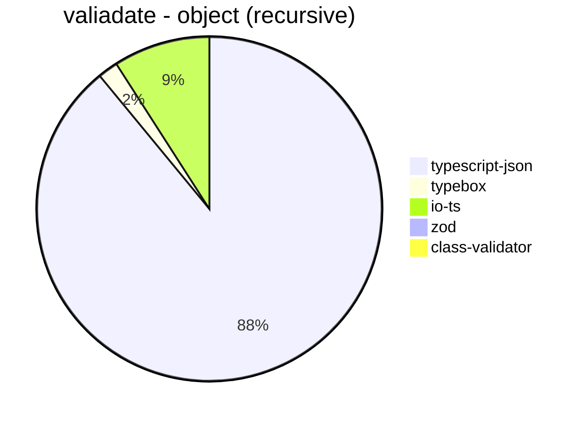
```mermaid
pie title valiadate - object (recursive)
  "typescript-json": 15842.967599410897
  "typebox": 335.57926258656187
  "io-ts": 1612.7722406792175
  "zod": 74.42387608613525
  "class-validator": 40.5780989438577
```

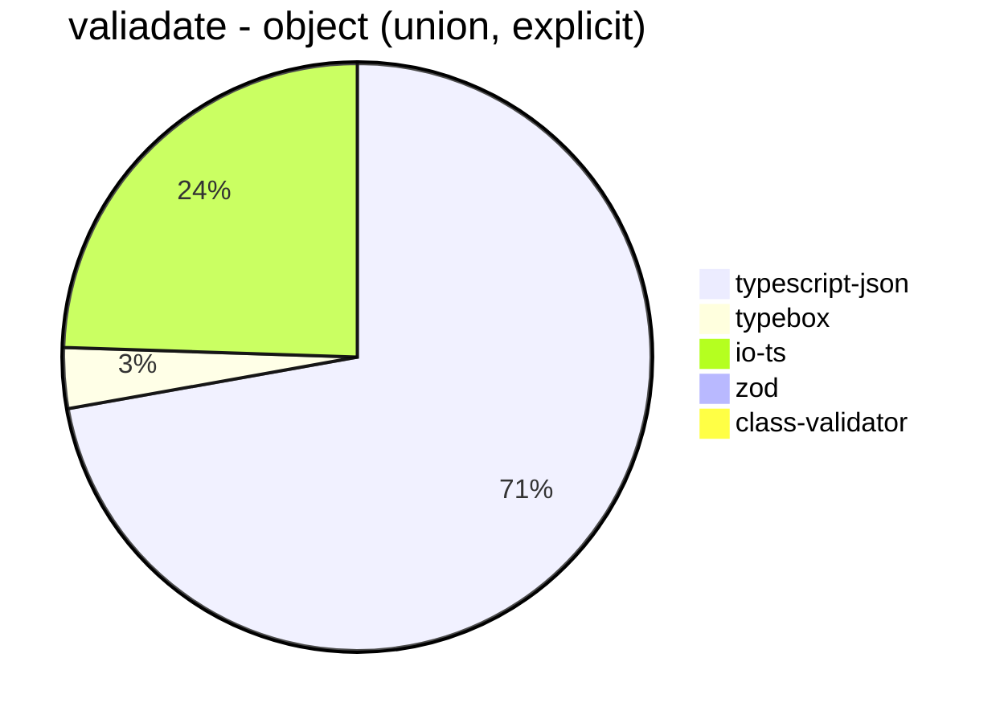
```mermaid
pie title valiadate - object (union, explicit)
  "typescript-json": 3373.4455010972933
  "typebox": 156.04274134119382
  "io-ts": 1143.8862209087551
  "zod": 33.358181140514354
  "class-validator": 15.898825654923215
```

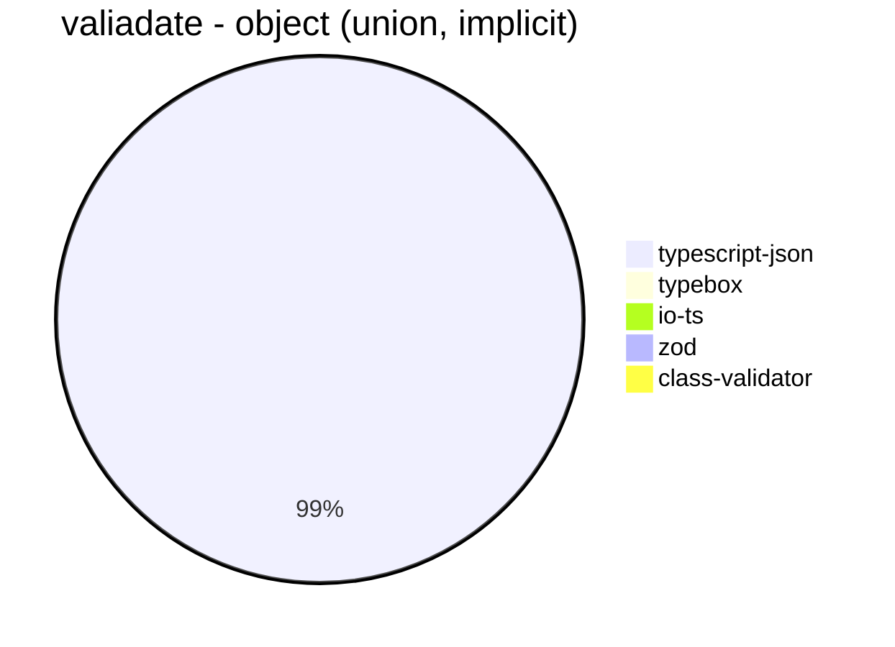
```mermaid
pie title valiadate - object (union, implicit)
  "typescript-json": 3251.8585675430645
  "typebox": 0
  "io-ts": 0
  "zod": 16.414371694327922
  "class-validator": 15.126050420168067
```

```mermaid
pie title valiadate - array (recursive)
  "typescript-json": 892.4750679963736
  "typebox": 35.04241977130211
  "io-ts": 160.88791047514218
  "zod": 8.527994067482387
  "class-validator": 3.580851865812288
```

```mermaid
pie title valiadate - array (union, explicit)
  "typescript-json": 1583.5557928457022
  "typebox": 20.61270801815431
  "io-ts": 76.09302325581395
  "zod": 2.8280542986425337
  "class-validator": 7.315288953913679
```

```mermaid
pie title valiadate - array (union, implicit)
  "typescript-json": 784.1480948957584
  "typebox": 0
  "io-ts": 0
  "zod": 1.8611576400521124
  "class-validator": 4.895499905855771
```

```mermaid
pie title valiadate - ultimate union
  "typescript-json": 134.14634146341464
  "typebox": 0
  "io-ts": 0
  "zod": 0.35454706612302783
  "class-validator": 0
```

## optimizer
 Components | typescript-json | typebox | ajv 
------------|-----------------|---------|-----
object (hierarchical) | 95835.24277141299 | 183.42981186685964 | 4.705030763662686
object (recursive) | 66020.51188963513 | 758.9961247462631 | 8.52325365944043
object (union) | 12671.068850149673 | 79.67332123411978 | 4.114456704694221
array (hierarchical) | 3498.81624476416 | 959.0521327014218 | 6.099815157116451
array (recursive) | 5398.173515981735 | 735.169880624426 | 8.86959803736554
array (union) | 3563.639679066375 | 234.0151096370002 | 5.896443707388982
ultimate union | 532.5581395348837 | 11.198825041307142 | 0.9033423667570009

```mermaid
pie title optimizer - object (hierarchical)
  "typescript-json": 95835.24277141299
  "typebox": 183.42981186685964
  "ajv": 4.705030763662686
```

```mermaid
pie title optimizer - object (recursive)
  "typescript-json": 66020.51188963513
  "typebox": 758.9961247462631
  "ajv": 8.52325365944043
```

```mermaid
pie title optimizer - object (union)
  "typescript-json": 12671.068850149673
  "typebox": 79.67332123411978
  "ajv": 4.114456704694221
```

```mermaid
pie title optimizer - array (hierarchical)
  "typescript-json": 3498.81624476416
  "typebox": 959.0521327014218
  "ajv": 6.099815157116451
```

```mermaid
pie title optimizer - array (recursive)
  "typescript-json": 5398.173515981735
  "typebox": 735.169880624426
  "ajv": 8.86959803736554
```

```mermaid
pie title optimizer - array (union)
  "typescript-json": 3563.639679066375
  "typebox": 234.0151096370002
  "ajv": 5.896443707388982
```

```mermaid
pie title optimizer - ultimate union
  "typescript-json": 532.5581395348837
  "typebox": 11.198825041307142
  "ajv": 0.9033423667570009
```

## stringify
 Components | typescript-json | fast-json-stringify | JSON.stringify() 
------------|-----------------|---------------------|------------------
object (simple) | 104171.58671586716 | 26316.65729810755 | 5995.185185185185
object (hierarchical) | 4467.621984400508 | 4268.631499906139 | 1538.0414312617704
object (recursive) | 5181.988391686949 | 1231.6890881913303 | 1242.0620097123647
object (union) | 1376.3559477845192 | 1270.2357025397405 | 684.2304060434373
array (hierarchical) | 102.11202938475665 | 131.99785369343587 | 52.37651444547996
array (recursive) | 246.05504587155963 | 127.02853945159485 | 124.17582417582418
array (union) | 307.5804399200145 | 231.10229117806242 | 271.9215538374505
ultimate union | 117.13665943600867 | 62.821833161688986 | 182.34442836468887

```mermaid
pie title stringify - object (simple)
  "typescript-json": 104171.58671586716
  "fast-json-stringify": 26316.65729810755
  "JSON.stringify()": 5995.185185185185
```

```mermaid
pie title stringify - object (hierarchical)
  "typescript-json": 4467.621984400508
  "fast-json-stringify": 4268.631499906139
  "JSON.stringify()": 1538.0414312617704
```

```mermaid
pie title stringify - object (recursive)
  "typescript-json": 5181.988391686949
  "fast-json-stringify": 1231.6890881913303
  "JSON.stringify()": 1242.0620097123647
```

```mermaid
pie title stringify - object (union)
  "typescript-json": 1376.3559477845192
  "fast-json-stringify": 1270.2357025397405
  "JSON.stringify()": 684.2304060434373
```

```mermaid
pie title stringify - array (hierarchical)
  "typescript-json": 102.11202938475665
  "fast-json-stringify": 131.99785369343587
  "JSON.stringify()": 52.37651444547996
```

```mermaid
pie title stringify - array (recursive)
  "typescript-json": 246.05504587155963
  "fast-json-stringify": 127.02853945159485
  "JSON.stringify()": 124.17582417582418
```

```mermaid
pie title stringify - array (union)
  "typescript-json": 307.5804399200145
  "fast-json-stringify": 231.10229117806242
  "JSON.stringify()": 271.9215538374505
```

```mermaid
pie title stringify - ultimate union
  "typescript-json": 117.13665943600867
  "fast-json-stringify": 62.821833161688986
  "JSON.stringify()": 182.34442836468887
```

