# Benchmark of `typescript-json`
> CPU: 11th Gen Intel(R) Core(TM) i5-1135G7 @ 2.40GHz
> Memory: 16,218 MB
> NodeJS version: v16.17.1
> TypeScript-JSON version: 3.3.12

## is
 Components | typescript-json | io-ts | class-validator | zod | ajv 
------------|-----------------|-------|-----------------|-----|-----
object (hierarchical) | 107745.86137893397 | 8428.597549826292 | 63.163577469857835 | 397.9276495182694 | 75593.20155181969
object (recursive) | 68240.71349760942 | 4308.773903262093 | 39.65485588397283 | 71.8595721338453 | Failed
object (union, explicit) | 13912.822375590265 | 3233.235077376566 | 16.473569876900797 | 34.20256991685563 | 1097.1593993124661
object (union, implicit) | 14172.846237731734 | 3212.3212321232127 | 17.045454545454543 | 51.97233127687418 | Failed
array (recursive) | 6980.918727915194 | 450.06509205876887 | 3.5754610462928116 | 8.961911874533234 | Failed
array (union, explicit) | 3796.7836257309937 | 389.99055712936735 | 7.553426676492262 | 2.80688622754491 | Failed
array (union, implicit) | 3677.155329210622 | 448.6016628873772 | 9.33009889904833 | 3.5694157430020663 | Failed
ultimate union | 626.9251676028266 | Failed | Failed | Failed | Failed

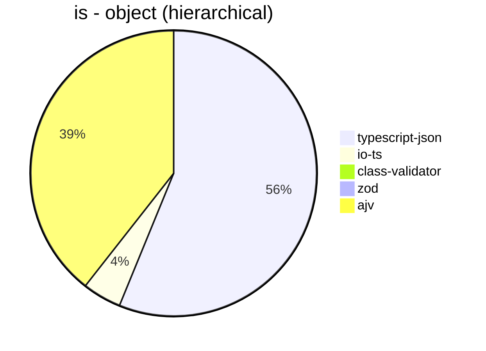
```mermaid
pie title is - object (hierarchical)
  "typescript-json": 107745.86137893397
  "io-ts": 8428.597549826292
  "class-validator": 63.163577469857835
  "zod": 397.9276495182694
  "ajv": 75593.20155181969
```

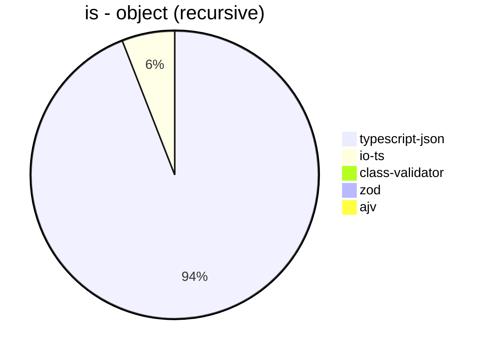
```mermaid
pie title is - object (recursive)
  "typescript-json": 68240.71349760942
  "io-ts": 4308.773903262093
  "class-validator": 39.65485588397283
  "zod": 71.8595721338453
  "ajv": 0
```

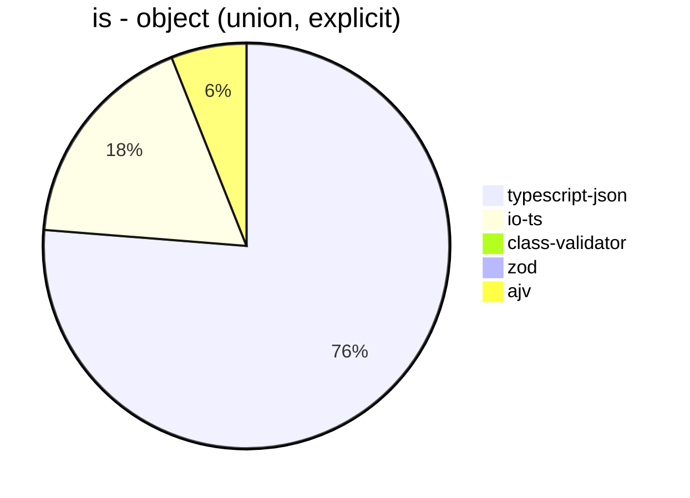
```mermaid
pie title is - object (union, explicit)
  "typescript-json": 13912.822375590265
  "io-ts": 3233.235077376566
  "class-validator": 16.473569876900797
  "zod": 34.20256991685563
  "ajv": 1097.1593993124661
```

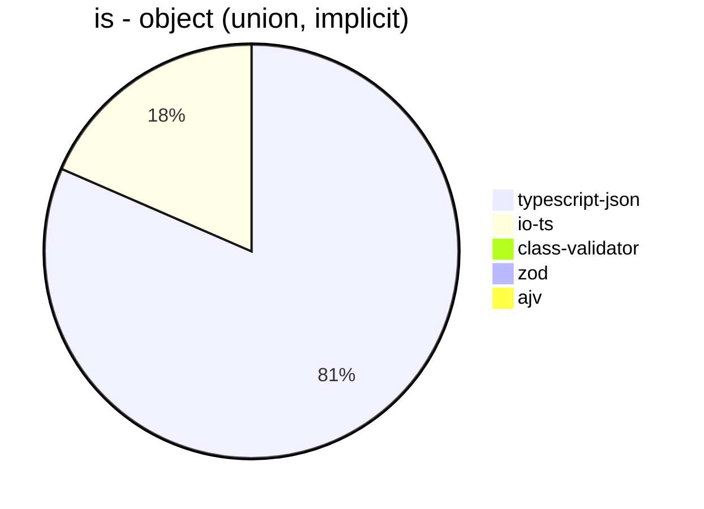
```mermaid
pie title is - object (union, implicit)
  "typescript-json": 14172.846237731734
  "io-ts": 3212.3212321232127
  "class-validator": 17.045454545454543
  "zod": 51.97233127687418
  "ajv": 0
```

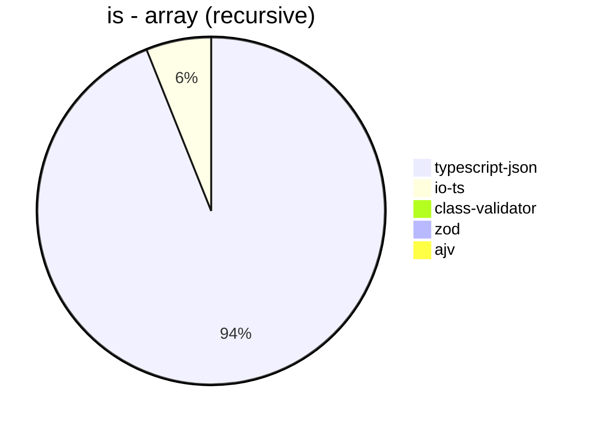
```mermaid
pie title is - array (recursive)
  "typescript-json": 6980.918727915194
  "io-ts": 450.06509205876887
  "class-validator": 3.5754610462928116
  "zod": 8.961911874533234
  "ajv": 0
```

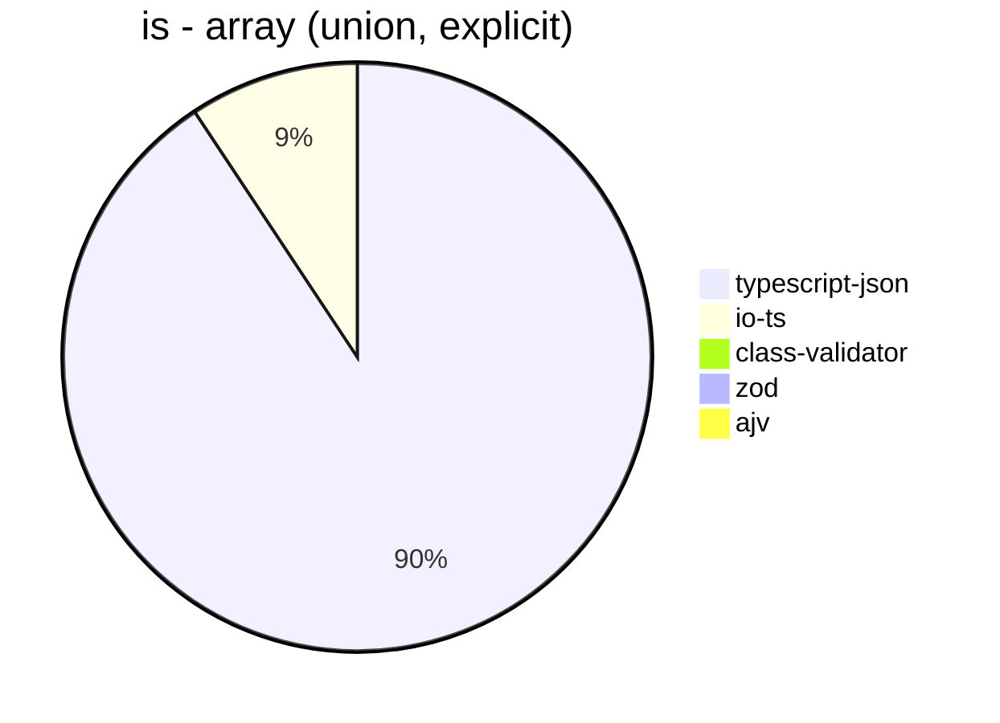
```mermaid
pie title is - array (union, explicit)
  "typescript-json": 3796.7836257309937
  "io-ts": 389.99055712936735
  "class-validator": 7.553426676492262
  "zod": 2.80688622754491
  "ajv": 0
```

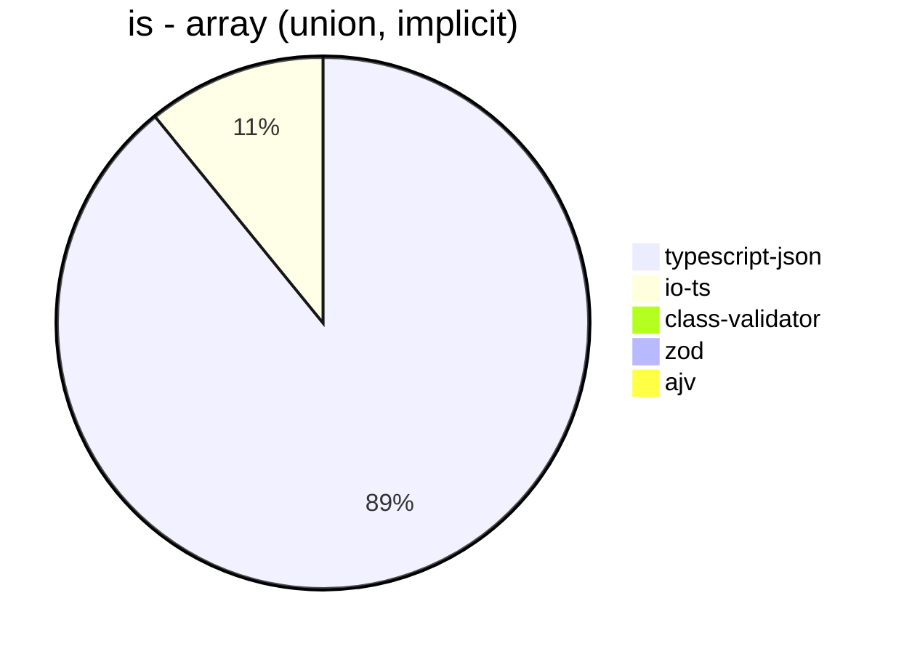
```mermaid
pie title is - array (union, implicit)
  "typescript-json": 3677.155329210622
  "io-ts": 448.6016628873772
  "class-validator": 9.33009889904833
  "zod": 3.5694157430020663
  "ajv": 0
```

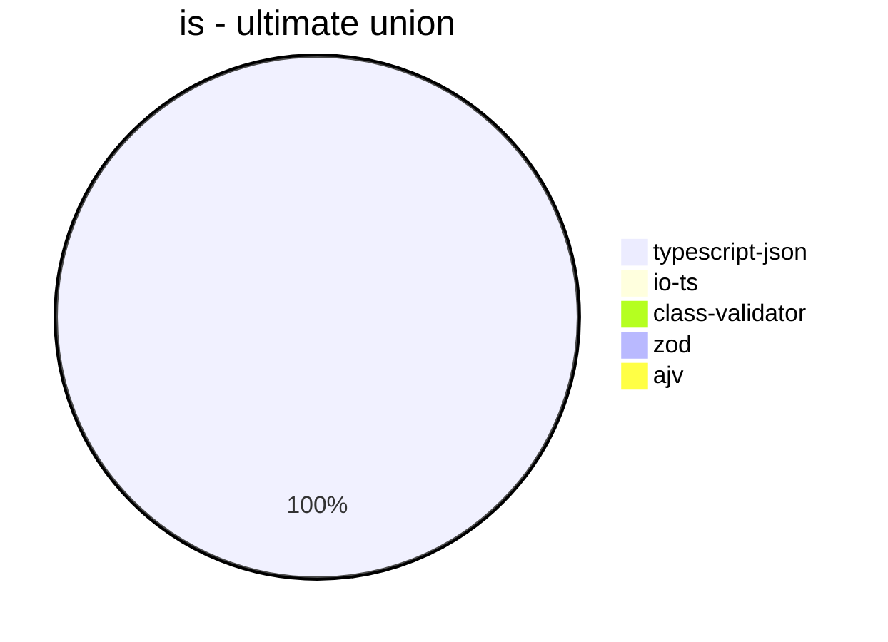
```mermaid
pie title is - ultimate union
  "typescript-json": 626.9251676028266
  "io-ts": 0
  "class-validator": 0
  "zod": 0
  "ajv": 0
```

## assert
 Components | typescript-json | class-validator | io-ts | zod 
------------|-----------------|-----------------|-------|-----
object (hierarchical) | 19591.43327841845 | 64.64088397790056 | 3607.6825050063717 | 407.8201737816396
object (recursive) | 29092.92778503452 | 40.84249084249084 | 1518.6848724398133 | 73.6150234741784
object (union, explicit) | 4357.40878629933 | 17.024426350851222 | 1120.6558545713776 | 34.03777819337946
object (union, implicit) | 3955.8432346160666 | 17.266715650257165 | 746.3677130044842 | 51.424343322234556
array (recursive) | 1399.0221887927794 | 3.762935089369708 | 158.32106038291604 | 9.297912713472487
array (union, explicit) | 1979.3908444282329 | 7.547864506627393 | 75.03660322108345 | 2.8084628346751543
array (union, implicit) | 1737.8818364733859 | 9.279881217520416 | 94.04332129963899 | 3.6018957345971563
ultimate union | 249.2340962335556 | Failed | Failed | Failed

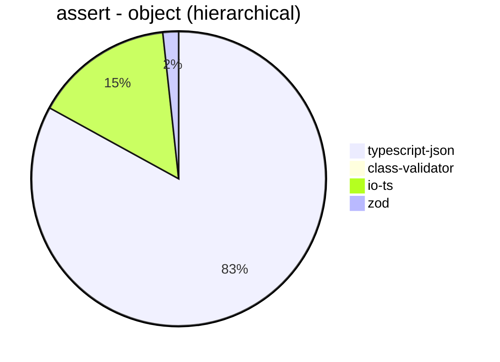
```mermaid
pie title assert - object (hierarchical)
  "typescript-json": 19591.43327841845
  "class-validator": 64.64088397790056
  "io-ts": 3607.6825050063717
  "zod": 407.8201737816396
```

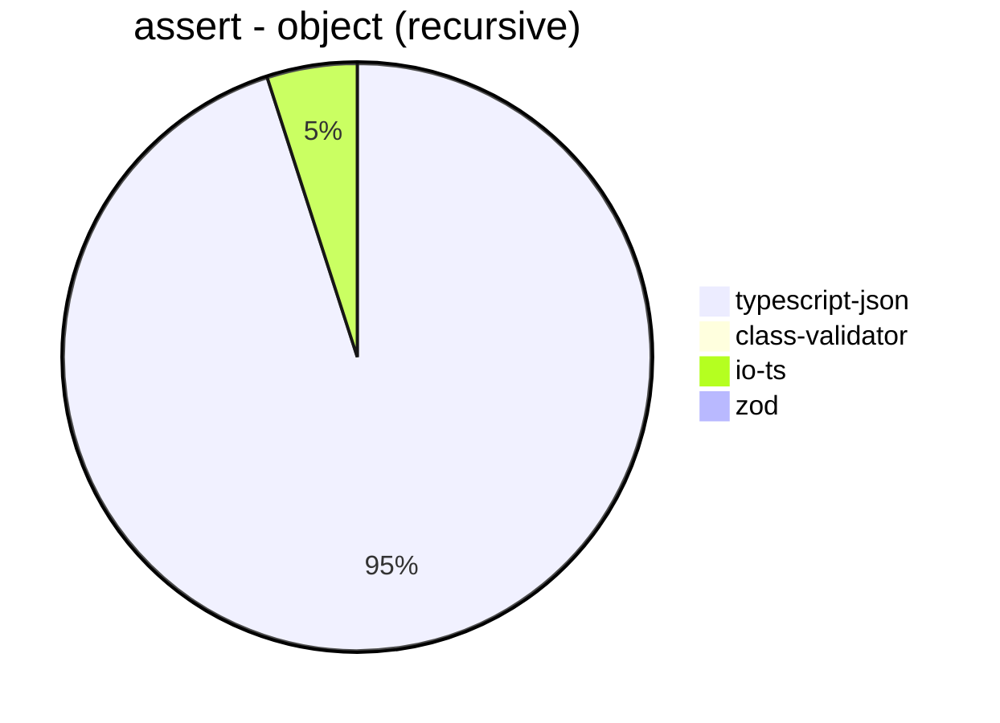
```mermaid
pie title assert - object (recursive)
  "typescript-json": 29092.92778503452
  "class-validator": 40.84249084249084
  "io-ts": 1518.6848724398133
  "zod": 73.6150234741784
```

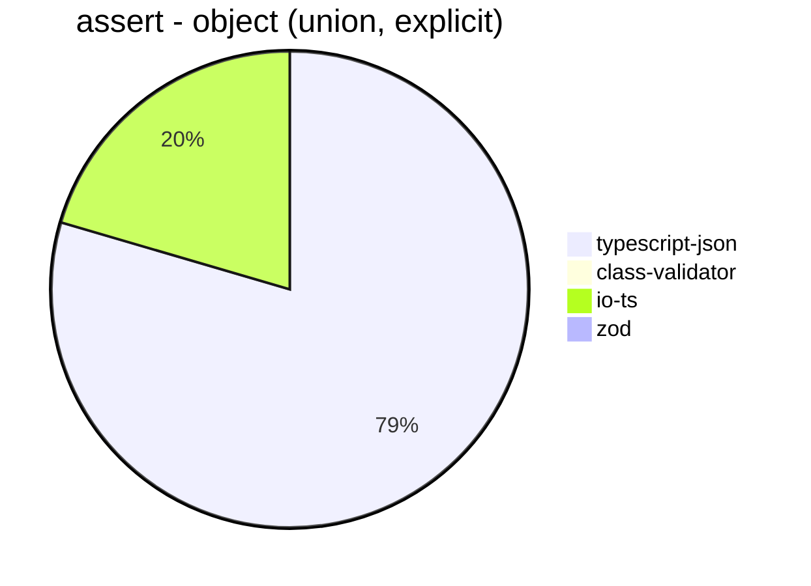
```mermaid
pie title assert - object (union, explicit)
  "typescript-json": 4357.40878629933
  "class-validator": 17.024426350851222
  "io-ts": 1120.6558545713776
  "zod": 34.03777819337946
```

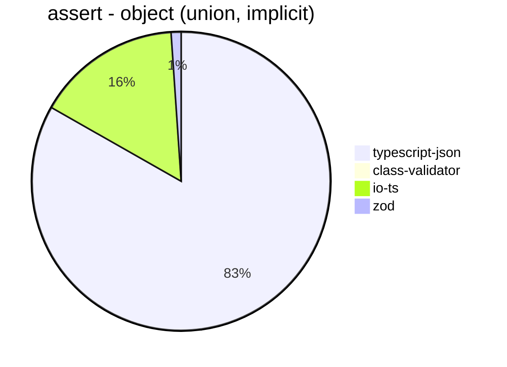
```mermaid
pie title assert - object (union, implicit)
  "typescript-json": 3955.8432346160666
  "class-validator": 17.266715650257165
  "io-ts": 746.3677130044842
  "zod": 51.424343322234556
```

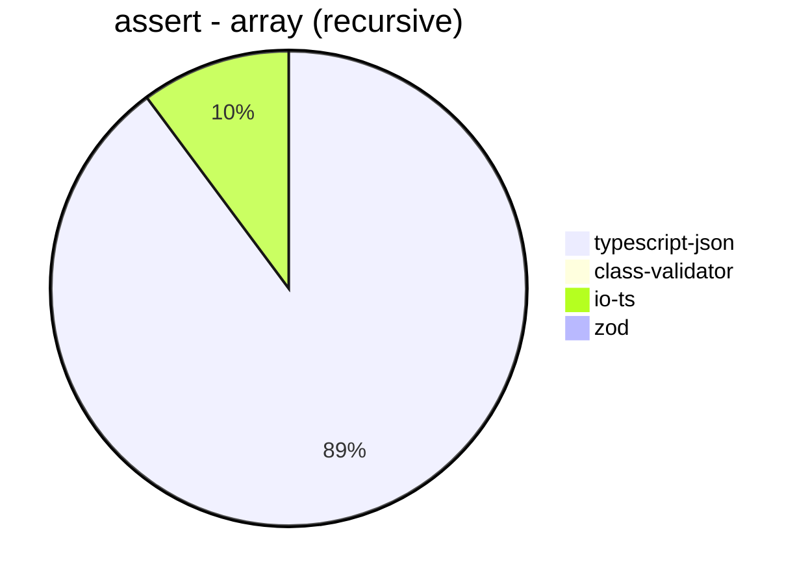
```mermaid
pie title assert - array (recursive)
  "typescript-json": 1399.0221887927794
  "class-validator": 3.762935089369708
  "io-ts": 158.32106038291604
  "zod": 9.297912713472487
```

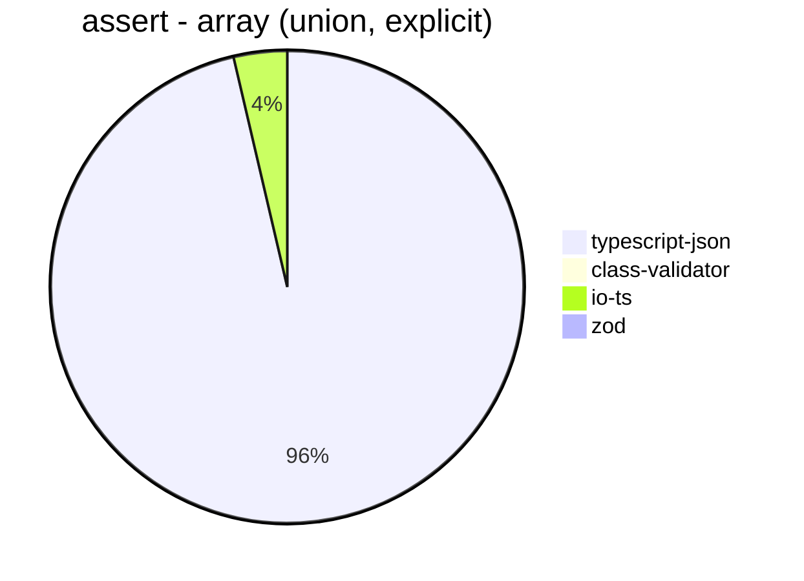
```mermaid
pie title assert - array (union, explicit)
  "typescript-json": 1979.3908444282329
  "class-validator": 7.547864506627393
  "io-ts": 75.03660322108345
  "zod": 2.8084628346751543
```

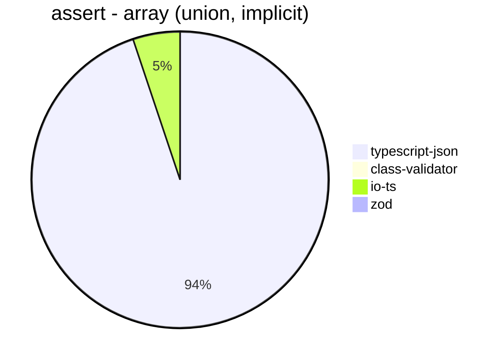
```mermaid
pie title assert - array (union, implicit)
  "typescript-json": 1737.8818364733859
  "class-validator": 9.279881217520416
  "io-ts": 94.04332129963899
  "zod": 3.6018957345971563
```

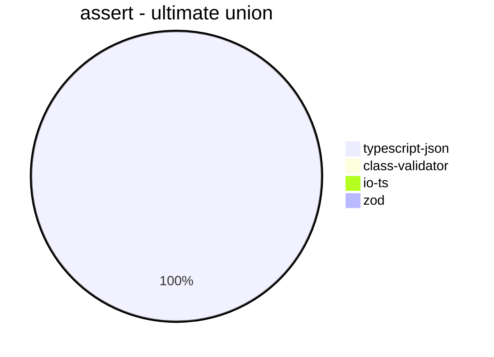
```mermaid
pie title assert - ultimate union
  "typescript-json": 249.2340962335556
  "class-validator": 0
  "io-ts": 0
  "zod": 0
```

## valiadate
 Components | typescript-json | class-validator | io-ts | zod 
------------|-----------------|-----------------|-------|-----
object (hierarchical) | 15380.094614264919 | 63.89600878798975 | 3383.6095764272563 | 396.24395686128673
object (recursive) | 15268.875611080935 | 40.90992478444323 | 1423.3494964565461 | 70.84764142418217
object (union, explicit) | 3364.9674620390456 | 16.65141811527905 | 1075.3275109170304 | 34.353294537263
object (union, implicit) | 3900.314989809153 | 17.014270032930845 | 735.8146323663565 | 52.462728816757874
array (recursive) | 923.9068710959681 | 3.750234389649353 | 157.24815724815724 | 9.313818665652917
array (union, explicit) | 1632.2639780018333 | 7.546475243879993 | 73.90983000739098 | 2.810567734682406
array (union, implicit) | 1463.3093525179856 | 9.1424392027793 | 98.27456864216055 | 3.5795026375282593
ultimate union | 142.42370158843477 | Failed | Failed | Failed

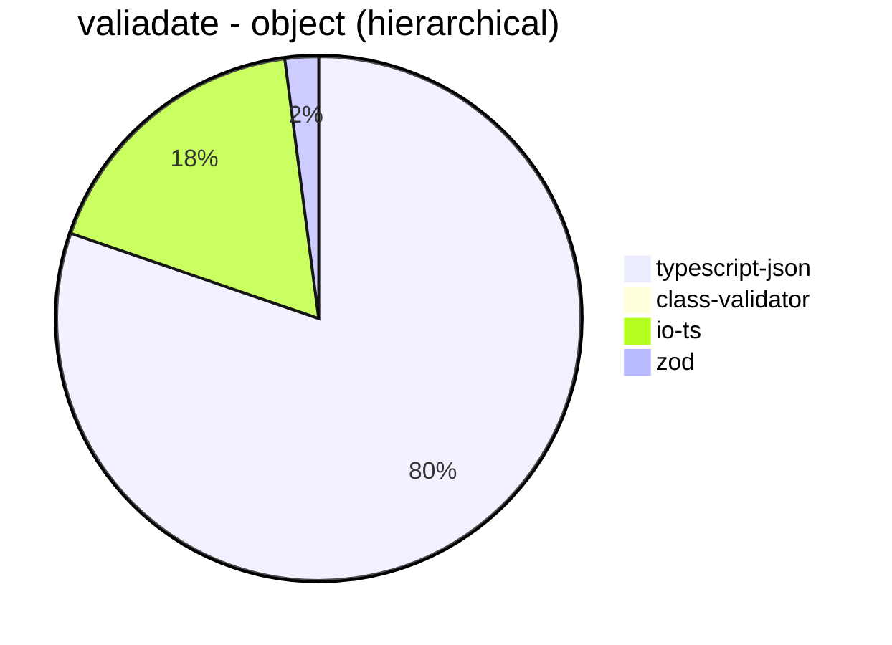
```mermaid
pie title valiadate - object (hierarchical)
  "typescript-json": 15380.094614264919
  "class-validator": 63.89600878798975
  "io-ts": 3383.6095764272563
  "zod": 396.24395686128673
```

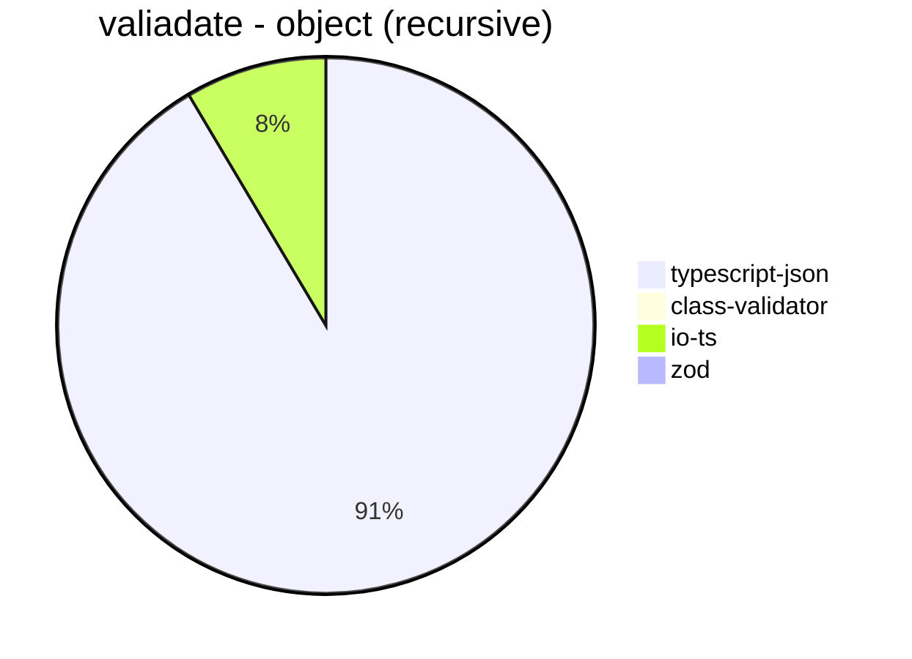
```mermaid
pie title valiadate - object (recursive)
  "typescript-json": 15268.875611080935
  "class-validator": 40.90992478444323
  "io-ts": 1423.3494964565461
  "zod": 70.84764142418217
```

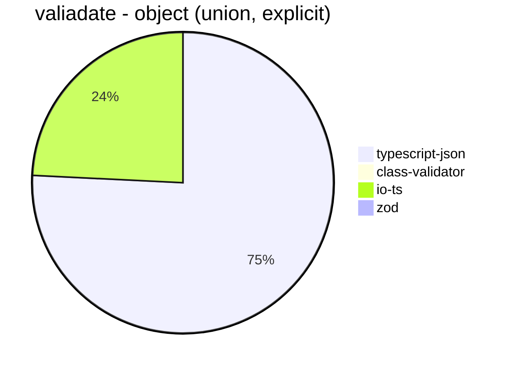
```mermaid
pie title valiadate - object (union, explicit)
  "typescript-json": 3364.9674620390456
  "class-validator": 16.65141811527905
  "io-ts": 1075.3275109170304
  "zod": 34.353294537263
```

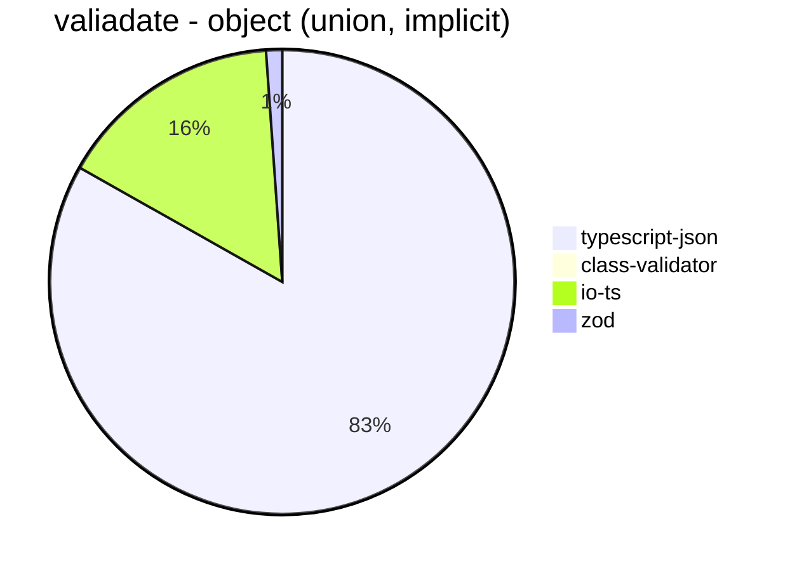
```mermaid
pie title valiadate - object (union, implicit)
  "typescript-json": 3900.314989809153
  "class-validator": 17.014270032930845
  "io-ts": 735.8146323663565
  "zod": 52.462728816757874
```

```mermaid
pie title valiadate - array (recursive)
  "typescript-json": 923.9068710959681
  "class-validator": 3.750234389649353
  "io-ts": 157.24815724815724
  "zod": 9.313818665652917
```

```mermaid
pie title valiadate - array (union, explicit)
  "typescript-json": 1632.2639780018333
  "class-validator": 7.546475243879993
  "io-ts": 73.90983000739098
  "zod": 2.810567734682406
```

```mermaid
pie title valiadate - array (union, implicit)
  "typescript-json": 1463.3093525179856
  "class-validator": 9.1424392027793
  "io-ts": 98.27456864216055
  "zod": 3.5795026375282593
```

```mermaid
pie title valiadate - ultimate union
  "typescript-json": 142.42370158843477
  "class-validator": 0
  "io-ts": 0
  "zod": 0
```

## optimizer
 Components | typescript-json | fast-json-stringify | JSON.stringify() 
------------|-----------------|---------------------|------------------
object (simple) | 96501.73199635369 | 30.12808948222984 | 6140.140711161817
object (hierarchical) | 4497.018263138279 | 11.166945840312675 | 1540.9005628517823
object (recursive) | 4517.10407239819 | 73.7583395107487 | 1250.0473215975771
object (union) | 1932.3662737987308 | 1.0877447425670776 | 943.0332461710871
array (hierarchical) | 82.5198010683367 | 9.331840238895111 | 41.69769173492182
array (recursive) | 240.26696329254727 | 49.68248038849458 | 134.07202216066483
array (union) | 283.1890331890332 | 2.3844460748349228 | 275.04725897920605
ultimate union | 118.64406779661016 | 0.16744809109176154 | 193.0016402405686

```mermaid
pie title optimizer - object (simple)
  "typescript-json": 96501.73199635369
  "fast-json-stringify": 30.12808948222984
  "JSON.stringify()": 6140.140711161817
```

```mermaid
pie title optimizer - object (hierarchical)
  "typescript-json": 4497.018263138279
  "fast-json-stringify": 11.166945840312675
  "JSON.stringify()": 1540.9005628517823
```

```mermaid
pie title optimizer - object (recursive)
  "typescript-json": 4517.10407239819
  "fast-json-stringify": 73.7583395107487
  "JSON.stringify()": 1250.0473215975771
```

```mermaid
pie title optimizer - object (union)
  "typescript-json": 1932.3662737987308
  "fast-json-stringify": 1.0877447425670776
  "JSON.stringify()": 943.0332461710871
```

```mermaid
pie title optimizer - array (hierarchical)
  "typescript-json": 82.5198010683367
  "fast-json-stringify": 9.331840238895111
  "JSON.stringify()": 41.69769173492182
```

```mermaid
pie title optimizer - array (recursive)
  "typescript-json": 240.26696329254727
  "fast-json-stringify": 49.68248038849458
  "JSON.stringify()": 134.07202216066483
```

```mermaid
pie title optimizer - array (union)
  "typescript-json": 283.1890331890332
  "fast-json-stringify": 2.3844460748349228
  "JSON.stringify()": 275.04725897920605
```

```mermaid
pie title optimizer - ultimate union
  "typescript-json": 118.64406779661016
  "fast-json-stringify": 0.16744809109176154
  "JSON.stringify()": 193.0016402405686
```

## stringify
 Components | typescript-json | fast-json-stringify | JSON.stringify() 
------------|-----------------|---------------------|------------------
object (simple) | 96213.79188087219 | 25371.42333088775 | 6108.047270680922
object (hierarchical) | 4486.336845865333 | 4285.077123211298 | 1519.3769701464862
object (recursive) | 4958.478141576734 | 1260.0683890577507 | 1256.1827449499717
object (union) | 1849.8931623931626 | 1321.4806710430344 | 936.6236679753224
array (hierarchical) | 106.98447893569845 | 134.41734417344173 | 55.721207603429
array (recursive) | 243.62709395484342 | 133.4324475004646 | 130.9611151870873
array (union) | 303.1819806936003 | 239.09380265867813 | 270.8761442181954
ultimate union | 125.04498020870817 | 66.04426002766252 | 195.97069597069597

```mermaid
pie title stringify - object (simple)
  "typescript-json": 96213.79188087219
  "fast-json-stringify": 25371.42333088775
  "JSON.stringify()": 6108.047270680922
```

```mermaid
pie title stringify - object (hierarchical)
  "typescript-json": 4486.336845865333
  "fast-json-stringify": 4285.077123211298
  "JSON.stringify()": 1519.3769701464862
```

```mermaid
pie title stringify - object (recursive)
  "typescript-json": 4958.478141576734
  "fast-json-stringify": 1260.0683890577507
  "JSON.stringify()": 1256.1827449499717
```

```mermaid
pie title stringify - object (union)
  "typescript-json": 1849.8931623931626
  "fast-json-stringify": 1321.4806710430344
  "JSON.stringify()": 936.6236679753224
```

```mermaid
pie title stringify - array (hierarchical)
  "typescript-json": 106.98447893569845
  "fast-json-stringify": 134.41734417344173
  "JSON.stringify()": 55.721207603429
```

```mermaid
pie title stringify - array (recursive)
  "typescript-json": 243.62709395484342
  "fast-json-stringify": 133.4324475004646
  "JSON.stringify()": 130.9611151870873
```

```mermaid
pie title stringify - array (union)
  "typescript-json": 303.1819806936003
  "fast-json-stringify": 239.09380265867813
  "JSON.stringify()": 270.8761442181954
```

```mermaid
pie title stringify - ultimate union
  "typescript-json": 125.04498020870817
  "fast-json-stringify": 66.04426002766252
  "JSON.stringify()": 195.97069597069597
```

