# Benchmark of `typescript-json`
> CPU: 11th Gen Intel(R) Core(TM) i5-1135G7 @ 2.40GHz
> Memory: 16,218 MB
> NodeJS version: v16.17.1
> TypeScript-JSON version: 3.3.18

## is
 Components | typescript-json | typebox | ajv | io-ts | zod | class-validator 
------------|-----------------|---------|-----|-------|-----|-----------------
object (simple) | 845335.522714833 | 1508073.0088495575 | 505594.2135140083 | 38842.95227524973 | 3538.040503557745 | 174.00761283306144
object (hierarchical) | 143044.16403785488 | 196152.59314735068 | 40476.81524083393 | 9153.237410071943 | 401.0061085159899 | 52.107834268138234
object (recursive) | 82480.17381857688 | 83774.43609022556 | 36782.56130790191 | 5393.376264949402 | 69.5763330898466 | 36.94719164023139
object (union, explicit) | 21127.600297176818 | 12545.35232383808 | 6856.37342908438 | 3232.013385387619 | 32.66888150609081 | 96.42470205850486
object (union, implicit) | 19405.0206069689 | Failed | Failed | Failed | 17.663293468261273 | 70.07786429365962
array (recursive) | 6520.647321428571 | 5987.923147301006 | 2245.4293628808864 | 524.3632336655592 | 8.971962616822431 | 3.3106492551039173
array (union, explicit) | 3741.603964030098 | 1858.576642335766 | 708.5972850678733 | 359.35769656699887 | 2.7553269654665686 | 37.03703703703704
array (union, implicit) | 1993.7407952871868 | Failed | Failed | Failed | 1.6648168701442843 | 24.558139534883722
ultimate union | 551.4986376021798 | Failed | Failed | Failed | 0.4790036723614881 | Failed

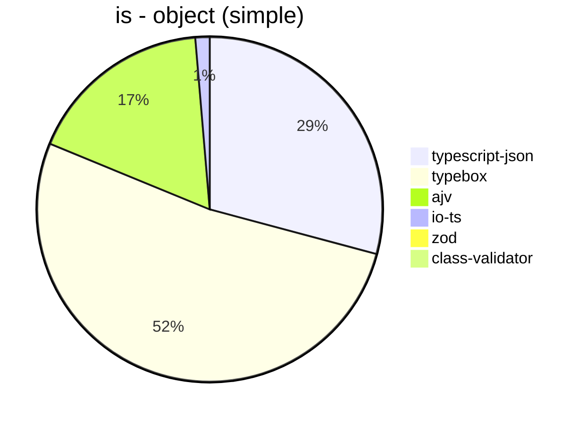
```mermaid
pie title is - object (simple)
  "typescript-json": 845335.522714833
  "typebox": 1508073.0088495575
  "ajv": 505594.2135140083
  "io-ts": 38842.95227524973
  "zod": 3538.040503557745
  "class-validator": 174.00761283306144
```

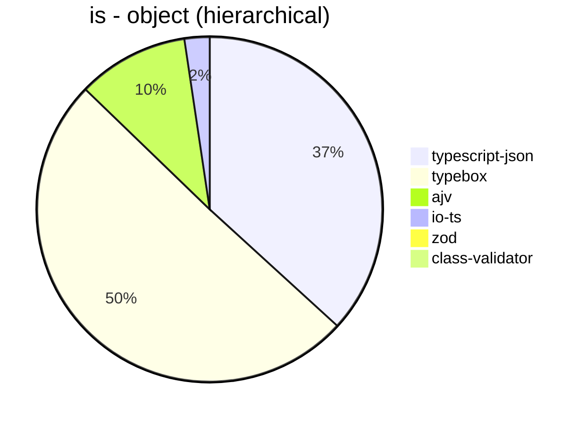
```mermaid
pie title is - object (hierarchical)
  "typescript-json": 143044.16403785488
  "typebox": 196152.59314735068
  "ajv": 40476.81524083393
  "io-ts": 9153.237410071943
  "zod": 401.0061085159899
  "class-validator": 52.107834268138234
```

```mermaid
pie title is - object (recursive)
  "typescript-json": 82480.17381857688
  "typebox": 83774.43609022556
  "ajv": 36782.56130790191
  "io-ts": 5393.376264949402
  "zod": 69.5763330898466
  "class-validator": 36.94719164023139
```

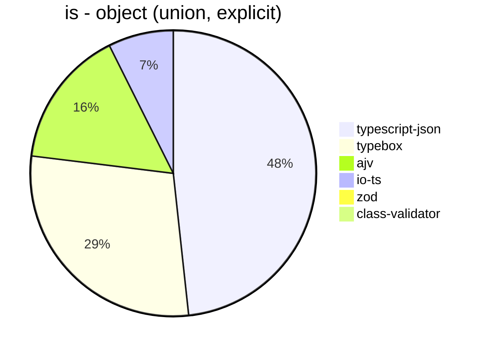
```mermaid
pie title is - object (union, explicit)
  "typescript-json": 21127.600297176818
  "typebox": 12545.35232383808
  "ajv": 6856.37342908438
  "io-ts": 3232.013385387619
  "zod": 32.66888150609081
  "class-validator": 96.42470205850486
```

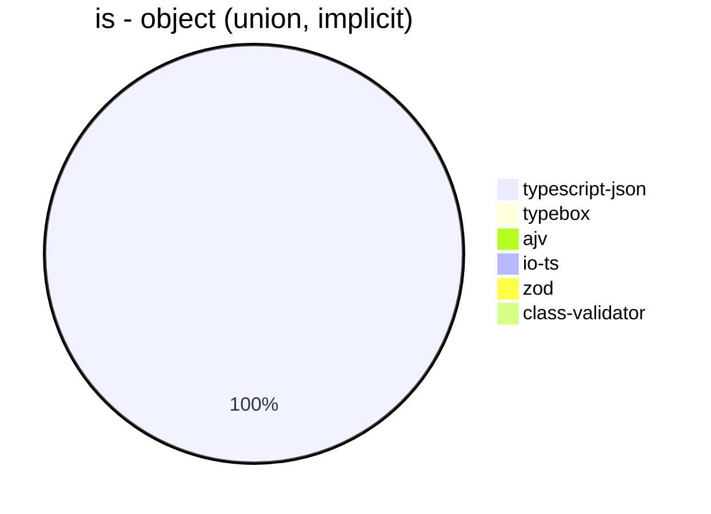
```mermaid
pie title is - object (union, implicit)
  "typescript-json": 19405.0206069689
  "typebox": 0
  "ajv": 0
  "io-ts": 0
  "zod": 17.663293468261273
  "class-validator": 70.07786429365962
```

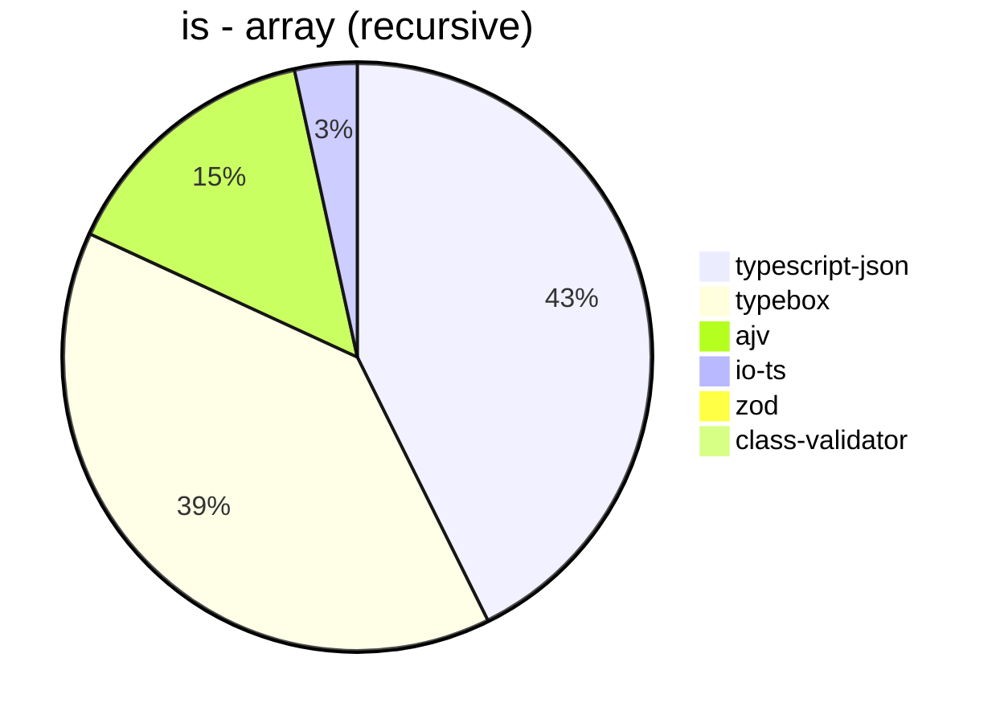
```mermaid
pie title is - array (recursive)
  "typescript-json": 6520.647321428571
  "typebox": 5987.923147301006
  "ajv": 2245.4293628808864
  "io-ts": 524.3632336655592
  "zod": 8.971962616822431
  "class-validator": 3.3106492551039173
```

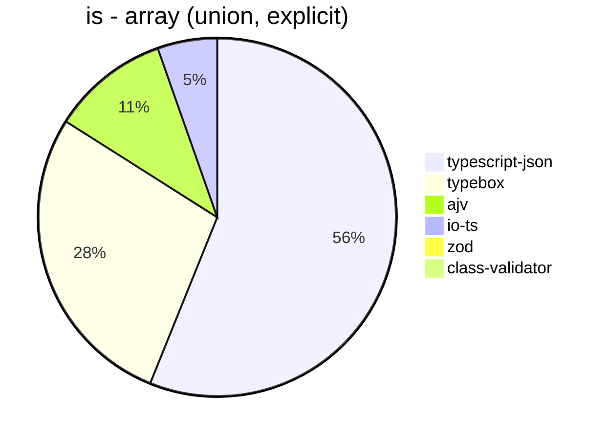
```mermaid
pie title is - array (union, explicit)
  "typescript-json": 3741.603964030098
  "typebox": 1858.576642335766
  "ajv": 708.5972850678733
  "io-ts": 359.35769656699887
  "zod": 2.7553269654665686
  "class-validator": 37.03703703703704
```

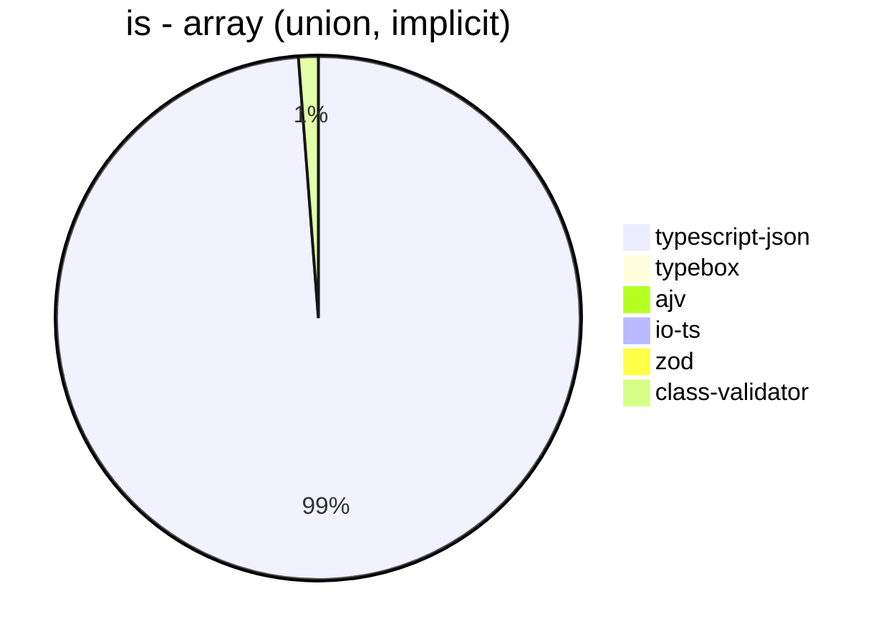
```mermaid
pie title is - array (union, implicit)
  "typescript-json": 1993.7407952871868
  "typebox": 0
  "ajv": 0
  "io-ts": 0
  "zod": 1.6648168701442843
  "class-validator": 24.558139534883722
```

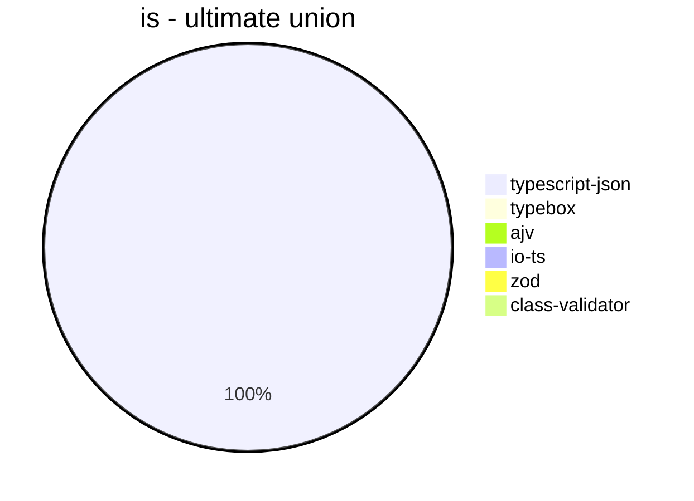
```mermaid
pie title is - ultimate union
  "typescript-json": 551.4986376021798
  "typebox": 0
  "ajv": 0
  "io-ts": 0
  "zod": 0.4790036723614881
  "class-validator": 0
```

## assertType (iterate)
 Components | typescript-json | typebox | io-ts | zod | class-validator 
------------|-----------------|---------|-------|-----|-----------------
object (simple) | 145428.13400576368 | 2813.3259911894274 | 14248.325892857141 | 3003.9230338128154 | 151.04264512492955
object (hierarchical) | 38738.47583643123 | 665.9376708583926 | 2954.9916651231706 | 334.6766807107529 | 59.94500458295143
object (recursive) | 42062.217194570134 | 288.2932166301969 | 1517.818574514039 | 70.46979865771812 | 31.15149267569071
object (union, explicit) | 5858.3714547118025 | 114.04318139878208 | 1012.3233055454875 | 33.777444173390876 | 92.70774448841152
object (union, implicit) | 5240.640715216987 | Failed | Failed | 16.69359181475498 | 54.38066465256797
array (recursive) | 1741.7035398230087 | 27.387255796969143 | 115.60044893378226 | 8.272058823529411 | 3.3149171270718236
array (union, explicit) | 2278.8248337028826 | 17.149179420984694 | 76.99565955840724 | 2.7865502507895226 | 31.96766489068529
array (union, implicit) | 911.2683723462167 | Failed | Failed | 1.6725515703400853 | 25.395033860045146
ultimate union | 259.3406593406594 | Failed | Failed | 0.4747586643456243 | Failed

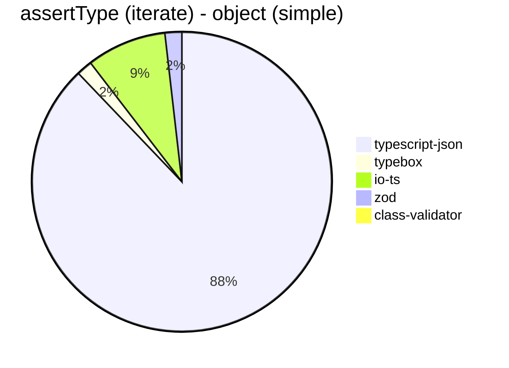
```mermaid
pie title assertType (iterate) - object (simple)
  "typescript-json": 145428.13400576368
  "typebox": 2813.3259911894274
  "io-ts": 14248.325892857141
  "zod": 3003.9230338128154
  "class-validator": 151.04264512492955
```

```mermaid
pie title assertType (iterate) - object (hierarchical)
  "typescript-json": 38738.47583643123
  "typebox": 665.9376708583926
  "io-ts": 2954.9916651231706
  "zod": 334.6766807107529
  "class-validator": 59.94500458295143
```

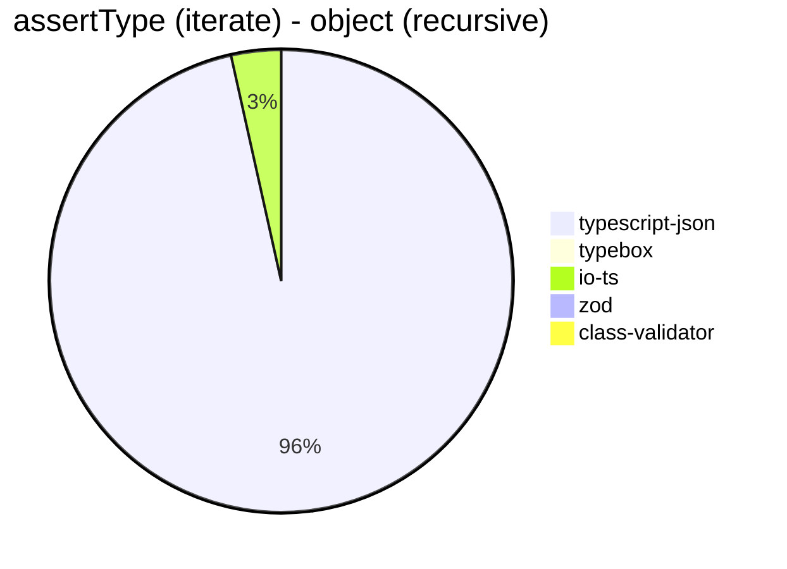
```mermaid
pie title assertType (iterate) - object (recursive)
  "typescript-json": 42062.217194570134
  "typebox": 288.2932166301969
  "io-ts": 1517.818574514039
  "zod": 70.46979865771812
  "class-validator": 31.15149267569071
```

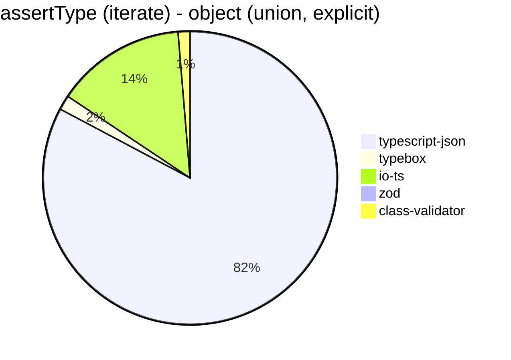
```mermaid
pie title assertType (iterate) - object (union, explicit)
  "typescript-json": 5858.3714547118025
  "typebox": 114.04318139878208
  "io-ts": 1012.3233055454875
  "zod": 33.777444173390876
  "class-validator": 92.70774448841152
```

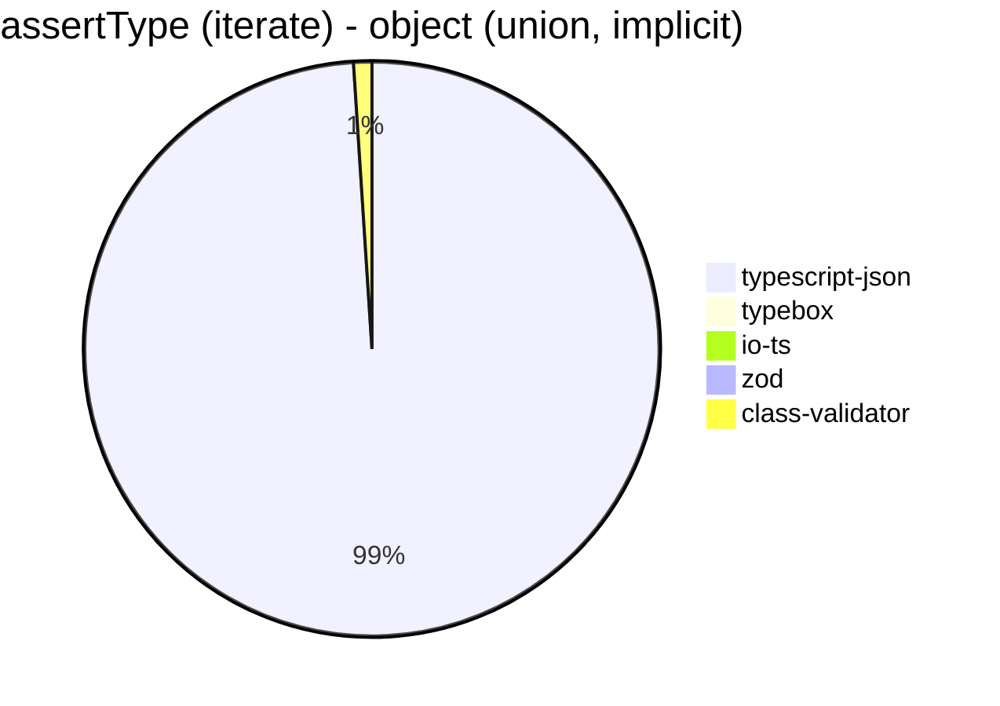
```mermaid
pie title assertType (iterate) - object (union, implicit)
  "typescript-json": 5240.640715216987
  "typebox": 0
  "io-ts": 0
  "zod": 16.69359181475498
  "class-validator": 54.38066465256797
```

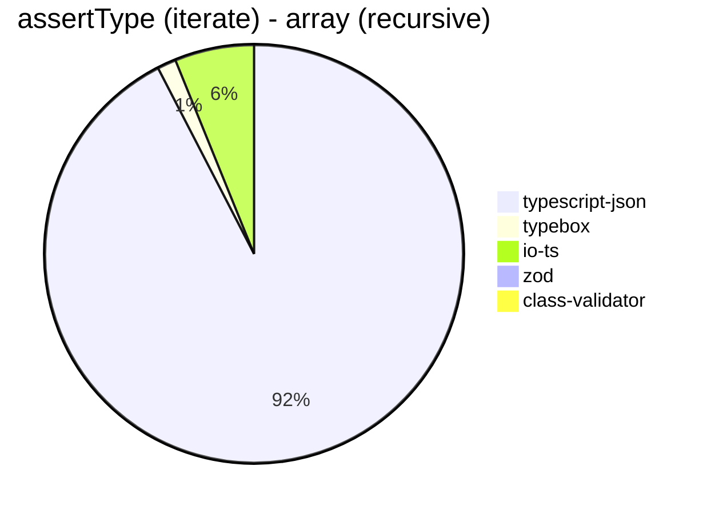
```mermaid
pie title assertType (iterate) - array (recursive)
  "typescript-json": 1741.7035398230087
  "typebox": 27.387255796969143
  "io-ts": 115.60044893378226
  "zod": 8.272058823529411
  "class-validator": 3.3149171270718236
```

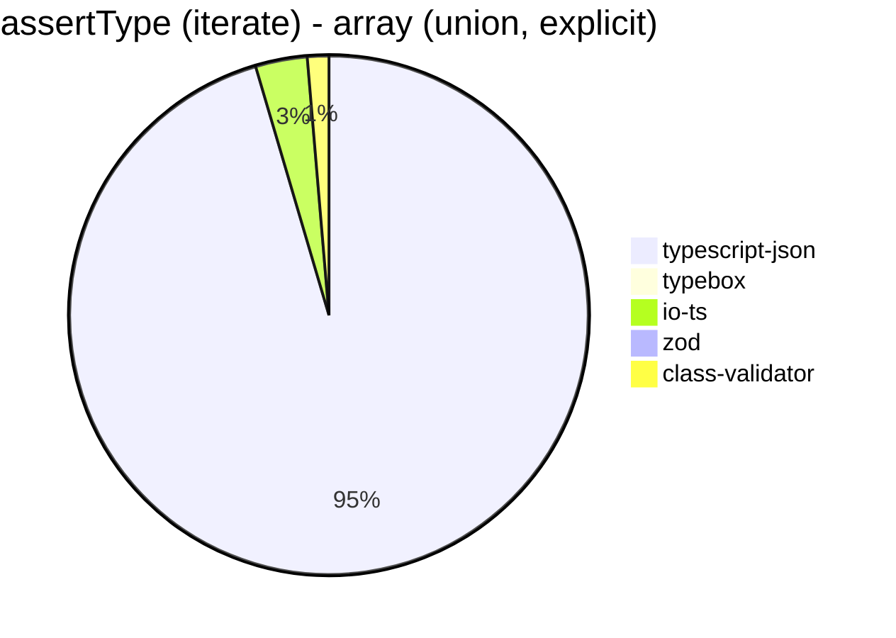
```mermaid
pie title assertType (iterate) - array (union, explicit)
  "typescript-json": 2278.8248337028826
  "typebox": 17.149179420984694
  "io-ts": 76.99565955840724
  "zod": 2.7865502507895226
  "class-validator": 31.96766489068529
```

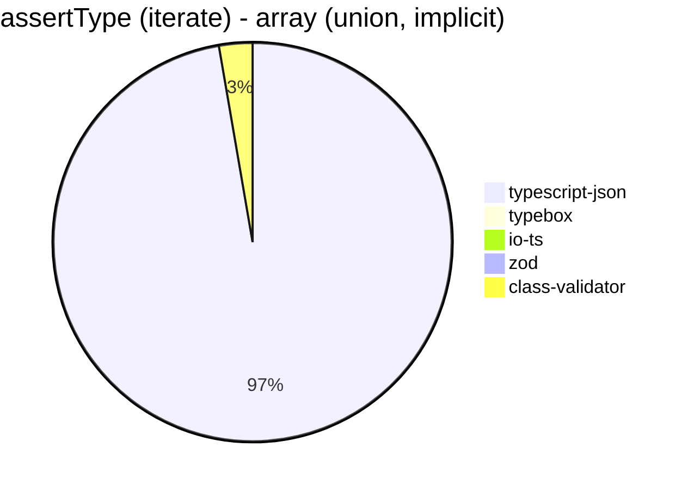
```mermaid
pie title assertType (iterate) - array (union, implicit)
  "typescript-json": 911.2683723462167
  "typebox": 0
  "io-ts": 0
  "zod": 1.6725515703400853
  "class-validator": 25.395033860045146
```

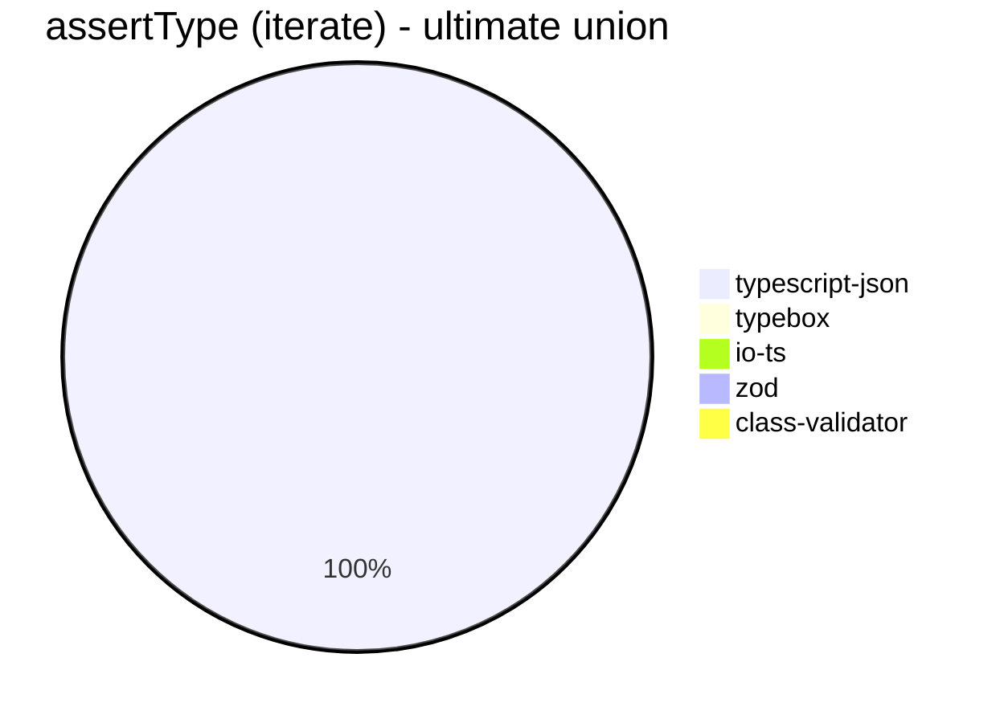
```mermaid
pie title assertType (iterate) - ultimate union
  "typescript-json": 259.3406593406594
  "typebox": 0
  "io-ts": 0
  "zod": 0.4747586643456243
  "class-validator": 0
```

## assertType (throw)
 Components | typescript-json | typebox | io-ts | zod | class-validator 
------------|-----------------|---------|-------|-----|-----------------
object (simple) | 449.99999999999994 | 23.345588235294116 | 96.26168224299066 | 30.95328522597797 | 1.8294914013904133
object (hierarchical) | 288.88888888888886 | 6.3185281546181 | 25.579683474420317 | 2.9618659755646055 | 0.537345513164965
object (recursive) | 33.864177192019035 | Failed | Failed | 0.17271157167530224 | 0.5501558774986246
object (union, explicit) | 50.52857910768679 | 1.1045655375552281 | 10.04168245547556 | 0.34464931931759435 | 0.7270083605961469
object (union, implicit) | 39.8391812865497 | Failed | Failed | 0.16758840288252053 | 0.7202016564638098
array (recursive) | 17.589335308276247 | 0.35816618911174786 | 1.4967259120673528 | 0.15718327569946558 | 0.1195886151638364
array (union, explicit) | 4.119648934264732 | 0.17044486108743823 | 0.5369608018614641 | 0.09297136481963555 | 0.36081544290095613
array (union, implicit) | 1.6713091922005572 | Failed | Failed | 0.07618467164406521 | 0.3572066440435792
ultimate union | 2.362347810285299 | Failed | Failed | 0.02077835726307478 | Failed

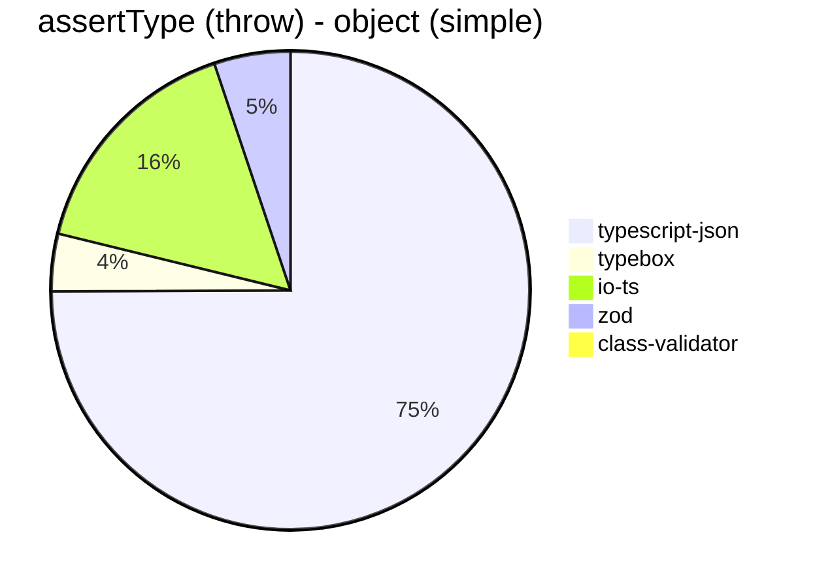
```mermaid
pie title assertType (throw) - object (simple)
  "typescript-json": 449.99999999999994
  "typebox": 23.345588235294116
  "io-ts": 96.26168224299066
  "zod": 30.95328522597797
  "class-validator": 1.8294914013904133
```

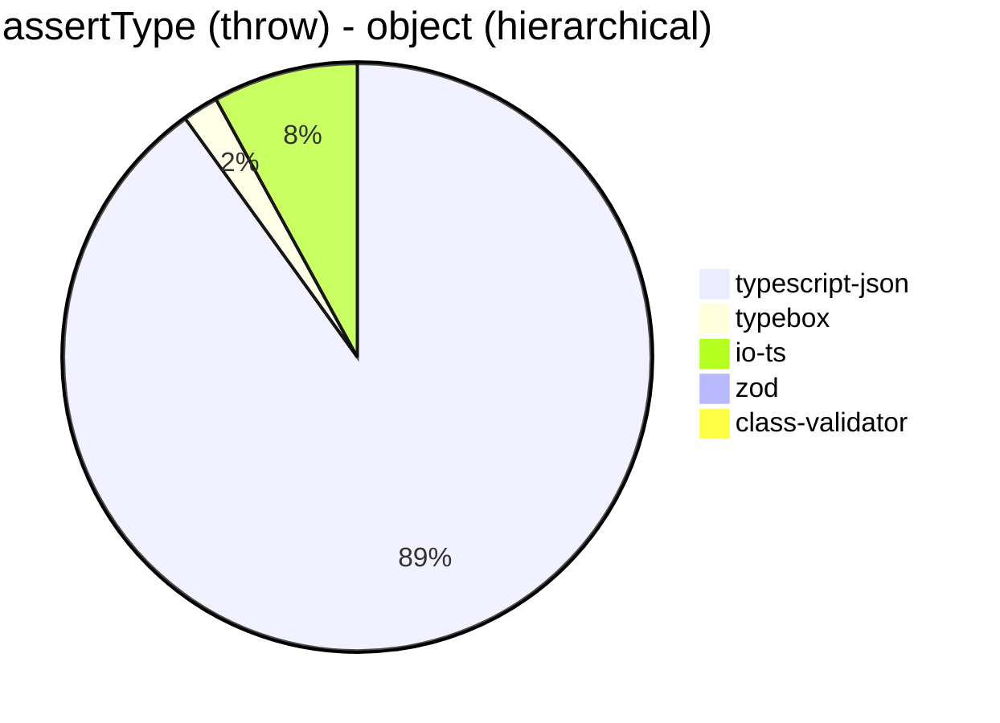
```mermaid
pie title assertType (throw) - object (hierarchical)
  "typescript-json": 288.88888888888886
  "typebox": 6.3185281546181
  "io-ts": 25.579683474420317
  "zod": 2.9618659755646055
  "class-validator": 0.537345513164965
```

```mermaid
pie title assertType (throw) - object (recursive)
  "typescript-json": 33.864177192019035
  "typebox": 0
  "io-ts": 0
  "zod": 0.17271157167530224
  "class-validator": 0.5501558774986246
```

```mermaid
pie title assertType (throw) - object (union, explicit)
  "typescript-json": 50.52857910768679
  "typebox": 1.1045655375552281
  "io-ts": 10.04168245547556
  "zod": 0.34464931931759435
  "class-validator": 0.7270083605961469
```

```mermaid
pie title assertType (throw) - object (union, implicit)
  "typescript-json": 39.8391812865497
  "typebox": 0
  "io-ts": 0
  "zod": 0.16758840288252053
  "class-validator": 0.7202016564638098
```

```mermaid
pie title assertType (throw) - array (recursive)
  "typescript-json": 17.589335308276247
  "typebox": 0.35816618911174786
  "io-ts": 1.4967259120673528
  "zod": 0.15718327569946558
  "class-validator": 0.1195886151638364
```

```mermaid
pie title assertType (throw) - array (union, explicit)
  "typescript-json": 4.119648934264732
  "typebox": 0.17044486108743823
  "io-ts": 0.5369608018614641
  "zod": 0.09297136481963555
  "class-validator": 0.36081544290095613
```

```mermaid
pie title assertType (throw) - array (union, implicit)
  "typescript-json": 1.6713091922005572
  "typebox": 0
  "io-ts": 0
  "zod": 0.07618467164406521
  "class-validator": 0.3572066440435792
```

```mermaid
pie title assertType (throw) - ultimate union
  "class-validator": 0
  "typescript-json": 2.362347810285299
  "typebox": 0
  "io-ts": 0
  "zod": 0.02077835726307478
```

## validate
 Components | typescript-json | typebox | io-ts | zod | class-validator 
------------|-----------------|---------|-------|-----|-----------------
object (simple) | 68000.72568940494 | 2741.2429378531074 | 11787.438768369488 | 3274.0975065128396 | 171.89483227561198
object (hierarchical) | 23946.666666666664 | 746.2796252066876 | 2904.5758928571427 | 369.72024136039494 | 57.42145178764897
object (recursive) | 19713.231118682565 | 307.198186283771 | 1467.9958027282266 | 68.74068554396423 | 36.11738148984199
object (union, explicit) | 3496.517595307918 | 130.38632986627042 | 939.1444424557008 | 33.2894489373707 | 92.16335540838853
object (union, implicit) | 3936.604189636163 | 123.20211960635882 | 285.93127017277385 | 17.05796038151137 | 59.4430560514102
array (recursive) | 1180.6522535727372 | 31.796206768315358 | 133.79751599548362 | 8.330248056275453 | 3.297307199120718
array (union, explicit) | 1785.4122621564484 | 17.927170868347336 | 78.53107344632768 | 2.779836916234248 | 33.74455732946299
array (union, implicit) | 1018.1587071000545 | 13.038548752834465 | 59.24393454955802 | 1.6562384983437615 | 26.679280983916744
ultimate union | 145.63617245005258 | Failed | Failed | 0.4878842088144414 | Failed

```mermaid
pie title validate - object (simple)
  "typescript-json": 68000.72568940494
  "typebox": 2741.2429378531074
  "io-ts": 11787.438768369488
  "zod": 3274.0975065128396
  "class-validator": 171.89483227561198
```

```mermaid
pie title validate - object (hierarchical)
  "typescript-json": 23946.666666666664
  "typebox": 746.2796252066876
  "io-ts": 2904.5758928571427
  "zod": 369.72024136039494
  "class-validator": 57.42145178764897
```

```mermaid
pie title validate - object (recursive)
  "typescript-json": 19713.231118682565
  "typebox": 307.198186283771
  "io-ts": 1467.9958027282266
  "zod": 68.74068554396423
  "class-validator": 36.11738148984199
```

```mermaid
pie title validate - object (union, explicit)
  "typescript-json": 3496.517595307918
  "typebox": 130.38632986627042
  "io-ts": 939.1444424557008
  "zod": 33.2894489373707
  "class-validator": 92.16335540838853
```

```mermaid
pie title validate - object (union, implicit)
  "typescript-json": 3936.604189636163
  "typebox": 123.20211960635882
  "io-ts": 285.93127017277385
  "zod": 17.05796038151137
  "class-validator": 59.4430560514102
```

```mermaid
pie title validate - array (recursive)
  "typescript-json": 1180.6522535727372
  "typebox": 31.796206768315358
  "io-ts": 133.79751599548362
  "zod": 8.330248056275453
  "class-validator": 3.297307199120718
```

```mermaid
pie title validate - array (union, explicit)
  "typescript-json": 1785.4122621564484
  "typebox": 17.927170868347336
  "io-ts": 78.53107344632768
  "zod": 2.779836916234248
  "class-validator": 33.74455732946299
```

```mermaid
pie title validate - array (union, implicit)
  "typescript-json": 1018.1587071000545
  "typebox": 13.038548752834465
  "io-ts": 59.24393454955802
  "zod": 1.6562384983437615
  "class-validator": 26.679280983916744
```

```mermaid
pie title validate - ultimate union
  "typescript-json": 145.63617245005258
  "typebox": 0
  "io-ts": 0
  "zod": 0.4878842088144414
  "class-validator": 0
```

## equals
 Components | typescript-json | typebox 
------------|-----------------|---------
object (simple) | 24923.755282013597 | 61068.16932380429
object (hierarchical) | 8288.154269972452 | 16050.635242128521
object (recursive) | 6349.1450634307785 | 10091.917884224154
object (union, explicit) | 2594.565412992622 | 2990.7875722543354
object (union, implicit) | 1784.0442620024987 | 2112.8860489882854
array (recursive) | 518.7887632251003 | 1011.7431192660549
array (union, explicit) | 667.8138018474914 | 594.2190105614229
array (union, implicit) | 464.5799011532125 | 407.8516902944384
ultimate union | 274.6478873239437 | 192.6605504587156

```mermaid
pie title equals - object (simple)
  "typescript-json": 24923.755282013597
  "typebox": 61068.16932380429
```

```mermaid
pie title equals - object (hierarchical)
  "typescript-json": 8288.154269972452
  "typebox": 16050.635242128521
```

```mermaid
pie title equals - object (recursive)
  "typescript-json": 6349.1450634307785
  "typebox": 10091.917884224154
```

```mermaid
pie title equals - object (union, explicit)
  "typescript-json": 2594.565412992622
  "typebox": 2990.7875722543354
```

```mermaid
pie title equals - object (union, implicit)
  "typescript-json": 1784.0442620024987
  "typebox": 2112.8860489882854
```

```mermaid
pie title equals - array (recursive)
  "typescript-json": 518.7887632251003
  "typebox": 1011.7431192660549
```

```mermaid
pie title equals - array (union, explicit)
  "typescript-json": 667.8138018474914
  "typebox": 594.2190105614229
```

```mermaid
pie title equals - array (union, implicit)
  "typescript-json": 464.5799011532125
  "typebox": 407.8516902944384
```

```mermaid
pie title equals - ultimate union
  "typescript-json": 274.6478873239437
  "typebox": 192.6605504587156
```

## assertEquals (iterate)
 Components | typescript-json | typebox 
------------|-----------------|---------
object (simple) | 21048.845947396672 | 1877.10407239819
object (hierarchical) | 6370.288248337029 | 619.9856733524356
object (recursive) | 6261.759822910903 | 276.440962506995
object (union, explicit) | 2287.096185435298 | 99.99999999999999
object (union, implicit) | 1761.835923382725 | 71.98186283771018
array (recursive) | 547.5285171102662 | 28.253908457336596
array (union, explicit) | 367.9142441860465 | 15.358361774744026
array (union, implicit) | 220.37914691943126 | 6.138392857142856
ultimate union | 187.1216290588883 | 3.816793893129771

```mermaid
pie title assertEquals (iterate) - object (simple)
  "typescript-json": 21048.845947396672
  "typebox": 1877.10407239819
```

```mermaid
pie title assertEquals (iterate) - object (hierarchical)
  "typescript-json": 6370.288248337029
  "typebox": 619.9856733524356
```

```mermaid
pie title assertEquals (iterate) - object (recursive)
  "typescript-json": 6261.759822910903
  "typebox": 276.440962506995
```

```mermaid
pie title assertEquals (iterate) - object (union, explicit)
  "typescript-json": 2287.096185435298
  "typebox": 99.99999999999999
```

```mermaid
pie title assertEquals (iterate) - object (union, implicit)
  "typescript-json": 1761.835923382725
  "typebox": 71.98186283771018
```

```mermaid
pie title assertEquals (iterate) - array (recursive)
  "typescript-json": 547.5285171102662
  "typebox": 28.253908457336596
```

```mermaid
pie title assertEquals (iterate) - array (union, explicit)
  "typescript-json": 367.9142441860465
  "typebox": 15.358361774744026
```

```mermaid
pie title assertEquals (iterate) - array (union, implicit)
  "typescript-json": 220.37914691943126
  "typebox": 6.138392857142856
```

```mermaid
pie title assertEquals (iterate) - ultimate union
  "typescript-json": 187.1216290588883
  "typebox": 3.816793893129771
```

## assertEquals (throw)
 Components | typescript-json | typebox 
------------|-----------------|---------
object (simple) | 153.68852459016392 | 19.690063810391976
object (hierarchical) | 59.91124260355029 | 5.609844372059356
object (recursive) | 50.08195228555819 | 2.587800369685767
object (union, explicit) | 17.46089487086213 | 0.7074637424831978
object (union, implicit) | 14.791336502905441 | 0.7287301876480233
array (recursive) | 5.371365067605112 | 0.357653791130186
array (union, explicit) | 2.2062879205736348 | 0.1716148961729878
array (union, implicit) | 1.0789426362165078 | 0.15121729925903524
ultimate union | 1.961133891959351 | 0.1310615989515072

```mermaid
pie title assertEquals (throw) - object (simple)
  "typescript-json": 153.68852459016392
  "typebox": 19.690063810391976
```

```mermaid
pie title assertEquals (throw) - object (hierarchical)
  "typescript-json": 59.91124260355029
  "typebox": 5.609844372059356
```

```mermaid
pie title assertEquals (throw) - object (recursive)
  "typescript-json": 50.08195228555819
  "typebox": 2.587800369685767
```

```mermaid
pie title assertEquals (throw) - object (union, explicit)
  "typescript-json": 17.46089487086213
  "typebox": 0.7074637424831978
```

```mermaid
pie title assertEquals (throw) - object (union, implicit)
  "typescript-json": 14.791336502905441
  "typebox": 0.7287301876480233
```

```mermaid
pie title assertEquals (throw) - array (recursive)
  "typescript-json": 5.371365067605112
  "typebox": 0.357653791130186
```

```mermaid
pie title assertEquals (throw) - array (union, explicit)
  "typescript-json": 2.2062879205736348
  "typebox": 0.1716148961729878
```

```mermaid
pie title assertEquals (throw) - array (union, implicit)
  "typescript-json": 1.0789426362165078
  "typebox": 0.15121729925903524
```

```mermaid
pie title assertEquals (throw) - ultimate union
  "typescript-json": 1.961133891959351
  "typebox": 0.1310615989515072
```

## validateEquals
 Components | typescript-json | typebox 
------------|-----------------|---------
object (simple) | 15541.896361631752 | 2293.4621099554233
object (hierarchical) | 5583.6846929422545 | 641.5863602668644
object (recursive) | 4580.1738487146295 | 271.60262417994375
object (union, explicit) | 1461.5248540597913 | 95.17696680726205
object (union, implicit) | 1096.0422163588391 | 72.25488336810166
array (recursive) | 332.67857142857144 | 30.68763023299868
array (union, explicit) | 324.3243243243243 | 14.700339238597813
array (union, implicit) | 181.08651911468814 | 6.801435858681277
ultimate union | 126.15823235923023 | 3.92156862745098

```mermaid
pie title validateEquals - object (simple)
  "typescript-json": 15541.896361631752
  "typebox": 2293.4621099554233
```

```mermaid
pie title validateEquals - object (hierarchical)
  "typescript-json": 5583.6846929422545
  "typebox": 641.5863602668644
```

```mermaid
pie title validateEquals - object (recursive)
  "typescript-json": 4580.1738487146295
  "typebox": 271.60262417994375
```

```mermaid
pie title validateEquals - object (union, explicit)
  "typescript-json": 1461.5248540597913
  "typebox": 95.17696680726205
```

```mermaid
pie title validateEquals - object (union, implicit)
  "typescript-json": 1096.0422163588391
  "typebox": 72.25488336810166
```

```mermaid
pie title validateEquals - array (recursive)
  "typescript-json": 332.67857142857144
  "typebox": 30.68763023299868
```

```mermaid
pie title validateEquals - array (union, explicit)
  "typescript-json": 324.3243243243243
  "typebox": 14.700339238597813
```

```mermaid
pie title validateEquals - array (union, implicit)
  "typescript-json": 181.08651911468814
  "typebox": 6.801435858681277
```

```mermaid
pie title validateEquals - ultimate union
  "typescript-json": 126.15823235923023
  "typebox": 3.92156862745098
```

## optimizer
 Components | typescript-json | typebox | ajv 
------------|-----------------|---------|-----
object (hierarchical) | 139064.5045045045 | 177.9692082111437 | 4.35334663522583
object (recursive) | 80347.18693284936 | 685.0741002117148 | 7.965913301222676
object (union) | 18396.53617174815 | 87.89171147784165 | 3.943661971830986
array (hierarchical) | 6079.394387001476 | 904.1121495327103 | 5.522827687776141
array (recursive) | 7119.610319321667 | 723.0309817095932 | 8.149657343952583
array (union) | 3899.7805413313827 | 217.2054998141955 | 5.329902591435398
ultimate union | 558.0398732997951 | 9.693053311793216 | 0.7229351165732875

```mermaid
pie title optimizer - object (hierarchical)
  "typescript-json": 139064.5045045045
  "typebox": 177.9692082111437
  "ajv": 4.35334663522583
```

```mermaid
pie title optimizer - object (recursive)
  "typescript-json": 80347.18693284936
  "typebox": 685.0741002117148
  "ajv": 7.965913301222676
```

```mermaid
pie title optimizer - object (union)
  "typescript-json": 18396.53617174815
  "typebox": 87.89171147784165
  "ajv": 3.943661971830986
```

```mermaid
pie title optimizer - array (hierarchical)
  "typescript-json": 6079.394387001476
  "typebox": 904.1121495327103
  "ajv": 5.522827687776141
```

```mermaid
pie title optimizer - array (recursive)
  "typescript-json": 7119.610319321667
  "typebox": 723.0309817095932
  "ajv": 8.149657343952583
```

```mermaid
pie title optimizer - array (union)
  "typescript-json": 3899.7805413313827
  "typebox": 217.2054998141955
  "ajv": 5.329902591435398
```

```mermaid
pie title optimizer - ultimate union
  "typescript-json": 558.0398732997951
  "typebox": 9.693053311793216
  "ajv": 0.7229351165732875
```

## stringify
 Components | TSON.stringify() | TSON.assertStringify() | TSON.isStringify() | JSON.stringify() | fast-json-stringify 
------------|------------------|------------------------|--------------------|------------------|---------------------
object (simple) | 31820.33400623968 | 26257.467472970497 | 27560.243183493 | 6119.332195029407 | 23169.116312828886
object (hierarchical) | 4276.885735623599 | 3720.4802006808814 | 4045.1508036843056 | 1510.9340252038548 | 3933.8842975206608
object (recursive) | 4119.963536918869 | 3977.0218925275917 | 4124.520723023553 | 1251.1839363515817 | 1215.759152573871
object (union) | 1390.8610959402877 | 1080.9228039041705 | 1249.1926803013994 | 618.7766714082504 | 1216.5202108963092
array (hierarchical) | 218.52387843704778 | 190.88669950738915 | 211.46633327379888 | 106.11712047743379 | 294.3026267110618
array (recursive) | 252.85451197053408 | 220.36390369417387 | 238.27183385870575 | 128.43009146910583 | 127.2895467160037
array (union) | 297.5766215253029 | 256.6017118921872 | 289.4255396999634 | 254.6941810745492 | 225.67592422291705

```mermaid
pie title stringify - object (simple)
  "TSON.stringify()": 31820.33400623968
  "TSON.assertStringify()": 26257.467472970497
  "TSON.isStringify()": 27560.243183493
  "JSON.stringify()": 6119.332195029407
  "fast-json-stringify": 23169.116312828886
```

```mermaid
pie title stringify - object (hierarchical)
  "TSON.stringify()": 4276.885735623599
  "TSON.assertStringify()": 3720.4802006808814
  "TSON.isStringify()": 4045.1508036843056
  "JSON.stringify()": 1510.9340252038548
  "fast-json-stringify": 3933.8842975206608
```

```mermaid
pie title stringify - object (recursive)
  "TSON.stringify()": 4119.963536918869
  "TSON.assertStringify()": 3977.0218925275917
  "TSON.isStringify()": 4124.520723023553
  "JSON.stringify()": 1251.1839363515817
  "fast-json-stringify": 1215.759152573871
```

```mermaid
pie title stringify - object (union)
  "TSON.stringify()": 1390.8610959402877
  "TSON.assertStringify()": 1080.9228039041705
  "TSON.isStringify()": 1249.1926803013994
  "JSON.stringify()": 618.7766714082504
  "fast-json-stringify": 1216.5202108963092
```

```mermaid
pie title stringify - array (hierarchical)
  "TSON.stringify()": 218.52387843704778
  "TSON.assertStringify()": 190.88669950738915
  "TSON.isStringify()": 211.46633327379888
  "JSON.stringify()": 106.11712047743379
  "fast-json-stringify": 294.3026267110618
```

```mermaid
pie title stringify - array (recursive)
  "TSON.stringify()": 252.85451197053408
  "TSON.assertStringify()": 220.36390369417387
  "TSON.isStringify()": 238.27183385870575
  "JSON.stringify()": 128.43009146910583
  "fast-json-stringify": 127.2895467160037
```

```mermaid
pie title stringify - array (union)
  "TSON.stringify()": 297.5766215253029
  "TSON.assertStringify()": 256.6017118921872
  "TSON.isStringify()": 289.4255396999634
  "JSON.stringify()": 254.6941810745492
  "fast-json-stringify": 225.67592422291705
```

> Total elapsed time: 1,770,034 ms
