# Benchmark of `typescript-json`
> CPU: 11th Gen Intel(R) Core(TM) i5-1135G7 @ 2.40GHz
> Memory: 16,218 MB
> NodeJS version: v16.17.1
> TypeScript-JSON version: 3.3.12


## is
 Components | typescript-json | typebox | ajv | io-ts | zod | class-validator 
------------|-----------------|---------|-----|-------|-----|-----------------
object (hierarchical) | 109269.15555555555 | 188332.40843507214 | 40425.05962208769 | 8559.404096834265 | 372.69772481040087 | 63.662896753009846
object (recursive) | 66141.00426162683 | 84053.78304466727 | 33031.31710808876 | 4336.317851147174 | 71.48148148148148 | 38.63298662704309
object (union, explicit) | 7010.950808273944 | 11921.56862745098 | 6513.682704346271 | 3166.573608784664 | 32.14352457484582 | Failed
object (union, implicit) | 14108.723135271808 | Failed | Failed | Failed | Failed | Failed
array (recursive) | 6906.123201770565 | 6504.572055596196 | 2133.560415919684 | 475.66291318561565 | 9.177748642067803 | Failed
array (union, explicit) | 2573.6973590292646 | 1988.611315209405 | 795.3271028037384 | 368.47014925373134 | 2.8253908457336596 | Failed
array (union, implicit) | 1641.1124977714387 | Failed | Failed | Failed | Failed | Failed
ultimate union | 443.8122332859175 | Failed | Failed | Failed | Failed | Failed


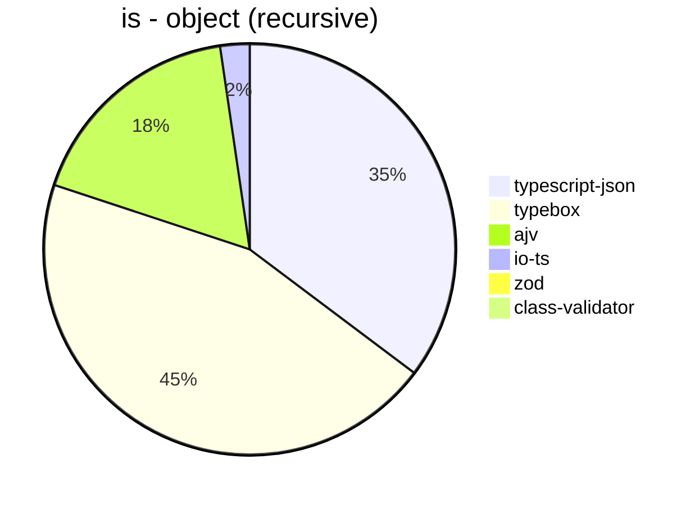


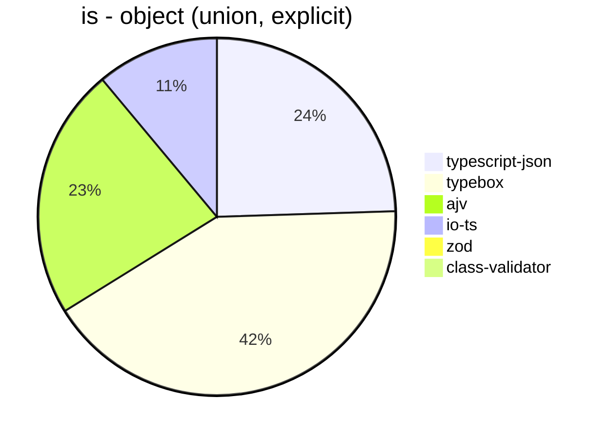


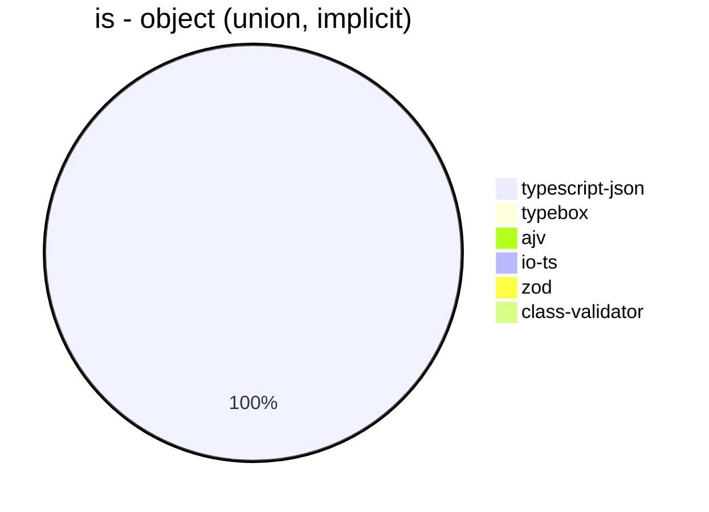


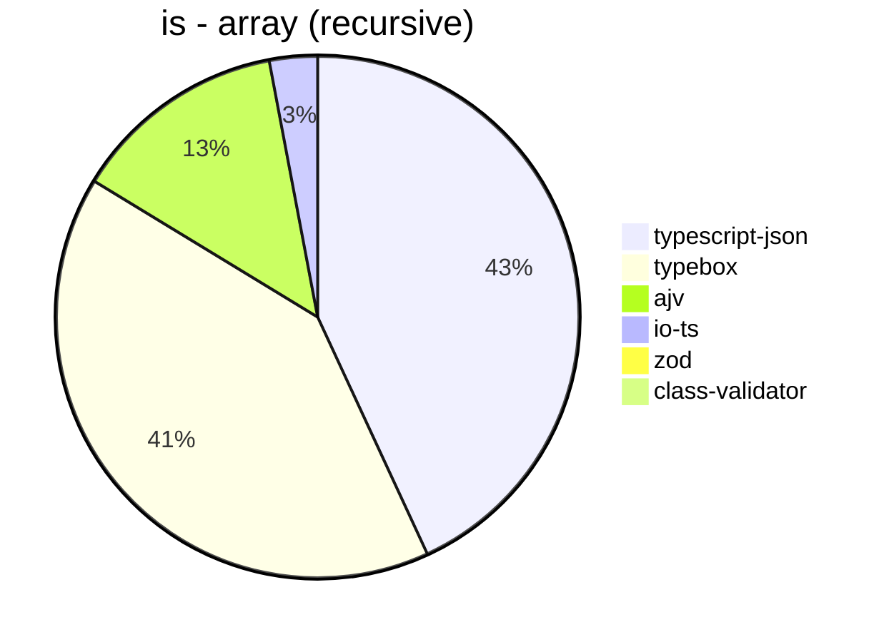


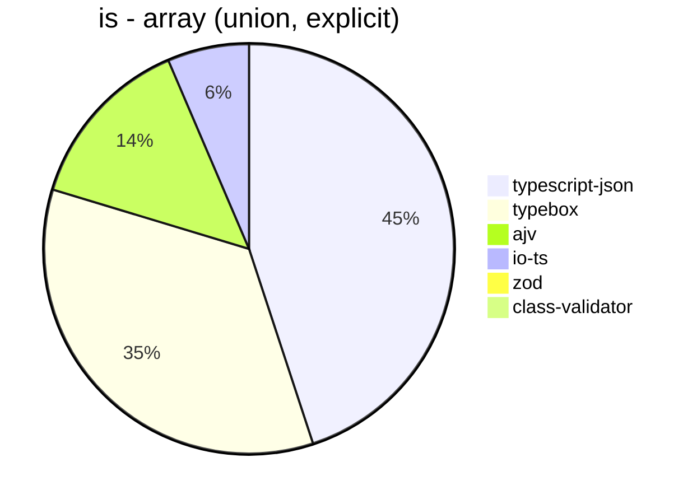


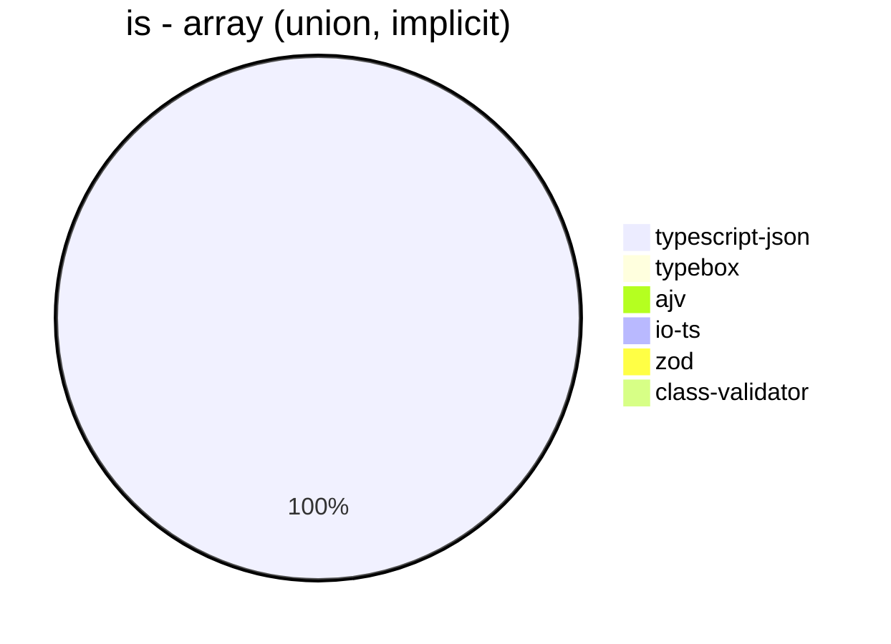


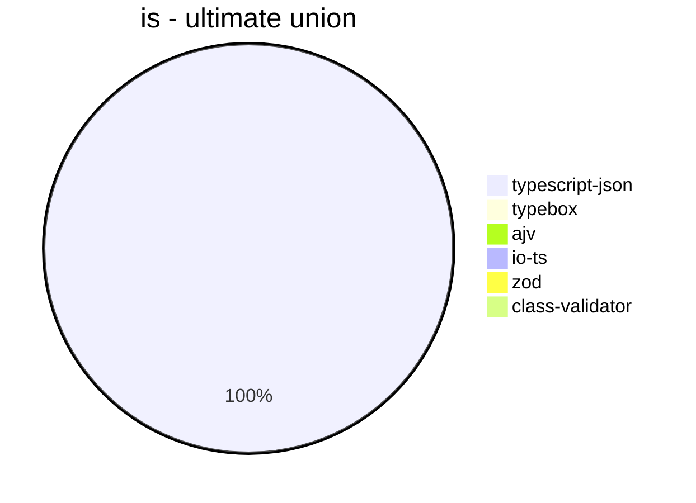


## assert
 Components | typescript-json | typebox | io-ts | zod | class-validator 
------------|-----------------|---------|-------|-----|-----------------
object (hierarchical) | 20567.39926739927 | 885.4494902687675 | 3619.4043486205005 | 393.910741301059 | 61.81095246701608
object (recursive) | 26125.910140294796 | 330.093592512599 | 1487.0828848223898 | 71.29420617005268 | 39.17564054957297
object (union, explicit) | 4308.766770814189 | 143.59985657941914 | 1092.998009770219 | 32.08152481600302 | 16.581872997927263
object (union, implicit) | 4320.154468554616 | Failed | Failed | Failed | Failed
array (recursive) | 1503.3975084937713 | 34.463276836158194 | 158.6130579122095 | 9.268015888027238 | 3.6032619002465394
array (union, explicit) | 1926.0885473838273 | 19.651464590285503 | 76.6961651917404 | 2.6163333956269854 | 7.243684992570579
array (union, implicit) | 1079.6718322698268 | Failed | Failed | Failed | Failed
ultimate union | 210.2118413905486 | Failed | Failed | Failed | Failed


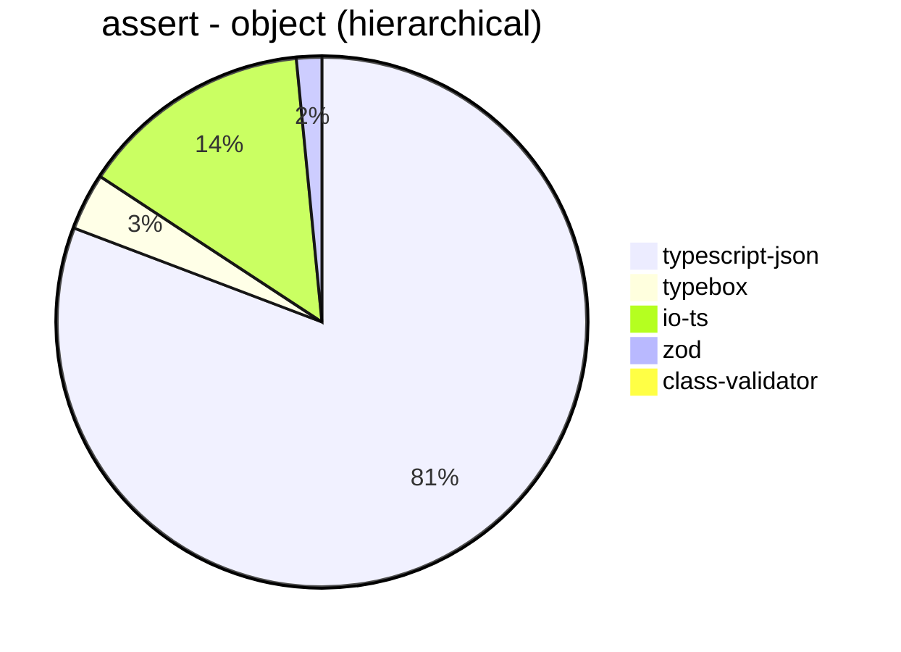


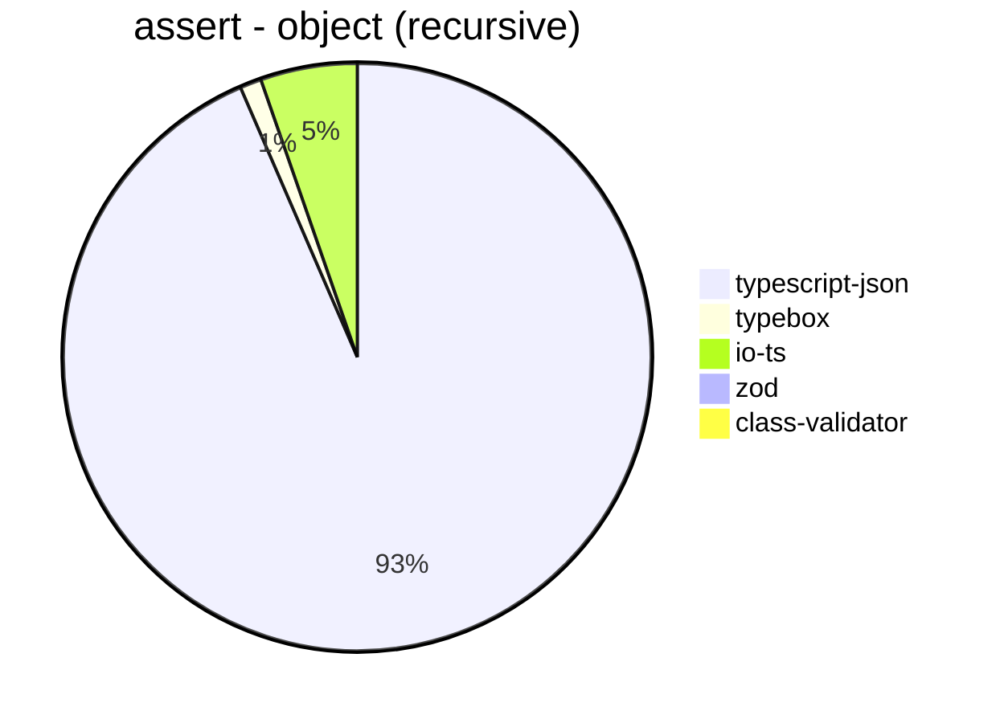


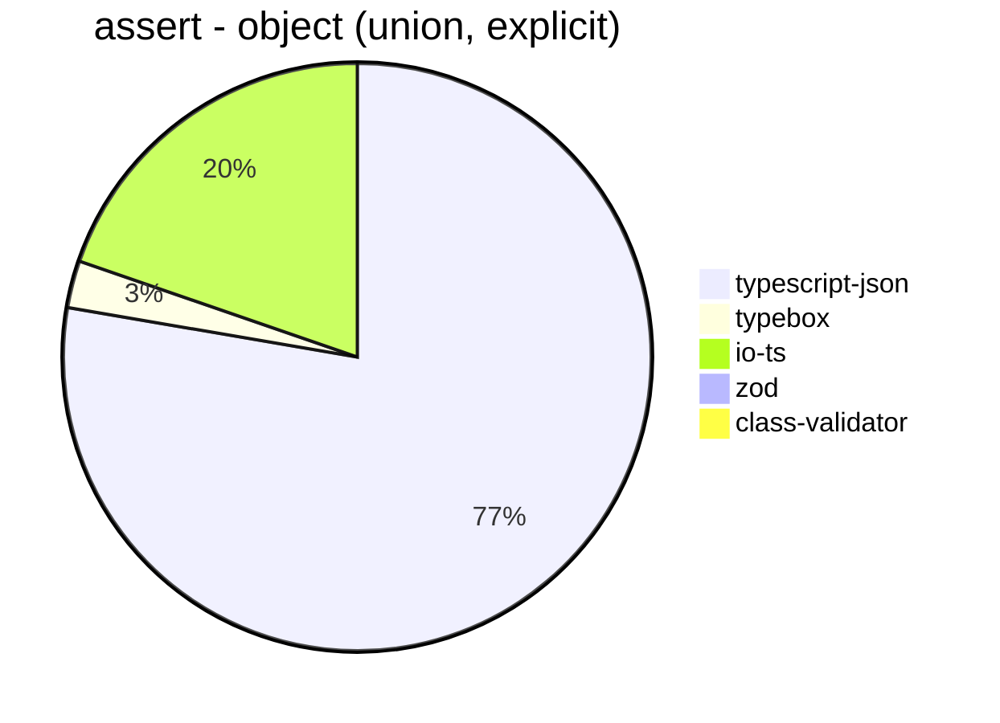


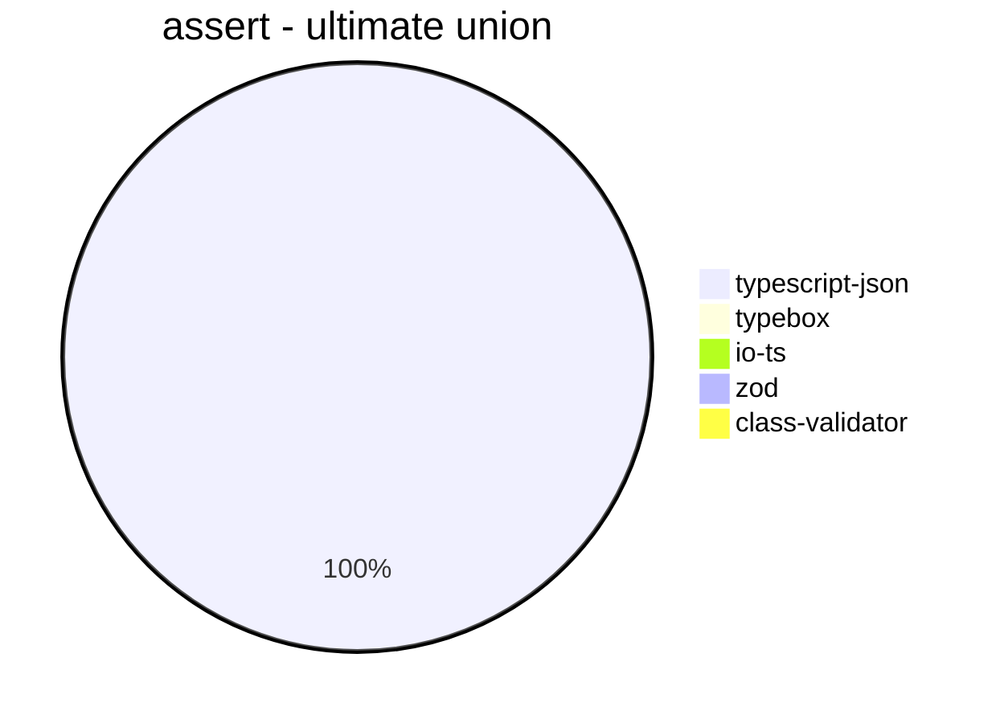


## valiadate
 Components | typescript-json | typebox | io-ts | zod | class-validator 
------------|-----------------|---------|-------|-----|-----------------
object (hierarchical) | 16749.399371650343 | 779.7724848915748 | 3334.989876679551 | 401.16937004903815 | 62.44294321708964
object (recursive) | 14503.514613392528 | 329.3180133432172 | 1591.9689119170985 | 72.33806975456727 | 39.07113896056026
object (union, explicit) | 3444.5876288659792 | 143.20029563932002 | 1041.3450937155458 | 31.498980915323326 | 16.174534511942824
object (union, implicit) | 3097.3722102231823 | Failed | Failed | Failed | Failed
array (recursive) | 873.508353221957 | 34.646243617797225 | 155.71190520274024 | 9.236569274269558 | 3.566735498404355
array (union, explicit) | 1589.6914834657305 | 21.377222852818768 | 72.41444507468331 | 2.6305900037579857 | 7.1590052750565185
array (union, implicit) | 811.2281976744187 | Failed | Failed | Failed | Failed
ultimate union | 112.36152628802532 | Failed | Failed | Failed | Failed


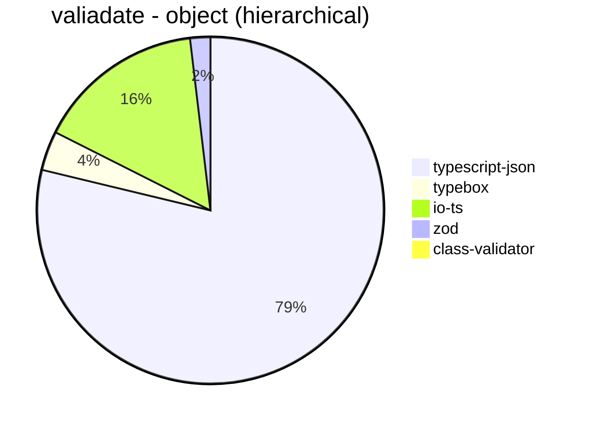


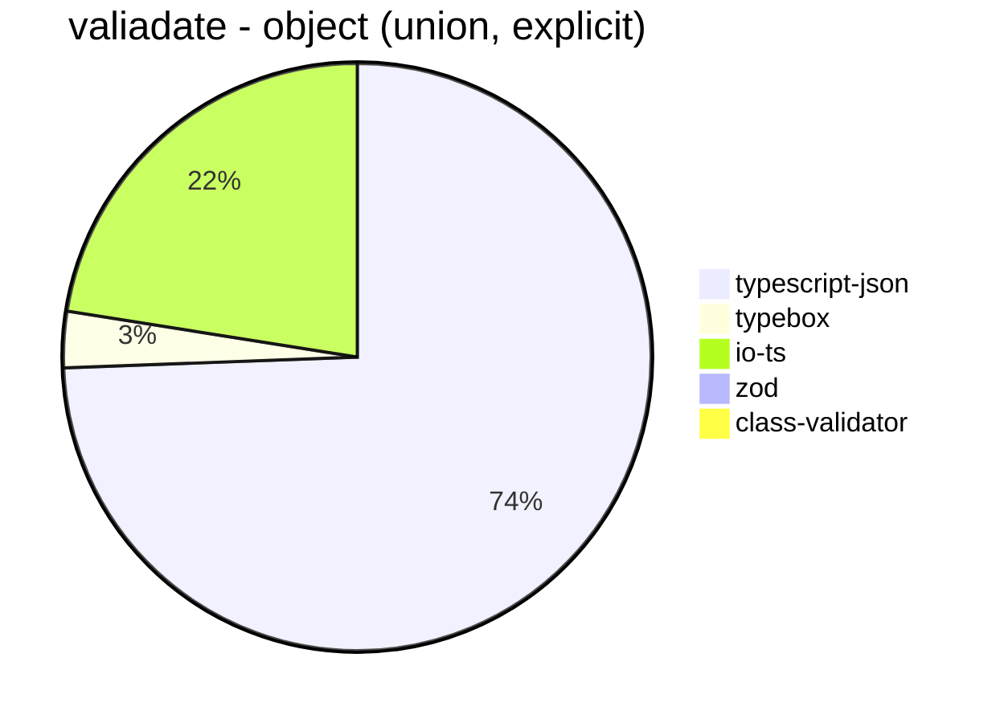


```mermaid
pie title valiadate - array (recursive)
  "typescript-json": 873.508353221957
  "typebox": 34.646243617797225
  "io-ts": 155.71190520274024
  "zod": 9.236569274269558
  "class-validator": 3.566735498404355
```


```mermaid
pie title valiadate - array (union, explicit)
  "typescript-json": 1589.6914834657305
  "typebox": 21.377222852818768
  "io-ts": 72.41444507468331
  "zod": 2.6305900037579857
  "class-validator": 7.1590052750565185
```


```mermaid
pie title valiadate - array (union, implicit)
  "typescript-json": 811.2281976744187
  "typebox": 0
  "io-ts": 0
  "zod": 0
  "class-validator": 0
```


```mermaid
pie title valiadate - ultimate union
  "typescript-json": 112.36152628802532
  "typebox": 0
  "io-ts": 0
  "zod": 0
  "class-validator": 0
```


## optimizer
 Components | typescript-json | typebox | ajv 
------------|-----------------|---------|-----
object (hierarchical) | 80174.4905385735 | 176.01302460202606 | 4.457122481725798
object (recursive) | 61954.726548352046 | 767.1720007486431 | 8.440366972477063
object (union) | 12648.22969878457 | 82.01544685546158 | 4.036697247706422
array (hierarchical) | 5281.599393594845 | 972.2484425146309 | 6
array (recursive) | 5435.150375939849 | 766.0363366703745 | 8.689221667591053
array (union) | 3632.967032967033 | 226.35998539612999 | 5.755662829558114
ultimate union | 405.7893802166578 | 10.873640794900638 | 0.7307270734380709


```mermaid
pie title optimizer - object (hierarchical)
  "typescript-json": 80174.4905385735
  "typebox": 176.01302460202606
  "ajv": 4.457122481725798
```


```mermaid
pie title optimizer - object (recursive)
  "typescript-json": 61954.726548352046
  "typebox": 767.1720007486431
  "ajv": 8.440366972477063
```


```mermaid
pie title optimizer - object (union)
  "typescript-json": 12648.22969878457
  "typebox": 82.01544685546158
  "ajv": 4.036697247706422
```


```mermaid
pie title optimizer - array (hierarchical)
  "typescript-json": 5281.599393594845
  "typebox": 972.2484425146309
  "ajv": 6
```


```mermaid
pie title optimizer - array (recursive)
  "typescript-json": 5435.150375939849
  "typebox": 766.0363366703745
  "ajv": 8.689221667591053
```


```mermaid
pie title optimizer - array (union)
  "typescript-json": 3632.967032967033
  "typebox": 226.35998539612999
  "ajv": 5.755662829558114
```


```mermaid
pie title optimizer - ultimate union
  "typescript-json": 405.7893802166578
  "typebox": 10.873640794900638
  "ajv": 0.7307270734380709
```


## stringify
 Components | typescript-json | fast-json-stringify | JSON.stringify() 
------------|-----------------|---------------------|------------------
object (simple) | 83561.71958615769 | 23163.729809104258 | 6023.805060918463
object (hierarchical) | 4318.307267709292 | 4193.680297397769 | 1522.3322743412446
object (recursive) | 4478.514202476329 | 1238.1934032983509 | 1255.8402411454408
object (union) | 1400.18281535649 | 1281.6472694717995 | 661.4757137560252
array (hierarchical) | 95.76757532281206 | 128.09315866084424 | 48.05706776797447
array (recursive) | 249.4517543859649 | 125.97851811396322 | 126.84094256259203
array (union) | 301.8969219756621 | 235.44583640383198 | 269.06582136863693
ultimate union | 114.57590876692801 | 61.2621685129238 | 185.17840805123512


```mermaid
pie title stringify - object (simple)
  "typescript-json": 83561.71958615769
  "fast-json-stringify": 23163.729809104258
  "JSON.stringify()": 6023.805060918463
```


```mermaid
pie title stringify - object (hierarchical)
  "typescript-json": 4318.307267709292
  "fast-json-stringify": 4193.680297397769
  "JSON.stringify()": 1522.3322743412446
```


```mermaid
pie title stringify - object (recursive)
  "typescript-json": 4478.514202476329
  "fast-json-stringify": 1238.1934032983509
  "JSON.stringify()": 1255.8402411454408
```


```mermaid
pie title stringify - object (union)
  "typescript-json": 1400.18281535649
  "fast-json-stringify": 1281.6472694717995
  "JSON.stringify()": 661.4757137560252
```


```mermaid
pie title stringify - array (hierarchical)
  "typescript-json": 95.76757532281206
  "fast-json-stringify": 128.09315866084424
  "JSON.stringify()": 48.05706776797447
```


```mermaid
pie title stringify - array (recursive)
  "typescript-json": 249.4517543859649
  "fast-json-stringify": 125.97851811396322
  "JSON.stringify()": 126.84094256259203
```


```mermaid
pie title stringify - array (union)
  "typescript-json": 301.8969219756621
  "fast-json-stringify": 235.44583640383198
  "JSON.stringify()": 269.06582136863693
```


```mermaid
pie title stringify - ultimate union
  "typescript-json": 114.57590876692801
  "fast-json-stringify": 61.2621685129238
  "JSON.stringify()": 185.17840805123512
```


