# Benchmark of `typescript-json`
> CPU: 11th Gen Intel(R) Core(TM) i5-1135G7 @ 2.40GHz
> Memory: 16,218 MB
> NodeJS version: v16.17.1
> TypeScript-JSON version: 3.3.13

## is
 Components | typescript-json | typebox | ajv | io-ts | zod | class-validator 
------------|-----------------|---------|-----|-------|-----|-----------------
object (hierarchical) | 104514.66275659823 | 178728.57405028446 | 39447.808320950964 | 8245.814167433304 | 376.1715933669791 | 61.35649602661246
object (recursive) | 61591.32671811834 | 82880.3167004235 | 33788.337331611 | 4202.418025279356 | 67.07772795216741 | 37.323037323037326
object (union, explicit) | 14120.432321152857 | 12038.390550018457 | 6705.750560119493 | 3091.126217159655 | 33.327092304811835 | 15.687015687015686
object (union, implicit) | 13009.571970381074 | Failed | Failed | Failed | 18.652455272173583 | 15.25297619047619
array (recursive) | 6521.699489423779 | 6051.75798679279 | 2036.8031751758974 | 452.1835268103925 | 8.903728436282693 | 3.3482142857142856
array (union, explicit) | 2534.959349593496 | 1980.1557863501482 | 722.8320526893523 | 364.2618073633321 | 2.838758516275549 | 7.782839787395597
array (union, implicit) | 1638.364779874214 | Failed | Failed | Failed | 1.6800448011946985 | 5.0761421319796955
ultimate union | 552.0929374884751 | Failed | Failed | Failed | 0.34328870580157916 | Failed

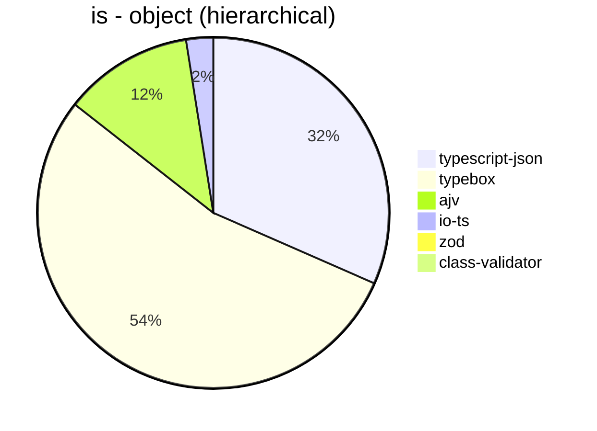
```mermaid
pie title is - object (hierarchical)
  "typescript-json": 104514.66275659823
  "typebox": 178728.57405028446
  "ajv": 39447.808320950964
  "io-ts": 8245.814167433304
  "zod": 376.1715933669791
  "class-validator": 61.35649602661246
```

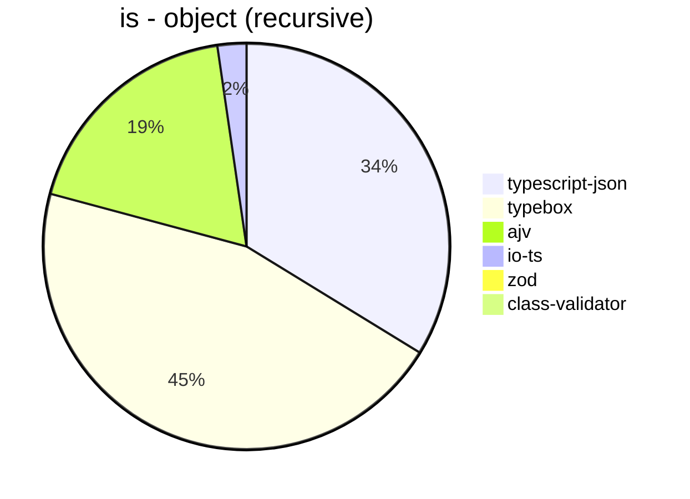
```mermaid
pie title is - object (recursive)
  "typescript-json": 61591.32671811834
  "typebox": 82880.3167004235
  "ajv": 33788.337331611
  "io-ts": 4202.418025279356
  "zod": 67.07772795216741
  "class-validator": 37.323037323037326
```

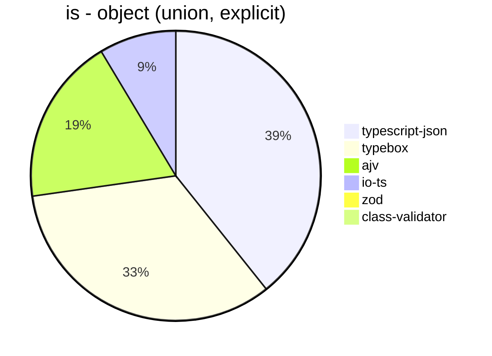
```mermaid
pie title is - object (union, explicit)
  "typescript-json": 14120.432321152857
  "typebox": 12038.390550018457
  "ajv": 6705.750560119493
  "io-ts": 3091.126217159655
  "zod": 33.327092304811835
  "class-validator": 15.687015687015686
```

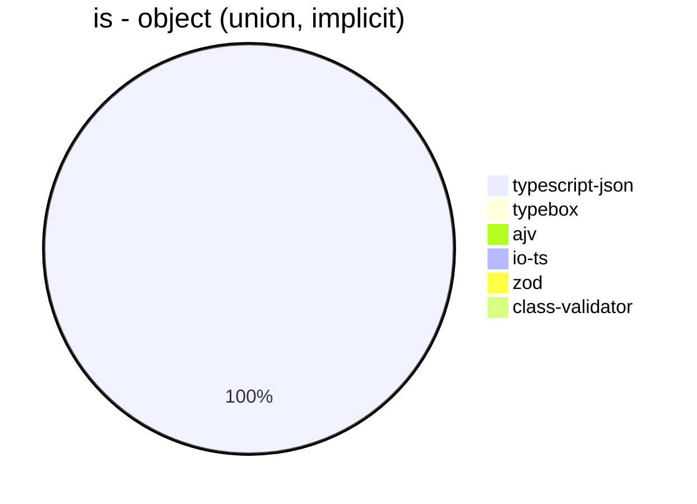
```mermaid
pie title is - object (union, implicit)
  "typescript-json": 13009.571970381074
  "typebox": 0
  "ajv": 0
  "io-ts": 0
  "zod": 18.652455272173583
  "class-validator": 15.25297619047619
```

```mermaid
pie title is - array (recursive)
  "typescript-json": 6521.699489423779
  "typebox": 6051.75798679279
  "ajv": 2036.8031751758974
  "io-ts": 452.1835268103925
  "zod": 8.903728436282693
  "class-validator": 3.3482142857142856
```

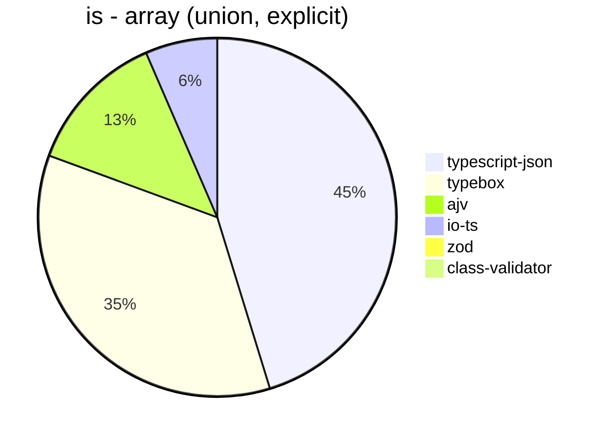
```mermaid
pie title is - array (union, explicit)
  "typescript-json": 2534.959349593496
  "typebox": 1980.1557863501482
  "ajv": 722.8320526893523
  "io-ts": 364.2618073633321
  "zod": 2.838758516275549
  "class-validator": 7.782839787395597
```

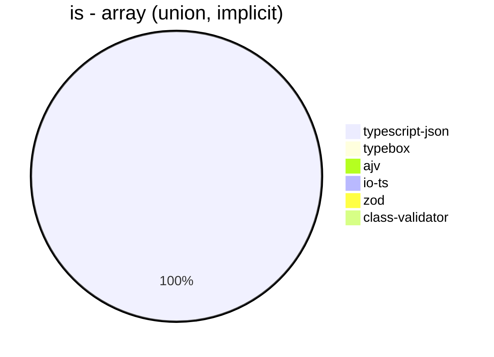
```mermaid
pie title is - array (union, implicit)
  "typescript-json": 1638.364779874214
  "typebox": 0
  "ajv": 0
  "io-ts": 0
  "zod": 1.6800448011946985
  "class-validator": 5.0761421319796955
```

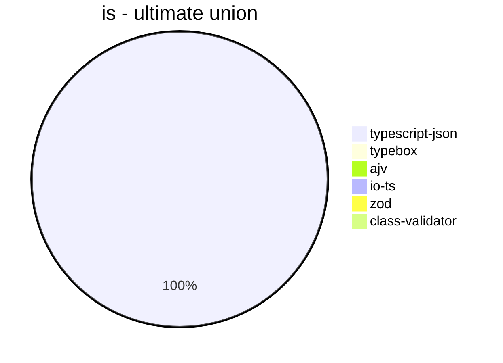
```mermaid
pie title is - ultimate union
  "typescript-json": 552.0929374884751
  "typebox": 0
  "ajv": 0
  "io-ts": 0
  "zod": 0.34328870580157916
  "class-validator": 0
```

## assert
 Components | typescript-json | typebox | io-ts | zod | class-validator 
------------|-----------------|---------|-------|-----|-----------------
object (hierarchical) | 21114.869888475838 | 700.6952067325283 | 3280.1065719360568 | 405.2287581699346 | 59.6854896354539
object (recursive) | 26732.214520248082 | 308.45044716189085 | 1645.8371963656593 | 73.53217032451697 | 40.299906279287725
object (union, explicit) | 4281.6614129427035 | 121.81818181818181 | 1125.5762493085008 | 34.16383540958852 | 16.499814608824618
object (union, implicit) | 4487.150837988826 | Failed | Failed | 17.311233885819522 | 15.37307836520435
array (recursive) | 1523.890142964635 | 31.0956648984818 | 159.5955948727207 | 9.044657998869416 | 3.6087369420702755
array (union, explicit) | 1903.4763313609467 | 17.092446241499726 | 76.69831994156318 | 2.849544072948328 | 7.250418293363079
array (union, implicit) | 1143.5415515017505 | Failed | Failed | 1.7006802721088436 | 4.837209302325581
ultimate union | 229.0993900251166 | Failed | Failed | 0.3565697985380638 | Failed

```mermaid
pie title assert - object (hierarchical)
  "typescript-json": 21114.869888475838
  "typebox": 700.6952067325283
  "io-ts": 3280.1065719360568
  "zod": 405.2287581699346
  "class-validator": 59.6854896354539
```

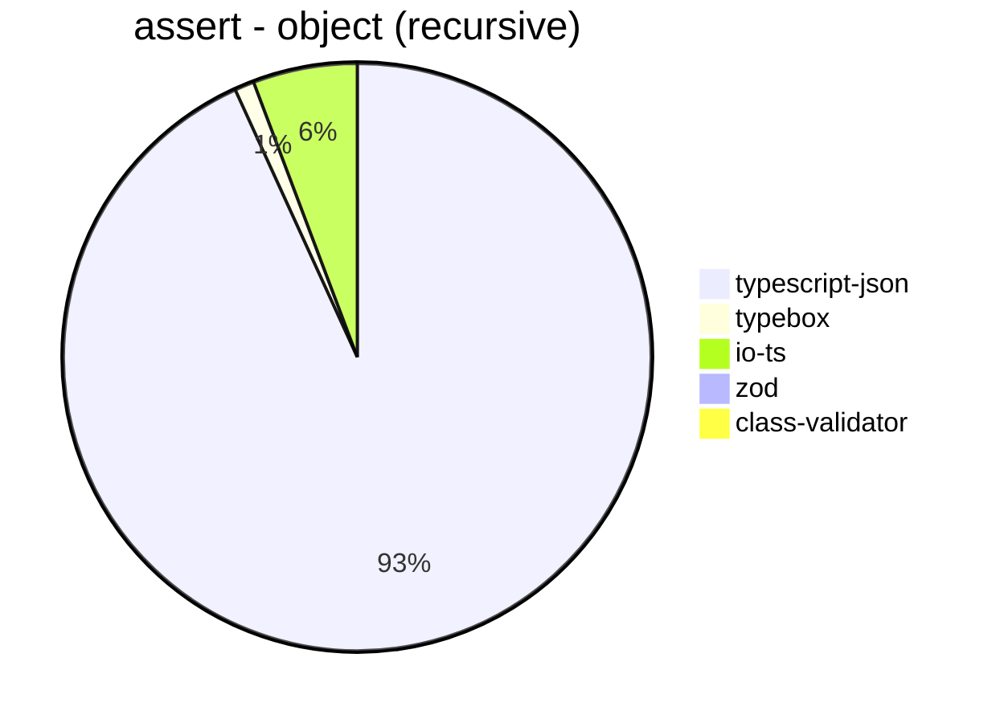
```mermaid
pie title assert - object (recursive)
  "typescript-json": 26732.214520248082
  "typebox": 308.45044716189085
  "io-ts": 1645.8371963656593
  "zod": 73.53217032451697
  "class-validator": 40.299906279287725
```

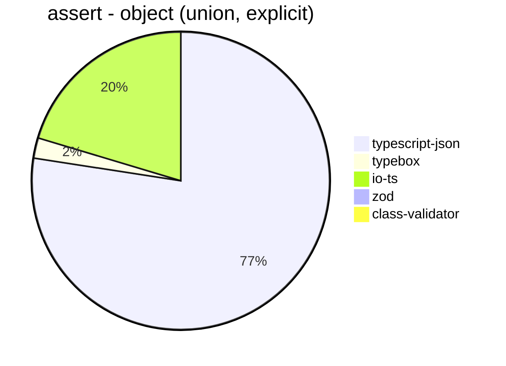
```mermaid
pie title assert - object (union, explicit)
  "typescript-json": 4281.6614129427035
  "typebox": 121.81818181818181
  "io-ts": 1125.5762493085008
  "zod": 34.16383540958852
  "class-validator": 16.499814608824618
```

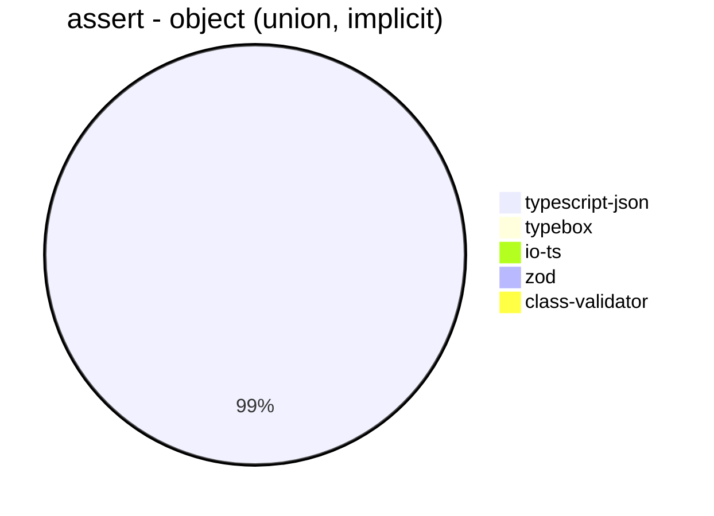
```mermaid
pie title assert - object (union, implicit)
  "typescript-json": 4487.150837988826
  "typebox": 0
  "io-ts": 0
  "zod": 17.311233885819522
  "class-validator": 15.37307836520435
```

```mermaid
pie title assert - array (recursive)
  "typescript-json": 1523.890142964635
  "typebox": 31.0956648984818
  "io-ts": 159.5955948727207
  "zod": 9.044657998869416
  "class-validator": 3.6087369420702755
```

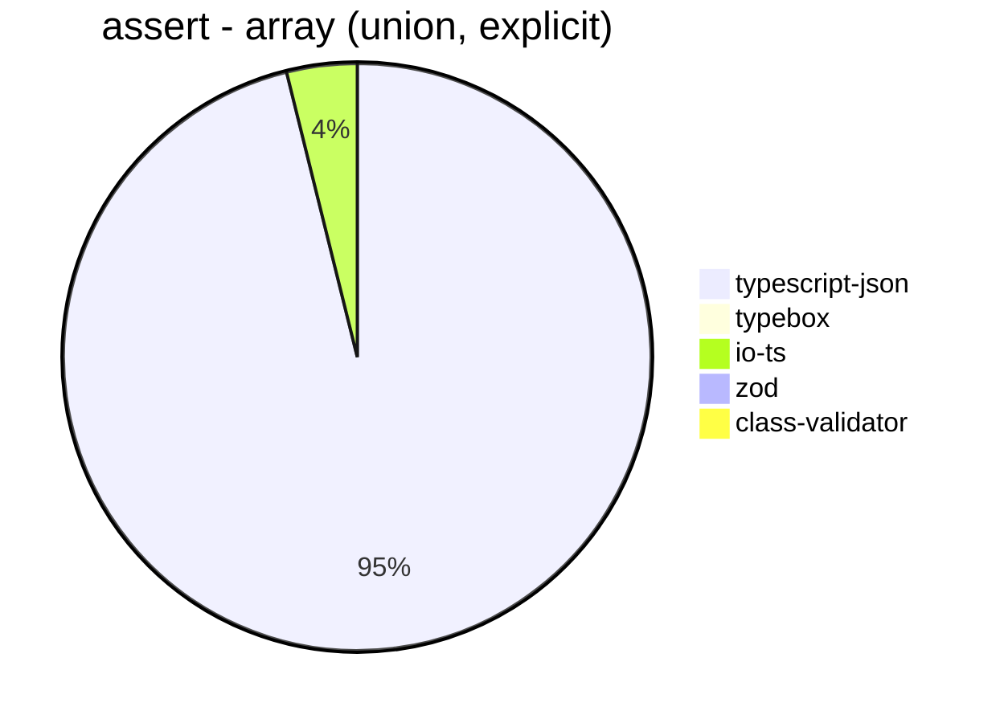
```mermaid
pie title assert - array (union, explicit)
  "typescript-json": 1903.4763313609467
  "typebox": 17.092446241499726
  "io-ts": 76.69831994156318
  "zod": 2.849544072948328
  "class-validator": 7.250418293363079
```

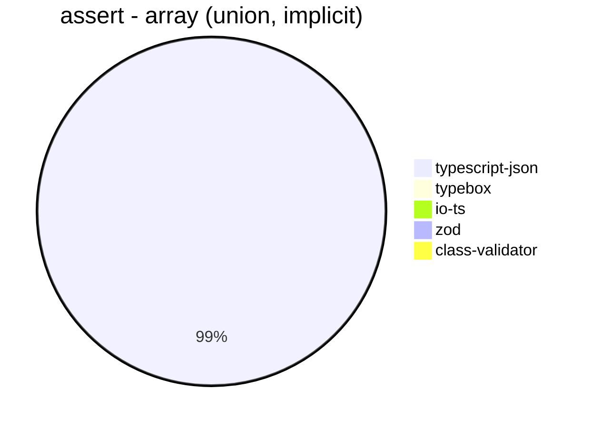
```mermaid
pie title assert - array (union, implicit)
  "typescript-json": 1143.5415515017505
  "typebox": 0
  "io-ts": 0
  "zod": 1.7006802721088436
  "class-validator": 4.837209302325581
```

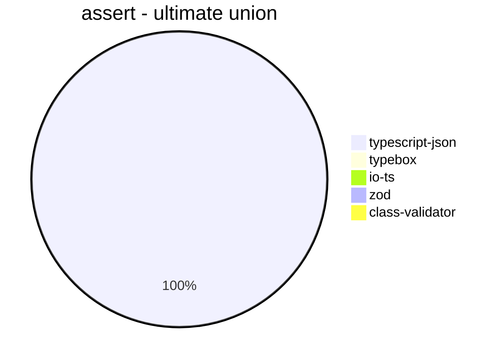
```mermaid
pie title assert - ultimate union
  "typescript-json": 229.0993900251166
  "typebox": 0
  "io-ts": 0
  "zod": 0.3565697985380638
  "class-validator": 0
```

## valiadate
 Components | typescript-json | typebox | io-ts | zod | class-validator 
------------|-----------------|---------|-------|-----|-----------------
object (hierarchical) | 16361.675799893937 | 726.5739385065885 | 3294.7955390334573 | 397.79315504020946 | 62.267657992565056
object (recursive) | 15939.43298969072 | 303.928701345944 | 1521.8732982392448 | 74.68568211671983 | 40.03707136237257
object (union, explicit) | 3550.4132231404956 | 123.73513225634653 | 1125.733137829912 | 34.93202416918429 | 16.185396358285818
object (union, implicit) | 3019.075568598679 | Failed | Failed | 17.037037037037035 | 14.187044987866342
array (recursive) | 1006.3981934512608 | 28.969762810066996 | 142.49456127628716 | 8.86959803736554 | 3.3632286995515694
array (union, explicit) | 1582.888684452622 | 16.961517417472187 | 80.07414272474514 | 2.609019754006709 | 7.318446237568025
array (union, implicit) | 831.0725266775186 | Failed | Failed | 1.6860247283626826 | 4.848936963819471
ultimate union | 125.99258867125464 | Failed | Failed | 0.3546099290780142 | Failed

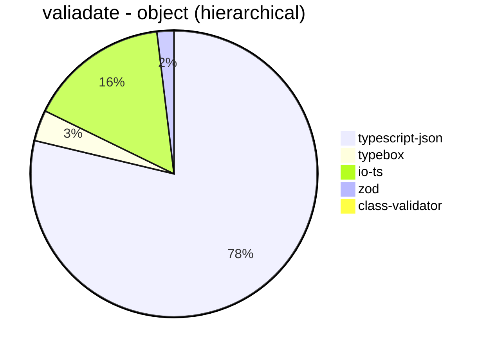
```mermaid
pie title valiadate - object (hierarchical)
  "typescript-json": 16361.675799893937
  "typebox": 726.5739385065885
  "io-ts": 3294.7955390334573
  "zod": 397.79315504020946
  "class-validator": 62.267657992565056
```

```mermaid
pie title valiadate - object (recursive)
  "typescript-json": 15939.43298969072
  "typebox": 303.928701345944
  "io-ts": 1521.8732982392448
  "zod": 74.68568211671983
  "class-validator": 40.03707136237257
```

```mermaid
pie title valiadate - object (union, explicit)
  "typescript-json": 3550.4132231404956
  "typebox": 123.73513225634653
  "io-ts": 1125.733137829912
  "zod": 34.93202416918429
  "class-validator": 16.185396358285818
```

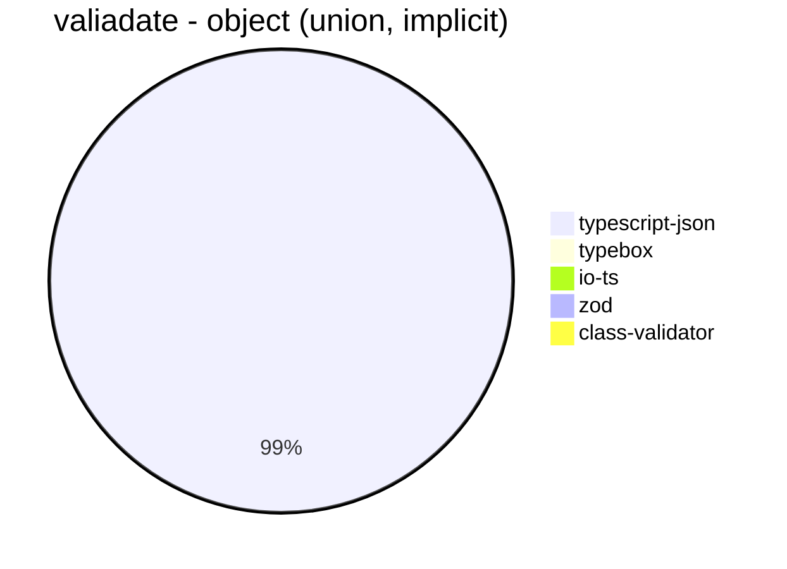
```mermaid
pie title valiadate - object (union, implicit)
  "typescript-json": 3019.075568598679
  "typebox": 0
  "io-ts": 0
  "zod": 17.037037037037035
  "class-validator": 14.187044987866342
```

```mermaid
pie title valiadate - array (recursive)
  "typescript-json": 1006.3981934512608
  "typebox": 28.969762810066996
  "io-ts": 142.49456127628716
  "zod": 8.86959803736554
  "class-validator": 3.3632286995515694
```

```mermaid
pie title valiadate - array (union, explicit)
  "typescript-json": 1582.888684452622
  "typebox": 16.961517417472187
  "io-ts": 80.07414272474514
  "zod": 2.609019754006709
  "class-validator": 7.318446237568025
```

```mermaid
pie title valiadate - array (union, implicit)
  "typescript-json": 831.0725266775186
  "typebox": 0
  "io-ts": 0
  "zod": 1.6860247283626826
  "class-validator": 4.848936963819471
```

```mermaid
pie title valiadate - ultimate union
  "typescript-json": 125.99258867125464
  "typebox": 0
  "io-ts": 0
  "zod": 0.3546099290780142
  "class-validator": 0
```

## optimizer
 Components | typescript-json | typebox | ajv 
------------|-----------------|---------|-----
object (hierarchical) | 84952.44956772335 | 171.05970952124798 | 4.531448250860975
object (recursive) | 66612.70491803279 | 704.0531097134871 | 8.391098139365194
object (union) | 11619.541484716156 | 78.78787878787878 | 4.275092936802974
array (hierarchical) | 6579.895514321744 | 858.9719799591761 | 5.947955390334573
array (recursive) | 6057.027965636995 | 754.5133072771264 | 8.960238939705059
array (union) | 3727.4534610518704 | 230.712711241734 | 5.9501673484566755
ultimate union | 538.8695811231023 | 10.545790934320074 | 0.9102494083378845

```mermaid
pie title optimizer - object (hierarchical)
  "typescript-json": 84952.44956772335
  "typebox": 171.05970952124798
  "ajv": 4.531448250860975
```

```mermaid
pie title optimizer - object (recursive)
  "typescript-json": 66612.70491803279
  "typebox": 704.0531097134871
  "ajv": 8.391098139365194
```

```mermaid
pie title optimizer - object (union)
  "typescript-json": 11619.541484716156
  "typebox": 78.78787878787878
  "ajv": 4.275092936802974
```

```mermaid
pie title optimizer - array (hierarchical)
  "typescript-json": 6579.895514321744
  "typebox": 858.9719799591761
  "ajv": 5.947955390334573
```

```mermaid
pie title optimizer - array (recursive)
  "typescript-json": 6057.027965636995
  "typebox": 754.5133072771264
  "ajv": 8.960238939705059
```

```mermaid
pie title optimizer - array (union)
  "typescript-json": 3727.4534610518704
  "typebox": 230.712711241734
  "ajv": 5.9501673484566755
```

```mermaid
pie title optimizer - ultimate union
  "typescript-json": 538.8695811231023
  "typebox": 10.545790934320074
  "ajv": 0.9102494083378845
```

## stringify
 Components | TSON.stringify() | TSON.assertStringify() | JSON.stringify() | fast-json-stringify 
------------|------------------|------------------------|------------------|---------------------
object (simple) | 94608.078994614 | 24934.145897762417 | 6090.652623659958 | 25478.63247863248
object (hierarchical) | 4423.7664017741645 | 3629.0172766115547 | 1478.3877439358016 | 4249.256505576208
object (recursive) | 4772.403449568804 | 4083.7116397312516 | 1203.622392974753 | 1236.202674703334
object (union) | 1380.2919708029196 | 1010.0919084519733 | 630.2823233231434 | 1225.7013574660632
array (hierarchical) | 105.83941605839415 | 78.82037533512064 | 51.27730470196224 | 138.0189366351056
array (recursive) | 254.22189940076268 | 230.58297634568822 | 125.42924272546539 | 130.32863849765258
array (union) | 312.0605732828556 | 258.7100232267286 | 270.8643815201192 | 240.2926280247608

```mermaid
pie title stringify - object (simple)
  "TSON.stringify()": 94608.078994614
  "TSON.assertStringify()": 24934.145897762417
  "JSON.stringify()": 6090.652623659958
  "fast-json-stringify": 25478.63247863248
```

```mermaid
pie title stringify - object (hierarchical)
  "TSON.stringify()": 4423.7664017741645
  "TSON.assertStringify()": 3629.0172766115547
  "JSON.stringify()": 1478.3877439358016
  "fast-json-stringify": 4249.256505576208
```

```mermaid
pie title stringify - object (recursive)
  "TSON.stringify()": 4772.403449568804
  "TSON.assertStringify()": 4083.7116397312516
  "JSON.stringify()": 1203.622392974753
  "fast-json-stringify": 1236.202674703334
```

```mermaid
pie title stringify - object (union)
  "TSON.stringify()": 1380.2919708029196
  "TSON.assertStringify()": 1010.0919084519733
  "JSON.stringify()": 630.2823233231434
  "fast-json-stringify": 1225.7013574660632
```

```mermaid
pie title stringify - array (hierarchical)
  "TSON.stringify()": 105.83941605839415
  "TSON.assertStringify()": 78.82037533512064
  "JSON.stringify()": 51.27730470196224
  "fast-json-stringify": 138.0189366351056
```

```mermaid
pie title stringify - array (recursive)
  "TSON.stringify()": 254.22189940076268
  "TSON.assertStringify()": 230.58297634568822
  "JSON.stringify()": 125.42924272546539
  "fast-json-stringify": 130.32863849765258
```

```mermaid
pie title stringify - array (union)
  "TSON.stringify()": 312.0605732828556
  "TSON.assertStringify()": 258.7100232267286
  "JSON.stringify()": 270.8643815201192
  "fast-json-stringify": 240.2926280247608
```

