# Benchmark of `typescript-json`
> CPU: 11th Gen Intel(R) Core(TM) i5-1135G7 @ 2.40GHz
> Memory: 16,218 MB
> NodeJS version: v16.17.1
> TypeScript-JSON version: 3.3.17

## TSON iterate
 Components | is | assert | validate 
------------|----|--------|----------
simple | 318838.78075651854 | 216226.69840688517 | 77344.07407407407
object (hierarchical) | 101619.89795918367 | 51238.1926366679 | 29939.695762404925
object (recursive) | 62900.688116049845 | 37911.03008204193 | 19791.887447469395
object (union, explicit) | 19736.355555555554 | 5477.672035139092 | 4100.036443148688
object (union, implicit) | 16322.200392927309 | 5328.592814371257 | 3663.9661204198123
array (recursive) | 6963.659841357683 | 2322.211808809747 | 1309.948032665182
array (union, explicit) | 3343.5550008914247 | 2137.835848362164 | 1744.6961524631427
array (union, implicit) | 1877.442273534636 | 1336.9983507421662 | 1032.9650425647528
ultimate union | 420.42583904727536 | 208.39311334289815 | 158.15427967594223

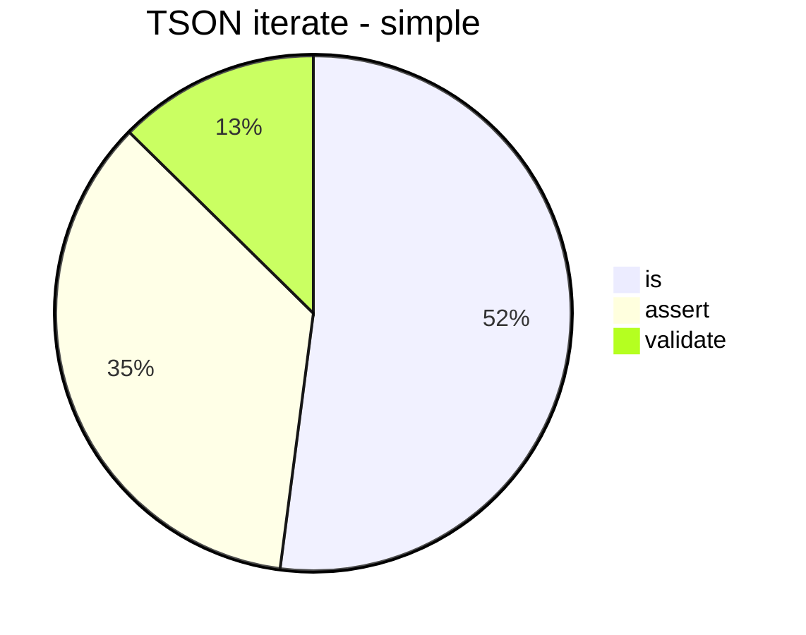
```mermaid
pie title TSON iterate - simple
  "is": 318838.78075651854
  "assert": 216226.69840688517
  "validate": 77344.07407407407
```

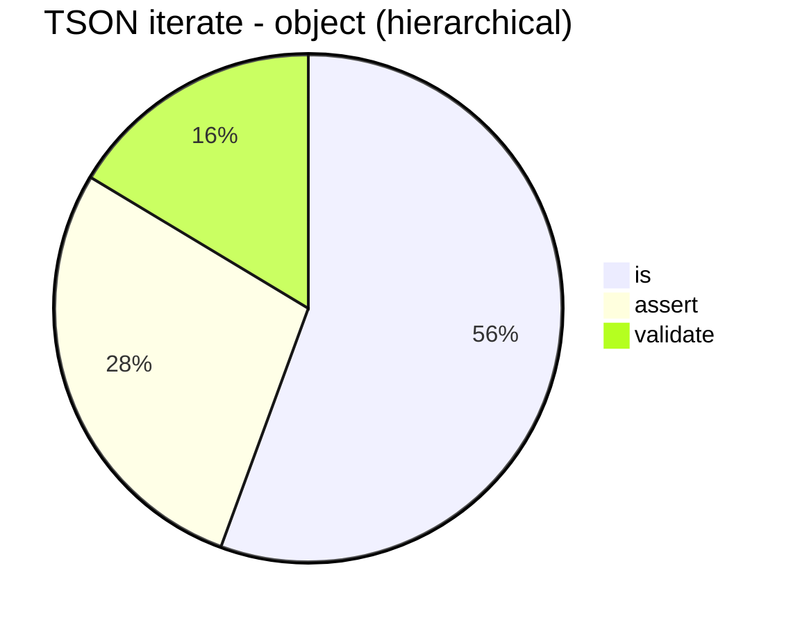
```mermaid
pie title TSON iterate - object (hierarchical)
  "is": 101619.89795918367
  "assert": 51238.1926366679
  "validate": 29939.695762404925
```

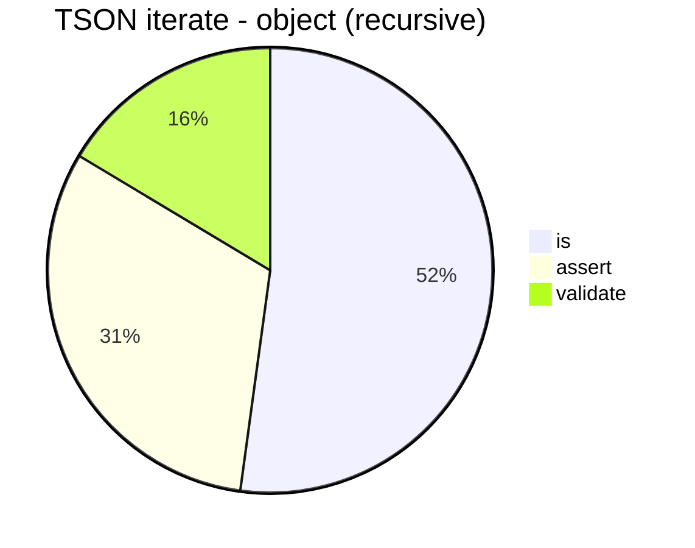
```mermaid
pie title TSON iterate - object (recursive)
  "is": 62900.688116049845
  "assert": 37911.03008204193
  "validate": 19791.887447469395
```

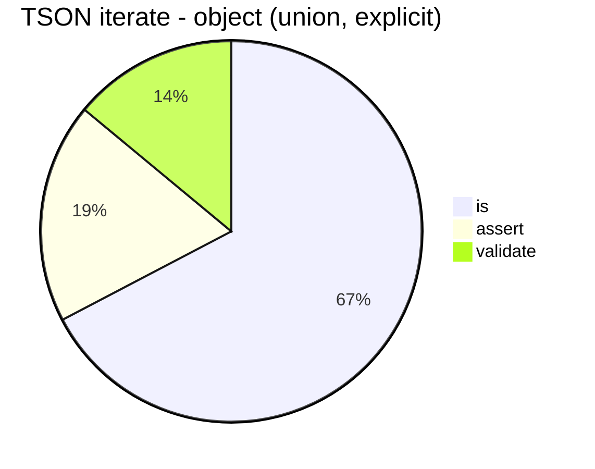
```mermaid
pie title TSON iterate - object (union, explicit)
  "is": 19736.355555555554
  "assert": 5477.672035139092
  "validate": 4100.036443148688
```

```mermaid
pie title TSON iterate - object (union, implicit)
  "is": 16322.200392927309
  "assert": 5328.592814371257
  "validate": 3663.9661204198123
```

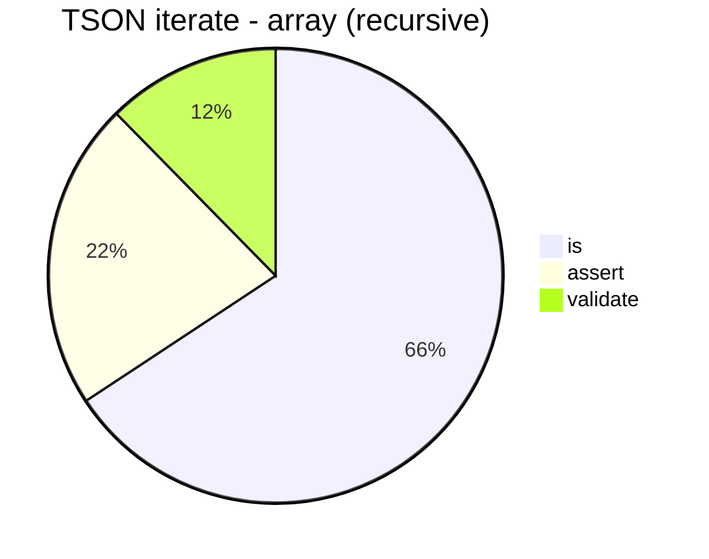
```mermaid
pie title TSON iterate - array (recursive)
  "is": 6963.659841357683
  "assert": 2322.211808809747
  "validate": 1309.948032665182
```

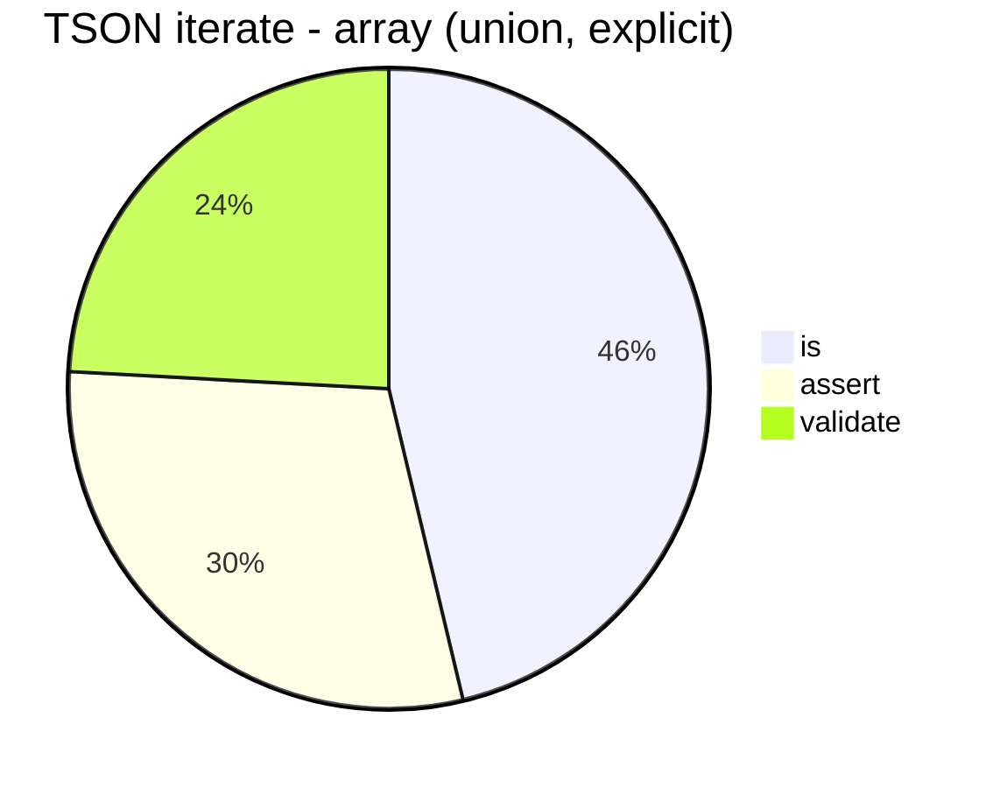
```mermaid
pie title TSON iterate - array (union, explicit)
  "is": 3343.5550008914247
  "assert": 2137.835848362164
  "validate": 1744.6961524631427
```

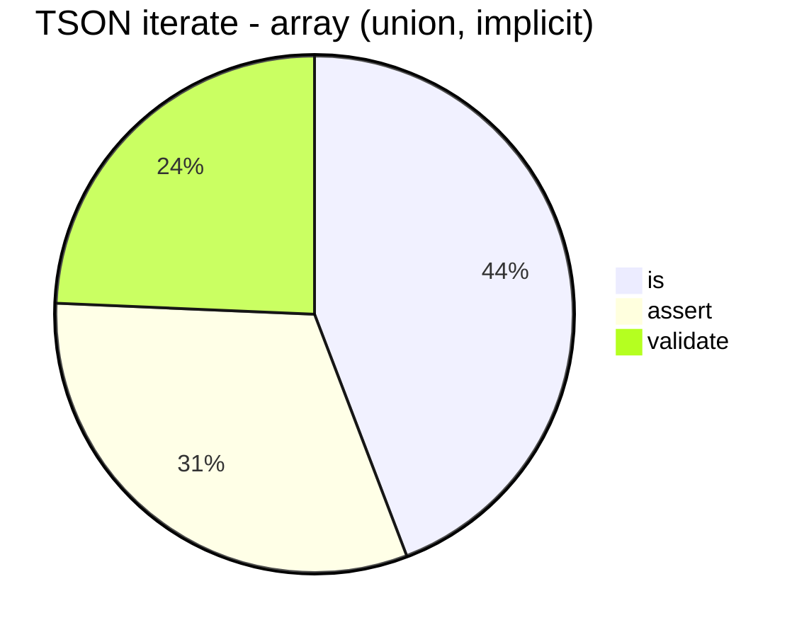
```mermaid
pie title TSON iterate - array (union, implicit)
  "is": 1877.442273534636
  "assert": 1336.9983507421662
  "validate": 1032.9650425647528
```

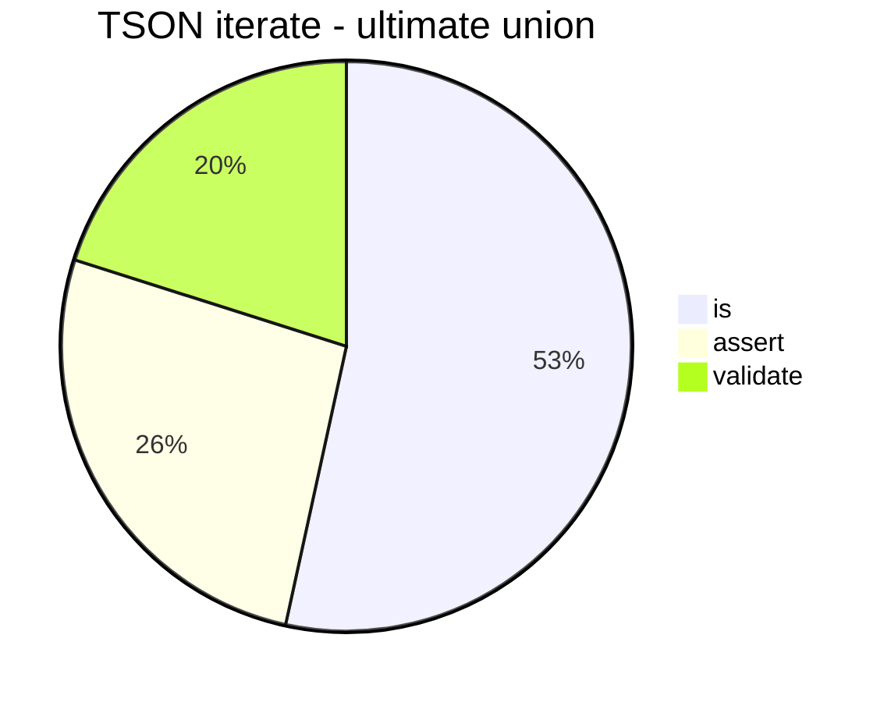
```mermaid
pie title TSON iterate - ultimate union
  "is": 420.42583904727536
  "assert": 208.39311334289815
  "validate": 158.15427967594223
```

## is
 Components | typescript-json | typebox | ajv | io-ts | zod | class-validator 
------------|-----------------|---------|-----|-------|-----|-----------------
object (simple) | 327482.15266337176 | 1587090.9587047482 | 395703.5298535487 | 39394.43112668265 | 3226.0604975836764 | 168.50678733031674
object (hierarchical) | 96579.08496732025 | 171509.36680404647 | 40465.51724137931 | 8675.650557620818 | 399.1195891415994 | 56.33549316054716
object (recursive) | 61933.88429752066 | 82388.14317673378 | 37844.880091358966 | 5673.431040962044 | 67.82081028020704 | 37.010027347310846
object (union, explicit) | 14191.076807228916 | 11956.450734893848 | 6793.09097485983 | 3302.5850846196763 | 33.223201174743025 | 92.18436873747495
object (union, implicit) | 11235.18308795772 | Failed | Failed | Failed | 16.91560194349469 | 64.89945155393053
array (recursive) | 6567.596566523605 | 7024.354243542435 | 2230.7124400147654 | 496.5541615126348 | 8.682800665065582 | 3.1278748850046
array (union, explicit) | 3734.057971014493 | 1950.922443130933 | 761.7243867243868 | 365.330321852061 | 2.8285875919290966 | 35.50295857988166
array (union, implicit) | 2050.7791017415216 | Failed | Failed | Failed | 1.8811136192626035 | 24.34001123385134
ultimate union | 440.6998158379374 | Failed | Failed | Failed | 0.3552397868561279 | Failed

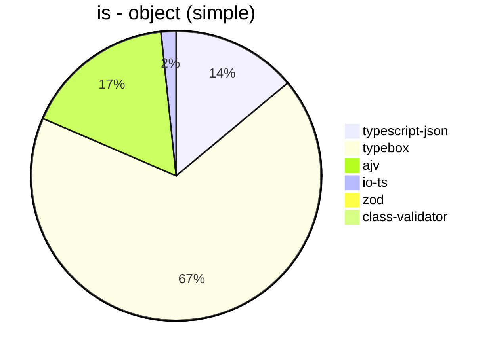
```mermaid
pie title is - object (simple)
  "typescript-json": 327482.15266337176
  "typebox": 1587090.9587047482
  "ajv": 395703.5298535487
  "io-ts": 39394.43112668265
  "zod": 3226.0604975836764
  "class-validator": 168.50678733031674
```

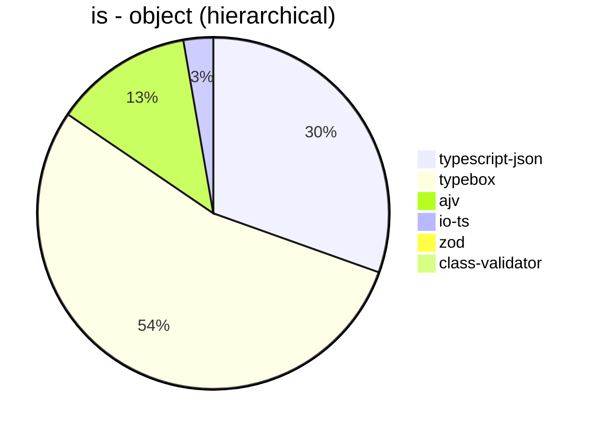
```mermaid
pie title is - object (hierarchical)
  "typescript-json": 96579.08496732025
  "typebox": 171509.36680404647
  "ajv": 40465.51724137931
  "io-ts": 8675.650557620818
  "zod": 399.1195891415994
  "class-validator": 56.33549316054716
```

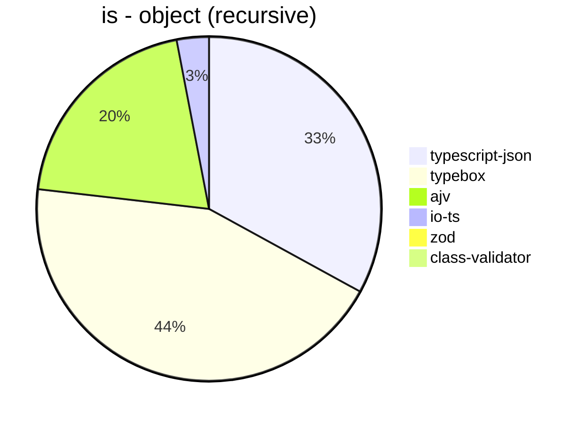
```mermaid
pie title is - object (recursive)
  "typescript-json": 61933.88429752066
  "typebox": 82388.14317673378
  "ajv": 37844.880091358966
  "io-ts": 5673.431040962044
  "zod": 67.82081028020704
  "class-validator": 37.010027347310846
```

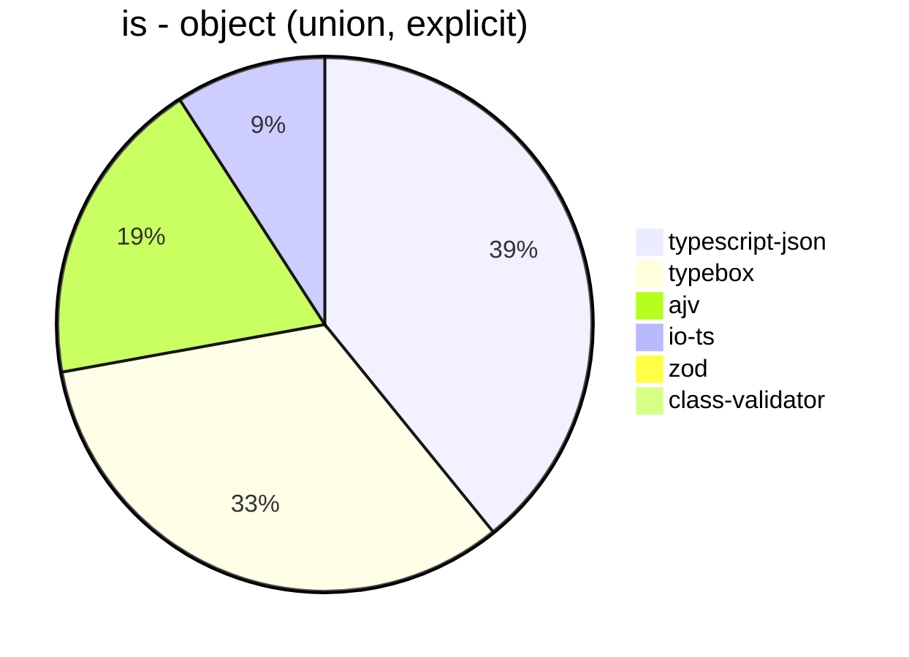
```mermaid
pie title is - object (union, explicit)
  "typescript-json": 14191.076807228916
  "typebox": 11956.450734893848
  "ajv": 6793.09097485983
  "io-ts": 3302.5850846196763
  "zod": 33.223201174743025
  "class-validator": 92.18436873747495
```

```mermaid
pie title is - object (union, implicit)
  "typescript-json": 11235.18308795772
  "typebox": 0
  "ajv": 0
  "io-ts": 0
  "zod": 16.91560194349469
  "class-validator": 64.89945155393053
```

```mermaid
pie title is - array (recursive)
  "typescript-json": 6567.596566523605
  "typebox": 7024.354243542435
  "ajv": 2230.7124400147654
  "io-ts": 496.5541615126348
  "zod": 8.682800665065582
  "class-validator": 3.1278748850046
```

```mermaid
pie title is - array (union, explicit)
  "typescript-json": 3734.057971014493
  "typebox": 1950.922443130933
  "ajv": 761.7243867243868
  "io-ts": 365.330321852061
  "zod": 2.8285875919290966
  "class-validator": 35.50295857988166
```

```mermaid
pie title is - array (union, implicit)
  "typescript-json": 2050.7791017415216
  "typebox": 0
  "ajv": 0
  "io-ts": 0
  "zod": 1.8811136192626035
  "class-validator": 24.34001123385134
```

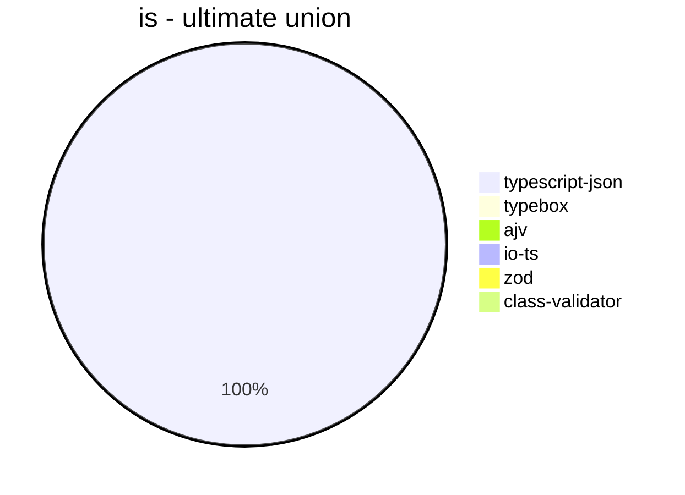
```mermaid
pie title is - ultimate union
  "typescript-json": 440.6998158379374
  "typebox": 0
  "ajv": 0
  "io-ts": 0
  "zod": 0.3552397868561279
  "class-validator": 0
```

## assertType (iterate)
 Components | typescript-json | typebox | io-ts | zod | class-validator 
------------|-----------------|---------|-------|-----|-----------------
object (simple) | 238506.35476146618 | 3237.513873473918 | 16617.932296431838 | 3364.6470261256254 | 181.63340724316333
object (hierarchical) | 53025.520361990944 | 767.9866146123816 | 3325.517993456925 | 387.84875183553595 | 60.13808139534884
object (recursive) | 37973.834531048466 | 297.9752732485218 | 1512.434198584135 | 69.03497527925288 | 37.73932253313696
object (union, explicit) | 5301.997859436318 | 119.76159433786553 | 1026.4814814814815 | 33.57857008111677 | 91.28090723182748
object (union, implicit) | 5341.399851079673 | Failed | Failed | 18.87148518588413 | 65.53175910671791
array (recursive) | 2386.029411764706 | 32.91420118343195 | 159.59409594095942 | 9.319132750095093 | 3.3619723571161746
array (union, explicit) | 2402.902810949844 | 17.65589782118708 | 78.88888888888889 | 3.025146530535073 | 33.59030837004405
array (union, implicit) | 1274.9409413047429 | Failed | Failed | 1.6917293233082706 | 24.791824375473126
ultimate union | 236.81826417829316 | Failed | Failed | 0.34584125886218225 | Failed

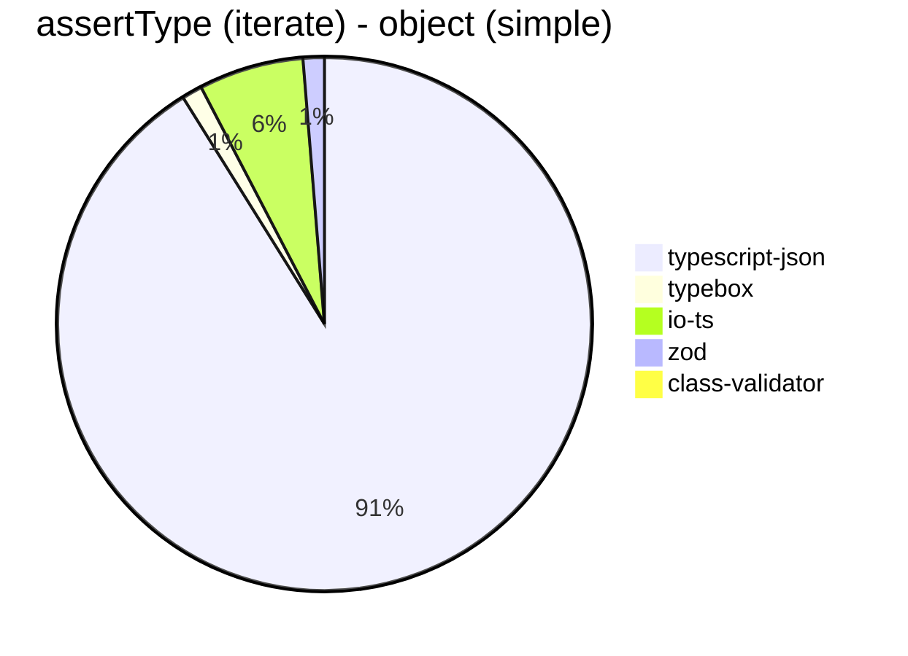
```mermaid
pie title assertType (iterate) - object (simple)
  "typescript-json": 238506.35476146618
  "typebox": 3237.513873473918
  "io-ts": 16617.932296431838
  "zod": 3364.6470261256254
  "class-validator": 181.63340724316333
```

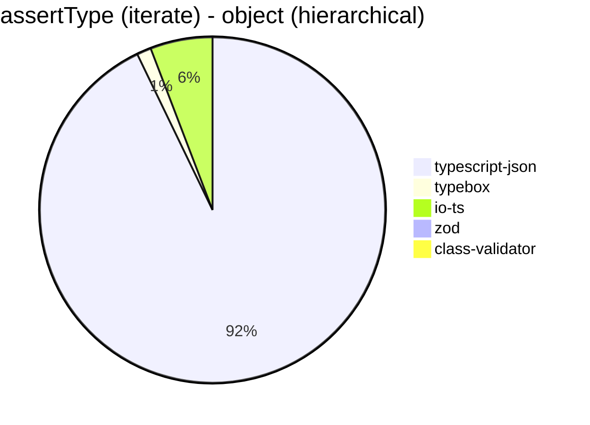
```mermaid
pie title assertType (iterate) - object (hierarchical)
  "typescript-json": 53025.520361990944
  "typebox": 767.9866146123816
  "io-ts": 3325.517993456925
  "zod": 387.84875183553595
  "class-validator": 60.13808139534884
```

```mermaid
pie title assertType (iterate) - object (recursive)
  "typescript-json": 37973.834531048466
  "typebox": 297.9752732485218
  "io-ts": 1512.434198584135
  "zod": 69.03497527925288
  "class-validator": 37.73932253313696
```

```mermaid
pie title assertType (iterate) - object (union, explicit)
  "typescript-json": 5301.997859436318
  "typebox": 119.76159433786553
  "io-ts": 1026.4814814814815
  "zod": 33.57857008111677
  "class-validator": 91.28090723182748
```

```mermaid
pie title assertType (iterate) - object (union, implicit)
  "typescript-json": 5341.399851079673
  "typebox": 0
  "io-ts": 0
  "zod": 18.87148518588413
  "class-validator": 65.53175910671791
```

```mermaid
pie title assertType (iterate) - array (recursive)
  "typescript-json": 2386.029411764706
  "typebox": 32.91420118343195
  "io-ts": 159.59409594095942
  "zod": 9.319132750095093
  "class-validator": 3.3619723571161746
```

```mermaid
pie title assertType (iterate) - array (union, explicit)
  "typescript-json": 2402.902810949844
  "typebox": 17.65589782118708
  "io-ts": 78.88888888888889
  "zod": 3.025146530535073
  "class-validator": 33.59030837004405
```

```mermaid
pie title assertType (iterate) - array (union, implicit)
  "typescript-json": 1274.9409413047429
  "typebox": 0
  "io-ts": 0
  "zod": 1.6917293233082706
  "class-validator": 24.791824375473126
```

```mermaid
pie title assertType (iterate) - ultimate union
  "class-validator": 0
  "typescript-json": 236.81826417829316
  "typebox": 0
  "io-ts": 0
  "zod": 0.34584125886218225
```

## assertType (throw)
 Components | typescript-json | typebox | io-ts | zod | class-validator 
------------|-----------------|---------|-------|-----|-----------------
object (simple) | 437.92532646680155 | 23.490548724536612 | 98.52032215770743 | 31.244188209038498 | 1.8559762435040832
object (hierarchical) | 286.11579539066895 | 6.7889908256880735 | 33.527971369372764 | 4.132231404958678 | 0.727802037845706
object (recursive) | 39.24418604651163 | Failed | Failed | 0.18261504747991233 | 0.7472445357743321
object (union, explicit) | 50.66956207021354 | 1.1322891111530478 | 9.610053594529662 | 0.3655638822884299 | 0.9347541596560104
object (union, implicit) | 40.797824116047146 | Failed | Failed | 0.18214936247723132 | 0.7414272474513439
array (recursive) | 17.618694362017802 | 0.3629764065335753 | 1.675041876046901 | 0.1643115346697338 | 0.12906556530717606
array (union, explicit) | 4.57121960138965 | 0.17790428749332857 | 0.7421150278293136 | 0.11997600479904018 | 0.36436509382401167
array (union, implicit) | 1.8511662347278786 | Failed | Failed | 0.09209799226376865 | 0.35688793718772305
ultimate union | 2.7492668621700878 | Failed | Failed | 0.02552192333214231 | Failed

```mermaid
pie title assertType (throw) - object (simple)
  "typescript-json": 437.92532646680155
  "typebox": 23.490548724536612
  "io-ts": 98.52032215770743
  "zod": 31.244188209038498
  "class-validator": 1.8559762435040832
```

```mermaid
pie title assertType (throw) - object (hierarchical)
  "typescript-json": 286.11579539066895
  "typebox": 6.7889908256880735
  "io-ts": 33.527971369372764
  "zod": 4.132231404958678
  "class-validator": 0.727802037845706
```

```mermaid
pie title assertType (throw) - object (recursive)
  "typescript-json": 39.24418604651163
  "typebox": 0
  "io-ts": 0
  "zod": 0.18261504747991233
  "class-validator": 0.7472445357743321
```

```mermaid
pie title assertType (throw) - object (union, explicit)
  "typescript-json": 50.66956207021354
  "typebox": 1.1322891111530478
  "io-ts": 9.610053594529662
  "zod": 0.3655638822884299
  "class-validator": 0.9347541596560104
```

```mermaid
pie title assertType (throw) - object (union, implicit)
  "typescript-json": 40.797824116047146
  "typebox": 0
  "io-ts": 0
  "zod": 0.18214936247723132
  "class-validator": 0.7414272474513439
```

```mermaid
pie title assertType (throw) - array (recursive)
  "typescript-json": 17.618694362017802
  "typebox": 0.3629764065335753
  "io-ts": 1.675041876046901
  "zod": 0.1643115346697338
  "class-validator": 0.12906556530717606
```

```mermaid
pie title assertType (throw) - array (union, explicit)
  "typescript-json": 4.57121960138965
  "typebox": 0.17790428749332857
  "io-ts": 0.7421150278293136
  "zod": 0.11997600479904018
  "class-validator": 0.36436509382401167
```

```mermaid
pie title assertType (throw) - array (union, implicit)
  "typescript-json": 1.8511662347278786
  "typebox": 0
  "io-ts": 0
  "zod": 0.09209799226376865
  "class-validator": 0.35688793718772305
```

```mermaid
pie title assertType (throw) - ultimate union
  "class-validator": 0
  "typescript-json": 2.7492668621700878
  "typebox": 0
  "io-ts": 0
  "zod": 0.02552192333214231
```

## validate
 Components | typescript-json | typebox | io-ts | zod | class-validator 
------------|-----------------|---------|-------|-----|-----------------
object (simple) | 73514.18634449937 | 2735.3322228391635 | 11536.599205598639 | 3334.5878810688746 | 174.43100995732576
object (hierarchical) | 29185.770750988144 | 757.5301204819277 | 3291.2332838038633 | 399.43555973659454 | 60.63967461638011
object (recursive) | 18717.101660887023 | 292.5093632958802 | 1433.8528452337805 | 73.31821617535904 | 38.33394765941762
object (union, explicit) | 4345.731037009894 | 122.97496318114874 | 1071.4156572048455 | 36.41141141141141 | 91.12534309240623
object (union, implicit) | 3889.1316220644453 | 115.88541666666666 | 296.0788028035613 | 17.96629005371365 | 66.59408455815641
array (recursive) | 1377.7777777777778 | 32.741398446170926 | 166.66666666666666 | 9.476876421531463 | 3.3695245226506927
array (union, explicit) | 1926.1020669471375 | 18.381656244078073 | 78.03362573099415 | 2.836074872376631 | 35.55973659454374
array (union, implicit) | 1035.8653669302923 | 11.511325659116228 | 52.5830258302583 | 1.8705574261129816 | 25.241276911655532
ultimate union | 164.48993999294032 | Failed | Failed | 0.35316969803990816 | Failed

```mermaid
pie title validate - object (simple)
  "typescript-json": 73514.18634449937
  "typebox": 2735.3322228391635
  "io-ts": 11536.599205598639
  "zod": 3334.5878810688746
  "class-validator": 174.43100995732576
```

```mermaid
pie title validate - object (hierarchical)
  "typescript-json": 29185.770750988144
  "typebox": 757.5301204819277
  "io-ts": 3291.2332838038633
  "zod": 399.43555973659454
  "class-validator": 60.63967461638011
```

```mermaid
pie title validate - object (recursive)
  "typescript-json": 18717.101660887023
  "typebox": 292.5093632958802
  "io-ts": 1433.8528452337805
  "zod": 73.31821617535904
  "class-validator": 38.33394765941762
```

```mermaid
pie title validate - object (union, explicit)
  "typescript-json": 4345.731037009894
  "typebox": 122.97496318114874
  "io-ts": 1071.4156572048455
  "zod": 36.41141141141141
  "class-validator": 91.12534309240623
```

```mermaid
pie title validate - object (union, implicit)
  "typescript-json": 3889.1316220644453
  "typebox": 115.88541666666666
  "io-ts": 296.0788028035613
  "zod": 17.96629005371365
  "class-validator": 66.59408455815641
```

```mermaid
pie title validate - array (recursive)
  "typescript-json": 1377.7777777777778
  "typebox": 32.741398446170926
  "io-ts": 166.66666666666666
  "zod": 9.476876421531463
  "class-validator": 3.3695245226506927
```

```mermaid
pie title validate - array (union, explicit)
  "typescript-json": 1926.1020669471375
  "typebox": 18.381656244078073
  "io-ts": 78.03362573099415
  "zod": 2.836074872376631
  "class-validator": 35.55973659454374
```

```mermaid
pie title validate - array (union, implicit)
  "typescript-json": 1035.8653669302923
  "typebox": 11.511325659116228
  "io-ts": 52.5830258302583
  "zod": 1.8705574261129816
  "class-validator": 25.241276911655532
```

```mermaid
pie title validate - ultimate union
  "typescript-json": 164.48993999294032
  "typebox": 0
  "io-ts": 0
  "zod": 0.35316969803990816
  "class-validator": 0
```

## equals
 Components | typescript-json | typebox 
------------|-----------------|---------
object (simple) | 25111.476008027734 | 59517.58423863009
object (hierarchical) | 6869.117647058823 | 16215.668371073776
object (recursive) | 5407.7652205614295 | 9971.74721189591
object (union, explicit) | 2659.8890942698704 | 3073.2323232323233
object (union, implicit) | 1713.5948414830737 | 2305.9037238873752
array (recursive) | 580.5139582177852 | 1044.6855461566754
array (union, explicit) | 387.6709762038599 | 674.2073057667346
array (union, implicit) | 240.86629001883242 | 429.37115133420417
ultimate union | 294.5047127867686 | 196.30028735632186

```mermaid
pie title equals - object (simple)
  "typescript-json": 25111.476008027734
  "typebox": 59517.58423863009
```

```mermaid
pie title equals - object (hierarchical)
  "typescript-json": 6869.117647058823
  "typebox": 16215.668371073776
```

```mermaid
pie title equals - object (recursive)
  "typescript-json": 5407.7652205614295
  "typebox": 9971.74721189591
```

```mermaid
pie title equals - object (union, explicit)
  "typescript-json": 2659.8890942698704
  "typebox": 3073.2323232323233
```

```mermaid
pie title equals - object (union, implicit)
  "typescript-json": 1713.5948414830737
  "typebox": 2305.9037238873752
```

```mermaid
pie title equals - array (recursive)
  "typescript-json": 580.5139582177852
  "typebox": 1044.6855461566754
```

```mermaid
pie title equals - array (union, explicit)
  "typescript-json": 387.6709762038599
  "typebox": 674.2073057667346
```

```mermaid
pie title equals - array (union, implicit)
  "typescript-json": 240.86629001883242
  "typebox": 429.37115133420417
```

```mermaid
pie title equals - ultimate union
  "typescript-json": 294.5047127867686
  "typebox": 196.30028735632186
```

## assertEquals (iterate)
 Components | typescript-json | typebox 
------------|-----------------|---------
object (simple) | 27201.15984052193 | 2385.216127860516
object (hierarchical) | 6715.781600598355 | 680.377358490566
object (recursive) | 6051.352339181286 | 288.01498127340824
object (union, explicit) | 2301.119942196532 | 99.74093264248705
object (union, implicit) | 1780.79742535312 | 72.75083302480563
array (recursive) | 565.715324486457 | 29.314767314034444
array (union, explicit) | 374.4863319635519 | 15.419760137064534
array (union, implicit) | 253.75904956376465 | 6.570302233902759
ultimate union | 206.99121522693994 | 3.9615166949632146

```mermaid
pie title assertEquals (iterate) - object (simple)
  "typescript-json": 27201.15984052193
  "typebox": 2385.216127860516
```

```mermaid
pie title assertEquals (iterate) - object (hierarchical)
  "typescript-json": 6715.781600598355
  "typebox": 680.377358490566
```

```mermaid
pie title assertEquals (iterate) - object (recursive)
  "typescript-json": 6051.352339181286
  "typebox": 288.01498127340824
```

```mermaid
pie title assertEquals (iterate) - object (union, explicit)
  "typescript-json": 2301.119942196532
  "typebox": 99.74093264248705
```

```mermaid
pie title assertEquals (iterate) - object (union, implicit)
  "typescript-json": 1780.79742535312
  "typebox": 72.75083302480563
```

```mermaid
pie title assertEquals (iterate) - array (recursive)
  "typescript-json": 565.715324486457
  "typebox": 29.314767314034444
```

```mermaid
pie title assertEquals (iterate) - array (union, explicit)
  "typescript-json": 374.4863319635519
  "typebox": 15.419760137064534
```

```mermaid
pie title assertEquals (iterate) - array (union, implicit)
  "typescript-json": 253.75904956376465
  "typebox": 6.570302233902759
```

```mermaid
pie title assertEquals (iterate) - ultimate union
  "typescript-json": 206.99121522693994
  "typebox": 3.9615166949632146
```

## assertEquals (throw)
 Components | typescript-json | typebox 
------------|-----------------|---------
object (simple) | 150.65461921445694 | 20.18144788002222
object (hierarchical) | 60.75022872827081 | 5.95903165735568
object (recursive) | 50.4720406681191 | 2.782415136338342
object (union, explicit) | 21.67238576846668 | 1.1049723756906078
object (union, implicit) | 16.01620029455081 | 0.7334066740007334
array (recursive) | 3.789929615592853 | 0.35549235691432635
array (union, explicit) | 2.2185246810870773 | 0.17385257301808069
array (union, implicit) | 1.1011194714626538 | 0.1491869312248247
ultimate union | 2.016868353502017 | 0.1364256480218281

```mermaid
pie title assertEquals (throw) - object (simple)
  "typescript-json": 150.65461921445694
  "typebox": 20.18144788002222
```

```mermaid
pie title assertEquals (throw) - object (hierarchical)
  "typescript-json": 60.75022872827081
  "typebox": 5.95903165735568
```

```mermaid
pie title assertEquals (throw) - object (recursive)
  "typescript-json": 50.4720406681191
  "typebox": 2.782415136338342
```

```mermaid
pie title assertEquals (throw) - object (union, explicit)
  "typescript-json": 21.67238576846668
  "typebox": 1.1049723756906078
```

```mermaid
pie title assertEquals (throw) - object (union, implicit)
  "typescript-json": 16.01620029455081
  "typebox": 0.7334066740007334
```

```mermaid
pie title assertEquals (throw) - array (recursive)
  "typescript-json": 3.789929615592853
  "typebox": 0.35549235691432635
```

```mermaid
pie title assertEquals (throw) - array (union, explicit)
  "typescript-json": 2.2185246810870773
  "typebox": 0.17385257301808069
```

```mermaid
pie title assertEquals (throw) - array (union, implicit)
  "typescript-json": 1.1011194714626538
  "typebox": 0.1491869312248247
```

```mermaid
pie title assertEquals (throw) - ultimate union
  "typescript-json": 2.016868353502017
  "typebox": 0.1364256480218281
```

## validateEquals
 Components | typescript-json | typebox 
------------|-----------------|---------
object (simple) | 17342.918763479513 | 2269.1176470588234
object (hierarchical) | 5719.2732454577845 | 655.668202764977
object (recursive) | 4621.484814398201 | 287.38010156103064
object (union, explicit) | 1559.3281560411776 | 99.79557703029177
object (union, implicit) | 1153.2102022867196 | 72.13474917612596
array (recursive) | 355.97826086956525 | 29.02757619738752
array (union, explicit) | 341.58684258087834 | 15.37001897533207
array (union, implicit) | 221.88772799716662 | 6.632556376729202
ultimate union | 133.73390557939913 | 4.130679684566279

```mermaid
pie title validateEquals - object (simple)
  "typescript-json": 17342.918763479513
  "typebox": 2269.1176470588234
```

```mermaid
pie title validateEquals - object (hierarchical)
  "typescript-json": 5719.2732454577845
  "typebox": 655.668202764977
```

```mermaid
pie title validateEquals - object (recursive)
  "typescript-json": 4621.484814398201
  "typebox": 287.38010156103064
```

```mermaid
pie title validateEquals - object (union, explicit)
  "typescript-json": 1559.3281560411776
  "typebox": 99.79557703029177
```

```mermaid
pie title validateEquals - object (union, implicit)
  "typescript-json": 1153.2102022867196
  "typebox": 72.13474917612596
```

```mermaid
pie title validateEquals - array (recursive)
  "typescript-json": 355.97826086956525
  "typebox": 29.02757619738752
```

```mermaid
pie title validateEquals - array (union, explicit)
  "typescript-json": 341.58684258087834
  "typebox": 15.37001897533207
```

```mermaid
pie title validateEquals - array (union, implicit)
  "typescript-json": 221.88772799716662
  "typebox": 6.632556376729202
```

```mermaid
pie title validateEquals - ultimate union
  "typescript-json": 133.73390557939913
  "typebox": 4.130679684566279
```

## optimizer
 Components | typescript-json | typebox | ajv 
------------|-----------------|---------|-----
object (hierarchical) | 109063.61686919228 | 185.62091503267973 | 4.5142650776453594
object (recursive) | 65000.54874702763 | 756.7816940394907 | 8.25536598789213
object (union) | 18139.174328465837 | 92.76844411979548 | 3.9898440333696046
array (hierarchical) | 11263.061746437705 | 887.1681415929203 | 6.081828234426833
array (recursive) | 6737.719941348973 | 750.1846381093058 | 8.690828402366863
array (union) | 3913.6073059360733 | 228.48452317051348 | 5.9402264711342125
ultimate union | 567.8391959798995 | 11.456023651145603 | 0.9169264624977076

```mermaid
pie title optimizer - object (hierarchical)
  "typescript-json": 109063.61686919228
  "typebox": 185.62091503267973
  "ajv": 4.5142650776453594
```

```mermaid
pie title optimizer - object (recursive)
  "typescript-json": 65000.54874702763
  "typebox": 756.7816940394907
  "ajv": 8.25536598789213
```

```mermaid
pie title optimizer - object (union)
  "typescript-json": 18139.174328465837
  "typebox": 92.76844411979548
  "ajv": 3.9898440333696046
```

```mermaid
pie title optimizer - array (hierarchical)
  "typescript-json": 11263.061746437705
  "typebox": 887.1681415929203
  "ajv": 6.081828234426833
```

```mermaid
pie title optimizer - array (recursive)
  "typescript-json": 6737.719941348973
  "typebox": 750.1846381093058
  "ajv": 8.690828402366863
```

```mermaid
pie title optimizer - array (union)
  "typescript-json": 3913.6073059360733
  "typebox": 228.48452317051348
  "ajv": 5.9402264711342125
```

```mermaid
pie title optimizer - ultimate union
  "typescript-json": 567.8391959798995
  "typebox": 11.456023651145603
  "ajv": 0.9169264624977076
```

## stringify
 Components | TSON.stringify() | TSON.assertStringify() | TSON.isStringify() | JSON.stringify() | fast-json-stringify 
------------|------------------|------------------------|--------------------|------------------|---------------------
object (simple) | 35230.8963997061 | 24786.042240587693 | 28856.53461680859 | 5920.980926430518 | 28434.54142011834
object (hierarchical) | 4844.983089064262 | 4234.657713113225 | 4468.170977802239 | 1493.8204289349328 | 4488.389373955044
object (recursive) | 5585.294117647059 | 4650.099403578529 | 4987.065039169248 | 1205.524259494821 | 1241.1467116357505
object (union) | 1444.5061043285239 | 1090.7608695652175 | 1274.6338817573676 | 668.3957021118933 | 1320.6010137581463
array (hierarchical) | 125.46783104615933 | 115.67567567567568 | 125.06907349419782 | 62.75681733283526 | 176.78538475733532
array (recursive) | 256.92279479185765 | 225.4428341384863 | 246.00697631723884 | 117.60355029585799 | 119.3021947101857
array (union) | 314.1818181818182 | 268.2926829268293 | 272.5973561986424 | 258.8950473806544 | 237.66064444030548

```mermaid
pie title stringify - object (simple)
  "TSON.stringify()": 35230.8963997061
  "TSON.assertStringify()": 24786.042240587693
  "TSON.isStringify()": 28856.53461680859
  "JSON.stringify()": 5920.980926430518
  "fast-json-stringify": 28434.54142011834
```

```mermaid
pie title stringify - object (hierarchical)
  "TSON.stringify()": 4844.983089064262
  "TSON.assertStringify()": 4234.657713113225
  "TSON.isStringify()": 4468.170977802239
  "JSON.stringify()": 1493.8204289349328
  "fast-json-stringify": 4488.389373955044
```

```mermaid
pie title stringify - object (recursive)
  "TSON.stringify()": 5585.294117647059
  "TSON.assertStringify()": 4650.099403578529
  "TSON.isStringify()": 4987.065039169248
  "JSON.stringify()": 1205.524259494821
  "fast-json-stringify": 1241.1467116357505
```

```mermaid
pie title stringify - object (union)
  "TSON.stringify()": 1444.5061043285239
  "TSON.assertStringify()": 1090.7608695652175
  "TSON.isStringify()": 1274.6338817573676
  "JSON.stringify()": 668.3957021118933
  "fast-json-stringify": 1320.6010137581463
```

```mermaid
pie title stringify - array (hierarchical)
  "TSON.stringify()": 125.46783104615933
  "TSON.assertStringify()": 115.67567567567568
  "TSON.isStringify()": 125.06907349419782
  "JSON.stringify()": 62.75681733283526
  "fast-json-stringify": 176.78538475733532
```

```mermaid
pie title stringify - array (recursive)
  "TSON.stringify()": 256.92279479185765
  "TSON.assertStringify()": 225.4428341384863
  "TSON.isStringify()": 246.00697631723884
  "JSON.stringify()": 117.60355029585799
  "fast-json-stringify": 119.3021947101857
```

```mermaid
pie title stringify - array (union)
  "TSON.stringify()": 314.1818181818182
  "TSON.assertStringify()": 268.2926829268293
  "TSON.isStringify()": 272.5973561986424
  "JSON.stringify()": 258.8950473806544
  "fast-json-stringify": 237.66064444030548
```

> Total elapsed time: 1,901,853 ms
