# Benchmark of `typescript-json`
> CPU: 11th Gen Intel(R) Core(TM) i5-1135G7 @ 2.40GHz
> Memory: 16,218 MB
> NodeJS version: v16.17.1
> TypeScript-JSON version: 3.3.12


## is
 Components | typescript-json | typebox | ajv | io-ts | class-validator | zod 
------------|-----------------|---------|-----|-------|-----------------|-----
object (hierarchical) | 110300.23989665991 | 180324 | 79717.17734447539 | 9147.08097928437 | 62.69030986924592 | 407.70081061164336
object (recursive) | 67586.9525041582 | 84318.91891891892 | Failed | 4452.492944496707 | 40.386803185438 | 71.82422451994091
object (union, explicit) | 15127.831715210355 | 12016.369047619048 | 1143.804087645001 | 3330.5985455901546 | 16.18705035971223 | 33.080761411938646
object (union, implicit) | 14312.672429648703 | Failed | 4110.985915492957 | Failed | 16.3265306122449 | 18.640557333835435
array (recursive) | 6669.744703965237 | 6693.693693693694 | Failed | 475.91593825553286 | 3.571428571428571 | 8.847926267281107
array (union, explicit) | 3773.3043162858175 | 2000.18765246763 | Failed | 356.11038107752955 | 7.516040329972502 | 2.835538752362949
array (union, implicit) | 3855.1812522885393 | 2082.1018062397375 | Failed | 418.66422689844467 | 9.320905459387484 | 3.750234389649353
ultimate union | 547.891350964975 | 250.81967213114754 | Failed | Failed | Failed | 0.35379444542720684


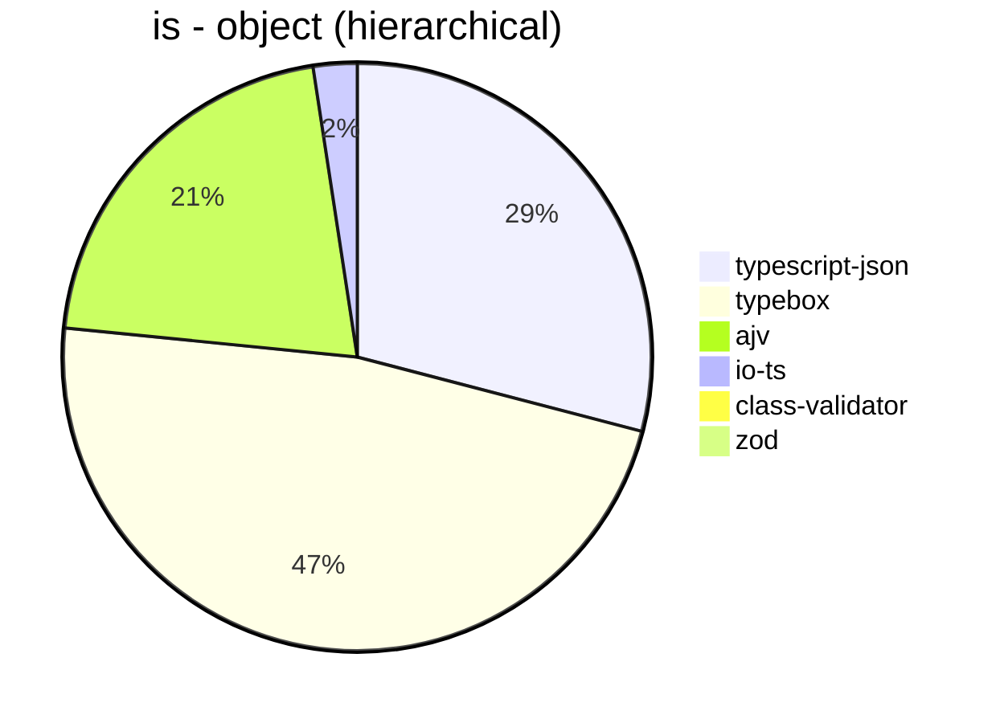


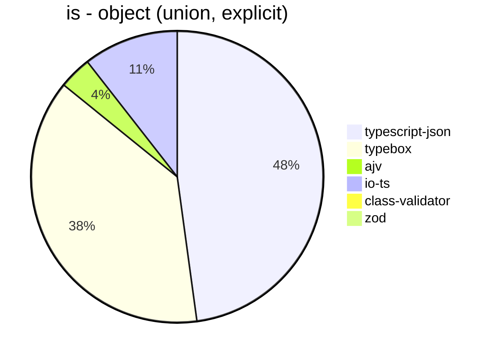


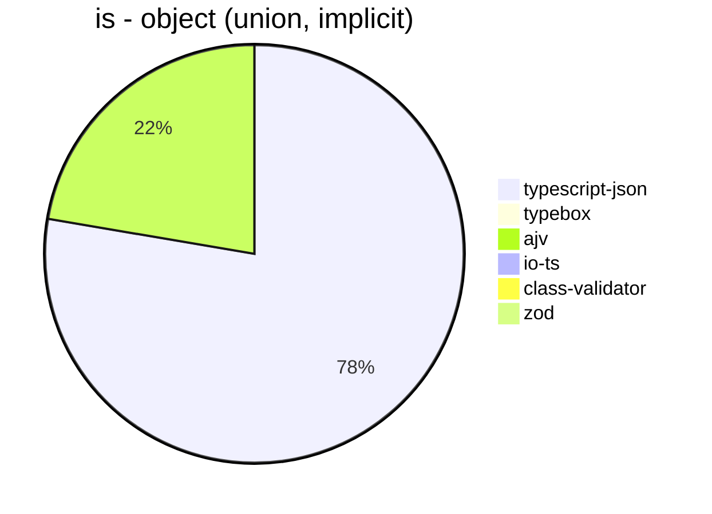


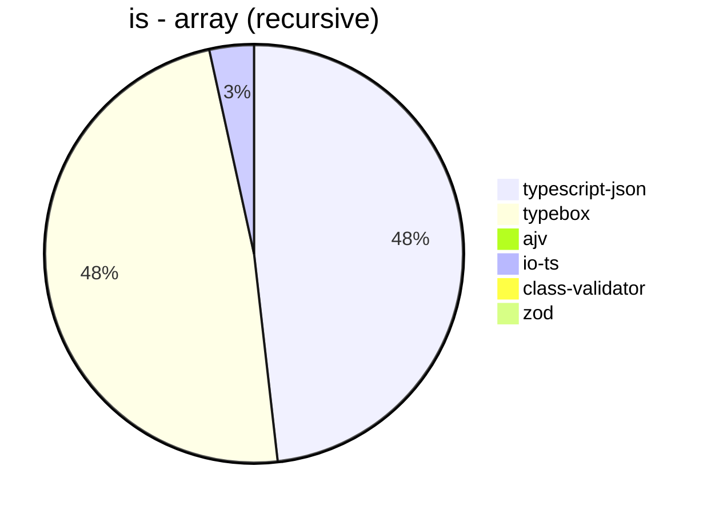


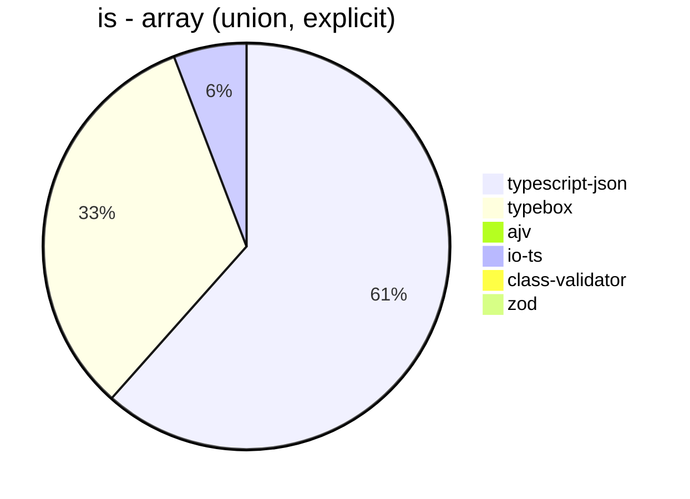


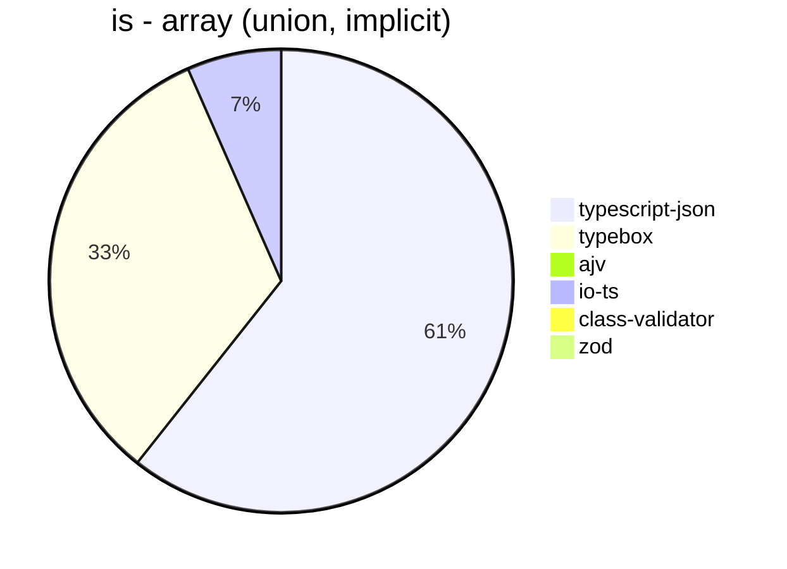


## assert
 Components | typescript-json | typebox | io-ts | zod | class-validator 
------------|-----------------|---------|-------|-----|-----------------
object (hierarchical) | 21204.397981254508 | 874.0430185927817 | 3738.760407030527 | 411.9200301772916 | 63.348416289592755
object (recursive) | 25530.47042052744 | 342.6842684268427 | 1617.6205091171691 | 78.80844645550528 | 39.41068139963168
object (union, explicit) | 4375.366568914956 | 137.54578754578753 | 1069.8447893569844 | 33.21580998329931 | 16.276517922457938
object (union, implicit) | 4546.048944517093 | 64.92564381574175 | 280.3548327481057 | 17.894142022979846 | 15.852534562211982
array (recursive) | 1489.707271010387 | 34.368070953436806 | 163.3370329263781 | 8.869179600886918 | 3.411028993746447
array (union, explicit) | 1980.8078961798574 | 18.725904167431615 | 73.72367011781506 | 2.523431867339582 | 7.601038190582128
array (union, implicit) | 1677.3605541378054 | 25.125628140703515 | 105.43130990415337 | 3.5747883349012226 | 9.282060996400833
ultimate union | 224.50100714154917 | 4.027828634199927 | Failed | 0.34831069313827934 | Failed


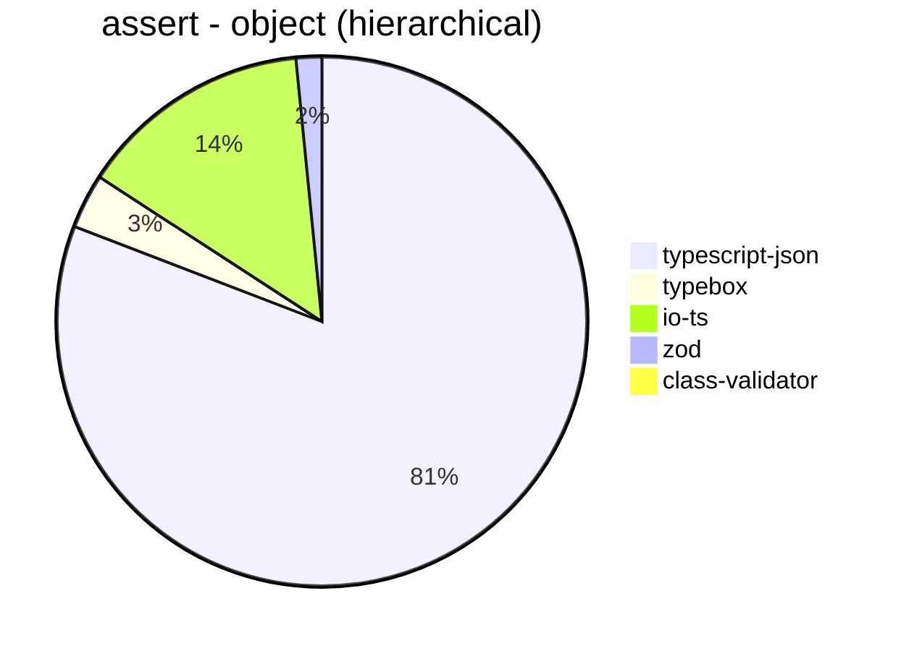


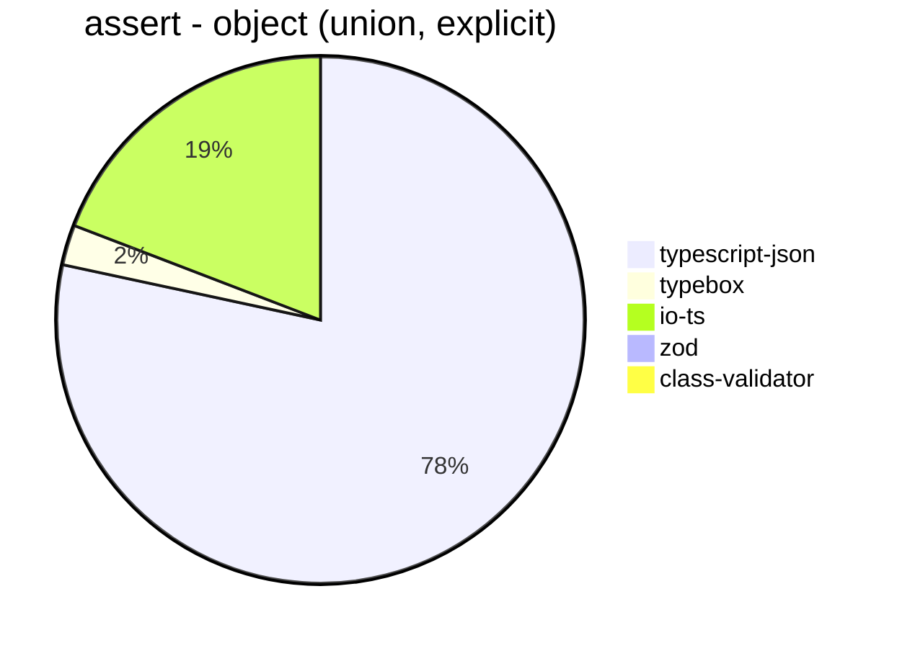


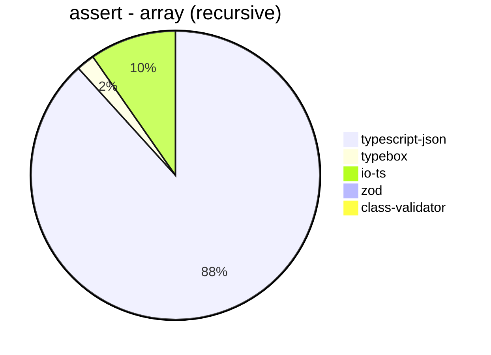


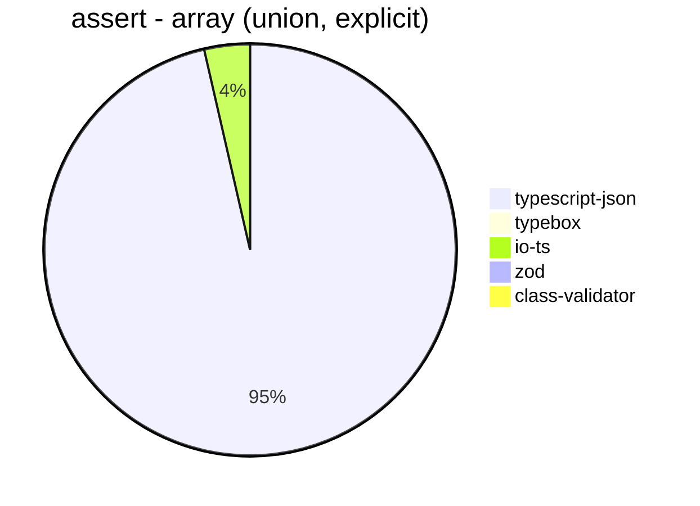


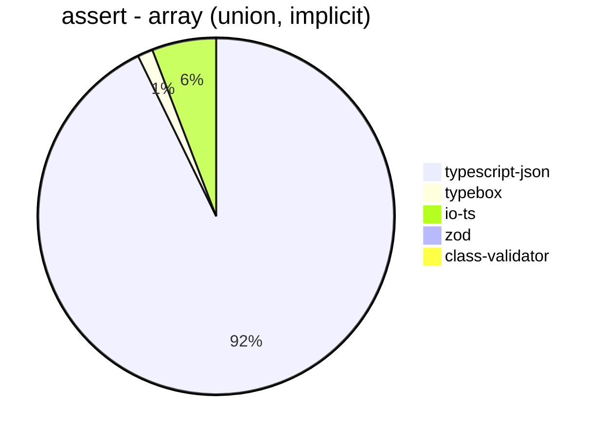


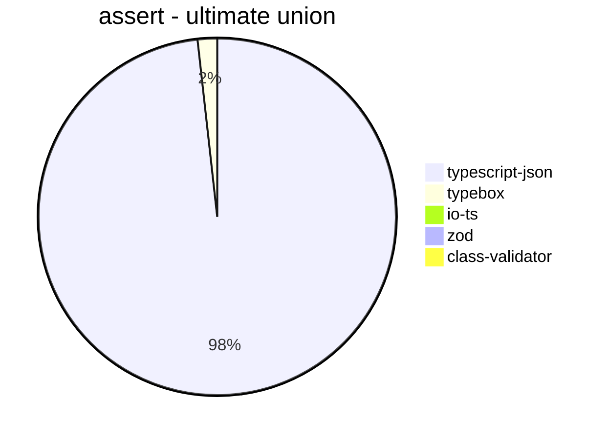


## valiadate
 Components | typescript-json | typebox | io-ts | zod | class-validator 
------------|-----------------|---------|-------|-----|-----------------
object (hierarchical) | 15912.35914863173 | 709.2938163190632 | 3143.0446194225724 | 383.76115055525213 | 61.90994916485113
object (recursive) | 14909.999999999998 | 322.6825190414267 | 1557.4261129816684 | 70.7460492466005 | 41.16541353383458
object (union, explicit) | 3559.7206909224547 | 137.149228767887 | 1048.8563586459286 | 32.25218658892128 | 16.676035225782275
object (union, implicit) | 3298.9747345294763 | 68.75 | 288.93023255813955 | 20.087170740951297 | 15.565610859728507
array (recursive) | 1059.7237775289288 | 34.8727615457116 | 165.94216594216593 | 9.254013220018885 | 3.5930408472012103
array (union, explicit) | 1563.7800934243623 | 19.788918205804748 | 74.20494699646643 | 2.818489289740699 | 7.483629560336763
array (union, implicit) | 1540.1568920433322 | 25.28301886792453 | 97.59788159636845 | 3.5978034463169855 | 8.950214432220772
ultimate union | 116.29526462395543 | 4.1067761806981515 | Failed | 0.3493449781659389 | Failed


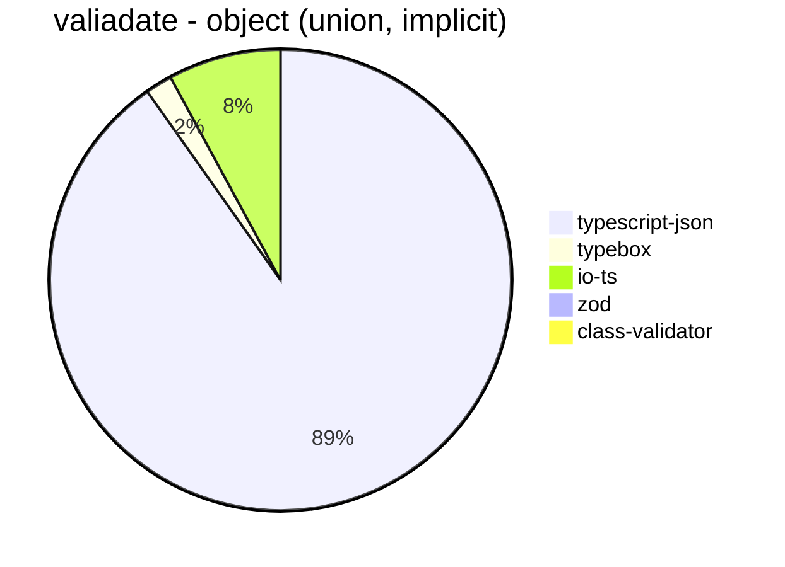


```mermaid
pie title valiadate - array (recursive)
  "typescript-json": 1059.7237775289288
  "typebox": 34.8727615457116
  "io-ts": 165.94216594216593
  "zod": 9.254013220018885
  "class-validator": 3.5930408472012103
```


```mermaid
pie title valiadate - array (union, explicit)
  "typescript-json": 1563.7800934243623
  "typebox": 19.788918205804748
  "io-ts": 74.20494699646643
  "zod": 2.818489289740699
  "class-validator": 7.483629560336763
```


```mermaid
pie title valiadate - array (union, implicit)
  "typescript-json": 1540.1568920433322
  "typebox": 25.28301886792453
  "io-ts": 97.59788159636845
  "zod": 3.5978034463169855
  "class-validator": 8.950214432220772
```


```mermaid
pie title valiadate - ultimate union
  "typescript-json": 116.29526462395543
  "typebox": 4.1067761806981515
  "io-ts": 0
  "zod": 0.3493449781659389
  "class-validator": 0
```


## optimizer
 Components | typescript-json | ajv | typebox 
------------|-----------------|-----|---------
object (hierarchical) | 84474.49259462424 | 4.393994873672647 | 177.41066618782546
object (recursive) | 65514.80171290262 | 8.250825082508252 | 760.9094242757609
object (union) | 11692.47467438495 | 4.038920506700936 | 79.00964864372838
array (hierarchical) | 11202.996528412206 | 5.842614570020084 | 914.5283018867925
array (recursive) | 5208.763353250046 | 8.334876829042415 | 740.8650260999254
array (union) | 3656.171284634761 | 5.424616535727647 | 226.08854071779925
ultimate union | 530.5419612108029 | 0.7313951362223441 | 10.193133047210301


```mermaid
pie title optimizer - object (hierarchical)
  "typescript-json": 84474.49259462424
  "ajv": 4.393994873672647
  "typebox": 177.41066618782546
```


```mermaid
pie title optimizer - object (recursive)
  "typescript-json": 65514.80171290262
  "ajv": 8.250825082508252
  "typebox": 760.9094242757609
```


```mermaid
pie title optimizer - object (union)
  "typescript-json": 11692.47467438495
  "ajv": 4.038920506700936
  "typebox": 79.00964864372838
```


```mermaid
pie title optimizer - array (hierarchical)
  "typescript-json": 11202.996528412206
  "ajv": 5.842614570020084
  "typebox": 914.5283018867925
```


```mermaid
pie title optimizer - array (recursive)
  "typescript-json": 5208.763353250046
  "ajv": 8.334876829042415
  "typebox": 740.8650260999254
```


```mermaid
pie title optimizer - array (union)
  "typescript-json": 3656.171284634761
  "ajv": 5.424616535727647
  "typebox": 226.08854071779925
```


```mermaid
pie title optimizer - ultimate union
  "typescript-json": 530.5419612108029
  "ajv": 0.7313951362223441
  "typebox": 10.193133047210301
```


## stringify
 Components | typescript-json | fast-json-stringify | JSON.stringify() 
------------|-----------------|---------------------|------------------
object (simple) | 103476.71480144405 | 25642.384105960264 | 5988.1778945393135
object (hierarchical) | 4519.275182092734 | 4319.048483747957 | 1547.0945689327764
object (recursive) | 5151.319431629452 | 1215.6788487028973 | 1223.4855545200373
object (union) | 1361.1009843237332 | 1296.0176179115435 | 737.8312347303139
array (hierarchical) | 411.13914924297046 | 568.5071574642127 | 206.10258330213404
array (recursive) | 236.70886075949366 | 134.10534180052298 | 135.80711998493123
array (union) | 291.35671271696776 | 229.96323529411762 | 252.65049415992812
ultimate union | 110.06401137980086 | 60.26711185308848 | 188.16187594553705


```mermaid
pie title stringify - object (simple)
  "typescript-json": 103476.71480144405
  "fast-json-stringify": 25642.384105960264
  "JSON.stringify()": 5988.1778945393135
```


```mermaid
pie title stringify - object (hierarchical)
  "typescript-json": 4519.275182092734
  "fast-json-stringify": 4319.048483747957
  "JSON.stringify()": 1547.0945689327764
```


```mermaid
pie title stringify - object (recursive)
  "typescript-json": 5151.319431629452
  "fast-json-stringify": 1215.6788487028973
  "JSON.stringify()": 1223.4855545200373
```


```mermaid
pie title stringify - object (union)
  "typescript-json": 1361.1009843237332
  "fast-json-stringify": 1296.0176179115435
  "JSON.stringify()": 737.8312347303139
```


```mermaid
pie title stringify - array (hierarchical)
  "typescript-json": 411.13914924297046
  "fast-json-stringify": 568.5071574642127
  "JSON.stringify()": 206.10258330213404
```


```mermaid
pie title stringify - array (recursive)
  "typescript-json": 236.70886075949366
  "fast-json-stringify": 134.10534180052298
  "JSON.stringify()": 135.80711998493123
```


```mermaid
pie title stringify - array (union)
  "typescript-json": 291.35671271696776
  "fast-json-stringify": 229.96323529411762
  "JSON.stringify()": 252.65049415992812
```


```mermaid
pie title stringify - ultimate union
  "typescript-json": 110.06401137980086
  "fast-json-stringify": 60.26711185308848
  "JSON.stringify()": 188.16187594553705
```


