# Benchmark of `typescript-json`
> CPU: 11th Gen Intel(R) Core(TM) i5-1135G7 @ 2.40GHz
> Memory: 16,218 MB
> NodeJS version: v16.17.1
> TypeScript-JSON version: 3.3.18


## is
 Components | typescript-json | typebox | ajv | io-ts | zod | class-validator 
------------|-----------------|---------|-----|-------|-----|-----------------
object (simple) | 844844.6796860741 | 1472811.0149198747 | 504766.69139465876 | 39234.97972723922 | 3619.5348837209303 | 158.39199703593926
object (hierarchical) | 145360.21113942482 | 193691.01019462466 | 41810.72210065646 | 8936.736958934518 | 414.962325080732 | 60.74180254434688
object (recursive) | 86033.33333333333 | 84779.44444444444 | 38324.17582417582 | 5543.30998894213 | 69.81701900870492 | 37.49310788458004
object (union, explicit) | 19610.18222806688 | 12642.208774583964 | 6861.401952085182 | 3335.648582691947 | 32.3583180987203 | 91.24423963133641
object (union, implicit) | 19622.47191011236 | Failed | Failed | Failed | 18.12522885389967 | 65.07352941176471
array (recursive) | 6563.340807174887 | 5778.014941302028 | 2245.525221478937 | 497.8956999085087 | 9.511376352107423 | 3.32409972299169
array (union, explicit) | 3763.53591160221 | 1947.5717439293599 | 765.4525386313466 | 355.0196298373528 | 2.7849981433345707 | 33.44120819848975
array (union, implicit) | 603.3762933381738 | Failed | Failed | Failed | 1.6414371694327925 | 23.123508900715727
ultimate union | 573.6832446320426 | Failed | Failed | Failed | 0.45207956600361665 | Failed


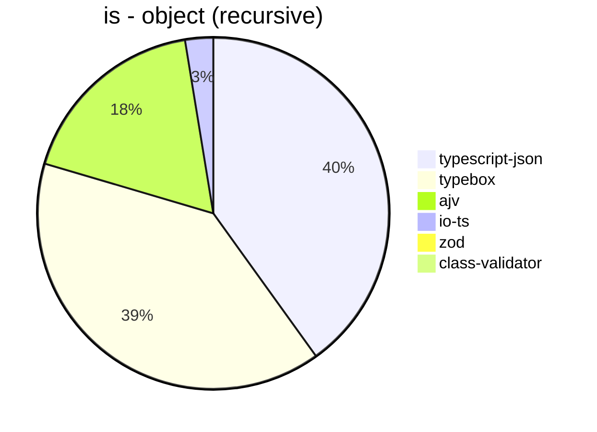


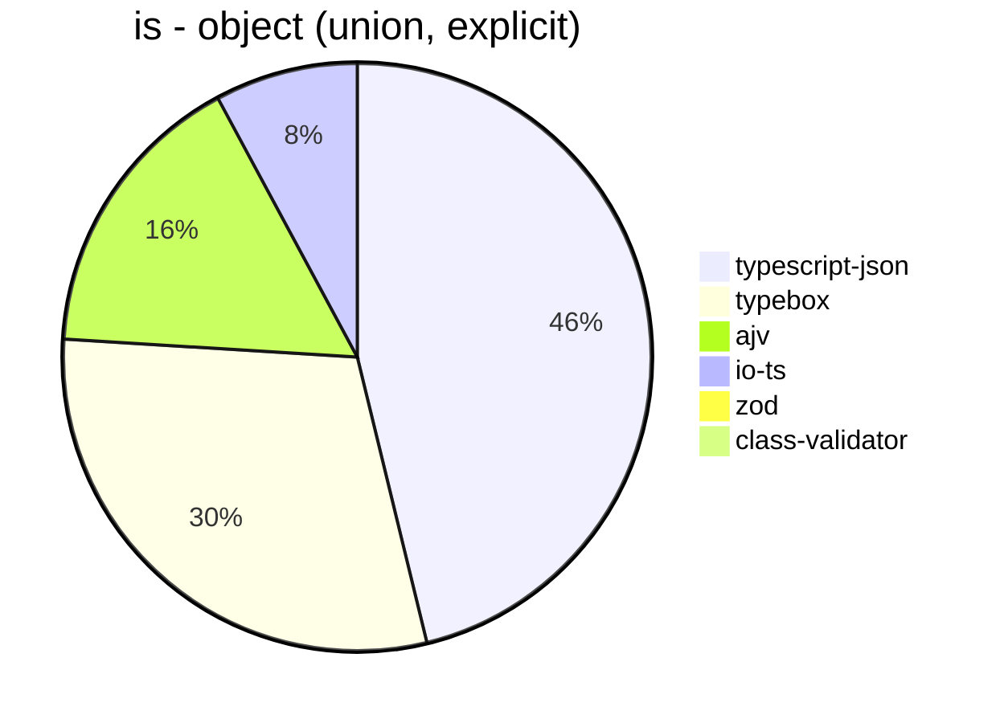


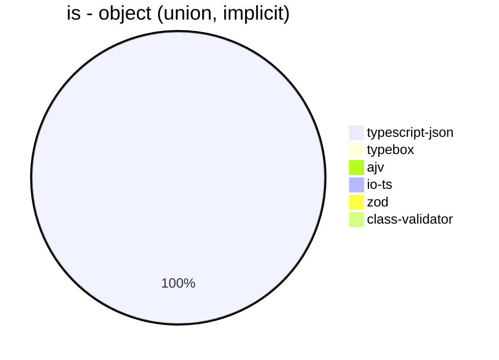


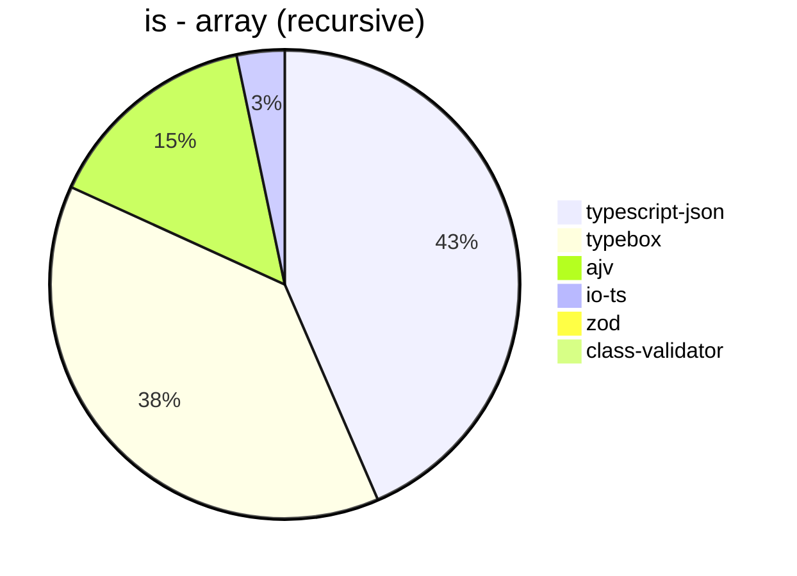


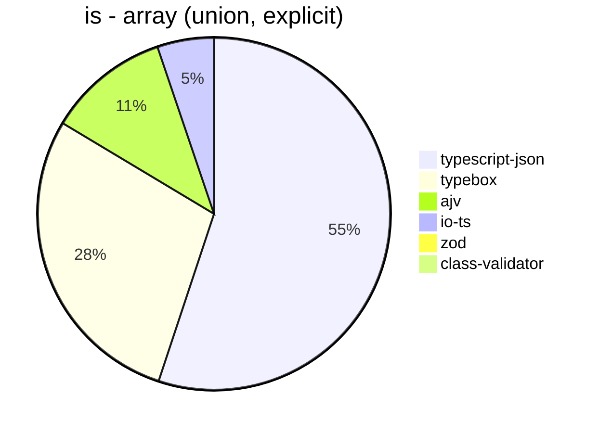


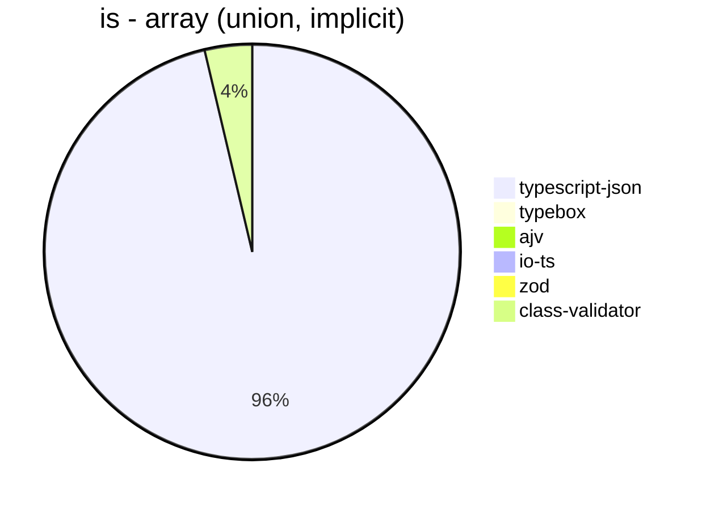


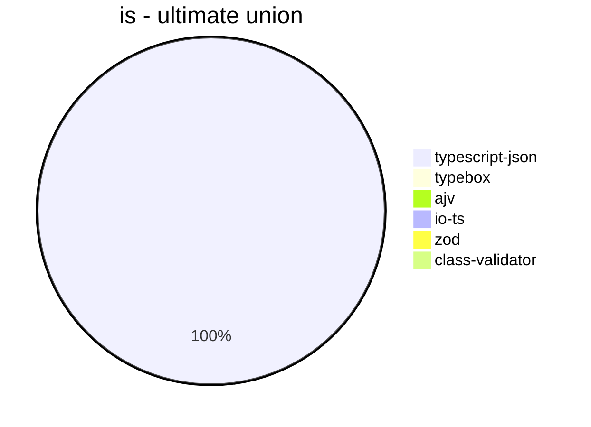


## assertType (iterate)
 Components | typescript-json | typebox | io-ts | zod | class-validator 
------------|-----------------|---------|-------|-----|-----------------
object (simple) | 264510.753659859 | 2787.2687704026116 | 14174.916882157371 | 3196.9752858723723 | 174.66129622848774
object (hierarchical) | 44836.91529709229 | 666.6050978943481 | 3083.3646263612472 | 388.6486486486487 | 61.95348837209303
object (recursive) | 40748.74371859297 | 310.83546151039764 | 1468.682505399568 | 70.04109077325364 | 38.7906446092413
object (union, explicit) | 6156.675248253035 | 123.45451190256506 | 1065.2015982564476 | 34.450301204819276 | 90.80779944289694
object (union, implicit) | 5908.724340175953 | Failed | Failed | 20.096762188314106 | 62.05770277626565
array (recursive) | 2403.4833091436867 | 33.121257485029936 | 160.0296351176144 | 9.600903614457831 | 3.355079217148183
array (union, explicit) | 2368.219178082192 | 17.781070568623818 | 79.31745734108382 | 2.787068004459309 | 32.172995780590725
array (union, implicit) | 488.2840663302091 | Failed | Failed | 1.6216216216216217 | 26.013195098963244
ultimate union | 266.89617684363105 | Failed | Failed | 0.4580152671755725 | Failed


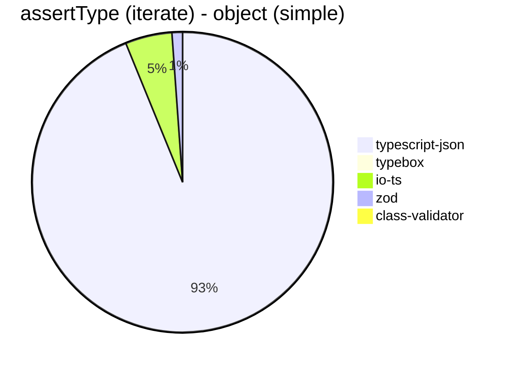


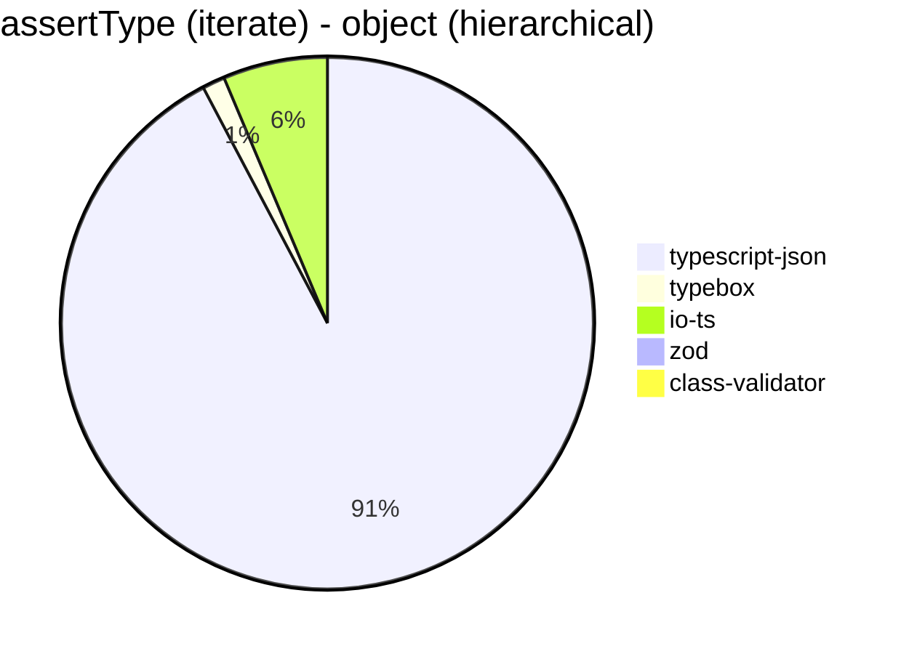


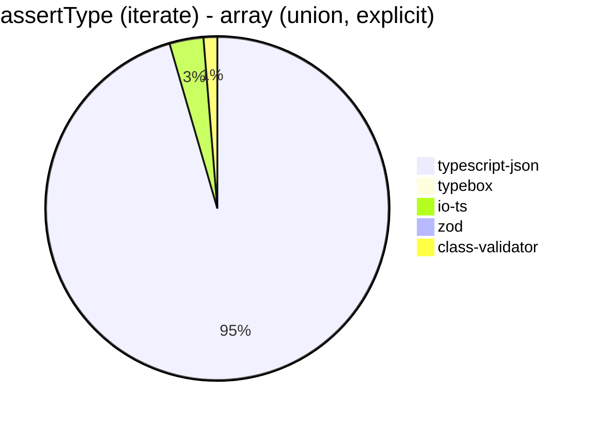


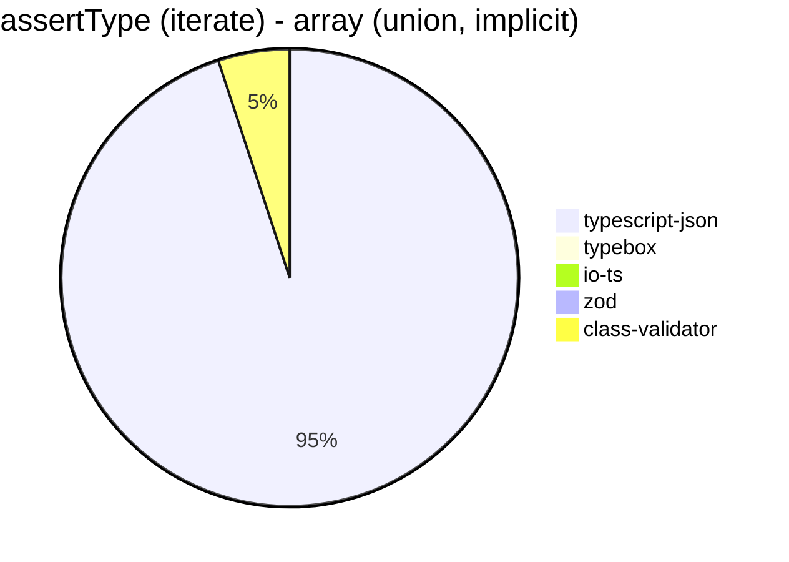


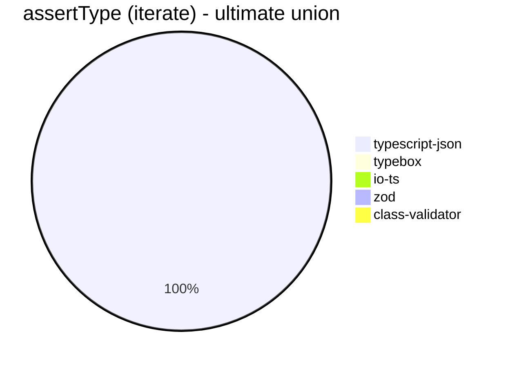


## assertType (throw)
 Components | typescript-json | typebox | io-ts | zod | class-validator 
------------|-----------------|---------|-------|-----|-----------------
object (simple) | 45097.29831853391 | 2675.521821631879 | 9601.61556820268 | 3105.1253273475495 | 182.2489520685256
object (hierarchical) | 29233.946676680436 | 733.0827067669172 | 3316.3745995854524 | 370.16472330186934 | 73.05936073059361
object (recursive) | 4168.952276467361 | Failed | Failed | 17.90189760114572 | 73.27349331379374
object (union, explicit) | 5209.071580439404 | 130.3538175046555 | 1039.5010395010395 | 35.505059470974615 | 92.4898261191269
object (union, implicit) | 3091.4711765775596 | Failed | Failed | 17.84121320249777 | 72.85974499089252
array (recursive) | 603.0701754385964 | 35.40449637103912 | 110.90573012939002 | 15.92356687898089 | 12.286521685710776
array (union, explicit) | 446.17958728388174 | 17.304031839418585 | 55.493895671476146 | 10.869565217391305 | 35.542918073573844
array (union, implicit) | 163.51744186046514 | Failed | Failed | 9.713453132588636 | 34.55425017277125
ultimate union | 236.2347810285299 | Failed | Failed | 2.261420171867933 | Failed


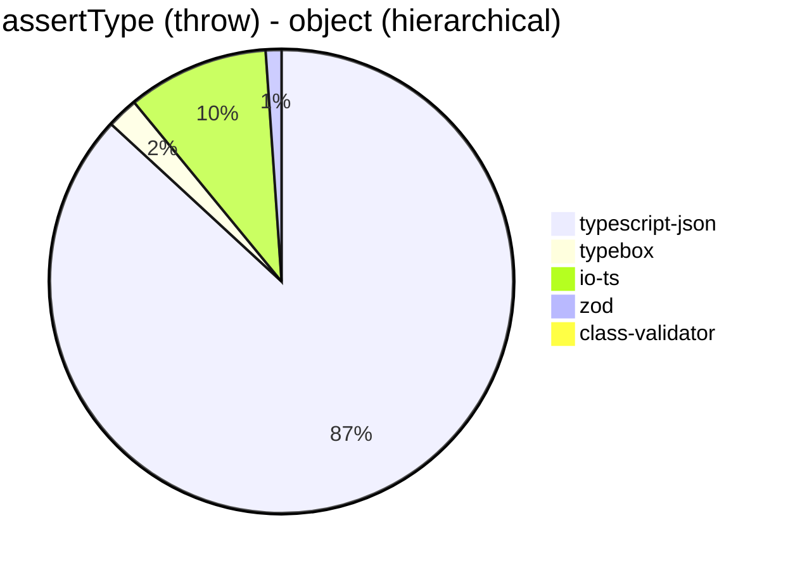


```mermaid
pie title assertType (throw) - object (recursive)
  "typescript-json": 4168.952276467361
  "typebox": 0
  "io-ts": 0
  "zod": 17.90189760114572
  "class-validator": 73.27349331379374
```


```mermaid
pie title assertType (throw) - object (union, explicit)
  "typescript-json": 5209.071580439404
  "typebox": 130.3538175046555
  "io-ts": 1039.5010395010395
  "zod": 35.505059470974615
  "class-validator": 92.4898261191269
```


```mermaid
pie title assertType (throw) - object (union, implicit)
  "typescript-json": 3091.4711765775596
  "typebox": 0
  "io-ts": 0
  "zod": 17.84121320249777
  "class-validator": 72.85974499089252
```


```mermaid
pie title assertType (throw) - array (recursive)
  "typescript-json": 603.0701754385964
  "typebox": 35.40449637103912
  "io-ts": 110.90573012939002
  "zod": 15.92356687898089
  "class-validator": 12.286521685710776
```


```mermaid
pie title assertType (throw) - array (union, explicit)
  "typescript-json": 446.17958728388174
  "typebox": 17.304031839418585
  "io-ts": 55.493895671476146
  "zod": 10.869565217391305
  "class-validator": 35.542918073573844
```


```mermaid
pie title assertType (throw) - array (union, implicit)
  "typescript-json": 163.51744186046514
  "typebox": 0
  "io-ts": 0
  "zod": 9.713453132588636
  "class-validator": 34.55425017277125
```


```mermaid
pie title assertType (throw) - ultimate union
  "typescript-json": 236.2347810285299
  "typebox": 0
  "io-ts": 0
  "zod": 2.261420171867933
  "class-validator": 0
```


## validate
 Components | typescript-json | typebox | io-ts | zod | class-validator 
------------|-----------------|---------|-------|-----|-----------------
object (simple) | 64558.05731298847 | 2649.5742317660124 | 11583.897529734677 | 3141.1054172767203 | 172.5221893491124
object (hierarchical) | 27220.636663007685 | 714.6017699115043 | 3150.3579952267305 | 399.092970521542 | 57.76708017033883
object (recursive) | 16053.74797770987 | 308.3160475202716 | 1455.2650957290132 | 71.54929577464787 | 39.45863515059092
object (union, explicit) | 4270.7111436950145 | 126.7605633802817 | 995.6505295007563 | 35.13411409142426 | 94.69555472543892
object (union, implicit) | 3844.569970845481 | 122.41444151936818 | 266.7037861915367 | 19.600522680604815 | 64.9303008070433
array (recursive) | 1361.6943582253057 | 36.83415187004156 | 173.22983718288526 | 9.626274065685164 | 3.3670033670033668
array (union, explicit) | 1793.775027302512 | 16.706886950064973 | 78.65168539325843 | 2.75178866263071 | 36.42572566875356
array (union, implicit) | 760.5019094380798 | 11.835431147848958 | 54.65932814575821 | 1.6635859519408505 | 25.452488687782804
ultimate union | 165.04854368932038 | Failed | Failed | 0.46641791044776115 | Failed


```mermaid
pie title validate - object (simple)
  "typescript-json": 64558.05731298847
  "typebox": 2649.5742317660124
  "io-ts": 11583.897529734677
  "zod": 3141.1054172767203
  "class-validator": 172.5221893491124
```


```mermaid
pie title validate - object (hierarchical)
  "typescript-json": 27220.636663007685
  "typebox": 714.6017699115043
  "io-ts": 3150.3579952267305
  "zod": 399.092970521542
  "class-validator": 57.76708017033883
```


```mermaid
pie title validate - object (recursive)
  "typescript-json": 16053.74797770987
  "typebox": 308.3160475202716
  "io-ts": 1455.2650957290132
  "zod": 71.54929577464787
  "class-validator": 39.45863515059092
```


```mermaid
pie title validate - object (union, explicit)
  "typescript-json": 4270.7111436950145
  "typebox": 126.7605633802817
  "io-ts": 995.6505295007563
  "zod": 35.13411409142426
  "class-validator": 94.69555472543892
```


```mermaid
pie title validate - object (union, implicit)
  "typescript-json": 3844.569970845481
  "typebox": 122.41444151936818
  "io-ts": 266.7037861915367
  "zod": 19.600522680604815
  "class-validator": 64.9303008070433
```


```mermaid
pie title validate - array (recursive)
  "typescript-json": 1361.6943582253057
  "typebox": 36.83415187004156
  "io-ts": 173.22983718288526
  "zod": 9.626274065685164
  "class-validator": 3.3670033670033668
```


```mermaid
pie title validate - array (union, explicit)
  "typescript-json": 1793.775027302512
  "typebox": 16.706886950064973
  "io-ts": 78.65168539325843
  "zod": 2.75178866263071
  "class-validator": 36.42572566875356
```


```mermaid
pie title validate - array (union, implicit)
  "typescript-json": 760.5019094380798
  "typebox": 11.835431147848958
  "io-ts": 54.65932814575821
  "zod": 1.6635859519408505
  "class-validator": 25.452488687782804
```


```mermaid
pie title validate - ultimate union
  "typescript-json": 165.04854368932038
  "typebox": 0
  "io-ts": 0
  "zod": 0.46641791044776115
  "class-validator": 0
```


## equals
 Components | typescript-json | typebox 
------------|-----------------|---------
object (simple) | 23141.6788856305 | 58077.600440286194
object (hierarchical) | 7558.764024278094 | 15233.477789815817
object (recursive) | 5916.589434661724 | 10434.687953555878
object (union, explicit) | 2436.425501432665 | 2998.894620486367
object (union, implicit) | 1586.3174772848743 | 2205.721574344023
array (recursive) | 478.486646884273 | 887.5479978058145
array (union, explicit) | 727.5040901654244 | 630.188679245283
array (union, implicit) | 465.03244412400863 | 390.35162221844746
ultimate union | 308.18531404504665 | 197.59168035030103


```mermaid
pie title equals - object (simple)
  "typescript-json": 23141.6788856305
  "typebox": 58077.600440286194
```


```mermaid
pie title equals - object (hierarchical)
  "typescript-json": 7558.764024278094
  "typebox": 15233.477789815817
```


```mermaid
pie title equals - object (recursive)
  "typescript-json": 5916.589434661724
  "typebox": 10434.687953555878
```


```mermaid
pie title equals - object (union, explicit)
  "typescript-json": 2436.425501432665
  "typebox": 2998.894620486367
```


```mermaid
pie title equals - object (union, implicit)
  "typescript-json": 1586.3174772848743
  "typebox": 2205.721574344023
```


```mermaid
pie title equals - array (recursive)
  "typescript-json": 478.486646884273
  "typebox": 887.5479978058145
```


```mermaid
pie title equals - array (union, explicit)
  "typescript-json": 727.5040901654244
  "typebox": 630.188679245283
```


```mermaid
pie title equals - array (union, implicit)
  "typescript-json": 465.03244412400863
  "typebox": 390.35162221844746
```


```mermaid
pie title equals - ultimate union
  "typescript-json": 308.18531404504665
  "typebox": 197.59168035030103
```


## assertEquals (iterate)
 Components | typescript-json | typebox 
------------|-----------------|---------
object (simple) | 27821.739130434784 | 2371.70749677657
object (hierarchical) | 7008.273579702151 | 665.9167604049494
object (recursive) | 5426.685198054204 | 268.8937568455641
object (union, explicit) | 2331.8534961154273 | 97.95240730492529
object (union, implicit) | 1667.8681771369722 | 73.01886792452831
array (recursive) | 562.2926649465536 | 29.4062205466541
array (union, explicit) | 381.5502183406113 | 13.177159590043924
array (union, implicit) | 227.74587221823404 | 6.629834254143647
ultimate union | 194.3487250172295 | 3.95703787450537


```mermaid
pie title assertEquals (iterate) - object (simple)
  "typescript-json": 27821.739130434784
  "typebox": 2371.70749677657
```


```mermaid
pie title assertEquals (iterate) - object (hierarchical)
  "typescript-json": 7008.273579702151
  "typebox": 665.9167604049494
```


```mermaid
pie title assertEquals (iterate) - object (recursive)
  "typescript-json": 5426.685198054204
  "typebox": 268.8937568455641
```


```mermaid
pie title assertEquals (iterate) - object (union, explicit)
  "typescript-json": 2331.8534961154273
  "typebox": 97.95240730492529
```


```mermaid
pie title assertEquals (iterate) - object (union, implicit)
  "typescript-json": 1667.8681771369722
  "typebox": 73.01886792452831
```


```mermaid
pie title assertEquals (iterate) - array (recursive)
  "typescript-json": 562.2926649465536
  "typebox": 29.4062205466541
```


```mermaid
pie title assertEquals (iterate) - array (union, explicit)
  "typescript-json": 381.5502183406113
  "typebox": 13.177159590043924
```


```mermaid
pie title assertEquals (iterate) - array (union, implicit)
  "typescript-json": 227.74587221823404
  "typebox": 6.629834254143647
```


```mermaid
pie title assertEquals (iterate) - ultimate union
  "typescript-json": 194.3487250172295
  "typebox": 3.95703787450537
```


## assertEquals (throw)
 Components | typescript-json | typebox 
------------|-----------------|---------
object (simple) | 14973.763118440778 | 2093.8628158844763
object (hierarchical) | 5846.099665434055 | 615.3272422151781
object (recursive) | 5030.542579949694 | 280.84628346751543
object (union, explicit) | 2196.9974368363237 | 110.96726465692622
object (union, implicit) | 1596.623233620848 | 73.17965605561653
array (recursive) | 386.3845446182153 | 35.67606136282554
array (union, explicit) | 200.69330414158003 | 17.346053772766695
array (union, implicit) | 110.11194714626538 | 13.906271728549576
ultimate union | 200.76656324146742 | 13.104442405975625


```mermaid
pie title assertEquals (throw) - object (simple)
  "typescript-json": 14973.763118440778
  "typebox": 2093.8628158844763
```


```mermaid
pie title assertEquals (throw) - object (hierarchical)
  "typescript-json": 5846.099665434055
  "typebox": 615.3272422151781
```


```mermaid
pie title assertEquals (throw) - object (recursive)
  "typescript-json": 5030.542579949694
  "typebox": 280.84628346751543
```


```mermaid
pie title assertEquals (throw) - object (union, explicit)
  "typescript-json": 2196.9974368363237
  "typebox": 110.96726465692622
```


```mermaid
pie title assertEquals (throw) - object (union, implicit)
  "typescript-json": 1596.623233620848
  "typebox": 73.17965605561653
```


```mermaid
pie title assertEquals (throw) - array (recursive)
  "typescript-json": 386.3845446182153
  "typebox": 35.67606136282554
```


```mermaid
pie title assertEquals (throw) - array (union, explicit)
  "typescript-json": 200.69330414158003
  "typebox": 17.346053772766695
```


```mermaid
pie title assertEquals (throw) - array (union, implicit)
  "typescript-json": 110.11194714626538
  "typebox": 13.906271728549576
```


```mermaid
pie title assertEquals (throw) - ultimate union
  "typescript-json": 200.76656324146742
  "typebox": 13.104442405975625
```


## validateEquals
 Components | typescript-json | typebox 
------------|-----------------|---------
object (simple) | 14873.595505617977 | 2167.0416197975255
object (hierarchical) | 5394.97594869054 | 638.3454443823365
object (recursive) | 4489.2285030381145 | 269.5035460992908
object (union, explicit) | 1432.0241691842903 | 100.09478672985782
object (union, implicit) | 1151.1248185776487 | 72.03630175836642
array (recursive) | 330.69591800035965 | 29.920963492660896
array (union, explicit) | 314.79867526581836 | 15.239887111947318
array (union, implicit) | 203.9250669045495 | 6.162464985994397
ultimate union | 131.49266609145815 | 3.9018952062430325


```mermaid
pie title validateEquals - object (simple)
  "typescript-json": 14873.595505617977
  "typebox": 2167.0416197975255
```


```mermaid
pie title validateEquals - object (hierarchical)
  "typescript-json": 5394.97594869054
  "typebox": 638.3454443823365
```


```mermaid
pie title validateEquals - object (recursive)
  "typescript-json": 4489.2285030381145
  "typebox": 269.5035460992908
```


```mermaid
pie title validateEquals - object (union, explicit)
  "typescript-json": 1432.0241691842903
  "typebox": 100.09478672985782
```


```mermaid
pie title validateEquals - object (union, implicit)
  "typescript-json": 1151.1248185776487
  "typebox": 72.03630175836642
```


```mermaid
pie title validateEquals - array (recursive)
  "typescript-json": 330.69591800035965
  "typebox": 29.920963492660896
```


```mermaid
pie title validateEquals - array (union, explicit)
  "typescript-json": 314.79867526581836
  "typebox": 15.239887111947318
```


```mermaid
pie title validateEquals - array (union, implicit)
  "typescript-json": 203.9250669045495
  "typebox": 6.162464985994397
```


```mermaid
pie title validateEquals - ultimate union
  "typescript-json": 131.49266609145815
  "typebox": 3.9018952062430325
```


## optimizer
 Components | typescript-json | typebox | ajv 
------------|-----------------|---------|-----
object (hierarchical) | 140421.48309705564 | 173.22551662174303 | 4.425594689286373
object (recursive) | 83949.08955778522 | 714.2334431028174 | 8.236615499812805
object (union) | 19058.301647655262 | 86.47450110864744 | 4.063538973032878
array (hierarchical) | 8515.262292085541 | 817.4760787145694 | 5.684944067485787
array (recursive) | 7369.933677229182 | 714.8323615160349 | 8.53590647615513
array (union) | 4122.292993630574 | 227.53596114328414 | 5.546311702717693
ultimate union | 576.0988013076643 | 10.439970171513796 | 0.7336757153338225


```mermaid
pie title optimizer - object (hierarchical)
  "typescript-json": 140421.48309705564
  "typebox": 173.22551662174303
  "ajv": 4.425594689286373
```


```mermaid
pie title optimizer - object (recursive)
  "typescript-json": 83949.08955778522
  "typebox": 714.2334431028174
  "ajv": 8.236615499812805
```


```mermaid
pie title optimizer - object (union)
  "typescript-json": 19058.301647655262
  "typebox": 86.47450110864744
  "ajv": 4.063538973032878
```


```mermaid
pie title optimizer - array (hierarchical)
  "typescript-json": 8515.262292085541
  "typebox": 817.4760787145694
  "ajv": 5.684944067485787
```


```mermaid
pie title optimizer - array (recursive)
  "typescript-json": 7369.933677229182
  "typebox": 714.8323615160349
  "ajv": 8.53590647615513
```


```mermaid
pie title optimizer - array (union)
  "typescript-json": 4122.292993630574
  "typebox": 227.53596114328414
  "ajv": 5.546311702717693
```


```mermaid
pie title optimizer - ultimate union
  "typescript-json": 576.0988013076643
  "typebox": 10.439970171513796
  "ajv": 0.7336757153338225
```


## stringify
 Components | TSON.stringify() | TSON.assertStringify() | TSON.isStringify() | JSON.stringify() | fast-json-stringify 
------------|------------------|------------------------|--------------------|------------------|---------------------
object (simple) | 31814.595660749506 | 26679.231605654222 | 28703.636031427006 | 6145.971563981042 | 23161.887477313976
object (hierarchical) | 4609.652366863905 | 3884.870188003581 | 4019.784172661871 | 1516.6604961125508 | 4039.4423041643736
object (recursive) | 4402.183971867481 | 4199.705232129698 | 4253.904097005328 | 1245.2617751923437 | 1238.336143901068
object (union) | 1357.1809930592633 | 1075.0835238262705 | 1311.5476409032494 | 624.5023525153819 | 1227.6973804726142
array (hierarchical) | 54.59822238345728 | 51.55766077609765 | 55.6745182012848 | 30.162842339008144 | 78.33935018050542
array (recursive) | 241.06666666666666 | 221.74535050071532 | 239.8598820058997 | 122.53750225917223 | 124.86348744084457
array (union) | 305.17711171662125 | 250.04446025253424 | 272.0481049562682 | 266.05335786568537 | 229.39785337456794


```mermaid
pie title stringify - object (simple)
  "TSON.stringify()": 31814.595660749506
  "TSON.assertStringify()": 26679.231605654222
  "TSON.isStringify()": 28703.636031427006
  "JSON.stringify()": 6145.971563981042
  "fast-json-stringify": 23161.887477313976
```


```mermaid
pie title stringify - object (hierarchical)
  "TSON.stringify()": 4609.652366863905
  "TSON.assertStringify()": 3884.870188003581
  "TSON.isStringify()": 4019.784172661871
  "JSON.stringify()": 1516.6604961125508
  "fast-json-stringify": 4039.4423041643736
```


```mermaid
pie title stringify - object (recursive)
  "TSON.stringify()": 4402.183971867481
  "TSON.assertStringify()": 4199.705232129698
  "TSON.isStringify()": 4253.904097005328
  "JSON.stringify()": 1245.2617751923437
  "fast-json-stringify": 1238.336143901068
```


```mermaid
pie title stringify - object (union)
  "TSON.stringify()": 1357.1809930592633
  "TSON.assertStringify()": 1075.0835238262705
  "TSON.isStringify()": 1311.5476409032494
  "JSON.stringify()": 624.5023525153819
  "fast-json-stringify": 1227.6973804726142
```


```mermaid
pie title stringify - array (hierarchical)
  "TSON.stringify()": 54.59822238345728
  "TSON.assertStringify()": 51.55766077609765
  "TSON.isStringify()": 55.6745182012848
  "JSON.stringify()": 30.162842339008144
  "fast-json-stringify": 78.33935018050542
```


```mermaid
pie title stringify - array (recursive)
  "TSON.stringify()": 241.06666666666666
  "TSON.assertStringify()": 221.74535050071532
  "TSON.isStringify()": 239.8598820058997
  "JSON.stringify()": 122.53750225917223
  "fast-json-stringify": 124.86348744084457
```


```mermaid
pie title stringify - array (union)
  "TSON.stringify()": 305.17711171662125
  "TSON.assertStringify()": 250.04446025253424
  "TSON.isStringify()": 272.0481049562682
  "JSON.stringify()": 266.05335786568537
  "fast-json-stringify": 229.39785337456794
```


> Total elapsed time: 1,761,068 ms
