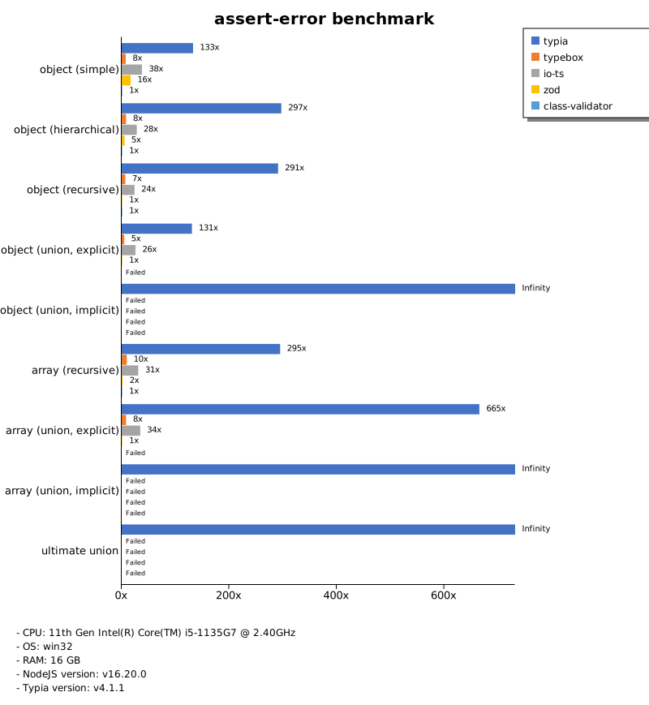
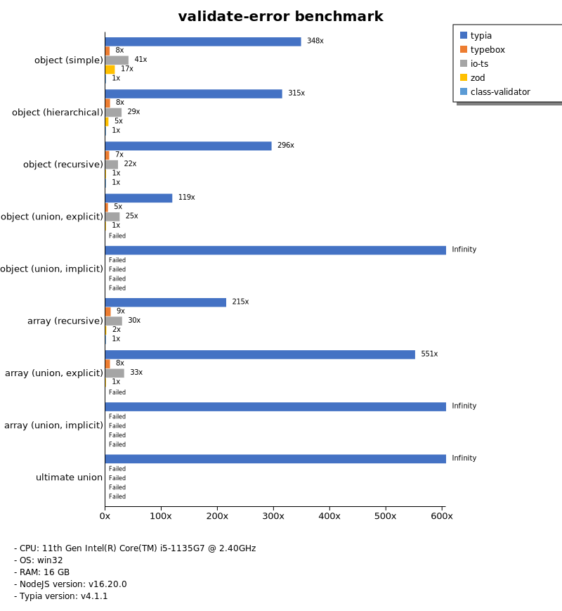

# Benchmark of `typia`
> - CPU: 11th Gen Intel(R) Core(TM) i5-1135G7 @ 2.40GHz
> - Memory: 16,218 MB
> - OS: win32
> - NodeJS version: v16.20.0
> - Typia version: v3.7.3

## is

 Types | typia | typebox | ajv | io-ts | zod | class-validator 
-------|------|------|------|------|------|------
 object (simple) | 1,150,950 | 1,142,731 | 62,614 | 4,930 | 545 | 51 
 object (hierarchical) | 235,697 | 269,192 | 44,144 | 7,846 | 405 | 80 
 object (recursive) | 130,807 | 150,151 | 53,458 | 6,906 | 81 | 94 
 object (union, explicit) | 24,301 | 17,142 | 7,589 | 3,960 | 38 |  -  
 object (union, implicit) | 20,732 |  -  |  -  |  -  |  -  |  -  
 array (recursive) | 100,398 | 101,911 | 27,451 | 7,150 | 97 |  -  
 array (union, explicit) | 24,070 | 16,448 | 6,221 | 2,887 | 19 |  -  
 array (union, implicit) | 27,786 |  -  |  -  |  -  |  -  |  -  
 ultimate union | 7,381 |  -  |  -  |  -  |  -  |  -  

> Unit: Kilobytes/sec

## assert

 Types | typia | typebox | io-ts | zod | class-validator 
-------|------|------|------|------|------
 object (simple) | 1,146,036 | 1,158,381 | 4,963 | 567 | 53 
 object (hierarchical) | 219,231 | 255,845 | 7,928 | 399 | 82 
 object (recursive) | 128,104 | 150,886 | 7,010 | 82 | 95 
 object (union, explicit) | 24,226 | 17,222 | 4,068 | 39 |  -  
 object (union, implicit) | 19,254 |  -  |  -  |  -  |  -  
 array (recursive) | 86,036 | 101,537 | 7,098 | 97 |  -  
 array (union, explicit) | 23,872 | 16,291 | 2,829 | 20 |  -  
 array (union, implicit) | 27,683 |  -  |  -  |  -  |  -  
 ultimate union | 7,547 |  -  |  -  |  -  |  -  

> Unit: Kilobytes/sec

## validate

 Types | typia | typebox | io-ts | zod | class-validator 
-------|------|------|------|------|------
 object (simple) | 1,151,453 | 1,157,297 | 4,938 | 591 | 53 
 object (hierarchical) | 133,692 | 257,588 | 7,705 | 402 | 80 
 object (recursive) | 114,650 | 148,965 | 7,078 | 76 | 95 
 object (union, explicit) | 22,449 | 17,573 | 4,052 | 39 |  -  
 object (union, implicit) | 19,684 |  -  |  -  |  -  |  -  
 array (recursive) | 87,136 | 101,749 | 7,139 | 96 |  -  
 array (union, explicit) | 24,194 | 15,453 | 2,834 | 19 |  -  
 array (union, implicit) | 27,217 |  -  |  -  |  -  |  -  
 ultimate union | 7,702 |  -  |  -  |  -  |  -  

> Unit: Kilobytes/sec

## assert-error

 Types | typia | typebox | io-ts | zod | class-validator 
-------|------|------|------|------|------
 object (simple) | 5,086 | 284 | 1,291 | 586 | 54 
 object (hierarchical) | 23,794 | 633 | 2,156 | 414 | 90 
 object (recursive) | 18,390 | 461 | 1,515 | 79 | 100 
 object (union, explicit) | 5,328 | 192 | 967 | 57 |  -  
 object (union, implicit) | 3,797 |  -  |  -  |  -  |  -  
 array (recursive) | 14,624 | 602 | 1,639 | 184 |  -  
 array (union, explicit) | 9,262 | 127 | 520 | 83 |  -  
 array (union, implicit) | 10,984 |  -  |  -  |  -  |  -  
 ultimate union | 2,615 |  -  |  -  |  -  |  -  

> Unit: Kilobytes/sec

## validate-error

 Types | typia | typebox | io-ts | zod | class-validator 
-------|------|------|------|------|------
 object (simple) | 11,928 | 288 | 1,439 | 595 | 54 
 object (hierarchical) | 21,674 | 663 | 2,157 | 411 | 91 
 object (recursive) | 17,327 | 471 | 1,555 | 80 | 99 
 object (union, explicit) | 4,490 | 194 | 948 | 57 |  -  
 object (union, implicit) | 3,195 |  -  |  -  |  -  |  -  
 array (recursive) | 10,877 | 604 | 1,637 | 185 |  -  
 array (union, explicit) | 7,995 | 126 | 517 | 84 |  -  
 array (union, implicit) | 7,552 |  -  |  -  |  -  |  -  
 ultimate union | 2,034 |  -  |  -  |  -  |  -  

> Unit: Kilobytes/sec

## optimizer

 Types | typia | typebox | ajv | class-validator 
-------|------|------|------|------
 object (simple) | 1,169,372 | 62 | 0 | 53 
 object (hierarchical) | 255,683 | 112 | 4 | 80 
 object (recursive) | 156,251 | 634 | 9 | 96 
 object (union, explicit) | 25,448 | 133 | 5 |  -  
 array (simple) | 122,067 | 1,899 | 19 |  -  
 array (hierarchical) | 230,181 | 9,160 | 134 |  -  
 array (recursive) | 143,981 | 7,130 | 91 |  -  
 array (union, explicit) | 43,846 | 1,309 | 35 |  -  

> Unit: Kilobytes/sec

## stringify

 Types | typia.stringify | typia.isStringify | typia.assertStringify | fast-json-stringify | JSON.stringify | class-transformer 
-------|------|------|------|------|------|------
 object (simple) | 11,462 | 8,593 | 7,098 | 3,779 | 796 | 53 
 object (hierarchical) | 4,798 | 4,660 | 4,584 | 5,454 | 1,275 | 109 
 object (recursive) | 6,707 | 6,345 | 6,159 | 1,368 | 1,363 | 91 
 object (union, explicit) | 2,116 | 1,822 | 1,813 | 1,347 | 930 | 39 
 array (simple) | 2,636 | 2,454 | 2,436 | 3,928 | 1,482 | 99 
 array (hierarchical) | 3,540 | 3,496 | 3,452 | 4,603 | 1,563 | 89 
 array (recursive) | 3,091 | 2,984 | 2,984 | 1,436 | 1,324 | 89 
 array (union, explicit) | 2,542 | 2,255 | 2,404 | 1,649 | 1,855 | 83 

> Unit: Kilobytes/sec

## server

 Types | express-typia | fastify | express-pure | express-class-transformer 
-------|------|------|------|------
 object (simple) | 64 | 112 | 48 | 5 
 object (hierarchical) | 144 | 206 | 98 | 10 
 object (recursive) | 156 | 105 | 103 | 9 
 object (union, explicit) | 115 | 76 | 75 | 3 
 array (simple) | 132 | 123 | 109 | 9 
 array (hierarchical) | 161 | 78 | 114 | 7 
 array (recursive) | 147 | 105 | 106 | 8 
 array (union, explicit) | 133 | 119 | 127 | 7 

> Unit: Kilobytes/sec

Total elapsed time: 1,740,512 ms
