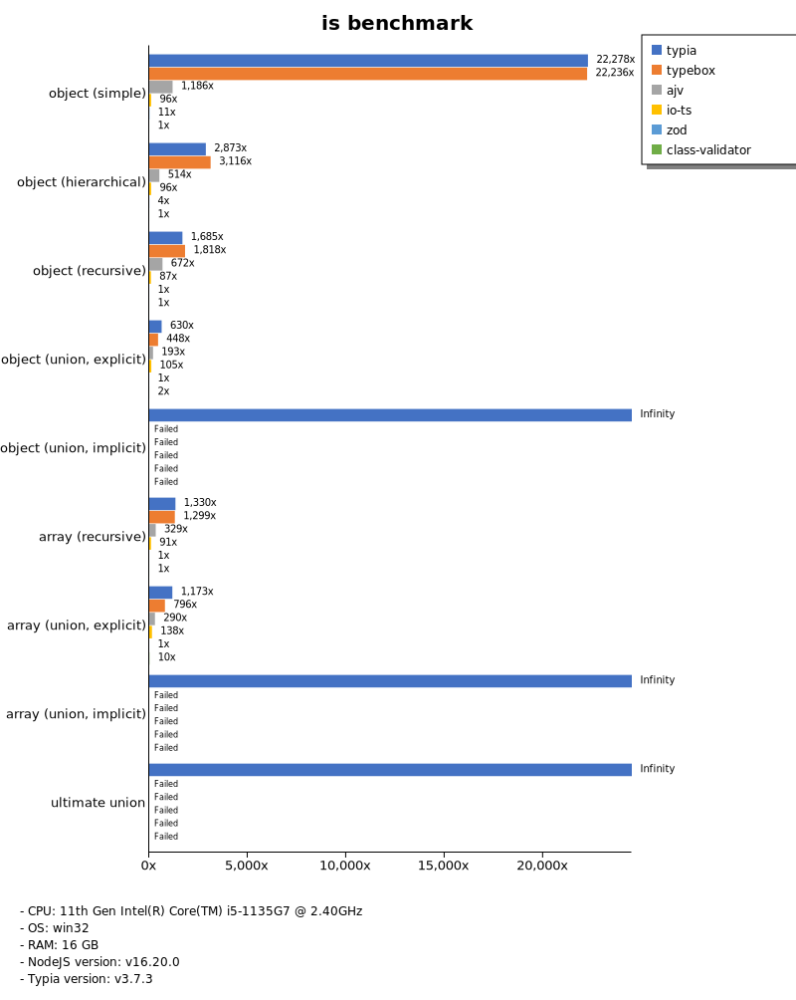
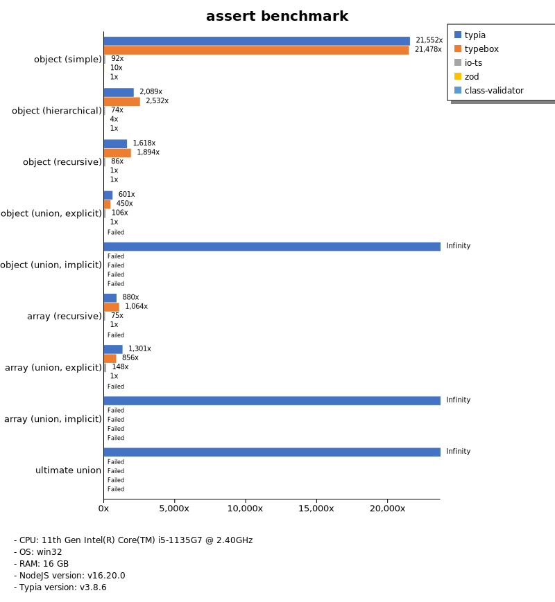
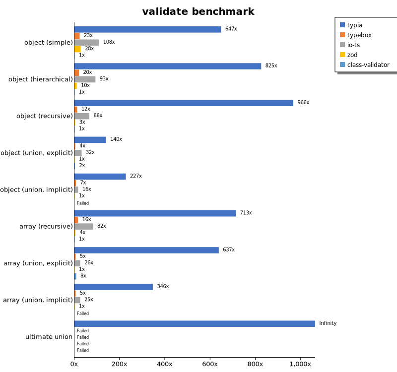
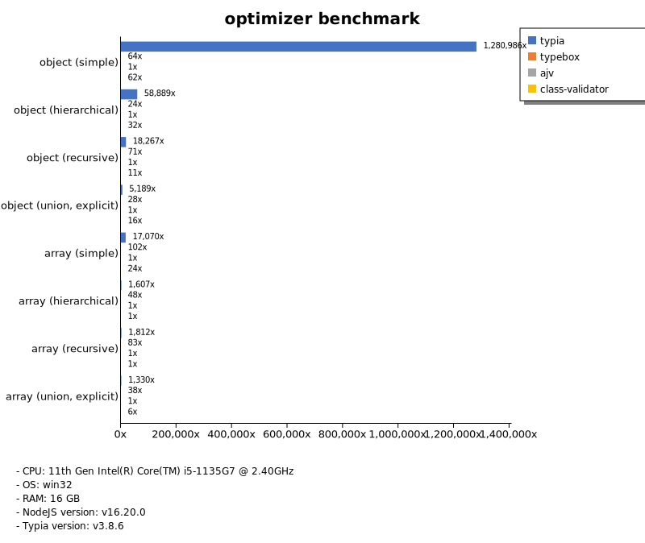
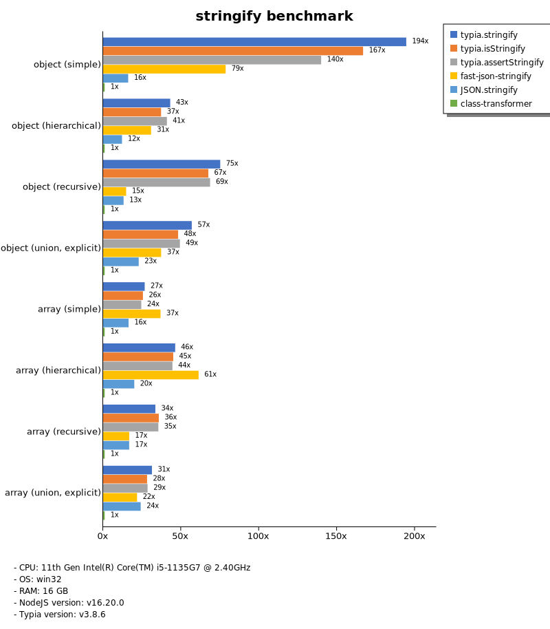
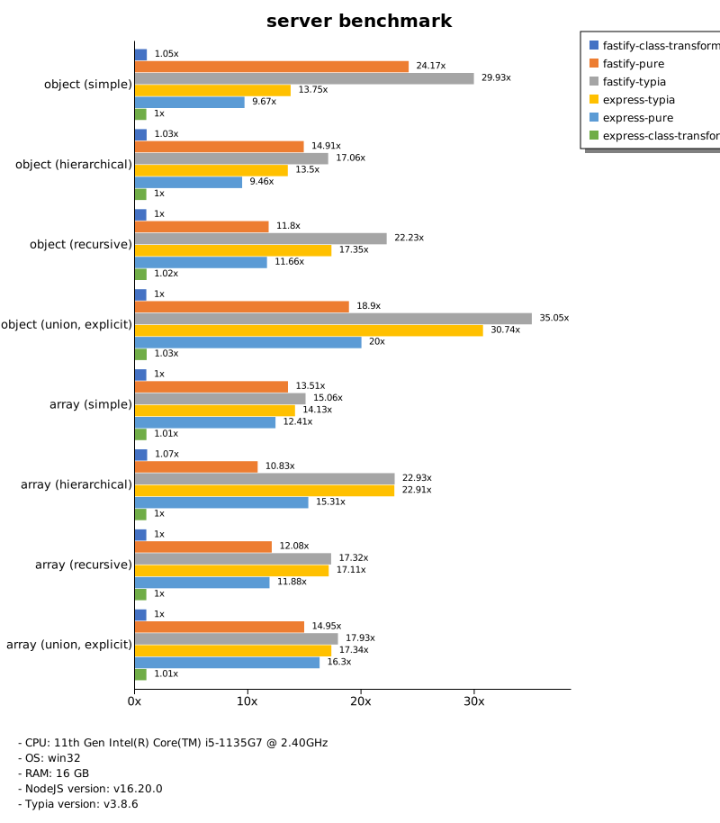

# Benchmark of `typia`
> - CPU: 11th Gen Intel(R) Core(TM) i5-1135G7 @ 2.40GHz
> - Memory: 16,218 MB
> - OS: win32
> - NodeJS version: v16.20.0
> - Typia version: 3.7.2

## is

 Types | typia | typebox | ajv | io-ts | zod | class-validator 
-------|------|------|------|------|------|------
 object (simple) | 1,144,389 | 1,178,228 | 64,683 | 4,835 | 551 | 53 
 object (hierarchical) | 232,729 | 275,745 | 43,275 | 8,068 | 402 | 86 
 object (recursive) | 139,050 | 155,091 | 52,136 | 6,752 | 82 | 96 
 object (union, explicit) | 25,632 | 17,648 | 7,656 | 4,064 | 40 | 83 
 object (union, implicit) | 20,530 |  -  |  -  |  -  |  -  |  -  
 array (recursive) | 104,069 | 104,515 | 27,620 | 7,151 | 96 | 73 
 array (union, explicit) | 23,810 | 16,377 | 5,975 | 2,913 | 20 | 198 
 array (union, implicit) | 25,667 |  -  |  -  |  -  |  -  |  -  
 ultimate union | 7,569 |  -  |  -  |  -  |  -  |  -  

> Unit: Kilobytes/sec

## assert

 Types | typia | typebox | io-ts | zod | class-validator 
-------|------|------|------|------|------
 object (simple) | 52,760 | 309 | 2,014 | 577 | 50 
 object (hierarchical) | 80,156 | 626 | 3,001 | 394 | 84 
 object (recursive) | 59,318 | 489 | 2,097 | 82 | 97 
 object (union, explicit) | 7,095 | 175 | 1,323 | 39 | 82 
 object (union, implicit) | 7,361 |  -  |  -  |  -  | 93 
 array (recursive) | 25,910 | 496 | 2,148 | 96 | NaN 
 array (union, explicit) | 16,378 | 125 | 640 | 20 | 195 
 array (union, implicit) | 15,098 |  -  |  -  |  -  | 168 
 ultimate union | 3,534 |  -  |  -  |  -  |  -  

> Unit: Kilobytes/sec

## validate

 Types | typia | typebox | io-ts | zod | class-validator 
-------|------|------|------|------|------
 object (simple) | 11,961 | 334 | 2,026 | 584 | 53 
 object (hierarchical) | 28,125 | 636 | 3,074 | 402 | 84 
 object (recursive) | 20,452 | 481 | 2,074 | 77 | 95 
 object (union, explicit) | 4,923 | 171 | 1,303 | 40 | 83 
 object (union, implicit) | 4,661 |  -  |  -  |  -  | 100 
 array (recursive) | 14,023 | 479 | 2,136 | 97 | 76 
 array (union, explicit) | 11,741 | 126 | 620 | 19 | 198 
 array (union, implicit) | 10,286 |  -  |  -  |  -  | 167 
 ultimate union | 2,392 |  -  |  -  |  -  |  -  

> Unit: Kilobytes/sec

## optimizer

 Types | typia | typebox | ajv | class-validator 
-------|------|------|------|------
 object (simple) | 1,170,549 | 60 | 0 | 49 
 object (hierarchical) | 242,827 | 114 | 4 | 82 
 object (recursive) | 150,445 | 635 | 9 | 96 
 object (union, explicit) | 25,102 | 137 | 5 | 84 
 array (simple) | 123,863 | 894 | 11 | 181 
 array (hierarchical) | 224,913 | 11,003 | 145 | 160 
 array (recursive) | 146,682 | 7,037 | 92 | 78 
 array (union, explicit) | 45,425 | 1,274 | 36 | 196 

> Unit: Kilobytes/sec

## stringify

 Types | typia.stringify | typia.isStringify | typia.assertStringify | fast-json-stringify | JSON.stringify | class-transformer 
-------|------|------|------|------|------|------
 object (simple) | 11,234 | 8,568 | 4,878 | 3,843 | 767 | 50 
 object (hierarchical) | 4,972 | 4,696 | 4,254 | 5,396 | 1,261 | 107 
 object (recursive) | 6,766 | 6,124 | 5,560 | 1,326 | 1,344 | 91 
 object (union, explicit) | 2,149 | 1,850 | 1,531 | 1,348 | 933 | 40 
 array (simple) | 2,689 | 2,451 | 2,346 | 3,869 | 1,767 | 95 
 array (hierarchical) | 3,589 | 3,550 | 3,246 | 4,668 | 1,525 | 84 
 array (recursive) | 3,199 | 3,031 | 2,858 | 1,418 | 1,447 | 89 
 array (union, explicit) | 2,480 | 2,388 | 2,182 | 1,650 | 1,860 | 81 

> Unit: Kilobytes/sec

## server

 Types | express-typia | fastify | express-pure | express-class-transformer 
-------|------|------|------|------
 object (simple) | 70 | 115 | 49 | 5 
 object (hierarchical) | 147 | 199 | 97 | 10 
 object (recursive) | 153 | 106 | 104 | 8 
 object (union, explicit) | 114 | 73 | 76 | 3 
 array (simple) | 130 | 121 | 121 | 9 
 array (hierarchical) | 169 | 78 | 112 | 7 
 array (recursive) | 146 | 105 | 103 | 7 
 array (union, explicit) | 119 | 111 | 116 | 7 

> Unit: Kilobytes/sec

Total elapsed time: 1,552,444 ms
