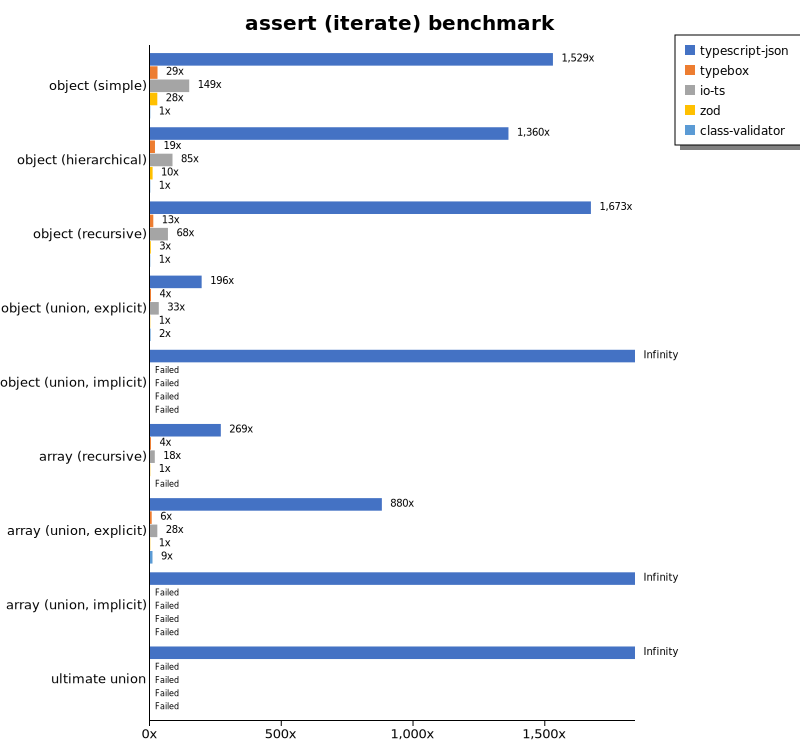
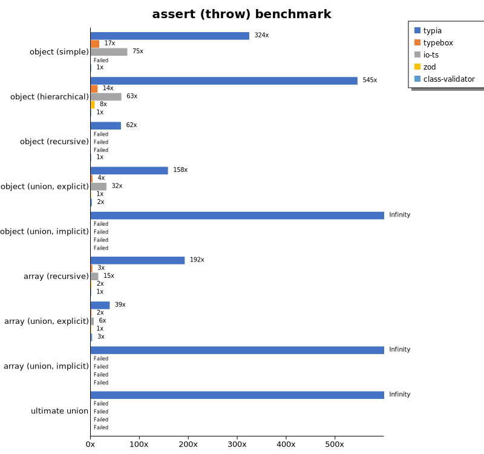
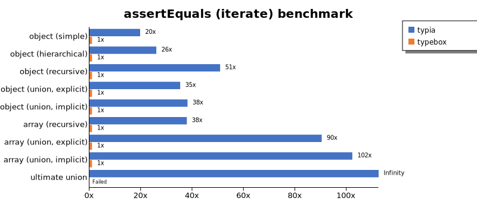
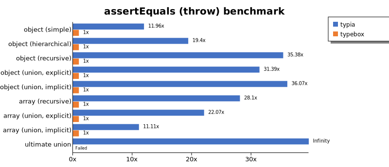
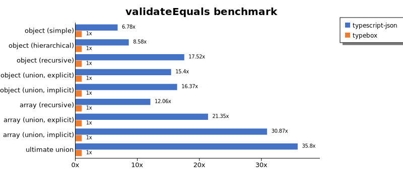
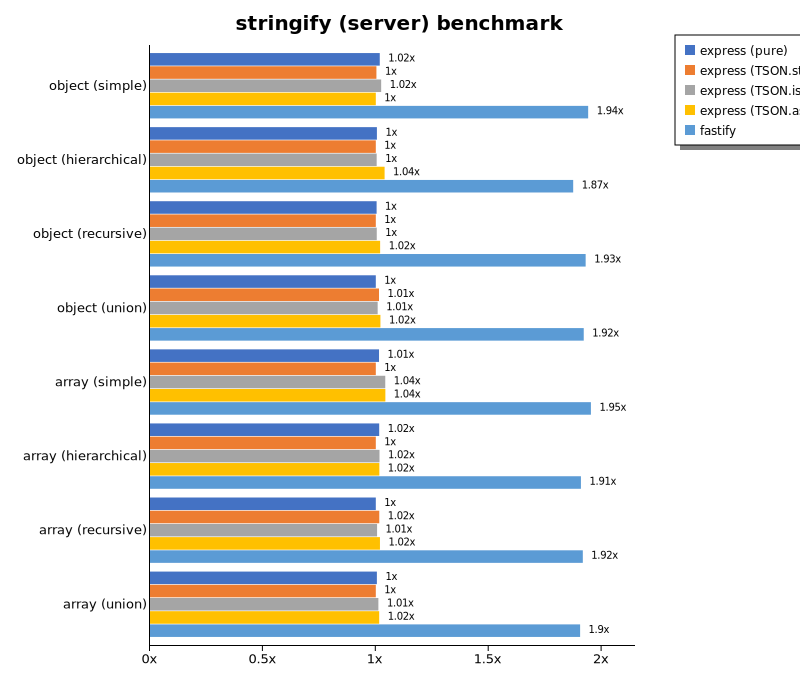

# Benchmark of `typia`
> - CPU: 11th Gen Intel(R) Core(TM) i5-1135G7 @ 2.40GHz
> - Memory: 16,218 MB
> - OS: win32
> - NodeJS version: v16.20.0
> - Typia version: 3.7.0

## is

 Components | typia | typebox | ajv | io-ts | zod | class-validator 
------------|-------|---------|-----|-------|-----|-----------------
object (simple) | 262801.9929876361 | 42028.104575163394 | 64791.752001489476 | 3709.3886878689773 | 618.3828861493836 | 15.742522301906595
object (hierarchical) | 173518.5550517531 | 99594.57419489173 | 33362.72218905016 | 7331.299147143924 | 395.70661272321433 | 36.633595464520845
object (recursive) | 118295.24531471985 | 79850.26377073165 | 22775.794364768313 | 5177.047218486904 | 81.73284590398083 | 29.634404660637536
object (union, explicit) | 22791.281226521412 | 10849.353438146269 | 4658.639960720887 | 3460.727207780236 | 39.20916589219331 | 81.01310857089966
object (union, implicit) | 27899.301889780403 | Failed | Failed | Failed | Failed | Failed
array (recursive) | 67627.15632389051 | 54402.10653343693 | 25747.479106104653 | 5215.775980869001 | 105.96022501635208 | 30.481209159660025
array (union, explicit) | 28537.903000172173 | 10716.245629767525 | 6025.7849263009775 | 2542.2084879297386 | 23.231282822001106 | 182.61772923215605
array (union, implicit) | 18300.91283601239 | Failed | Failed | Failed | Failed | Failed
ultimate union | 7834.021030287114 | Failed | Failed | Failed | Failed | Failed

 Unit: kilobytes/sec 

## assert (iterate)

 Components | typia | typebox | io-ts | zod | class-validator 
------------|-------|---------|-------|-----|-----------------
object (simple) | 46592.13456483645 | 341.61632950469095 | 1830.090731700187 | 563.0857233415569 | 15.977432793224086
object (hierarchical) | 52622.11244891655 | 613.099426508544 | 3199.582682905278 | 373.87796579125336 | 36.84491548778248
object (recursive) | 51914.049435618734 | 368.91560382153614 | 1965.5330882352937 | 79.0063503922301 | 30.96016020236088
object (union, explicit) | 6814.485983289617 | 134.7721681323283 | 1252.7452256944443 | 41.03563424871941 | 80.07665758827949
object (union, implicit) | 8672.893588165573 | Failed | Failed | Failed | Failed
array (recursive) | 28939.00048339663 | 383.9313394628685 | 2065.588662790698 | 106.43411507283834 | Failed
array (union, explicit) | 17390.98534454981 | 127.40839803067601 | 585.7036288909142 | 19.614148495802237 | 186.97028992219342
array (union, implicit) | 12663.429775137958 | Failed | Failed | Failed | Failed
ultimate union | 3636.104628521763 | Failed | Failed | Failed | Failed

 Unit: kilobytes/sec 

## assert (throw)

 Components | typia | typebox | io-ts | zod | class-validator 
------------|-------|---------|-------|-----|-----------------
object (simple) | 5615.190939777612 | 324.5961199703319 | 1412.2933308563997 | Failed | 16.33582376819709
object (hierarchical) | 23974.761872334013 | 639.5622809579439 | 2981.1048237697128 | 423.4706087906408 | 45.78735083668617
object (recursive) | 6049.266962274774 | Failed | Failed | Failed | 102.46142186360322
object (union, explicit) | 6105.5486751152075 | 135.87565104166666 | 1254.7134031208436 | 38.62847222222223 | 95.74201623584216
object (union, implicit) | 6162.869318181818 | Failed | Failed | Failed | Failed
array (recursive) | 22162.426693540805 | 406.39063071089174 | 2103.8500768684958 | 185.19066715939377 | 128.88428951257677
array (union, explicit) | 3225.5284926470586 | 126.2279705258885 | 519.6298853509098 | 80.80397743677098 | 249.21875
array (union, implicit) | 1655.8804119789745 | Failed | Failed | Failed | Failed
ultimate union | 3675.224790945133 | Failed | Failed | Failed | Failed

 Unit: kilobytes/sec 

## validate

 Components | typia | typebox | io-ts | zod | class-validator 
------------|-------|---------|-------|-----|-----------------
object (simple) | 10134.519853145881 | 333.9449695264338 | 1862.6534598214284 | 582.4031434029724 | 16.317008370843286
object (hierarchical) | 24093.585064804913 | 624.3403114047223 | 3118.723739495798 | 388.0604492370342 | 37.08759293680298
object (recursive) | 24323.304407693216 | 358.709064050441 | 1939.5545558366916 | 80.14558072286353 | 31.504098022092144
object (union, explicit) | 4924.009856402052 | 135.16746677170204 | 1242.0695162006732 | 41.73697274150693 | 80.37596487898031
object (union, implicit) | 5783.079916346681 | 180.71886294464525 | 450.45586400866125 | 30.804891355359487 | Failed
array (recursive) | 16160.122288761095 | 363.00210342083415 | 2073.921688317846 | 105.86364312896899 | 30.45380006622214
array (union, explicit) | 12997.990996824867 | 126.67631281761717 | 588.9497759467206 | 19.674674052853135 | 184.70004641956277
array (union, implicit) | 9222.12066399836 | 112.231019593442 | 538.6085575686106 | 14.85104233722641 | Failed
ultimate union | 2478.7964745391187 | Failed | Failed | Failed | Failed

 Unit: kilobytes/sec 

## equals

 Components | typia | typebox 
------------|-------|---------
object (simple) | 21419.121681647157 | 7698.716564291328
object (hierarchical) | 37572.85344837402 | 13700.359955788925
object (recursive) | 28985.889132852215 | 12771.84039608177
object (union, explicit) | 10178.692875740708 | 3324.6971965160587
object (union, implicit) | 5411.790572561468 | 3266.833520817989
array (recursive) | 28930.98241094004 | 11665.601540677375
array (union, explicit) | 18979.03113646685 | 4517.572395260359
array (union, implicit) | 11797.521150604181 | 3846.9464654714634
ultimate union | 4825.822568843385 | Failed

 Unit: kilobytes/sec 

## assertEquals (iterate)

 Components | typia | typebox 
------------|-------|---------
object (simple) | 11393.03551609323 | 282.0483154387264
object (hierarchical) | 26701.954752912483 | 547.771663597767
object (recursive) | 26663.80915960519 | 309.2463463216385
object (union, explicit) | 4784.4771833609275 | 107.67312831063187
object (union, implicit) | 3710.0239703327843 | 105.60542046967103
array (recursive) | 17433.248400180524 | 330.42156839397984
array (union, explicit) | 14247.155122525544 | 106.99981233449972
array (union, implicit) | 9687.548063478747 | 60.95520538243626
ultimate union | 3048.597721978469 | Failed

 Unit: kilobytes/sec 

## assertEquals (throw)

 Components | typia | typebox 
------------|-------|---------
object (simple) | 4378.440366972477 | 255.99630996309966
object (hierarchical) | 16402.09469978291 | 522.0085857018028
object (recursive) | 14491.706230152337 | 332.60479252722496
object (union, explicit) | 4416.652960526316 | 115.58733643250689
object (union, implicit) | 3338.846574508389 | 103.59343732945243
array (recursive) | 15685.015259468993 | 399.1282820915619
array (union, explicit) | 3238.5764982400888 | 122.03724912739965
array (union, implicit) | 1476.6733269942433 | 140.1525730272401
ultimate union | 3159.9848292649476 | Failed

 Unit: kilobytes/sec 

## validateEquals

 Components | typia | typebox 
------------|-------|---------
object (simple) | 6550.284224787937 | 272.08011583011586
object (hierarchical) | 14824.03439235131 | 535.7165161972487
object (recursive) | 15019.843705836629 | 308.82653002574943
object (union, explicit) | 3437.4118479219433 | 103.51708582647719
object (union, implicit) | 2444.123937133297 | 107.47355575445751
array (recursive) | 10428.602827000364 | 328.58172849156716
array (union, explicit) | 11084.819614112019 | 107.20960290153236
array (union, implicit) | 7556.07460874258 | 60.05750464684015
ultimate union | 1965.6168991526586 | Failed

 Unit: kilobytes/sec 

## optimizer

 Components | typia | typebox | ajv 
------------|-------|---------|-----
object (hierarchical) | 171153.00035208068 | 128.27187779767235 | 4.141341743119265
object (recursive) | 115204.62089053469 | 714.7579538113695 | 9.791551438053096
object (union) | 18753.309886565836 | 113.66972279614325 | 6.265298817661186
array (hierarchical) | 143267.15706633823 | 14735.616769687558 | 123.72288730360444
array (recursive) | 75234.63144139819 | 7138.730209485619 | 101.88425862227115
array (recursive union) | 28960.919047510906 | 1447.6985548997563 | 42.66682461168639
ultimate union | 7459.811189837795 | 152.6739712803875 | 12.769433576431991

 Unit: kilobytes/sec 

## stringify

 Components | typia.stringify() | typia.assertStringify() | typia.isStringify() | fast-json-stringify | class-transformer | JSON.stringify 
------------|-------------------|-------------------------|---------------------|---------------------|-------------------|----------------
object (simple) | 5465.0707415389525 | 4338.797433035715 | 4848.953163405181 | 3803.3418559280517 | 52.3671612443988 | 766.7558865360303
object (hierarchical) | 4868.898699314942 | 4001.1927808834307 | 4202.20638423735 | 5284.43446635411 | 109.39810536044362 | 1367.508012820513
object (recursive) | 6195.599028906956 | 5382.841466585278 | 5744.525708212077 | 1340.5885858050847 | 91.53197674418604 | 1341.5553402189914
object (union) | 1983.450304572002 | 1489.0108839722675 | 1796.409585915978 | 1940.0532009808435 | 38.45009798432251 | 956.5377694166823
array (simple) | 2398.8477486803786 | 2201.6567087049425 | 2353.3213500641145 | 3716.2875234521575 | Failed | 1715.436129537498
array (hierarchical) | 3372.8885717239477 | 2974.878881459656 | 3317.5075301204824 | 4546.119414112682 | 84.20211347616397 | 1515.9822388722648
array (recursive) | 3043.589600021079 | 2668.6058974847565 | 2876.5554665858726 | 1410.7640200151059 | 86.95770775139664 | 1397.8309167446214
array (recursive union) | 2150.8159362617075 | 1820.99584435425 | 1903.1305287152968 | 1631.148525801371 | 83.60519553402646 | 1797.3821985791299

 Unit: kilobytes/sec 

## stringify (server)

 Components | express (pure) | express (class-transformer) | express (typia.stringify) | express (typia.isStringify) | express (typia.assertStringify) | fastify 
------------|----------------|-----------------------------|---------------------------|-----------------------------|---------------------------------|---------
object (simple) | 47221.95511571881 | 5222.577961411906 | 67717.3088970655 | 67226.07441359488 | 60519.093541685565 | 106766.74720577404
object (hierarchical) | 97303.17208331444 | 12627.146508535765 | 118233.40184694513 | 116242.87639018003 | 114983.3548809806 | 169654.92397566768
object (recursive) | 52835.40922619047 | 8170.343738322123 | 62951.2346476938 | 64228.48600857941 | 60677.40619075533 | 63484.44409013605
object (union) | 53365.747521975085 | 3971.705901355719 | 117204.70352773831 | 110714.49839340032 | 98014.735578421 | 75074.08825600817
array (simple) | 84921.4608892843 | 9181.041955617198 | 116820.0712797174 | 115453.73707771112 | 109708.01462323776 | 121480.930450835
array (hierarchical) | Failed | 6544.556606224025 | 130470.59037006905 | 125019.49090657198 | 97130.01098632812 | 78355.2178632886
array (recursive union) | 103094.84179570709 | 7844.291574770129 | 105639.63656709227 | 97818.41691879703 | 91220.75533821696 | 89925.66890680241

 Unit: megabytes/sec 

