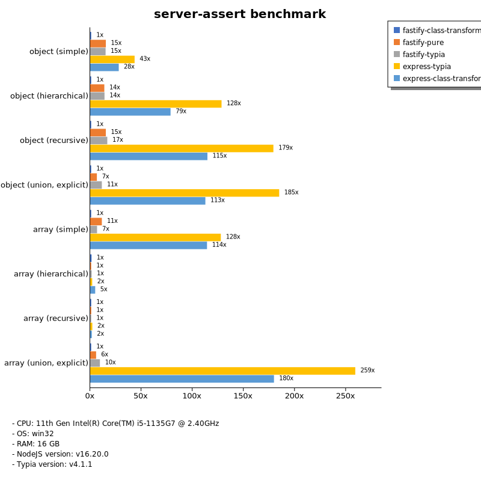
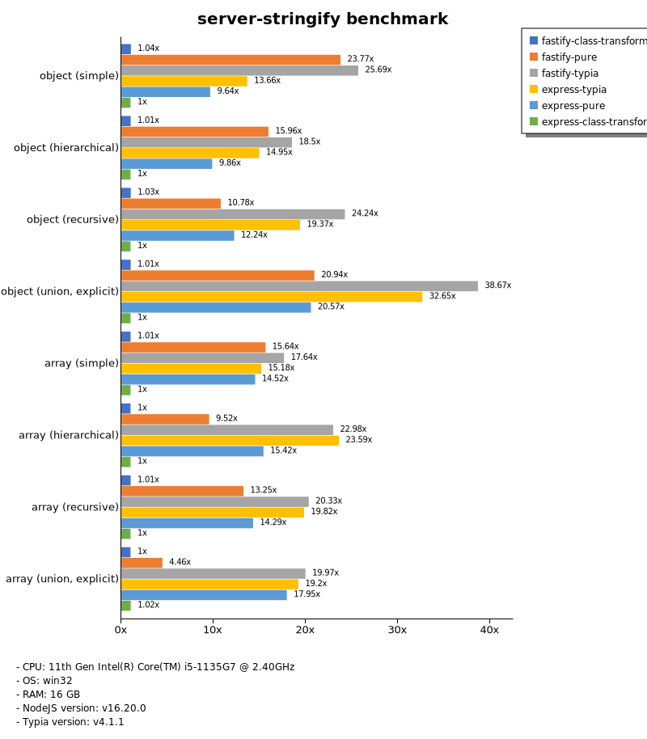
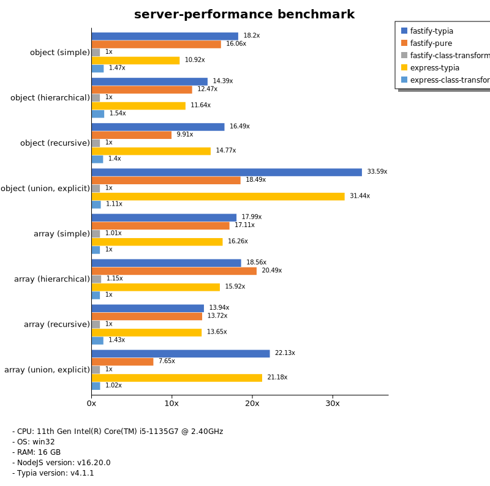

# Benchmark of `typia`
> - CPU: 11th Gen Intel(R) Core(TM) i5-1135G7 @ 2.40GHz
> - Memory: 16,218 MB
> - OS: win32
> - NodeJS version: v16.20.0
> - Typia version: v4.1.1

## is

 Types | typia | typebox | ajv | io-ts | zod | class-validator 
-------|------|------|------|------|------|------
 object (simple) | 109,022 | 107,773 | 4,408 | 456 | 52 | 5.08 
 object (hierarchical) | 25,860 | 24,575 | 5,063 | 735 | 36 | 9.16 
 object (recursive) | 12,296 | 14,174 | 2,211 | 643 | 6.79 | 8.19 
 object (union, explicit) | 2,131 | 1,605 | 118 | 387 | 3.44 |  -  
 object (union, implicit) | 1,903 |  -  |  -  |  -  |  -  |  -  
 array (recursive) | 8,382 | 9,871 | 2,437 | 688 | 5.22 | 7.36 
 array (union, explicit) | 2,195 | 1,462 | 213 | 268 | 1.66 |  -  
 array (union, implicit) | 2,443 |  -  |  -  |  -  |  -  |  -  
 ultimate union | 665 |  -  |  -  |  -  |  -  |  -  

> Unit: Megabytes/sec

## assert

 Types | typia | typebox | ajv | io-ts | zod | class-validator 
-------|------|------|------|------|------|------
 object (simple) | 110,529 | 110,497 |  -  | 460 | 53 | 4.66 
 object (hierarchical) | 25,493 | 24,995 |  -  | 709 | 36 | 8.80 
 object (recursive) | 10,188 | 13,611 |  -  | 638 | 6.47 | 8.22 
 object (union, explicit) | 2,055 | 1,596 |  -  | 384 | 3.40 |  -  
 object (union, implicit) | 1,868 |  -  |  -  |  -  |  -  |  -  
 array (recursive) | 8,356 | 9,558 |  -  | 672 | 8.84 | 7.54 
 array (union, explicit) | 2,196 | 1,480 |  -  | 261 | 1.72 |  -  
 array (union, implicit) | 2,455 |  -  |  -  |  -  |  -  |  -  
 ultimate union | 678 |  -  |  -  |  -  |  -  |  -  

> Unit: Megabytes/sec

## validate

 Types | typia | typebox | ajv | io-ts | zod | class-validator 
-------|------|------|------|------|------|------
 object (simple) | 107,210 | 108,395 |  -  | 463 | 54 | 5.12 
 object (hierarchical) | 16,460 | 24,534 |  -  | 691 | 37 | 9.04 
 object (recursive) | 11,898 | 14,403 |  -  | 630 | 6.72 | 8.14 
 object (union, explicit) | 2,255 | 1,556 |  -  | 377 | 3.46 |  -  
 object (union, implicit) | 1,840 |  -  |  -  |  -  |  -  |  -  
 array (recursive) | 9,261 | 9,626 |  -  | 667 | 8.96 | 7.33 
 array (union, explicit) | 2,174 | 1,460 |  -  | 275 | 1.68 |  -  
 array (union, implicit) | 2,437 |  -  |  -  |  -  |  -  |  -  
 ultimate union | 677 |  -  |  -  |  -  |  -  |  -  

> Unit: Megabytes/sec

## assert-error

 Types | typia | typebox | io-ts | zod | class-validator 
-------|------|------|------|------|------
 object (simple) | 405 | 23 | 110 | 52 | 3.23 
 object (hierarchical) | 1,839 | 53 | 179 | 35 | 6.42 
 object (recursive) | 1,594 | 37 | 137 | 6.32 | 5.48 
 object (union, explicit) | 422 | 15 | 83 | 3.35 |  -  
 object (union, implicit) | 329 |  -  |  -  |  -  |  -  
 array (recursive) | 1,270 | 42 | 131 | 8.34 | 4.81 
 array (union, explicit) | 822 | 11 | 44 | 1.32 |  -  
 array (union, implicit) | 914 |  -  |  -  |  -  |  -  
 ultimate union | 212 |  -  |  -  |  -  |  -  

> Unit: Megabytes/sec

## validate-error

 Types | typia | typebox | io-ts | zod | class-validator 
-------|------|------|------|------|------
 object (simple) | 1,069 | 23 | 113 | 47 | 3.31 
 object (hierarchical) | 2,018 | 54 | 187 | 35 | 6.36 
 object (recursive) | 1,582 | 37 | 128 | 6.53 | 5.50 
 object (union, explicit) | 390 | 15 | 79 | 3.33 |  -  
 object (union, implicit) | 286 |  -  |  -  |  -  |  -  
 array (recursive) | 974 | 41 | 131 | 8.37 | 4.81 
 array (union, explicit) | 705 | 10 | 43 | 1.28 |  -  
 array (union, implicit) | 697 |  -  |  -  |  -  |  -  
 ultimate union | 175 |  -  |  -  |  -  |  -  

> Unit: Megabytes/sec

## optimizer

 Types | typia | typebox | ajv | class-validator 
-------|------|------|------|------
 object (simple) | 109,194 | 5.23 | 0.02 | 4.98 
 object (hierarchical) | 25,970 | 9.41 | 0.08 | 10 
 object (recursive) | 13,808 | 40 | 0.18 | 8.14 
 object (union, explicit) | 2,226 | 11 | 0.09 | 7.16 
 array (simple) | 11,172 | 81 | 0.43 | 17 
 array (hierarchical) | 20,569 | 628 | 2.95 | 14 
 array (recursive) | 11,227 | 457 | 1.77 | 6.77 
 array (union, explicit) | 4,751 | 112 | 0.56 | 17 

> Unit: Megabytes/sec

## stringify

 Types | typia.stringify | typia.isStringify | typia.assertStringify | fast-json-stringify | JSON.stringify | class-transformer 
-------|------|------|------|------|------|------
 object (simple) | 1,072 | 849 | 850 | 361 | 72 | 4.44 
 object (hierarchical) | 438 | 428 | 413 | 309 | 118 | 9.76 
 object (recursive) | 594 | 556 | 529 | 139 | 127 | 8.24 
 object (union, explicit) | 186 | 166 | 167 | 121 | 86 | 3.34 
 array (simple) | 235 | 227 | 213 | 341 | 153 | 8.71 
 array (hierarchical) | 322 | 306 | 303 | 443 | 140 | 7.35 
 array (recursive) | 279 | 262 | 262 | 500 | 131 | 7.89 
 array (union, explicit) | 228 | 197 | 186 | 46 | 173 | 7.11 

> Unit: Megabytes/sec

## server-assert

 Types | fastify-typia | fastify-pure | fastify-class-transformer | express-typia | express-class-transformer 
-------|------|------|------|------|------
 object (simple) | 46 | 46 | 3.47 | 37 | 3.25 
 object (hierarchical) | 93 | 83 | 6.30 | 82 | 6.54 
 object (recursive) | 88 | 82 | 5.59 | 88 | 5.19 
 object (union, explicit) | 57 | 35 | 2.14 | 56 | 2.14 
 array (simple) | 85 | 85 | 4.91 | 82 | 3.53 
 array (hierarchical) | 73 | 34 | 2.13 | 46 | 3.01 
 array (recursive) | 69 | 64 | 4.05 | 76 | 4.03 
 array (union, explicit) | 85 | 53 | 3.95 | 92 | 4.07 

> Unit: Megabytes/sec

## server-stringify

 Types | fastify-typia | fastify-pure | fastify-class-transformer | express-typia | express-pure | express-class-transformer 
-------|------|------|------|------|------|------
 object (simple) | 96 | 85 | 3.75 | 49 | 33 | 3.51 
 object (hierarchical) | 143 | 111 | 7.65 | 111 | 73 | 7.30 
 object (recursive) | 151 | 62 | 6.39 | 125 | 77 | 6.09 
 object (union, explicit) | 107 | 55 | 2.73 | 90 | 55 | 2.64 
 array (simple) | 112 | 90 | 6.48 | 97 | 90 | 6.02 
 array (hierarchical) | 130 | 55 | 5.11 | 121 | 82 | 5.41 
 array (recursive) | 116 | 70 | 5.43 | 111 | 75 | 4.71 
 array (union, explicit) | 81 | 17 | 3.97 | 74 | 69 | 3.96 

> Unit: Megabytes/sec

## server-performance

 Types | fastify-typia | fastify-pure | fastify-class-transformer | express-typia | express-class-transformer 
-------|------|------|------|------|------
 object (simple) | 61 | 54 | 3.34 | 36 | 4.92 
 object (hierarchical) | 90 | 78 | 6.24 | 73 | 9.58 
 object (recursive) | 87 | 53 | 5.30 | 78 | 7.40 
 object (union, explicit) | 52 | 29 | 1.56 | 49 | 1.73 
 array (simple) | 76 | 72 | 4.26 | 69 | 4.23 
 array (hierarchical) | 46 | 51 | 2.86 | 39 | 2.48 
 array (recursive) | 64 | 63 | 4.62 | 63 | 6.61 
 array (union, explicit) | 72 | 25 | 3.27 | 69 | 3.34 

> Unit: Megabytes/sec

Total elapsed time: 9,072,421 ms
