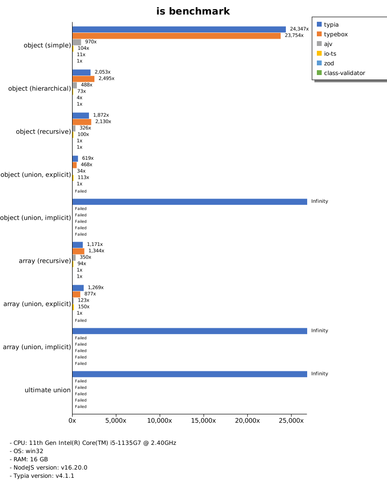

# Benchmark of `typescript-json`
> - CPU: 11th Gen Intel(R) Core(TM) i5-1135G7 @ 2.40GHz
> - Memory: 16,218 MB
> - OS: win32
> - TypeScript-JSON version: 3.3.34

## is

 Components | typescript-json | typebox | ajv | io-ts | zod | class-validator 
------------|-----------------|---------|-----|-------|-----|-----------------
object (simple) | 249823.71736352015 | 136312.23744292237 | 62781.25000000001 | 4933.651026392961 | 445.6781060745091 | 16.69626998223801
object (hierarchical) | 163717.49653876582 | 165763.3344738443 | 37199.10417621448 | 7581.543492469609 | 356.61010524438103 | 39.89018087855297
object (recursive) | 114385.58448621712 | 91239.2925020183 | 44353.20500088277 | 6014.185685539351 | 77.11167363395467 | 31.601204128440365
object (union, explicit) | 24362.22554655107 | 13346.651911021707 | 7872.216418082749 | 3465.5590596330276 | 35.11999545040946 | 82.2303178084749
object (union, implicit) | 29627.409948354343 | Failed | Failed | Failed | Failed | Failed
array (recursive) | 82564.60975859247 | 65943.69599520217 | 25776.966900733936 | 5409.753866821377 | 106.53928979392019 | 32.151717120907264
array (union, explicit) | 27180.09036762026 | 13314.366432767623 | 5724.11281779661 | 2456.668322127139 | 20.21462657524092 | 176.3550616685144
array (union, implicit) | 13077.434717465754 | Failed | Failed | Failed | Failed | Failed
ultimate union | 8165.53462622772 | Failed | Failed | Failed | Failed | Failed

 Unit: kilobytes/sec 

## assert (iterate)

 Components | typescript-json | typebox | io-ts | zod | class-validator 
------------|-----------------|---------|-------|-----|-----------------
object (simple) | 23174.177163221546 | 424.70885660046736 | 2194.2799403077065 | 414.74234670460805 | 17.090821556981613
object (hierarchical) | 50107.543877027776 | 673.3197193600868 | 3140.555542693091 | 334.9832366799566 | 39.36172031734452
object (recursive) | 46809.122039564536 | 353.833912037037 | 1918.043363363877 | 77.38474329122096 | 31.56663043227533
object (union, explicit) | 7110.448966221832 | 133.2636799443147 | 1220.2337973659887 | 36.207861770675976 | 82.21149606067732
object (union, implicit) | 9182.291666666666 | Failed | Failed | Failed | Failed
array (recursive) | 28957.91913280671 | 368.98913907056004 | 1885.1172745958752 | 105.49569729257229 | Failed
array (union, explicit) | 17130.740798935924 | 125.26844155468028 | 567.9218939023823 | 19.0223780303734 | 180.62228050525428
array (union, implicit) | 8493.568157327585 | Failed | Failed | Failed | Failed
ultimate union | 3618.0650865709463 | Failed | Failed | Failed | Failed

 Unit: kilobytes/sec 

## assert (throw)

 Components | typescript-json | typebox | io-ts | zod | class-validator 
------------|-----------------|---------|-------|-----|-----------------
object (simple) | 5957.0920326603045 | 349.0279796511628 | 1317.4961193767574 | Failed | 18.532077699573993
object (hierarchical) | 25087.23204277975 | 681.9213912855406 | 2721.859082624905 | 331.54296875 | 47.161286911273876
object (recursive) | 6218.542916434151 | Failed | Failed | Failed | 104.95431082589285
object (union, explicit) | 5975.613581174838 | 136.18734780844156 | 1087.3681454088594 | 38.00806734777093 | 96.7025616124124
object (union, implicit) | 6099.831142033999 | Failed | Failed | Failed | Failed
array (recursive) | 23363.69306662472 | 401.57926655251146 | 1840.0426222219642 | 178.89719156834826 | 127.48732948944684
array (union, explicit) | 3276.0045363833515 | 123.00341356981983 | 496.6671119043288 | 76.81657987087881 | 242.4681034674125
array (union, implicit) | 1589.9970486429486 | Failed | Failed | Failed | Failed
ultimate union | 3636.1194553701343 | Failed | Failed | Failed | Failed

 Unit: kilobytes/sec 

## validate

 Components | typescript-json | typebox | io-ts | zod | class-validator 
------------|-----------------|---------|-------|-----|-----------------
object (simple) | 9848.753598336256 | 367.11445718494804 | 1611.7683785860654 | 421.00411505867015 | 17.42432001246307
object (hierarchical) | 28077.399362321696 | 686.7259445704002 | 3038.46755975796 | 337.6352852637615 | 38.553204113924046
object (recursive) | 25539.824588092117 | 352.46182026836163 | 1780.9222433636535 | 80.9017894947309 | 30.85277854258443
object (union, explicit) | 5121.0840257929185 | 134.83577370100272 | 1191.3961376664201 | 35.44342012252592 | 81.47379250659382
object (union, implicit) | 5850.850397240941 | 169.6810787671233 | 409.3642661529892 | 24.901055408970976 | Failed
array (recursive) | 16313.723244863015 | 396.11882860897316 | 1908.86238170347 | 105.02191364530636 | 30.337415462826648
array (union, explicit) | 13049.18790227332 | 126.45889245030939 | 566.0766808578293 | 18.929717893201186 | 179.93941580414014
array (union, implicit) | 9890.184685048584 | 108.1426358747157 | 498.46253819509235 | 14.289019455922865 | Failed
ultimate union | 2496.066067913386 | Failed | Failed | Failed | Failed

 Unit: kilobytes/sec 

## equals

 Components | typescript-json | typebox 
------------|-----------------|---------
object (simple) | 3425.0203253217082 | 8202.307169491134
object (hierarchical) | 7385.127898185483 | 14354.399889888053
object (recursive) | 7752.219073393247 | 12025.245421303565
object (union, explicit) | 2928.464524802458 | 3450.473790322581
object (union, implicit) | 2629.7752521810253 | 3135.2766776432895
array (recursive) | 6424.516645779432 | 12169.27724574893
array (union, explicit) | 5231.741028433524 | 4547.915517839276
array (union, implicit) | 3203.067513399346 | 3947.200740779842
ultimate union | 3940.175091829421 | Failed

 Unit: kilobytes/sec 

## assertEquals (iterate)

 Components | typescript-json | typebox 
------------|-----------------|---------
object (simple) | 3588.4267840593147 | 308.5019114134507
object (hierarchical) | 6233.135765935888 | 584.4764752094972
object (recursive) | 7169.264138817481 | 309.90721766848816
object (union, explicit) | 2543.7957260603816 | 106.60084856396865
object (union, implicit) | 2632.4842194987095 | 107.05109360301034
array (recursive) | 6484.999639976959 | 325.06137770628135
array (union, explicit) | 2584.7851951076145 | 107.68013946280992
array (union, implicit) | 2260.805191532258 | 59.10056657223796
ultimate union | 2776.8931113806993 | Failed

 Unit: kilobytes/sec 

## assertEquals (throw)

 Components | typescript-json | typebox 
------------|-----------------|---------
object (simple) | 1934.8980716293438 | 276.5780587313295
object (hierarchical) | 5184.75562773096 | 548.6260215345848
object (recursive) | 5791.74674131016 | 303.66074036214957
object (union, explicit) | 2379.772492508173 | 115.89189469320067
object (union, implicit) | 2307.9383077959446 | 103.8034163619744
array (recursive) | 4354.449656214649 | 389.3131222345133
array (union, explicit) | 1499.099547200878 | 118.36364079563182
array (union, implicit) | 936.2341638513514 | 131.23452061865433
ultimate union | 2855.392947020996 | Failed

 Unit: kilobytes/sec 

## validateEquals

 Components | typescript-json | typebox 
------------|-----------------|---------
object (simple) | 2206.2909260991582 | 283.38650865998176
object (hierarchical) | 5309.587226526891 | 562.5397079813405
object (recursive) | 5310.79219856504 | 307.3233720715735
object (union, explicit) | 1649.3127563810392 | 106.99403897537175
object (union, implicit) | 1738.0243255108558 | 106.73278624197508
array (recursive) | 4014.65037547357 | 322.07939847932437
array (union, explicit) | 2314.495131483824 | 108.42265284876017
array (union, implicit) | 1816.11725101626 | 58.010749257471694
ultimate union | 1879.1228769169045 | Failed

 Unit: kilobytes/sec 

## optimizer

 Components | typescript-json | typebox | ajv 
------------|-----------------|---------|-----
object (hierarchical) | 155715.34283393252 | 150.04173974635725 | 4.041829456660004
object (recursive) | 113419.35083421611 | 774.6398297915538 | 9.388681138270703
object (union) | 18204.455301857586 | 118.66393129335523 | 5.585909362056546
array (hierarchical) | 141687.40259442612 | 10746.659089846671 | 76.16610505908419
array (recursive) | 84605.19287659654 | 8029.836125252248 | 99.90780437256177
array (union) | 28709.313591546874 | 1582.3599758498976 | 40.98447175830362
ultimate union | 8191.793362314186 | 157.71086535850083 | 10.347316576086959

 Unit: kilobytes/sec 

## stringify

 Components | TSON.stringify() | TSON.assertStringify() | TSON.isStringify() | fast-json-stringify | JSON.stringify 
------------|------------------|------------------------|--------------------|---------------------|----------------
object (simple) | 5833.722267316018 | 4347.02218464798 | 5441.744108534821 | 3280.7733948408963 | 780.4112075070822
object (hierarchical) | 4498.1416851331915 | 3928.7901328038806 | 4053.0249225206608 | 4005.126953125 | 1314.3389860670277
object (recursive) | 5864.393456201516 | 5215.308023336414 | 5590.025656910417 | 1323.095130415248 | 1299.9383299520473
object (union) | 1779.3557235210362 | 1401.0130337181602 | 1620.9308413767985 | 1813.1786281779662 | 844.6114502628666
array (simple) | 1710.2054794520548 | 1321.2275805270863 | 1514.8903184005924 | 2117.245099802194 | 1444.047281993205
array (hierarchical) | 3158.764585352067 | 2816.58016082137 | 2976.390414614585 | 4280.880305192414 | 1587.677509809947
array (recursive) | 2774.284742714866 | 2560.0307642487046 | 2694.9028449237635 | 1311.8154987673051 | 1297.0566519782485
array (union) | 1779.8377949183305 | 1503.0081234171491 | 1622.1157424637142 | 1435.5820120843175 | 1677.00129005975

 Unit: kilobytes/sec 

