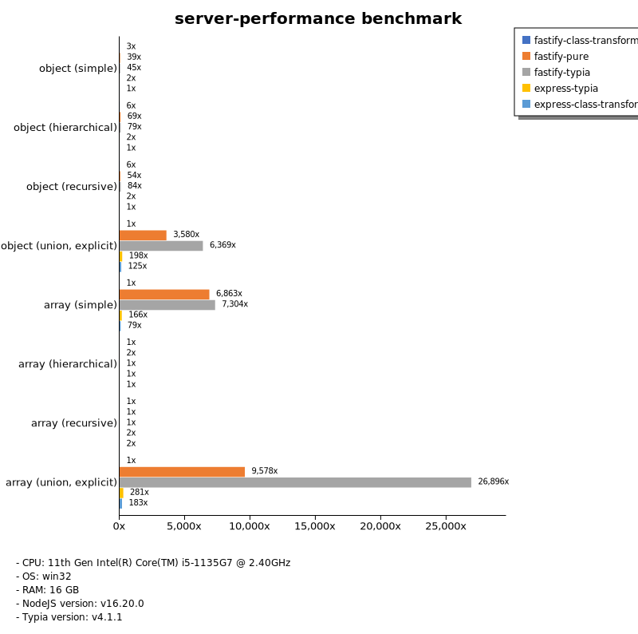

# Benchmark of `typia`
> - CPU: 11th Gen Intel(R) Core(TM) i5-1135G7 @ 2.40GHz
> - Memory: 16,218 MB
> - OS: win32
> - NodeJS version: v16.20.0
> - Typia version: v4.1.1

## is

 Types | typia | typebox | ajv | io-ts | zod | class-validator 
-------|------|------|------|------|------|------
 object (simple) | 112,944 | 110,193 | 4,498 | 481 | 53 | 4.64 
 object (hierarchical) | 20,761 | 25,238 | 4,938 | 735 | 36 | 10 
 object (recursive) | 12,506 | 14,233 | 2,179 | 671 | 6.68 | 8.48 
 object (union, explicit) | 2,155 | 1,629 | 119 | 393 | 3.48 |  -  
 object (union, implicit) | 1,843 |  -  |  -  |  -  |  -  |  -  
 array (recursive) | 8,436 | 9,685 | 2,525 | 681 | 7.21 | 7.72 
 array (union, explicit) | 2,195 | 1,516 | 213 | 259 | 1.73 |  -  
 array (union, implicit) | 2,528 |  -  |  -  |  -  |  -  |  -  
 ultimate union | 688 |  -  |  -  |  -  |  -  |  -  

> Unit: Megabytes/sec

## assert

 Types | typia | typebox | ajv | io-ts | zod | class-validator 
-------|------|------|------|------|------|------
 object (simple) | 115,449 | 112,175 |  -  | 470 | 55 | 4.80 
 object (hierarchical) | 26,181 | 25,300 |  -  | 751 | 36 | 8.96 
 object (recursive) | 10,312 | 14,260 |  -  | 661 | 6.63 | 8.08 
 object (union, explicit) | 2,170 | 1,627 |  -  | 386 | 3.44 |  -  
 object (union, implicit) | 1,826 |  -  |  -  |  -  |  -  |  -  
 array (recursive) | 8,339 | 9,828 |  -  | 685 | 8.75 | 6.99 
 array (union, explicit) | 2,212 | 1,540 |  -  | 265 | 1.67 |  -  
 array (union, implicit) | 2,464 |  -  |  -  |  -  |  -  |  -  
 ultimate union | 692 |  -  |  -  |  -  |  -  |  -  

> Unit: Megabytes/sec

## validate

 Types | typia | typebox | ajv | io-ts | zod | class-validator 
-------|------|------|------|------|------|------
 object (simple) | 107,842 | 112,755 |  -  | 472 | 56 | 4.66 
 object (hierarchical) | 17,087 | 23,836 |  -  | 691 | 37 | 9.53 
 object (recursive) | 12,140 | 14,024 |  -  | 641 | 6.79 | 8.09 
 object (union, explicit) | 2,109 | 1,608 |  -  | 393 | 3.45 |  -  
 object (union, implicit) | 1,731 |  -  |  -  |  -  |  -  |  -  
 array (recursive) | 9,333 | 9,810 |  -  | 691 | 9.02 | 7.41 
 array (union, explicit) | 2,186 | 1,529 |  -  | 253 | 1.70 |  -  
 array (union, implicit) | 1,673 |  -  |  -  |  -  |  -  |  -  
 ultimate union | 645 |  -  |  -  |  -  |  -  |  -  

> Unit: Megabytes/sec

## assert-error

 Types | typia | typebox | io-ts | zod | class-validator 
-------|------|------|------|------|------
 object (simple) | 418 | 24 | 119 | 52 | 3.15 
 object (hierarchical) | 1,917 | 52 | 181 | 34 | 6.46 
 object (recursive) | 1,616 | 37 | 133 | 6.44 | 5.55 
 object (union, explicit) | 429 | 16 | 84 | 3.29 |  -  
 object (union, implicit) | 339 |  -  |  -  |  -  |  -  
 array (recursive) | 1,318 | 43 | 138 | 8.54 | 4.47 
 array (union, explicit) | 861 | 11 | 45 | 1.29 |  -  
 array (union, implicit) | 955 |  -  |  -  |  -  |  -  
 ultimate union | 157 |  -  |  -  |  -  |  -  

> Unit: Megabytes/sec

## validate-error

 Types | typia | typebox | io-ts | zod | class-validator 
-------|------|------|------|------|------
 object (simple) | 1,074 | 23 | 127 | 52 | 3.08 
 object (hierarchical) | 2,028 | 53 | 186 | 35 | 6.44 
 object (recursive) | 1,613 | 37 | 123 | 6.18 | 5.45 
 object (union, explicit) | 399 | 15 | 85 | 3.34 |  -  
 object (union, implicit) | 288 |  -  |  -  |  -  |  -  
 array (recursive) | 965 | 42 | 133 | 7.78 | 4.49 
 array (union, explicit) | 734 | 11 | 44 | 1.33 |  -  
 array (union, implicit) | 712 |  -  |  -  |  -  |  -  
 ultimate union | 176 |  -  |  -  |  -  |  -  

> Unit: Megabytes/sec

## optimizer

 Types | typia | typebox | ajv | class-validator 
-------|------|------|------|------
 object (simple) | 113,622 | 5.28 | 0.02 | 4.69 
 object (hierarchical) | 22,654 | 9.87 | 0.08 | 9.25 
 object (recursive) | 13,778 | 40 | 0.17 | 8.19 
 object (union, explicit) | 2,210 | 11 | 0.09 | 7.18 
 array (simple) | 10,589 | 164 | 0.16 | 16 
 array (hierarchical) | 20,665 | 732 | 2.13 | 14 
 array (recursive) | 10,300 | 460 | 1.52 | 7.17 
 array (union, explicit) | 3,956 | 114 | 0.57 | 18 

> Unit: Megabytes/sec

## stringify

 Types | typia.stringify | typia.isStringify | typia.assertStringify | fast-json-stringify | JSON.stringify | class-transformer 
-------|------|------|------|------|------|------
 object (simple) | 1,082 | 822 | 819 | 371 | 72 | 4.49 
 object (hierarchical) | 440 | 424 | 413 | 290 | 121 | 9.87 
 object (recursive) | 607 | 554 | 542 | 141 | 130 | 8.34 
 object (union, explicit) | 188 | 170 | 164 | 122 | 87 | 3.59 
 array (simple) | 232 | 224 | 221 | 333 | 155 | 8.87 
 array (hierarchical) | 317 | 308 | 313 | 422 | 142 | 7.16 
 array (recursive) | 279 | 267 | 266 | 488 | 134 | 7.51 
 array (union, explicit) | 217 | 207 | 207 | 43 | 175 | 7.18 

> Unit: Megabytes/sec

## server-assert

 Types | fastify-class-transformer | fastify-pure | fastify-typia | express-typia | express-class-transformer 
-------|------|------|------|------|------
 object (simple) | 0.03 | 0.45 | 0.45 | 1.29 | 0.83 
 object (hierarchical) | 0.01 | 0.13 | 0.13 | 1.19 | 0.73 
 object (recursive) | 0.01 | 0.09 | 0.10 | 1.05 | 0.67 
 object (union, explicit) | 0.01 | 0.04 | 0.07 | 1.07 | 0.65 
 array (simple) | 0.01 | 0.07 | 0.04 | 0.73 | 0.66 
 array (hierarchical) | 0.05 | 0.04 | 0.06 | 0.07 | 0.19 
 array (recursive) | 0.13 | 0.13 | 0.12 | 0.26 | 0.20 
 array (union, explicit) | 0.00 | 0.01 | 0.02 | 0.41 | 0.29 

> Unit: Megabytes/sec

## server-stringify

 Types | fastify-class-transformer | fastify-pure | fastify-typia | express-typia | express-pure | express-class-transformer 
-------|------|------|------|------|------|------
 object (simple) | 3.70 | 85 | 91 | 49 | 34 | 3.56 
 object (hierarchical) | 7.42 | 117 | 136 | 110 | 72 | 7.32 
 object (recursive) | 6.28 | 66 | 148 | 119 | 75 | 6.12 
 object (union, explicit) | 2.72 | 56 | 104 | 87 | 55 | 2.68 
 array (simple) | 6.21 | 97 | 109 | 94 | 90 | 6.18 
 array (hierarchical) | 5.34 | 51 | 123 | 126 | 82 | 5.35 
 array (recursive) | 5.49 | 72 | 111 | 108 | 78 | 5.44 
 array (union, explicit) | 5.22 | 23 | 104 | 100 | 94 | 5.35 

> Unit: Megabytes/sec

## server-performance

 Types | fastify-class-transformer | fastify-pure | fastify-typia | express-typia | express-class-transformer 
-------|------|------|------|------|------
 object (simple) | 2.36 | 33 | 39 | 1.34 | 0.85 
 object (hierarchical) | 4.49 | 51 | 58 | 1.21 | 0.73 
 object (recursive) | 3.83 | 36 | 57 | 1.05 | 0.68 
 object (union, explicit) | 0.01 | 21 | 37 | 1.15 | 0.72 
 array (simple) | 0.01 | 46 | 49 | 1.11 | 0.53 
 array (hierarchical) | 0.05 | 0.09 | 0.05 | 0.06 | 0.05 
 array (recursive) | 0.13 | 0.13 | 0.13 | 0.27 | 0.20 
 array (union, explicit) | 0.00 | 15 | 43 | 0.45 | 0.29 

> Unit: Megabytes/sec

Total elapsed time: 6,023,098 ms
