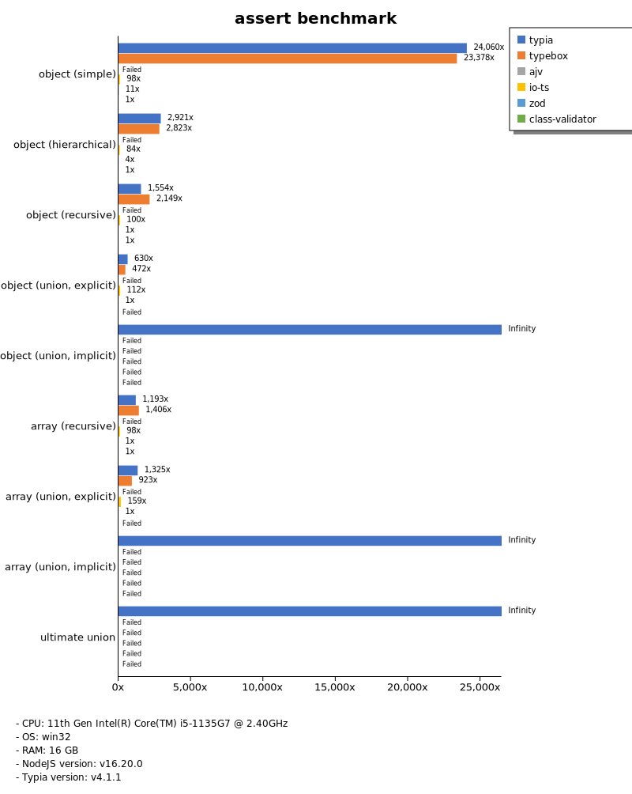
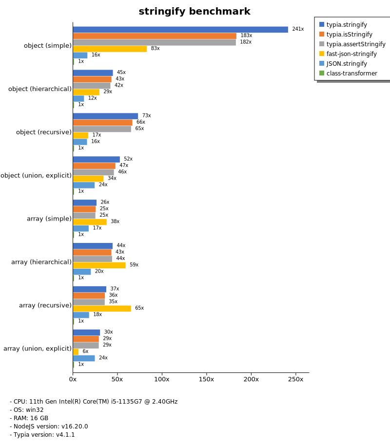

# Benchmark of `typia`
> - CPU: 11th Gen Intel(R) Core(TM) i5-1135G7 @ 2.40GHz
> - Memory: 16,218 MB
> - OS: win32
> - NodeJS version: v16.20.0
> - Typia version: v3.8.6

## is

 Types | typia | typebox | ajv | io-ts | zod | class-validator 
-------|------|------|------|------|------|------
 object (simple) | 79,259 | 84,742 | 4,379 | 318 | 40 | 3.29 
 object (hierarchical) | 15,063 | 17,528 | 2,904 | 527 | 26 | 6.78 
 object (recursive) | 8,863 | 11,193 | 3,589 | 468 | 5.02 | 6.06 
 object (union, explicit) | 1,512 | 1,202 | 432 | 237 | 2.21 |  -  
 object (union, implicit) | 1,341 |  -  |  -  |  -  |  -  |  -  
 array (recursive) | 5,954 | 7,147 | 1,869 | 474 | 5.36 | 4.96 
 array (union, explicit) | 1,648 | 1,134 | 411 | 189 | 1.11 |  -  
 array (union, implicit) | 1,881 |  -  |  -  |  -  |  -  |  -  
 ultimate union | 549 |  -  |  -  |  -  |  -  |  -  

> Unit: Megabytes/sec

## assert

 Types | typia | typebox | io-ts | zod | class-validator 
-------|------|------|------|------|------
 object (simple) | 80,122 | 79,377 | 344 | 39 | 3.11 
 object (hierarchical) | 12,519 | 18,731 | 532 | 27 | 4.98 
 object (recursive) | 10,019 | 12,222 | 567 | 5.74 | 6.89 
 object (union, explicit) | 1,402 | 181 | 270 | 2.41 |  -  
 object (union, implicit) | 1,313 |  -  |  -  |  -  |  -  
 array (recursive) | 5,902 | 7,898 | 602 | 7.54 | 6.26 
 array (union, explicit) | 1,874 | 1,334 | 236 | 1.40 |  -  
 array (union, implicit) | 2,034 |  -  |  -  |  -  |  -  
 ultimate union | 640 |  -  |  -  |  -  |  -  

> Unit: Megabytes/sec

## validate

 Types | typia | typebox | io-ts | zod | class-validator 
-------|------|------|------|------|------
 object (simple) | 108,249 | 110,077 | 410 | 47 | 3.94 
 object (hierarchical) | 10,480 | 21,656 | 632 | 31 | 7.54 
 object (recursive) | 8,343 | 12,287 | 552 | 5.81 | 6.82 
 object (union, explicit) | 1,542 | 1,389 | 338 | 2.91 |  -  
 object (union, implicit) | 1,278 |  -  |  -  |  -  |  -  
 array (recursive) | 6,863 | 8,597 | 591 | 5.68 | 6.22 
 array (union, explicit) | 1,874 | 1,311 | 231 | 1.38 |  -  
 array (union, implicit) | 2,086 |  -  |  -  |  -  |  -  
 ultimate union | 642 |  -  |  -  |  -  |  -  

> Unit: Megabytes/sec

## assert-error

 Types | typia | typebox | io-ts | zod | class-validator 
-------|------|------|------|------|------
 object (simple) | 416 | 21 | 88 | 44 | 2.71 
 object (hierarchical) | 1,763 | 47 | 154 | 29 | 5.58 
 object (recursive) | 1,416 | 35 | 117 | 5.30 | 4.81 
 object (union, explicit) | 393 | 13 | 72 | 2.86 |  -  
 object (union, implicit) | 302 |  -  |  -  |  -  |  -  
 array (recursive) | 1,007 | 37 | 108 | 7.35 | 3.73 
 array (union, explicit) | 735 | 9.48 | 37 | 1.09 |  -  
 array (union, implicit) | 782 |  -  |  -  |  -  |  -  
 ultimate union | 205 |  -  |  -  |  -  |  -  

> Unit: Megabytes/sec

## validate-error

 Types | typia | typebox | io-ts | zod | class-validator 
-------|------|------|------|------|------
 object (simple) | 922 | 22 | 106 | 45 | 2.85 
 object (hierarchical) | 1,586 | 49 | 162 | 30 | 5.60 
 object (recursive) | 1,377 | 35 | 108 | 5.44 | 4.76 
 object (union, explicit) | 338 | 13 | 68 | 2.85 |  -  
 object (union, implicit) | 254 |  -  |  -  |  -  |  -  
 array (recursive) | 811 | 37 | 113 | 6.82 | 3.78 
 array (union, explicit) | 635 | 9.69 | 38 | 1.07 |  -  
 array (union, implicit) | 579 |  -  |  -  |  -  |  -  
 ultimate union | 153 |  -  |  -  |  -  |  -  

> Unit: Megabytes/sec

## optimizer

 Types | typia | typebox | ajv | class-validator 
-------|------|------|------|------
 object (simple) | 109,143 | 4.75 | 0.07 | 4.05 
 object (hierarchical) | 20,281 | 8.70 | 0.34 | 8.14 
 object (recursive) | 12,162 | 49 | 0.71 | 6.86 
 object (union, explicit) | 1,796 | 9.75 | 0.38 | 6.12 
 array (simple) | 8,384 | 76 | 1.77 | 14 
 array (hierarchical) | 19,885 | 1,190 | 12 | 12 
 array (recursive) | 9,734 | 530 | 6.96 | 5.38 
 array (union, explicit) | 4,153 | 104 | 2.59 | 15 

> Unit: Megabytes/sec

## stringify

 Types | typia.stringify | typia.isStringify | typia.assertStringify | fast-json-stringify | JSON.stringify | class-transformer 
-------|------|------|------|------|------|------
 object (simple) | 838 | 632 | 513 | 303 | 63 | 3.78 
 object (hierarchical) | 388 | 365 | 360 | 266 | 105 | 8.48 
 object (recursive) | 506 | 484 | 459 | 109 | 110 | 7.03 
 object (union, explicit) | 162 | 141 | 141 | 102 | 74 | 2.91 
 array (simple) | 204 | 195 | 192 | 284 | 134 | 7.53 
 array (hierarchical) | 273 | 270 | 276 | 375 | 124 | 6.06 
 array (recursive) | 227 | 228 | 230 | 112 | 114 | 6.66 
 array (union, explicit) | 191 | 179 | 183 | 135 | 150 | 6.16 

> Unit: Megabytes/sec

## server

 Types | fastify-class-transformer | fastify-pure | fastify-typia | express-typia | express-pure | express-class-transformer 
-------|------|------|------|------|------|------
 object (simple) | 3.23 | 69 | 79 | 41 | 28 | 2.85 
 object (hierarchical) | 5.66 | 90 | 111 | 88 | 60 | 6.41 
 object (recursive) | 5.53 | 62 | 116 | 99 | 64 | 5.58 
 object (union, explicit) | 2.46 | 46 | 81 | 69 | 46 | 2.34 
 array (simple) | 4.30 | 75 | 68 | 73 | 56 | 4.57 
 array (hierarchical) | 3.67 | 38 | 85 | 90 | 55 | 3.67 
 array (recursive) | 4.51 | 54 | 85 | 83 | 53 | 4.08 
 array (union, explicit) | 2.90 | 59 | 73 | 58 | 66 | 3.66 

> Unit: Megabytes/sec

Total elapsed time: 2,494,210 ms
