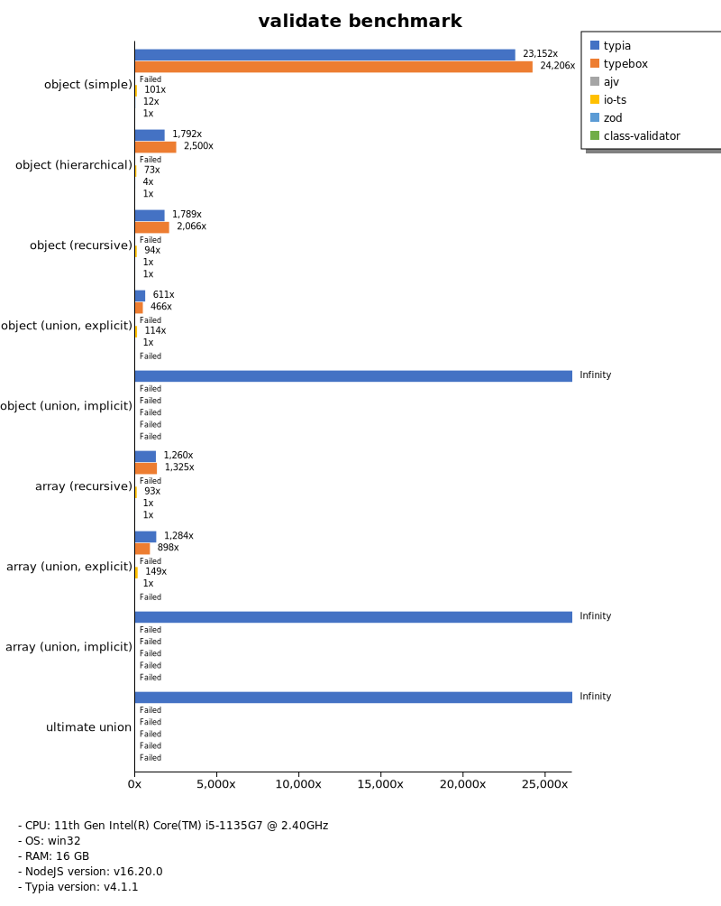
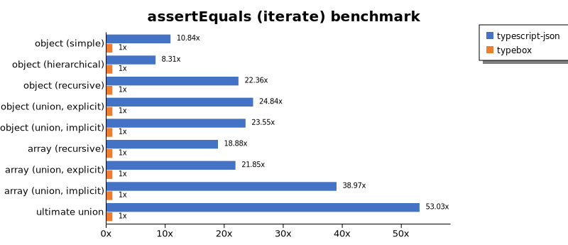

# Benchmark of `typescript-json`
> - CPU: 11th Gen Intel(R) Core(TM) i5-1135G7 @ 2.40GHz
> - Memory: 16,167 MB
> - OS: win32
> - TypeScript-JSON version: 3.3.20

## is

 Components | typescript-json | typebox | ajv | io-ts | zod | class-validator 
------------|-----------------|---------|-----|-------|-----|-----------------
object (simple) | 750976.1049227453 | 1497696.178937558 | 490154.2325581395 | 38331.62330524001 | 3235.4874041621033 | 130.2250803858521
object (hierarchical) | 115385.78404774822 | 163728.60010950902 | 36772.40014393667 | 8612.180085933122 | 356.6278424847477 | 43.12762973352034
object (recursive) | 72719.33701657459 | 76482.7397260274 | 34568.936409679234 | 5592.64816204051 | 60.7919687674289 | 27.870680044593087
object (union, explicit) | 15148.127445500279 | 11027.131072410633 | 6538.362227960162 | 2829.5955882352937 | 29.768467475192942 | 81.94317140238314
object (union, implicit) | 17034.733893557423 | Failed | Failed | Failed | Failed | Failed
array (recursive) | 6144 | 5790.632580705355 | 1891.9372900335948 | 497.7628635346756 | 8.181818181818182 | 2.233389168062535
array (union, explicit) | 3628.9707750952984 | 1847.9649571089615 | 710.8874656907594 | 340.13230429988977 | 2.7917364600781687 | 33.8282277767337
array (union, implicit) | 1107.7610273590174 | Failed | Failed | Failed | Failed | Failed
ultimate union | 543.8628488053985 | Failed | Failed | Failed | Failed | Failed

## assertType (iterate)

 Components | typescript-json | typebox | io-ts | zod | class-validator 
------------|-----------------|---------|-------|-----|-----------------
object (simple) | 153864.84462748037 | 2860.1411589895984 | 14663.783377209478 | 3075.7575757575755 | 132.66998341625208
object (hierarchical) | 46371.39689578714 | 673.3789026417883 | 2904.403866809882 | 352.43243243243245 | 45.68527918781726
object (recursive) | 35749.535143175905 | 276.60753880266077 | 1458.2549830763446 | 69.33483652762119 | 26.800071466857244
object (union, explicit) | 5622.9872293170465 | 114.84854116335252 | 949.8047964305633 | 32.42320819112628 | 87.48343116833934
object (union, implicit) | 5570.477247502775 | Failed | Failed | Failed | Failed
array (recursive) | 1981.6007359705613 | 29.00473933649289 | 128.90625 | 8.419083255378858 | Failed
array (union, explicit) | 1978.248745119911 | 14.364640883977902 | 69.96426556328757 | 2.7507793874931226 | 33.21448677050103
array (union, implicit) | 933.956969130028 | Failed | Failed | Failed | Failed
ultimate union | 226.59107534747622 | Failed | Failed | Failed | Failed

## assertType (throw)

 Components | typescript-json | typebox | io-ts | zod | class-validator 
------------|-----------------|---------|-------|-----|-----------------
object (simple) | 39318.60036832413 | 2728.6413248024087 | 9261.009261009262 | Failed | 148.58841010401187
object (hierarchical) | 25598.9679321784 | 731.9819819819819 | 3251.4177693761817 | 413.76716193342105 | 54.8847420417124
object (recursive) | 3716.7159763313607 | Failed | Failed | Failed | 74.21150278293136
object (union, explicit) | 4872.129923464625 | 112.9305477131564 | 939.1435011269723 | 36.25815808556926 | 92.54118082546734
object (union, implicit) | 3579.996309282156 | Failed | Failed | Failed | Failed
array (recursive) | 1362.1503814021069 | 35.61887800534283 | 130.01485884101038 | 16.00256040966555 | 10.521885521885523
array (union, explicit) | 420.1680672268908 | 17.403411068569437 | 55.00550055005501 | 11.303266644060134 | 35.951824555096174
array (union, implicit) | 163.1321370309951 | Failed | Failed | Failed | Failed
ultimate union | 236.4496180429247 | Failed | Failed | Failed | Failed

## validate

 Components | typescript-json | typebox | io-ts | zod | class-validator 
------------|-----------------|---------|-------|-----|-----------------
object (simple) | 63556.79124886052 | 2467.804072647221 | 11017.375231053604 | 3025.2053771471246 | 130.57973698833115
object (hierarchical) | 25096.14309670207 | 687.1223564954682 | 2921.1107024641415 | 363.19064680369604 | 39.65485588397283
object (recursive) | 16379.297317718172 | 231.23620309050773 | 1050.130548302872 | 27.722413480703025 | 13.385686239514548
object (union, explicit) | 3318.2939725061688 | 121.08367121267969 | 784.6667904213848 | 31.490159325210875 | 89.16478555304741
object (union, implicit) | 3416.8329403228736 | 111.40285071267817 | 232.30826231937755 | 16.58374792703151 | Failed
array (recursive) | 1145.4038997214484 | 29.180695847362514 | 170.10596765197994 | 8.872458410351202 | 2.183406113537118
array (union, explicit) | 1439.6567137493294 | 18.289303528542398 | 58.617511520737324 | 2.144388849177984 | 31.079299303070258
array (union, implicit) | 889.6477354421279 | 9.873834339001645 | 46.40633842671194 | 1.6187050359712232 | Failed
ultimate union | 146.53784219001608 | Failed | Failed | Failed | Failed

## equals

 Components | typescript-json | typebox 
------------|-----------------|---------
object (simple) | 19474.030470914127 | 49112.28581844696
object (hierarchical) | 6734.571272528673 | 12599.448529411766
object (recursive) | 5068.870014771048 | 8815.368004318876
object (union, explicit) | 2285.139092240117 | 2624.377650746819
object (union, implicit) | 1484.3721440321697 | 1951.2511584800745
array (recursive) | 399.3488876831254 | 866.304347826087
array (union, explicit) | 601.2045993794488 | 573.8938865430513
array (union, implicit) | 380.065717415115 | 364.9167733674776
ultimate union | 232.35709244883554 | 164.2212189616253

## assertEquals (iterate)

 Components | typescript-json | typebox 
------------|-----------------|---------
object (simple) | 18135.92579379237 | 1672.5168035847648
object (hierarchical) | 4669.389978213508 | 561.8354784555121
object (recursive) | 5190.83687419176 | 232.171581769437
object (union, explicit) | 2008.4699945936204 | 80.86858854361662
object (union, implicit) | 1500.8124210146236 | 63.721804511278194
array (recursive) | 455.74563034585344 | 24.134705332086064
array (union, explicit) | 314.568345323741 | 14.399113900683036
array (union, implicit) | 219.52544828835354 | 5.633802816901408
ultimate union | 175.31432619089782 | 3.3057851239669422

## assertEquals (throw)

 Components | typescript-json | typebox 
------------|-----------------|---------
object (simple) | 12752.890173410406 | 1901.4214509876315
object (hierarchical) | 5124.908155767818 | 555.864369093941
object (recursive) | 4370.274755670293 | 245.5610124669437
object (union, explicit) | 1863.354037267081 | 91.45783793671119
object (union, implicit) | 1388.888888888889 | 72.74049827241316
array (recursive) | 418.943533697632 | 35.12469265893923
array (union, explicit) | 179.05102954341987 | 16.412276382734287
array (union, implicit) | 89.8472596585804 | 13.819789939192924
ultimate union | 180.31013342949873 | 11.644154634373544

## validateEquals

 Components | typescript-json | typebox 
------------|-----------------|---------
object (simple) | 13076.04492726938 | 2106.0634155386615
object (hierarchical) | 5220.186847407951 | 579.9561883899233
object (recursive) | 3980.8743169398904 | 238.9231632080763
object (union, explicit) | 1298.2990152193374 | 90.123920390537
object (union, implicit) | 985.362370581935 | 73.48302096863982
array (recursive) | 296.92451071761417 | 24.076147816349387
array (union, explicit) | 285.7929515418502 | 13.556768970062134
array (union, implicit) | 188.92508143322476 | 5.560704355885079
ultimate union | 118.00793937206785 | 3.3039647577092506

## optimizer

 Components | typescript-json | typebox | ajv 
------------|-----------------|---------|-----
object (hierarchical) | 79523.07412790698 | 148.80408983019902 | 3.837719298245614
object (recursive) | 71965.09891750653 | 635.9069767441861 | 7.247723471473703
object (union) | 16764.596157433316 | 73.81564450973191 | 3.651634106262552
array (hierarchical) | 3281.7838518252115 | 756.1517113783533 | 5.466472303206997
array (recursive) | 6334.133727373476 | 574.2056074766356 | 7.672155688622754
array (union) | 3302.134646962233 | 190.38884812912693 | 5.083514887436456
ultimate union | 534.6027096301722 | 8.765652951699463 | 0.7218913553510197

## stringify

 Components | TSON.stringify() | TSON.assertStringify() | TSON.isStringify() | JSON.stringify() | fast-json-stringify 
------------|------------------|------------------------|--------------------|------------------|---------------------
object (simple) | 33172.261970280684 | 27740.262137714602 | 26091.072714182865 | 5611.277632071937 | 24232.704402515723
object (hierarchical) | 4234.692045250494 | 3998.331170035231 | 4159.681008902076 | 1427.1161326171514 | 3947.493596780095
object (recursive) | 4305.016477480776 | 4176.925912274235 | 4352.445502839349 | 1163.659793814433 | 1107.436472346786
object (union) | 1183.6698231195282 | 875.9323267236675 | 1050.293229074107 | 617.6955486352813 | 1160.9969074040387
array (hierarchical) | 58.984660336011686 | 51.727323111029 | 59.569773855488144 | 35.07109004739336 | 79.54336218007734
array (recursive) | 204.58784035807534 | 180.26146197753636 | 201.79037672510256 | 117.33382298934998 | 118.85477491052929
array (union) | 271.7029922423347 | 220.0729927007299 | 235.5417276720351 | 236.4449413079933 | 205.1938551572787

