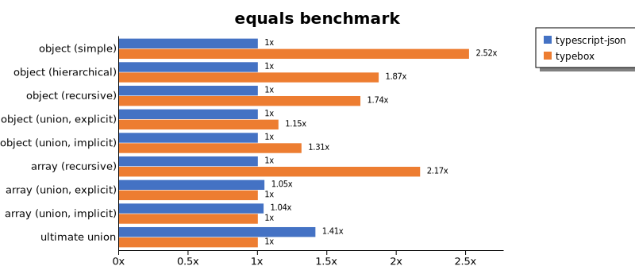

# Benchmark of `typescript-json`
> - CPU: 11th Gen Intel(R) Core(TM) i5-1135G7 @ 2.40GHz
> - Memory: 16,218 MB
> - OS: win32
> - TypeScript-JSON version: 3.3.23

## is

 Components | typescript-json | typebox | ajv | io-ts | zod | class-validator 
------------|-----------------|---------|-----|-------|-----|-----------------
object (simple) | 975613.7879911046 | 1607993.410214168 | 511319.13716814155 | 39591.08804581246 | 3597.8982300884954 | 136.72636992374532
object (hierarchical) | 169396.6460080204 | 197275.95936794585 | 45511.964385086256 | 9316.08339538347 | 418.03278688524586 | 48.5943027369205
object (recursive) | 94231.50357995226 | 84311.61116111612 | 41799.77565900168 | 5709.336791404225 | 74.17433676231727 | 29.260213470739785
object (union, explicit) | 23918.466120625468 | 12824.157303370786 | 7626.271970397779 | 3277.9836916234244 | 33.20631464344039 | 80.15695067264573
object (union, implicit) | 22128.214685054045 | Failed | Failed | Failed | Failed | Failed
array (recursive) | 6894.82660602615 | 6104.260089686099 | 2360.58313341945 | 506.0850028084628 | 9.456703133691823 | 2.7700831024930745
array (union, explicit) | 3916.3477310005464 | 1680.9815950920247 | 780.982508373651 | 351.3513513513513 | 2.8100412139378044 | 27.067669172932334
array (union, implicit) | 1916.8502202643172 | Failed | Failed | Failed | Failed | Failed
ultimate union | 569.2505510653931 | Failed | Failed | Failed | Failed | Failed

## assert (iterate)

 Components | typescript-json | typebox | io-ts | zod | class-validator 
------------|-----------------|---------|-------|-----|-----------------
object (simple) | 367487.05709564895 | 3399.852724594992 | 18130.72378138848 | 3355.095246902164 | 139.0984360625575
object (hierarchical) | 55240.84919472913 | 760.1611131453681 | 3490.7063197026023 | 361.6827535967948 | 47.33617969185076
object (recursive) | 42793.90581717451 | 331.96261682242994 | 1622.8329029878275 | 69.38388625592417 | 30.153612744168406
object (union, explicit) | 6675.218340611354 | 118.45018450184502 | 966.1853408883203 | 33.840947546531304 | 79.45516458569807
object (union, implicit) | 6251.55620651776 | Failed | Failed | Failed | Failed
array (recursive) | 2605.2056789224607 | 34.61753210496929 | 176.11447440836545 | 9.620826259196377 | Failed
array (union, explicit) | 2497.799779977998 | 18.4460592509782 | 82.15401580591802 | 2.8011204481792715 | 26.681489716509173
array (union, implicit) | 832.0568927789934 | Failed | Failed | Failed | Failed
ultimate union | 226.50559602060758 | Failed | Failed | Failed | Failed

## assert (throw)

 Components | typescript-json | typebox | io-ts | zod | class-validator 
------------|-----------------|---------|-------|-----|-----------------
object (simple) | 47577.17492984098 | 2866.5931642778387 | 10811.80811808118 | Failed | 148.14814814814815
object (hierarchical) | 29590.53685168335 | 813.6094674556211 | 3343.076360979174 | 417.9331306990881 | 54.92493592090809
object (recursive) | 4397.810218978102 | Failed | Failed | Failed | 73.03268212525104
object (union, explicit) | 5445.366029570861 | 132.15027373985276 | 1146.7889908256882 | 36.31082062454611 | 92.57544899092761
object (union, implicit) | 4406.409322651129 | Failed | Failed | Failed | Failed
array (recursive) | 1986.0242736300113 | 36.62332906061161 | 168.823860438942 | 16.548072149594574 | 11.10864252388358
array (union, explicit) | 481.7491198814156 | 17.91472590469366 | 74.34944237918216 | 12.166930283489478 | 36.081544290095614
array (union, implicit) | 181.88432157148054 | Failed | Failed | Failed | Failed
ultimate union | 269.59022286125094 | Failed | Failed | Failed | Failed

## validate

 Components | typescript-json | typebox | io-ts | zod | class-validator 
------------|-----------------|---------|-------|-----|-----------------
object (simple) | 82430.65693430656 | 2895.71325648415 | 13555.890101618366 | 3418.255878541011 | 140.23372287145241
object (hierarchical) | 33498.622589531675 | 826.9266829176822 | 3720.489977728285 | 412.4645892351275 | 47.126224357789695
object (recursive) | 24749.14933837429 | 331.73076923076917 | 1793.4359354719081 | 77.70845150311969 | 30.187962787165368
object (union, explicit) | 4922.178289000719 | 136.51622528907123 | 1199.8884343622165 | 34.90335897917058 | 78.45303867403315
object (union, implicit) | 4262.958280657396 | 130.5571187394485 | 306.693489392831 | 18.934471876740304 | Failed
array (recursive) | 1565.9613615455382 | 35.8974358974359 | 192.8693343447753 | 9.609949123798756 | 2.7793218454697053
array (union, explicit) | 1948.2604817127565 | 19.25254813137033 | 86.40813253012048 | 2.8021670091537456 | 27.0473328324568
array (union, implicit) | 1191.4316702819956 | 13.026241268642629 | 60.338345864661655 | 1.6657412548584123 | Failed
ultimate union | 194.35127978817297 | Failed | Failed | Failed | Failed

## equals

 Components | typescript-json | typebox 
------------|-----------------|---------
object (simple) | 27433.265268238356 | 65881.91138777006
object (hierarchical) | 8997.775305895439 | 18038.082607048123
object (recursive) | 7411.144020733062 | 11548.369264787176
object (union, explicit) | 3009.426987060998 | 3394.7368421052633
object (union, implicit) | 2027.311312050194 | 2378.2894736842104
array (recursive) | 605.1598429613011 | 1110.0055279159756
array (union, explicit) | 786.2748676765833 | 666.5444546287808
array (union, implicit) | 492.5041643531372 | 438.57090776522057
ultimate union | 335.8373030414071 | 205.73012939001848

## assertEquals (iterate)

 Components | typescript-json | typebox 
------------|-----------------|---------
object (simple) | 30731.912507010653 | 2508.0510827318158
object (hierarchical) | 7716.8174266199 | 702.2802500919456
object (recursive) | 6513.430127041743 | 295.5091480317871
object (union, explicit) | 2471.6221164408644 | 105.64561207378424
object (union, implicit) | 1901.524894359728 | 73.42851844984239
array (recursive) | 601.3131497355463 | 30.59490084985836
array (union, explicit) | 386.8493150684932 | 15.882019285309132
array (union, implicit) | 259.7308112040742 | 6.811731315042573
ultimate union | 210.3839913466739 | 3.95703787450537

## assertEquals (throw)

 Components | typescript-json | typebox 
------------|-----------------|---------
object (simple) | 15269.016697588127 | 2279.0439132851584
object (hierarchical) | 6382.196064005885 | 633.147113594041
object (recursive) | 5355.832721936904 | 281.1094452773613
object (union, explicit) | 2373.941847626058 | 110.03117549972492
object (union, implicit) | 1695.5399926280868 | 73.89617587289857
array (recursive) | 573.0129390018484 | 35.96475454055026
array (union, explicit) | 222.67582111709038 | 17.733640716439083
array (union, implicit) | 109.6892138939671 | 15.37042729787888
ultimate union | 216.02160216021602 | 13.280212483399733

## validateEquals

 Components | typescript-json | typebox 
------------|-----------------|---------
object (simple) | 16546.486486486487 | 2440.3323262839876
object (hierarchical) | 5881.296940831655 | 685.4398191749858
object (recursive) | 5084.679665738162 | 290.16120066703724
object (union, explicit) | 1629.3290043290044 | 105.80332151520807
object (union, implicit) | 1247.5728155339805 | 76.1994355597366
array (recursive) | 379.3988269794721 | 31.464530892448515
array (union, explicit) | 341.6545189504373 | 16
array (union, implicit) | 210.67565171129633 | 6.824644549763033
ultimate union | 142.29035166816954 | 3.974261922785768

## optimizer

 Components | typescript-json | typebox | ajv 
------------|-----------------|---------|-----
object (hierarchical) | 174638.31334060343 | 172.78694340961505 | 4.971460136254834
object (recursive) | 84207.19209986957 | 747.0123184408899 | 8.944870390653524
object (union) | 19530.39568345324 | 87.0909090909091 | 4.43213296398892
array (hierarchical) | 10074.114640379701 | 906.7475360121305 | 6.445672191528545
array (recursive) | 7268.907563025209 | 734.9308755760369 | 9.192866335723478
array (union) | 4170.709465621011 | 219.49900883041988 | 6.352765321375187
ultimate union | 611.1111111111111 | 11.08687749909124 | 0.90711175616836

## stringify

 Components | TSON.stringify() | TSON.assertStringify() | TSON.isStringify() | JSON.stringify() | fast-json-stringify 
------------|------------------|------------------------|--------------------|------------------|---------------------
object (simple) | 43373.57379462643 | 32668.280437511206 | 36622.10468721503 | 6106.634182908545 | 28613.824884792626
object (hierarchical) | 5120.515179392824 | 4427.522935779816 | 4773.321067157314 | 1532.9229621339302 | 4699.73544973545
object (recursive) | 5894.1509433962265 | 5079.480037140204 | 5345.853477129044 | 1241.7026064129006 | 1215.7445228369847
object (union) | 1458.2645386167676 | 1137.6864314296108 | 1325.6240822320117 | 649.5335650265229 | 1373.994147768837
array (hierarchical) | 97.83597017639572 | 88.74340789234407 | 97.32225300092335 | 47.75440591245025 | 134.1975534051488
array (recursive) | 270.98455239158756 | 232.26381461675578 | 254.36821776715098 | 115.10530137981118 | 119.24017302990407
array (union) | 322.964318389753 | 275.15437704322557 | 291.42962011378233 | 264.16469302240847 | 238.47435660062953

