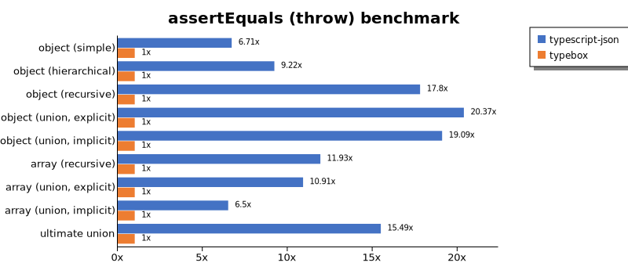

# Benchmark of `typescript-json`
> - CPU: 11th Gen Intel(R) Core(TM) i5-1135G7 @ 2.40GHz
> - Memory: 16,218 MB
> - OS: win32
> - TypeScript-JSON version: 3.3.22

## is

 Components | typescript-json | typebox | ajv | io-ts | zod | class-validator 
------------|-----------------|---------|-----|-------|-----|-----------------
object (simple) | 951172.6856095325 | 1622745.6400742116 | 509268.5629848541 | 40408.33333333333 | 3608.7842846553003 | 134.87957181088314
object (hierarchical) | 169882.62476894638 | 184544.1018286124 | 45188.46436443791 | 8871.342903870616 | 424.4868035190615 | 40.38772213247173
object (recursive) | 91871.80417044424 | 83679.83100661277 | 40742.58160237388 | 5290.009165902841 | 72.65668330560177 | 25.74402044915099
object (union, explicit) | 23871.23745819398 | 12310.11608623549 | 7546.770601336302 | 3208.947081287507 | 33.67684946632315 | 76.73772011121409
object (union, implicit) | 21064.044943820227 | Failed | Failed | Failed | Failed | Failed
array (recursive) | 6488.0382775119615 | 6094.825964252116 | 2320.1101928374655 | 467.741935483871 | 9.4848428491724 | 2.2442491116513934
array (union, explicit) | 4093.4997206183643 | 1947.9224376731302 | 832.3287671232878 | 348.19929091248366 | 2.7896596615212945 | 26.28571428571429
array (union, implicit) | 2151.623193844999 | Failed | Failed | Failed | Failed | Failed
ultimate union | 582.3720259552991 | Failed | Failed | Failed | Failed | Failed

## assertType (iterate)

 Components | typescript-json | typebox | io-ts | zod | class-validator 
------------|-----------------|---------|-------|-----|-----------------
object (simple) | 323881.77613321 | 3322.155030236394 | 16086.821422043502 | 3104.868228404099 | 109.19956537486418
object (hierarchical) | 49355.764026700344 | 744.89983458923 | 3201.639344262295 | 373.4188817598533 | 37.981651376146786
object (recursive) | 38713.936430317844 | 301.10497237569064 | 1667.594654788419 | 68.05708013172338 | 24.536532170119955
object (union, explicit) | 6484.987184181619 | 131.60350942691804 | 1042.297746582933 | 28.87819326175491 | 57.24150463383609
object (union, implicit) | 4932.313231323133 | Failed | Failed | Failed | Failed
array (recursive) | 2102.737226277372 | 28.745163073521283 | 154.13047495841803 | 8.474576271186441 | Failed
array (union, explicit) | 2225.172790105493 | 15.896217796455327 | 70.48293865373857 | 2.6790498303268437 | 22.657795360546665
array (union, implicit) | 1203.6727879799666 | Failed | Failed | Failed | Failed
ultimate union | 220.32718412808907 | Failed | Failed | Failed | Failed

## assertType (throw)

 Components | typescript-json | typebox | io-ts | zod | class-validator 
------------|-----------------|---------|-------|-----|-----------------
object (simple) | 31052.824651504034 | 2384.9450344699085 | 8520.667150108775 | Failed | 110.74197120708749
object (hierarchical) | 22842.546980478015 | 643.8557763061074 | 2637.4031722611585 | 315.0481838398814 | 35.91954022988506
object (recursive) | 3484.5735027223236 | Failed | Failed | Failed | 53.66726296958855
object (union, explicit) | 4858.372176407314 | 111.77347242921012 | 776.196636481242 | 33.62474781439139 | 73.03268212525104
object (union, implicit) | 3208.8469905728784 | Failed | Failed | Failed | Failed
array (recursive) | 1312.6271029765207 | 33.54579000335458 | 144.24810674359898 | 15.573898146706119 | 10.531858873091101
array (union, explicit) | 463.3920296570899 | 17.825311942959 | 72.04610951008647 | 11.596892032935175 | 35.341933203746244
array (union, implicit) | 181.58707100054477 | Failed | Failed | Failed | Failed
ultimate union | 271.6407098877218 | Failed | Failed | Failed | Failed

## validate

 Components | typescript-json | typebox | io-ts | zod | class-validator 
------------|-----------------|---------|-------|-----|-----------------
object (simple) | 80968.43885027239 | 3002.7834477639635 | 13134.317205305437 | 3325.1043746596474 | 123.5621521335807
object (hierarchical) | 33231.8107961726 | 801.3011152416357 | 3648.394241417497 | 374.16481069042317 | 39.394492066387016
object (recursive) | 22166.07376895712 | 315.64551422319477 | 1633.3520494104437 | 65.84964331443204 | 25.41436464088398
object (union, explicit) | 4596.826541651641 | 119.77401129943503 | 1032.157865887082 | 31.93916349809886 | 70.7070707070707
object (union, implicit) | 3723.4814143245694 | 116.59192825112106 | 283.8296268375424 | 17.527327553712777 | Failed
array (recursive) | 1241.5494244472866 | 30.43968432919955 | 159.60425611349635 | 7.837283075200597 | 2.1937842778793417
array (union, explicit) | 1692.4742826204656 | 16.341096919609317 | 70.45666356011182 | 2.7437351381013357 | 24.289211071361322
array (union, implicit) | 808.4991931145778 | 10.56142301278488 | 49.619771863117876 | 1.615218951902369 | Failed
ultimate union | 141.73228346456693 | Failed | Failed | Failed | Failed

## equals

 Components | typescript-json | typebox 
------------|-----------------|---------
object (simple) | 23237.07824838478 | 53944.03398596232
object (hierarchical) | 7148.188803512623 | 13823.39707536558
object (recursive) | 6020.6511627906975 | 9545.907999261039
object (union, explicit) | 2389.720468890893 | 2695.5418629938385
object (union, implicit) | 1958.959325760352 | 2094.926350245499
array (recursive) | 588.1578947368421 | 1070.884699057288
array (union, explicit) | 718.7337830825118 | 684.1121495327104
array (union, implicit) | 476.25951431678146 | 442.16315307057744
ultimate union | 335.4418604651163 | 203.15654248485964

## assertEquals (iterate)

 Components | typescript-json | typebox 
------------|-----------------|---------
object (simple) | 29798.490566037734 | 2481.253497481813
object (hierarchical) | 7315.703380588877 | 694.2841184137033
object (recursive) | 6617.352614015572 | 284.78904515173946
object (union, explicit) | 2450.4322236527496 | 103.15828817043543
object (union, implicit) | 1842.7382053654023 | 75.24225726771803
array (recursive) | 602.3511849225602 | 30.816054784097396
array (union, explicit) | 397.3032877724419 | 15.408027392048698
array (union, implicit) | 253.92192630426854 | 6.7924528301886795
ultimate union | 212.9580456718003 | 3.9562923888470234

## assertEquals (throw)

 Components | typescript-json | typebox 
------------|-----------------|---------
object (simple) | 15411.271201896772 | 2245.9499263622974
object (hierarchical) | 6136.7306657096715 | 637.6389141920204
object (recursive) | 5316.783994071879 | 280.688622754491
object (union, explicit) | 2286.336418072945 | 109.64912280701753
object (union, implicit) | 1645.8672454331704 | 73.26007326007326
array (recursive) | 556.1735261401557 | 35.60619547801318
array (union, explicit) | 221.48394241417498 | 17.765144785930005
array (union, implicit) | 109.2697140775815 | 15.188335358444716
ultimate union | 216.7238576846668 | 13.741926618111858

## validateEquals

 Components | typescript-json | typebox 
------------|-----------------|---------
object (simple) | 17575.76325154523 | 2397.0890091434967
object (hierarchical) | 6349.472151437933 | 672.9653882132835
object (recursive) | 4743.458371454712 | 282.4244657332351
object (union, explicit) | 1560.757496054708 | 104.48608745031233
object (union, implicit) | 1231.7408017572761 | 74.21289355322338
array (recursive) | 375.8253851797506 | 30.916030534351144
array (union, explicit) | 342.20116618075804 | 15.123226288274832
array (union, implicit) | 217.53705010585747 | 6.774557771923222
ultimate union | 140.625 | 3.9377461091318207

## optimizer

 Components | typescript-json | typebox | ajv 
------------|-----------------|---------|-----
object (hierarchical) | 149904.47154471546 | 171.96996782266714 | 4.747124338141318
object (recursive) | 78132.28739525762 | 727.7921120530777 | 8.895478131949593
object (union) | 20122.15435868962 | 87.44186046511628 | 4.398020890599231
array (hierarchical) | 6127.42740891437 | 913.6500754147812 | 6.238532110091743
array (recursive) | 7095.7368614479965 | 751.7292951953636 | 9.025603241849327
array (union) | 4222.036417688591 | 227.13220585561012 | 6.17399438727783
ultimate union | 597.5873244508462 | 11.039558417663294 | 0.9009009009009009

## stringify

 Components | TSON.stringify() | TSON.assertStringify() | TSON.isStringify() | JSON.stringify() | fast-json-stringify 
------------|------------------|------------------------|--------------------|------------------|---------------------
object (simple) | 40004.22716412424 | 32812.98413869421 | 34683.435141933165 | 6167.4613770741935 | 27549.862258953166
object (hierarchical) | 5097.877136952846 | 4302.411190870605 | 4589.135710285607 | 1512.263621044748 | 4307.637274190663
object (recursive) | 5182.15203819317 | 4964.198228754475 | 5096.684571216892 | 1207.7205882352941 | 1243.9947039909212
object (union) | 1440.1975128017557 | 1128.8800145216917 | 1340.716131413806 | 672.4202626641651 | 1346.9613259668508
array (hierarchical) | 248.0521833665519 | 218.72791519434628 | 247.16843259042747 | 119.25745359084942 | 336.94255826757205
array (recursive) | 260.1251840942562 | 235.01199040767386 | 247.30199378086704 | 124.4248113381189 | 125.512104283054
array (union) | 327.57035129667094 | 263.6895268474216 | 285.9242925395075 | 268.55976243504085 | 234.692012429172

