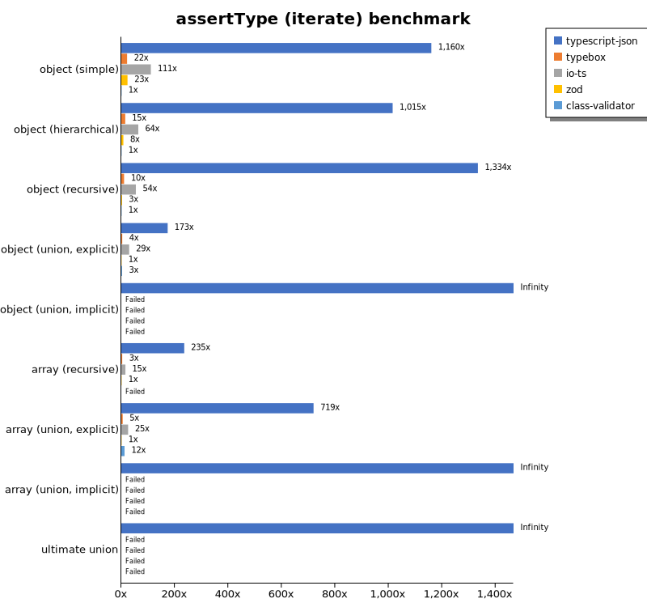

# Benchmark of `typescript-json`
> - CPU: 11th Gen Intel(R) Core(TM) i5-1135G7 @ 2.40GHz
> - Memory: 16,218 MB
> - TypeScript-JSON version: 3.3.20

## is

 Components | typescript-json | typebox | ajv | io-ts | zod | class-validator 
------------|-----------------|---------|-----|-------|-----|-----------------
object (simple) | 863321.9967087219 | 1526655.2486187846 | 505381.2556869881 | 40810.383327130636 | 3596.8126030408503 | 121.39659803043867
object (hierarchical) | 158994.4341372913 | 190132.20088626293 | 42366.59436008677 | 9156.650787834371 | 424.203821656051 | 48.607318405243035
object (recursive) | 88556.78059536935 | 83745.92117323556 | 39482.113373692904 | 5682.868231380522 | 75.66204287515762 | 29.79414951245937
object (union, explicit) | 19854.332900352572 | 12252.161118263748 | 6280.755951299292 | 3336.7233727810653 | 32.97911322828875 | 98.8007875425094
object (union, implicit) | 19733.944954128438 | Failed | Failed | Failed | Failed | Failed
array (recursive) | 6637.634611751369 | 5893.814997263273 | 2060.445580715851 | 524.8877245508982 | 8.938547486033519 | 2.76243093922652
array (union, explicit) | 3935.51333576909 | 1909.7452934662238 | 783.69384359401 | 358.1005586592179 | 2.766506824050166 | 35.15625
array (union, implicit) | 674.4397886682456 | Failed | Failed | Failed | Failed | Failed
ultimate union | 579.3437331898871 | Failed | Failed | Failed | Failed | Failed

## assertType (iterate)

 Components | typescript-json | typebox | io-ts | zod | class-validator 
------------|-----------------|---------|-------|-----|-----------------
object (simple) | 160373.87304507822 | 2940.021810250818 | 15225.248435774753 | 3131.3634745461013 | 142.77899343544857
object (hierarchical) | 47303.879310344826 | 675.4354136429608 | 3197.8993919292434 | 388.29303762952185 | 49.13507545086493
object (recursive) | 39575.454545454544 | 311.1556689755742 | 1622.6654578422485 | 73.64701506416218 | 31.309297912713475
object (union, explicit) | 6283.636363636364 | 124.63072378138847 | 1091.7014708552751 | 35.16732841747022 | 98.16531114053339
object (union, implicit) | 5200.540540540541 | Failed | Failed | Failed | Failed
array (recursive) | 2195.9374438252744 | 31.208624929071306 | 146.2341946124244 | 8.928571428571427 | Failed
array (union, explicit) | 2293.8620315046173 | 16.66358081836697 | 75.97807597807596 | 2.781383274615242 | 36.310287914909225
array (union, implicit) | 561.1945767680469 | Failed | Failed | Failed | Failed
ultimate union | 245.74121058354478 | Failed | Failed | Failed | Failed

## assertType (throw)

 Components | typescript-json | typebox | io-ts | zod | class-validator 
------------|-----------------|---------|-------|-----|-----------------
object (simple) | 45430.66241321073 | 2653.6846124474987 | 9973.504920514762 | Failed | 148.17558807186515
object (hierarchical) | 27890.17341040463 | 776.2211283604695 | 3268.8333646439974 | 416.98256254738436 | 55.69996286669142
object (recursive) | 4139.194139194139 | Failed | Failed | Failed | 74.89234225800412
object (union, explicit) | 5371.825324319387 | 130.15991074748976 | 1171.5797430083144 | 36.703982382088455 | 111.81513231457325
object (union, implicit) | 4179.5384335816825 | Failed | Failed | Failed | Failed
array (recursive) | 1712.9462675802379 | 36.37686431429611 | 148.50566177835532 | 16.056518946692357 | 11.432491139819367
array (union, explicit) | 467.46447270007485 | 18.050541516245488 | 74.03294466037387 | 11.72195522213105 | 36.60322108345534
array (union, implicit) | 183.35166850018337 | Failed | Failed | Failed | Failed
ultimate union | 273.8225629791895 | Failed | Failed | Failed | Failed

## validate

 Components | typescript-json | typebox | io-ts | zod | class-validator 
------------|-----------------|---------|-------|-----|-----------------
object (simple) | 61625.979231189645 | 2584.769316286826 | 11330.803406145871 | 3178.2560706401764 | 140.59080962800877
object (hierarchical) | 26435.916268821158 | 675.2727272727273 | 3054.769001490313 | 399.7760358342665 | 48.37822979659154
object (recursive) | 21561.183836084234 | 316.5630299604296 | 1597.1223021582732 | 74.84288706912969 | 30.93363329583802
object (union, explicit) | 4557.35056542811 | 124.23398328690809 | 1073.0129390018483 | 35.00188182160331 | 97.69484083424808
object (union, implicit) | 3953.924603897287 | 117.91843513563389 | 292.6411865373645 | 19.28895612708018 | Failed
array (recursive) | 1254.0758380655798 | 31.261630070710833 | 180.62678062678066 | 9.64447806354009 | 2.793816353138387
array (union, explicit) | 1668.3535152720042 | 19.23439562511786 | 82.98833270605945 | 2.810567734682406 | 36.86200378071833
array (union, implicit) | 1080.3474484256244 | 13.013956997359488 | 57.46254504077376 | 1.669449081803005 | Failed
ultimate union | 149.06184850590688 | Failed | Failed | Failed | Failed

## equals

 Components | typescript-json | typebox 
------------|-----------------|---------
object (simple) | 25117.906336088152 | 61969.18250599742
object (hierarchical) | 7724.513072468855 | 16042.699475303058
object (recursive) | 6592.317684171459 | 10341.351255748143
object (union, explicit) | 2675.779816513761 | 3178.998911860718
object (union, implicit) | 1843.7327443401437 | 2240.499357444465
array (recursive) | 529.2463442069742 | 1039.6532644780523
array (union, explicit) | 712.9848843562193 | 644.269498352252
array (union, implicit) | 306.3991323210412 | 427.0871308786001
ultimate union | 306.3013698630137 | 195.09536784741147

## assertEquals (iterate)

 Components | typescript-json | typebox 
------------|-----------------|---------
object (simple) | 19780.95069173466 | 2178.6681104493773
object (hierarchical) | 6814.533622559653 | 650.8493353028064
object (recursive) | 6212.148200926255 | 280.8370044052863
object (union, explicit) | 2390.320786204339 | 99.46583164487014
object (union, implicit) | 1824.376731301939 | 77.64034253092294
array (recursive) | 553.4613990576296 | 29.023255813953487
array (union, explicit) | 315.56195965417874 | 15.912104565258574
array (union, implicit) | 211.18932938125232 | 6.75295441755768
ultimate union | 205.36840208971356 | 3.9495956366372016

## assertEquals (throw)

 Components | typescript-json | typebox 
------------|-----------------|---------
object (simple) | 15438.85693078493 | 2243.829468960359
object (hierarchical) | 6175.771971496438 | 648.148148148148
object (recursive) | 5078.054907590167 | 281.3203300825206
object (union, explicit) | 2161.2786051580097 | 109.5690284879474
object (union, implicit) | 1564.2051655147325 | 73.20644216691068
array (recursive) | 387.45387453874537 | 36.40997633351538
array (union, explicit) | 219.6595277320154 | 17.664723547076488
array (union, implicit) | 107.0090957731407 | 15.339776039269825
ultimate union | 198.77123238164077 | 13.11647429171039

## validateEquals

 Components | typescript-json | typebox 
------------|-----------------|---------
object (simple) | 16251.778360164735 | 2263.7321990012947
object (hierarchical) | 5659.903897490657 | 644.0677966101696
object (recursive) | 4381.5862451469775 | 278.11207220759684
object (union, explicit) | 1395.3610964681075 | 100.58723243038455
object (union, implicit) | 1072.7529577962212 | 76.76269901440486
array (recursive) | 322.38966630785796 | 28.726999624483668
array (union, explicit) | 307.73333333333335 | 15.945330296127565
array (union, implicit) | 173.41356673960613 | 6.1902082160945415
ultimate union | 126.89460697920337 | 3.9585296889726673

## optimizer

 Components | typescript-json | typebox | ajv 
------------|-----------------|---------|-----
object (hierarchical) | 100169.00913562895 | 168.16708678429958 | 4.66786355475763
object (recursive) | 83076.55590233156 | 730.776391733383 | 8.671586715867159
object (union) | 18936.19744058501 | 85.73554026408779 | 4.283054003724395
array (hierarchical) | 5648.175451529672 | 867.5833490299491 | 5.907328779767399
array (recursive) | 7213.432835820895 | 739.0423572744015 | 8.882309400444116
array (union) | 3977.777777777778 | 221.03910409399668 | 5.911694069831886
ultimate union | 543.3935529578463 | 10.33210332103321 | 0.9206407659731173

## stringify

 Components | TSON.stringify() | TSON.assertStringify() | TSON.isStringify() | JSON.stringify() | fast-json-stringify 
------------|------------------|------------------------|--------------------|------------------|---------------------
object (simple) | 32803.65875747147 | 26183.897529734677 | 28343.648208469058 | 6182.650142993327 | 23706.855791962178
object (hierarchical) | 4592.481765475967 | 3889.167412712623 | 4078.406403492814 | 1502.0139143171 | 4019.9928596929667
object (recursive) | 4561.4730878186965 | 4121.212121212121 | 4253.014283064366 | 1255.787476280835 | 1218.8021509363991
object (union) | 1265.5661223757402 | 983.7954627295642 | 1180.3972048547262 | 653.0019952838745 | 1182.3114487249052
array (hierarchical) | 100.93223377554679 | 90.4332129963899 | 100.09115770282588 | 56.788753237143915 | 131.77317731773178
array (recursive) | 214.86854034451497 | 225.06015176753658 | 244.65691788526436 | 126.83284457478005 | 130.59067748631816
array (union) | 303.0794165316045 | 259.56135580931664 | 278.9589442815249 | 272.2660653889515 | 230.25843503230436

