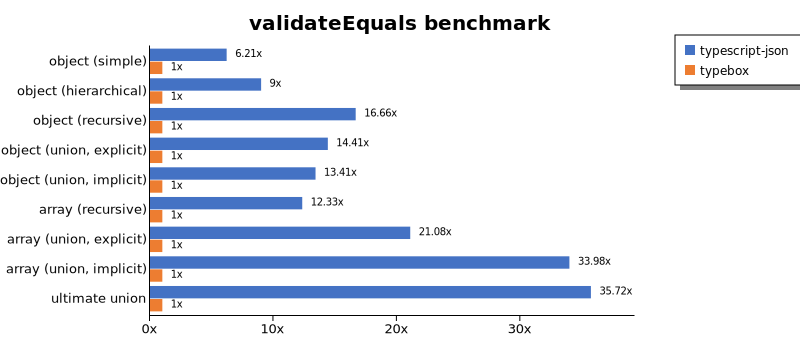

# Benchmark of `typescript-json`
> - CPU: 11th Gen Intel(R) Core(TM) i5-1135G7 @ 2.40GHz
> - Memory: 16,218 MB
> - OS: win32
> - TypeScript-JSON version: 3.3.31

## is

 Components | typescript-json | typebox | ajv | io-ts | zod | class-validator 
------------|-----------------|---------|-----|-------|-----|-----------------
object (simple) | 252060.81699945047 | 129052.79048490393 | 64642.30486008836 | 4949.097938144329 | 454.52885317750184 | 16.536118363794603
object (hierarchical) | 169052.9074159796 | 163691.90378862686 | 37238.5580152074 | 7674.017567452185 | 359.4355373164763 | 36.03858119549081
object (recursive) | 112502.23046018367 | 92636.63744312039 | 43587.167997771176 | 5951.945794613858 | 77.6724041889483 | 29.011871185500276
object (union, explicit) | 24188.438604240284 | 13100.76132899113 | 7838.648150498431 | 3399.30434454055 | 34.818507445848375 | 79.96963814571376
object (union, implicit) | 29549.205337982832 | Failed | Failed | Failed | Failed | Failed
array (recursive) | 83039.66412582903 | 64075.65592117408 | 25282.84326244428 | 5390.477594339623 | 98.6971369760479 | 24.265619249171877
array (union, explicit) | 26268.782164138676 | 13011.227657845868 | 5558.188229793834 | 2429.4154371334307 | 20.165203327171906 | 180.45281198309135
array (union, implicit) | 10596.030586345007 | Failed | Failed | Failed | Failed | Failed
ultimate union | 8428.678553334563 | Failed | Failed | Failed | Failed | Failed

 Unit: kilobytes/sec 

## assert (iterate)

 Components | typescript-json | typebox | io-ts | zod | class-validator 
------------|-----------------|---------|-------|-----|-----------------
object (simple) | 22840.821742313325 | 426.2867647058823 | 2223.4953064605193 | 413.786064235166 | 14.938370846730976
object (hierarchical) | 47131.79403177621 | 653.7901016649732 | 2957.719362278067 | 341.300988123053 | 34.64893330689031
object (recursive) | 46356.38965349741 | 348.022615652725 | 1885.5173187977443 | 80.9303235908142 | 27.706575045620436
object (union, explicit) | 7099.279778312466 | 135.49764700864424 | 1205.1484446938307 | 36.21956063362313 | 78.16644941456275
object (union, implicit) | 9050.643829528442 | Failed | Failed | Failed | Failed
array (recursive) | 28262.80520928637 | 380.28791449934977 | 1903.683128823693 | 105.17122505621136 | Failed
array (union, explicit) | 16819.068150327093 | 124.19306329434517 | 531.0295545937842 | 19.116430225486525 | 180.87909387361083
array (union, implicit) | 12230.553946292257 | Failed | Failed | Failed | Failed
ultimate union | 3355.1462768950305 | Failed | Failed | Failed | Failed

 Unit: kilobytes/sec 

## assert (throw)

 Components | typescript-json | typebox | io-ts | zod | class-validator 
------------|-----------------|---------|-------|-----|-----------------
object (simple) | 5804.456536380248 | 354.8109879032258 | 1347.1299862347703 | Failed | 16.341644389708627
object (hierarchical) | 25428.844030426244 | 704.264138590034 | 2785.044548060589 | 353.33251953124994 | 45.65675054962312
object (recursive) | 6385.185963589982 | Failed | Failed | Failed | 104.384684320074
object (union, explicit) | 6073.660511621573 | 136.1456014654053 | 1127.0182774277243 | 38.07246278140886 | 97.17475671918443
object (union, implicit) | 6256.035078940266 | Failed | Failed | Failed | Failed
array (recursive) | 22388.111255787036 | 400.45645267808345 | 1827.0178443618397 | 179.90714263791128 | 114.2822849511282
array (union, explicit) | 3141.255075105815 | 121.79507726097039 | 494.5912373234336 | 78.53499000747641 | 244.0254478645461
array (union, implicit) | 1606.9196532026324 | Failed | Failed | Failed | Failed
ultimate union | 3377.010862459069 | Failed | Failed | Failed | Failed

 Unit: kilobytes/sec 

## validate

 Components | typescript-json | typebox | io-ts | zod | class-validator 
------------|-----------------|---------|-------|-----|-----------------
object (simple) | 9110.797047280881 | 357.45614035087715 | 1582.9367301231805 | 413.4354663774403 | 15.236090775988288
object (hierarchical) | 28273.360267776166 | 700.7236168032787 | 2970.1640752585736 | 334.37824697325624 | 35.497697910940076
object (recursive) | 23799.97240385954 | 355.7206432799443 | 1809.4080904309078 | 79.31773150723025 | 28.789438378978538
object (union, explicit) | 5172.522369926498 | 140.15219373368754 | 1217.6927971117425 | 35.197774850801935 | 78.66640567953633
object (union, implicit) | 6024.045385948403 | 178.60512485891647 | 416.26996050824175 | 26.784144712169507 | Failed
array (recursive) | 16262.337155126483 | 390.7369379940712 | 1859.2739515369417 | 106.2569278143968 | 24.44974842329809
array (union, explicit) | 13705.971837370007 | 126.98164180246798 | 536.113632583058 | 19.028139265418297 | 181.4194346780163
array (union, implicit) | 7099.762001894285 | 106.80597891846612 | 491.7985692061098 | 14.246218932083032 | Failed
ultimate union | 2575.7929939155333 | Failed | Failed | Failed | Failed

 Unit: kilobytes/sec 

## equals

 Components | typescript-json | typebox 
------------|-----------------|---------
object (simple) | 3308.853118712274 | 8239.288375558866
object (hierarchical) | 7582.115557553957 | 13764.096336177512
object (recursive) | 7950.176652070064 | 12534.383549031987
object (union, explicit) | 3132.3641764473923 | 3296.266377478754
object (union, implicit) | 2726.744265018759 | 3226.6823052715727
array (recursive) | 6297.391458181154 | 11850.639099695516
array (union, explicit) | 5304.899630370095 | 4592.645704475169
array (union, implicit) | 3357.2791342043574 | 3834.2615857466694
ultimate union | 3994.135989136388 | Failed

 Unit: kilobytes/sec 

## assertEquals (iterate)

 Components | typescript-json | typebox 
------------|-----------------|---------
object (simple) | 3642.5593830734456 | 310.533665813451
object (hierarchical) | 6290.232467444384 | 591.4559341197314
object (recursive) | 7157.10360246219 | 319.668209606222
object (union, explicit) | 2531.9601139316983 | 107.84863408099831
object (union, implicit) | 2606.8325700431037 | 103.25641725832877
array (recursive) | 6505.6066261307 | 348.71408520475563
array (union, explicit) | 2690.8873106932424 | 102.23513048814375
array (union, implicit) | 2221.5112591069465 | 57.86867683946488
ultimate union | 2752.3521159390443 | Failed

 Unit: kilobytes/sec 

## assertEquals (throw)

 Components | typescript-json | typebox 
------------|-----------------|---------
object (simple) | 1901.3566774103138 | 282.23325748100797
object (hierarchical) | 5190.125500765214 | 550.6360975482464
object (recursive) | 5740.448014793305 | 299.2608769290832
object (union, explicit) | 2377.118147631675 | 114.91676468572994
object (union, implicit) | 2295.0643233387354 | 103.53168981904588
array (recursive) | 5922.422876416496 | 395.44036645683457
array (union, explicit) | 1515.1781996113273 | 118.97610470439484
array (union, implicit) | 939.4538306087428 | 131.35364970071223
ultimate union | 2825.09291395009 | Failed

 Unit: kilobytes/sec 

## validateEquals

 Components | typescript-json | typebox 
------------|-----------------|---------
object (simple) | 2186.826708766716 | 296.4067702552719
object (hierarchical) | 5038.790786666816 | 580.3226335837415
object (recursive) | 5210.3567465477045 | 318.34335085306725
object (union, explicit) | 1637.1163431269676 | 110.9473680290753
object (union, implicit) | 1753.6905653260674 | 106.47158366187385
array (recursive) | 4052.17728156946 | 349.75768083696266
array (union, explicit) | 2348.6605598477863 | 103.47886674859551
array (union, implicit) | 1942.1634832730558 | 58.383783594624866
ultimate union | 1812.080683075221 | Failed

 Unit: kilobytes/sec 

## optimizer

 Components | typescript-json | typebox | ajv 
------------|-----------------|---------|-----
object (hierarchical) | 155242.63794528093 | 145.87632334469765 | 4.022277227722772
object (recursive) | 113104.73061723317 | 807.4996484814399 | 9.621530314097882
object (union) | 17243.8232421875 | 119.95433681133296 | 5.857068019716518
array (hierarchical) | 138943.74388203426 | 33291.67798755114 | 242.5418583549103
array (recursive) | 84275.3409476108 | 8222.87587115168 | 100.2972304433612
array (union) | 27933.006495226484 | 1574.7244698660713 | 40.372345380029806
ultimate union | 8182.197900585724 | 157.88577879029236 | 10.304381652534728

 Unit: kilobytes/sec 

## stringify

 Components | TSON.stringify() | TSON.assertStringify() | TSON.isStringify() | fast-json-stringify | JSON.stringify 
------------|------------------|------------------------|--------------------|---------------------|----------------
object (simple) | 4912.406589673913 | 4092.4719030531132 | 4580.825546021404 | 3349.415083235718 | 761.4094166353913
object (hierarchical) | 4153.623371390958 | 3586.773027215536 | 3858.4923133913685 | 3801.2183434014873 | 1256.157862756678
object (recursive) | 5547.729888949079 | 5286.303340819764 | 5510.876645639057 | 1332.6766304347827 | 1301.6363030692887
object (union) | 2020.1398350201503 | 1572.5278795693089 | 1840.2630388519665 | 1616.1082714279266 | 938.2144508569019
array (hierarchical) | 3109.0258302172365 | 2897.12338000725 | 3113.175332158351 | 4296.631633557173 | 1554.654088415768
array (recursive) | 2814.1338641826924 | 2543.2653250160756 | 2736.58852958573 | 1390.1332354925005 | 1418.0899332727781
array (union) | 2094.746149713467 | 1845.364010989011 | 1969.3734131302137 | 1609.9755173688102 | 1831.4948694029852

 Unit: kilobytes/sec 

