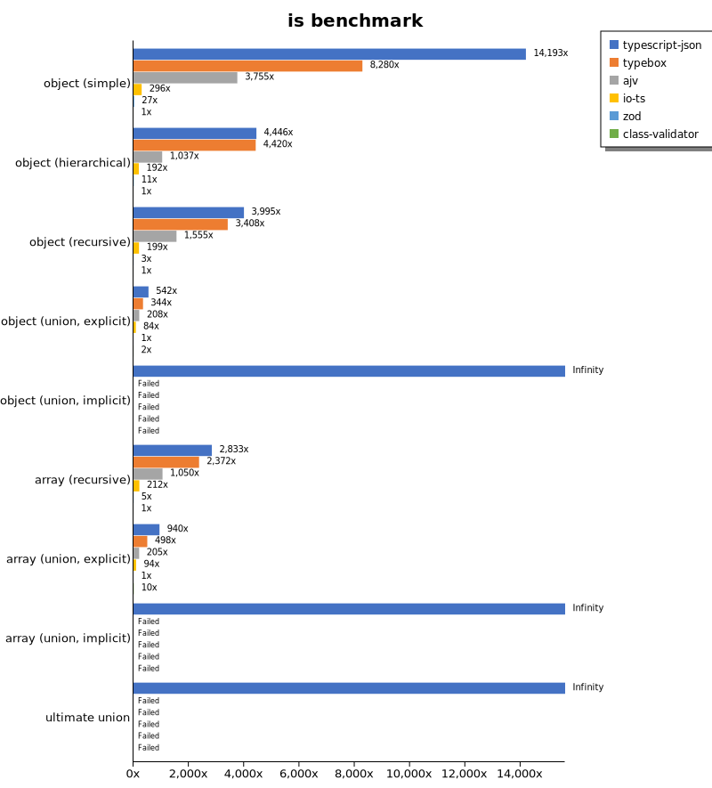
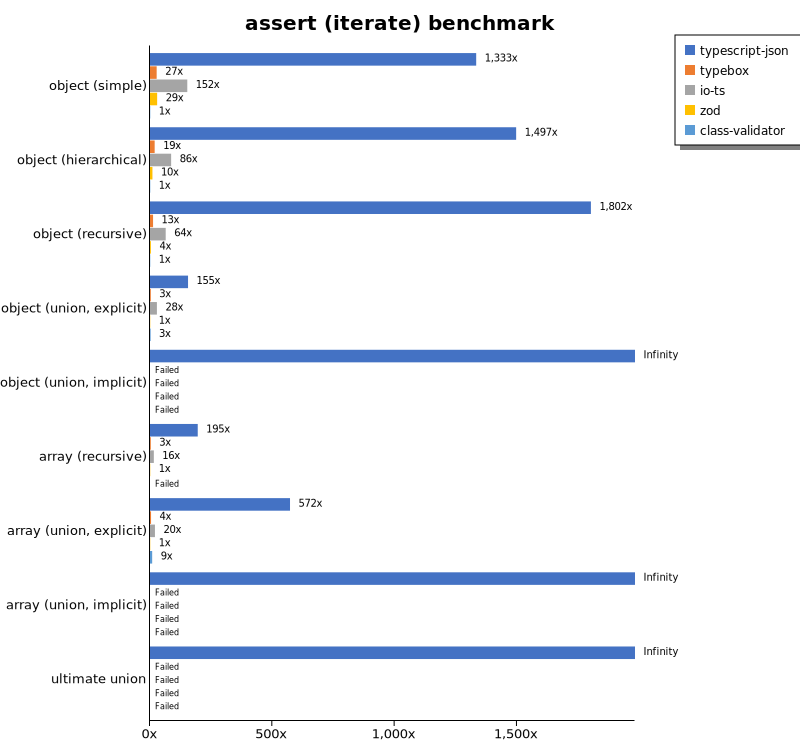
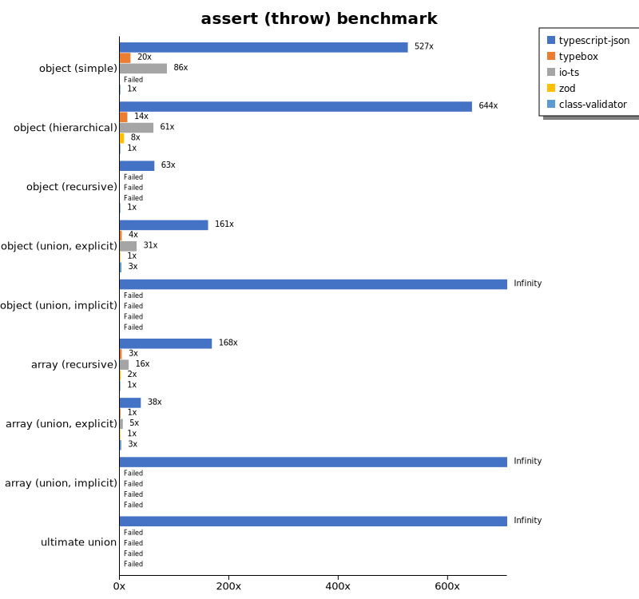
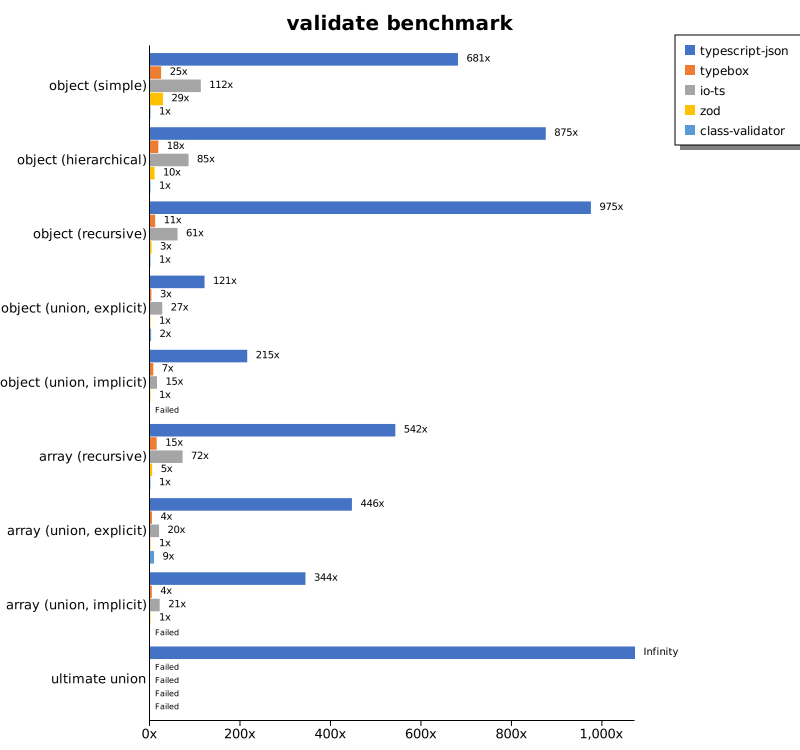
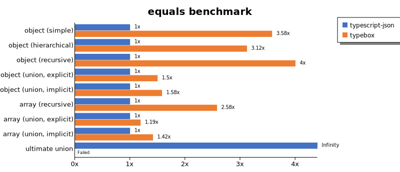
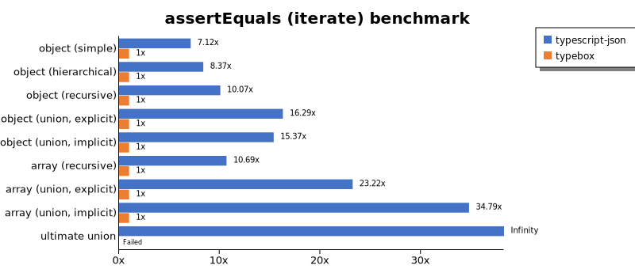
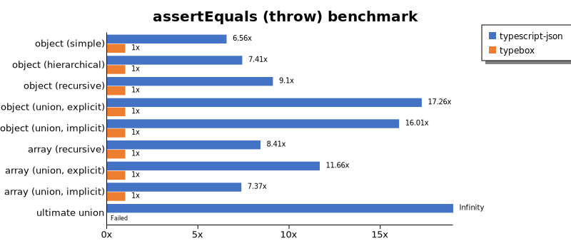
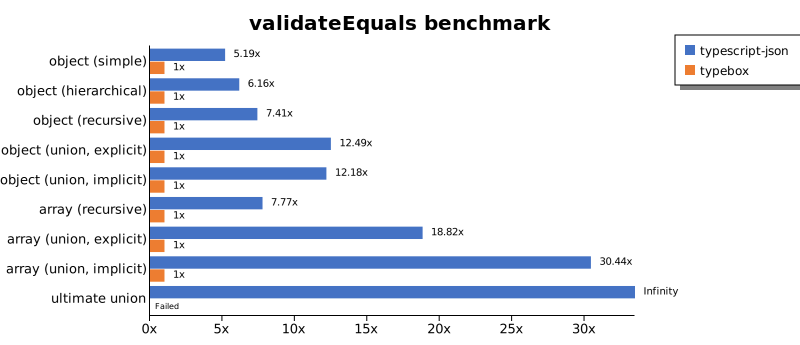
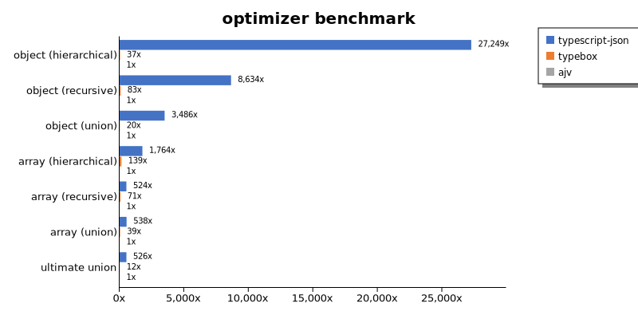
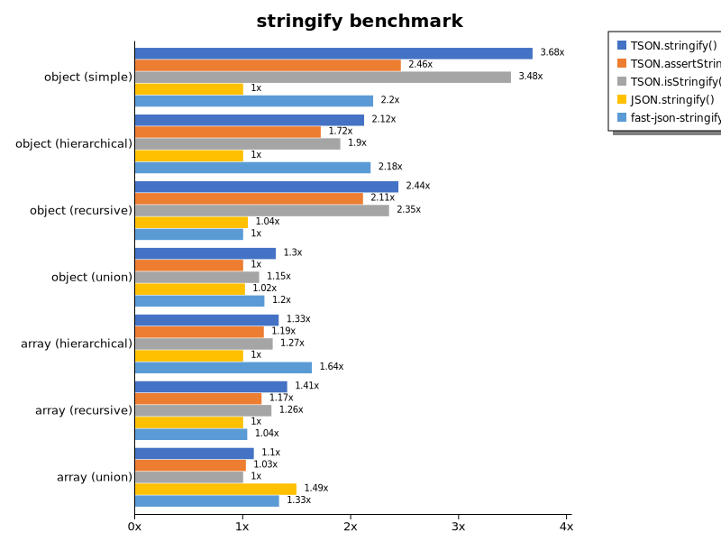

# Benchmark of `typescript-json`
> - CPU: 11th Gen Intel(R) Core(TM) i7-11390H @ 3.40GHz
> - Memory: 15,741 MB
> - OS: linux
> - TypeScript-JSON version: 3.3.29

## is

 Components | typescript-json | typebox | ajv | io-ts | zod | class-validator 
------------|-----------------|---------|-----|-------|-----|-----------------
object (simple) | 1979027.906117169 | 1154496.880733945 | 523600.1500375094 | 41206.01894854171 | 3745.9489662879496 | 139.43661971830986
object (hierarchical) | 191874.2233101111 | 190781.72955407115 | 44749.727569923714 | 8285.814606741573 | 474.97259773474605 | 43.16020482809071
object (recursive) | 106118.8785046729 | 90530.65816613538 | 41316.91176470588 | 5285.1316277345195 | 89.93653671804171 | 26.563364692861093
object (union, explicit) | 20444.781783681217 | 12982.017792920687 | 7847.492133999631 | 3178.710035113658 | 37.70164944716331 | 93.47181008902076
object (union, implicit) | 17186.609950064732 | Failed | Failed | Failed | Failed | Failed
array (recursive) | 6315.906562847608 | 5286.9946954454 | 2339.9061032863847 | 471.889400921659 | 11.24859392575928 | 2.229240200631618
array (union, explicit) | 3493.43339587242 | 1851.5479298769117 | 760.050477735713 | 348.5045513654096 | 3.714710252600297 | 35.81871345029239
array (union, implicit) | 1026.9472129937246 | Failed | Failed | Failed | Failed | Failed
ultimate union | 521.4814814814814 | Failed | Failed | Failed | Failed | Failed

## assert (iterate)

 Components | typescript-json | typebox | io-ts | zod | class-validator 
------------|-----------------|---------|-------|-----|-----------------
object (simple) | 160123.84573601306 | 3263.9734366353073 | 18307.32815754592 | 3505.465510742555 | 120.08854454897619
object (hierarchical) | 60933.99339933993 | 774.749721913237 | 3516.81148469966 | 405.94059405940595 | 40.71153493489822
object (recursive) | 46248.09797736129 | 321.48837209302326 | 1645.35410251766 | 91.7901938426454 | 25.66009669021941
object (union, explicit) | 5863.286969253294 | 124.00811957925816 | 1064.6221248630886 | 37.711069418386494 | 94.56221198156682
object (union, implicit) | 5805.8954393770855 | Failed | Failed | Failed | Failed
array (recursive) | 1971.412864211105 | 32.8054298642534 | 158.09839690436706 | 10.102899906454631 | Failed
array (union, explicit) | 2232.391782831988 | 16.709988860007428 | 78.71231857089691 | 3.9004457652303115 | 34.65982028241335
array (union, implicit) | 1160.520607375271 | Failed | Failed | Failed | Failed
ultimate union | 246.53090646963415 | Failed | Failed | Failed | Failed

## assert (throw)

 Components | typescript-json | typebox | io-ts | zod | class-validator 
------------|-----------------|---------|-------|-----|-----------------
object (simple) | 67944.18604651163 | 2523.9498894620488 | 11109.008327024982 | Failed | 129.00847769996312
object (hierarchical) | 34572.90132547864 | 741.0151908114117 | 3299.0083905415718 | 415.25103812759534 | 53.686471009305656
object (recursive) | 4701.728303289351 | Failed | Failed | Failed | 74.36326454731363
object (union, explicit) | 5940.033943051103 | 129.58163643095148 | 1131.2217194570135 | 36.8052999631947 | 111.89854531891086
object (union, implicit) | 4601.899196493791 | Failed | Failed | Failed | Failed
array (recursive) | 1767.7707480461481 | 36.44314868804665 | 170.00377786173027 | 16.995241332426918 | 10.501995379122032
array (union, explicit) | 516.5098690278546 | 17.608733932030283 | 73.47538574577517 | 13.44628210299852 | 36.41660597232338
array (union, implicit) | 181.62005085361423 | Failed | Failed | Failed | Failed
ultimate union | 259.54764553207264 | Failed | Failed | Failed | Failed

## validate

 Components | typescript-json | typebox | io-ts | zod | class-validator 
------------|-----------------|---------|-------|-----|-----------------
object (simple) | 77551.14670549691 | 2801.711580480699 | 12794.651034988094 | 3252.555287121353 | 113.9240506329114
object (hierarchical) | 34835.598824393834 | 732.8792341678939 | 3392.3954372623575 | 399.10233393177737 | 39.82300884955752
object (recursive) | 25111.152347374278 | 293.23308270676694 | 1567.6392572944296 | 86.32687605792741 | 25.765496639283047
object (union, explicit) | 4471.698113207548 | 112.61094674556213 | 1005.9782608695652 | 37.079292641186534 | 91.48737137511694
object (union, implicit) | 3844.638949671773 | 128.47483095416982 | 275.91973244147164 | 17.89042117033172 | Failed
array (recursive) | 1209.0666666666666 | 32.89224952741021 | 160.582560998676 | 10.559466469062617 | 2.229654403567447
array (union, explicit) | 1744.3804569942413 | 16.806722689075627 | 78.17220543806646 | 3.9084310441094354 | 34.94926719278467
array (union, implicit) | 956.9439355075119 | 11.185682326621924 | 59.59137343927355 | 2.784481158344162 | Failed
ultimate union | 156.55853314527505 | Failed | Failed | Failed | Failed

## equals

 Components | typescript-json | typebox 
------------|-----------------|---------
object (simple) | 16004.503659223119 | 57272.52747252747
object (hierarchical) | 4838.937395504366 | 15112.64534883721
object (recursive) | 2493.754592211609 | 9981.32894014278
object (union, explicit) | 1972.784111805811 | 2960.0147411092685
object (union, implicit) | 1262.8894151940244 | 1996.0367501351107
array (recursive) | 321.34831460674155 | 828.7769784172663
array (union, explicit) | 470.960929250264 | 560.8639941424126
array (union, implicit) | 264.3739924771628 | 374.427550833486
ultimate union | 190.0568702990277 | Failed

## assertEquals (iterate)

 Components | typescript-json | typebox 
------------|-----------------|---------
object (simple) | 15164.292321924142 | 2129.4444444444443
object (hierarchical) | 4542.949756888169 | 542.4884792626729
object (recursive) | 2718.5606756012485 | 270.0500092609742
object (union, explicit) | 1453.4062830921284 | 89.23980903415351
object (union, implicit) | 1068.9970717423132 | 69.54391255182813
array (recursive) | 290.1246047982146 | 27.151828592537868
array (union, explicit) | 342.11495946941784 | 14.730878186968837
array (union, implicit) | 216.87408491947292 | 6.23347185493011
ultimate union | 158.22673909234274 | Failed

## assertEquals (throw)

 Components | typescript-json | typebox 
------------|-----------------|---------
object (simple) | 13625.866050808316 | 2078.6516853932585
object (hierarchical) | 4409.0403853278995 | 594.685002787586
object (recursive) | 2592.3295454545455 | 285.0085502565077
object (union, explicit) | 1611.3921678845795 | 93.37068160597572
object (union, implicit) | 1177.1197351480596 | 73.5023888276369
array (recursive) | 297.6190476190476 | 35.37318712415989
array (union, explicit) | 203.66598778004072 | 17.461148943600488
array (union, implicit) | 108.75475802066339 | 14.764506127270044
ultimate union | 165.19823788546256 | Failed

## validateEquals

 Components | typescript-json | typebox 
------------|-----------------|---------
object (simple) | 11888.43633787852 | 2292.4153584263286
object (hierarchical) | 3744.244154917009 | 607.5877689694224
object (recursive) | 2223.2049947970863 | 299.88683515654475
object (union, explicit) | 1214.2595978062157 | 97.23546234509055
object (union, implicit) | 882.0403825717322 | 72.42549981139193
array (recursive) | 215.74605451936873 | 27.772529756281884
array (union, explicit) | 287.4219446922391 | 15.271493212669682
array (union, implicit) | 188.81875563570784 | 6.203007518796992
ultimate union | 112.16429699842021 | Failed

## optimizer

 Components | typescript-json | typebox | ajv 
------------|-----------------|---------|-----
object (hierarchical) | 142589.66734807656 | 192.12880143112702 | 5.23276795380729
object (recursive) | 82854.51162790698 | 792.2660190547357 | 9.596233930834693
object (union) | 16173.694598959266 | 91.0617652547117 | 4.63907960660605
array (hierarchical) | 12412.862687118833 | 979.6992481203007 | 7.035734123310498
array (recursive) | 5671.232876712329 | 765.3211009174312 | 10.833022039596564
array (union) | 3492.0281794586576 | 253.17638266068758 | 6.488691138301816
ultimate union | 477.16814159292034 | 10.60662448827689 | 0.9066183136899366

## stringify

 Components | TSON.stringify() | TSON.assertStringify() | TSON.isStringify() | JSON.stringify() | fast-json-stringify 
------------|------------------|------------------------|--------------------|------------------|---------------------
object (simple) | 42662.25285688373 | 28519.402985074626 | 40344.526901669764 | 11590.02086890533 | 25549.604270200627
object (hierarchical) | 5393.0959696367245 | 4371.54950312845 | 4832.589285714285 | 2543.136892665804 | 5546.384086261387
object (recursive) | 5390.169247389269 | 4665.433697059368 | 5199.06191369606 | 2308.8946780796427 | 2210.8345534407026
object (union) | 1422.9351032448376 | 1092.6159956670879 | 1254.7713359740726 | 1111.3186402689578 | 1308.1532594879245
array (hierarchical) | 125.29637060003648 | 112.31687466087901 | 120.0577721610399 | 94.24949476391697 | 154.2524130395192
array (recursive) | 263.4529147982063 | 219.02284971205648 | 236.13165680473372 | 187.09209572153733 | 194.2459571267394
array (union) | 293.17055909412596 | 273.5343073793231 | 266.7740203972088 | 398.4674329501916 | 355.5434188967777

