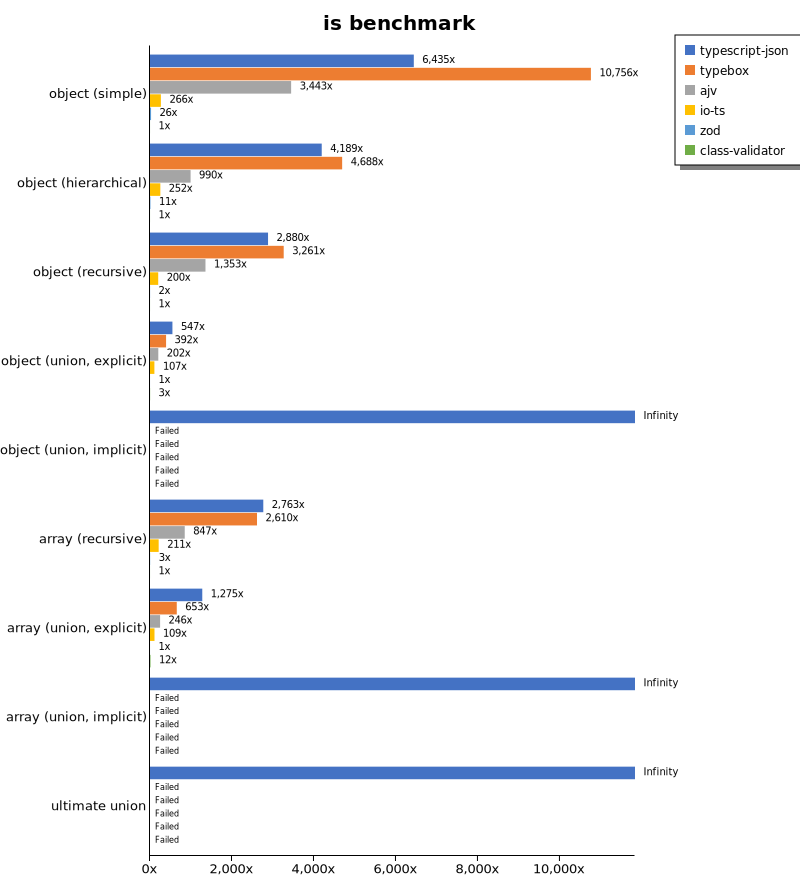
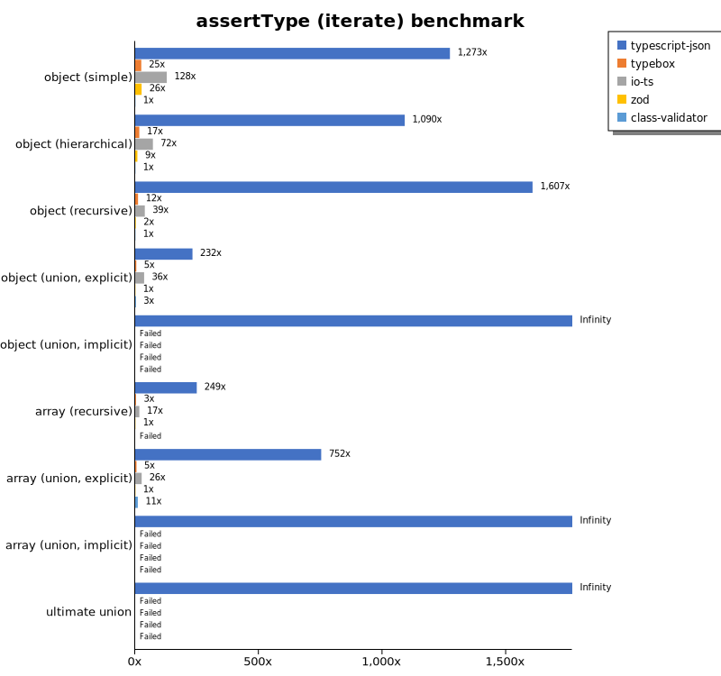
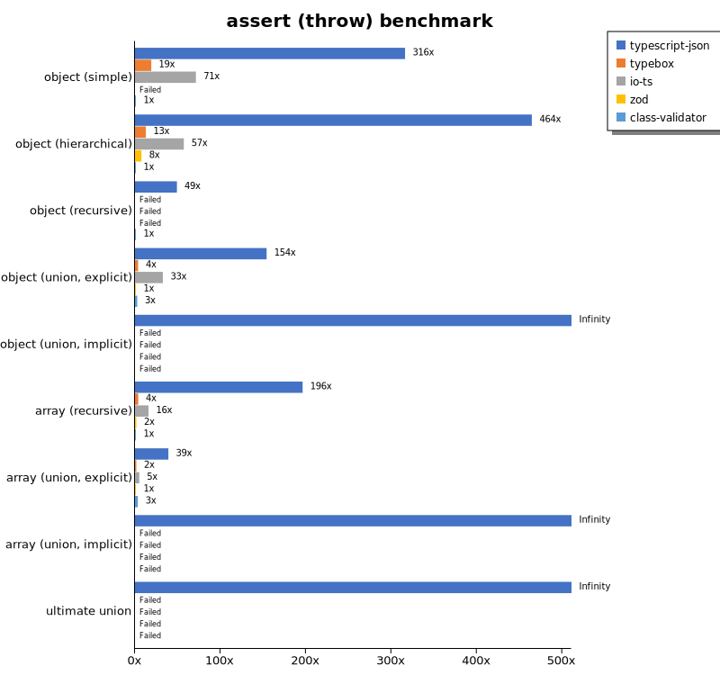
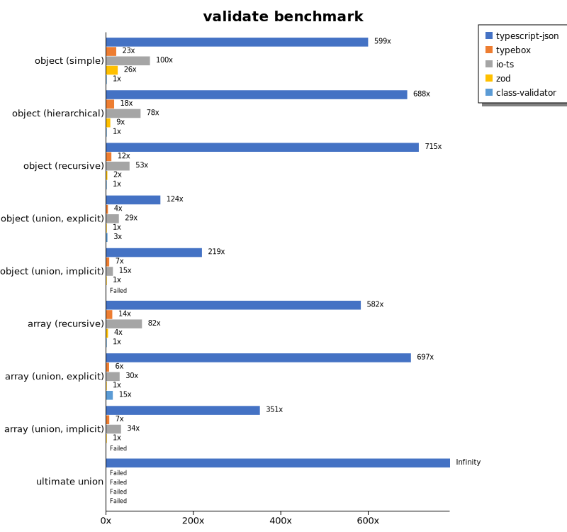
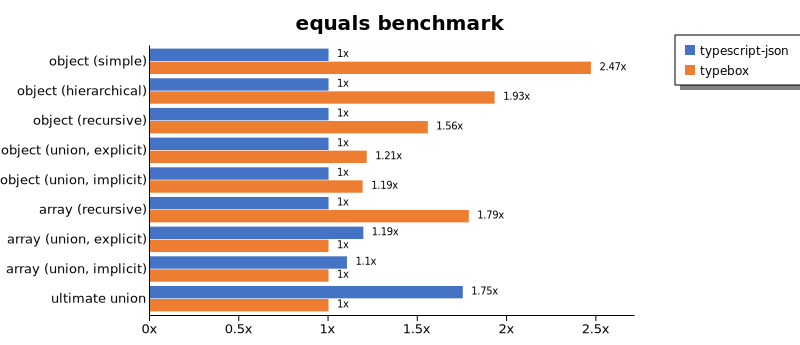
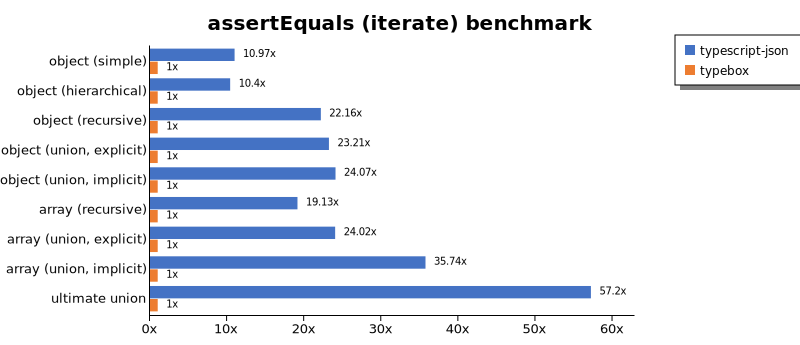
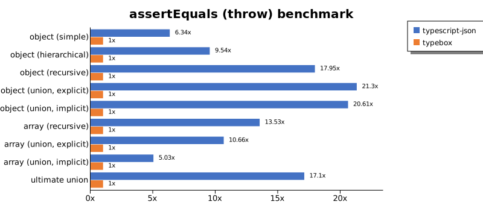
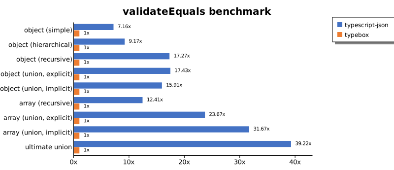
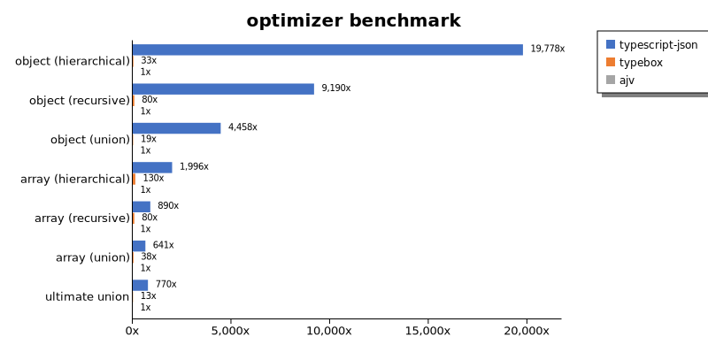
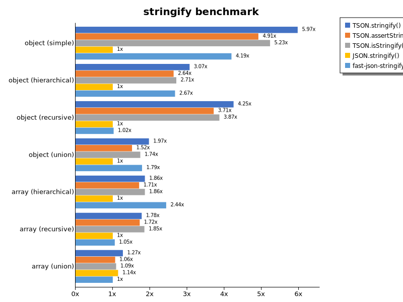

# Benchmark of `typescript-json`
> - CPU: 11th Gen Intel(R) Core(TM) i7-1165G7 @ 2.80GHz
> - Memory: 16,064 MB
> - OS: win32
> - TypeScript-JSON version: 3.3.21

## is

 Components | typescript-json | typebox | ajv | io-ts | zod | class-validator 
------------|-----------------|---------|-----|-------|-----|-----------------
object (simple) | 837758.7783467448 | 1400209.9755842343 | 448210.67106710677 | 34587.394650054965 | 3351.4440433212994 | 130.18372703412075
object (hierarchical) | 150285.68827385287 | 168169.98386229156 | 35505.42888165038 | 9041.84489492282 | 377.81438769906646 | 35.87606450443921
object (recursive) | 76363.28767123289 | 86489.2324682496 | 35889.68166849616 | 5307.562394445487 | 61.371175820125316 | 26.51871356027835
object (union, explicit) | 16367.47326955543 | 11731.739457831325 | 6058.064516129032 | 3204.746136865342 | 29.919857524487973 | 82.23624887285844
object (union, implicit) | 16660.47548291233 | Failed | Failed | Failed | Failed | Failed
array (recursive) | 6107.065609228551 | 5768.539325842697 | 1872.3209379007146 | 467.0170351576658 | 7.317073170731707 | 2.2099447513812156
array (union, explicit) | 3503.1227038941956 | 1793.6596218020022 | 676.0101929377503 | 300.8234217749314 | 2.7472527472527473 | 32.384142936906755
array (union, implicit) | 1403.6944045911048 | Failed | Failed | Failed | Failed | Failed
ultimate union | 517.7916360968452 | Failed | Failed | Failed | Failed | Failed

## assertType (iterate)

 Components | typescript-json | typebox | io-ts | zod | class-validator 
------------|-----------------|---------|-------|-----|-----------------
object (simple) | 142282.26249313564 | 2754.1254125412543 | 14287.76575904513 | 2905.1661849710986 | 111.78414096916299
object (hierarchical) | 43172.24199288256 | 658.3106267029973 | 2837.9417689067936 | 353.42616342982774 | 39.603960396039604
object (recursive) | 38928.479735925175 | 279.5268425841674 | 941.340782122905 | 58.94346617238183 | 24.224628372178383
object (union, explicit) | 5990.422135509046 | 120.60301507537687 | 933.0038440417352 | 25.85278276481149 | 81.20051555882894
object (union, implicit) | 4995.259799453053 | Failed | Failed | Failed | Failed
array (recursive) | 2226.809651474531 | 29.564894012644107 | 150.02727768685216 | 8.941877794336811 | Failed
array (union, explicit) | 2074.3006993006993 | 14.980580728685037 | 72.19402143260011 | 2.7573529411764706 | 29.244068420084602
array (union, implicit) | 644.8137326515705 | Failed | Failed | Failed | Failed
ultimate union | 221.44772117962466 | Failed | Failed | Failed | Failed

## assertType (throw)

 Components | typescript-json | typebox | io-ts | zod | class-validator 
------------|-----------------|---------|-------|-----|-----------------
object (simple) | 40980.8963997061 | 2472.373103577449 | 9243.384271338056 | Failed | 129.653639562882
object (hierarchical) | 25041.551246537394 | 686.5837817776953 | 3080.9693781702044 | 406.4289673009422 | 53.91804457225018
object (recursive) | 3546.099290780142 | Failed | Failed | Failed | 72.25433526011561
object (union, explicit) | 5390.984360625575 | 127.55102040816327 | 1140.3347434246828 | 34.99562554680665 | 92.06407659731173
object (union, implicit) | 3669.0515501742802 | Failed | Failed | Failed | Failed
array (recursive) | 1835.5359765051394 | 35.637918745545264 | 147.76505356483193 | 15.003750937734434 | 9.356287425149699
array (union, explicit) | 420.47531992687385 | 17.105713308244955 | 54.229934924078094 | 10.760787689658883 | 35.59985760056959
array (union, implicit) | 161.03059581320449 | Failed | Failed | Failed | Failed
ultimate union | 237.48629886737302 | Failed | Failed | Failed | Failed

## validate

 Components | typescript-json | typebox | io-ts | zod | class-validator 
------------|-----------------|---------|-------|-----|-----------------
object (simple) | 69636.29656953155 | 2646.16497829233 | 11612.150398221893 | 3045.7848837209303 | 116.25761210555453
object (hierarchical) | 27440.773863843766 | 712.7252867285636 | 3124.0352811466373 | 366.07142857142856 | 39.85778443113772
object (recursive) | 18493.46405228758 | 299.609447647387 | 1375.6662378239296 | 62.663185378590086 | 25.866916588566077
object (union, explicit) | 4065.405405405406 | 122.56371814092954 | 943.6698271054099 | 32.854984894259815 | 87.96821793416574
object (union, implicit) | 3802.491755221693 | 116.45616641901933 | 262.0664342081116 | 17.38317757009346 | Failed
array (recursive) | 1239.9709566164456 | 29.126213592233015 | 173.72802960222015 | 8.353443475032487 | 2.129547471162378
array (union, explicit) | 1531.3966077228438 | 14.0607424071991 | 66.92693809258228 | 2.1973997436366965 | 32.65080243497509
array (union, implicit) | 579.8730734360835 | 11.273957158962796 | 55.587067498581966 | 1.6504676324958738 | Failed
ultimate union | 153.72340425531917 | Failed | Failed | Failed | Failed

## equals

 Components | typescript-json | typebox 
------------|-----------------|---------
object (simple) | 24743.01369863014 | 61103.193649621564
object (hierarchical) | 7848.9660265878865 | 15151.426481346014
object (recursive) | 6449.97266265719 | 10036.589762076424
object (union, explicit) | 2441.5862808145766 | 2963.908939478068
object (union, implicit) | 1713.0403196512893 | 2040.147913365029
array (recursive) | 512.4515771997786 | 915.0826079232547
array (union, explicit) | 712.5550660792951 | 596.333572969087
array (union, implicit) | 440.87747458533977 | 399.7087732071351
ultimate union | 309.72117558402414 | 176.78958785249458

## assertEquals (iterate)

 Components | typescript-json | typebox 
------------|-----------------|---------
object (simple) | 25036.923631123922 | 2282.0324005891016
object (hierarchical) | 6490.929081913139 | 624.2742086533058
object (recursive) | 5759.978327614232 | 259.8942184935255
object (union, explicit) | 2162.6134301270417 | 93.17118802619271
object (union, implicit) | 1689.3577981651374 | 70.19842755522276
array (recursive) | 503.06859205776175 | 26.29615814994405
array (union, explicit) | 337.9604911906033 | 14.071294559099437
array (union, implicit) | 218.1915654038599 | 6.105457909343201
ultimate union | 186.1351819757366 | 3.254384378954981

## assertEquals (throw)

 Components | typescript-json | typebox 
------------|-----------------|---------
object (simple) | 13252.569750367107 | 2090.909090909091
object (hierarchical) | 5496.676845697862 | 576.3153002416806
object (recursive) | 4615.10060919328 | 257.0694087403599
object (union, explicit) | 1948.288419519301 | 91.45783793671119
object (union, implicit) | 1467.3913043478262 | 71.21239095602635
array (recursive) | 474.19296005836225 | 35.044681969511124
array (union, explicit) | 179.72681524083393 | 16.863406408094438
array (union, implicit) | 70.24938531787846 | 13.962580284836637
ultimate union | 193.90093424995592 | 11.337868480725623

## validateEquals

 Components | typescript-json | typebox 
------------|-----------------|---------
object (simple) | 15471.811713191024 | 2160.7941334287248
object (hierarchical) | 5942.380866098931 | 647.8178368121443
object (recursive) | 4470.147891181303 | 258.8235294117647
object (union, explicit) | 1457.0513960519297 | 83.58635470619753
object (union, implicit) | 972.2859664607237 | 61.12334801762114
array (recursive) | 340.85862324204294 | 27.47150065408335
array (union, explicit) | 300.59256599030346 | 12.697828487302171
array (union, implicit) | 191.48936170212767 | 6.0472787245739426
ultimate union | 129.26111784045682 | 3.2954961552544857

## optimizer

 Components | typescript-json | typebox | ajv 
------------|-----------------|---------|-----
object (hierarchical) | 91826.8500090465 | 151.14784205693294 | 4.642857142857143
object (recursive) | 75452.46800731262 | 657.4264843603671 | 8.210180623973727
object (union) | 18187.63440860215 | 77.6483638380477 | 4.079362136102355
array (hierarchical) | 11391.233472197066 | 744.0147329650092 | 5.707972749033327
array (recursive) | 7109.475620975161 | 637.3606287698775 | 7.989594946116686
array (union) | 3630.75793723619 | 214.16526138279934 | 5.664169559656496
ultimate union | 541.9916560856158 | 9.295408068414204 | 0.7036059806508356

## stringify

 Components | TSON.stringify() | TSON.assertStringify() | TSON.isStringify() | JSON.stringify() | fast-json-stringify 
------------|------------------|------------------------|--------------------|------------------|---------------------
object (simple) | 35662.74299982165 | 29354.18933623504 | 31228.08947561423 | 5973.330881000551 | 25032.78381416261
object (hierarchical) | 4738.369929289171 | 4074.200503054258 | 4186.654478976234 | 1545.9459459459458 | 4133.394160583941
object (recursive) | 4904.683497987559 | 4288.1293642043365 | 4464.4180874722015 | 1154.8085901027077 | 1181.8013343217199
object (union) | 1266.4192949907235 | 974.6330857039319 | 1117.044228694714 | 642.103347889374 | 1147.304750044476
array (hierarchical) | 114.71230881281865 | 105.17799352750808 | 114.68632033075679 | 61.55567991046447 | 149.9545040946315
array (recursive) | 217.03145116792348 | 210.56575496440615 | 225.90866728797764 | 122.08555167982375 | 128.66603595080417
array (union) | 280.7944606413994 | 235.00352858151024 | 240.73739381890474 | 252.3712107122931 | 220.76286433969054

