# Benchmark of `typescript-json`
> - CPU: 12th Gen Intel(R) Core(TM) i5-12400F
> - Memory: 32,628 MB
> - OS: win32
> - TypeScript-JSON version: 3.3.37

## is

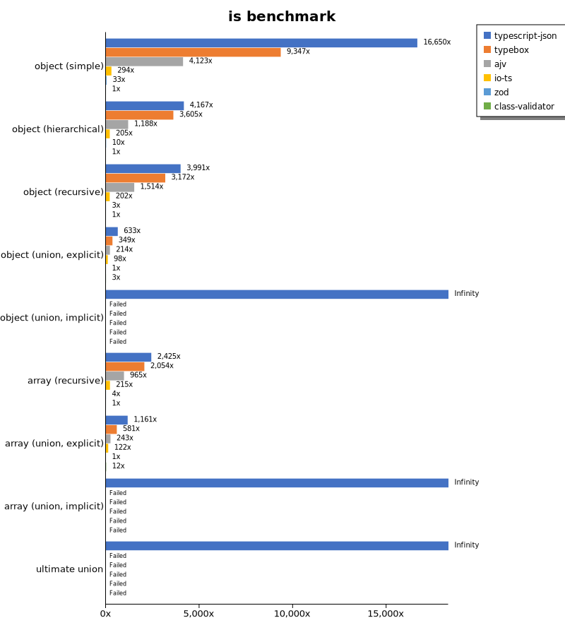

 Components | typescript-json | typebox | ajv | io-ts | zod | class-validator 
------------|-----------------|---------|-----|-------|-----|-----------------
object (simple) | 291685.7310267857 | 163750.80568668907 | 72235.34435007385 | 5151.574238313857 | 584.2839645127119 | 17.51858722766386
object (hierarchical) | 192341.05548620314 | 166398.86214812254 | 54836.263785104755 | 9444.91601341308 | 476.2225234717653 | 46.15644773079024
object (recursive) | 146437.38789040514 | 116393.88768171339 | 55551.04677520529 | 7393.408979294617 | 99.46152161214954 | 36.688935064056295
object (union, explicit) | 28189.425258940006 | 15547.801615490376 | 9515.951601542023 | 4385.522501620071 | 44.56254000548647 | 132.38665471311475
object (union, implicit) | 30137.081946571634 | Failed | Failed | Failed | Failed | Failed
array (recursive) | 79465.68439154689 | 67320.59522327357 | 31627.339802816237 | 7041.7900834268075 | 122.71819965989565 | 32.76759889904833
array (union, explicit) | 29445.27573486374 | 14739.11180995159 | 6165.180574820496 | 3083.2566790194514 | 25.35561170583318 | 310.26065684972986
array (union, implicit) | 12220.560073150533 | Failed | Failed | Failed | Failed | Failed
ultimate union | 9938.030397885364 | Failed | Failed | Failed | Failed | Failed

 Unit: kilobytes/sec 

## assert (iterate)

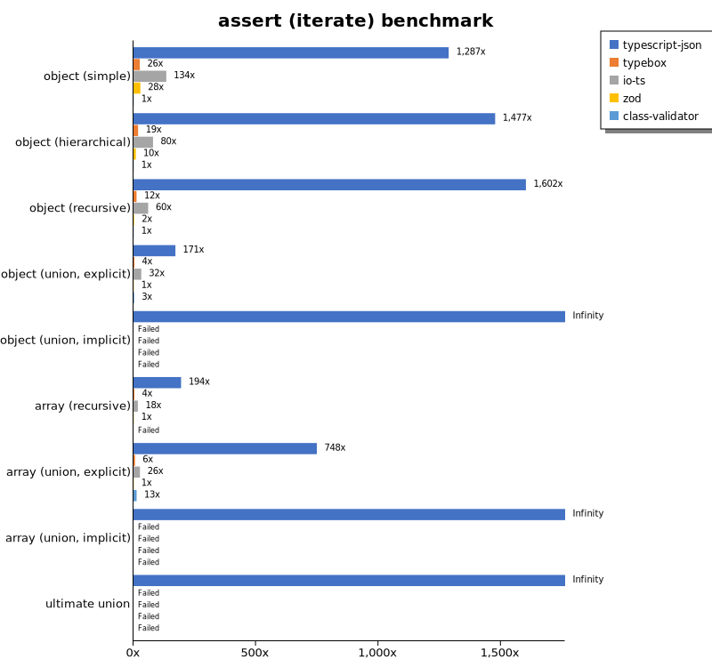

 Components | typescript-json | typebox | io-ts | zod | class-validator 
------------|-----------------|---------|-------|-----|-----------------
object (simple) | 27959.28151954487 | 557.4153731064148 | 2910.2798609840866 | 610.0872256612267 | 21.726135736619458
object (hierarchical) | 73460.73358838008 | 935.6104676882786 | 3965.4043097245067 | 473.11040110625703 | 49.747970191785775
object (recursive) | 67876.8706692823 | 525.351101391231 | 2537.2003512974507 | 104.50710387987932 | 42.36500362759782
object (union, explicit) | 8705.912735023925 | 193.8001130756579 | 1611.0202193194368 | 50.8789615584293 | 141.31756309819622
object (union, implicit) | 10470.133493471863 | Failed | Failed | Failed | Failed
array (recursive) | 26534.45309618222 | 515.677432885906 | 2421.3005514705883 | 136.5861849547511 | Failed
array (union, explicit) | 19779.428973878883 | 164.53065145020065 | 694.1749239567913 | 26.425997064917127 | 336.30016079418345
array (union, implicit) | 12822.785297055 | Failed | Failed | Failed | Failed
ultimate union | 4566.63044747731 | Failed | Failed | Failed | Failed

 Unit: kilobytes/sec 

## assert (throw)

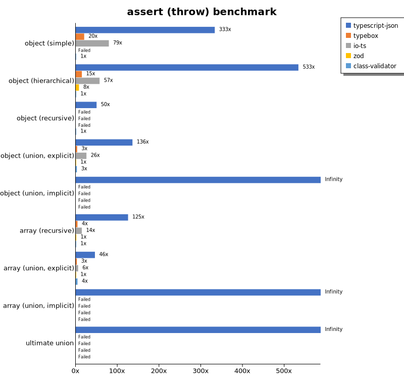

 Components | typescript-json | typebox | io-ts | zod | class-validator 
------------|-----------------|---------|-------|-----|-----------------
object (simple) | 7602.90916102707 | 461.1245205900074 | 1809.5671706448713 | Failed | 22.825097584915998
object (hierarchical) | 33209.29508273787 | 911.605182532021 | 3554.994158878505 | 480.7883723810872 | 62.248699825879754
object (recursive) | 7955.907224227514 | Failed | Failed | Failed | 159.36905474915443
object (union, explicit) | 7767.081318346812 | 193.6569425207756 | 1463.8798988398416 | 57.157649550327044 | 154.98279604655457
object (union, implicit) | 7742.041233932562 | Failed | Failed | Failed | Failed
array (recursive) | 17767.739898989897 | 601.081960770913 | 2053.762201102186 | 189.28700176480717 | 141.76388217279177
array (union, explicit) | 4098.140625 | 233.99227046933882 | 505.4752543940795 | 89.23744937287694 | 375.21888161508883
array (union, implicit) | 1923.5416762992418 | Failed | Failed | Failed | Failed
ultimate union | 4714.455059496515 | Failed | Failed | Failed | Failed

 Unit: kilobytes/sec 

## validate

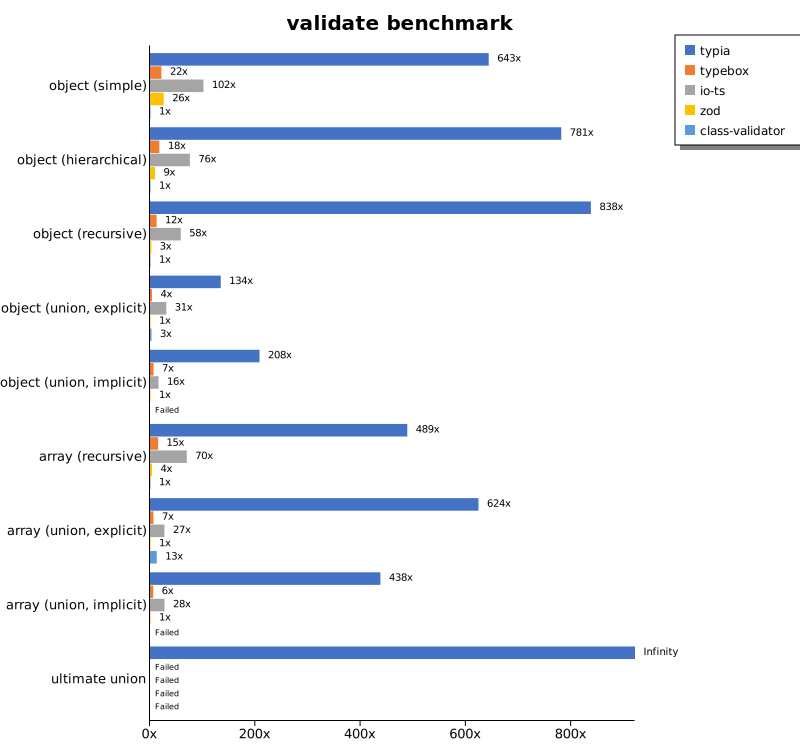

 Components | typescript-json | typebox | io-ts | zod | class-validator 
------------|-----------------|---------|-------|-----|-----------------
object (simple) | 13911.134902894222 | 467.9105500840179 | 2194.955212198516 | 562.5836699037937 | 21.619918558508672
object (hierarchical) | 39213.15470746898 | 894.3514667123352 | 3805.763708010185 | 464.9954705854491 | 50.1913886476718
object (recursive) | 33705.876115024854 | 502.54461795872845 | 2352.0208242445815 | 102.29768364677601 | 40.24291325136612
object (union, explicit) | 6650.0394674768095 | 183.27279083753737 | 1531.1099687616997 | 49.47158076489382 | 141.91404066110698
object (union, implicit) | 7684.489668968225 | 250.25392862256584 | 598.0697804555575 | 36.94150849266754 | Failed
array (recursive) | 18074.4022798816 | 569.8332112089424 | 2581.6446132302895 | 143.69638988207996 | 36.98162434591666
array (union, explicit) | 16730.501302083336 | 174.764884478673 | 734.2495799887997 | 26.81456560863874 | 342.65799720447285
array (union, implicit) | 10645.12183695257 | 148.55903440542087 | 669.7941318846816 | 24.323419627789235 | Failed
ultimate union | 3179.7998667196007 | Failed | Failed | Failed | Failed

 Unit: kilobytes/sec 

## equals

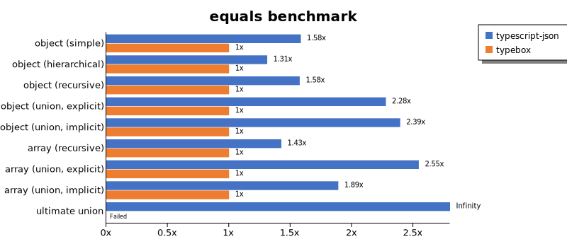

 Components | typescript-json | typebox 
------------|-----------------|---------
object (simple) | 16557.085750078913 | 10447.66455348891
object (hierarchical) | 25933.394444188616 | 19784.910877953953
object (recursive) | 24964.22582628088 | 15846.509604839463
object (union, explicit) | 10307.19333476186 | 4525.902192526183
object (union, implicit) | 9244.322853494123 | 3861.6307218309867
array (recursive) | 19125.976381889217 | 13413.533010583395
array (union, explicit) | 14609.988895323624 | 5739.785581783142
array (union, implicit) | 8837.350323256238 | 4676.487567643217
ultimate union | 7034.596389645777 | Failed

 Unit: kilobytes/sec 

## assertEquals (iterate)

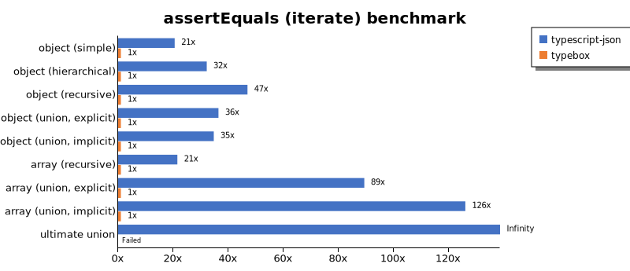

 Components | typescript-json | typebox 
------------|-----------------|---------
object (simple) | 8525.411691613346 | 415.560191090325
object (hierarchical) | 25368.17908110186 | 789.0221798058711
object (recursive) | 21782.13780059247 | 464.1217287345852
object (union, explicit) | 5295.451520437217 | 145.47549775659002
object (union, implicit) | 4812.306111539539 | 138.6697032524092
array (recursive) | 9911.48867078285 | 461.11048684708555
array (union, explicit) | 11202.074967993482 | 125.4303679809118
array (union, implicit) | 8069.125177788658 | 64.05678263692162
ultimate union | 3569.82421875 | Failed

 Unit: kilobytes/sec 

## assertEquals (throw)

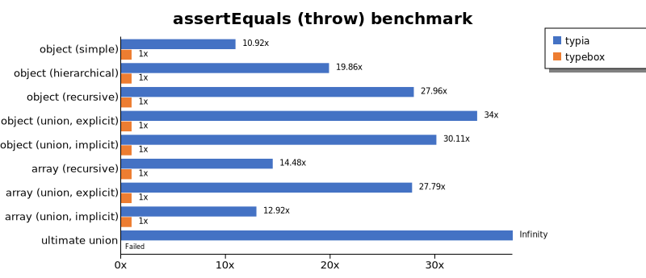

 Components | typescript-json | typebox 
------------|-----------------|---------
object (simple) | 3457.7663966587606 | 316.50966347486604
object (hierarchical) | 12214.787248623556 | 615.1219466048807
object (recursive) | 12113.80432368618 | 433.31173907110303
object (union, explicit) | 4545.830195783134 | 133.68193957270407
object (union, implicit) | 3946.7854577294124 | 131.07548466435185
array (recursive) | 8756.495398195757 | 604.755314850055
array (union, explicit) | 3366.6286227951928 | 121.1469918198366
array (union, implicit) | 1754.2885393671818 | 135.7559505167554
ultimate union | 3962.14221611404 | Failed

 Unit: kilobytes/sec 

## validateEquals

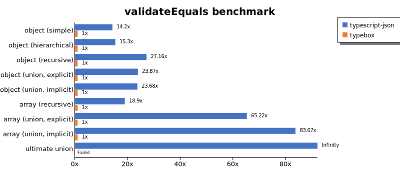

 Components | typescript-json | typebox 
------------|-----------------|---------
object (simple) | 5141.723364132428 | 362.1984011627907
object (hierarchical) | 10851.552843458156 | 709.1226525147113
object (recursive) | 11650.851581508516 | 428.9926979966299
object (union, explicit) | 3333.327342887376 | 139.65927187147426
object (union, implicit) | 3149.3520978743654 | 132.98548475523486
array (recursive) | 7873.363404558906 | 416.47315400723176
array (union, explicit) | 8397.055677613322 | 128.74982619577307
array (union, implicit) | 6159.884119583105 | 73.62388772186556
ultimate union | 2564.7280794902913 | Failed

 Unit: kilobytes/sec 

## optimizer

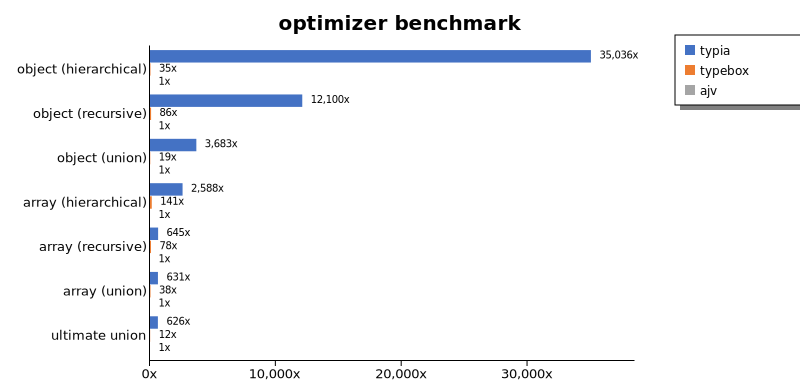

 Components | typescript-json | typebox | ajv 
------------|-----------------|---------|-----
object (hierarchical) | 195614.0784513099 | 196.32457065168236 | 5.583301118792068
object (recursive) | 153461.38111198737 | 1095.0320772399111 | 12.683024148778681
object (union) | 30067.529110677322 | 158.40371621621622 | 8.164381732912332
array (hierarchical) | 185615.65675870772 | 10123.497212670165 | 71.73409419127086
array (recursive) | 77454.38348515757 | 9314.059855877707 | 120.1368855624205
array (union) | 31985.53626814139 | 1905.2747078842222 | 50.700440986331735
ultimate union | 9894.82544011691 | 192.304643043437 | 15.798595104185877

 Unit: kilobytes/sec 

## stringify

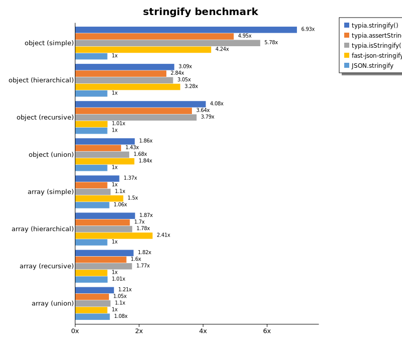

 Components | TSON.stringify() | TSON.assertStringify() | TSON.isStringify() | fast-json-stringify | JSON.stringify 
------------|------------------|------------------------|--------------------|---------------------|----------------
object (simple) | 7532.614729829756 | 5384.092613423322 | 6284.709366901147 | 4616.485269281291 | 1087.6837542404824
object (hierarchical) | 5375.009084302325 | 4946.674325404288 | 5310.317628175413 | 5698.774248190088 | 1738.8629095343274
object (recursive) | 6627.704216187581 | 5923.349852443265 | 6160.704565829917 | 1634.0378320349164 | 1625.879955130017
object (union) | 2112.4082219494458 | 1624.4377953420342 | 1914.8755434295447 | 2098.004845727848 | 1137.8839265568593
array (simple) | 2084.4178361618797 | 1517.2988009784199 | 1671.0410494530536 | 2271.830944548872 | 1611.397374466308
array (hierarchical) | 3422.8736104419054 | 3124.1162272801225 | 3260.8336891731738 | 4427.139390326975 | 1835.2376790486685
array (recursive) | 3037.5012944127393 | 2666.25482674959 | 2957.2702957557813 | 1670.650091452121 | 1681.8645988719
array (union) | 2265.524212126797 | 1971.9095508954676 | 2062.6237338858195 | 1878.2444650715074 | 2021.5421895109396

 Unit: kilobytes/sec 

## stringify (server)

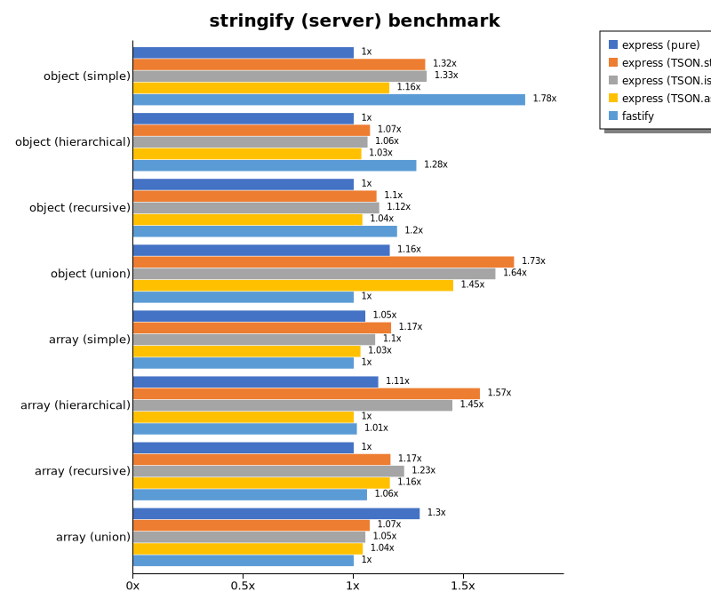

 Components | express (pure) | express (TSON.stringify) | express (TSON.isStringify) | express (TSON.assertStringify) | fastify 
------------|----------------|--------------------------|----------------------------|--------------------------------|---------
object (simple) | 55869.52341694265 | 73995.36059709871 | 74375.8882996824 | 64903.23250073723 | 99331.82511239682
object (hierarchical) | 122090.07905024843 | 131118.51061898711 | 129750.75371024634 | 126333.04436414562 | 156785.36989795917
object (recursive) | 64657.65404125635 | 71351.26852729813 | 72144.55739684493 | 67202.59993590035 | 77378.64748752268
object (union) | 84621.39156209459 | 125633.55281624252 | 119488.88648484282 | 105576.02379289706 | 72726.89354143805
array (simple) | 104326.56698098504 | 115922.48648421132 | 108758.76949815609 | 102141.14143633406 | 99106.23485904296
array (hierarchical) | 104120.93283471934 | 147328.379983234 | 135640.2116710134 | 93693.63043754967 | 95041.35606729143
array (recursive) | 47625.37366519032 | 55570.91954973051 | 58525.06809238425 | 55437.56889140765 | 50501.26903553299
array (union) | 121444.6025029296 | 100257.3363514744 | 98404.18912578562 | 97312.3748596557 | 93459.65278723114

 Unit: megabytes/sec 

