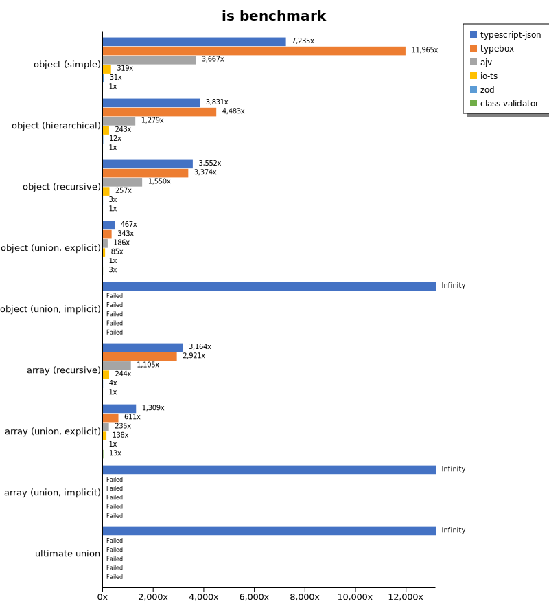
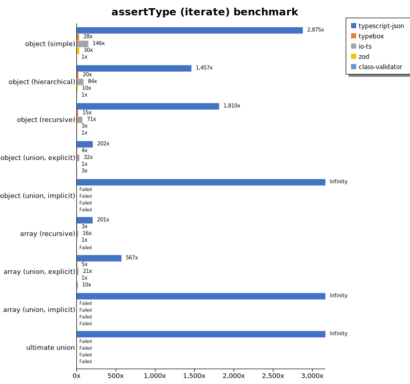
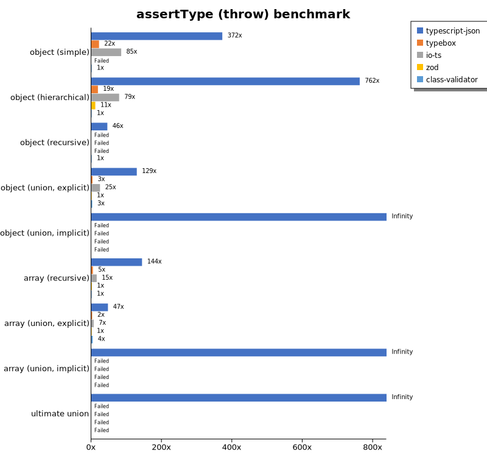
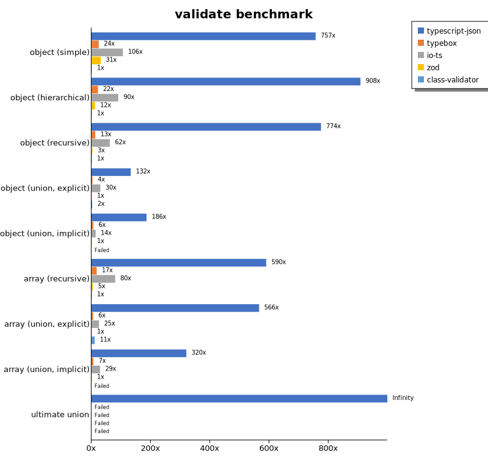
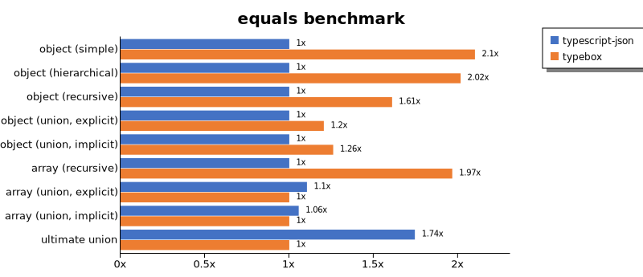
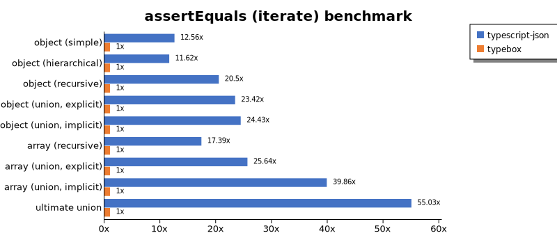
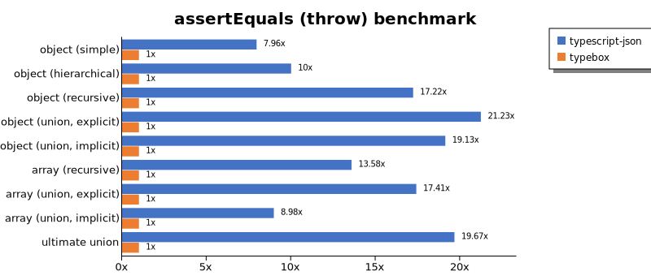
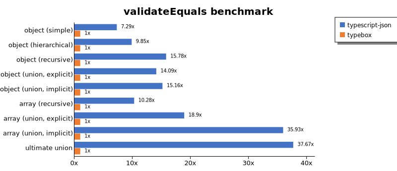
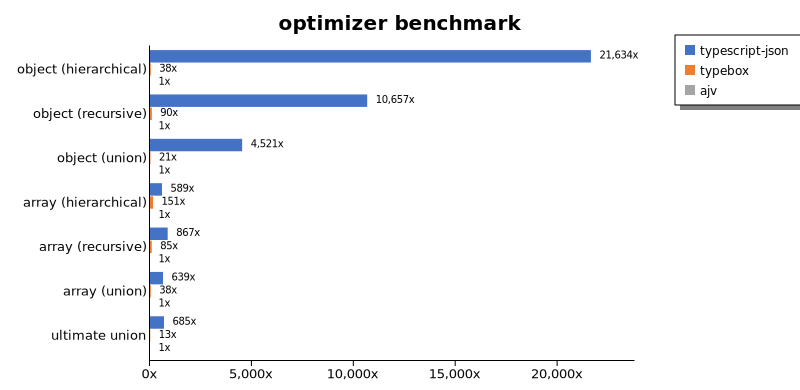
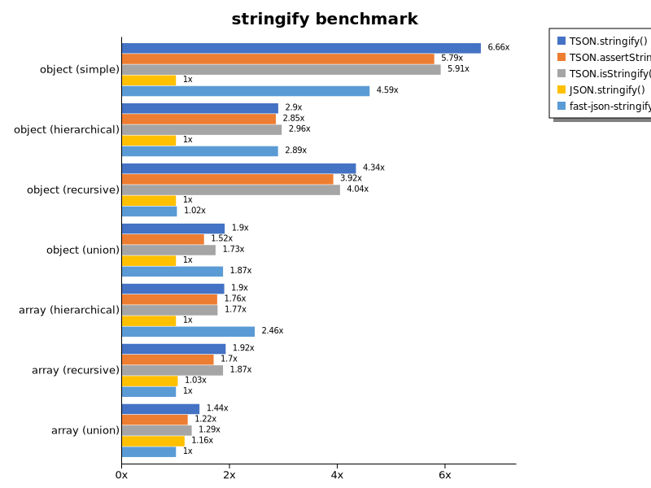

# Benchmark of `typescript-json`
> - CPU: 12th Gen Intel(R) Core(TM) i5-12600K
> - Memory: 16,125 MB
> - OS: win32
> - TypeScript-JSON version: 3.3.20

## is

 Components | typescript-json | typebox | ajv | io-ts | zod | class-validator 
------------|-----------------|---------|-----|-------|-----|-----------------
object (simple) | 1269938.8469331367 | 2100192.9382093316 | 643770.0495503761 | 55951.31505316173 | 5355.449365925381 | 175.53473572564963
object (hierarchical) | 200596.5649552348 | 234704.25649530132 | 66991.14554510238 | 12712.79955415196 | 631.1127514301533 | 52.35796509468993
object (recursive) | 114063.04824561402 | 108349.75369458129 | 49786.480101762674 | 8251.68287210172 | 95.2029520295203 | 32.11517165005537
object (union, explicit) | 23530.053634177915 | 17259.04295403165 | 9380.434782608696 | 4277.685030606566 | 50.350424197713025 | 127.87955740975876
object (union, implicit) | 21224.511930585682 | Failed | Failed | Failed | Failed | Failed
array (recursive) | 8829.493957703928 | 8148.777300728019 | 3082.3204419889507 | 682.0428336079077 | 12.34798877455566 | 2.790178571428571
array (union, explicit) | 5118.166758696852 | 2389.361317170255 | 919.3636862314866 | 540.0223380491437 | 3.910614525139665 | 51.871556146684405
array (union, implicit) | 1486.537023186238 | Failed | Failed | Failed | Failed | Failed
ultimate union | 786.8217054263566 | Failed | Failed | Failed | Failed | Failed

## assert (iterate)

 Components | typescript-json | typebox | io-ts | zod | class-validator 
------------|-----------------|---------|-------|-----|-----------------
object (simple) | 439851.93370165746 | 4266.259032795998 | 22312.19334908232 | 4663.289740283662 | 152.98848473770792
object (hierarchical) | 79375.18409425626 | 1066.5548098434006 | 4577.059592751728 | 558.5048754062839 | 54.473236239833554
object (recursive) | 61415.3248195447 | 495.19940915805023 | 2406.6304551414123 | 100.77092511013214 | 33.93025447690857
object (union, explicit) | 10114.591147786947 | 188.16501773380622 | 1583.7676842889055 | 50.05561735261402 | 130.14827018121912
object (union, implicit) | 8158.730158730159 | Failed | Failed | Failed | Failed
array (recursive) | 2494.4196428571427 | 41.98184568835099 | 196.22572370831807 | 12.431719721228102 | Failed
array (union, explicit) | 2542.6691729323306 | 21.889616463985035 | 95.60626060720347 | 4.480955937266617 | 46.68838219326818
array (union, implicit) | 1735.791366906475 | Failed | Failed | Failed | Failed
ultimate union | 364.70157451482976 | Failed | Failed | Failed | Failed

## assert (throw)

 Components | typescript-json | typebox | io-ts | zod | class-validator 
------------|-----------------|---------|-------|-----|-----------------
object (simple) | 62588.45437616387 | 3679.4919686215912 | 14283.036551077788 | Failed | 168.19286114744907
object (hierarchical) | 42131.69642857143 | 1038.911975821685 | 4367.728399771123 | 626.6616027345234 | 55.258795358261196
object (recursive) | 5138.121546961326 | Failed | Failed | Failed | 112.78195488721805
object (union, explicit) | 7155.863073561543 | 189.5016107636915 | 1366.069780321211 | 55.391432791728214 | 150.85800490288517
object (union, implicit) | 5247.706422018348 | Failed | Failed | Failed | Failed
array (recursive) | 1732.3995576852192 | 54.955119985345306 | 184.29782528566165 | 17.04158145875937 | 12.025012025012025
array (union, explicit) | 656.0962274466922 | 34.69210754553339 | 92.69558769002595 | 13.88888888888889 | 55.391432791728214
array (union, implicit) | 257.96941219826795 | Failed | Failed | Failed | Failed
ultimate union | 309.8232185164935 | Failed | Failed | Failed | Failed

## validate

 Components | typescript-json | typebox | io-ts | zod | class-validator 
------------|-----------------|---------|-------|-----|-----------------
object (simple) | 114679.42318358293 | 3698.2152514872905 | 16038.11659192825 | 4715.651358950328 | 151.58701203940169
object (hierarchical) | 45547.738693467334 | 1088.4198516828292 | 4539.5245992260925 | 592.3134890730972 | 50.18382352941176
object (recursive) | 25628.29691032404 | 421.9695580414451 | 2042.6371149511647 | 102.10605490786011 | 33.09029725182277
object (union, explicit) | 6981.412639405205 | 187.71395968048688 | 1565.4885654885654 | 52.721088435374156 | 129.85324168679176
object (union, implicit) | 5375.209380234506 | 180.92725216735772 | 404.9114791547687 | 28.944381384790013 | Failed
array (recursive) | 1658.8170865279299 | 49.11554384644336 | 224.3893202045067 | 13.09049516220831 | 2.8137310073157002
array (union, explicit) | 2552.9622980251343 | 25.318829707426858 | 114.13353623739776 | 4.513823584728231 | 49.34579439252337
array (union, implicit) | 886.1555036810918 | 18.13031161473088 | 80.09024252679075 | 2.7700831024930745 | Failed
ultimate union | 239.01243214848535 | Failed | Failed | Failed | Failed

## equals

 Components | typescript-json | typebox 
------------|-----------------|---------
object (simple) | 36949.086884338685 | 77608.21514090993
object (hierarchical) | 11409.082414501961 | 22996.26587005228
object (recursive) | 8391.663537363876 | 13505.63063063063
object (union, explicit) | 3515.462031107045 | 4235.033259423503
object (union, implicit) | 2308.2510709629355 | 2909.0742101396036
array (recursive) | 658.6315594288893 | 1294.8647156267257
array (union, explicit) | 934.7066396910061 | 846.0972017673048
array (union, implicit) | 598.2404692082112 | 566.5738161559889
ultimate union | 434.5357993041567 | 249.11660777385157

## assertEquals (iterate)

 Components | typescript-json | typebox 
------------|-----------------|---------
object (simple) | 42440.36697247706 | 3380.052395209581
object (hierarchical) | 10606.502242152466 | 912.9717845364603
object (recursive) | 8770.482603815937 | 427.76946107784426
object (union, explicit) | 3353.8771031455744 | 143.17548746518105
object (union, implicit) | 2457.9507895703273 | 100.61832490163013
array (recursive) | 755.7294577976522 | 43.469971401334604
array (union, explicit) | 529.8316251830161 | 20.666542543288024
array (union, implicit) | 358.17575083426027 | 8.985398727068514
ultimate union | 308.28729281767954 | 5.602240896358543

## assertEquals (throw)

 Components | typescript-json | typebox 
------------|-----------------|---------
object (simple) | 23981.1320754717 | 3012.598137666606
object (hierarchical) | 8887.657058388766 | 888.3953359244865
object (recursive) | 7098.426637394805 | 412.1393780442113
object (union, explicit) | 3115.6716417910447 | 146.7620620069712
object (union, implicit) | 2095.481049562682 | 109.54902318787656
array (recursive) | 733.4963325183373 | 54.02485143165856
array (union, explicit) | 315.1065801668211 | 18.099547511312217
array (union, implicit) | 146.97776961234615 | 16.366612111292962
ultimate union | 294.71357524405965 | 14.98576352465158

## validateEquals

 Components | typescript-json | typebox 
------------|-----------------|---------
object (simple) | 22603.732162458837 | 3099.095774128068
object (hierarchical) | 8874.405850091407 | 900.8403361344537
object (recursive) | 6161.314002569279 | 390.3958944281525
object (union, explicit) | 2091.5989159891597 | 148.46996599924444
object (union, implicit) | 1533.015407190022 | 101.15552187914378
array (recursive) | 461.79159049360146 | 44.92039423805913
array (union, explicit) | 408.2261279217249 | 21.60318362706083
array (union, implicit) | 302.7027027027027 | 8.425388504025463
ultimate union | 191.09297374024132 | 5.073280721533258

## optimizer

 Components | typescript-json | typebox | ajv 
------------|-----------------|---------|-----
object (hierarchical) | 142123.18584070794 | 247.32571007008485 | 6.56934306569343
object (recursive) | 119919.9268738574 | 1013.0147976466393 | 11.252268602540836
object (union) | 25364.802933088908 | 116.8128382160851 | 5.610622779128483
array (hierarchical) | 4819.889502762431 | 1237.6623376623377 | 8.180330848936556
array (recursive) | 10177.978883861237 | 1000.9122422915526 | 11.733535200605603
array (union) | 5144.2041042706605 | 304.03889304412866 | 8.050926792735442
ultimate union | 748.9570107019772 | 14.538093485461905 | 1.092697140775815

## stringify

 Components | TSON.stringify() | TSON.assertStringify() | TSON.isStringify() | JSON.stringify() | fast-json-stringify 
------------|------------------|------------------------|--------------------|------------------|---------------------
object (simple) | 52008.38926174497 | 45252.16430281819 | 46188.01238841319 | 7812.7667470773795 | 35885.961680176864
object (hierarchical) | 6028.20466461761 | 5936.510926902788 | 6163.888368608353 | 2080.768513337064 | 6021.455223880596
object (recursive) | 6584.012123508241 | 5946.746671666979 | 6136.750555144337 | 1517.3896783844427 | 1544.1869229319766
object (union) | 1645.5741201564165 | 1314.0655105973026 | 1498.8501680523616 | 864.0392230812747 | 1619.0218372134993
array (hierarchical) | 84.85299590621511 | 78.99560117302052 | 79.31908728721477 | 44.759206798866856 | 110.18484958318231
array (recursive) | 306.1600885282184 | 270.59248554913296 | 298.3373809079021 | 164.6330016895063 | 159.27272727272728
array (union) | 410.37650873716444 | 348.09437386569874 | 369.1373919440868 | 331.4532806918594 | 285.74000720201656

