# Benchmark of `typia`
> - CPU: 12th Gen Intel(R) Core(TM) i7-12700H
> - Memory: 16,053 MB
> - OS: win32
> - Typia version: 3.4.20

## is

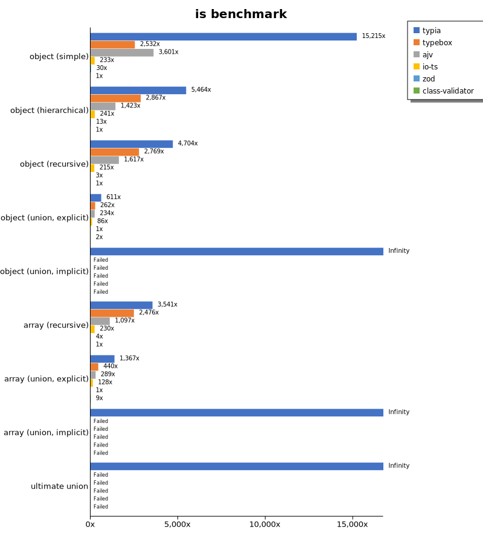

 Components | typia | typebox | ajv | io-ts | zod | class-validator 
------------|-------|---------|-----|-------|-----|-----------------
object (simple) | 316035.5449580834 | 52601.545357926494 | 74794.6039578352 | 4843.083025042686 | 632.6390027642428 | 20.77101609865883
object (hierarchical) | 219984.64712981577 | 115424.46091429167 | 57282.4998866316 | 9686.58580222491 | 522.9178875942268 | 40.26385347084311
object (recursive) | 153319.08837114126 | 90250.08913783585 | 52692.332430021954 | 7006.745498129092 | 109.00345437017995 | 32.59348314861919
object (union, explicit) | 31118.372794800373 | 13337.831308669243 | 11932.26369653288 | 4384.725882218148 | 50.95670803782507 | 106.0060879546273
object (union, implicit) | 32562.517945457526 | Failed | Failed | Failed | Failed | Failed
array (recursive) | 108406.88669832898 | 75826.03454589844 | 33578.38128172146 | 7052.768870124198 | 136.44172400432086 | 30.61834104294194
array (union, explicit) | 36544.66145833333 | 11772.226823836183 | 7720.060635099697 | 3422.931281887755 | 26.742381572189014 | 233.2023348427731
array (union, implicit) | 21127.408563782337 | Failed | Failed | Failed | Failed | Failed
ultimate union | 10674.512648128659 | Failed | Failed | Failed | Failed | Failed

 Unit: kilobytes/sec 

## assert (iterate)

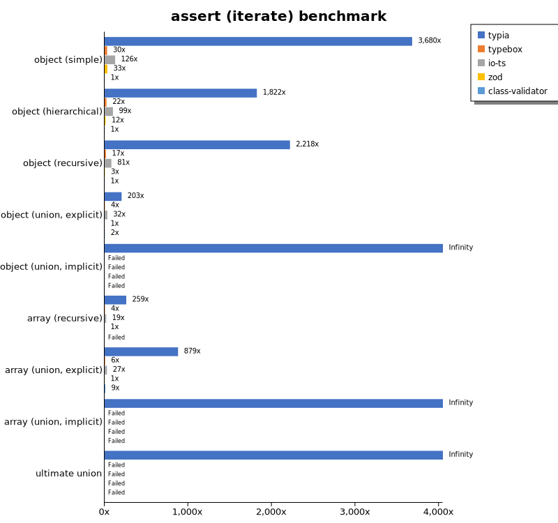

 Components | typia | typebox | io-ts | zod | class-validator 
------------|-------|---------|-------|-----|-----------------
object (simple) | 64413.13656197743 | 526.8494675279329 | 2204.393977501372 | 585.210601262185 | 17.503227468506857
object (hierarchical) | 71923.39247977639 | 869.3968500605273 | 3922.534359202665 | 459.407225512809 | 39.481026785714285
object (recursive) | 70743.39453197192 | 527.0173867837337 | 2578.869943066099 | 106.07220233609645 | 31.891946231617645
object (union, explicit) | 10432.358432507805 | 198.27858113354037 | 1655.4120298127466 | 51.36992296918767 | 106.31034619211289
object (union, implicit) | 12194.525371028429 | Failed | Failed | Failed | Failed
array (recursive) | 35371.720785177036 | 535.7879826524902 | 2531.647442443372 | 136.65921919096894 | Failed
array (union, explicit) | 23657.730653041166 | 174.21088432359613 | 738.9282135260845 | 26.921318850957928 | 249.0852499524805
array (union, implicit) | 9810.360980675456 | Failed | Failed | Failed | Failed
ultimate union | 4984.784802694734 | Failed | Failed | Failed | Failed

 Unit: kilobytes/sec 

## assert (throw)

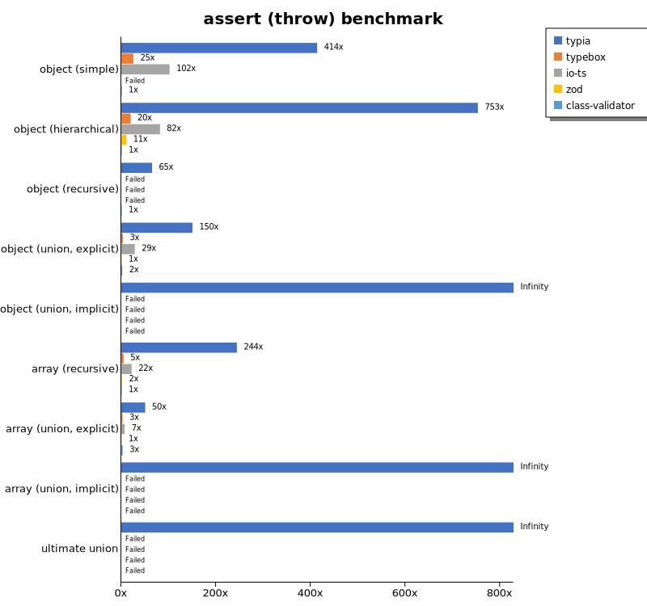

 Components | typia | typebox | io-ts | zod | class-validator 
------------|-------|---------|-------|-----|-----------------
object (simple) | 7732.860126698494 | 475.2190145813735 | 1904.8287576261785 | Failed | 18.690442825112108
object (hierarchical) | 33980.393506659835 | 891.332953438196 | 3685.5841330418925 | 483.4911456371256 | 45.1153783940247
object (recursive) | 8455.068075845278 | Failed | Failed | Failed | 130.0613510182455
object (union, explicit) | 8719.81417766151 | 193.33884611838465 | 1654.4402031844108 | 58.01235130025821 | 118.24923637218046
object (union, implicit) | 8649.440190065512 | Failed | Failed | Failed | Failed
array (recursive) | 30359.70261864758 | 606.5239835272208 | 2695.7002879763254 | 187.86936127371388 | 124.37470387106814
array (union, explicit) | 4455.222449967345 | 239.8587212113221 | 628.1383085865563 | 88.35101711242068 | 250.10383249312557
array (union, implicit) | 2264.9731080923507 | Failed | Failed | Failed | Failed
ultimate union | 4964.27769100372 | Failed | Failed | Failed | Failed

 Unit: kilobytes/sec 

## validate

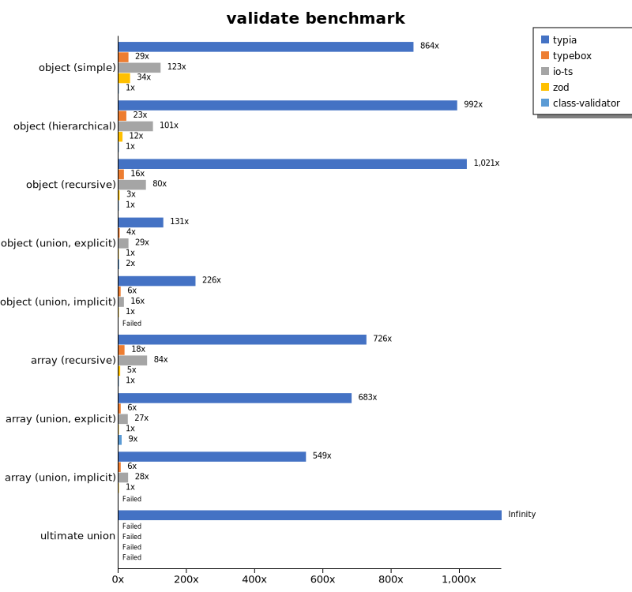

 Components | typia | typebox | io-ts | zod | class-validator 
------------|-------|---------|-------|-----|-----------------
object (simple) | 15318.651082408587 | 517.2220142268814 | 2185.631150643452 | 601.380881532453 | 17.72093023255814
object (hierarchical) | 39104.69253104876 | 904.8564159213515 | 3978.801129230984 | 464.340602630029 | 39.40284971871569
object (recursive) | 33607.70152698864 | 521.2112547881669 | 2643.871872409267 | 108.7719213991867 | 32.92726903676064
object (union, explicit) | 7485.183283247637 | 203.43818816300436 | 1665.9902482168816 | 57.01371864982086 | 113.33897334747343
object (union, implicit) | 8752.448596225537 | 242.30180364264515 | 613.8810517413488 | 38.78869912790698 | Failed
array (recursive) | 21947.782185086875 | 533.2218485667292 | 2530.399600548925 | 149.5369167925954 | 30.211899214599743
array (union, explicit) | 18359.954478801035 | 173.89291014888803 | 732.2823660714286 | 26.87777972846442 | 249.47718631178708
array (union, implicit) | 13163.98636725865 | 155.53871268656715 | 674.6438102617079 | 23.963147879874906 | Failed
ultimate union | 3672.694388560377 | Failed | Failed | Failed | Failed

 Unit: kilobytes/sec 

## equals

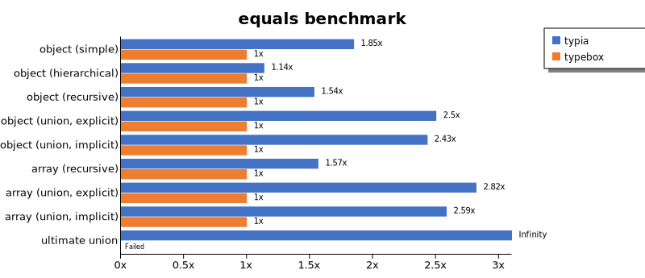

 Components | typia | typebox 
------------|-------|---------
object (simple) | 16386.073857060182 | 8856.059078971617
object (hierarchical) | 20351.487379807695 | 17878.22265625
object (recursive) | 22453.846284395364 | 14622.882153614457
object (union, explicit) | 11101.461695830314 | 4434.7278459717845
object (union, implicit) | 9497.771838621855 | 3902.012209920488
array (recursive) | 22237.024279275578 | 14188.206503931848
array (union, explicit) | 15834.588913690475 | 5611.825504658385
array (union, implicit) | 11770.665708273316 | 4551.937586725254
ultimate union | 7480.710177951388 | Failed

 Unit: kilobytes/sec 

## assertEquals (iterate)

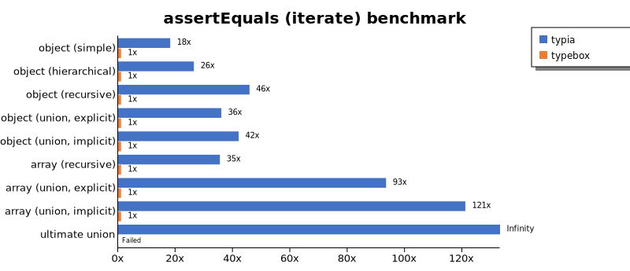

 Components | typia | typebox 
------------|-------|---------
object (simple) | 7271.389030670766 | 400.28874306701505
object (hierarchical) | 20108.05082249246 | 760.9949966536726
object (recursive) | 21207.802912066436 | 462.88519563102295
object (union, explicit) | 5423.310876378847 | 150.70001089568413
object (union, implicit) | 5965.791903409091 | 141.96584302325581
array (recursive) | 16535.140422701657 | 465.94873119427933
array (union, explicit) | 13306.12627642422 | 142.41178440496333
array (union, implicit) | 9388.237364432704 | 77.54293803818796
ultimate union | 4580.675828313253 | Failed

 Unit: kilobytes/sec 

## assertEquals (throw)

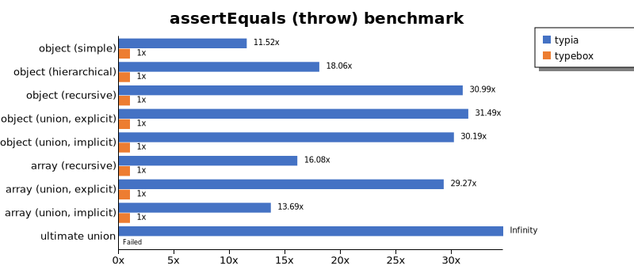

 Components | typia | typebox 
------------|-------|---------
object (simple) | 4306.087137651961 | 373.68215498521533
object (hierarchical) | 13340.595845727421 | 738.6529632721201
object (recursive) | 13941.363516633788 | 449.90927846581275
object (union, explicit) | 4845.0563315660675 | 153.87041284403668
object (union, implicit) | 4758.598823051948 | 157.60790424044734
array (recursive) | 9507.212395871686 | 591.1716368140245
array (union, explicit) | 3647.7835792104297 | 124.61458048101497
array (union, implicit) | 1926.7478641878124 | 140.70377804942382
ultimate union | 4493.900965664005 | Failed

 Unit: kilobytes/sec 

## validateEquals

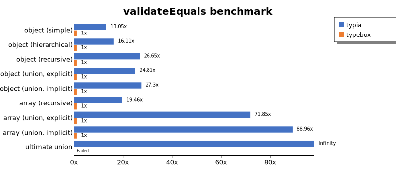

 Components | typia | typebox 
------------|-------|---------
object (simple) | 5108.627787123631 | 391.3309706606579
object (hierarchical) | 12189.713917780937 | 756.5824949958587
object (recursive) | 12352.402819060004 | 463.46803261478163
object (union, explicit) | 3611.6091077716296 | 145.5937844605771
object (union, implicit) | 3827.0199837140817 | 140.18660392138247
array (recursive) | 9072.303247110623 | 466.1870757918552
array (union, explicit) | 9977.451171875 | 138.85955493675667
array (union, implicit) | 6954.230808240172 | 78.1689398200225
ultimate union | 3098.2092960886953 | Failed

 Unit: kilobytes/sec 

## optimizer

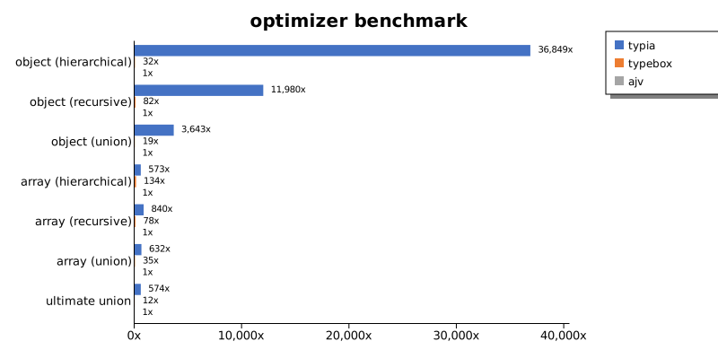

 Components | typia | typebox | ajv 
------------|-------|---------|-----
object (hierarchical) | 196396.98011572796 | 172.8369869402985 | 5.329755459101486
object (recursive) | 147683.9198694373 | 1011.4809782608695 | 12.327955776173285
object (union) | 28629.64879587156 | 152.76934217903198 | 7.858755392876813
array (hierarchical) | 159102.5521171788 | 37298.58854559822 | 277.722584195081
array (recursive) | 107633.6480236408 | 9943.553046218487 | 128.16355224963718
array (union) | 33984.72041445327 | 1892.3390715928288 | 53.73852607577175
ultimate union | 10485.921476738078 | 210.94960387323943 | 18.272534042504983

 Unit: kilobytes/sec 

## stringify

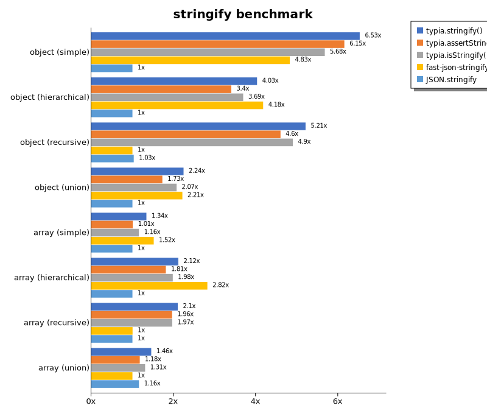

 Components | typia.stringify() | typia.assertStringify() | typia.isStringify() | fast-json-stringify | JSON.stringify 
------------|-------------------|-------------------------|---------------------|---------------------|----------------
object (simple) | 6604.653839071994 | 6226.41771682728 | 5745.439963336388 | 4883.1129807692305 | 1011.9328922495274
object (hierarchical) | 6466.751025300369 | 5463.150131118881 | 5925.6874884601175 | 6704.1814778947855 | 1604.6156774967696
object (recursive) | 8122.593815795497 | 7173.423754305529 | 7640.725160256411 | 1559.1096356580167 | 1608.4317565975496
object (union) | 2430.06438731357 | 1871.757534475089 | 2246.8018207121827 | 2398.8949246494262 | 1083.4470202575376
array (simple) | 2414.418777307482 | 1817.8511455649611 | 2086.313445233731 | 2736.117361370862 | 1802.4841218703975
array (hierarchical) | 4079.960901431209 | 3493.581295186886 | 3819.041598894887 | 5440.3715543576445 | 1927.9760290927952
array (recursive) | 3660.7444441856132 | 3420.673909279778 | 3426.7605176592797 | 1746.9861072228443 | 1741.5090113827994
array (union) | 2880.732604510451 | 2329.4505866425993 | 2585.514287648971 | 1976.9846828122174 | 2289.249695806814

 Unit: kilobytes/sec 

## stringify (server)

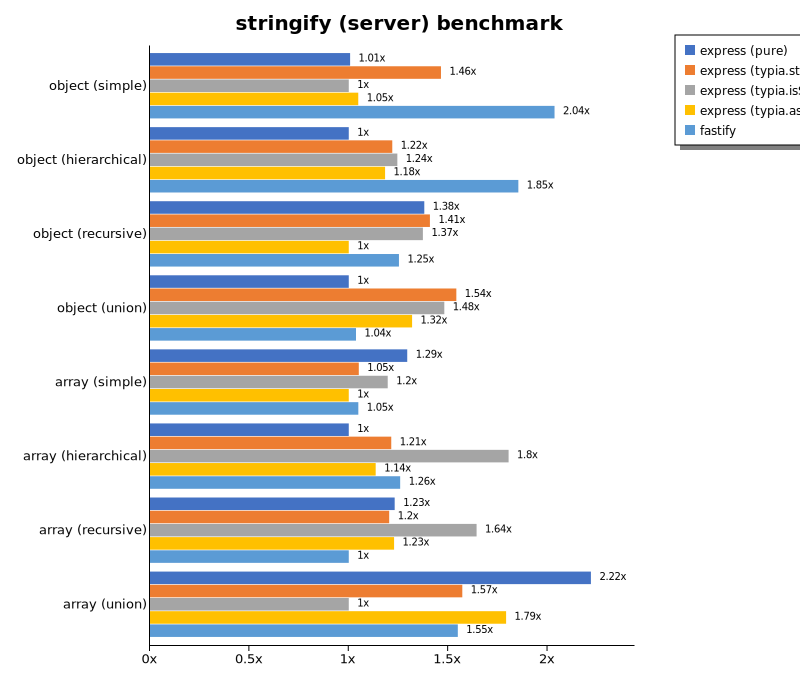

 Components | express (pure) | express (typia.stringify) | express (typia.isStringify) | express (typia.assertStringify) | fastify 
------------|----------------|---------------------------|-----------------------------|---------------------------------|---------
object (simple) | 61124.19457301025 | 88876.32768908206 | 60713.506483127494 | 63610.91076258165 | 123562.11991771238
object (hierarchical) | 101729.55219972068 | 123997.24177139097 | 126587.78978767806 | 120314.88455691787 | 188519.42810022068
object (recursive) | 58260.47029255584 | 59453.2656859521 | 57958.74235267902 | 42218.33590989399 | 52876.39520320155
object (union) | 82278.45699617793 | 126807.11078206071 | 121829.93683427709 | 108494.1938229572 | 85269.0113001397
array (simple) | 106803.21987998753 | 86689.08016206352 | 98701.23245362521 | 82527.61603447846 | 86496.48442814144
array (hierarchical) | 72614.22396162439 | 88134.34314504816 | 131004.37151054591 | 82444.72123138959 | 91391.38557053634
array (recursive) | 2929.542408577446 | 2863.859565996709 | 3910.286434056586 | 2922.394857075914 | 2379.8824580308533
array (union) | 24106.442685871127 | 17074.729582008316 | 10867.440377225792 | 19469.71943697381 | 16829.265194625095

 Unit: megabytes/sec 

