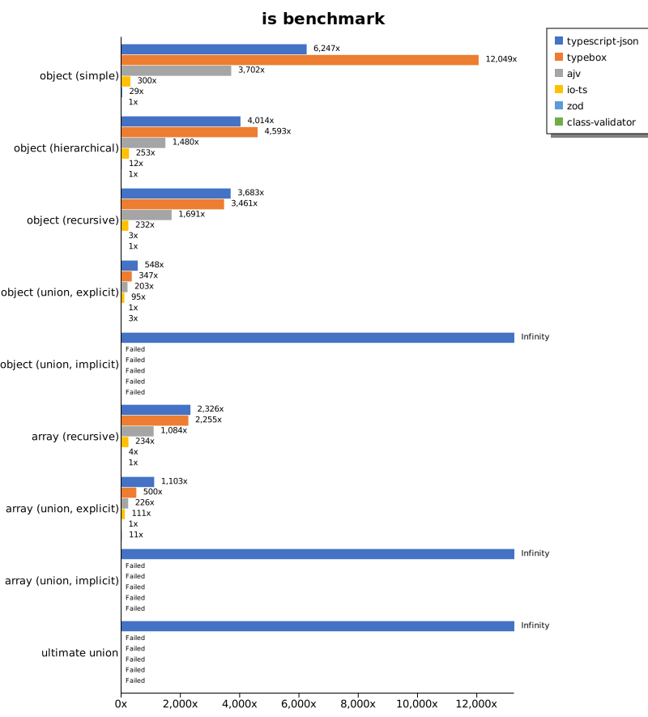
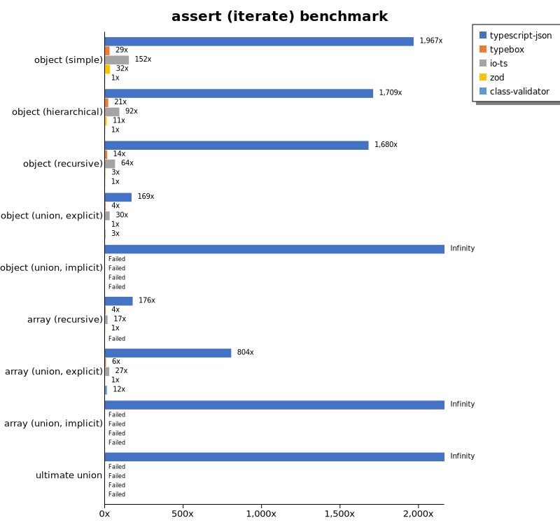
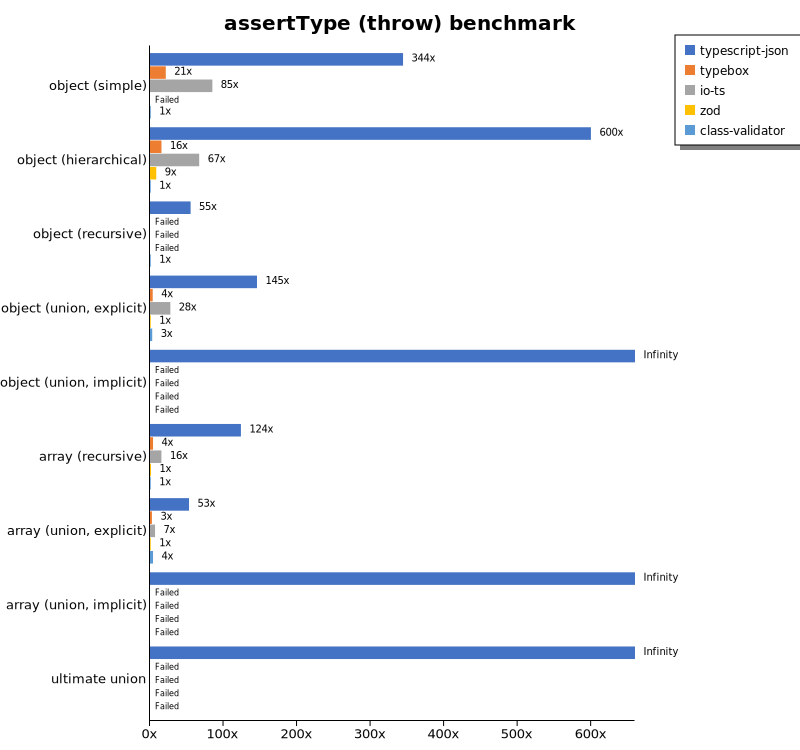
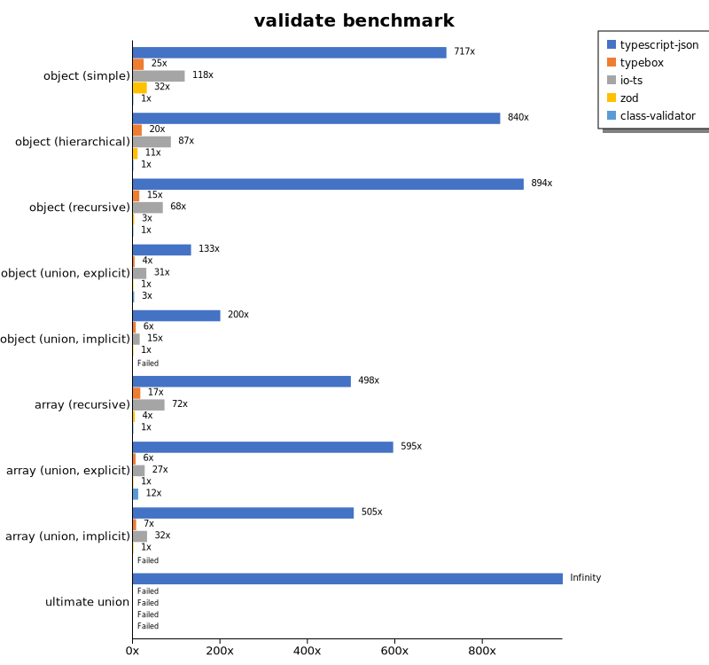
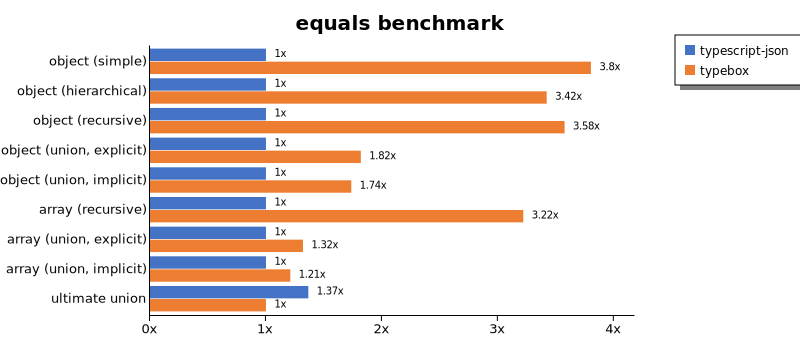
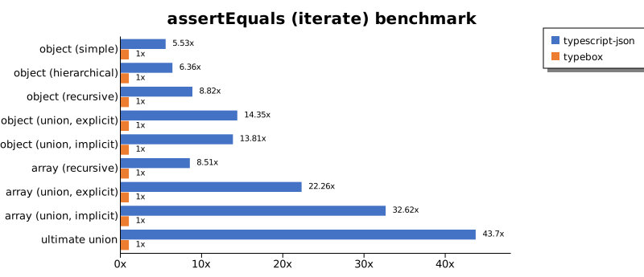
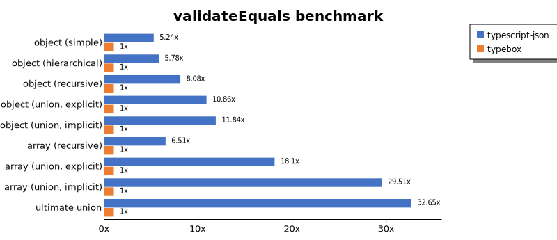
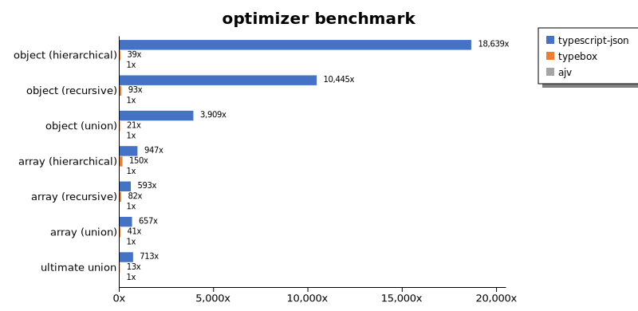
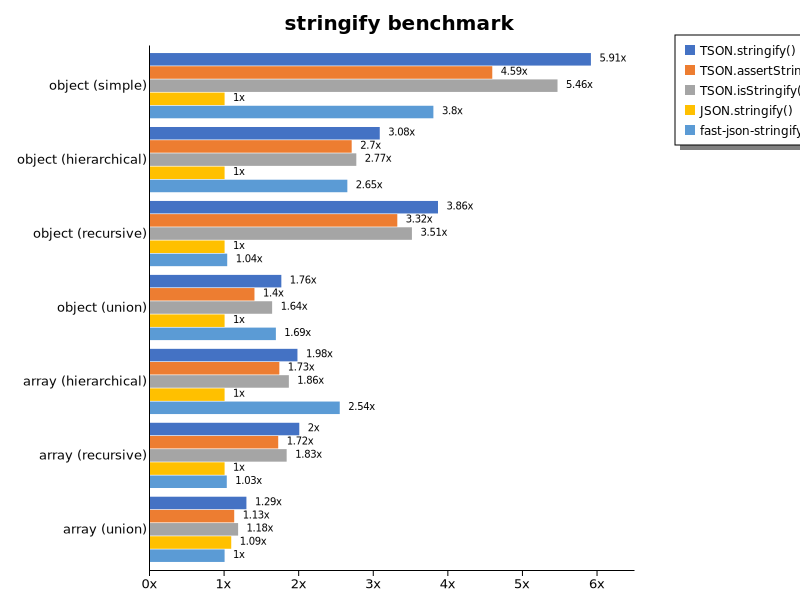

# Benchmark of `typescript-json`
> - CPU: 12th Gen Intel(R) Core(TM) i7-12700K
> - Memory: 32,476 MB
> - OS: win32
> - TypeScript-JSON version: 3.3.20

## is

 Components | typescript-json | typebox | ajv | io-ts | zod | class-validator 
------------|-----------------|---------|-----|-------|-----|-----------------
object (simple) | 1226594.4917557528 | 2365659.670164917 | 726839.7520195378 | 58832.71719038817 | 5672.400897531787 | 196.3436928702011
object (hierarchical) | 213698.62248696949 | 244548.02259887007 | 78822.94539437396 | 13461.297456690012 | 653.8461538461538 | 53.241579137993476
object (recursive) | 137104.36363636365 | 128860.4906627609 | 62945.16971279374 | 8636.666666666666 | 108.09846592936141 | 37.22911650305612
object (union, explicit) | 30088.20266272189 | 19060.51660516605 | 11146.069469835467 | 5230.898876404495 | 54.92493592090809 | 150.24857300681273
object (union, implicit) | 27313.44126506024 | Failed | Failed | Failed | Failed | Failed
array (recursive) | 7747.376311844078 | 7513.554216867469 | 3610.4910714285706 | 779.2351745797155 | 13.791835233541743 | 3.3314825097168246
array (union, explicit) | 5554.394476581452 | 2520.496224379719 | 1136.6150442477874 | 561.3084112149533 | 5.037313432835821 | 57.40810913224706
array (union, implicit) | 2460.814479638009 | Failed | Failed | Failed | Failed | Failed
ultimate union | 828.9768483943242 | Failed | Failed | Failed | Failed | Failed

## assertType (iterate)

 Components | typescript-json | typebox | io-ts | zod | class-validator 
------------|-----------------|---------|-------|-----|-----------------
object (simple) | 337441.61676646705 | 4975.903614457831 | 26114.34395848777 | 5475.967832429399 | 171.56952311346612
object (hierarchical) | 100337.03498056636 | 1212.4153085515472 | 5377.885331347729 | 622.6310947562098 | 58.715931955368575
object (recursive) | 63994.291830181945 | 524.3362831858407 | 2449.1063029162747 | 107.20299345182414 | 38.10235338064998
object (union, explicit) | 9737.353372434016 | 214.60928652321633 | 1718.4200946487076 | 57.58266818700114 | 150.69508804448566
object (union, implicit) | 8296.310031522344 | Failed | Failed | Failed | Failed
array (recursive) | 2391.1520737327187 | 51.1111111111111 | 225.52151851155799 | 13.561876059521566 | Failed
array (union, explicit) | 3636.883884068673 | 28.265287271383706 | 122.18709317463271 | 4.52147701582517 | 54.55568053993251
array (union, implicit) | 1697.5069252077565 | Failed | Failed | Failed | Failed
ultimate union | 401.8007878446821 | Failed | Failed | Failed | Failed

## assertType (throw)

 Components | typescript-json | typebox | io-ts | zod | class-validator 
------------|-----------------|---------|-------|-----|-----------------
object (simple) | 65259.80116300881 | 4069.004312769548 | 16078.877512324612 | Failed | 189.60940462646946
object (hierarchical) | 44003.72439478585 | 1142.9642121041784 | 4908.675799086757 | 624.1724985814262 | 73.3810310034856
object (recursive) | 6212.750586960447 | Failed | Failed | Failed | 112.46485473289599
object (union, explicit) | 8077.2769089236435 | 203.70370370370367 | 1535.5805243445693 | 55.51443375277573 | 167.7539608574091
object (union, implicit) | 5829.109341057205 | Failed | Failed | Failed | Failed
array (recursive) | 1639.9484061175606 | 54.8847420417124 | 205.8383233532934 | 17.571604287471445 | 13.262599469496022
array (union, explicit) | 719.4244604316547 | 35.574528637495554 | 93.3009889904833 | 13.559322033898304 | 55.970149253731336
array (union, implicit) | 280.63610851262865 | Failed | Failed | Failed | Failed
ultimate union | 387.2395353125576 | Failed | Failed | Failed | Failed

## validate

 Components | typescript-json | typebox | io-ts | zod | class-validator 
------------|-----------------|---------|-------|-----|-----------------
object (simple) | 123728.37465564738 | 4253.55969331873 | 20431.3248502994 | 5462.205466541 | 172.5614296351452
object (hierarchical) | 49597.45996686914 | 1186.2799776910208 | 5120.157215047726 | 626.131221719457 | 59.044048734770385
object (recursive) | 33710.295728368015 | 550.4587155963303 | 2579.0358744394616 | 109.28652321630804 | 37.718145993619814
object (union, explicit) | 7285.162002945507 | 210.3866565579985 | 1679.8462383305878 | 54.79704797047971 | 156.855369569306
object (union, implicit) | 6002.209537838335 | 194.90732072645574 | 463.5097493036212 | 30.03400075557235 | Failed
array (recursive) | 1668.2979880369764 | 56.657764212132776 | 241.71142804223 | 14.24772036474164 | 3.347591593825553
array (union, explicit) | 2698.11320754717 | 27.652370203160274 | 121.74405436013589 | 4.53257790368272 | 54.49490268767378
array (union, implicit) | 1417.8006620080912 | 20.470053070507962 | 90.60022650056625 | 2.80688622754491 | Failed
ultimate union | 251.33492911066102 | Failed | Failed | Failed | Failed

## equals

 Components | typescript-json | typebox 
------------|-----------------|---------
object (simple) | 23847.073978652927 | 90676.2225969646
object (hierarchical) | 7498.321521820216 | 25651.722252597046
object (recursive) | 4599.850829759463 | 16445.968184311572
object (union, explicit) | 2648.613915917019 | 4815.102720710716
object (union, implicit) | 1824.6039142590867 | 3167.153818048959
array (recursive) | 417.30805331330953 | 1343.3647570703408
array (union, explicit) | 707.4188282241973 | 933.2113449222325
array (union, implicit) | 510.68616422947133 | 617.908787541713
ultimate union | 356.468023255814 | 261.0603290676417

## assertEquals (iterate)

 Components | typescript-json | typebox 
------------|-----------------|---------
object (simple) | 20091.397849462366 | 3635.08064516129
object (hierarchical) | 6714.285714285714 | 1055.0009417969486
object (recursive) | 4254.116355653128 | 482.18221895664954
object (union, explicit) | 2214.246272777471 | 154.29831006612784
object (union, implicit) | 1608.7115666178624 | 116.46586345381526
array (recursive) | 406.6950249676346 | 47.81548846802925
array (union, explicit) | 501.18031596150354 | 22.509848058525602
array (union, implicit) | 311.43375680580766 | 9.548773637895525
ultimate union | 272.09674550951445 | 6.226415094339623

## assertEquals (throw)

 Components | typescript-json | typebox 
------------|-----------------|---------
object (simple) | 17860.51786051786 | 3363.970588235294
object (hierarchical) | 6293.965198074787 | 959.5866396014026
object (recursive) | 3845.4393460895412 | 471.342383107089
object (union, explicit) | 2130.7594245128394 | 167.7539608574091
object (union, implicit) | 1551.2465373961218 | 111.37924633376647
array (recursive) | 390.98864271085455 | 55.177487585065286
array (union, explicit) | 315.1065801668211 | 35.02626970227671
array (union, implicit) | 165.31961792799413 | 16.291951775822746
ultimate union | 279.4336810730253 | 14.721036360959811

## validateEquals

 Components | typescript-json | typebox 
------------|-----------------|---------
object (simple) | 17789.376952766037 | 3394.3482224247946
object (hierarchical) | 5749.726775956284 | 995.2498574957249
object (recursive) | 3764.1300332471374 | 466.03595080416267
object (union, explicit) | 1686.2996158770807 | 155.31955243694293
object (union, implicit) | 1250.045829514207 | 105.57510650120392
array (recursive) | 299.33234421364983 | 46.007106788853555
array (union, explicit) | 412.2946475887652 | 22.779043280182233
array (union, implicit) | 281.5392993283717 | 9.541627689429374
ultimate union | 184.18201516793064 | 5.641218503196691

## optimizer

 Components | typescript-json | typebox | ajv 
------------|-----------------|---------|-----
object (hierarchical) | 129973.23866739486 | 269.41879413362307 | 6.973001966744144
object (recursive) | 130683.65455893254 | 1165.9003126724297 | 12.511332728921126
object (union) | 24516.25135427952 | 134.69312752664462 | 6.271905552481091
array (hierarchical) | 8497.99123447772 | 1346.3397172006444 | 8.972715619849843
array (recursive) | 8030.2753966806495 | 1104.3845166024582 | 13.531291110693479
array (union) | 5524.345260051642 | 345.29725750046015 | 8.404896765941897
ultimate union | 795.959595959596 | 14.856933235509905 | 1.1166945840312674

## stringify

 Components | TSON.stringify() | TSON.assertStringify() | TSON.isStringify() | JSON.stringify() | fast-json-stringify 
------------|------------------|------------------------|--------------------|------------------|---------------------
object (simple) | 56679.626168224306 | 43999.81178242048 | 52385.29688972668 | 9588.456712672523 | 36428.305746698905
object (hierarchical) | 7455.013799448023 | 6544.218953639917 | 6694.606413994168 | 2420.253164556962 | 6403.489235337788
object (recursive) | 7215.00748502994 | 6195.789865871832 | 6561.818517834042 | 1868.662747979427 | 1934.5011424219347
object (union) | 1762.4486882027486 | 1401.840490797546 | 1639.0064397424105 | 1000.9349289454002 | 1689.1002194586686
array (hierarchical) | 432.0987654320988 | 379.06006169479224 | 406.92798541476753 | 218.58226910975387 | 556.0328726186029
array (recursive) | 349.48550046772687 | 300.1643235347818 | 319.9562203575337 | 174.62058877308465 | 179.74778844344064
array (union) | 458.0871491875923 | 400.073678393811 | 418.6301369863014 | 385.9550561797753 | 354.37163541860036

