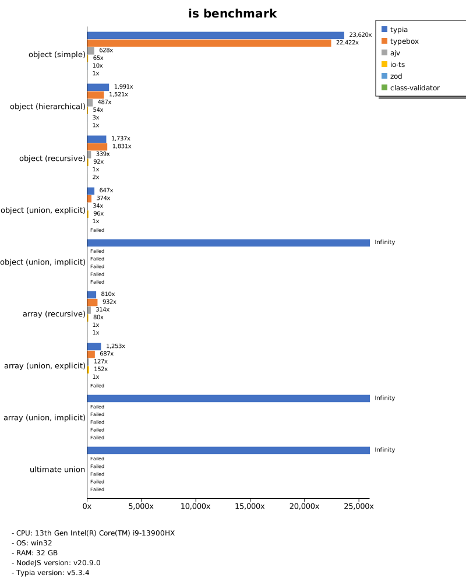
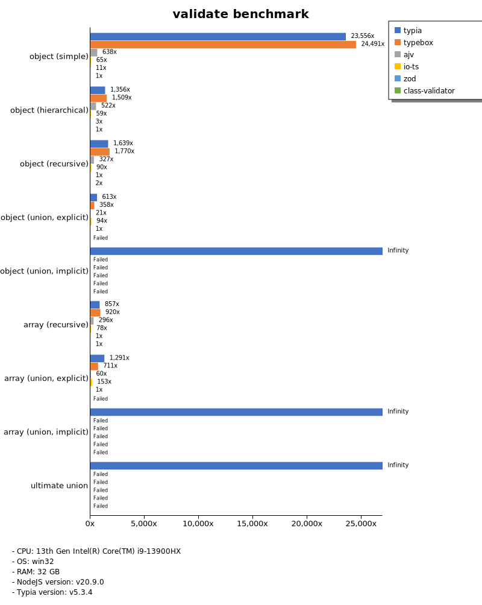
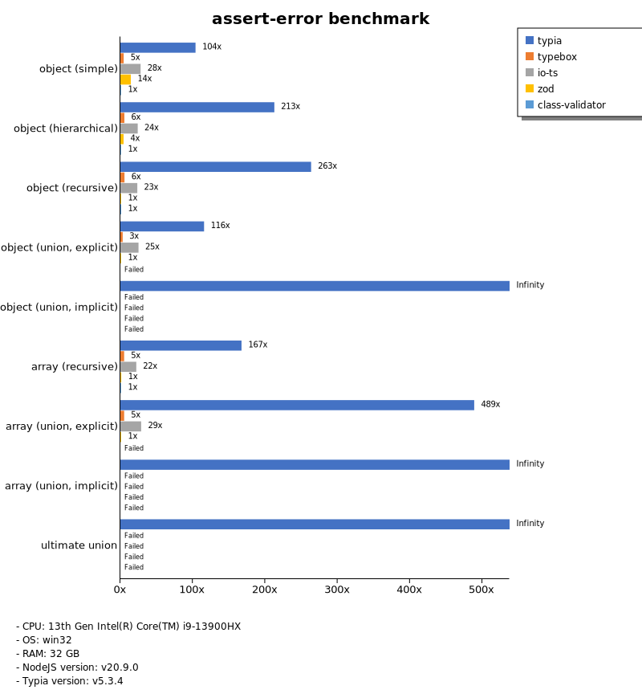
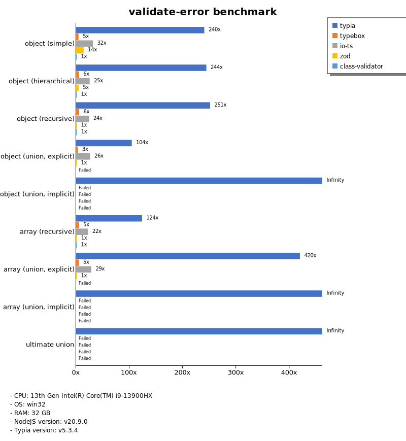
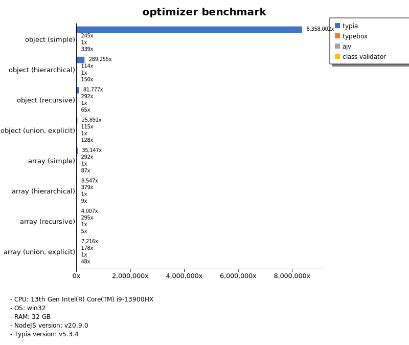
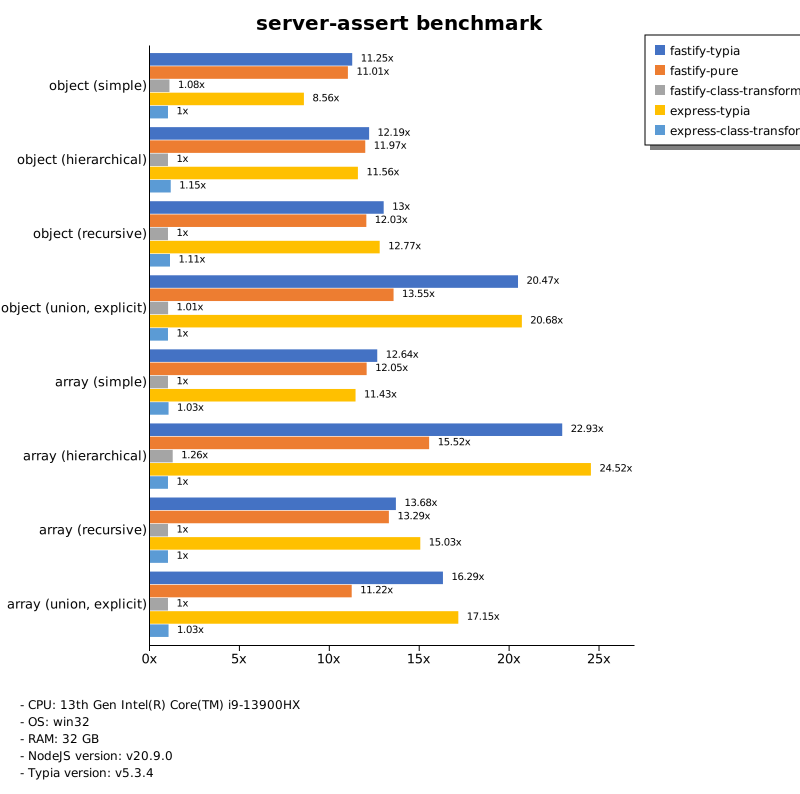
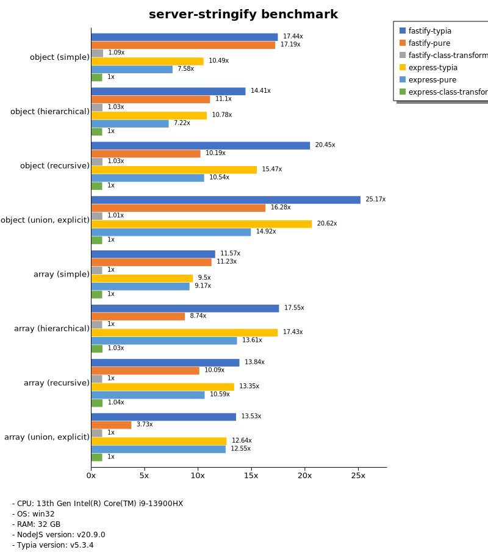

# Benchmark of `typia`
> - CPU: 13th Gen Intel(R) Core(TM) i9-13900HX
> - Memory: 32,508 MB
> - OS: win32
> - NodeJS version: v20.9.0
> - Typia version: v5.3.4

## is

 Types | typia | typebox | ajv | io-ts | zod | class-validator 
-------|------|------|------|------|------|------
 object (simple) | 270,666 | 256,932 | 7,197 | 745 | 119 | 11 
 object (hierarchical) | 43,407 | 33,153 | 10,616 | 1,179 | 70 | 22 
 object (recursive) | 20,434 | 21,534 | 3,985 | 1,080 | 12 | 21 
 object (union, explicit) | 4,413 | 2,556 | 231 | 658 | 6.83 |  -  
 object (union, implicit) | 3,730 |  -  |  -  |  -  |  -  |  -  
 array (recursive) | 11,108 | 12,791 | 4,309 | 1,093 | 14 | 16 
 array (union, explicit) | 3,767 | 2,066 | 382 | 456 | 3.01 |  -  
 array (union, implicit) | 3,704 |  -  |  -  |  -  |  -  |  -  
 ultimate union | 1,801 |  -  |  -  |  -  |  -  |  -  

> Unit: Megabytes/sec

## assert

 Types | typia | typebox | ajv | io-ts | zod | class-validator 
-------|------|------|------|------|------|------
 object (simple) | 276,750 | 287,687 | 7,460 | 756 | 115 | 11 
 object (hierarchical) | 32,731 | 30,798 | 10,582 | 1,239 | 70 | 22 
 object (recursive) | 19,699 | 20,874 | 3,986 | 1,077 | 12 | 20 
 object (union, explicit) | 4,121 | 2,423 | 229 | 636 | 6.85 |  -  
 object (union, implicit) | 3,824 |  -  |  -  |  -  |  -  |  -  
 array (recursive) | 11,338 | 12,616 | 4,331 | 1,083 | 14 | 17 
 array (union, explicit) | 3,811 | 2,154 | 393 | 460 | 3.01 |  -  
 array (union, implicit) | 3,604 |  -  |  -  |  -  |  -  |  -  
 ultimate union | 1,845 |  -  |  -  |  -  |  -  |  -  

> Unit: Megabytes/sec

## validate

 Types | typia | typebox | ajv | io-ts | zod | class-validator 
-------|------|------|------|------|------|------
 object (simple) | 274,645 | 285,558 | 7,438 | 757 | 123 | 12 
 object (hierarchical) | 28,489 | 31,686 | 10,962 | 1,235 | 70 | 21 
 object (recursive) | 19,643 | 21,217 | 3,915 | 1,075 | 12 | 21 
 object (union, explicit) | 4,180 | 2,441 | 145 | 640 | 6.81 |  -  
 object (union, implicit) | 3,737 |  -  |  -  |  -  |  -  |  -  
 array (recursive) | 12,057 | 12,949 | 4,166 | 1,099 | 14 | 17 
 array (union, explicit) | 3,910 | 2,154 | 180 | 462 | 3.03 |  -  
 array (union, implicit) | 3,695 |  -  |  -  |  -  |  -  |  -  
 ultimate union | 1,888 |  -  |  -  |  -  |  -  |  -  

> Unit: Megabytes/sec

## assert-error

 Types | typia | typebox | io-ts | zod | class-validator 
-------|------|------|------|------|------
 object (simple) | 782 | 35 | 210 | 109 | 7.53 
 object (hierarchical) | 3,143 | 82 | 354 | 65 | 15 
 object (recursive) | 2,867 | 62 | 254 | 11 | 13 
 object (union, explicit) | 766 | 21 | 166 | 6.63 |  -  
 object (union, implicit) | 530 |  -  |  -  |  -  |  -  
 array (recursive) | 1,896 | 59 | 249 | 14 | 11 
 array (union, explicit) | 1,446 | 15 | 85 | 2.96 |  -  
 array (union, implicit) | 1,362 |  -  |  -  |  -  |  -  
 ultimate union | 510 |  -  |  -  |  -  |  -  

> Unit: Megabytes/sec

## validate-error

 Types | typia | typebox | io-ts | zod | class-validator 
-------|------|------|------|------|------
 object (simple) | 1,843 | 35 | 242 | 107 | 7.67 
 object (hierarchical) | 3,596 | 82 | 374 | 67 | 15 
 object (recursive) | 2,738 | 63 | 264 | 11 | 13 
 object (union, explicit) | 682 | 22 | 171 | 6.53 |  -  
 object (union, implicit) | 459 |  -  |  -  |  -  |  -  
 array (recursive) | 1,410 | 62 | 254 | 15 | 11 
 array (union, explicit) | 1,278 | 16 | 87 | 3.04 |  -  
 array (union, implicit) | 1,053 |  -  |  -  |  -  |  -  
 ultimate union | 410 |  -  |  -  |  -  |  -  

> Unit: Megabytes/sec

## optimizer

 Types | typia | typebox | ajv | class-validator 
-------|------|------|------|------
 object (simple) | 287,777 | 8.45 | 0.03 | 12 
 object (hierarchical) | 43,486 | 17 | 0.15 | 22 
 object (recursive) | 26,206 | 94 | 0.32 | 21 
 object (union, explicit) | 4,266 | 19 | 0.16 | 21 
 array (simple) | 18,604 | 155 | 0.53 | 46 
 array (hierarchical) | 33,535 | 1,486 | 3.92 | 37 
 array (recursive) | 13,079 | 963 | 3.26 | 17 
 array (union, explicit) | 7,772 | 191 | 1.08 | 51 

> Unit: Megabytes/sec

## stringify

 Types | typia.stringify | typia.isStringify | typia.assertStringify | fast-json-stringify | JSON.stringify | class-transformer 
-------|------|------|------|------|------|------
 object (simple) | 2,045 | 1,784 | 1,722 | 688 | 124 | 11 
 object (hierarchical) | 880 | 858 | 827 | 520 | 203 | 21 
 object (recursive) | 869 | 844 | 842 | 249 | 212 | 18 
 object (union, explicit) | 299 | 264 | 266 | 213 | 147 | 8.20 
 array (simple) | 340 | 331 | 340 | 535 | 255 | 20 
 array (hierarchical) | 467 | 447 | 446 | 668 | 235 | 16 
 array (recursive) | 427 | 415 | 410 | 844 | 220 | 18 
 array (union, explicit) | 344 | 322 | 321 | 82 | 269 | 16 

> Unit: Megabytes/sec

## server-assert

 Types | fastify-typia | fastify-pure | fastify-class-transformer | express-typia | express-class-transformer 
-------|------|------|------|------|------
 object (simple) | 92 | 90 | 8.86 | 70 | 8.19 
 object (hierarchical) | 168 | 165 | 14 | 159 | 16 
 object (recursive) | 165 | 153 | 13 | 163 | 14 
 object (union, explicit) | 108 | 71 | 5.29 | 109 | 5.26 
 array (simple) | 152 | 145 | 12 | 137 | 12 
 array (hierarchical) | 146 | 99 | 8.01 | 156 | 6.35 
 array (recursive) | 136 | 132 | 9.97 | 150 | 9.95 
 array (union, explicit) | 157 | 108 | 9.66 | 166 | 9.97 

> Unit: Megabytes/sec

## server-stringify

 Types | fastify-typia | fastify-pure | fastify-class-transformer | express-typia | express-pure | express-class-transformer 
-------|------|------|------|------|------|------
 object (simple) | 156 | 154 | 9.70 | 94 | 68 | 8.94 
 object (hierarchical) | 266 | 205 | 19 | 199 | 133 | 18 
 object (recursive) | 267 | 133 | 13 | 202 | 138 | 13 
 object (union, explicit) | 177 | 114 | 7.12 | 145 | 105 | 7.02 
 array (simple) | 192 | 186 | 17 | 157 | 152 | 17 
 array (hierarchical) | 200 | 100 | 11 | 199 | 155 | 12 
 array (recursive) | 196 | 143 | 14 | 189 | 150 | 15 
 array (union, explicit) | 184 | 51 | 14 | 172 | 171 | 14 

> Unit: Megabytes/sec

## server-performance

 Types | fastify-typia | fastify-pure | fastify-class-transformer | express-typia | express-class-transformer 
-------|------|------|------|------|------
 object (simple) | 136 | 126 | 12 | 91 | 17 
 object (hierarchical) | 208 | 187 | 20 | 176 | 32 
 object (recursive) | 200 | 141 | 19 | 179 | 25 
 object (union, explicit) | 136 | 88 | 5.25 | 112 | 5.22 
 array (simple) | 173 | 167 | 13 | 143 | 12 
 array (hierarchical) | 149 | 96 | 8.89 | 134 | 7.40 
 array (recursive) | 146 | 148 | 14 | 141 | 20 
 array (union, explicit) | 161 | 66 | 9.87 | 155 | 9.87 

> Unit: Megabytes/sec

Total elapsed time: 4,238,325 ms
