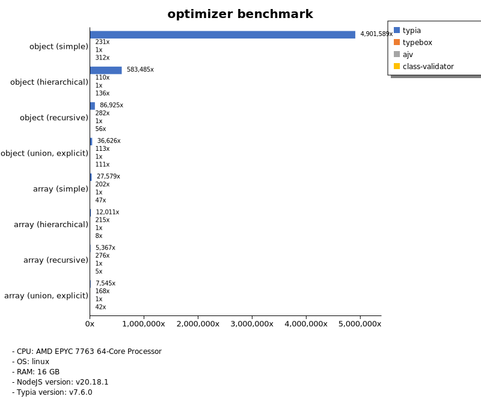

# Benchmark of `typia`
> - CPU: AMD EPYC 7763 64-Core Processor
> - Memory: 15,981 MB
> - OS: linux
> - NodeJS version: v20.18.1
> - Typia version: v7.6.0

## is

 Types | typia | typebox | ajv | io-ts | zod | class-validator 
-------|------|------|------|------|------|------
 object (simple) | 100,903 | 100,575 | 3,977 | 453 | 53 | 6.64 
 object (hierarchical) | 38,759 | 20,855 |  -  | 706 | 42 | 12 
 object (recursive) | 13,993 | 11,573 | 4,752 | 660 | 7.99 | 11 
 object (union, explicit) | 3,625 | 1,562 | 136 | 358 | 4.53 |  -  
 object (union, implicit) | 2,915 |  -  |  -  |  -  |  -  |  -  
 array (recursive) | 8,111 | 7,772 | 2,571 | 676 | 11 | 9.11 
 array (union, explicit) | 2,455 | 1,347 | 222 | 255 | 2.38 |  -  
 array (union, implicit) | 2,026 |  -  |  -  |  -  |  -  |  -  
 ultimate union | 900 |  -  |  -  |  -  |  -  |  -  

> Unit: Megabytes/sec

## assert

 Types | typia | typebox | ajv | io-ts | zod | class-validator 
-------|------|------|------|------|------|------
 object (simple) | 101,420 | 101,670 | 4,137 | 461 | 57 | 6.52 
 object (hierarchical) | 36,127 | 20,421 |  -  | 717 | 41 | 11 
 object (recursive) | 13,786 | 10,634 | 4,668 | 667 | 8.35 | 11 
 object (union, explicit) | 3,544 | 1,579 | 135 | 363 | 4.55 |  -  
 object (union, implicit) | 3,038 |  -  |  -  |  -  |  -  |  -  
 array (recursive) | 8,047 | 7,732 | 2,588 | 682 | 11 | 9.41 
 array (union, explicit) | 2,490 | 1,303 | 223 | 230 | 2.34 |  -  
 array (union, implicit) | 2,149 |  -  |  -  |  -  |  -  |  -  
 ultimate union | 890 |  -  |  -  |  -  |  -  |  -  

> Unit: Megabytes/sec

## validate

 Types | typia | typebox | ajv | io-ts | zod | class-validator 
-------|------|------|------|------|------|------
 object (simple) | 100,928 | 101,841 | 4,109 | 458 | 56 | 6.72 
 object (hierarchical) | 35,795 | 20,438 |  -  | 702 | 42 | 10 
 object (recursive) | 13,725 | 11,130 | 4,727 | 650 | 8.07 | 10 
 object (union, explicit) | 3,505 | 1,539 | 83 | 361 | 4.53 |  -  
 object (union, implicit) | 2,711 |  -  |  -  |  -  |  -  |  -  
 array (recursive) | 8,027 | 7,633 | 2,291 | 653 | 10 | 9.28 
 array (union, explicit) | 2,413 | 1,283 | 101 | 257 | 2.34 |  -  
 array (union, implicit) | 2,004 |  -  |  -  |  -  |  -  |  -  
 ultimate union | 885 |  -  |  -  |  -  |  -  |  -  

> Unit: Megabytes/sec

## assert-error

 Types | typia | typebox | io-ts | zod | class-validator 
-------|------|------|------|------|------
 object (simple) | 732 | 18 | 120 | 54 | 4.23 
 object (hierarchical) | 2,749 | 39 | 179 | 41 | 7.86 
 object (recursive) | 2,263 | 32 | 118 | 7.64 | 6.91 
 object (union, explicit) | 538 | 11 | 80 | 4.42 |  -  
 object (union, implicit) | 373 |  -  |  -  |  -  |  -  
 array (recursive) | 1,180 | 30 | 125 | 9.42 | 6.14 
 array (union, explicit) | 915 | 7.78 | 38 | 2.36 |  -  
 array (union, implicit) | 839 |  -  |  -  |  -  |  -  
 ultimate union | 214 |  -  |  -  |  -  |  -  

> Unit: Megabytes/sec

## validate-error

 Types | typia | typebox | io-ts | zod | class-validator 
-------|------|------|------|------|------
 object (simple) | 1,098 | 18 | 128 | 56 | 4.17 
 object (hierarchical) | 1,943 | 39 | 190 | 41 | 7.74 
 object (recursive) | 1,672 | 32 | 123 | 7.59 | 7.23 
 object (union, explicit) | 436 | 11 | 77 | 4.28 |  -  
 object (union, implicit) | 306 |  -  |  -  |  -  |  -  
 array (recursive) | 850 | 31 | 128 | 9.84 | 6.30 
 array (union, explicit) | 736 | 7.94 | 38 | 2.31 |  -  
 array (union, implicit) | 618 |  -  |  -  |  -  |  -  
 ultimate union | 187 |  -  |  -  |  -  |  -  

> Unit: Megabytes/sec

## optimizer

 Types | typia | typebox | ajv | class-validator 
-------|------|------|------|------
 object (simple) | 101,661 | 4.78 | 0.02 | 6.47 
 object (hierarchical) | 49,733 | 9.37 | 0.09 | 12 
 object (recursive) | 16,566 | 54 | 0.19 | 11 
 object (union, explicit) | 3,457 | 11 | 0.09 | 10 
 array (simple) | 14,248 | 104 | 0.52 | 24 
 array (hierarchical) | 28,216 | 506 | 2.35 | 19 
 array (recursive) | 10,725 | 552 | 2.00 | 9.01 
 array (union, explicit) | 4,849 | 108 | 0.64 | 27 

> Unit: Megabytes/sec

## stringify

 Types | typia.stringify | typia.isStringify | typia.assertStringify | fast-json-stringify | JSON.stringify | class-transformer 
-------|------|------|------|------|------|------
 object (simple) | 1,048 |  -  |  -  | 414 |  -  | 5.96 
 object (hierarchical) | 498 |  -  |  -  | 407 |  -  | 12 
 object (recursive) | 609 |  -  |  -  | 487 |  -  | 10 
 object (union, explicit) | 196 |  -  |  -  | 131 |  -  | 4.43 
 array (simple) | 214 |  -  |  -  | 325 |  -  | 11 
 array (hierarchical) | 291 |  -  |  -  | 474 |  -  | 8.81 
 array (recursive) | 253 |  -  |  -  | 497 |  -  | 9.69 
 array (union, explicit) | 233 |  -  |  -  | 48 |  -  | 8.40 

> Unit: Megabytes/sec

## server-assert

 Types | fastify-typia | fastify-pure | fastify-class-transformer | express-typia | express-class-transformer 
-------|------|------|------|------|------
 object (simple) | 59 | 58 | 5.05 | 41 | 4.62 
 object (hierarchical) | 118 | 110 | 9.09 | 106 | 8.58 
 object (recursive) | 109 | 105 | 7.64 | 102 | 7.38 
 object (union, explicit) | 68 | 43 | 3.07 | 63 | 3.09 
 array (simple) | 87 | 90 | 7.23 | 91 | 6.79 
 array (hierarchical) | 72 | 72 | 4.12 | 89 | 5.16 
 array (recursive) | 90 | 83 | 5.66 | 96 | 5.67 
 array (union, explicit) | 99 | 68 | 5.67 | 107 | 5.51 

> Unit: Megabytes/sec

## server-stringify

 Types | fastify-typia | fastify-pure | fastify-class-transformer | express-typia | express-pure | express-class-transformer 
-------|------|------|------|------|------|------
 object (simple) | 112 | 102 | 5.33 | 57 | 46 | 5.05 
 object (hierarchical) | 183 | 160 | 10 | 127 | 107 | 10 
 object (recursive) | 188 | 170 | 9.14 | 142 | 120 | 8.90 
 object (union, explicit) | 131 | 70 | 3.87 | 111 | 85 | 3.92 
 array (simple) | 115 | 127 | 9.12 | 105 | 112 | 8.89 
 array (hierarchical) | 142 | 61 | 5.45 | 140 | 132 | 5.22 
 array (recursive) | 128 | 83 | 7.92 | 124 | 123 | 7.82 
 array (union, explicit) | 128 | 30 | 7.49 | 120 | 137 | 7.40 

> Unit: Megabytes/sec

## server-performance

 Types | fastify-typia | fastify-pure | fastify-class-transformer | express-typia | express-class-transformer 
-------|------|------|------|------|------
 object (simple) | 90 | 83 | 6.75 | 60 | 6.85 
 object (hierarchical) | 146 | 111 | 12 | 130 | 18 
 object (recursive) | 138 | 130 | 10 | 127 | 15 
 object (union, explicit) | 93 | 54 | 3.09 | 84 | 3.07 
 array (simple) | 101 | 101 | 6.96 | 96 | 7.37 
 array (hierarchical) | 106 | 41 | 3.98 | 108 | 5.03 
 array (recursive) | 98 | 103 | 7.79 | 98 | 12 
 array (union, explicit) | 106 | 37 | 5.61 | 109 | 5.59 

> Unit: Megabytes/sec

Total elapsed time: 4,135,803 ms
