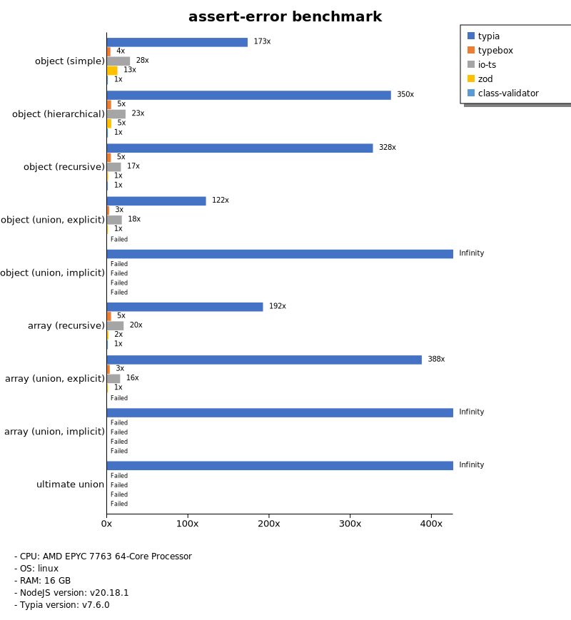

# Benchmark of `typia`
> - CPU: AMD EPYC 7763 64-Core Processor
> - Memory: 32,095 MB
> - OS: linux
> - NodeJS version: v20.3.0
> - Typia version: v4.1.8

## is

 Types | typia | typebox | ajv | io-ts | zod | class-validator 
-------|------|------|------|------|------|------
 object (simple) | 100,471 | 99,740 | 4,248 | 453 | 62 | 6.54 
 object (hierarchical) | 21,409 | 21,533 | 5,445 | 725 | 44 | 12 
 object (recursive) | 11,339 | 11,504 | 2,869 | 690 | 8.77 | 11 
 object (union, explicit) | 2,574 | 1,514 | 139 | 371 | 4.59 |  -  
 object (union, implicit) | 2,119 |  -  |  -  |  -  |  -  |  -  
 array (recursive) | 6,318 | 7,799 | 2,608 | 692 | 11 | 9.46 
 array (union, explicit) | 2,292 | 1,347 | 225 | 258 | 2.39 |  -  
 array (union, implicit) | 2,043 |  -  |  -  |  -  |  -  |  -  
 ultimate union | 675 |  -  |  -  |  -  |  -  |  -  

> Unit: Megabytes/sec

## assert

 Types | typia | typebox | ajv | io-ts | zod | class-validator 
-------|------|------|------|------|------|------
 object (simple) | 99,595 | 99,675 | 4,343 | 473 | 59 | 6.74 
 object (hierarchical) | 30,181 | 20,868 | 5,618 | 719 | 44 | 8.17 
 object (recursive) | 10,957 | 11,543 | 3,011 | 677 | 9.15 | 11 
 object (union, explicit) | 2,544 | 1,571 | 137 | 378 | 4.53 |  -  
 object (union, implicit) | 2,161 |  -  |  -  |  -  |  -  |  -  
 array (recursive) | 6,402 | 7,917 | 2,565 | 695 | 11 | 9.32 
 array (union, explicit) | 2,484 | 1,281 | 230 | 258 | 2.39 |  -  
 array (union, implicit) | 2,054 |  -  |  -  |  -  |  -  |  -  
 ultimate union | 679 |  -  |  -  |  -  |  -  |  -  

> Unit: Megabytes/sec

## validate

 Types | typia | typebox | ajv | io-ts | zod | class-validator 
-------|------|------|------|------|------|------
 object (simple) | 98,495 | 100,117 | 4,280 | 475 | 61 | 6.79 
 object (hierarchical) | 17,019 | 20,903 | 5,109 | 727 | 44 | 12 
 object (recursive) | 11,058 | 11,637 | 2,859 | 669 | 9.21 | 12 
 object (union, explicit) | 2,598 | 1,562 | 85 | 373 | 4.57 |  -  
 object (union, implicit) | 2,256 |  -  |  -  |  -  |  -  |  -  
 array (recursive) | 7,046 | 7,913 | 2,351 | 689 | 11 | 9.47 
 array (union, explicit) | 2,485 | 1,355 | 105 | 260 | 2.40 |  -  
 array (union, implicit) | 2,040 |  -  |  -  |  -  |  -  |  -  
 ultimate union | 680 |  -  |  -  |  -  |  -  |  -  

> Unit: Megabytes/sec

## assert-error

 Types | typia | typebox | io-ts | zod | class-validator 
-------|------|------|------|------|------
 object (simple) | 695 | 25 | 127 | 61 | 4.25 
 object (hierarchical) | 2,495 | 58 | 201 | 43 | 7.86 
 object (recursive) | 2,145 | 43 | 149 | 8.59 | 7.35 
 object (union, explicit) | 476 | 18 | 91 | 4.42 |  -  
 object (union, implicit) | 345 |  -  |  -  |  -  |  -  
 array (recursive) | 1,221 | 47 | 156 | 11 | 6.34 
 array (union, explicit) | 930 | 12 | 46 | 2.37 |  -  
 array (union, implicit) | 787 |  -  |  -  |  -  |  -  
 ultimate union | 222 |  -  |  -  |  -  |  -  

> Unit: Megabytes/sec

## validate-error

 Types | typia | typebox | io-ts | zod | class-validator 
-------|------|------|------|------|------
 object (simple) | 1,120 | 25 | 137 | 61 | 4.38 
 object (hierarchical) | 1,823 | 59 | 211 | 42 | 7.99 
 object (recursive) | 1,581 | 42 | 152 | 8.75 | 7.26 
 object (union, explicit) | 403 | 18 | 93 | 4.44 |  -  
 object (union, implicit) | 277 |  -  |  -  |  -  |  -  
 array (recursive) | 914 | 47 | 153 | 11 | 6.33 
 array (union, explicit) | 725 | 12 | 45 | 2.36 |  -  
 array (union, implicit) | 582 |  -  |  -  |  -  |  -  
 ultimate union | 180 |  -  |  -  |  -  |  -  

> Unit: Megabytes/sec

## optimizer

 Types | typia | typebox | ajv | class-validator 
-------|------|------|------|------
 object (simple) | 99,851 | 5.42 | 0.02 | 6.54 
 object (hierarchical) | 32,561 | 10 | 0.09 | 12 
 object (recursive) | 13,133 | 43 | 0.20 | 11 
 object (union, explicit) | 2,578 | 12 | 0.10 | 6.42 
 array (simple) | 9,851 | 139 | 0.17 | 24 
 array (hierarchical) | 18,628 | 1,502 | 5.11 | 20 
 array (recursive) | 7,707 | 490 | 2.08 | 6.75 
 array (union, explicit) | 4,587 | 121 | 0.64 | 28 

> Unit: Megabytes/sec

## stringify

 Types | typia.stringify | typia.isStringify | typia.assertStringify | fast-json-stringify | JSON.stringify | class-transformer 
-------|------|------|------|------|------|------
 object (simple) | 1,340 | 1,099 | 1,020 | 402 | 124 | 6.14 
 object (hierarchical) | 436 | 430 | 421 | 315 | 180 | 12 
 object (recursive) | 598 | 561 | 542 | 165 | 201 | 10 
 object (union, explicit) | 189 | 170 | 166 | 132 | 123 | 4.54 
 array (simple) | 205 | 206 | 204 | 332 | 195 | 11 
 array (hierarchical) | 297 | 280 | 287 | 451 | 207 | 8.88 
 array (recursive) | 252 | 247 | 244 | 502 | 187 | 10 
 array (union, explicit) | 210 | 201 | 194 | 50 | 227 | 8.54 

> Unit: Megabytes/sec

## server-assert

 Types | fastify-typia | fastify-pure | fastify-class-transformer | express-typia | express-class-transformer 
-------|------|------|------|------|------
 object (simple) | 65 | 63 | 5.23 | 46 | 4.94 
 object (hierarchical) | 123 | 116 | 9.35 | 112 | 9.11 
 object (recursive) | 109 | 106 | 7.91 | 104 | 7.88 
 object (union, explicit) | 70 | 45 | 3.36 | 69 | 3.35 
 array (simple) | 101 | 97 | 8.04 | 100 | 8.14 
 array (hierarchical) | 81 | 68 | 5.67 | 108 | 4.83 
 array (recursive) | 97 | 92 | 6.44 | 102 | 6.35 
 array (union, explicit) | 107 | 70 | 6.24 | 113 | 6.13 

> Unit: Megabytes/sec

## server-stringify

 Types | fastify-typia | fastify-pure | fastify-class-transformer | express-typia | express-pure | express-class-transformer 
-------|------|------|------|------|------|------
 object (simple) | 121 | 113 | 5.50 | 60 | 52 | 5.19 
 object (hierarchical) | 177 | 143 | 10 | 137 | 116 | 10 
 object (recursive) | 191 | 89 | 9.54 | 156 | 133 | 8.79 
 object (union, explicit) | 133 | 77 | 4.01 | 112 | 88 | 3.94 
 array (simple) | 145 | 124 | 9.44 | 123 | 131 | 9.56 
 array (hierarchical) | 177 | 66 | 6.01 | 159 | 146 | 7.47 
 array (recursive) | 151 | 96 | 8.27 | 139 | 135 | 8.07 
 array (union, explicit) | 147 | 32 | 7.84 | 130 | 154 | 7.73 

> Unit: Megabytes/sec

## server-performance

 Types | fastify-typia | fastify-pure | fastify-class-transformer | express-typia | express-class-transformer 
-------|------|------|------|------|------
 object (simple) | 92 | 89 | 6.70 | 61 | 9.63 
 object (hierarchical) | 147 | 132 | 12 | 124 | 18 
 object (recursive) | 140 | 95 | 11 | 126 | 16 
 object (union, explicit) | 91 | 57 | 3.29 | 79 | 3.07 
 array (simple) | 116 | 114 | 7.24 | 102 | 7.64 
 array (hierarchical) | 120 | 49 | 3.88 | 99 | 5.17 
 array (recursive) | 112 | 109 | 8.52 | 112 | 13 
 array (union, explicit) | 119 | 42 | 6.24 | 116 | 6.13 

> Unit: Megabytes/sec

Total elapsed time: 4,249,718 ms
