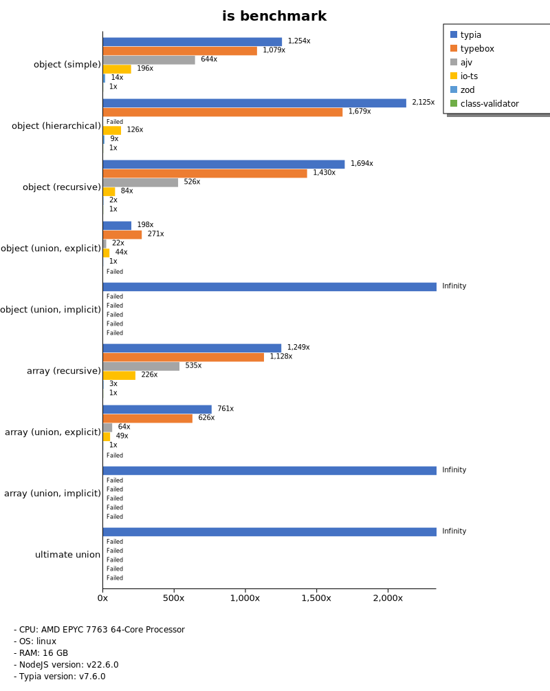
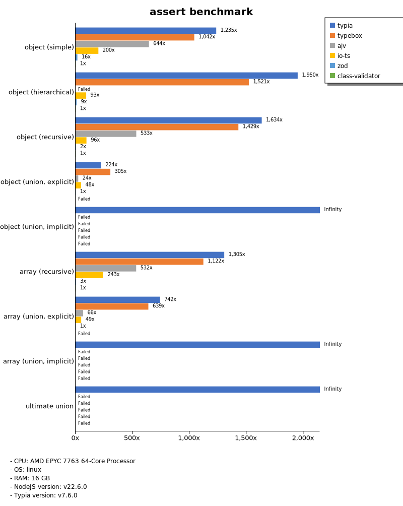
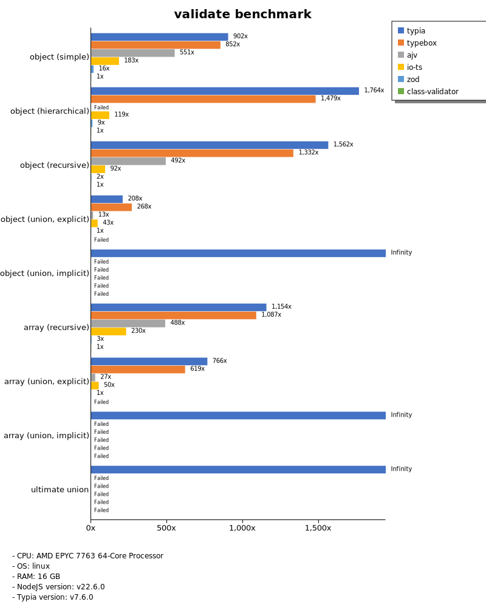
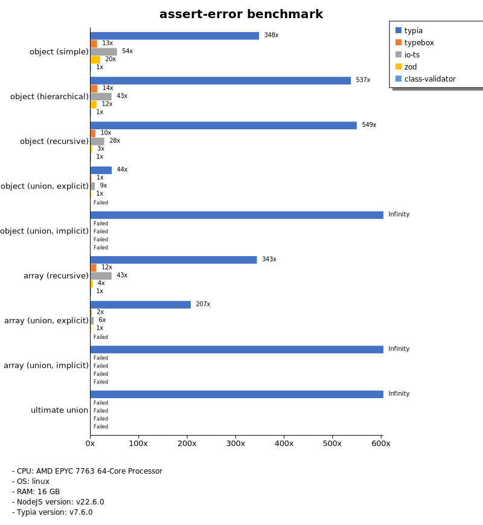
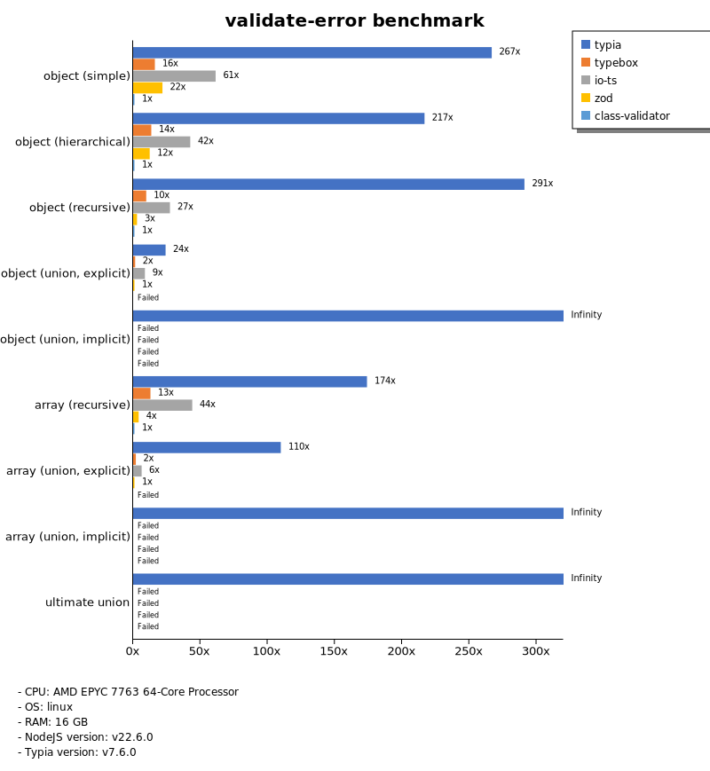
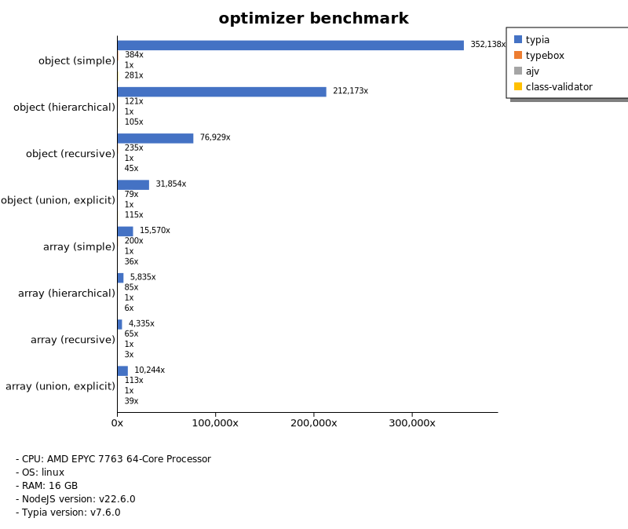
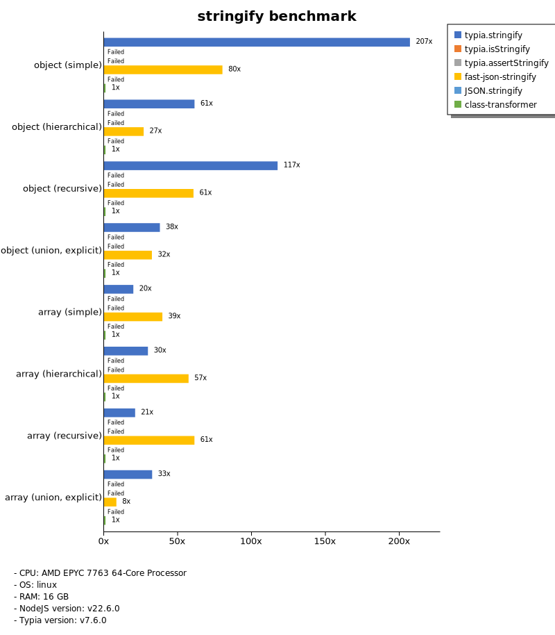

# Benchmark of `typia`
> - CPU: AMD EPYC 7763 64-Core Processor
> - Memory: 15,981 MB
> - OS: linux
> - Bun.JS
> - Typia version: v7.6.0

## is

 Types | typia | typebox | ajv | io-ts | zod | class-validator 
-------|------|------|------|------|------|------
 object (simple) | 6,130 | 5,275 | 3,149 | 958 | 69 | 4.89 
 object (hierarchical) | 15,966 | 12,612 |  -  | 944 | 69 | 7.51 
 object (recursive) | 12,265 | 10,354 | 3,806 | 606 | 16 | 7.24 
 object (union, explicit) | 2,599 | 3,560 | 285 | 581 | 13 |  -  
 object (union, implicit) | 3,017 |  -  |  -  |  -  |  -  |  -  
 array (recursive) | 6,779 | 6,119 | 2,903 | 1,227 | 15 | 5.43 
 array (union, explicit) | 5,170 | 4,255 | 432 | 332 | 6.80 |  -  
 array (union, implicit) | 4,153 |  -  |  -  |  -  |  -  |  -  
 ultimate union | 1,232 |  -  |  -  |  -  |  -  |  -  

> Unit: Megabytes/sec

## assert

 Types | typia | typebox | ajv | io-ts | zod | class-validator 
-------|------|------|------|------|------|------
 object (simple) | 5,862 | 4,947 | 3,059 | 951 | 76 | 4.75 
 object (hierarchical) | 15,523 | 12,109 |  -  | 743 | 69 | 7.96 
 object (recursive) | 11,812 | 10,331 | 3,851 | 691 | 16 | 7.23 
 object (union, explicit) | 2,691 | 3,669 | 283 | 579 | 12 |  -  
 object (union, implicit) | 3,085 |  -  |  -  |  -  |  -  |  -  
 array (recursive) | 7,003 | 6,020 | 2,854 | 1,305 | 15 | 5.37 
 array (union, explicit) | 5,050 | 4,349 | 452 | 337 | 6.81 |  -  
 array (union, implicit) | 4,152 |  -  |  -  |  -  |  -  |  -  
 ultimate union | 1,252 |  -  |  -  |  -  |  -  |  -  

> Unit: Megabytes/sec

## validate

 Types | typia | typebox | ajv | io-ts | zod | class-validator 
-------|------|------|------|------|------|------
 object (simple) | 4,377 | 4,131 | 2,671 | 890 | 79 | 4.85 
 object (hierarchical) | 13,904 | 11,654 |  -  | 941 | 68 | 7.88 
 object (recursive) | 11,517 | 9,821 | 3,624 | 681 | 16 | 7.37 
 object (union, explicit) | 2,679 | 3,455 | 167 | 558 | 13 |  -  
 object (union, implicit) | 3,037 |  -  |  -  |  -  |  -  |  -  
 array (recursive) | 6,361 | 5,991 | 2,688 | 1,270 | 15 | 5.51 
 array (union, explicit) | 5,180 | 4,187 | 183 | 338 | 6.77 |  -  
 array (union, implicit) | 4,066 |  -  |  -  |  -  |  -  |  -  
 ultimate union | 1,246 |  -  |  -  |  -  |  -  |  -  

> Unit: Megabytes/sec

## assert-error

 Types | typia | typebox | io-ts | zod | class-validator 
-------|------|------|------|------|------
 object (simple) | 1,006 | 39 | 158 | 57 | 2.89 
 object (hierarchical) | 2,420 | 63 | 195 | 56 | 4.51 
 object (recursive) | 2,366 | 43 | 121 | 13 | 4.31 
 object (union, explicit) | 462 | 16 | 93 | 11 |  -  
 object (union, implicit) | 412 |  -  |  -  |  -  |  -  
 array (recursive) | 1,241 | 43 | 157 | 15 | 3.62 
 array (union, explicit) | 1,274 | 13 | 39 | 6.17 |  -  
 array (union, implicit) | 940 |  -  |  -  |  -  |  -  
 ultimate union | 290 |  -  |  -  |  -  |  -  

> Unit: Megabytes/sec

## validate-error

 Types | typia | typebox | io-ts | zod | class-validator 
-------|------|------|------|------|------
 object (simple) | 711 | 43 | 164 | 58 | 2.67 
 object (hierarchical) | 995 | 62 | 195 | 57 | 4.59 
 object (recursive) | 1,324 | 44 | 125 | 13 | 4.55 
 object (union, explicit) | 259 | 16 | 94 | 11 |  -  
 object (union, implicit) | 255 |  -  |  -  |  -  |  -  
 array (recursive) | 619 | 46 | 156 | 15 | 3.56 
 array (union, explicit) | 698 | 13 | 40 | 6.35 |  -  
 array (union, implicit) | 569 |  -  |  -  |  -  |  -  
 ultimate union | 175 |  -  |  -  |  -  |  -  

> Unit: Megabytes/sec

## optimizer

 Types | typia | typebox | ajv | class-validator 
-------|------|------|------|------
 object (simple) | 6,072 | 6.62 | 0.02 | 4.84 
 object (hierarchical) | 15,830 | 9.06 | 0.07 | 7.87 
 object (recursive) | 12,455 | 38 | 0.16 | 7.30 
 object (union, explicit) | 2,614 | 6.50 | 0.08 | 9.45 
 array (simple) | 8,103 | 104 | 0.52 | 19 
 array (hierarchical) | 13,958 | 203 | 2.39 | 15 
 array (recursive) | 6,829 | 103 | 1.58 | 5.31 
 array (union, explicit) | 5,401 | 60 | 0.53 | 20 

> Unit: Megabytes/sec

## stringify

 Types | typia.stringify | typia.isStringify | typia.assertStringify | fast-json-stringify | JSON.stringify | class-transformer 
-------|------|------|------|------|------|------
 object (simple) | 1,131 |  -  |  -  | 438 |  -  | 5.47 
 object (hierarchical) | 659 |  -  |  -  | 288 |  -  | 11 
 object (recursive) | 1,065 |  -  |  -  | 549 |  -  | 9.07 
 object (union, explicit) | 162 |  -  |  -  | 138 |  -  | 4.28 
 array (simple) | 210 |  -  |  -  | 418 |  -  | 11 
 array (hierarchical) | 232 |  -  |  -  | 448 |  -  | 7.83 
 array (recursive) | 165 |  -  |  -  | 480 |  -  | 7.85 
 array (union, explicit) | 248 |  -  |  -  | 64 |  -  | 7.64 

> Unit: Megabytes/sec

Total elapsed time: 1,325,210 ms
