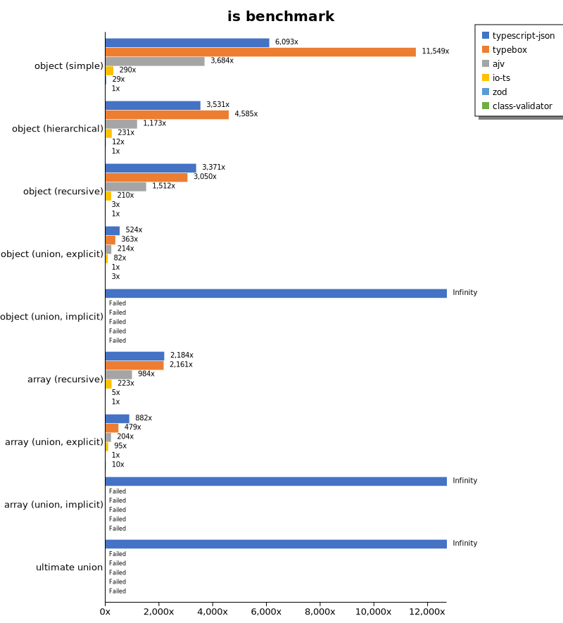
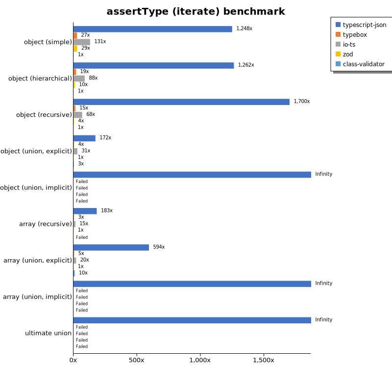
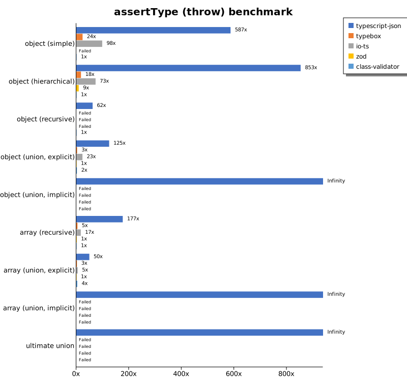
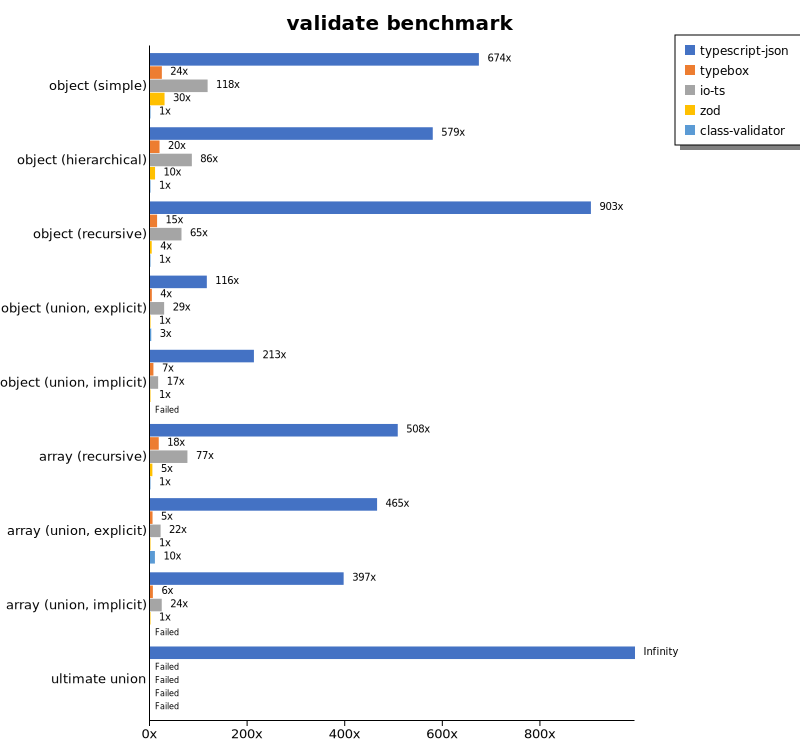
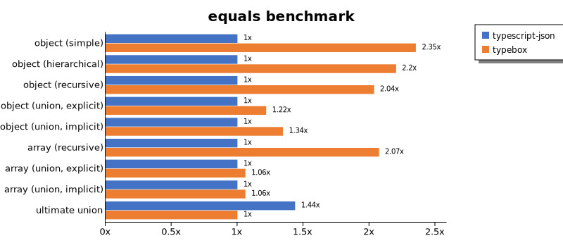
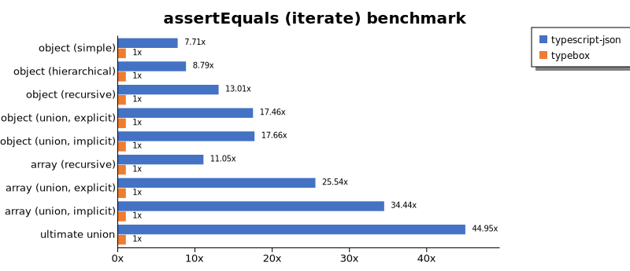
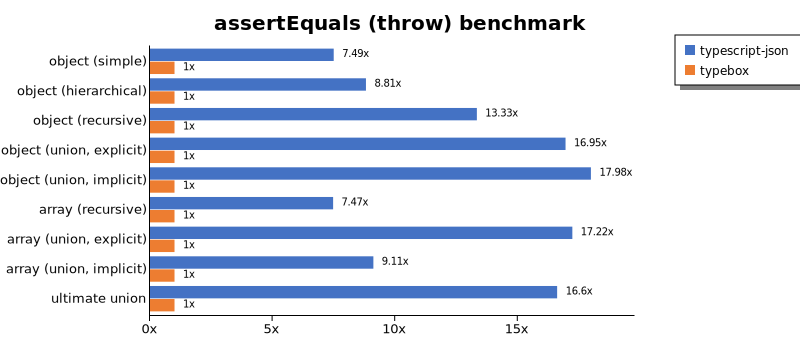
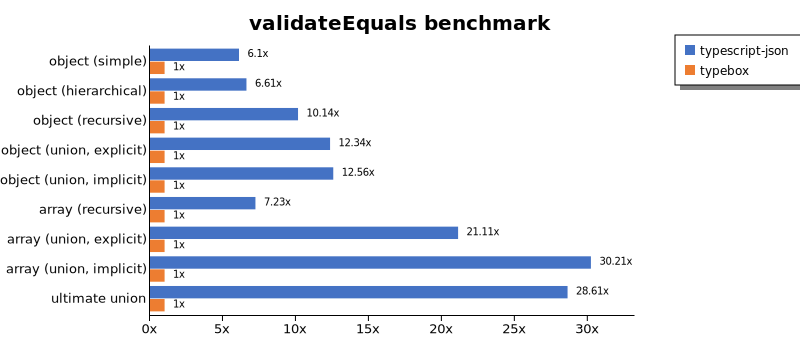
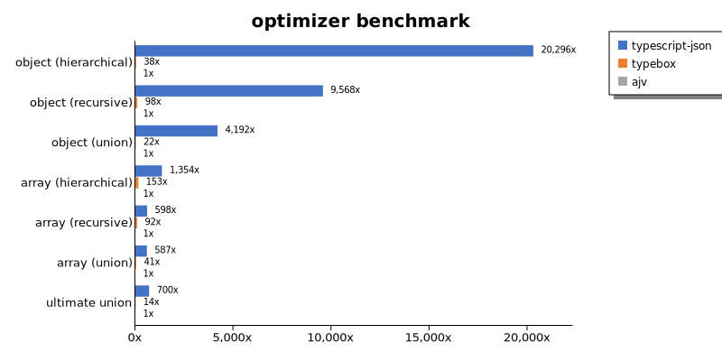
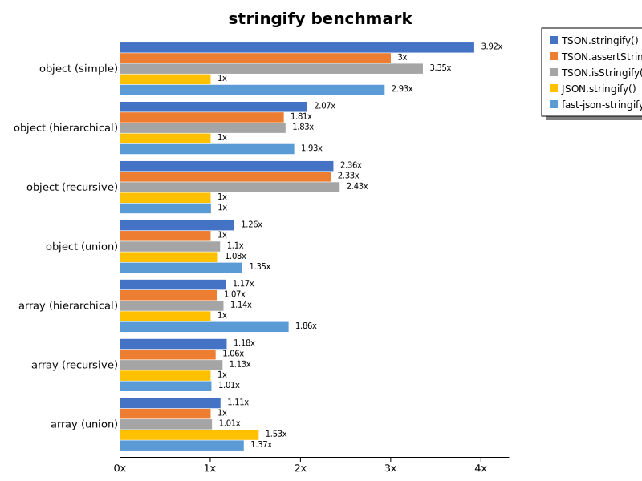

# Benchmark of `typescript-json`
> - CPU: AMD Ryzen 5 5600X 6-Core Processor
> - Memory: 31,980 MB
> - OS: linux
> - TypeScript-JSON version: 3.3.20

## is

 Components | typescript-json | typebox | ajv | io-ts | zod | class-validator 
------------|-----------------|---------|-----|-------|-----|-----------------
object (simple) | 968687.8674505611 | 1836061.3485630066 | 585597.9001657764 | 46026.71480144404 | 4579.69952363503 | 158.97525881733637
object (hierarchical) | 167767.52767527677 | 217868.3628318584 | 55724.301624977175 | 10958.096980786826 | 557.2492024104927 | 47.51381215469614
object (recursive) | 106074.43664573328 | 95957.66016713092 | 47568.15286624203 | 6596.902083717499 | 101.15967885816235 | 31.466566772803894
object (union, explicit) | 23668.977144998127 | 16363.483146067414 | 9649.695231265687 | 3685.3146853146854 | 45.13372956909361 | 113.3190118152524
object (union, implicit) | 20623.580620741865 | Failed | Failed | Failed | Failed | Failed
array (recursive) | 6127.7405327052 | 6062.761506276151 | 2759.911488106214 | 626.5752409191994 | 13.266998341625207 | 2.8053113895642414
array (union, explicit) | 3985.0166481687015 | 2162.0516632596173 | 921.2860310421287 | 429.45359281437123 | 4.517221908526256 | 44.10101771579344
array (union, implicit) | 2082.626337144965 | Failed | Failed | Failed | Failed | Failed
ultimate union | 618.0709534368071 | Failed | Failed | Failed | Failed | Failed

## assertType (iterate)

 Components | typescript-json | typebox | io-ts | zod | class-validator 
------------|-----------------|---------|-------|-----|-----------------
object (simple) | 182787.7813504823 | 4012.756516916251 | 19154.238248064943 | 4221.389396709324 | 146.42324888226528
object (hierarchical) | 61705.09090909091 | 941.9366581725519 | 4313.732857411234 | 503.7621581941641 | 48.885559093463186
object (recursive) | 53056.62117299889 | 460.2968460111317 | 2129.5852534562214 | 109.86547085201792 | 31.208624929071306
object (union, explicit) | 7726.232231862654 | 168.60143725815368 | 1376.5544989027067 | 44.80119469852529 | 116.70989255279734
object (union, implicit) | 7410.936654033567 | Failed | Failed | Failed | Failed
array (recursive) | 2486.7469879518076 | 46.0599334073252 | 201.24291719978066 | 13.597733711048159 | Failed
array (union, explicit) | 2695.9985179696187 | 22.841225626740947 | 92.30769230769229 | 4.541154210028383 | 43.614280456385714
array (union, implicit) | 1432.8358208955224 | Failed | Failed | Failed | Failed
ultimate union | 296.69734704926907 | Failed | Failed | Failed | Failed

## assertType (throw)

 Components | typescript-json | typebox | io-ts | zod | class-validator 
------------|-----------------|---------|-------|-----|-----------------
object (simple) | 88866.2844460884 | 3611.3657195233727 | 14916.314143829317 | Failed | 151.5151515151515
object (hierarchical) | 47267.05796038151 | 985.4964670881369 | 4058.350476902936 | 504.6728971962617 | 55.41189508681197
object (recursive) | 5786.163522012578 | Failed | Failed | Failed | 93.3009889904833
object (union, explicit) | 6694.409263614981 | 168.85553470919322 | 1251.1671335200745 | 53.62888809438684 | 131.2828207051763
object (union, implicit) | 5766.092475067997 | Failed | Failed | Failed | Failed
array (recursive) | 2135.958395245171 | 55.34034311012728 | 205.53064275037366 | 17.470300489168412 | 12.094823415578132
array (union, explicit) | 683.9186691312384 | 34.97726477789437 | 74.62686567164178 | 13.815971262779772 | 54.52562704471101
array (union, implicit) | 259.01942645698426 | Failed | Failed | Failed | Failed
ultimate union | 311.6978364503117 | Failed | Failed | Failed | Failed

## validate

 Components | typescript-json | typebox | io-ts | zod | class-validator 
------------|-----------------|---------|-------|-----|-----------------
object (simple) | 96763.25088339223 | 3488.0800727934484 | 16949.691415747147 | 4277.249860257127 | 143.58786993058092
object (hierarchical) | 28600.72202166065 | 965.3136531365315 | 4231.484927428359 | 510.7927056196502 | 49.3642483171279
object (recursive) | 28306.241749952856 | 455.3521907931226 | 2021.2844036697247 | 110.38107752956637 | 31.331592689295043
object (union, explicit) | 5329.90448199853 | 172.7425687044307 | 1325.7305773342837 | 45.771331700885284 | 116.60188784008884
object (union, implicit) | 4853.298153034301 | 159.64523281596453 | 380.11803762449284 | 22.792022792022795 | Failed
array (recursive) | 1422.7525569711106 | 50.2283105022831 | 214.89482660602616 | 13.68041041231237 | 2.802690582959641
array (union, explicit) | 2065.692079940785 | 23.163841807909606 | 96.40831758034028 | 4.439511653718091 | 44.71771939631079
array (union, implicit) | 1116.20294599018 | 16.565118050266566 | 67.71124790151092 | 2.813203300825206 | Failed
ultimate union | 199.7851772287862 | Failed | Failed | Failed | Failed

## equals

 Components | typescript-json | typebox 
------------|-----------------|---------
object (simple) | 27152.058554437328 | 63884.61538461539
object (hierarchical) | 7646.3747047065235 | 16845.357077957477
object (recursive) | 5735.534191910031 | 11678.610603290677
object (union, explicit) | 2922.5172790105494 | 3559.4250967385296
object (union, implicit) | 1864.0350877192982 | 2506.575291720689
array (recursive) | 494.0845070422535 | 1024.5376304706097
array (union, explicit) | 726.8408551068883 | 770.8638360175696
array (union, implicit) | 464.2528946884764 | 492.28224917309814
ultimate union | 303.85241454150844 | 211.3967283839655

## assertEquals (iterate)

 Components | typescript-json | typebox 
------------|-----------------|---------
object (simple) | 23977.902490354263 | 3109.612141652614
object (hierarchical) | 7477.09090909091 | 851.0558774060923
object (recursive) | 5240.837696335078 | 402.86032689450224
object (union, explicit) | 2284.7537706705434 | 130.8237048080507
object (union, implicit) | 1676.820475847152 | 94.95101733232856
array (recursive) | 458.2720588235294 | 41.47727272727272
array (union, explicit) | 492.769744160178 | 19.292604501607716
array (union, implicit) | 312.0658135283364 | 9.060022650056625
ultimate union | 228.1891495601173 | 5.0761421319796955

## assertEquals (throw)

 Components | typescript-json | typebox 
------------|-----------------|---------
object (simple) | 21199.625117150892 | 2829.486224869695
object (hierarchical) | 6980.994152046783 | 792.6267281105991
object (recursive) | 5032.377428307123 | 377.5009437523594
object (union, explicit) | 2206.693637366679 | 130.20833333333331
object (union, implicit) | 1676.1834592005894 | 93.21401938851604
array (recursive) | 408.3905698904771 | 54.68465184104995
array (union, explicit) | 312.2703894195444 | 18.12907904278463
array (union, implicit) | 145.66642388929353 | 15.98976654940838
ultimate union | 238.0952380952381 | 14.338973329509608

## validateEquals

 Components | typescript-json | typebox 
------------|-----------------|---------
object (simple) | 17169.762258543833 | 2815.584885192551
object (hierarchical) | 5338.04347826087 | 807.6708247998511
object (recursive) | 3870.950610727562 | 381.6254416961131
object (union, explicit) | 1570.934885412877 | 127.31351654514862
object (union, implicit) | 1167.5008938148014 | 92.97052154195012
array (recursive) | 300.6993006993007 | 41.619156214367166
array (union, explicit) | 391.7710196779964 | 18.556701030927837
array (union, implicit) | 258.2278481012658 | 8.547008547008549
ultimate union | 145.56848701880037 | 5.087620124364047

## optimizer

 Components | typescript-json | typebox | ajv 
------------|-----------------|---------|-----
object (hierarchical) | 114190.26311079292 | 214.93333333333334 | 5.626134301270418
object (recursive) | 94439.07875185735 | 969.8371576609919 | 9.870224821787607
object (union) | 21185.555757686012 | 110.08496490579978 | 5.053340819764178
array (hierarchical) | 10020.118124769288 | 1132.8082066312513 | 7.400555041628122
array (recursive) | 6156.747095621091 | 952.9456051195182 | 10.303484451105282
array (union) | 4132.558997050147 | 288.9177168272795 | 7.043558850787767
ultimate union | 649.916866802143 | 12.561441835062807 | 0.9278159213212098

## stringify

 Components | TSON.stringify() | TSON.assertStringify() | TSON.isStringify() | JSON.stringify() | fast-json-stringify 
------------|------------------|------------------------|--------------------|------------------|---------------------
object (simple) | 55228.190405630674 | 42211.45699023761 | 47217.031451167924 | 14085.345622119816 | 41248.903508771924
object (hierarchical) | 6293.858845096242 | 5504.017940571855 | 5563.226744186047 | 3039.553368660106 | 5854.969002442232
object (recursive) | 6113.3013674302965 | 6037.757009345794 | 6292.351274787536 | 2589.74358974359 | 2599.367324153331
object (union) | 1580.2650957290132 | 1253.8631346578366 | 1385.3998926462693 | 1354.5336547376228 | 1694.0515052593398
array (hierarchical) | 240.22346368715083 | 220.17353579175705 | 234.8824690471918 | 205.6232427366448 | 383.30241187384047
array (recursive) | 268.5890460645629 | 240.6970412053004 | 258.21681496277466 | 228.04085422469825 | 230.0337457817773
array (union) | 340.55224688684353 | 306.98360051593886 | 311.58645276292333 | 470.39909211272936 | 419.80344891526056

