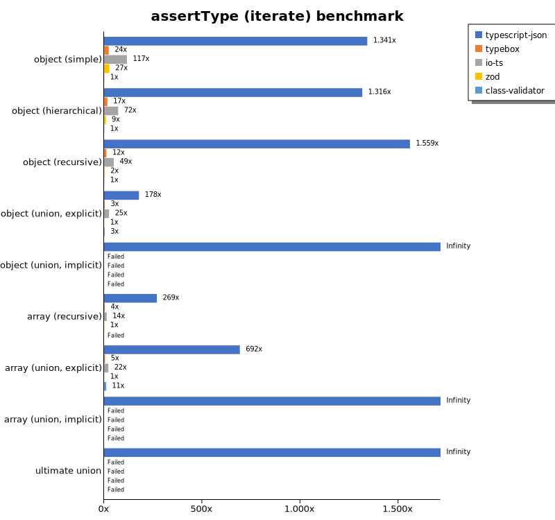
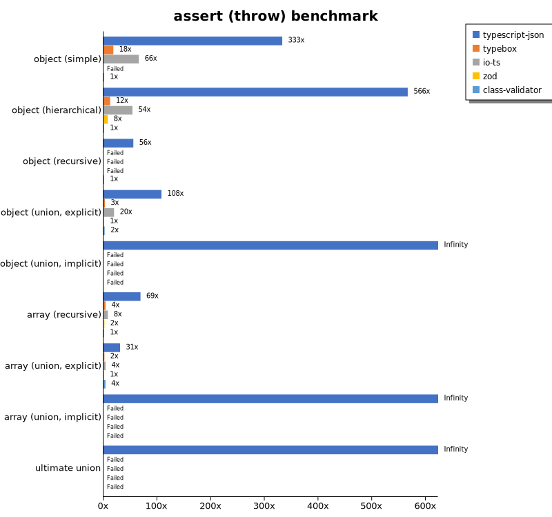
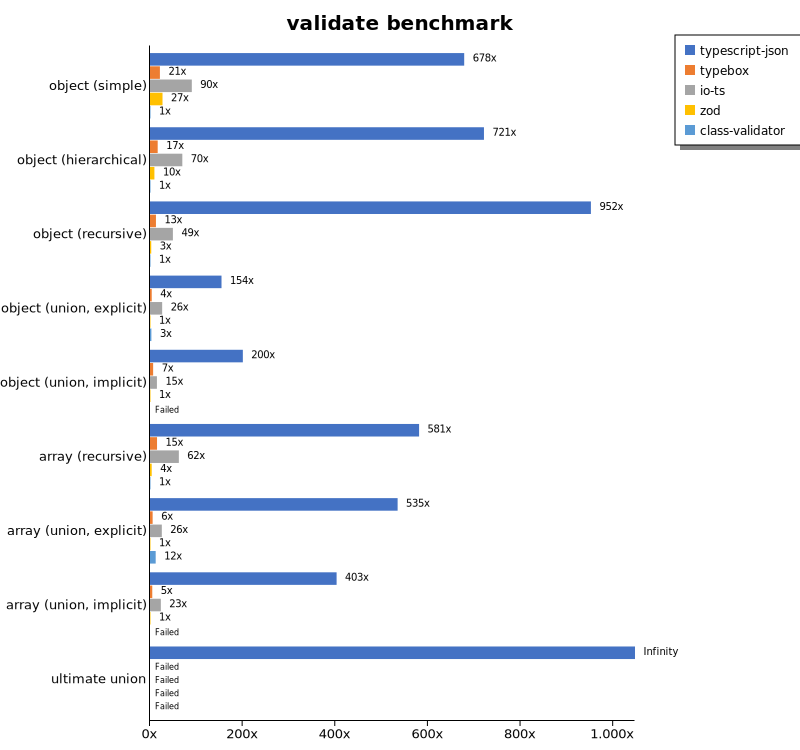
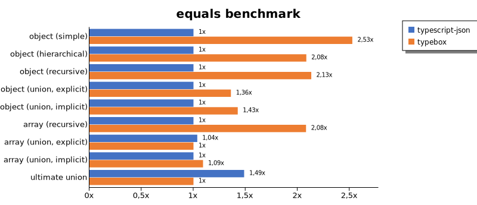
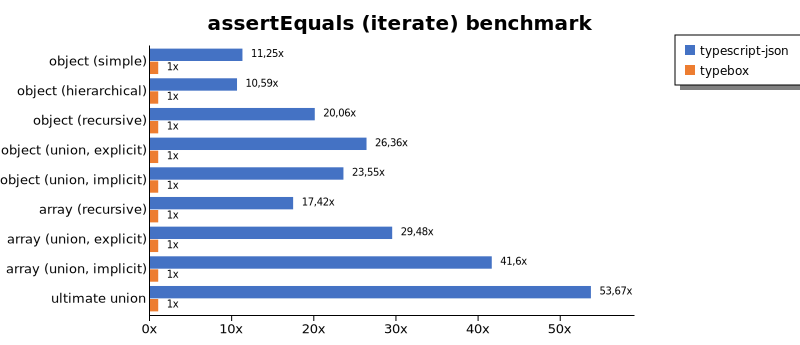
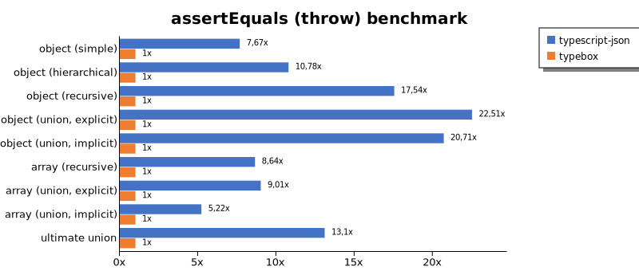
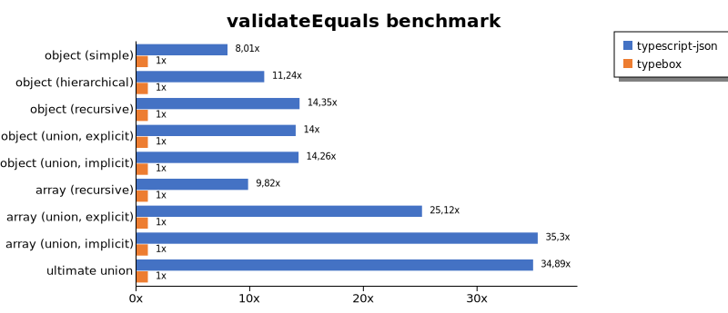
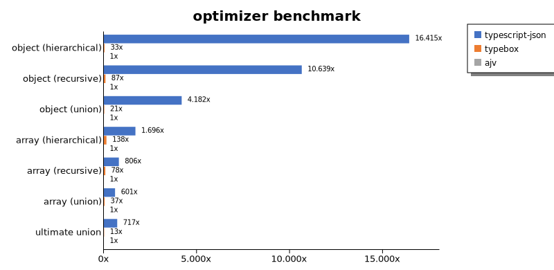
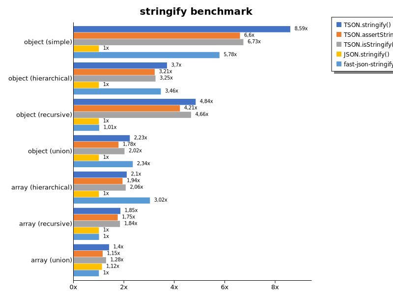

# Benchmark of `typescript-json`
> - CPU: AMD Ryzen 7 2700X Eight-Core Processor
> - Memory: 32.696 MB
> - TypeScript-JSON version: 3.3.20

## is

 Components | typescript-json | typebox | ajv | io-ts | zod | class-validator 
------------|-----------------|---------|-----|-------|-----|-----------------
object (simple) | 442714.44342226314 | 906115.5097613882 | 386985.8156028369 | 22098.859315589354 | 2556.893995552261 | 95.7558751315328
object (hierarchical) | 78402.2967216151 | 83927.54969347946 | 28595.663956639568 | 4665.00553709856 | 269.8722498225692 | 26.36879692364036
object (recursive) | 60669.764898851834 | 53141.37554585152 | 26201.11933562015 | 3210.6135986733007 | 41.55423637344846 | 17.004936917169502
object (union, explicit) | 12848.507462686568 | 8413.115968877362 | 4445.9172852598085 | 1932.1275405556592 | 21.973997436366965 | 65.09746230231703
object (union, implicit) | 12153.761669412412 | Failed | Failed | Failed | Failed | Failed
array (recursive) | 4439.148626523559 | 4310.370508285235 | 1447.208402432283 | 279.45205479452056 | 6.079587324981578 | 1.652285661832201
array (union, explicit) | 2503.776017682814 | 1341.5570175438595 | 485.3182564289623 | 216.46060158700868 | 2.1953896816684964 | 27.05749718151071
array (union, implicit) | 850.018268176836 | Failed | Failed | Failed | Failed | Failed
ultimate union | 397.02643171806164 | Failed | Failed | Failed | Failed | Failed

## assertType (iterate)

 Components | typescript-json | typebox | io-ts | zod | class-validator 
------------|-----------------|---------|-------|-----|-----------------
object (simple) | 110274.38370846731 | 1958.0805295091009 | 9580.989876265467 | 2240.67300658376 | 82.20699870394373
object (hierarchical) | 36145.270270270266 | 468.41349605168693 | 1974.307212332538 | 251.83630640083948 | 27.467496795458707
object (recursive) | 28299.341486359357 | 217.17171717171715 | 895.8873656909968 | 44.48198198198198 | 18.15431164901664
object (union, explicit) | 4131.076701476413 | 77.57197872730606 | 588.7694588584136 | 23.229461756373937 | 66.14785992217898
object (union, implicit) | 3946.308724832215 | Failed | Failed | Failed | Failed
array (recursive) | 1651.873951146746 | 22.10466654071415 | 83.13452009543036 | 6.1395348837209305 | Failed
array (union, explicit) | 1531.9740500463392 | 10.563380281690142 | 48.30460314453495 | 2.2140221402214024 | 24.430871737923376
array (union, implicit) | 625.689084895259 | Failed | Failed | Failed | Failed
ultimate union | 176.72886937431394 | Failed | Failed | Failed | Failed

## assertType (throw)

 Components | typescript-json | typebox | io-ts | zod | class-validator 
------------|-----------------|---------|-------|-----|-----------------
object (simple) | 30341.643582640812 | 1672.6179289607217 | 5989.536352155872 | Failed | 91.17432530999271
object (hierarchical) | 20156.774916013437 | 439.3190554640308 | 1916.212662032688 | 280.79371022089106 | 35.587188612099645
object (recursive) | 3043.3999639834324 | Failed | Failed | Failed | 54.7845142439737
object (union, explicit) | 3729.985443959243 | 91.37426900584794 | 679.3734666918285 | 34.560221185415585 | 73.31378299120233
object (union, implicit) | 3376.9063180827884 | Failed | Failed | Failed | Failed
array (recursive) | 631.85281546181 | 34.904013961605585 | 74.08779403593257 | 15.067048365225252 | 9.177679882525696
array (union, explicit) | 297.50836742283377 | 16.611295681063122 | 36.764705882352935 | 9.632055480639568 | 35.448422545196735
array (union, implicit) | 109.05125408942202 | Failed | Failed | Failed | Failed
ultimate union | 182.54837531945967 | Failed | Failed | Failed | Failed

## validate

 Components | typescript-json | typebox | io-ts | zod | class-validator 
------------|-----------------|---------|-------|-----|-----------------
object (simple) | 56266.24699129791 | 1772.2698471859858 | 7486.128739800544 | 2239.692138537658 | 82.94674336611617
object (hierarchical) | 20521.77163147075 | 472.4753919066716 | 1985.068985068985 | 270.509977827051 | 28.462998102466795
object (recursive) | 17238.831291234685 | 232.35014272121788 | 895.0801341781588 | 48.14954682779455 | 18.109790605546124
object (union, explicit) | 3567.327282830154 | 85.79545454545455 | 606.810569408262 | 23.107270336276535 | 68.64599092284418
object (union, implicit) | 2587.6307579372365 | 87.48824082784571 | 192.6866237211065 | 12.909260991580918 | Failed
array (recursive) | 968.432919954904 | 25.30933633295838 | 103.83960658218271 | 6.136110078095946 | 1.666975365808483
array (union, explicit) | 1177.0984081041968 | 12.48108925869894 | 56.21135469364812 | 2.201834862385321 | 26.996625421822273
array (union, implicit) | 652.338811630847 | 7.9275198187995475 | 37.87450537026568 | 1.6192875134940627 | Failed
ultimate union | 118.01566579634465 | Failed | Failed | Failed | Failed

## equals

 Components | typescript-json | typebox 
------------|-----------------|---------
object (simple) | 15803.81471389646 | 39935.28449372841
object (hierarchical) | 5711.3364055299535 | 11906.284053759533
object (recursive) | 4369.733924611974 | 9317.74647887324
object (union, explicit) | 1790.0968783638323 | 2434.193428624467
object (union, implicit) | 1198.5879797248372 | 1708.591190389516
array (recursive) | 333.7696335078534 | 694.8800302286038
array (union, explicit) | 490.3581267217631 | 473.0920682542659
array (union, implicit) | 273.48681767545486 | 298.60982391102874
ultimate union | 208.02139037433156 | 139.89917176809504

## assertEquals (iterate)

 Components | typescript-json | typebox 
------------|-----------------|---------
object (simple) | 15260.385363266749 | 1356.021897810219
object (hierarchical) | 4198.702936407854 | 396.3491776613049
object (recursive) | 3923.32268370607 | 195.5932815604118
object (union, explicit) | 1722.1431114275542 | 65.33776301218163
object (union, implicit) | 1242.1615639985246 | 52.75099262620533
array (recursive) | 385.67389255419414 | 22.133938706015893
array (union, explicit) | 284.7754654983571 | 9.65909090909091
array (union, implicit) | 188.04190751445088 | 4.519774011299436
ultimate union | 150.4297994269341 | 2.802690582959641

## assertEquals (throw)

 Components | typescript-json | typebox 
------------|-----------------|---------
object (simple) | 11019.283746556473 | 1437.3716632443532
object (hierarchical) | 4418.561656498428 | 409.75973179363007
object (recursive) | 3579.4183445190156 | 204.04377666481173
object (union, explicit) | 1633.0275229357799 | 72.54261878853826
object (union, implicit) | 1124.2067089755215 | 54.28881650380022
array (recursive) | 317.5789277040912 | 36.75119441381845
array (union, explicit) | 146.86983660730678 | 16.3025758069775
array (union, implicit) | 72.5031720137756 | 13.89854065323141
ultimate union | 145.1378809869376 | 11.082788429568879

## validateEquals

 Components | typescript-json | typebox 
------------|-----------------|---------
object (simple) | 11878.58439201452 | 1483.6565096952909
object (hierarchical) | 4529.652715939448 | 403.0517305545218
object (recursive) | 2838.093471810089 | 197.83299084625446
object (union, explicit) | 994.3211151264843 | 70.9992486851991
object (union, implicit) | 748.6855941114616 | 52.51270468661774
array (recursive) | 210.51696571327057 | 21.44066202745909
array (union, explicit) | 239.49134581419992 | 9.534492428491307
array (union, implicit) | 156.79628968961828 | 4.441976679622432
ultimate union | 96.28200631357419 | 2.759381898454746

## optimizer

 Components | typescript-json | typebox | ajv 
------------|-----------------|---------|-----
object (hierarchical) | 53693.86038687973 | 108.56643356643357 | 3.270943121933491
object (recursive) | 61344.04607096415 | 503.2444124008652 | 5.765765765765766
object (union) | 11779.390420899856 | 59.671162017365596 | 2.816372512204281
array (hierarchical) | 7065.2525615674995 | 575.1202994118696 | 4.165911972468756
array (recursive) | 4822.080120368629 | 469.3140794223827 | 5.984664297737049
array (union) | 2439.79628955984 | 149.49637745184663 | 4.060538944259874
ultimate union | 384.17058185760754 | 7.228044813877847 | 0.5355230274901821

## stringify

 Components | TSON.stringify() | TSON.assertStringify() | TSON.isStringify() | JSON.stringify() | fast-json-stringify 
------------|------------------|------------------------|--------------------|------------------|---------------------
object (simple) | 30937.07824183841 | 23755.774962742173 | 24241.197822141563 | 3600.9843237331393 | 20823.25581395349
object (hierarchical) | 3731.021555763824 | 3239.8585783401563 | 3271.9785138764546 | 1008.1547506163475 | 3485.6722997795737
object (recursive) | 3456.1977462740824 | 3010.8060230292294 | 3326.0590500641847 | 714.3904674610449 | 722.6781051846326
object (union) | 868.3091102445941 | 693.2580303565124 | 786.4537638182137 | 390.0181488203267 | 914.3676101755643
array (hierarchical) | 129.44162436548223 | 119.26438455935907 | 126.98123519766807 | 61.532792925571115 | 186.12737920937042
array (recursive) | 141.91540010986998 | 133.78176382660686 | 140.60446780551905 | 76.58482960791498 | 76.92307692307692
array (union) | 206.27062706270627 | 168.7859257968995 | 188.7032328369052 | 164.71245114461195 | 146.8895078922934

