# Benchmark of `typescript-json`
> CPU: AMD Ryzen 7 3700X 8-Core Processor
> Memory: 16,333 MB
> NodeJS version: v16.17.1
> TypeScript-JSON version: 3.3.18

## is
 Components | typescript-json | typebox | ajv | io-ts | zod | class-validator 
------------|-----------------|---------|-----|-------|-----|-----------------
object (simple) | 510931.52954168967 | 1051285.3949329357 | 458535.32008830016 | 28200.668275478005 | 3015.258855585831 | 140.47702560505087
object (hierarchical) | 100654.63641236376 | 127409.1249065071 | 32453.87453874539 | 6787.0404753063485 | 339.1445003594536 | 47.791455467052856
object (recursive) | 75202.52929142644 | 68551.99712126664 | 31571.612903225807 | 4234.5497891069135 | 53.7575425123423 | 30.253025302530254
object (union, explicit) | 17082.74187523347 | 10480.512249443207 | 5900.923295454546 | 2289.130434782609 | 27.81383274615242 | 82.06177893561593
object (union, implicit) | 14216.150690041028 | 1873.9051094890508 | Failed | Failed | 14.523937600860677 | 57.34292202876608
array (recursive) | 5761.267207241184 | 5399.89206691851 | 1979.558011049724 | 375.34346949990845 | 7.234279354479689 | 2.751283932501834
array (union, explicit) | 3305.498981670061 | 1769.8398085067206 | 607.6352067868504 | 267.63945326930184 | 2.2177046756606913 | 31.061746987951807
array (union, implicit) | 517.5246440306682 | 441.7143912802512 | 227.28110599078343 | Failed | 1.637256685464799 | 22.175890826383625
ultimate union | 445.05494505494505 | 154.11334552102377 | Failed | Failed | 0.46721694440118355 | Failed

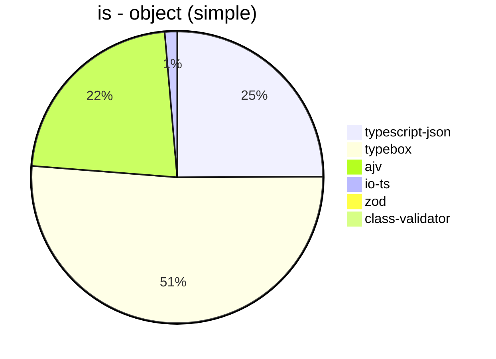
```mermaid
pie title is - object (simple)
  "typescript-json": 510931.52954168967
  "typebox": 1051285.3949329357
  "ajv": 458535.32008830016
  "io-ts": 28200.668275478005
  "zod": 3015.258855585831
  "class-validator": 140.47702560505087
```

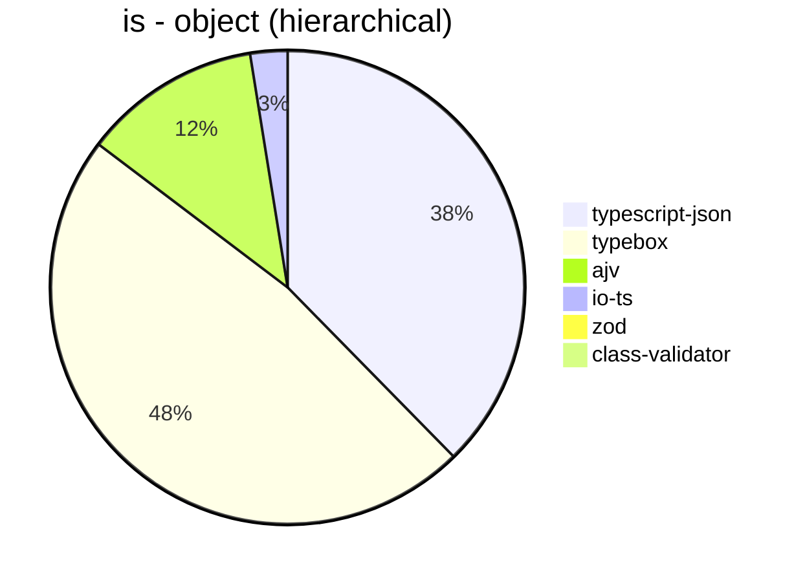
```mermaid
pie title is - object (hierarchical)
  "typescript-json": 100654.63641236376
  "typebox": 127409.1249065071
  "ajv": 32453.87453874539
  "io-ts": 6787.0404753063485
  "zod": 339.1445003594536
  "class-validator": 47.791455467052856
```

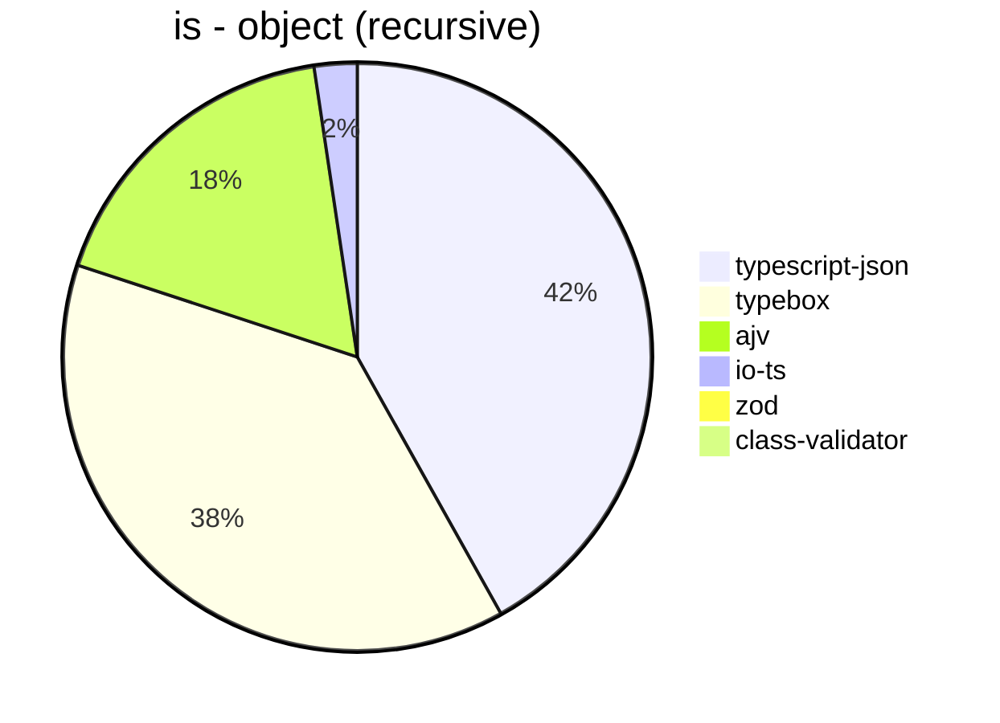
```mermaid
pie title is - object (recursive)
  "typescript-json": 75202.52929142644
  "typebox": 68551.99712126664
  "ajv": 31571.612903225807
  "io-ts": 4234.5497891069135
  "zod": 53.7575425123423
  "class-validator": 30.253025302530254
```

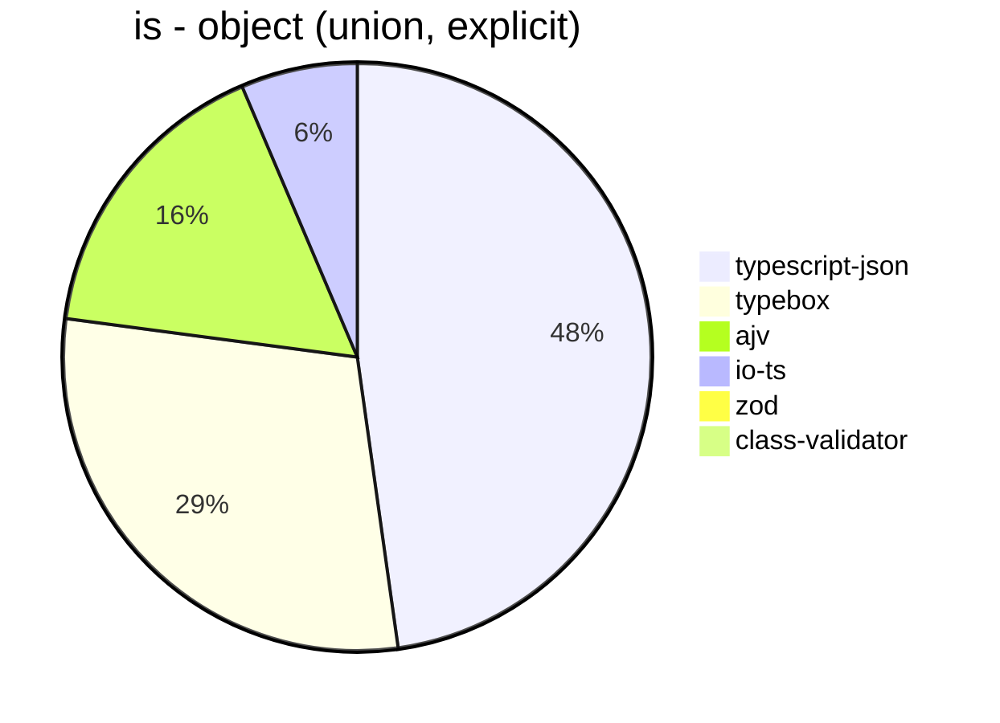
```mermaid
pie title is - object (union, explicit)
  "typescript-json": 17082.74187523347
  "typebox": 10480.512249443207
  "ajv": 5900.923295454546
  "io-ts": 2289.130434782609
  "zod": 27.81383274615242
  "class-validator": 82.06177893561593
```

```mermaid
pie title is - object (union, implicit)
  "typescript-json": 14216.150690041028
  "typebox": 1873.9051094890508
  "ajv": 0
  "io-ts": 0
  "zod": 14.523937600860677
  "class-validator": 57.34292202876608
```

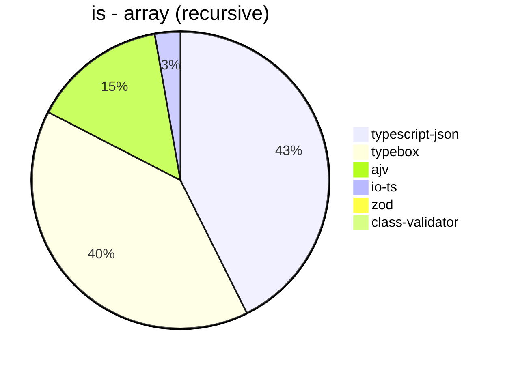
```mermaid
pie title is - array (recursive)
  "typescript-json": 5761.267207241184
  "typebox": 5399.89206691851
  "ajv": 1979.558011049724
  "io-ts": 375.34346949990845
  "zod": 7.234279354479689
  "class-validator": 2.751283932501834
```

```mermaid
pie title is - array (union, explicit)
  "typescript-json": 3305.498981670061
  "typebox": 1769.8398085067206
  "ajv": 607.6352067868504
  "io-ts": 267.63945326930184
  "zod": 2.2177046756606913
  "class-validator": 31.061746987951807
```

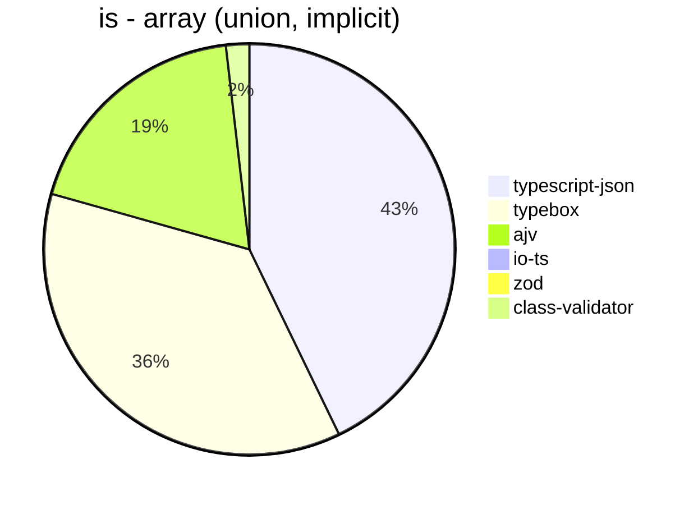
```mermaid
pie title is - array (union, implicit)
  "typescript-json": 517.5246440306682
  "typebox": 441.7143912802512
  "ajv": 227.28110599078343
  "io-ts": 0
  "zod": 1.637256685464799
  "class-validator": 22.175890826383625
```

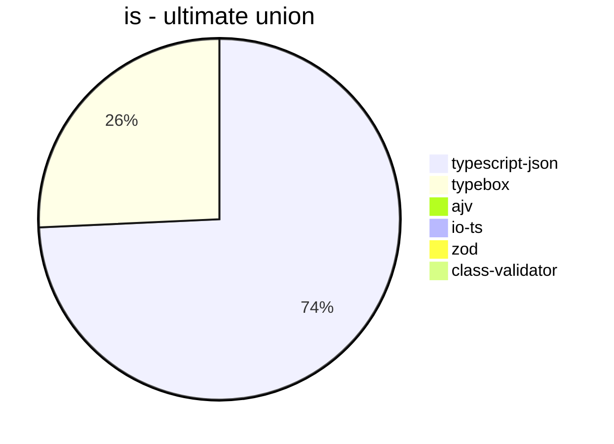
```mermaid
pie title is - ultimate union
  "typescript-json": 445.05494505494505
  "typebox": 154.11334552102377
  "ajv": 0
  "io-ts": 0
  "zod": 0.46721694440118355
  "class-validator": 0
```

## assertType (iterate)
 Components | typescript-json | typebox | io-ts | zod | class-validator 
------------|-----------------|---------|-------|-----|-----------------
object (simple) | 230472.71045328397 | 47187.86656891495 | 12272.4795640327 | 2529.6052631578946 | 145.2070334656835
object (hierarchical) | 35609.888059701494 | 12927.405740011254 | 2339.047966441729 | 327.2032046613256 | 48.55618907485746
object (recursive) | 35016.264722378015 | 9848.702374378798 | 1261.6204299099763 | 61.47772137619853 | 31.386722465284386
object (union, explicit) | 5284.551341350601 | 2681.4501288185497 | 796.1200585651536 | 28.25923134890731 | 80.56338028169014
object (union, implicit) | 4290.793072014585 | 1831.1270125223614 | Failed | 16.264722378014582 | 55.28667163067759
array (recursive) | 2069.4035346097203 | 899.0174672489084 | 116.53166421207658 | 7.929016424391165 | 2.815843814529754
array (union, explicit) | 1484.7757888909393 | 510.3665309144761 | 58.555997725980674 | 2.220988339811216 | 28.694673668417106
array (union, implicit) | 1008.3426028921024 | 330.09527367831123 | Failed | 1.6474464579901154 | 21.300448430493272
ultimate union | 203.75722543352606 | 155.74514430931202 | Failed | 0.4775549188156638 | Failed

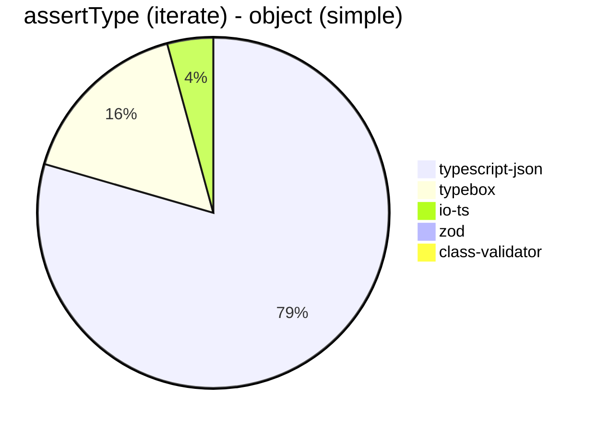
```mermaid
pie title assertType (iterate) - object (simple)
  "typescript-json": 230472.71045328397
  "typebox": 47187.86656891495
  "io-ts": 12272.4795640327
  "zod": 2529.6052631578946
  "class-validator": 145.2070334656835
```

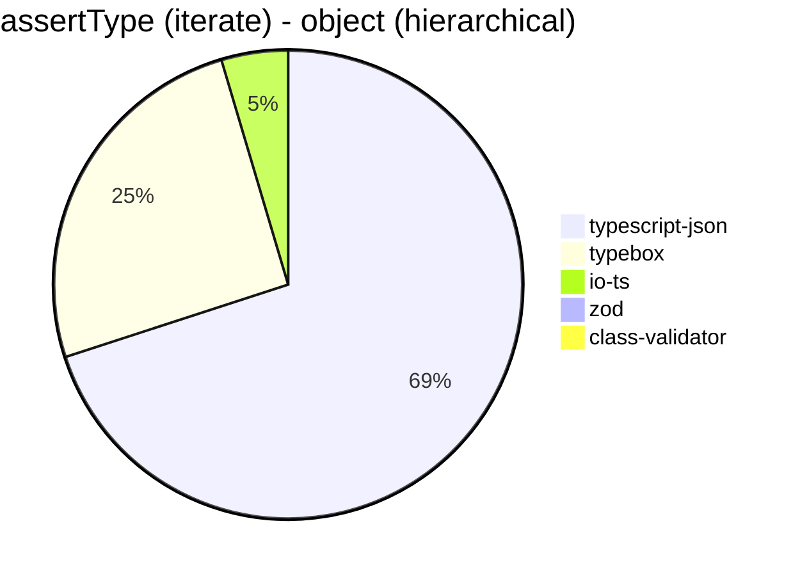
```mermaid
pie title assertType (iterate) - object (hierarchical)
  "typescript-json": 35609.888059701494
  "typebox": 12927.405740011254
  "io-ts": 2339.047966441729
  "zod": 327.2032046613256
  "class-validator": 48.55618907485746
```

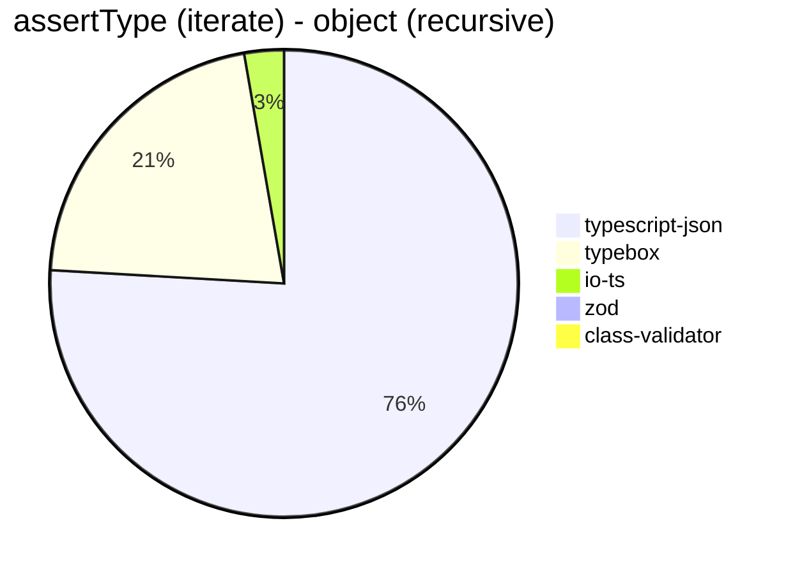
```mermaid
pie title assertType (iterate) - object (recursive)
  "typescript-json": 35016.264722378015
  "typebox": 9848.702374378798
  "io-ts": 1261.6204299099763
  "zod": 61.47772137619853
  "class-validator": 31.386722465284386
```

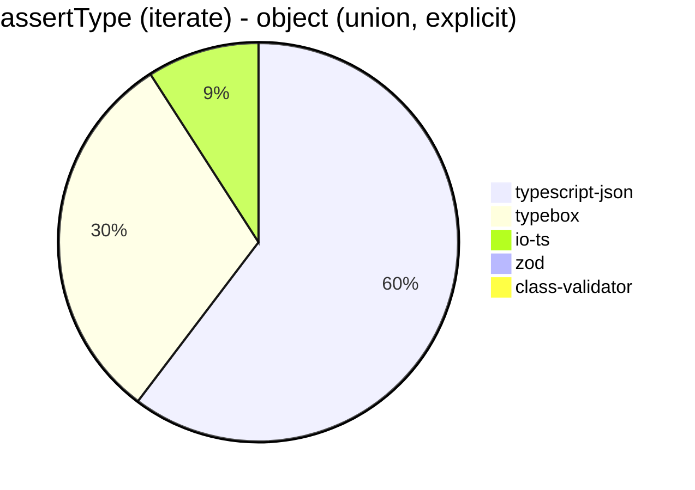
```mermaid
pie title assertType (iterate) - object (union, explicit)
  "typescript-json": 5284.551341350601
  "typebox": 2681.4501288185497
  "io-ts": 796.1200585651536
  "zod": 28.25923134890731
  "class-validator": 80.56338028169014
```

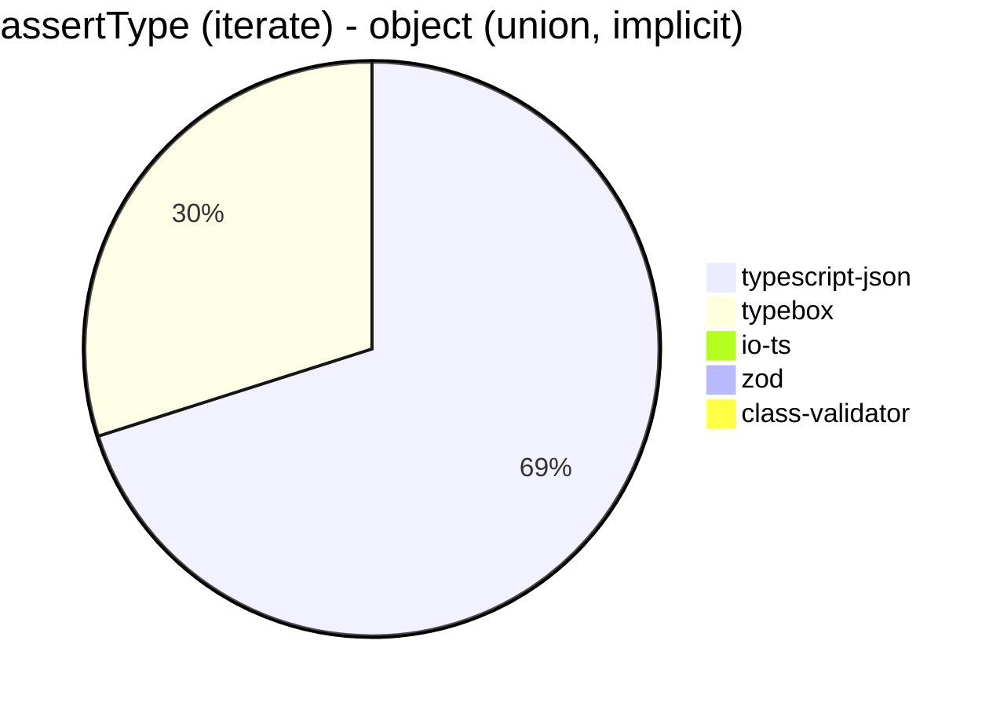
```mermaid
pie title assertType (iterate) - object (union, implicit)
  "typescript-json": 4290.793072014585
  "typebox": 1831.1270125223614
  "io-ts": 0
  "zod": 16.264722378014582
  "class-validator": 55.28667163067759
```

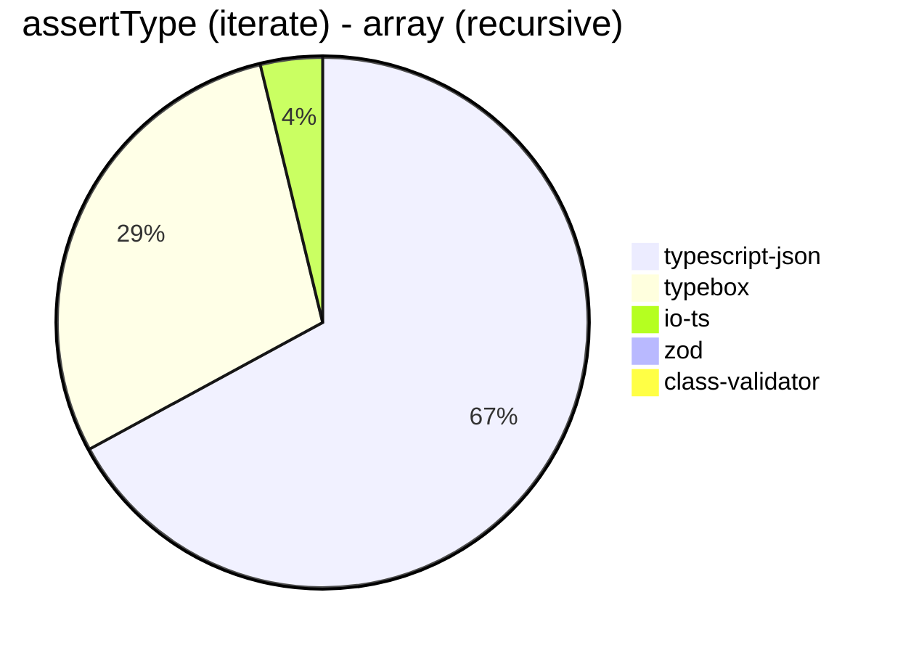
```mermaid
pie title assertType (iterate) - array (recursive)
  "typescript-json": 2069.4035346097203
  "typebox": 899.0174672489084
  "io-ts": 116.53166421207658
  "zod": 7.929016424391165
  "class-validator": 2.815843814529754
```

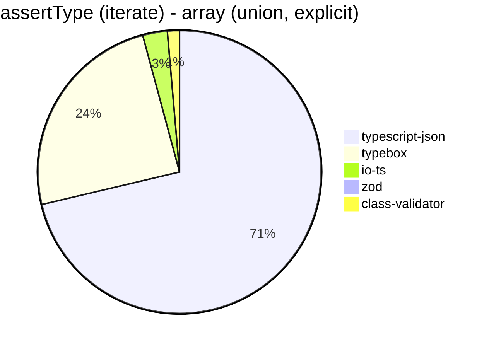
```mermaid
pie title assertType (iterate) - array (union, explicit)
  "typescript-json": 1484.7757888909393
  "typebox": 510.3665309144761
  "io-ts": 58.555997725980674
  "zod": 2.220988339811216
  "class-validator": 28.694673668417106
```

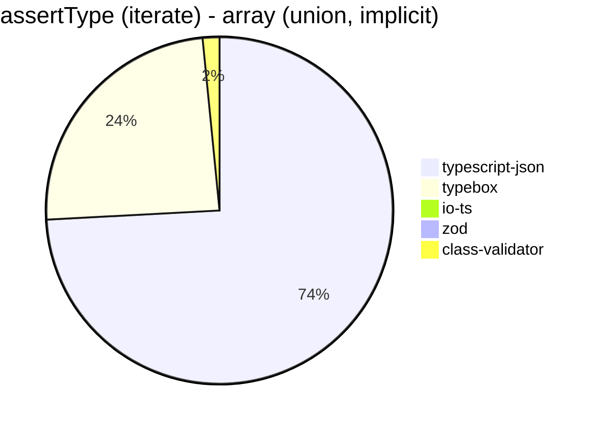
```mermaid
pie title assertType (iterate) - array (union, implicit)
  "typescript-json": 1008.3426028921024
  "typebox": 330.09527367831123
  "io-ts": 0
  "zod": 1.6474464579901154
  "class-validator": 21.300448430493272
```

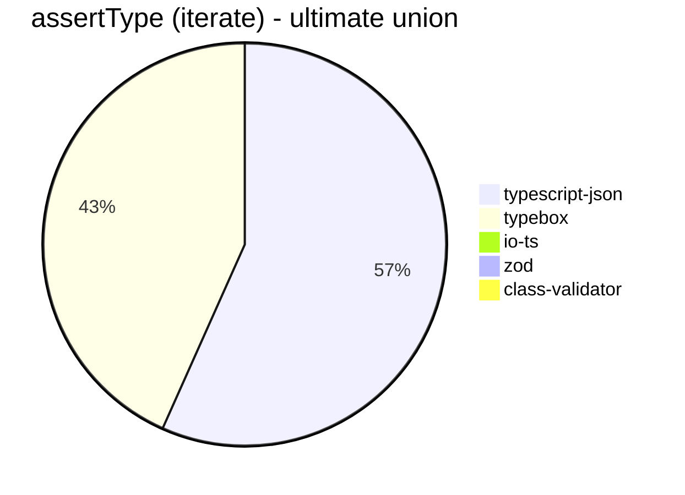
```mermaid
pie title assertType (iterate) - ultimate union
  "typescript-json": 203.75722543352606
  "typebox": 155.74514430931202
  "io-ts": 0
  "zod": 0.4775549188156638
  "class-validator": 0
```

## assertType (throw)
 Components | typescript-json | typebox | io-ts | zod | class-validator 
------------|-----------------|---------|-------|-----|-----------------
object (simple) | 414.8618371919343 | 15.455381784728612 | 82.68390039916366 | 25.723472668810288 | 1.4831294030404152
object (hierarchical) | 228.01788375558866 | 4.654626698938745 | 25.544703230653646 | 3.5660660660660657 | 0.5492493592090809
object (recursive) | 37.03034682080925 | 0.5581395348837209 | Failed | 0.17608733932030285 | 0.5583472920156337
object (union, explicit) | 41.46962531829756 | 0.7324665812122322 | 8.574091332712023 | 0.3586157432311278 | 0.9199632014719412
object (union, implicit) | 38.02842901975263 | 0.5550416281221091 | Failed | 0.17921146953405018 | 0.560642870491497
array (recursive) | 14.676571842725131 | 0.35549235691432635 | 1.1059907834101383 | 0.1589825119236884 | 0.1222643354933366
array (union, explicit) | 3.734129947722181 | 0.16966406515100102 | 0.5463485703879075 | 0.1035303861683404 | 0.35816618911174786
array (union, implicit) | 1.442741208295762 | 0.14442518775274407 | Failed | 0.07451009611802399 | 0.1811594202898551
ultimate union | 1.9855595667870036 | 0.125250501002004 | Failed | 0.018008283810552854 | Failed

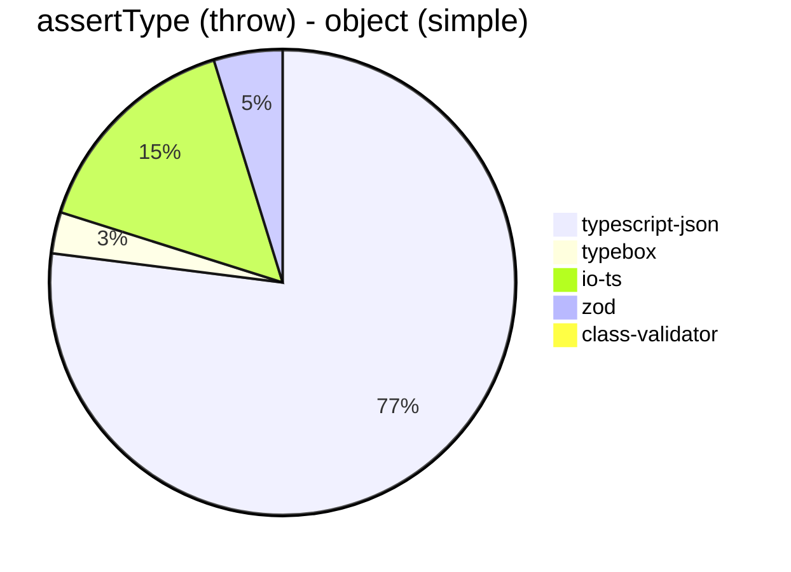
```mermaid
pie title assertType (throw) - object (simple)
  "typescript-json": 414.8618371919343
  "typebox": 15.455381784728612
  "io-ts": 82.68390039916366
  "zod": 25.723472668810288
  "class-validator": 1.4831294030404152
```

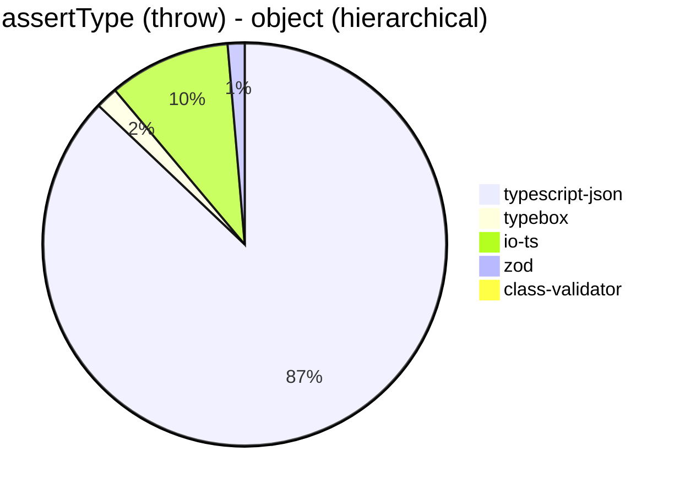
```mermaid
pie title assertType (throw) - object (hierarchical)
  "typescript-json": 228.01788375558866
  "typebox": 4.654626698938745
  "io-ts": 25.544703230653646
  "zod": 3.5660660660660657
  "class-validator": 0.5492493592090809
```

```mermaid
pie title assertType (throw) - object (recursive)
  "typescript-json": 37.03034682080925
  "typebox": 0.5581395348837209
  "io-ts": 0
  "zod": 0.17608733932030285
  "class-validator": 0.5583472920156337
```

```mermaid
pie title assertType (throw) - object (union, explicit)
  "typescript-json": 41.46962531829756
  "typebox": 0.7324665812122322
  "io-ts": 8.574091332712023
  "zod": 0.3586157432311278
  "class-validator": 0.9199632014719412
```

```mermaid
pie title assertType (throw) - object (union, implicit)
  "typescript-json": 38.02842901975263
  "typebox": 0.5550416281221091
  "io-ts": 0
  "zod": 0.17921146953405018
  "class-validator": 0.560642870491497
```

```mermaid
pie title assertType (throw) - array (recursive)
  "typescript-json": 14.676571842725131
  "typebox": 0.35549235691432635
  "io-ts": 1.1059907834101383
  "zod": 0.1589825119236884
  "class-validator": 0.1222643354933366
```

```mermaid
pie title assertType (throw) - array (union, explicit)
  "typescript-json": 3.734129947722181
  "typebox": 0.16966406515100102
  "io-ts": 0.5463485703879075
  "zod": 0.1035303861683404
  "class-validator": 0.35816618911174786
```

```mermaid
pie title assertType (throw) - array (union, implicit)
  "typescript-json": 1.442741208295762
  "typebox": 0.14442518775274407
  "io-ts": 0
  "zod": 0.07451009611802399
  "class-validator": 0.1811594202898551
```

```mermaid
pie title assertType (throw) - ultimate union
  "class-validator": 0
  "typescript-json": 1.9855595667870036
  "typebox": 0.125250501002004
  "io-ts": 0
  "zod": 0.018008283810552854
```

## validate
 Components | typescript-json | typebox | io-ts | zod | class-validator 
------------|-----------------|---------|-------|-----|-----------------
object (simple) | 56049.3871665465 | 385922.2929936306 | 9267.579570688378 | 2540.309372156506 | 144.7887323943662
object (hierarchical) | 20043.51886440045 | 103625.61041779706 | 2242.151643106297 | 332.8335832083958 | 47.45762711864407
object (recursive) | 14221.309945885427 | 66783.0763714593 | 1208.4648227213665 | 62.39364719228588 | 30.170049369171693
object (union, explicit) | 4033.3880678708265 | 9408.044901777363 | 781.5939278937383 | 27.65757290686735 | 81.58289572393099
object (union, implicit) | 2850.6787330316743 | 1901.7857142857142 | 211.32286995515693 | 16.09322974472808 | 52.99963194700037
array (recursive) | 1116.420664206642 | 4907.681340224559 | 140.5283867341203 | 7.254464285714286 | 2.765486725663717
array (union, explicit) | 1356.5693430656934 | 1701.5339124006655 | 56.57237936772047 | 2.2396416573348263 | 26.959022286125087
array (union, implicit) | 459.391771019678 | 617.8402043049981 | 46.90117252931323 | 1.6423357664233578 | 20.959214501510573
ultimate union | 138.0952380952381 | 151.1417180137731 | Failed | 0.4629629629629629 | Failed

```mermaid
pie title validate - object (simple)
  "typescript-json": 56049.3871665465
  "typebox": 385922.2929936306
  "io-ts": 9267.579570688378
  "zod": 2540.309372156506
  "class-validator": 144.7887323943662
```

```mermaid
pie title validate - object (hierarchical)
  "typescript-json": 20043.51886440045
  "typebox": 103625.61041779706
  "io-ts": 2242.151643106297
  "zod": 332.8335832083958
  "class-validator": 47.45762711864407
```

```mermaid
pie title validate - object (recursive)
  "typescript-json": 14221.309945885427
  "typebox": 66783.0763714593
  "io-ts": 1208.4648227213665
  "zod": 62.39364719228588
  "class-validator": 30.170049369171693
```

```mermaid
pie title validate - object (union, explicit)
  "typescript-json": 4033.3880678708265
  "typebox": 9408.044901777363
  "io-ts": 781.5939278937383
  "zod": 27.65757290686735
  "class-validator": 81.58289572393099
```

```mermaid
pie title validate - object (union, implicit)
  "typescript-json": 2850.6787330316743
  "typebox": 1901.7857142857142
  "io-ts": 211.32286995515693
  "zod": 16.09322974472808
  "class-validator": 52.99963194700037
```

```mermaid
pie title validate - array (recursive)
  "typescript-json": 1116.420664206642
  "typebox": 4907.681340224559
  "io-ts": 140.5283867341203
  "zod": 7.254464285714286
  "class-validator": 2.765486725663717
```

```mermaid
pie title validate - array (union, explicit)
  "typescript-json": 1356.5693430656934
  "typebox": 1701.5339124006655
  "io-ts": 56.57237936772047
  "zod": 2.2396416573348263
  "class-validator": 26.959022286125087
```

```mermaid
pie title validate - array (union, implicit)
  "typescript-json": 459.391771019678
  "typebox": 617.8402043049981
  "io-ts": 46.90117252931323
  "zod": 1.6423357664233578
  "class-validator": 20.959214501510573
```

```mermaid
pie title validate - ultimate union
  "typescript-json": 138.0952380952381
  "typebox": 151.1417180137731
  "io-ts": 0
  "zod": 0.4629629629629629
  "class-validator": 0
```

## equals
 Components | typescript-json | typebox 
------------|-----------------|---------
object (simple) | 17515.8937920718 | 48906.950880444856
object (hierarchical) | 5835.6164383561645 | 14487.586335635617
object (recursive) | 4497.251740564309 | 9452.68400664084
object (union, explicit) | 1943.127962085308 | 2495.7342530404794
object (union, implicit) | 1360.3238866396762 | 1885.920979410128
array (recursive) | 364.7518126045734 | 862.2787610619469
array (union, explicit) | 520.6290471785384 | 540.8372093023256
array (union, implicit) | 341.7653390742734 | 329.1837097634715
ultimate union | 242.81556929792652 | 149.6488384656942

```mermaid
pie title equals - object (simple)
  "typescript-json": 17515.8937920718
  "typebox": 48906.950880444856
```

```mermaid
pie title equals - object (hierarchical)
  "typescript-json": 5835.6164383561645
  "typebox": 14487.586335635617
```

```mermaid
pie title equals - object (recursive)
  "typescript-json": 4497.251740564309
  "typebox": 9452.68400664084
```

```mermaid
pie title equals - object (union, explicit)
  "typescript-json": 1943.127962085308
  "typebox": 2495.7342530404794
```

```mermaid
pie title equals - object (union, implicit)
  "typescript-json": 1360.3238866396762
  "typebox": 1885.920979410128
```

```mermaid
pie title equals - array (recursive)
  "typescript-json": 364.7518126045734
  "typebox": 862.2787610619469
```

```mermaid
pie title equals - array (union, explicit)
  "typescript-json": 520.6290471785384
  "typebox": 540.8372093023256
```

```mermaid
pie title equals - array (union, implicit)
  "typescript-json": 341.7653390742734
  "typebox": 329.1837097634715
```

```mermaid
pie title equals - ultimate union
  "typescript-json": 242.81556929792652
  "typebox": 149.6488384656942
```

## assertEquals (iterate)
 Components | typescript-json | typebox 
------------|-----------------|---------
object (simple) | 22504.990757855823 | 50158.95953757226
object (hierarchical) | 5660.812294182217 | 13299.867147466312
object (recursive) | 4675.5204594400575 | 10521.747316889476
object (union, explicit) | 1930.2580999450852 | 2653.804149981798
object (union, implicit) | 1429.7520661157023 | 2024.8737609874697
array (recursive) | 417.2506738544474 | 891.2844874840125
array (union, explicit) | 304.8585157501335 | 539.2948953360265
array (union, implicit) | 179.72103004291847 | 333.1497797356828
ultimate union | 170.43010752688173 | 161.24931904848376

```mermaid
pie title assertEquals (iterate) - object (simple)
  "typescript-json": 22504.990757855823
  "typebox": 50158.95953757226
```

```mermaid
pie title assertEquals (iterate) - object (hierarchical)
  "typescript-json": 5660.812294182217
  "typebox": 13299.867147466312
```

```mermaid
pie title assertEquals (iterate) - object (recursive)
  "typescript-json": 4675.5204594400575
  "typebox": 10521.747316889476
```

```mermaid
pie title assertEquals (iterate) - object (union, explicit)
  "typescript-json": 1930.2580999450852
  "typebox": 2653.804149981798
```

```mermaid
pie title assertEquals (iterate) - object (union, implicit)
  "typescript-json": 1429.7520661157023
  "typebox": 2024.8737609874697
```

```mermaid
pie title assertEquals (iterate) - array (recursive)
  "typescript-json": 417.2506738544474
  "typebox": 891.2844874840125
```

```mermaid
pie title assertEquals (iterate) - array (union, explicit)
  "typescript-json": 304.8585157501335
  "typebox": 539.2948953360265
```

```mermaid
pie title assertEquals (iterate) - array (union, implicit)
  "typescript-json": 179.72103004291847
  "typebox": 333.1497797356828
```

```mermaid
pie title assertEquals (iterate) - ultimate union
  "typescript-json": 170.43010752688173
  "typebox": 161.24931904848376
```

## assertEquals (throw)
 Components | typescript-json | typebox 
------------|-----------------|---------
object (simple) | 134.59767998526974 | 16.457100591715975
object (hierarchical) | 50.07363770250368 | 4.821958456973293
object (recursive) | 38.123167155425215 | 2.8032143524574846
object (union, explicit) | 17.92573623559539 | 0.9384384384384384
object (union, implicit) | 12.42571582928147 | 0.5431830526887561
array (recursive) | 3.732039559619332 | 0.3591309032142216
array (union, explicit) | 1.7914725904693658 | 0.17073587160662454
array (union, implicit) | 0.8944543828264758 | 0.14295925661186562
ultimate union | 1.6271921894774906 | 0.12417732522041473

```mermaid
pie title assertEquals (throw) - object (simple)
  "typescript-json": 134.59767998526974
  "typebox": 16.457100591715975
```

```mermaid
pie title assertEquals (throw) - object (hierarchical)
  "typescript-json": 50.07363770250368
  "typebox": 4.821958456973293
```

```mermaid
pie title assertEquals (throw) - object (recursive)
  "typescript-json": 38.123167155425215
  "typebox": 2.8032143524574846
```

```mermaid
pie title assertEquals (throw) - object (union, explicit)
  "typescript-json": 17.92573623559539
  "typebox": 0.9384384384384384
```

```mermaid
pie title assertEquals (throw) - object (union, implicit)
  "typescript-json": 12.42571582928147
  "typebox": 0.5431830526887561
```

```mermaid
pie title assertEquals (throw) - array (recursive)
  "typescript-json": 3.732039559619332
  "typebox": 0.3591309032142216
```

```mermaid
pie title assertEquals (throw) - array (union, explicit)
  "typescript-json": 1.7914725904693658
  "typebox": 0.17073587160662454
```

```mermaid
pie title assertEquals (throw) - array (union, implicit)
  "typescript-json": 0.8944543828264758
  "typebox": 0.14295925661186562
```

```mermaid
pie title assertEquals (throw) - ultimate union
  "typescript-json": 1.6271921894774906
  "typebox": 0.12417732522041473
```

## validateEquals
 Components | typescript-json | typebox 
------------|-----------------|---------
object (simple) | 12251.714182605558 | 50313.643013899054
object (hierarchical) | 4872.4100327153765 | 12783.02417088252
object (recursive) | 3366.831411312465 | 10392.938066465256
object (union, explicit) | 1241.3793103448274 | 2649.371927908247
object (union, implicit) | 852.9201003224651 | 1964.7926267281107
array (recursive) | 267.3267326732673 | 892.071705784513
array (union, explicit) | 280.40973111395647 | 566.1956117515805
array (union, implicit) | 166.04576902607772 | 332.2872438619162
ultimate union | 114.90215755143001 | 160.9238219407711

```mermaid
pie title validateEquals - object (simple)
  "typescript-json": 12251.714182605558
  "typebox": 50313.643013899054
```

```mermaid
pie title validateEquals - object (hierarchical)
  "typescript-json": 4872.4100327153765
  "typebox": 12783.02417088252
```

```mermaid
pie title validateEquals - object (recursive)
  "typescript-json": 3366.831411312465
  "typebox": 10392.938066465256
```

```mermaid
pie title validateEquals - object (union, explicit)
  "typescript-json": 1241.3793103448274
  "typebox": 2649.371927908247
```

```mermaid
pie title validateEquals - object (union, implicit)
  "typescript-json": 852.9201003224651
  "typebox": 1964.7926267281107
```

```mermaid
pie title validateEquals - array (recursive)
  "typescript-json": 267.3267326732673
  "typebox": 892.071705784513
```

```mermaid
pie title validateEquals - array (union, explicit)
  "typescript-json": 280.40973111395647
  "typebox": 566.1956117515805
```

```mermaid
pie title validateEquals - array (union, implicit)
  "typescript-json": 166.04576902607772
  "typebox": 332.2872438619162
```

```mermaid
pie title validateEquals - ultimate union
  "typescript-json": 114.90215755143001
  "typebox": 160.9238219407711
```

## optimizer
 Components | typescript-json | typebox | ajv 
------------|-----------------|---------|-----
object (hierarchical) | 90186.6158868335 | 143.97301615480205 | 4.027091341753615
object (recursive) | 54925.09974610083 | 647.4753120924166 | 7.175712971481142
object (union) | 13405.00548045305 | 51.96005917159763 | 3.5687453042824946
array (hierarchical) | 6818.198495688865 | 705.6340612956506 | 5.081669691470054
array (recursive) | 4716.585277627058 | 623.6155434578562 | 7.183643396573954
array (union) | 3235.7365620986975 | 188.71775839673407 | 4.779411764705882
ultimate union | 409.590235396687 | 6.8645640074211505 | 0.7216308858019123

```mermaid
pie title optimizer - object (hierarchical)
  "typescript-json": 90186.6158868335
  "typebox": 143.97301615480205
  "ajv": 4.027091341753615
```

```mermaid
pie title optimizer - object (recursive)
  "typescript-json": 54925.09974610083
  "typebox": 647.4753120924166
  "ajv": 7.175712971481142
```

```mermaid
pie title optimizer - object (union)
  "typescript-json": 13405.00548045305
  "typebox": 51.96005917159763
  "ajv": 3.5687453042824946
```

```mermaid
pie title optimizer - array (hierarchical)
  "typescript-json": 6818.198495688865
  "typebox": 705.6340612956506
  "ajv": 5.081669691470054
```

```mermaid
pie title optimizer - array (recursive)
  "typescript-json": 4716.585277627058
  "typebox": 623.6155434578562
  "ajv": 7.183643396573954
```

```mermaid
pie title optimizer - array (union)
  "typescript-json": 3235.7365620986975
  "typebox": 188.71775839673407
  "ajv": 4.779411764705882
```

```mermaid
pie title optimizer - ultimate union
  "typescript-json": 409.590235396687
  "typebox": 6.8645640074211505
  "ajv": 0.7216308858019123
```

## stringify
 Components | TSON.stringify() | TSON.assertStringify() | TSON.isStringify() | JSON.stringify() | fast-json-stringify 
------------|------------------|------------------------|--------------------|------------------|---------------------
object (simple) | 29642.02550360377 | 22401.785714285714 | 23851.329644833128 | 4412.396382818388 | 20574.1935483871
object (hierarchical) | 3787.249953262292 | 3387.3561118216703 | 3585.78110383536 | 1187.1345029239765 | 3576.0769088556112
object (recursive) | 4010.8256880733943 | 3532.0287982278014 | 3618.9013371882907 | 884.6877351392025 | 867.4383868558626
object (union) | 1115.4903758020164 | 861.5384615384614 | 991.3824057450628 | 466.401014309002 | 1089.7229669347632
array (hierarchical) | 122.14590681269725 | 105.38194444444444 | 118.0696260821514 | 57.55933470379368 | 183.2201211676152
array (recursive) | 174.8781808337845 | 169.0454124189064 | 172.65168936847692 | 92.43384271338056 | 94.47783621337341
array (union) | 242.635243706481 | 212.9813776893871 | 224.29906542056074 | 196.67799169497923 | 169.4237411379749

```mermaid
pie title stringify - object (simple)
  "TSON.stringify()": 29642.02550360377
  "TSON.assertStringify()": 22401.785714285714
  "TSON.isStringify()": 23851.329644833128
  "JSON.stringify()": 4412.396382818388
  "fast-json-stringify": 20574.1935483871
```

```mermaid
pie title stringify - object (hierarchical)
  "TSON.stringify()": 3787.249953262292
  "TSON.assertStringify()": 3387.3561118216703
  "TSON.isStringify()": 3585.78110383536
  "JSON.stringify()": 1187.1345029239765
  "fast-json-stringify": 3576.0769088556112
```

```mermaid
pie title stringify - object (recursive)
  "TSON.stringify()": 4010.8256880733943
  "TSON.assertStringify()": 3532.0287982278014
  "TSON.isStringify()": 3618.9013371882907
  "JSON.stringify()": 884.6877351392025
  "fast-json-stringify": 867.4383868558626
```

```mermaid
pie title stringify - object (union)
  "TSON.stringify()": 1115.4903758020164
  "TSON.assertStringify()": 861.5384615384614
  "TSON.isStringify()": 991.3824057450628
  "JSON.stringify()": 466.401014309002
  "fast-json-stringify": 1089.7229669347632
```

```mermaid
pie title stringify - array (hierarchical)
  "TSON.stringify()": 122.14590681269725
  "TSON.assertStringify()": 105.38194444444444
  "TSON.isStringify()": 118.0696260821514
  "JSON.stringify()": 57.55933470379368
  "fast-json-stringify": 183.2201211676152
```

```mermaid
pie title stringify - array (recursive)
  "TSON.stringify()": 174.8781808337845
  "TSON.assertStringify()": 169.0454124189064
  "TSON.isStringify()": 172.65168936847692
  "JSON.stringify()": 92.43384271338056
  "fast-json-stringify": 94.47783621337341
```

```mermaid
pie title stringify - array (union)
  "TSON.stringify()": 242.635243706481
  "TSON.assertStringify()": 212.9813776893871
  "TSON.isStringify()": 224.29906542056074
  "JSON.stringify()": 196.67799169497923
  "fast-json-stringify": 169.4237411379749
```

> Total elapsed time: 1,779,774 ms
