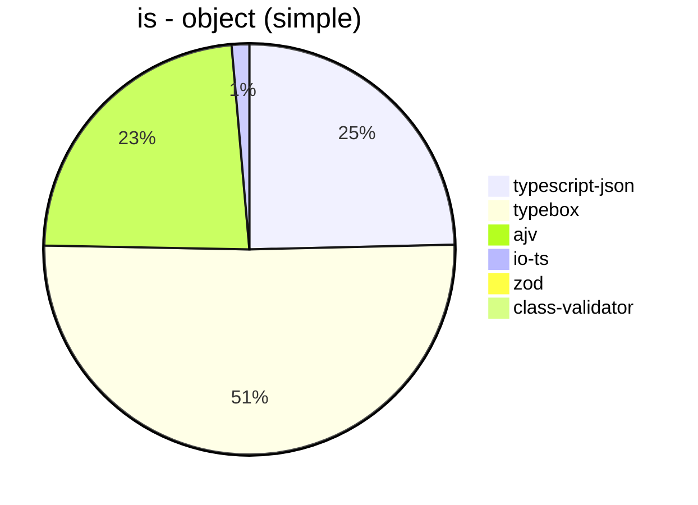
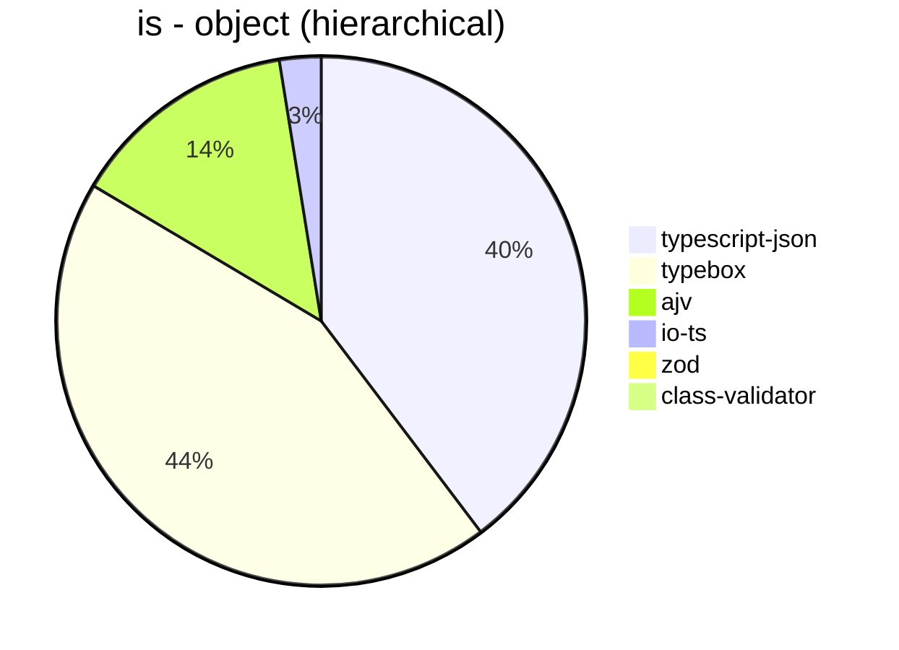
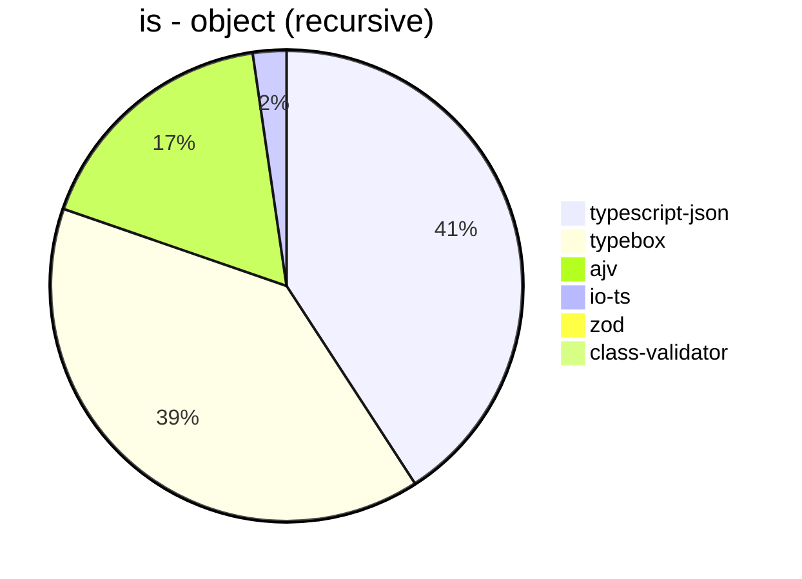
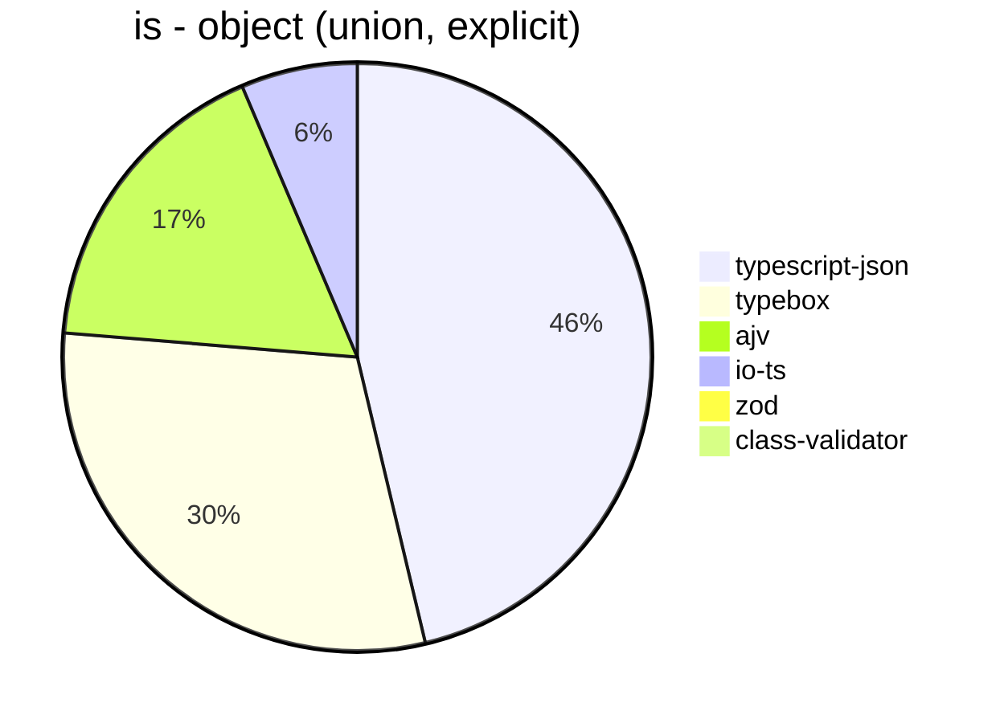
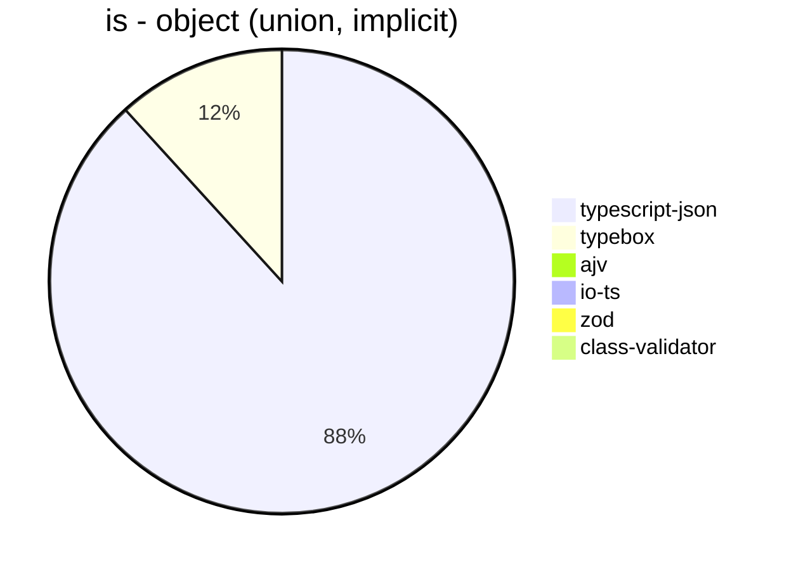
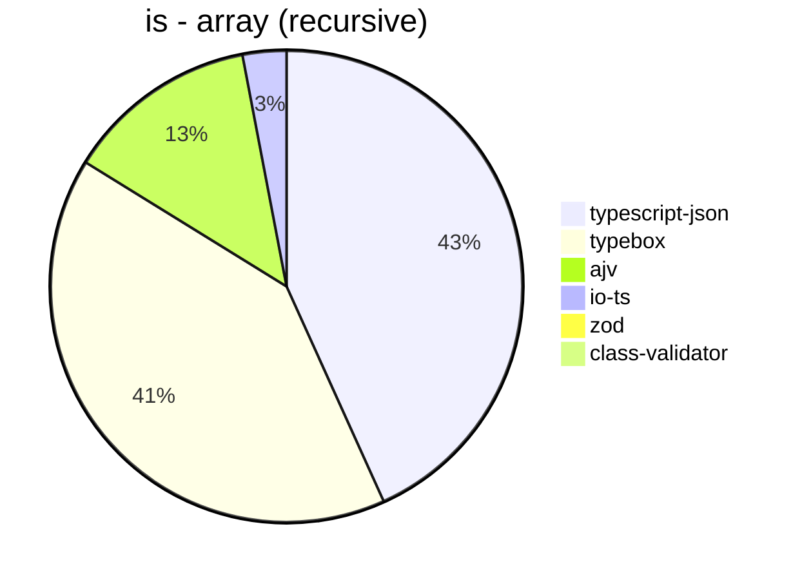
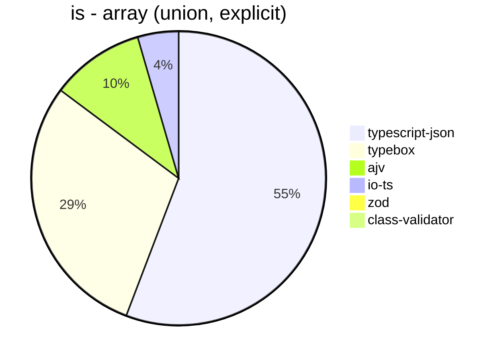
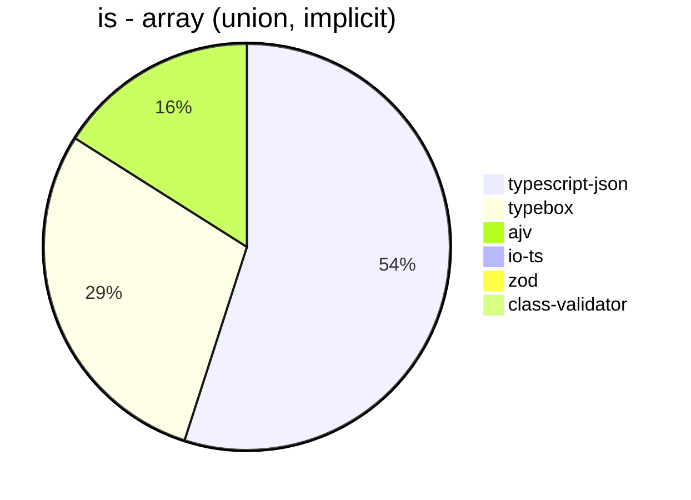
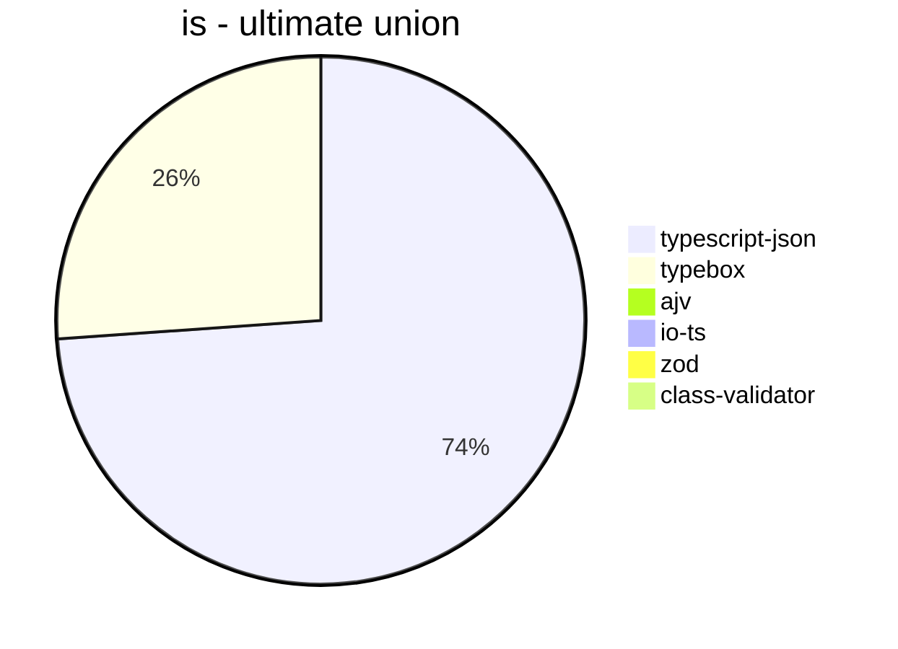

# Benchmark of `typescript-json`
> CPU: AMD Ryzen 7 3700X 8-Core Processor
> Memory: 16,333 MB
> NodeJS version: v16.17.1
> TypeScript-JSON version: 3.3.18

## is
 Components | typescript-json | typebox | ajv | io-ts | zod | class-validator 
------------|-----------------|---------|-----|-------|-----|-----------------
object (simple) | 491268.8152353048 | 1010331.129476584 | 464905.2867550907 | 27677.038626609443 | 3022.5481209899176 | 149.86376021798367
object (hierarchical) | 99931.05340160936 | 110351.29271379497 | 35057.6385002798 | 6390.613586559533 | 350.0361794500724 | 47.31182795698925
object (recursive) | 75845.6043956044 | 73286.49935885693 | 32307.69230769231 | 4270.117044623263 | 57.09251101321587 | 30.493439290334504
object (union, explicit) | 16388.641425389756 | 10634.278254382694 | 6122.272317403066 | 2265.261627906977 | 26.533996683250415 | 83.27165062916359
object (union, implicit) | 14381.92365269461 | 1915.6626506024097 | Failed | Failed | 14.51352804156961 | 59.749620637329286
array (recursive) | 5601.809954751131 | 5254.431314623338 | 1708.40108401084 | 388.5053181563725 | 6.784771956275915 | 2.7437351381013357
array (union, explicit) | 3335.500650195059 | 1758.8705182983467 | 615.4128440366972 | 268.5829366532406 | 2.719361856417694 | 31.25591968175791
array (union, implicit) | 1509.127789046653 | 796.6101694915255 | 439.93325917686315 | Failed | 1.6011385874399573 | 22.654332641117616
ultimate union | 442.2092172640819 | 156.30614444843695 | Failed | Failed | 0.46375019322924715 | Failed

## assertType (iterate)
