# Benchmark of `typescript-json`
> CPU: AMD Ryzen 7 3700X 8-Core Processor
> Memory: 16,333 MB
> NodeJS version: v16.17.1
> TypeScript-JSON version: 3.3.12

## is
 Components | typescript-json | typebox | ajv | ajv-spec | io-ts | class-validator | zod 
------------|-----------------|---------|-----|----------|-------|-----------------|-----
object (hierarchical) | 81097.70324462268 | 118578.5412456366 | 54221.45328719723 | 37174.72527472527 | 6593.477858069297 | 49.69391429600288 | 334.80095395340305
object (recursive) | 66755.83549462764 | 73629.89972652688 | Failed | 32892.74447949527 | 3687.965722801788 | 32.056145675265554 | 56.66605538235833
object (union, explicit) | 10990.792561834267 | 10205.264119904954 | 992.4228423581594 | 5681.200353045013 | 2349.778270509978 | 13.155490590169926 | 28.506271379703538
object (union, implicit) | 10943.84410983171 | 60568.386863948035 | 3529.8507462686566 | 29959.765910753475 | Failed | 13.325930038867297 | 15.891032917139615
array (recursive) | 5851.241166878058 | 5332.346410066617 | Failed | 1825.7132406730066 | 352.48901903367494 | 3.0349013657056143 | 7.322568531731131
array (union, explicit) | 2977.364740522635 | 1786.0594795539034 | Failed | 579.9350415012631 | 273.7137511693171 | 6.3753984624039 | 2.4390243902439024
array (union, implicit) | 3117.9919384389887 | 1787.4279337920775 | Failed | 696.6764061358656 | 312.61699737925875 | 7.293809612867028 | 3.0297292179511457
ultimate union | 428.3369803063457 | 210.28799130592284 | Failed | 15.630746598013976 | Failed | Failed | 0.18109380659181457

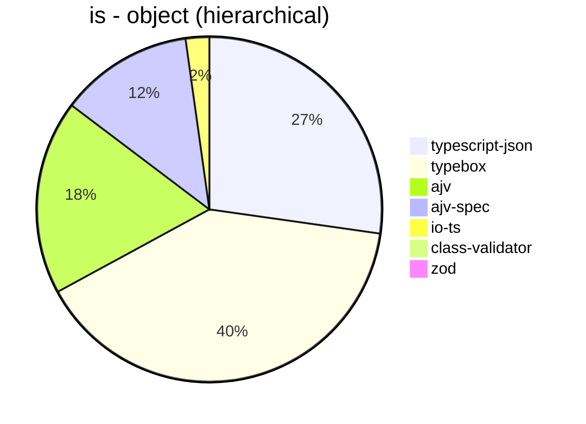
```mermaid
pie title is - object (hierarchical)
  "typescript-json": 81097.70324462268
  "typebox": 118578.5412456366
  "ajv": 54221.45328719723
  "ajv-spec": 37174.72527472527
  "io-ts": 6593.477858069297
  "class-validator": 49.69391429600288
  "zod": 334.80095395340305
```

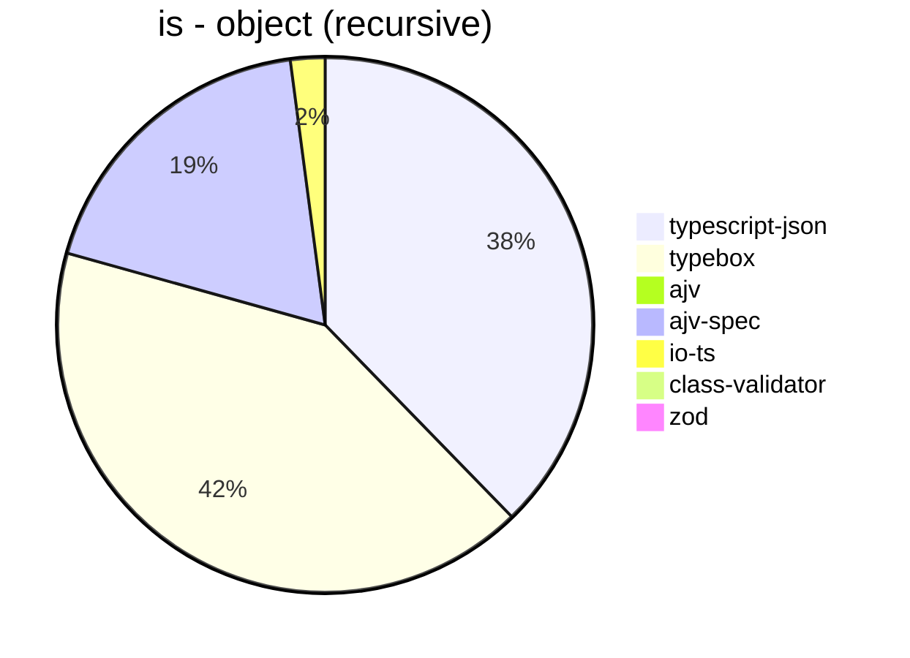
```mermaid
pie title is - object (recursive)
  "typescript-json": 66755.83549462764
  "typebox": 73629.89972652688
  "ajv": 0
  "ajv-spec": 32892.74447949527
  "io-ts": 3687.965722801788
  "class-validator": 32.056145675265554
  "zod": 56.66605538235833
```

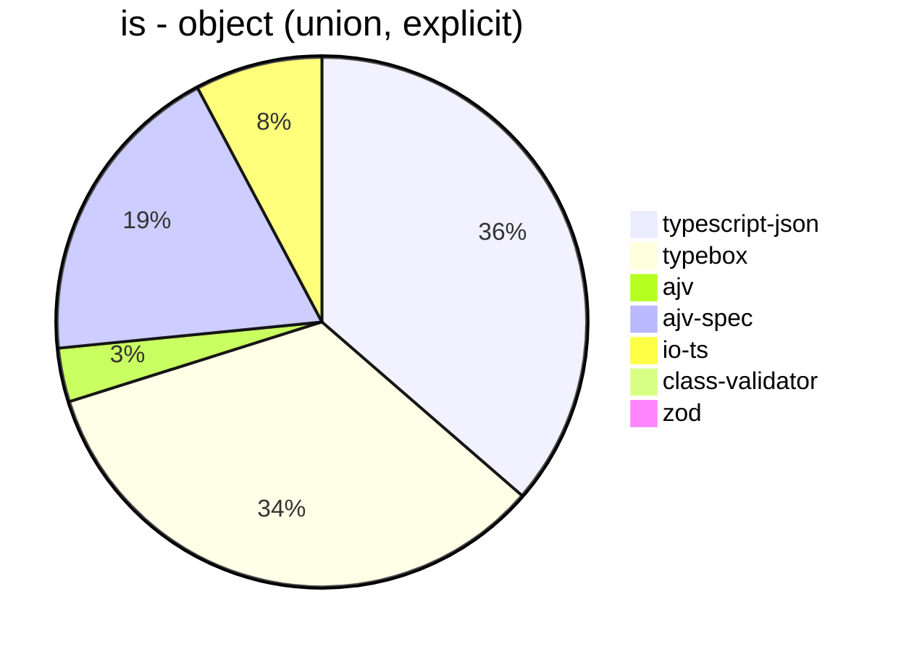
```mermaid
pie title is - object (union, explicit)
  "typescript-json": 10990.792561834267
  "typebox": 10205.264119904954
  "ajv": 992.4228423581594
  "ajv-spec": 5681.200353045013
  "io-ts": 2349.778270509978
  "class-validator": 13.155490590169926
  "zod": 28.506271379703538
```

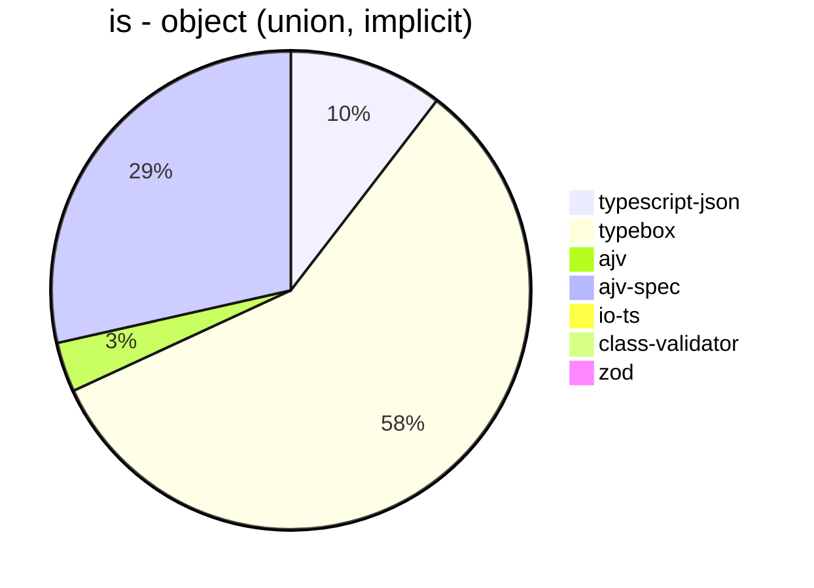
```mermaid
pie title is - object (union, implicit)
  "typescript-json": 10943.84410983171
  "typebox": 60568.386863948035
  "ajv": 3529.8507462686566
  "ajv-spec": 29959.765910753475
  "io-ts": 0
  "class-validator": 13.325930038867297
  "zod": 15.891032917139615
```

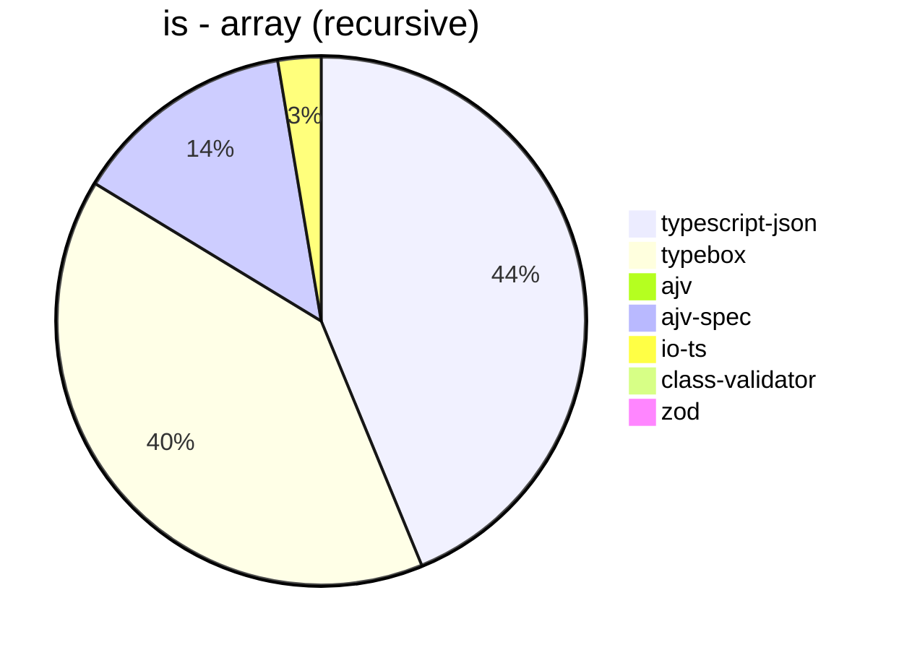
```mermaid
pie title is - array (recursive)
  "typescript-json": 5851.241166878058
  "typebox": 5332.346410066617
  "ajv": 0
  "ajv-spec": 1825.7132406730066
  "io-ts": 352.48901903367494
  "class-validator": 3.0349013657056143
  "zod": 7.322568531731131
```

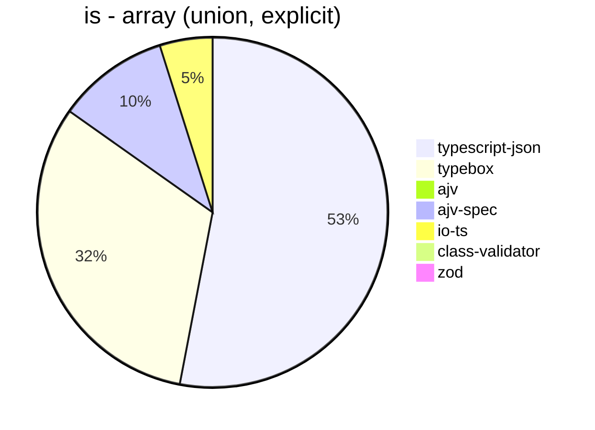
```mermaid
pie title is - array (union, explicit)
  "typescript-json": 2977.364740522635
  "typebox": 1786.0594795539034
  "ajv": 0
  "ajv-spec": 579.9350415012631
  "io-ts": 273.7137511693171
  "class-validator": 6.3753984624039
  "zod": 2.4390243902439024
```

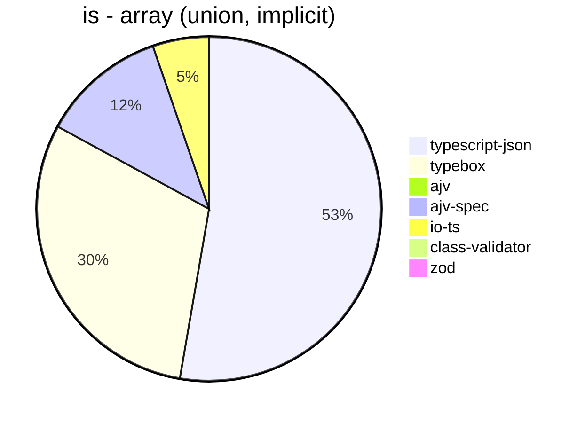
```mermaid
pie title is - array (union, implicit)
  "typescript-json": 3117.9919384389887
  "typebox": 1787.4279337920775
  "ajv": 0
  "ajv-spec": 696.6764061358656
  "io-ts": 312.61699737925875
  "class-validator": 7.293809612867028
  "zod": 3.0297292179511457
```

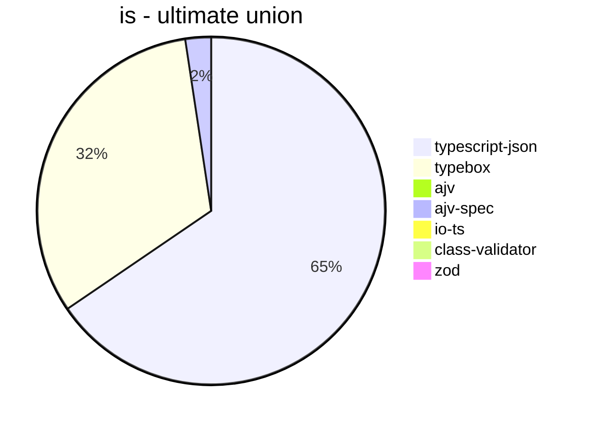
```mermaid
pie title is - ultimate union
  "typescript-json": 428.3369803063457
  "typebox": 210.28799130592284
  "ajv": 0
  "ajv-spec": 15.630746598013976
  "io-ts": 0
  "class-validator": 0
  "zod": 0.18109380659181457
```

## assert
 Components | typescript-json | typebox | io-ts | zod | class-validator 
------------|-----------------|---------|-------|-----|-----------------
object (hierarchical) | 14842.287379348025 | 615.2446789157723 | 2705.0582241630273 | 333.7708606787924 | 50.47494878003353
object (recursive) | 22013.117143377665 | 251.82083029861616 | 1229.7396406307298 | 56.06407322654462 | 31.244118200639942
object (union, explicit) | 3927.682167704138 | 97.22728931047062 | 790.8680947012401 | 27.679732491175923 | 13.343356511933848
object (union, implicit) | 3829.3224731580895 | 63.71911573472042 | 219.96708721886998 | 14.919735599622285 | 12.48416862674145
array (recursive) | 1211.7184575065519 | 25.86858006042296 | 120.47973832455024 | 7.741691842900302 | 2.816901408450704
array (union, explicit) | 1479.6543032048974 | 13.333333333333332 | 59.85783763561541 | 2.25521518511558 | 5.9913873806403295
array (union, implicit) | 1361.6478308421438 | 15.422230581154786 | 88.69014346934974 | 3.014318010550113 | 6.907834939101981
ultimate union | 191.7340521114106 | 2.7522935779816513 | Failed | 0.18001800180018002 | Failed

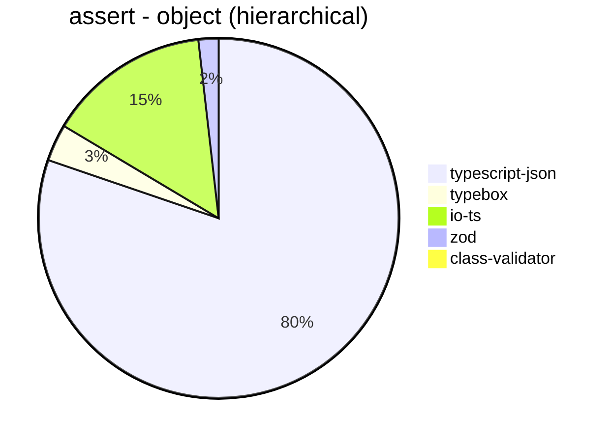
```mermaid
pie title assert - object (hierarchical)
  "typescript-json": 14842.287379348025
  "typebox": 615.2446789157723
  "io-ts": 2705.0582241630273
  "zod": 333.7708606787924
  "class-validator": 50.47494878003353
```

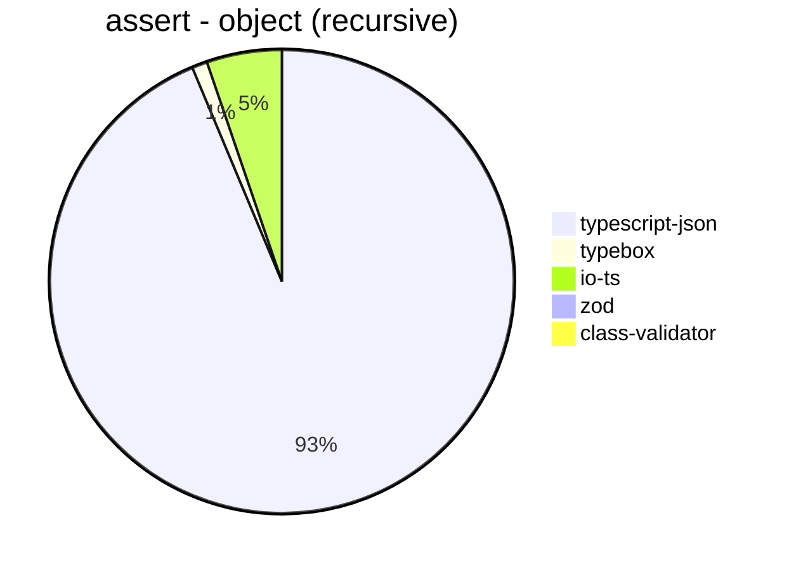
```mermaid
pie title assert - object (recursive)
  "typescript-json": 22013.117143377665
  "typebox": 251.82083029861616
  "io-ts": 1229.7396406307298
  "zod": 56.06407322654462
  "class-validator": 31.244118200639942
```

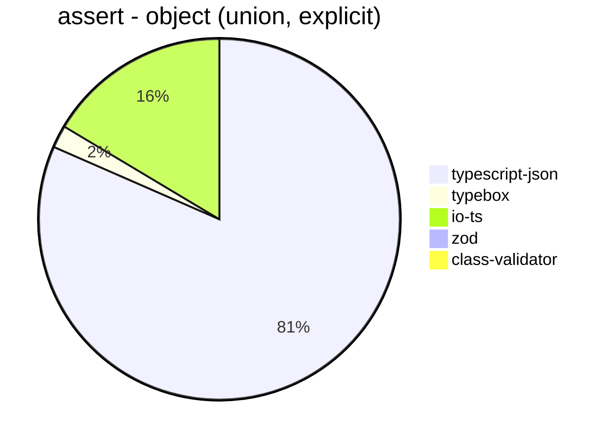
```mermaid
pie title assert - object (union, explicit)
  "typescript-json": 3927.682167704138
  "typebox": 97.22728931047062
  "io-ts": 790.8680947012401
  "zod": 27.679732491175923
  "class-validator": 13.343356511933848
```

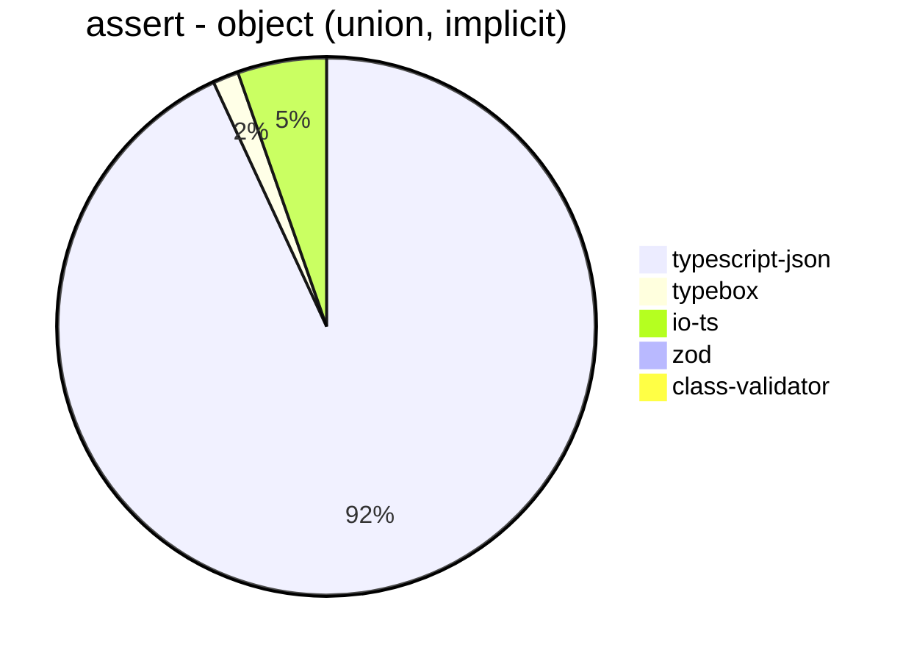
```mermaid
pie title assert - object (union, implicit)
  "typescript-json": 3829.3224731580895
  "typebox": 63.71911573472042
  "io-ts": 219.96708721886998
  "zod": 14.919735599622285
  "class-validator": 12.48416862674145
```

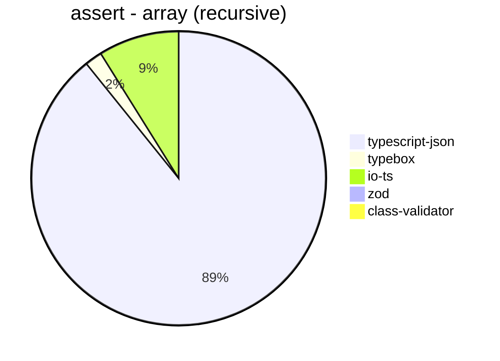
```mermaid
pie title assert - array (recursive)
  "typescript-json": 1211.7184575065519
  "typebox": 25.86858006042296
  "io-ts": 120.47973832455024
  "zod": 7.741691842900302
  "class-validator": 2.816901408450704
```

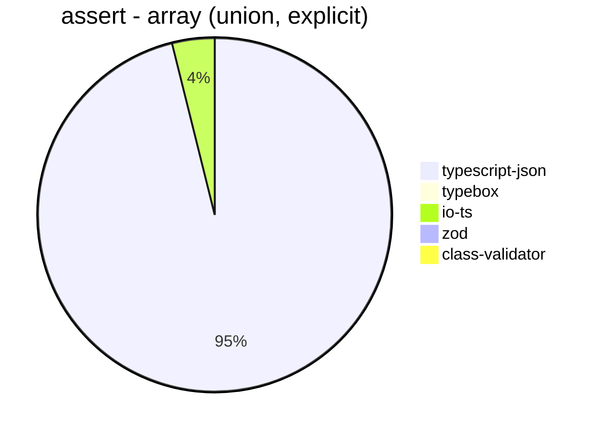
```mermaid
pie title assert - array (union, explicit)
  "typescript-json": 1479.6543032048974
  "typebox": 13.333333333333332
  "io-ts": 59.85783763561541
  "zod": 2.25521518511558
  "class-validator": 5.9913873806403295
```

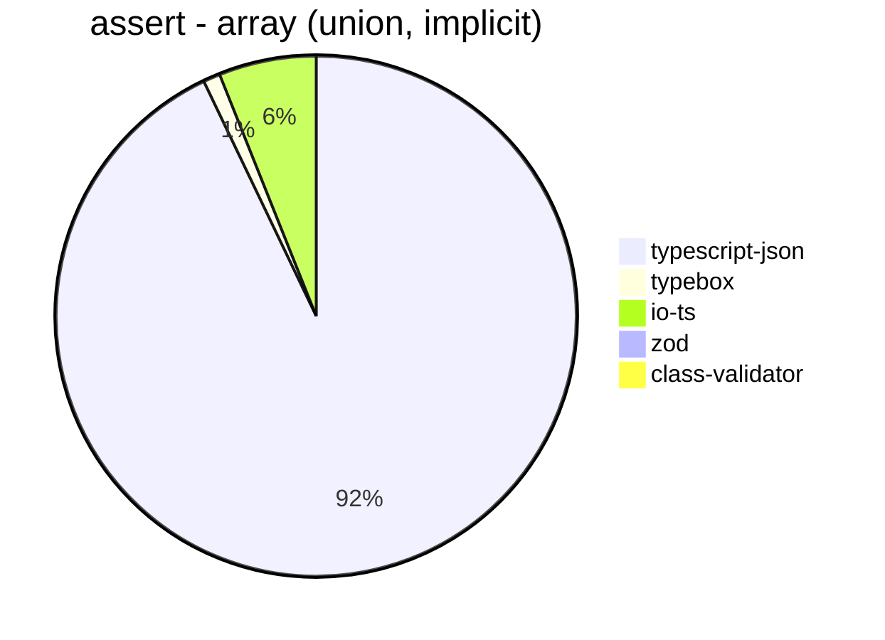
```mermaid
pie title assert - array (union, implicit)
  "typescript-json": 1361.6478308421438
  "typebox": 15.422230581154786
  "io-ts": 88.69014346934974
  "zod": 3.014318010550113
  "class-validator": 6.907834939101981
```

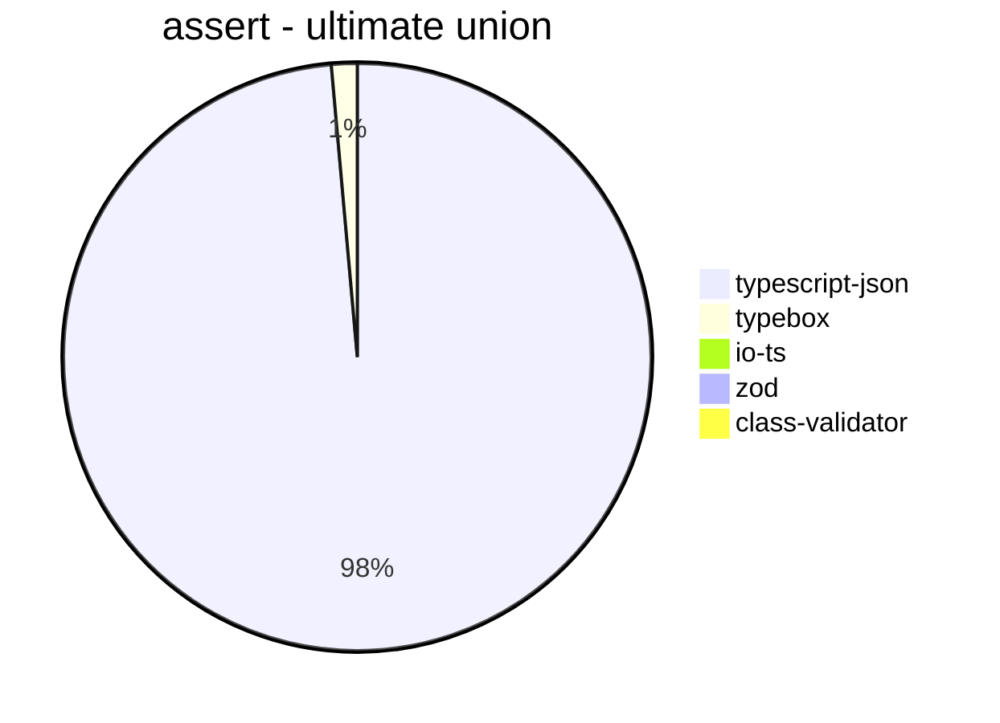
```mermaid
pie title assert - ultimate union
  "typescript-json": 191.7340521114106
  "typebox": 2.7522935779816513
  "io-ts": 0
  "zod": 0.18001800180018002
  "class-validator": 0
```

## valiadate
 Components | typescript-json | typebox | io-ts | zod | class-validator 
------------|-----------------|---------|-------|-----|-----------------
object (hierarchical) | 11402.762631770265 | 523.0226513182324 | 2289.454806312769 | 314.7767606949374 | 48.165987402741756
object (recursive) | 14350.055330136482 | 244.61733309209336 | 1297.7141795205353 | 57.57290686735654 | 31.85073501696193
object (union, explicit) | 3320.582877959927 | 93.37016574585635 | 898.7132352941176 | 27.209607806342653 | 12.853470437017995
object (union, implicit) | 2668.7082405345213 | 66.07275426874536 | 240.2609506057782 | 15.983452425723957 | 12.431719721228102
array (recursive) | 846.7696890709365 | 27.495291902071564 | 139.7265405506649 | 7.180650037792895 | 2.8452200303490134
array (union, explicit) | 1359.91932526586 | 14.72809667673716 | 66.70445956160242 | 2.441773102930128 | 5.805243445692884
array (union, implicit) | 1154.2004421518054 | 18.978933383943822 | 92.95295673531079 | 3.1912896564670548 | 7.727101394647569
ultimate union | 116.01250434178534 | 2.8037383177570097 | Failed | 0.18047283883775492 | Failed

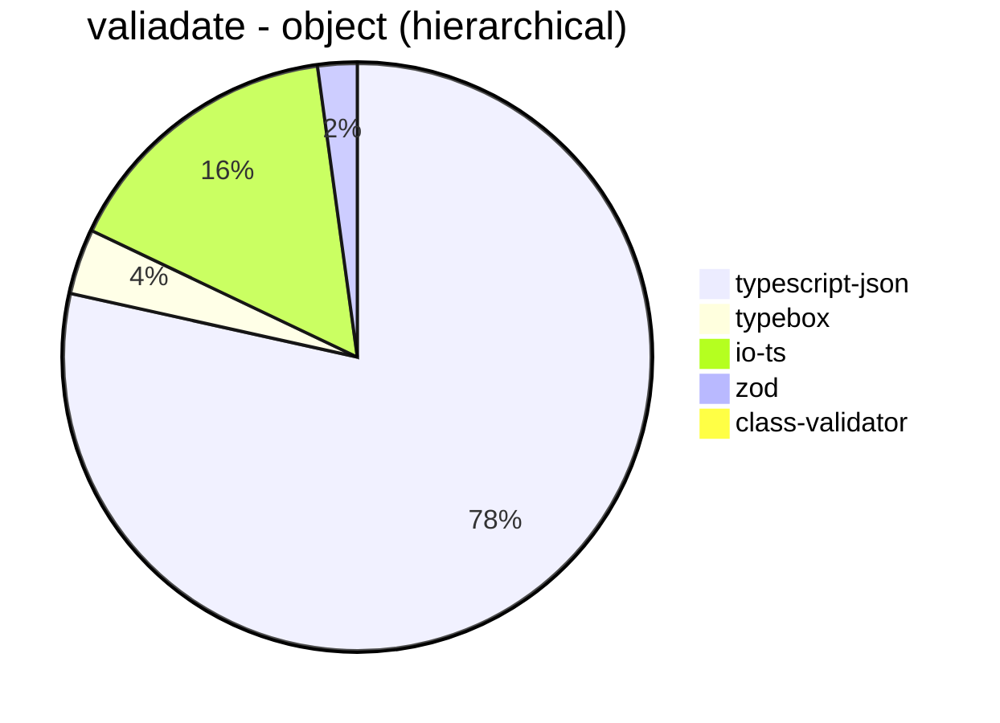
```mermaid
pie title valiadate - object (hierarchical)
  "typescript-json": 11402.762631770265
  "typebox": 523.0226513182324
  "io-ts": 2289.454806312769
  "zod": 314.7767606949374
  "class-validator": 48.165987402741756
```

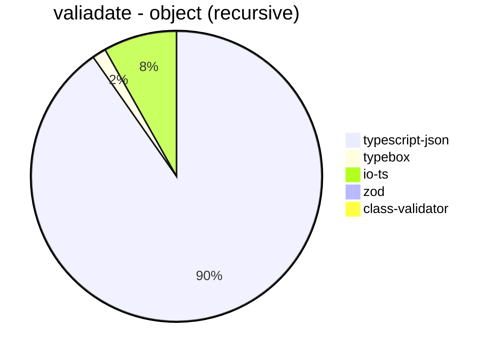
```mermaid
pie title valiadate - object (recursive)
  "typescript-json": 14350.055330136482
  "typebox": 244.61733309209336
  "io-ts": 1297.7141795205353
  "zod": 57.57290686735654
  "class-validator": 31.85073501696193
```

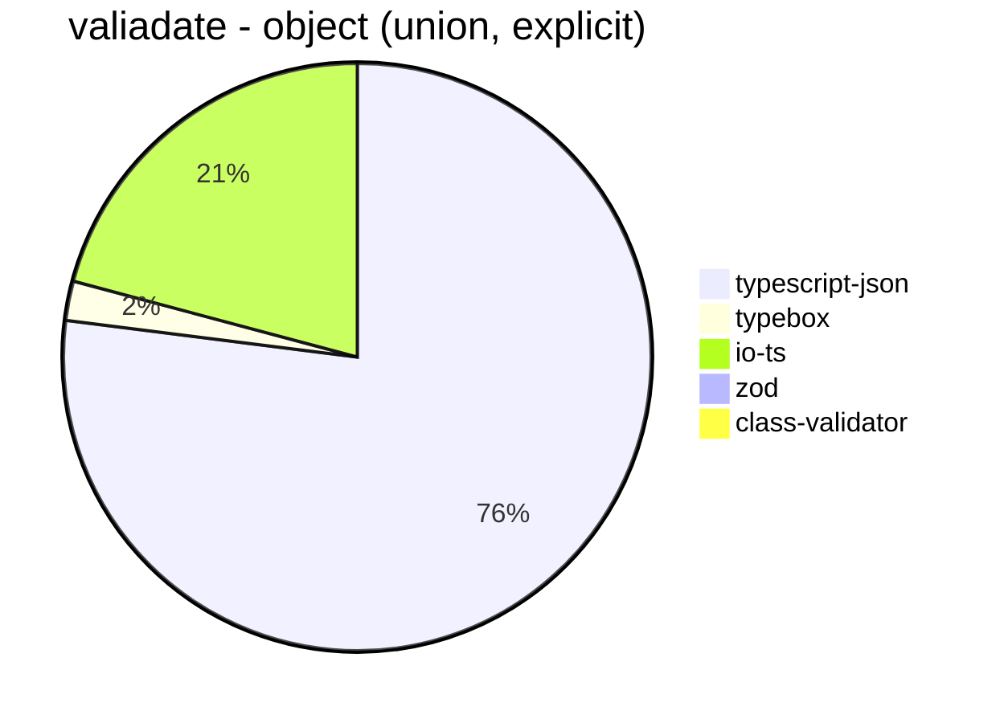
```mermaid
pie title valiadate - object (union, explicit)
  "typescript-json": 3320.582877959927
  "typebox": 93.37016574585635
  "io-ts": 898.7132352941176
  "zod": 27.209607806342653
  "class-validator": 12.853470437017995
```

```mermaid
pie title valiadate - object (union, implicit)
  "typescript-json": 2668.7082405345213
  "typebox": 66.07275426874536
  "io-ts": 240.2609506057782
  "zod": 15.983452425723957
  "class-validator": 12.431719721228102
```

```mermaid
pie title valiadate - array (recursive)
  "typescript-json": 846.7696890709365
  "typebox": 27.495291902071564
  "io-ts": 139.7265405506649
  "zod": 7.180650037792895
  "class-validator": 2.8452200303490134
```

```mermaid
pie title valiadate - array (union, explicit)
  "typescript-json": 1359.91932526586
  "typebox": 14.72809667673716
  "io-ts": 66.70445956160242
  "zod": 2.441773102930128
  "class-validator": 5.805243445692884
```

```mermaid
pie title valiadate - array (union, implicit)
  "typescript-json": 1154.2004421518054
  "typebox": 18.978933383943822
  "io-ts": 92.95295673531079
  "zod": 3.1912896564670548
  "class-validator": 7.727101394647569
```

```mermaid
pie title valiadate - ultimate union
  "typescript-json": 116.01250434178534
  "typebox": 2.8037383177570097
  "io-ts": 0
  "zod": 0.18047283883775492
  "class-validator": 0
```

## optimizer
 Components | typescript-json | ajv | typebox 
------------|-----------------|-----|---------
object (hierarchical) | 63990.981041781706 | 4.1606367583212736 | 151.7921146953405
object (recursive) | 67547.85661492978 | 7.422527370569679 | 672.5450157787266
object (union) | 9144.584837545126 | 3.7050759540570586 | 65.12488436632748
array (hierarchical) | 4979.170576093076 | 5.289075323727887 | 856.5233785822021
array (recursive) | 4880.930232558139 | 7.738769346923367 | 657.0410650665666
array (union) | 3050.395438661026 | 5.187106335679882 | 197.05991812430221
ultimate union | 400.50514162006135 | 0.7173601147776184 | 8.199776369735371

```mermaid
pie title optimizer - object (hierarchical)
  "typescript-json": 63990.981041781706
  "ajv": 4.1606367583212736
  "typebox": 151.7921146953405
```

```mermaid
pie title optimizer - object (recursive)
  "typescript-json": 67547.85661492978
  "ajv": 7.422527370569679
  "typebox": 672.5450157787266
```

```mermaid
pie title optimizer - object (union)
  "typescript-json": 9144.584837545126
  "ajv": 3.7050759540570586
  "typebox": 65.12488436632748
```

```mermaid
pie title optimizer - array (hierarchical)
  "typescript-json": 4979.170576093076
  "ajv": 5.289075323727887
  "typebox": 856.5233785822021
```

```mermaid
pie title optimizer - array (recursive)
  "typescript-json": 4880.930232558139
  "ajv": 7.738769346923367
  "typebox": 657.0410650665666
```

```mermaid
pie title optimizer - array (union)
  "typescript-json": 3050.395438661026
  "ajv": 5.187106335679882
  "typebox": 197.05991812430221
```

```mermaid
pie title optimizer - ultimate union
  "typescript-json": 400.50514162006135
  "ajv": 0.7173601147776184
  "typebox": 8.199776369735371
```

## stringify
 Components | typescript-json | fast-json-stringify | JSON.stringify() 
------------|-----------------|---------------------|------------------
object (simple) | 30913.780532263947 | 24290.819131390876 | 4464.078034139936
object (hierarchical) | 4000.5489478499544 | 3793.827611395179 | 1217.2107944895263
object (recursive) | 4394.968784428939 | 893.1311997005428 | 891.0122989593189
object (union) | 1042.5726292709667 | 1052.9983495323675 | 531.4736648926408
array (hierarchical) | 134.680736898587 | 203.39932760552858 | 62.56921373200443
array (recursive) | 187.89983549625296 | 99.83361064891847 | 101.03092783505154
array (union) | 260.14625228519196 | 172.70553614125436 | 188.5703984135569
ultimate union | 94.8651000870322 | 47.834843907351456 | 132.5701624815362

```mermaid
pie title stringify - object (simple)
  "typescript-json": 30913.780532263947
  "fast-json-stringify": 24290.819131390876
  "JSON.stringify()": 4464.078034139936
```

```mermaid
pie title stringify - object (hierarchical)
  "typescript-json": 4000.5489478499544
  "fast-json-stringify": 3793.827611395179
  "JSON.stringify()": 1217.2107944895263
```

```mermaid
pie title stringify - object (recursive)
  "typescript-json": 4394.968784428939
  "fast-json-stringify": 893.1311997005428
  "JSON.stringify()": 891.0122989593189
```

```mermaid
pie title stringify - object (union)
  "typescript-json": 1042.5726292709667
  "fast-json-stringify": 1052.9983495323675
  "JSON.stringify()": 531.4736648926408
```

```mermaid
pie title stringify - array (hierarchical)
  "typescript-json": 134.680736898587
  "fast-json-stringify": 203.39932760552858
  "JSON.stringify()": 62.56921373200443
```

```mermaid
pie title stringify - array (recursive)
  "typescript-json": 187.89983549625296
  "fast-json-stringify": 99.83361064891847
  "JSON.stringify()": 101.03092783505154
```

```mermaid
pie title stringify - array (union)
  "typescript-json": 260.14625228519196
  "fast-json-stringify": 172.70553614125436
  "JSON.stringify()": 188.5703984135569
```

```mermaid
pie title stringify - ultimate union
  "typescript-json": 94.8651000870322
  "fast-json-stringify": 47.834843907351456
  "JSON.stringify()": 132.5701624815362
```

