# Benchmark of `typescript-json`
> CPU: AMD Ryzen 7 3700X 8-Core Processor
> Memory: 16,333 MB
> NodeJS version: v16.17.1
> TypeScript-JSON version: 3.3.12

## is
 Components | typescript-json | io-ts | class-validator | zod | typebox | ajv 
------------|-----------------|-------|-----------------|-----|---------|-----
object (hierarchical) | 71770.39055404178 | 6367.729155411489 | 51.85185185185185 | 336.0205203371198 | 126776.67354209638 | 54065.18572469046
object (recursive) | 65843.33874166217 | 3629.730713245997 | 34.02003402003402 | 55.89374654122855 | 74190.39642657732 | Failed
object (union, explicit) | 10545.989304812834 | 2309.319715484224 | 13.430127041742287 | 28.11320754716981 | 10360.830424398311 | 978.6652078774617
object (union, implicit) | 11122.193595877807 | 2329.3900184842882 | 14.123768816205166 | 42.660208643815196 | 13257.987513771575 | Failed
array (recursive) | 6006.049495875343 | 364.0630867442734 | 3.2063372312334972 | 7.231596513999629 | 5464.279121284844 | Failed
array (union, explicit) | 2852.642819006941 | 284.8124767916821 | 6.578947368421052 | 2.4390243902439024 | 1629.147571035747 | Failed
array (union, implicit) | 3105.658304339864 | 313.82405745062835 | 7.482229704451926 | 3.018867924528302 | 1916.3078075266803 | Failed
ultimate union | 496.86693697014374 | Failed | Failed | 0.1820498816675769 | 726.2669521770164 | Failed

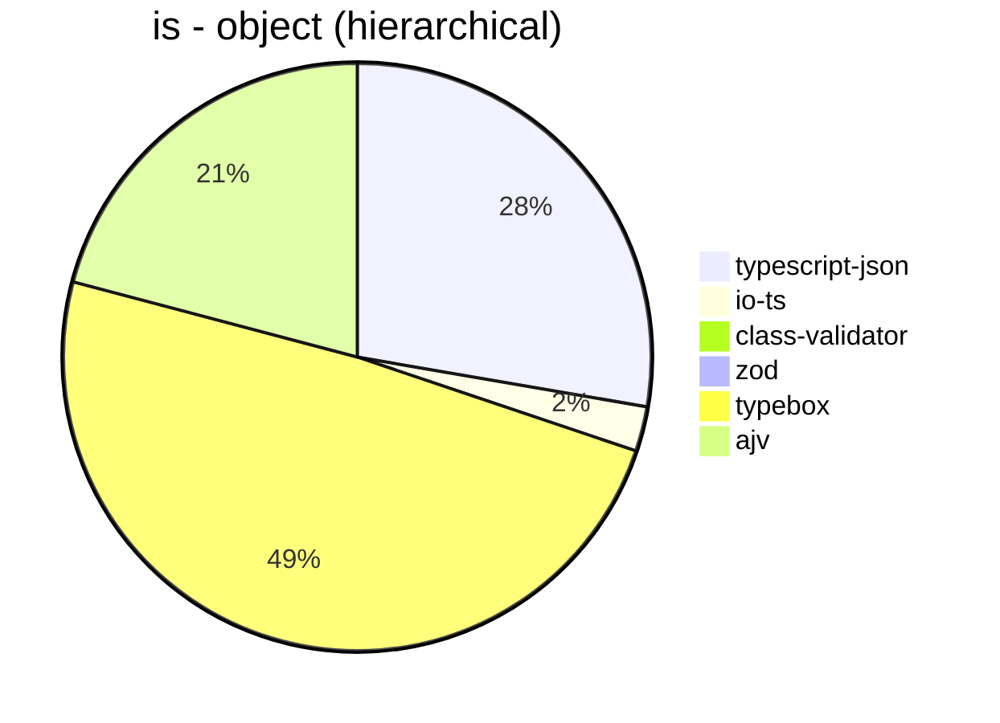
```mermaid
pie title is - object (hierarchical)
  "typescript-json": 71770.39055404178
  "io-ts": 6367.729155411489
  "class-validator": 51.85185185185185
  "zod": 336.0205203371198
  "typebox": 126776.67354209638
  "ajv": 54065.18572469046
```

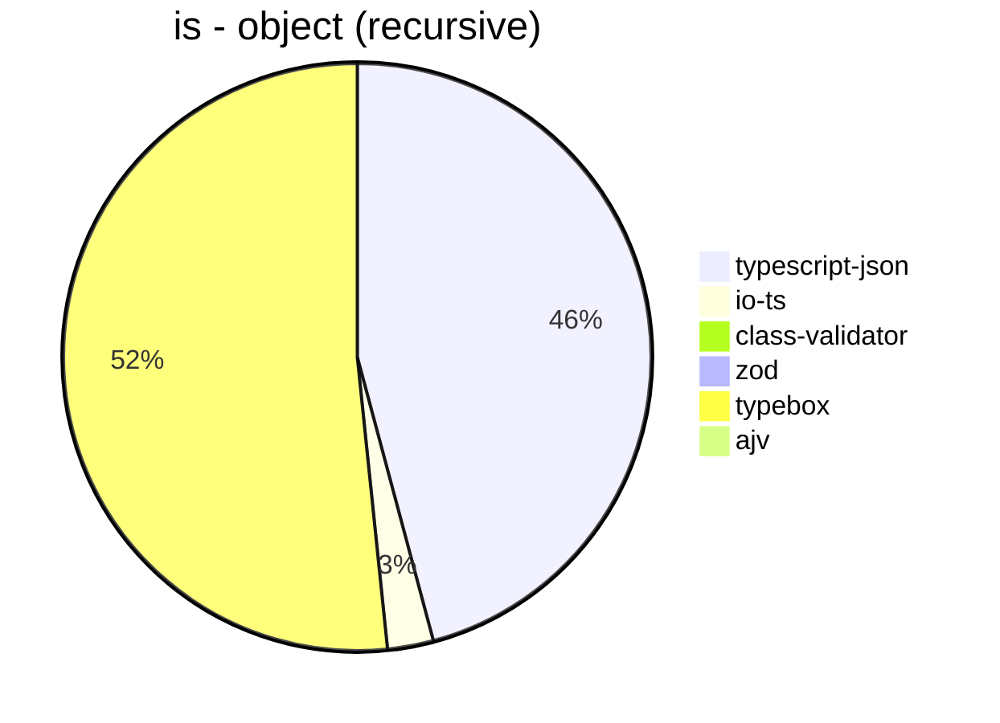
```mermaid
pie title is - object (recursive)
  "typescript-json": 65843.33874166217
  "io-ts": 3629.730713245997
  "class-validator": 34.02003402003402
  "zod": 55.89374654122855
  "typebox": 74190.39642657732
  "ajv": 0
```

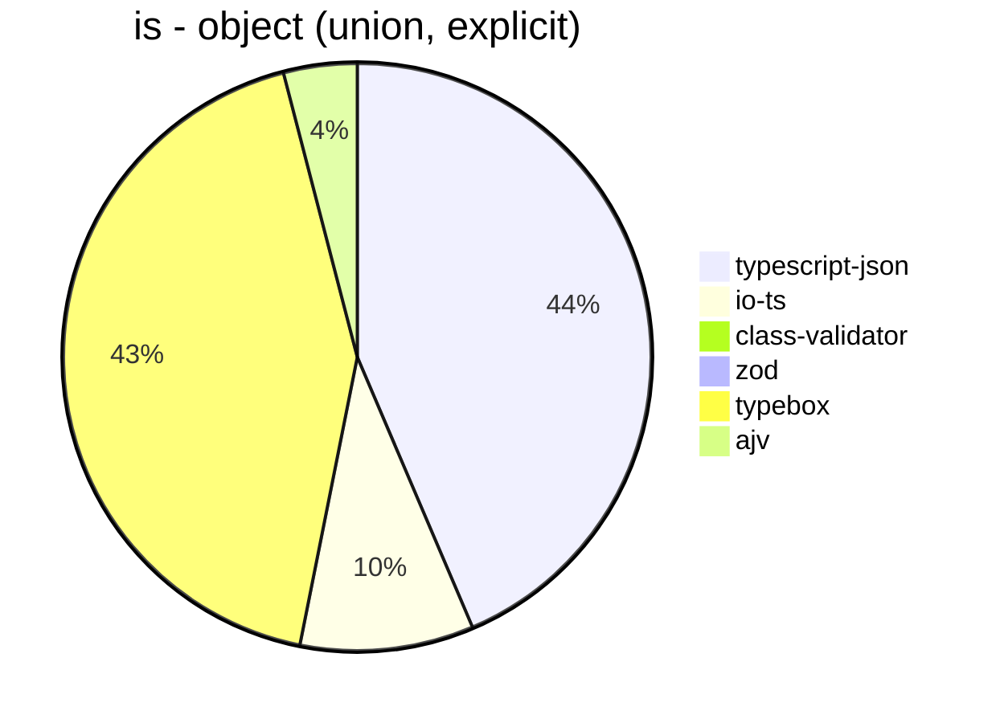
```mermaid
pie title is - object (union, explicit)
  "typescript-json": 10545.989304812834
  "io-ts": 2309.319715484224
  "class-validator": 13.430127041742287
  "zod": 28.11320754716981
  "typebox": 10360.830424398311
  "ajv": 978.6652078774617
```

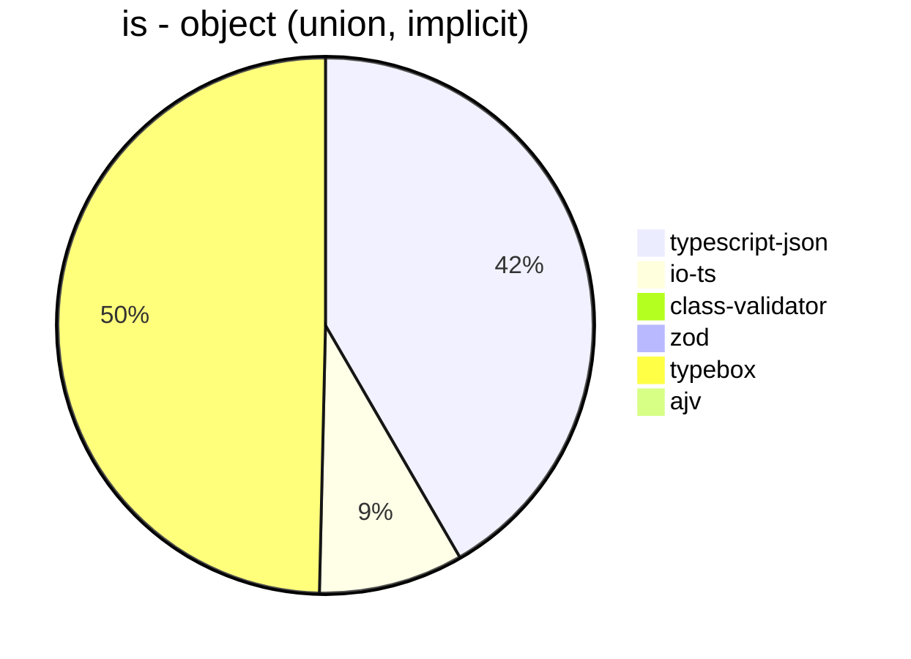
```mermaid
pie title is - object (union, implicit)
  "typescript-json": 11122.193595877807
  "io-ts": 2329.3900184842882
  "class-validator": 14.123768816205166
  "zod": 42.660208643815196
  "typebox": 13257.987513771575
  "ajv": 0
```

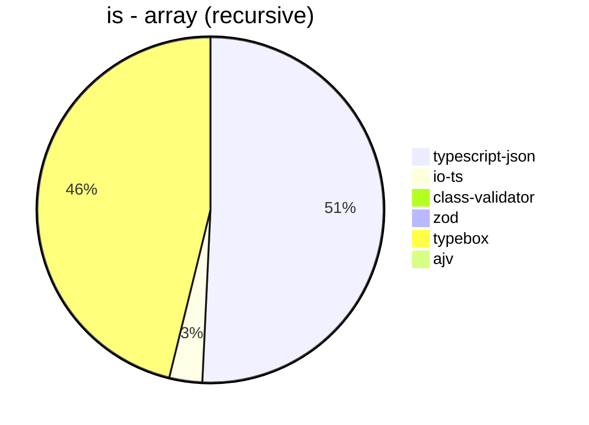
```mermaid
pie title is - array (recursive)
  "typescript-json": 6006.049495875343
  "io-ts": 364.0630867442734
  "class-validator": 3.2063372312334972
  "zod": 7.231596513999629
  "typebox": 5464.279121284844
  "ajv": 0
```

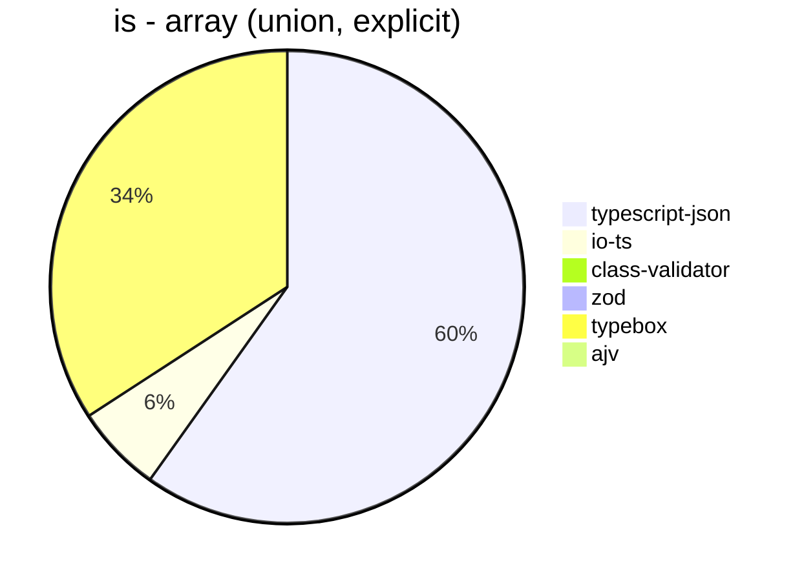
```mermaid
pie title is - array (union, explicit)
  "typescript-json": 2852.642819006941
  "io-ts": 284.8124767916821
  "class-validator": 6.578947368421052
  "zod": 2.4390243902439024
  "typebox": 1629.147571035747
  "ajv": 0
```

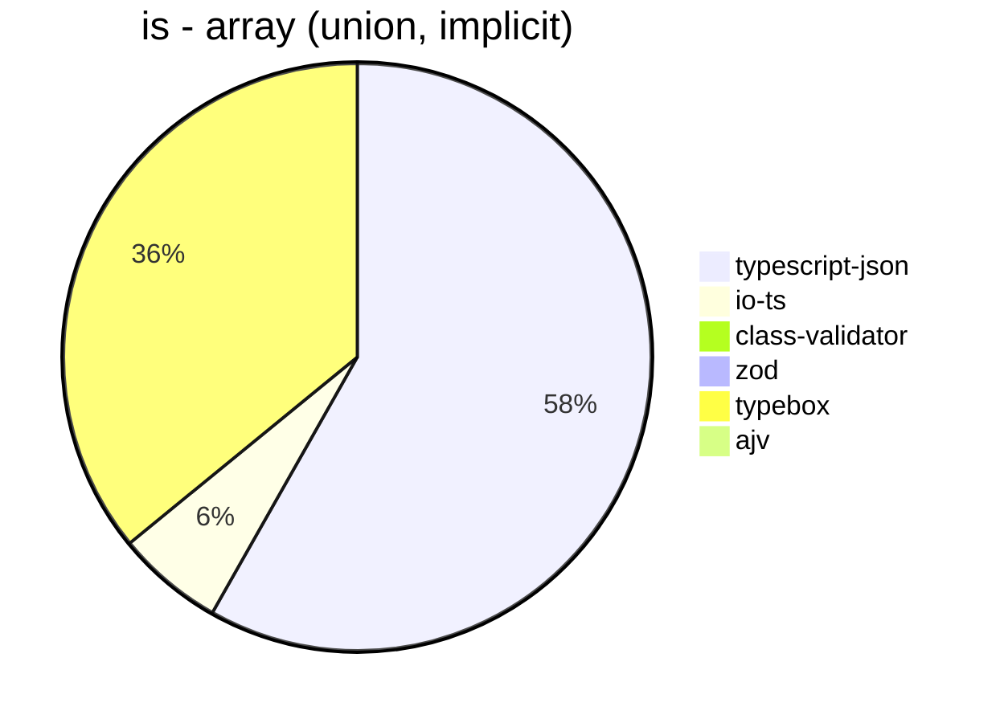
```mermaid
pie title is - array (union, implicit)
  "typescript-json": 3105.658304339864
  "io-ts": 313.82405745062835
  "class-validator": 7.482229704451926
  "zod": 3.018867924528302
  "typebox": 1916.3078075266803
  "ajv": 0
```

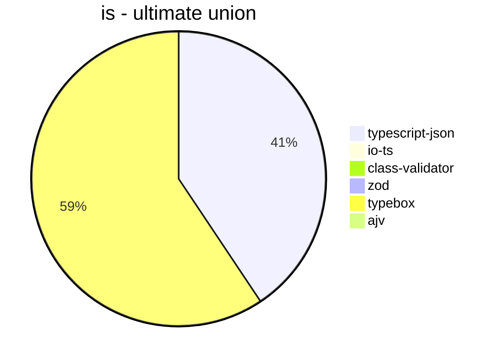
```mermaid
pie title is - ultimate union
  "typescript-json": 496.86693697014374
  "io-ts": 0
  "class-validator": 0
  "zod": 0.1820498816675769
  "typebox": 726.2669521770164
  "ajv": 0
```

## assert
 Components | typescript-json | class-validator | io-ts | zod | typebox 
------------|-----------------|-----------------|-------|-----|---------
object (hierarchical) | 15806.161745827983 | 52.18356772760918 | 2700.422716412424 | 351.7719857491093 | 108401.20097579283
object (recursive) | 24031.191632424354 | 32.335550628233555 | 1353.2538955087075 | 57.20218991882198 | 66719.12315095348
object (union, explicit) | 4039.9133104569264 | 13.873473917869035 | 813.4287286736379 | 28.52285606346808 | 10117.571533382245
object (union, implicit) | 3975.974866013676 | 14.495481927710843 | 616.0473882606354 | 42.99453139732227 | 11248.092313418947
array (recursive) | 1281.9129140305174 | 3.0331753554502368 | 121.65137614678899 | 7.317073170731708 | 5512.892376681614
array (union, explicit) | 1512.439658373561 | 6.460193805814175 | 61.206281227694504 | 2.2522522522522523 | 1702.5870091196723
array (union, implicit) | 1399.2402315484806 | 7.277477141257697 | 78.16561455625695 | 3.0109145652992098 | 1817.3702808257394
ultimate union | 216.1968037349614 | Failed | Failed | Failed | 743.9956331877729

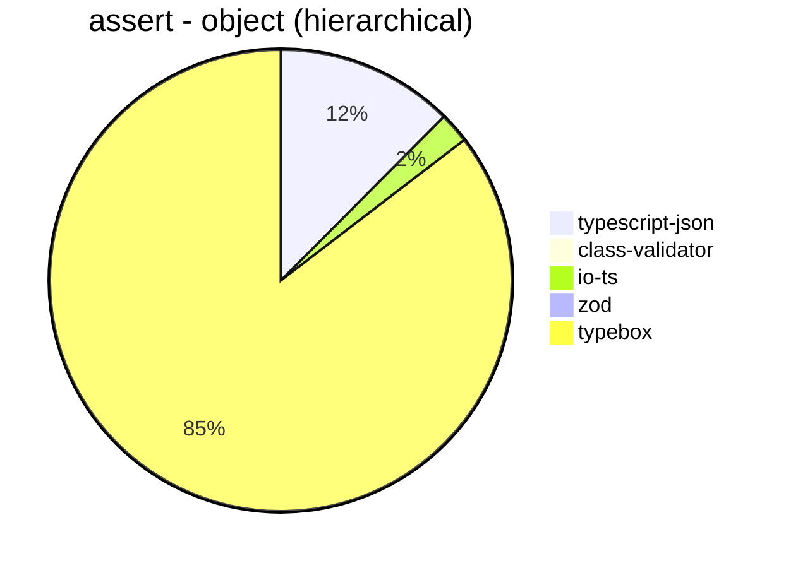
```mermaid
pie title assert - object (hierarchical)
  "typescript-json": 15806.161745827983
  "class-validator": 52.18356772760918
  "io-ts": 2700.422716412424
  "zod": 351.7719857491093
  "typebox": 108401.20097579283
```

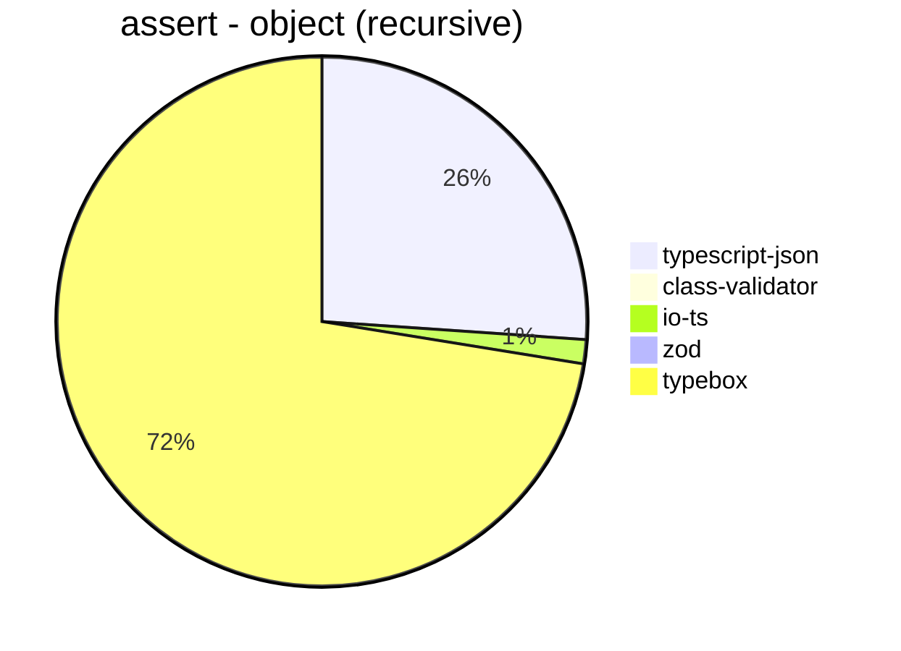
```mermaid
pie title assert - object (recursive)
  "typescript-json": 24031.191632424354
  "class-validator": 32.335550628233555
  "io-ts": 1353.2538955087075
  "zod": 57.20218991882198
  "typebox": 66719.12315095348
```

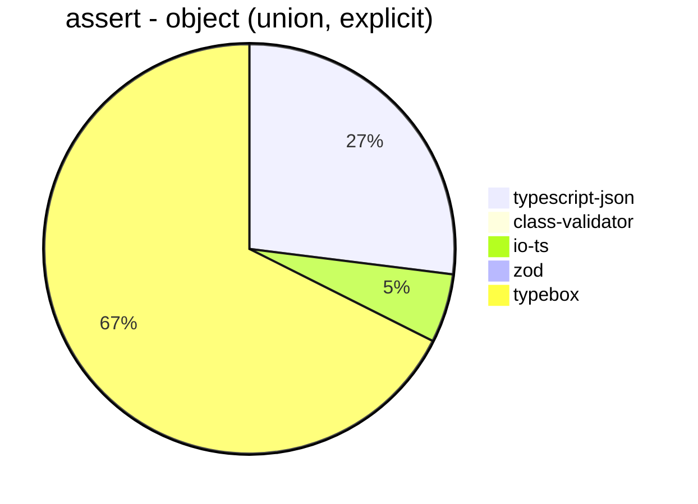
```mermaid
pie title assert - object (union, explicit)
  "typescript-json": 4039.9133104569264
  "class-validator": 13.873473917869035
  "io-ts": 813.4287286736379
  "zod": 28.52285606346808
  "typebox": 10117.571533382245
```

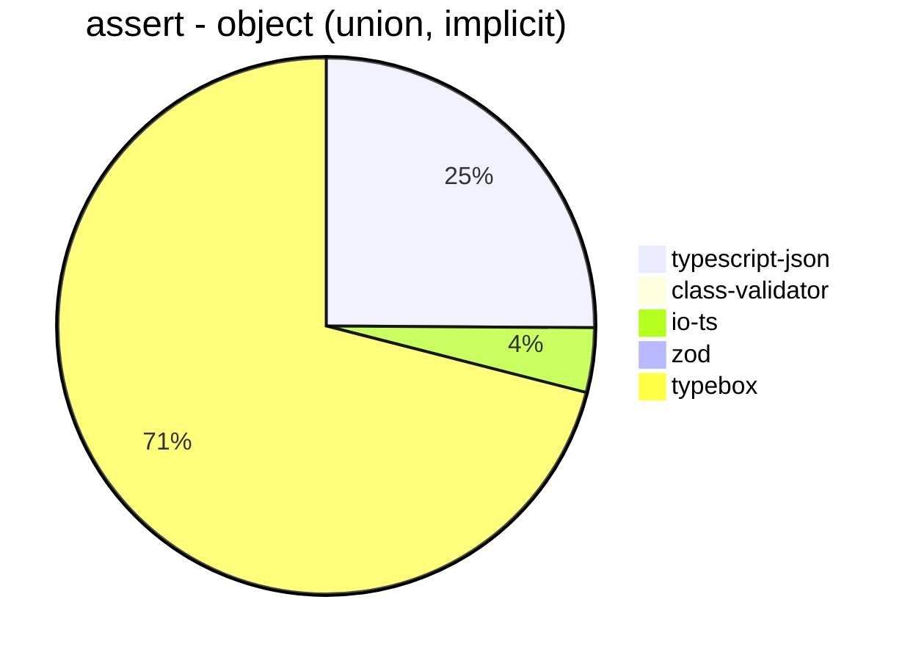
```mermaid
pie title assert - object (union, implicit)
  "typescript-json": 3975.974866013676
  "class-validator": 14.495481927710843
  "io-ts": 616.0473882606354
  "zod": 42.99453139732227
  "typebox": 11248.092313418947
```

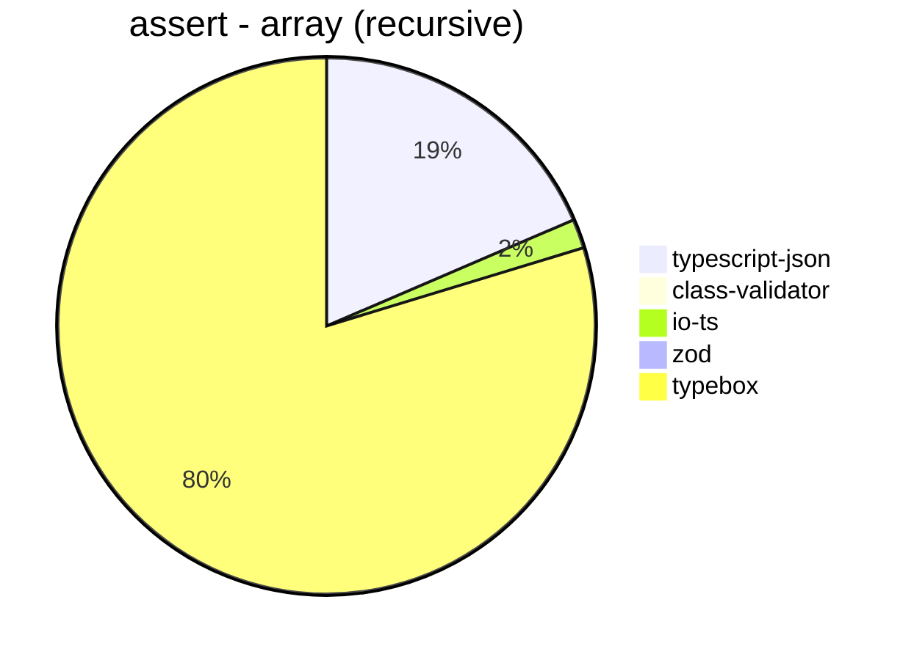
```mermaid
pie title assert - array (recursive)
  "typescript-json": 1281.9129140305174
  "class-validator": 3.0331753554502368
  "io-ts": 121.65137614678899
  "zod": 7.317073170731708
  "typebox": 5512.892376681614
```

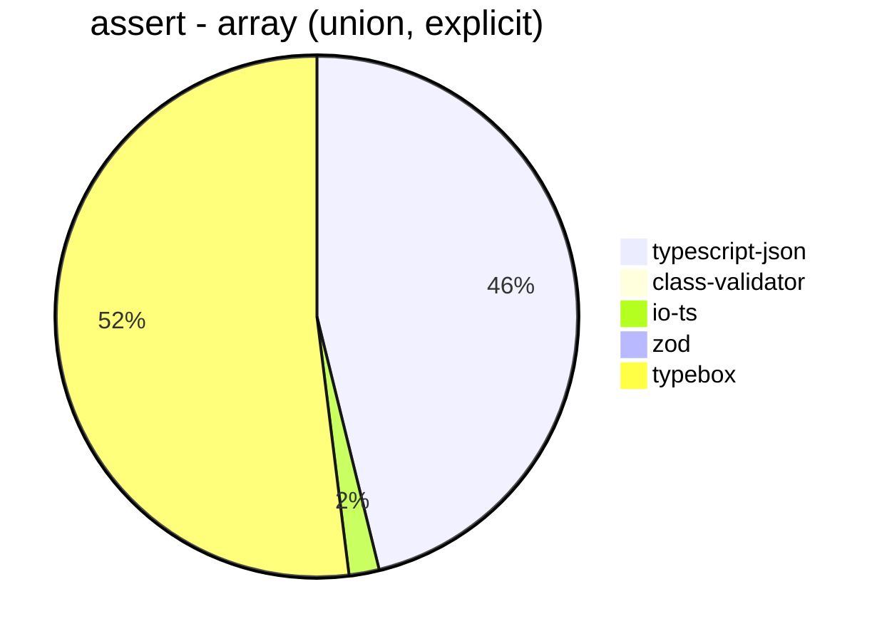
```mermaid
pie title assert - array (union, explicit)
  "typescript-json": 1512.439658373561
  "class-validator": 6.460193805814175
  "io-ts": 61.206281227694504
  "zod": 2.2522522522522523
  "typebox": 1702.5870091196723
```

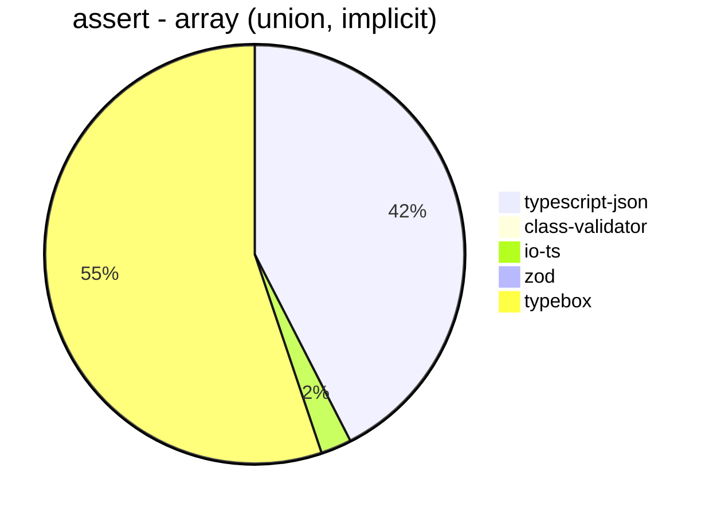
```mermaid
pie title assert - array (union, implicit)
  "typescript-json": 1399.2402315484806
  "class-validator": 7.277477141257697
  "io-ts": 78.16561455625695
  "zod": 3.0109145652992098
  "typebox": 1817.3702808257394
```

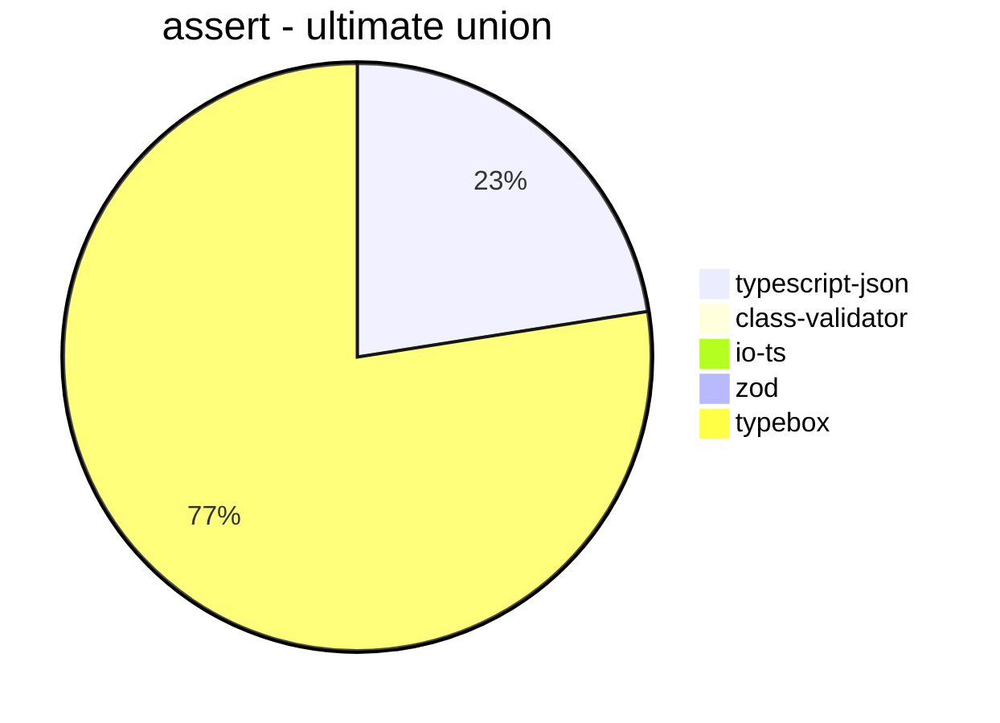
```mermaid
pie title assert - ultimate union
  "typescript-json": 216.1968037349614
  "class-validator": 0
  "io-ts": 0
  "zod": 0
  "typebox": 743.9956331877729
```

## valiadate
 Components | typescript-json | class-validator | io-ts | zod | typebox 
------------|-----------------|-----------------|-------|-----|---------
object (hierarchical) | 11593.896713615022 | 51.50452279859701 | 2452.5230602278893 | 335.50670640834574 | 109539.30700447093
object (recursive) | 14371.096586782862 | 33.548142532221384 | 1331.119719608928 | 58.768306421329335 | 73515.16272189349
object (union, explicit) | 3335.1759719918928 | 13.807069219440352 | 913.632986627043 | 28.996422519299568 | 10028.793915248098
object (union, implicit) | 3732.427968434575 | 14.346934972983044 | 649.5757356923633 | 43.94568087514146 | 11127.926267281106
array (recursive) | 890.9935004642526 | 2.992891881780771 | 134.88460083238746 | 7.714016933207901 | 5423.415170392085
array (union, explicit) | 1182.608695652174 | 6.042296072507552 | 63.837570879824405 | 2.446368084305608 | 1688.1400111711039
array (union, implicit) | 1194.123048668503 | 7.245030652052758 | 85.08224617129893 | 2.935779816513761 | 1976.323639075317
ultimate union | 116.70440689775302 | Failed | Failed | Failed | 715.0817904008629

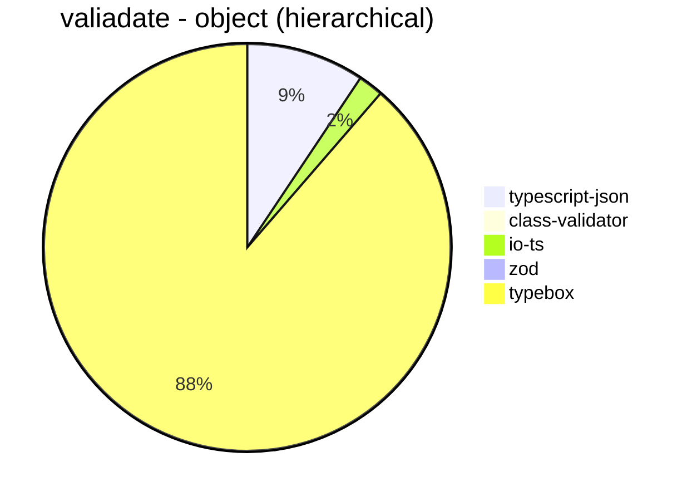
```mermaid
pie title valiadate - object (hierarchical)
  "typescript-json": 11593.896713615022
  "class-validator": 51.50452279859701
  "io-ts": 2452.5230602278893
  "zod": 335.50670640834574
  "typebox": 109539.30700447093
```

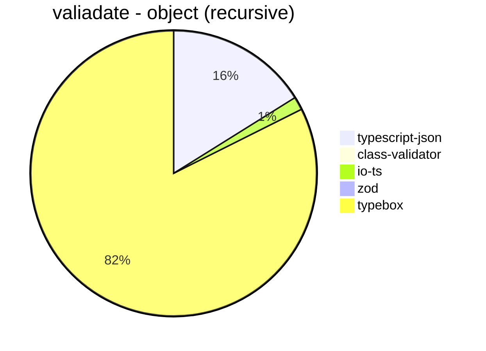
```mermaid
pie title valiadate - object (recursive)
  "typescript-json": 14371.096586782862
  "class-validator": 33.548142532221384
  "io-ts": 1331.119719608928
  "zod": 58.768306421329335
  "typebox": 73515.16272189349
```

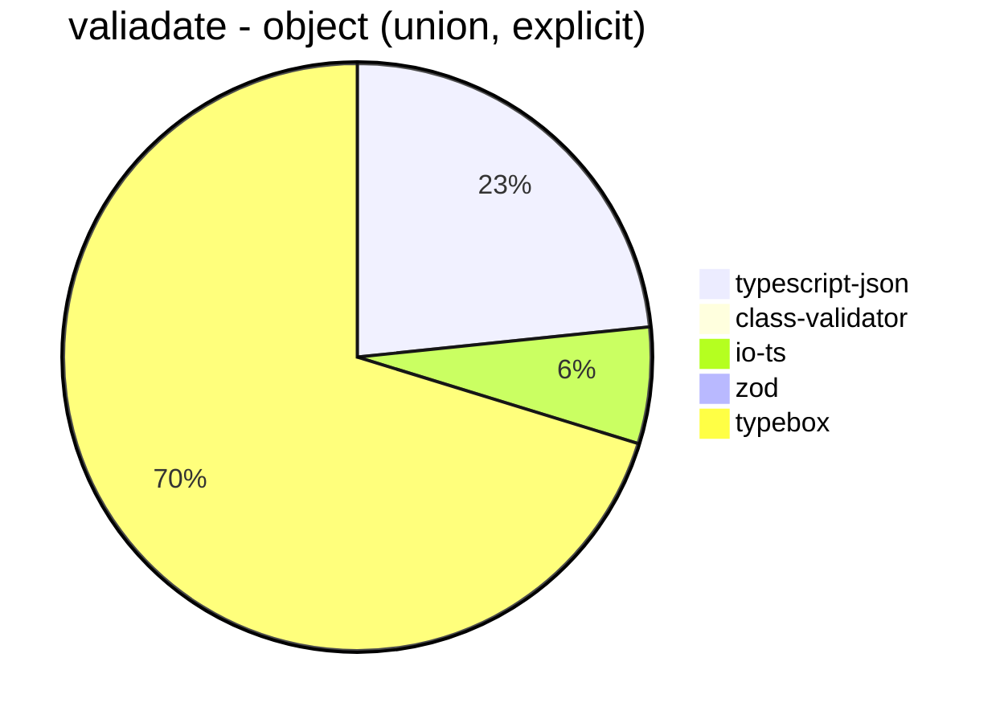
```mermaid
pie title valiadate - object (union, explicit)
  "typescript-json": 3335.1759719918928
  "class-validator": 13.807069219440352
  "io-ts": 913.632986627043
  "zod": 28.996422519299568
  "typebox": 10028.793915248098
```

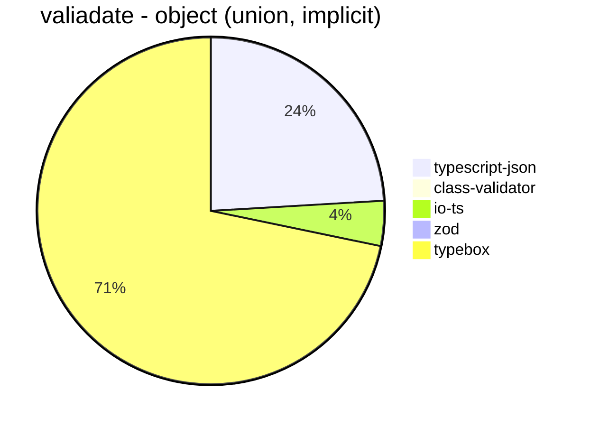
```mermaid
pie title valiadate - object (union, implicit)
  "typescript-json": 3732.427968434575
  "class-validator": 14.346934972983044
  "io-ts": 649.5757356923633
  "zod": 43.94568087514146
  "typebox": 11127.926267281106
```

```mermaid
pie title valiadate - array (recursive)
  "typescript-json": 890.9935004642526
  "class-validator": 2.992891881780771
  "io-ts": 134.88460083238746
  "zod": 7.714016933207901
  "typebox": 5423.415170392085
```

```mermaid
pie title valiadate - array (union, explicit)
  "typescript-json": 1182.608695652174
  "class-validator": 6.042296072507552
  "io-ts": 63.837570879824405
  "zod": 2.446368084305608
  "typebox": 1688.1400111711039
```

```mermaid
pie title valiadate - array (union, implicit)
  "typescript-json": 1194.123048668503
  "class-validator": 7.245030652052758
  "io-ts": 85.08224617129893
  "zod": 2.935779816513761
  "typebox": 1976.323639075317
```

```mermaid
pie title valiadate - ultimate union
  "typescript-json": 116.70440689775302
  "class-validator": 0
  "io-ts": 0
  "zod": 0
  "typebox": 715.0817904008629
```

## optimizer
 Components | typescript-json | fast-json-stringify | JSON.stringify() 
------------|-----------------|---------------------|------------------
object (simple) | 60480.10130246021 | 26.785714285714285 | 4269.949676491732
object (hierarchical) | 3973.087557603687 | 9.983361064891847 | 1213.5976287513895
object (recursive) | 4318.291550603529 | 58.33782085801472 | 892.4250884049878
object (union) | 1663.0889576132436 | 1.0869565217391306 | 724.5883021010789
array (hierarchical) | 147.33823265818248 | 10.0151171579743 | 69.60385042576823
array (recursive) | 176.7676767676768 | 38.42566685319903 | 103.76822571482674
array (union) | 243.47343084613962 | 2.4271844660194177 | 194.79800774764803
ultimate union | 99.71202303815694 | 0.16286644951140067 | 136.65624425234503

```mermaid
pie title optimizer - object (simple)
  "typescript-json": 60480.10130246021
  "fast-json-stringify": 26.785714285714285
  "JSON.stringify()": 4269.949676491732
```

```mermaid
pie title optimizer - object (hierarchical)
  "typescript-json": 3973.087557603687
  "fast-json-stringify": 9.983361064891847
  "JSON.stringify()": 1213.5976287513895
```

```mermaid
pie title optimizer - object (recursive)
  "typescript-json": 4318.291550603529
  "fast-json-stringify": 58.33782085801472
  "JSON.stringify()": 892.4250884049878
```

```mermaid
pie title optimizer - object (union)
  "typescript-json": 1663.0889576132436
  "fast-json-stringify": 1.0869565217391306
  "JSON.stringify()": 724.5883021010789
```

```mermaid
pie title optimizer - array (hierarchical)
  "typescript-json": 147.33823265818248
  "fast-json-stringify": 10.0151171579743
  "JSON.stringify()": 69.60385042576823
```

```mermaid
pie title optimizer - array (recursive)
  "typescript-json": 176.7676767676768
  "fast-json-stringify": 38.42566685319903
  "JSON.stringify()": 103.76822571482674
```

```mermaid
pie title optimizer - array (union)
  "typescript-json": 243.47343084613962
  "fast-json-stringify": 2.4271844660194177
  "JSON.stringify()": 194.79800774764803
```

```mermaid
pie title optimizer - ultimate union
  "typescript-json": 99.71202303815694
  "fast-json-stringify": 0.16286644951140067
  "JSON.stringify()": 136.65624425234503
```

## stringify
 Components | typescript-json | fast-json-stringify | JSON.stringify() 
------------|-----------------|---------------------|------------------
object (simple) | 63901.56278067181 | 22761.4361217423 | 4361.73365438044
object (hierarchical) | 3708.6247086247085 | 3692.566305565932 | 1212.318570896911
object (recursive) | 4108.113102938459 | 877.9498525073745 | 888.622090875508
object (union) | 1615.850302696753 | 1176.7758096260511 | 702.9520295202952
array (hierarchical) | 116.36363636363636 | 155.47196847572988 | 58.133035215204025
array (recursive) | 196.55797101449278 | 97.75670253510852 | 98.32402234636871
array (union) | 256.7567567567568 | 177.45225292045245 | 197.66346335029206
ultimate union | 103.19016218142934 | 58.30852740325687 | 140.2461767997016

```mermaid
pie title stringify - object (simple)
  "typescript-json": 63901.56278067181
  "fast-json-stringify": 22761.4361217423
  "JSON.stringify()": 4361.73365438044
```

```mermaid
pie title stringify - object (hierarchical)
  "typescript-json": 3708.6247086247085
  "fast-json-stringify": 3692.566305565932
  "JSON.stringify()": 1212.318570896911
```

```mermaid
pie title stringify - object (recursive)
  "typescript-json": 4108.113102938459
  "fast-json-stringify": 877.9498525073745
  "JSON.stringify()": 888.622090875508
```

```mermaid
pie title stringify - object (union)
  "typescript-json": 1615.850302696753
  "fast-json-stringify": 1176.7758096260511
  "JSON.stringify()": 702.9520295202952
```

```mermaid
pie title stringify - array (hierarchical)
  "typescript-json": 116.36363636363636
  "fast-json-stringify": 155.47196847572988
  "JSON.stringify()": 58.133035215204025
```

```mermaid
pie title stringify - array (recursive)
  "typescript-json": 196.55797101449278
  "fast-json-stringify": 97.75670253510852
  "JSON.stringify()": 98.32402234636871
```

```mermaid
pie title stringify - array (union)
  "typescript-json": 256.7567567567568
  "fast-json-stringify": 177.45225292045245
  "JSON.stringify()": 197.66346335029206
```

```mermaid
pie title stringify - ultimate union
  "typescript-json": 103.19016218142934
  "fast-json-stringify": 58.30852740325687
  "JSON.stringify()": 140.2461767997016
```

