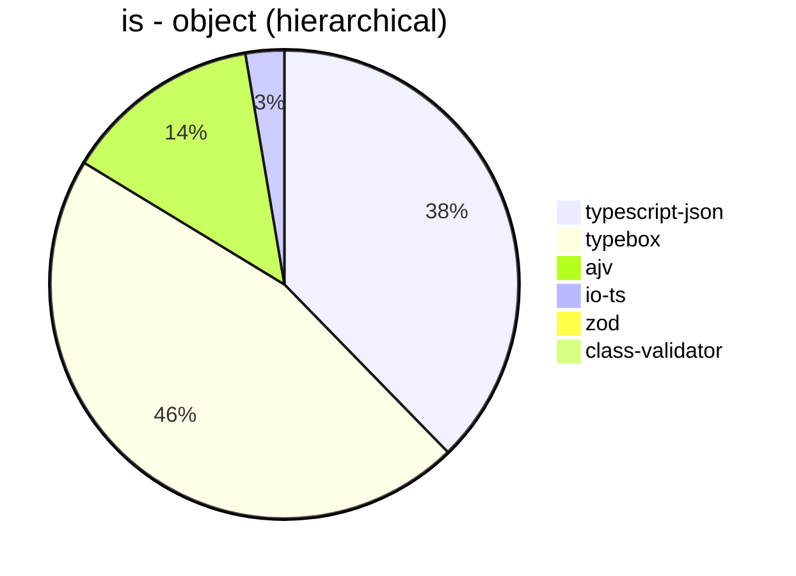
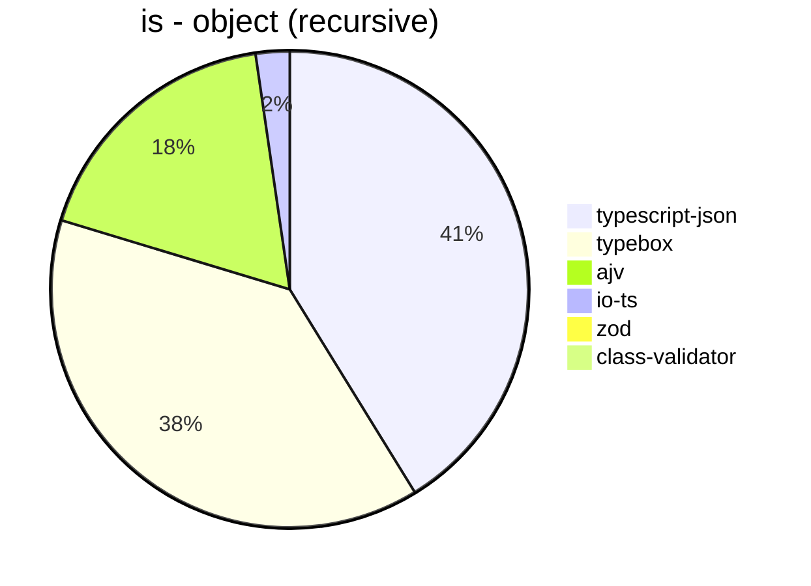
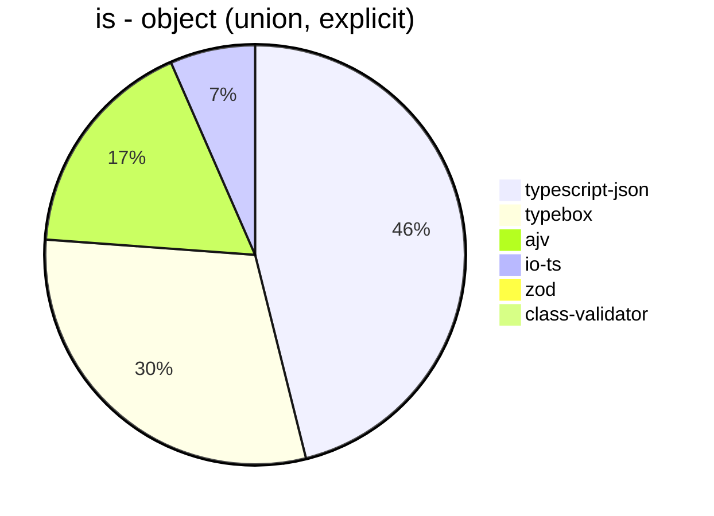
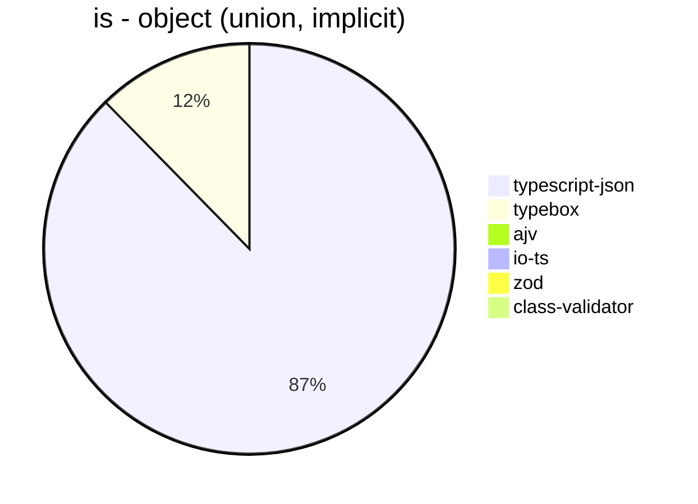
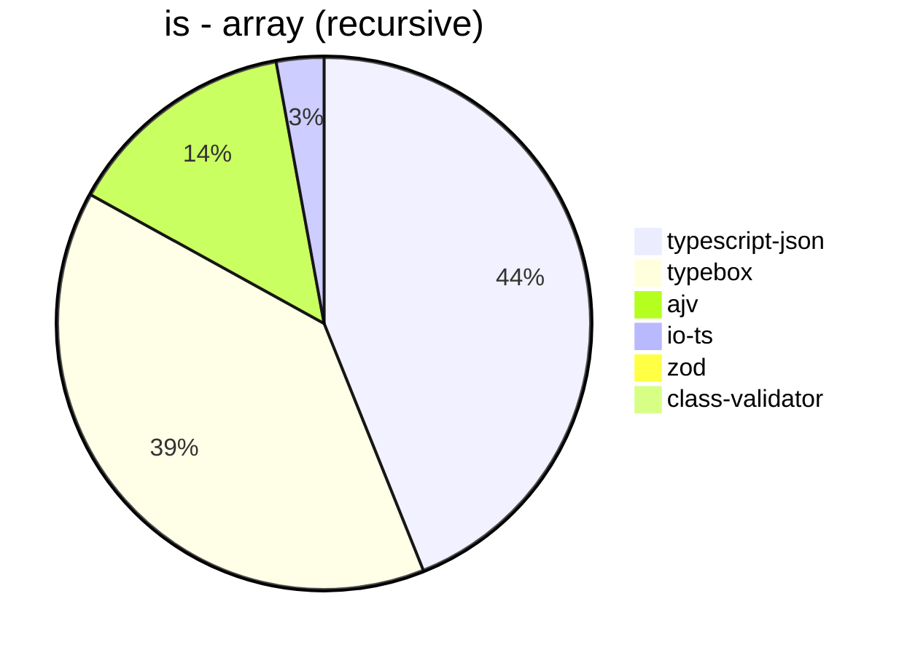
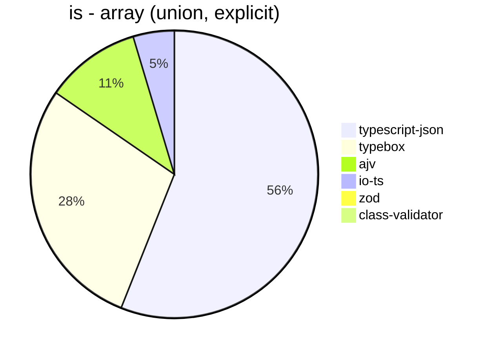
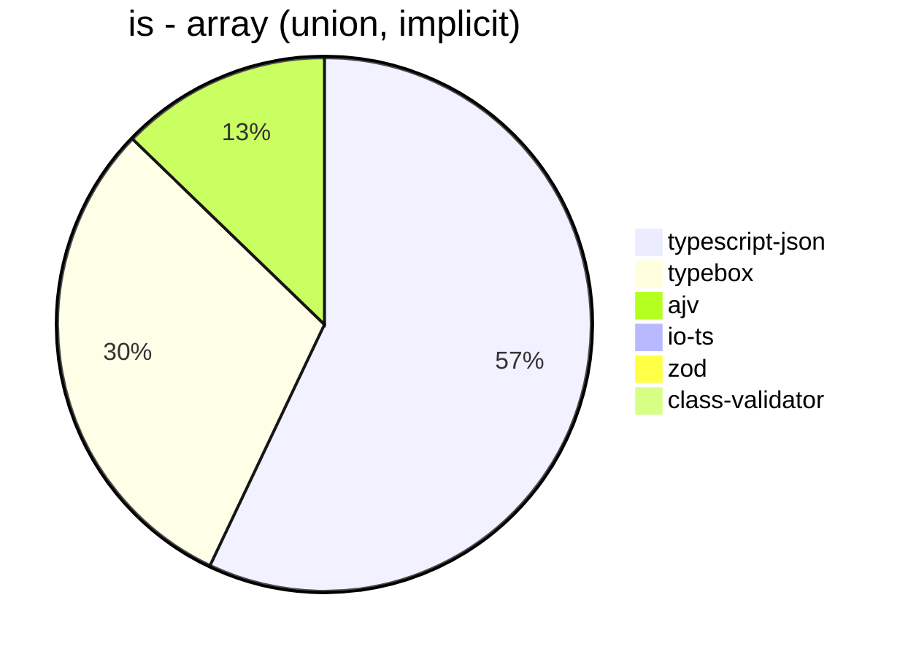

# Benchmark of `typescript-json`
> CPU: AMD Ryzen 7 3700X 8-Core Processor
> Memory: 16,333 MB
> NodeJS version: v16.17.1
> TypeScript-JSON version: 3.3.18

## is
 Components | typescript-json | typebox | ajv | io-ts | zod | class-validator 
------------|-----------------|---------|-----|-------|-----|-----------------
object (simple) | 508027.1111925262 | 1032865.1213725132 | 460221.0584343991 | 28042.95154185022 | 3014.322438486963 | 145.16129032258067
object (hierarchical) | 94015.33345649362 | 114688.93412287196 | 34011.56387665198 | 6659.078289838979 | 331.1091073038774 | 47.36275565123789
object (recursive) | 75067.48354059986 | 70065.83986868503 | 32807.51348335503 | 4185.870932949848 | 54.475421863536326 | 29.84524686809138
object (union, explicit) | 16158.129175946548 | 10534.67889908257 | 6055.96812171708 | 2298.6583348649147 | 27.166882276843467 | 84.01792382374907
object (union, implicit) | 13640.388567158603 | 1918.0236861584012 | Failed | Failed | 15.30891197375615 | 57.876006742835735
array (recursive) | 5950.605601816806 | 5298.117346006215 | 1907.7429983525535 | 390.43751153775156 | 7.277477141257696 | 2.796942010068991
array (union, explicit) | 3341.4137675795705 | 1703.2723239046036 | 641.9799032378116 | 276.1459307764266 | 2.754315093646713 | 31.662269129287598
array (union, implicit) | 1515.069967707212 | 801.2939001848429 | 339.1401037805782 | Failed | 1.6366612111292962 | 22.243346007604565
ultimate union | 452.3026315789474 | 159.67741935483872 | Failed | Failed | 0.47740292807129225 | Failed

## assertType (iterate)
