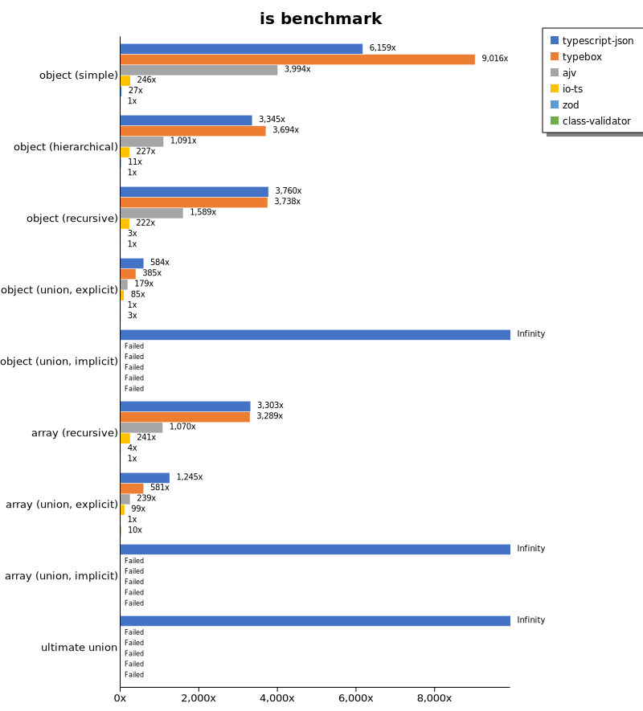
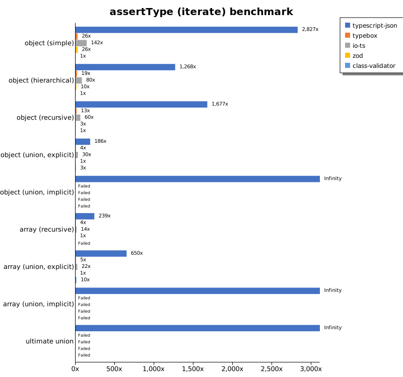
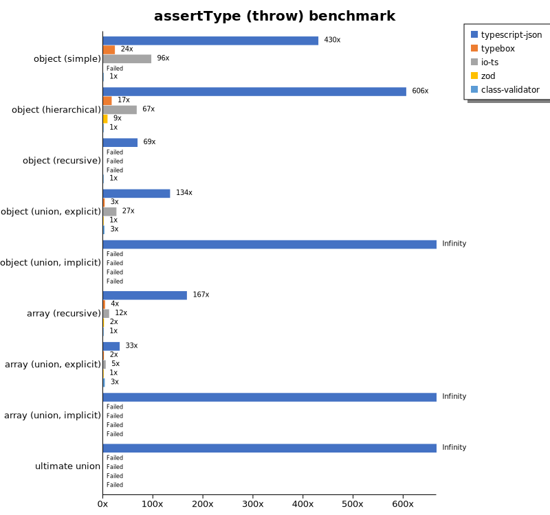
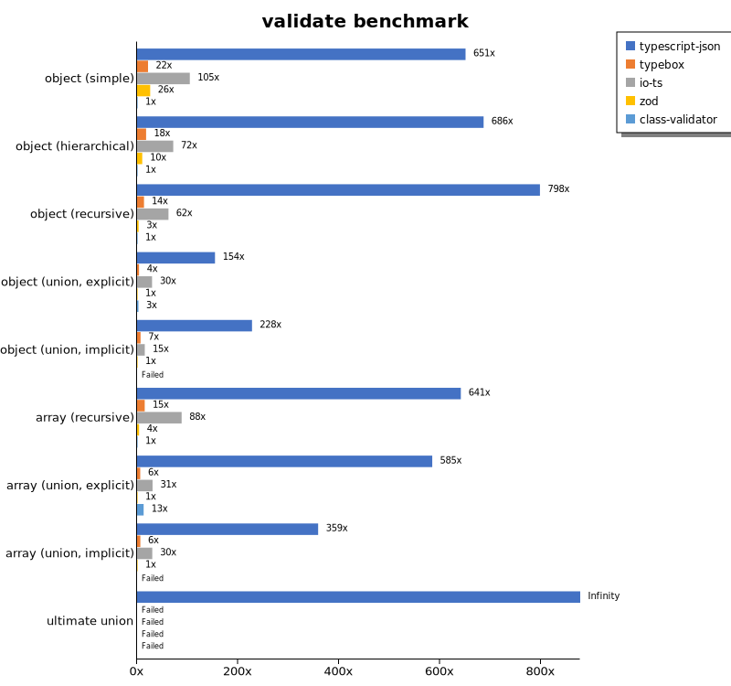
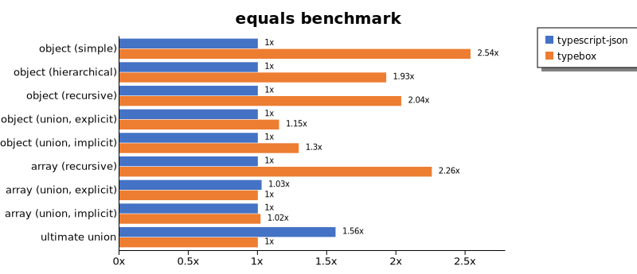
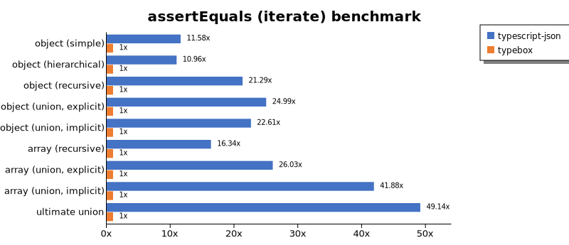
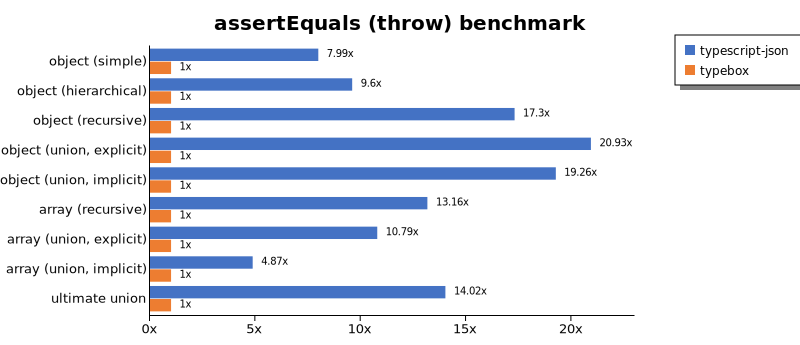
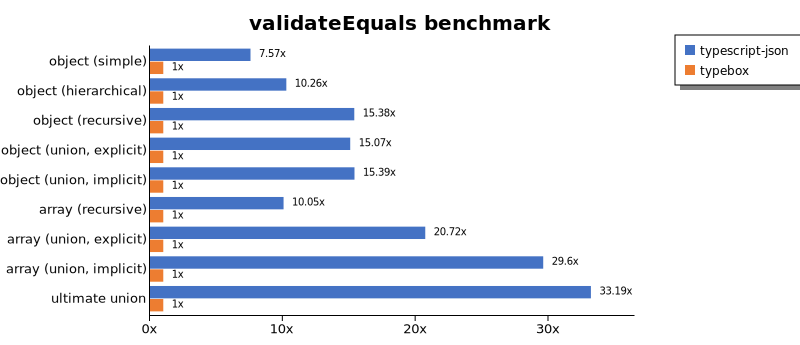
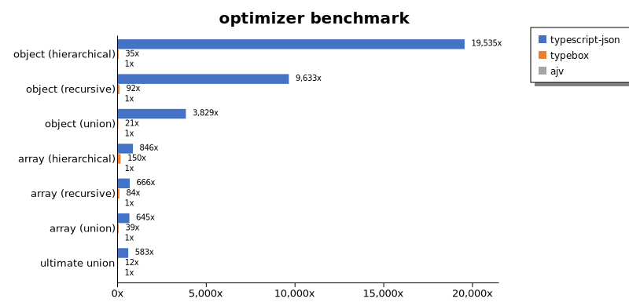
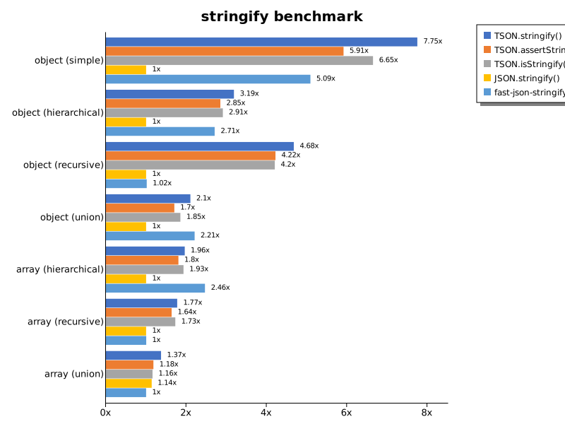

# Benchmark of `typescript-json`
> - CPU: AMD Ryzen 7 3700X 8-Core Processor
> - Memory: 32,716 MB
> - OS: win32
> - TypeScript-JSON version: 3.3.21

## is

 Components | typescript-json | typebox | ajv | io-ts | zod | class-validator 
------------|-----------------|---------|-----|-------|-----|-----------------
object (simple) | 688115.5860574318 | 1007367.0953912112 | 446256.27335824876 | 27526.717557251908 | 3068.333333333333 | 111.73386367745434
object (hierarchical) | 102018.64035087719 | 112656.36430138991 | 33261.887477313976 | 6929.238237490665 | 347.0008952551477 | 30.501089324618736
object (recursive) | 73585.46480860823 | 73152.88583318256 | 31095.57618787548 | 4342.279411764705 | 58.61070911722142 | 19.571295433364398
object (union, explicit) | 16248.322147651006 | 10692.718894009216 | 4976.6763848396495 | 2375 | 27.808676307007786 | 78.2414307004471
object (union, implicit) | 13706.529850746268 | Failed | Failed | Failed | Failed | Failed
array (recursive) | 5505.994754589734 | 5482.239166821648 | 1783.4429824561403 | 402.52608456891824 | 7.243684992570579 | 1.666975365808483
array (union, explicit) | 3410.2941176470586 | 1591.6451969083546 | 654.7396028475084 | 270.91043671354555 | 2.738725579696914 | 28.409090909090907
array (union, implicit) | 1182.7618164967564 | Failed | Failed | Failed | Failed | Failed
ultimate union | 431.9002890173411 | Failed | Failed | Failed | Failed | Failed

## assertType (iterate)

 Components | typescript-json | typebox | io-ts | zod | class-validator 
------------|-----------------|---------|-------|-----|-----------------
object (simple) | 260822.58953168045 | 2354.178195904815 | 13081.948851969384 | 2411.3501483679524 | 92.2734852695942
object (hierarchical) | 39768.967484312605 | 584.0098835157078 | 2516.499544211486 | 315.50415612576796 | 31.37254901960784
object (recursive) | 33473.82819624294 | 255.73224852071007 | 1205.7628370890284 | 59.95475113122172 | 19.965772960638905
object (union, explicit) | 5046.108447067503 | 96.2949376375642 | 814.2697466467959 | 27.164685908319186 | 79.09394727070182
object (union, implicit) | 5014.570269273331 | Failed | Failed | Failed | Failed
array (recursive) | 1884.9852071005917 | 28.206092515983453 | 106.73234811165847 | 7.896221094190637 | Failed
array (union, explicit) | 1791.0946196660484 | 13.073133762788936 | 60.60033981498962 | 2.7568461679838263 | 28.78759918804208
array (union, implicit) | 969.949916527546 | Failed | Failed | Failed | Failed
ultimate union | 207.55750273822565 | Failed | Failed | Failed | Failed

## assertType (throw)

 Components | typescript-json | typebox | io-ts | zod | class-validator 
------------|-----------------|---------|-------|-----|-----------------
object (simple) | 40272.08348863213 | 2202.974957635097 | 9013.282732447818 | Failed | 93.65049634763064
object (hierarchical) | 21997.425050579364 | 621.4689265536723 | 2438.095238095238 | 319.42878617061257 | 36.32401017072285
object (recursive) | 3838.5294647684264 | Failed | Failed | Failed | 55.81395348837209
object (union, explicit) | 4754.990925589837 | 111.52416356877323 | 945.3582907922103 | 35.549235691432635 | 93.65049634763064
object (union, implicit) | 3743.713913205439 | Failed | Failed | Failed | Failed
array (recursive) | 1538.7502345655846 | 35.75259206292456 | 110.09174311926606 | 16.06425702811245 | 9.192021325489476
array (union, explicit) | 351.2014787430684 | 17.289073305670815 | 54.84460694698355 | 10.616838305552607 | 35.39823008849557
array (union, implicit) | 144.45648248465147 | Failed | Failed | Failed | Failed
ultimate union | 199.92729916394038 | Failed | Failed | Failed | Failed

## validate

 Components | typescript-json | typebox | io-ts | zod | class-validator 
------------|-----------------|---------|-------|-----|-----------------
object (simple) | 59184.51311534316 | 1976.116681859617 | 9506.811989100817 | 2364.6067415730336 | 90.95951192457017
object (hierarchical) | 21370.565045992116 | 557.6166385609894 | 2231.3959804454103 | 319.06542056074767 | 31.132075471698116
object (recursive) | 15497.284135605918 | 266.5797317436662 | 1208.1374321880648 | 59.86316989737743 | 19.419271314962085
object (union, explicit) | 4462.615972348554 | 112.79047798979784 | 857.9195360637914 | 28.911564625850342 | 78.82966828177415
object (union, implicit) | 3591.401800477678 | 109.08063300678222 | 240.8675799086758 | 15.771686068343975 | Failed
array (recursive) | 1076.454293628809 | 25.442894836034675 | 148.14814814814815 | 6.732747334954179 | 1.6784781797836628
array (union, explicit) | 1314.480042956864 | 14.092446448703495 | 69.01753724306995 | 2.2480329711502436 | 29.257314328582147
array (union, implicit) | 588.5454545454545 | 10.662177328843995 | 49.419692998876826 | 1.6408386508659982 | Failed
ultimate union | 133.58169238956893 | Failed | Failed | Failed | Failed

## equals

 Components | typescript-json | typebox 
------------|-----------------|---------
object (simple) | 21283.634353114634 | 53984.045479552544
object (hierarchical) | 6762.721138063104 | 13033.74175306315
object (recursive) | 4977.393147297775 | 10134.520651762032
object (union, explicit) | 2357.9702151130723 | 2719.771091009784
object (union, implicit) | 1541.2541254125415 | 1996.4983413195723
array (recursive) | 410.0957995578482 | 925.5848222508749
array (union, explicit) | 588.2778581765557 | 572.7374719521316
array (union, implicit) | 350.3808487486398 | 357.16878402903814
ultimate union | 244.5887445887446 | 156.63956639566396

## assertEquals (iterate)

 Components | typescript-json | typebox 
------------|-----------------|---------
object (simple) | 20198.606927710844 | 1743.6440677966102
object (hierarchical) | 5806.972000741702 | 530.0094073377234
object (recursive) | 5003.122703894196 | 234.9627475922224
object (union, explicit) | 1959.5978062157224 | 78.40971838763114
object (union, implicit) | 1458.7973273942093 | 64.52830188679245
array (recursive) | 436.4254675987153 | 26.704545454545453
array (union, explicit) | 323.9332096474954 | 12.445785404488024
array (union, implicit) | 210.20856201975852 | 5.01952035694367
ultimate union | 164.52991452991455 | 3.3482142857142856

## assertEquals (throw)

 Components | typescript-json | typebox 
------------|-----------------|---------
object (simple) | 13859.551602742264 | 1735.0746268656715
object (hierarchical) | 5011.718045790518 | 522.2906174221228
object (recursive) | 4184.253991558085 | 241.81547619047618
object (union, explicit) | 1930.0801165331393 | 92.23390518354546
object (union, implicit) | 1430.6676449009537 | 74.28040854224699
array (recursive) | 464.9432769202157 | 35.316969803990816
array (union, explicit) | 184.0264998159735 | 17.061934823408976
array (union, implicit) | 73.00602299689724 | 14.981273408239701
ultimate union | 181.71906232963838 | 12.961762799740765

## validateEquals

 Components | typescript-json | typebox 
------------|-----------------|---------
object (simple) | 13644.011142061283 | 1803.3240997229916
object (hierarchical) | 5195.8143767060965 | 506.2330623306233
object (recursive) | 3741.4616232096955 | 243.27375352775164
object (union, explicit) | 1309.6072931276299 | 86.88245315161839
object (union, implicit) | 984.4606946983547 | 63.95019807583474
array (recursive) | 272.9774353329664 | 27.149321266968325
array (union, explicit) | 280.7775377969762 | 13.549115543846444
array (union, implicit) | 182.8683134885374 | 6.177461624859603
ultimate union | 111.5745568300313 | 3.361344537815126

## optimizer

 Components | typescript-json | typebox | ajv 
------------|-----------------|---------|-----
object (hierarchical) | 79308.08263863719 | 142.7306534443067 | 4.059789629082857
object (recursive) | 69210.48850574713 | 659.0066716085989 | 7.184966838614591
object (union) | 13477.215189873417 | 72.56867112100966 | 3.5198221563542056
array (hierarchical) | 4346.816479400749 | 770.7353770923453 | 5.1357300073367576
array (recursive) | 4962.661106899166 | 627.4618074728511 | 7.4474027183019915
array (union) | 3242.0917900895956 | 196.78864824495892 | 5.026061057334326
ultimate union | 419.2321622600507 | 8.742559523809524 | 0.719165767709457

## stringify

 Components | TSON.stringify() | TSON.assertStringify() | TSON.isStringify() | JSON.stringify() | fast-json-stringify 
------------|------------------|------------------------|--------------------|------------------|---------------------
object (simple) | 34007.04094867519 | 25948.387096774193 | 29167.18097658377 | 4387.476635514019 | 22329.79502196193
object (hierarchical) | 3893.1592497241636 | 3480.3091645196905 | 3556.2523054223534 | 1221.9917012448134 | 3306.8223276176577
object (recursive) | 4141.9366386253805 | 3738.1615598885796 | 3723.236223236223 | 885.809312638581 | 899.472891566265
object (union) | 1029.4383240021673 | 833.8139870223504 | 907.4726824109974 | 489.75447664759093 | 1081.1061618411284
array (hierarchical) | 77.78379353907236 | 71.5312724658519 | 76.55937443171486 | 39.65326447805238 | 97.72226304188096
array (recursive) | 172.0955483170467 | 158.67158671586716 | 167.55661940710735 | 97.02748177229388 | 97.31858241140071
array (union) | 234.74874837752643 | 202.22102812108184 | 198.45128759229246 | 194.88337095560573 | 171.12793058888684

