# Benchmark of `typescript-json`
> CPU: AMD Ryzen 7 5800H with Radeon Graphics         
> Memory: 15,716 MB

## assert
 Components | typescript-json | typescript-is 
------------|-----------------|---------------
object (hierarchical) | 26025.351591413768 | 22155.346953800847
object (recursive) | 32214.612708295183 | 21159.603742432584
object (union) | 5049.419140697031 | 2042.7397260273974
array (recursive) | 1384.975646309479 | 1509.7569955817378
array (union) | 3529.6064729680033 | 212.5998547567175
ultimate union | 4148.584905660377 | 30.173183360114265

```mermaid
pie title assert - object (hierarchical)
  "typescript-json": 26025.351591413768
  "typescript-is": 22155.346953800847
```

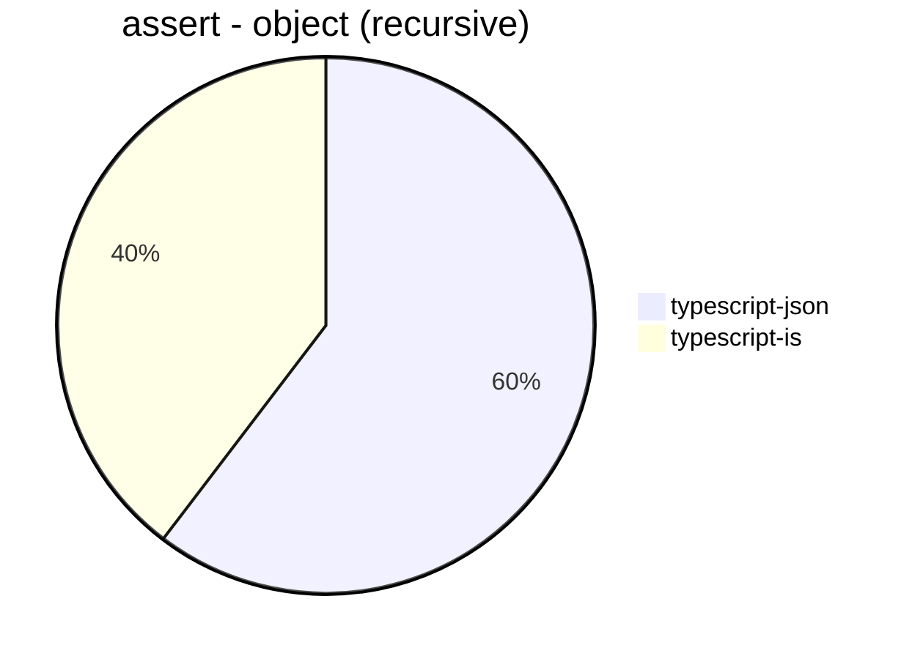
```mermaid
pie title assert - object (recursive)
  "typescript-json": 32214.612708295183
  "typescript-is": 21159.603742432584
```

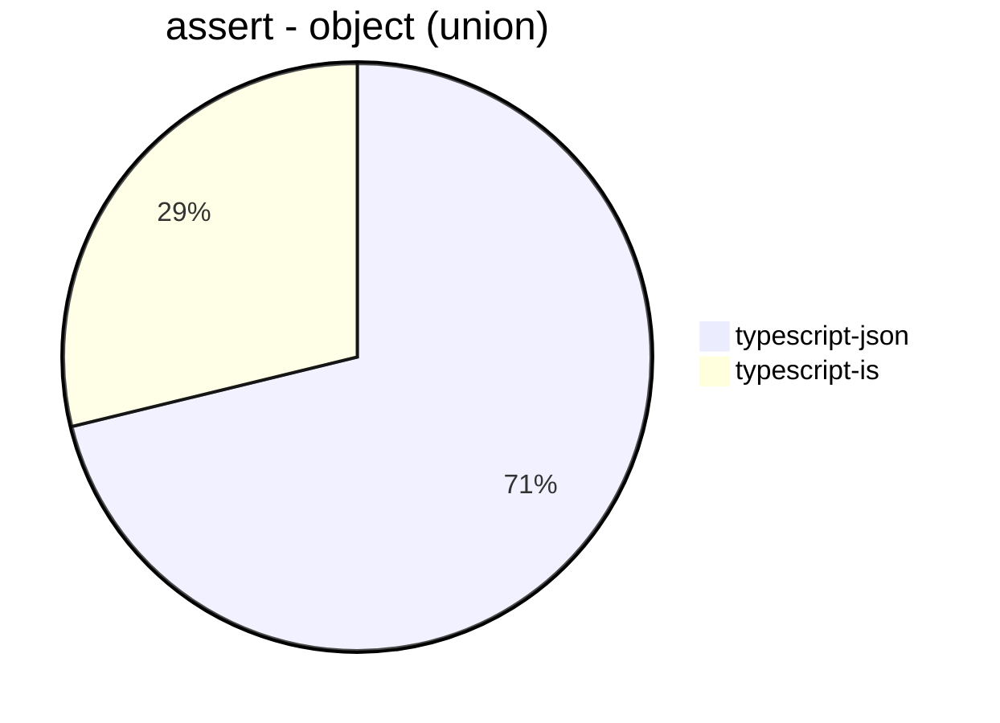
```mermaid
pie title assert - object (union)
  "typescript-json": 5049.419140697031
  "typescript-is": 2042.7397260273974
```

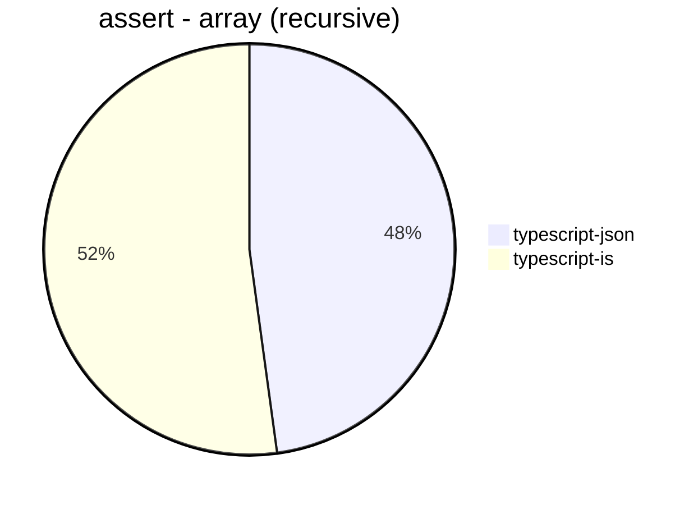
```mermaid
pie title assert - array (recursive)
  "typescript-json": 1384.975646309479
  "typescript-is": 1509.7569955817378
```

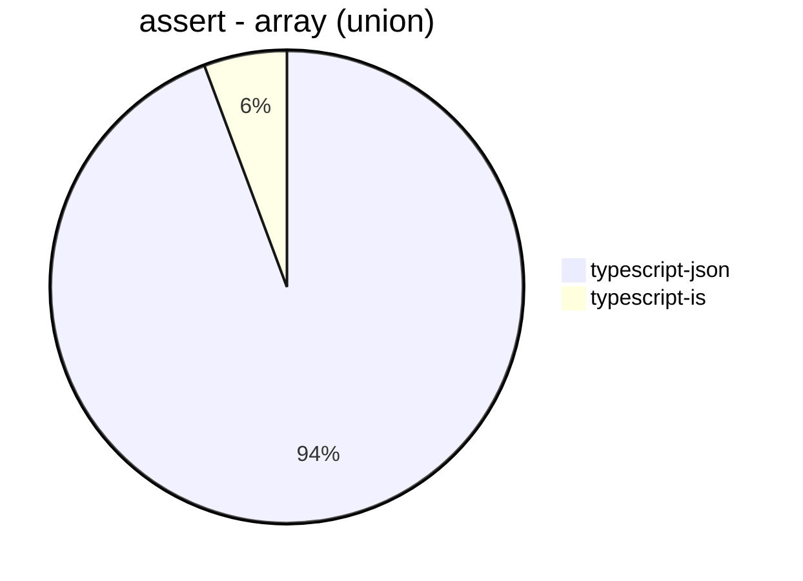
```mermaid
pie title assert - array (union)
  "typescript-json": 3529.6064729680033
  "typescript-is": 212.5998547567175
```

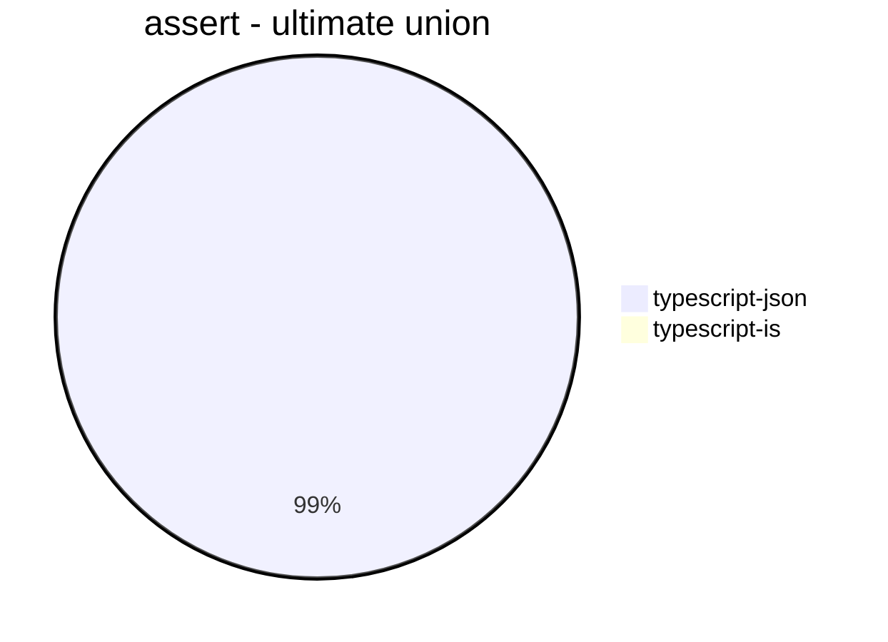
```mermaid
pie title assert - ultimate union
  "typescript-json": 4148.584905660377
  "typescript-is": 30.173183360114265
```

## is
 Components | typescript-json | typescript-is | ajv 
------------|-----------------|---------------|-----
object (hierarchical) | 103209.95912300261 | 51586.55089599113 | 82642.83121597096
object (recursive) | 76564.94920174166 | 43032.61865493861 | Failed
object (union, explicit) | 13996.142542248346 | Failed | 1187.6524676299493
object (union, implicit) | 13697.92589966318 | Failed | Failed
array (recursive) | 6483.693660681568 | 4154.285714285715 | Failed
array (union, explicit) | 7171.43899325187 | 1021.4207250091542 | Failed
array (union, implicit) | 6285.982360668043 | 1099.8515219005196 | Failed
ultimate union | 12787.281105990784 | 273.9801543550165 | Failed

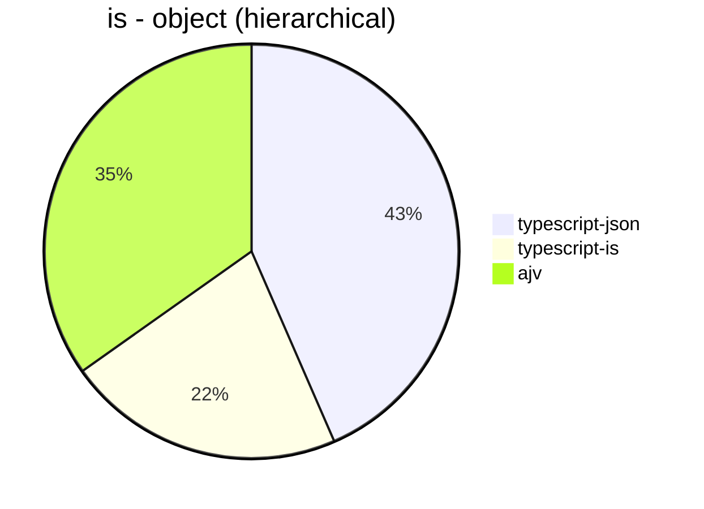
```mermaid
pie title is - object (hierarchical)
  "typescript-json": 103209.95912300261
  "typescript-is": 51586.55089599113
  "ajv": 82642.83121597096
```

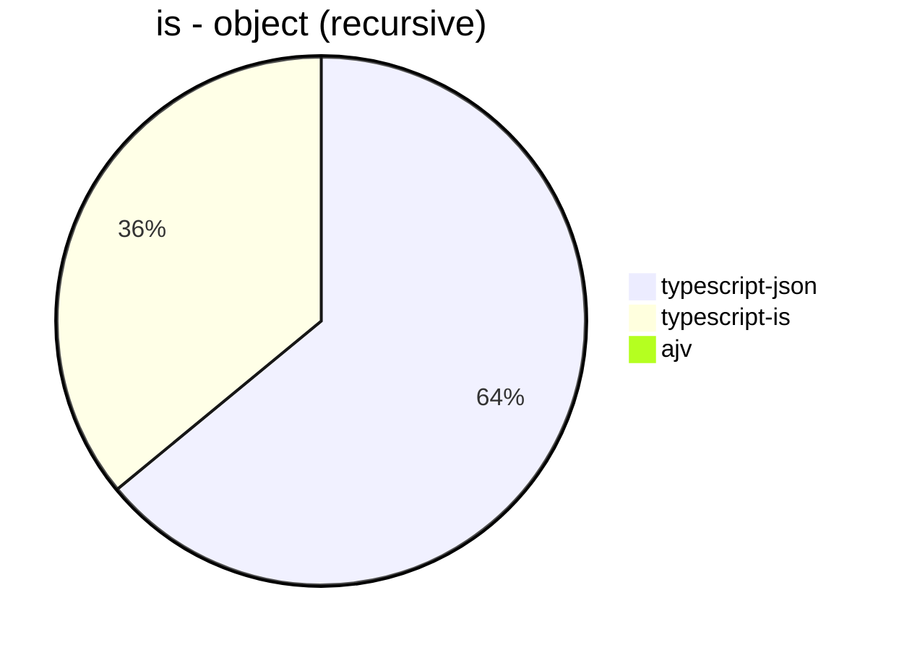
```mermaid
pie title is - object (recursive)
  "typescript-json": 76564.94920174166
  "typescript-is": 43032.61865493861
  "ajv": 0
```

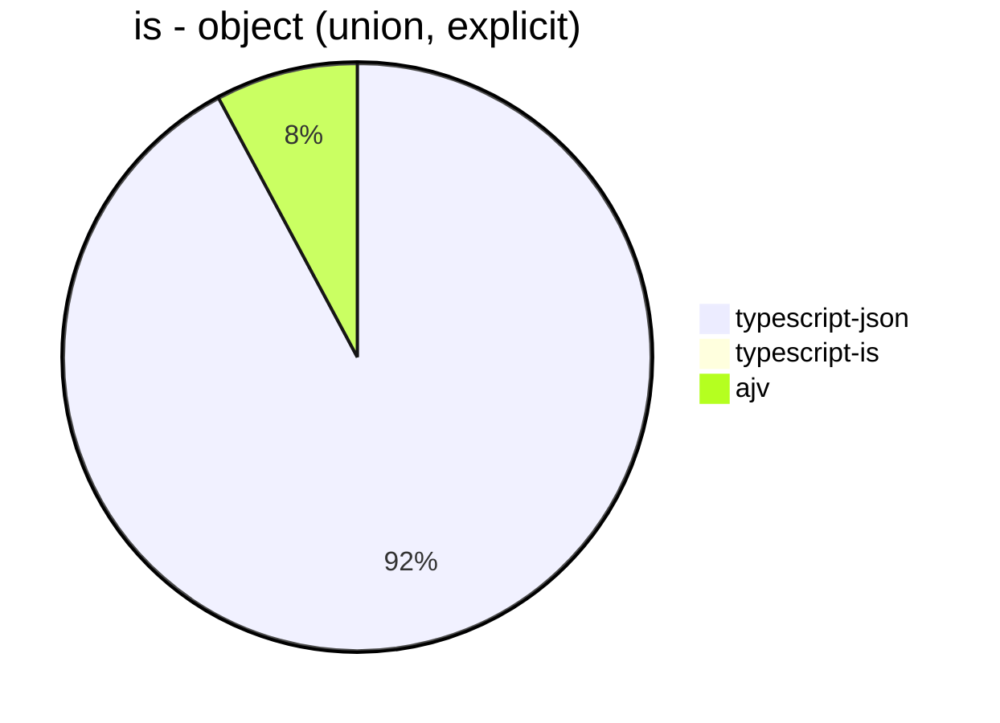
```mermaid
pie title is - object (union, explicit)
  "typescript-json": 13996.142542248346
  "typescript-is": 0
  "ajv": 1187.6524676299493
```

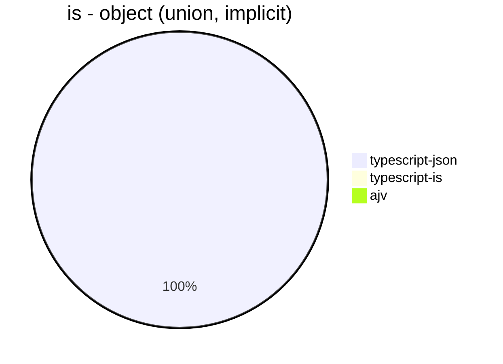
```mermaid
pie title is - object (union, implicit)
  "typescript-json": 13697.92589966318
  "typescript-is": 0
  "ajv": 0
```

```mermaid
pie title is - array (recursive)
  "typescript-json": 6483.693660681568
  "typescript-is": 4154.285714285715
  "ajv": 0
```

```mermaid
pie title is - array (union, explicit)
  "typescript-json": 7171.43899325187
  "typescript-is": 1021.4207250091542
  "ajv": 0
```

```mermaid
pie title is - array (union, implicit)
  "typescript-json": 6285.982360668043
  "typescript-is": 1099.8515219005196
  "ajv": 0
```

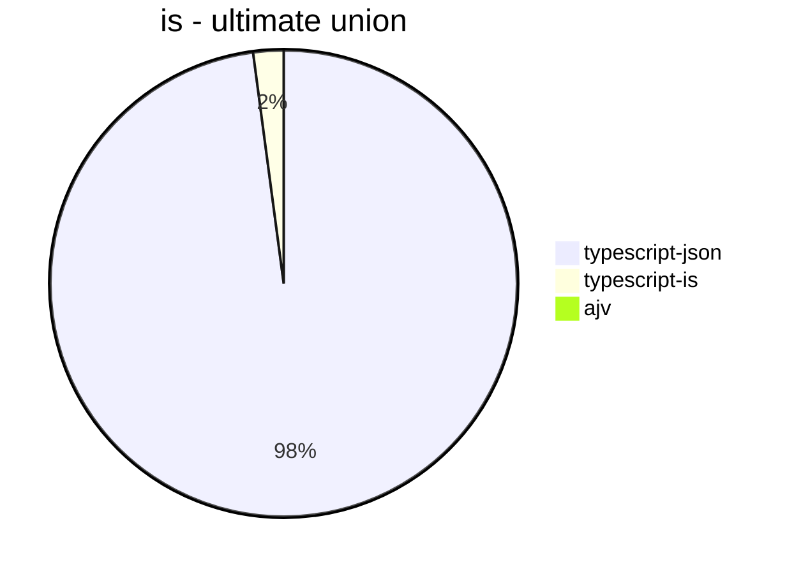
```mermaid
pie title is - ultimate union
  "typescript-json": 12787.281105990784
  "typescript-is": 273.9801543550165
  "ajv": 0
```

## optimizer
 Components | typescript-json | fast-json-stringify | JSON.stringify() 
------------|-----------------|---------------------|------------------
object (simple) | 39510.79795021962 | 4.697286012526096 | 5501.402655694782
object (hierarchical) | 4266.233766233767 | 1.0789426362165078 | 1457.4007899191272
object (recursive) | 4426.792452830189 | 45.22339266254994 | 1096.8043356381984
object (union) | 1949.9999999999998 | 0.9147457006952067 | 801.8018018018018
array (hierarchical) | 185.86482558139537 | 2.2087244616234125 | 91.28397375820056
array (recursive) | 221.92321492644422 | 36.09380725540491 | 119.3002047273404
array (union) | 339.4664213431463 | 1.6920473773265652 | 229.339223265231
ultimate union | 1094.0939104915628 | Failed | 185.24806640256554

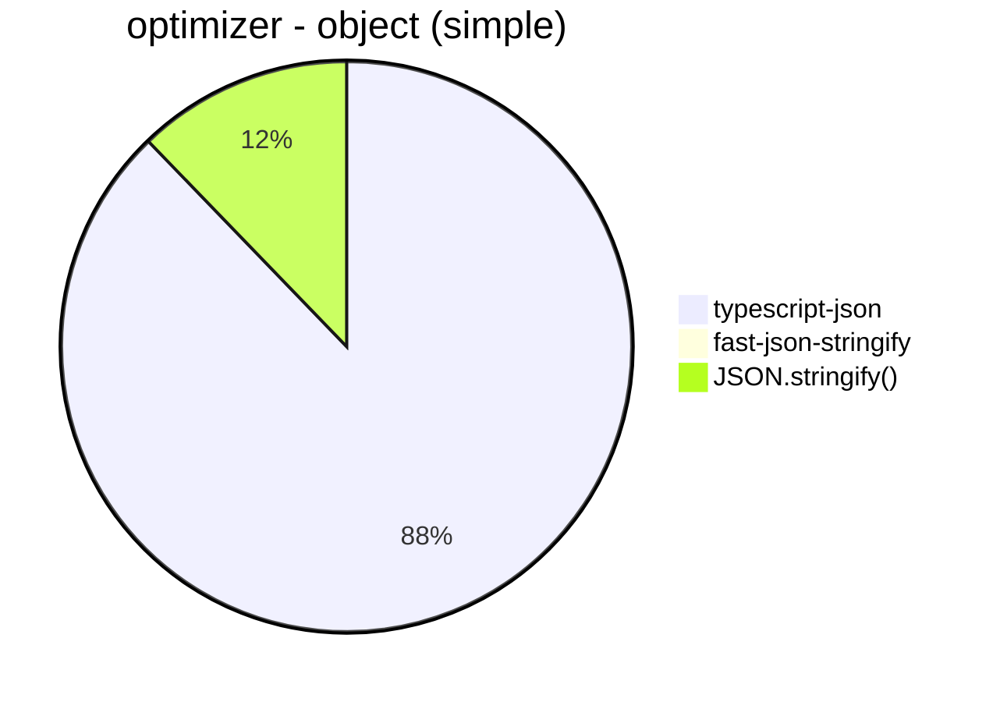
```mermaid
pie title optimizer - object (simple)
  "typescript-json": 39510.79795021962
  "fast-json-stringify": 4.697286012526096
  "JSON.stringify()": 5501.402655694782
```

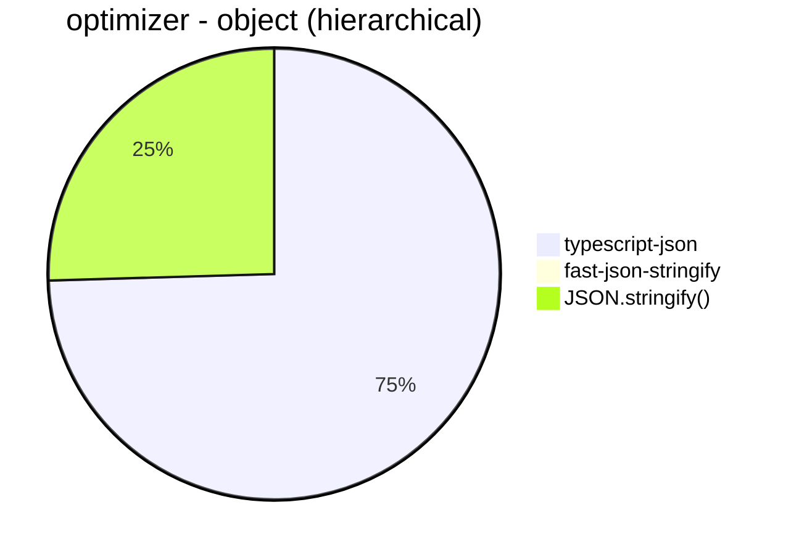
```mermaid
pie title optimizer - object (hierarchical)
  "typescript-json": 4266.233766233767
  "fast-json-stringify": 1.0789426362165078
  "JSON.stringify()": 1457.4007899191272
```

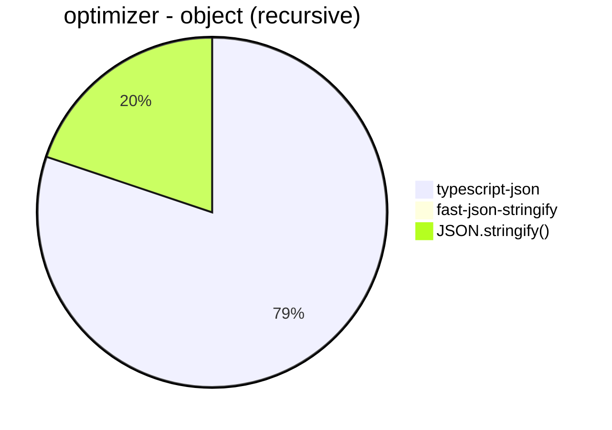
```mermaid
pie title optimizer - object (recursive)
  "typescript-json": 4426.792452830189
  "fast-json-stringify": 45.22339266254994
  "JSON.stringify()": 1096.8043356381984
```

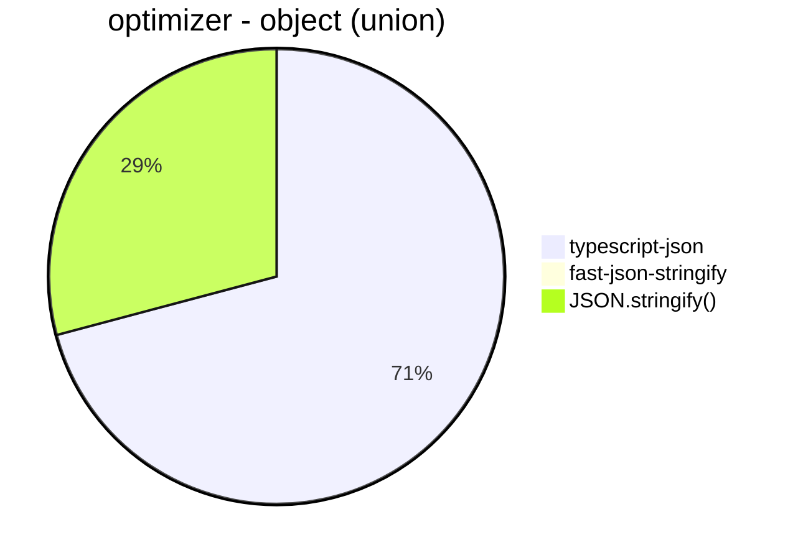
```mermaid
pie title optimizer - object (union)
  "typescript-json": 1949.9999999999998
  "fast-json-stringify": 0.9147457006952067
  "JSON.stringify()": 801.8018018018018
```

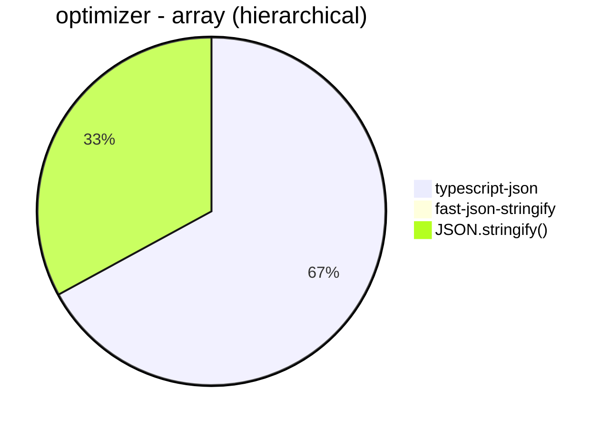
```mermaid
pie title optimizer - array (hierarchical)
  "typescript-json": 185.86482558139537
  "fast-json-stringify": 2.2087244616234125
  "JSON.stringify()": 91.28397375820056
```

```mermaid
pie title optimizer - array (recursive)
  "typescript-json": 221.92321492644422
  "fast-json-stringify": 36.09380725540491
  "JSON.stringify()": 119.3002047273404
```

```mermaid
pie title optimizer - array (union)
  "typescript-json": 339.4664213431463
  "fast-json-stringify": 1.6920473773265652
  "JSON.stringify()": 229.339223265231
```

```mermaid
pie title optimizer - ultimate union
  "typescript-json": 1094.0939104915628
  "fast-json-stringify": 0
  "JSON.stringify()": 185.24806640256554
```

## stringify
 Components | typescript-json | fast-json-stringify | JSON.stringify() 
------------|-----------------|---------------------|------------------
object (simple) | 38419.200294822185 | 29036.413043478264 | 5345.833333333334
object (hierarchical) | 4546.686467421571 | 4173.588342440801 | 1441.773802869387
object (recursive) | 4910.286862780925 | 1088.437907279836 | 1105.7094403617862
object (union) | 1911.3739763421293 | 1512.3739688359303 | 818.8636789799363
array (hierarchical) | 97.45840190162735 | 141.31033217104056 | 44.98458189733358
array (recursive) | 225.4083484573503 | 118.63779381824914 | 115.15042979942695
array (union) | 352.0565319804312 | 212.69841269841268 | 232.15599705665932
ultimate union | 1126.5358518246835 | Failed | 185.38590917585498

```mermaid
pie title stringify - object (simple)
  "typescript-json": 38419.200294822185
  "fast-json-stringify": 29036.413043478264
  "JSON.stringify()": 5345.833333333334
```

```mermaid
pie title stringify - object (hierarchical)
  "typescript-json": 4546.686467421571
  "fast-json-stringify": 4173.588342440801
  "JSON.stringify()": 1441.773802869387
```

```mermaid
pie title stringify - object (recursive)
  "typescript-json": 4910.286862780925
  "fast-json-stringify": 1088.437907279836
  "JSON.stringify()": 1105.7094403617862
```

```mermaid
pie title stringify - object (union)
  "typescript-json": 1911.3739763421293
  "fast-json-stringify": 1512.3739688359303
  "JSON.stringify()": 818.8636789799363
```

```mermaid
pie title stringify - array (hierarchical)
  "typescript-json": 97.45840190162735
  "fast-json-stringify": 141.31033217104056
  "JSON.stringify()": 44.98458189733358
```

```mermaid
pie title stringify - array (recursive)
  "typescript-json": 225.4083484573503
  "fast-json-stringify": 118.63779381824914
  "JSON.stringify()": 115.15042979942695
```

```mermaid
pie title stringify - array (union)
  "typescript-json": 352.0565319804312
  "fast-json-stringify": 212.69841269841268
  "JSON.stringify()": 232.15599705665932
```

```mermaid
pie title stringify - ultimate union
  "typescript-json": 1126.5358518246835
  "fast-json-stringify": 0
  "JSON.stringify()": 185.38590917585498
```

