# Benchmark of `typescript-json`
> CPU: AMD Ryzen 7 5800H with Radeon Graphics         
> Memory: 15,716 MB


## assert
 Components | typescript-json | typescript-is 
------------|-----------------|---------------
object (hierarchical) | 25897.11025216271 | 21464.682050378724
object (recursive) | 32919.5211786372 | 17776.824034334764
object (union) | 4684.754069665675 | 2108.0830552465704
array (recursive) | 1332.274341244627 | 1496.776570270768
array (union) | 3490.3086862885857 | 217.00223713646534
ultimate union | 4164.3330876934415 | 30.521943290590574


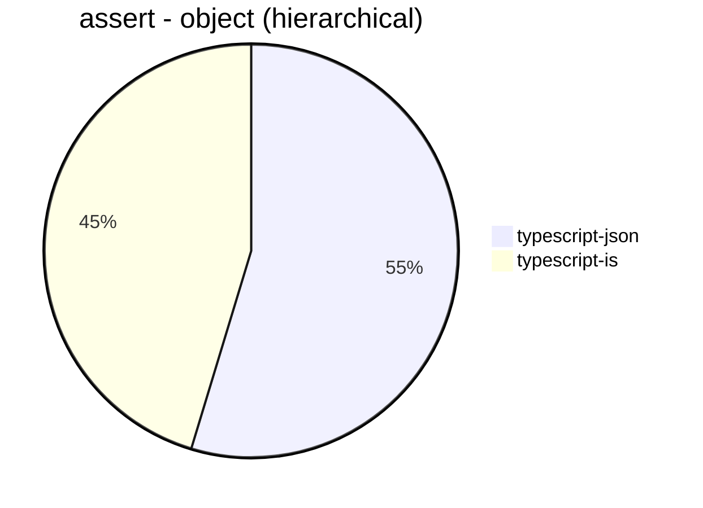


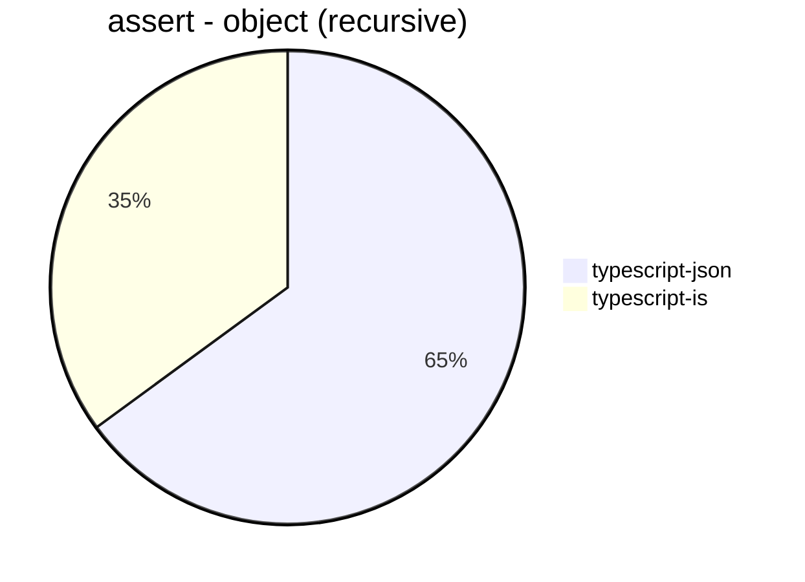


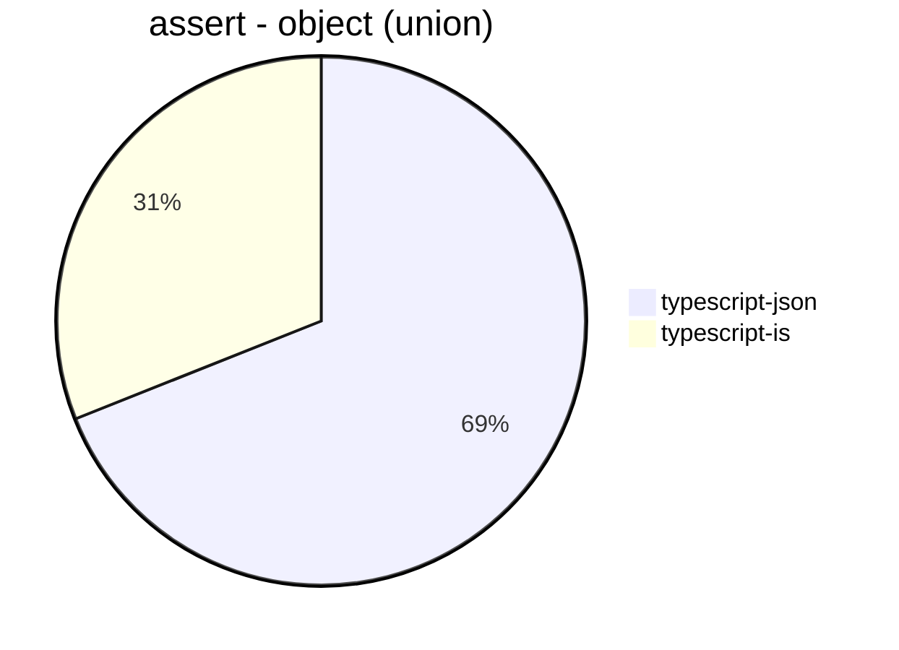


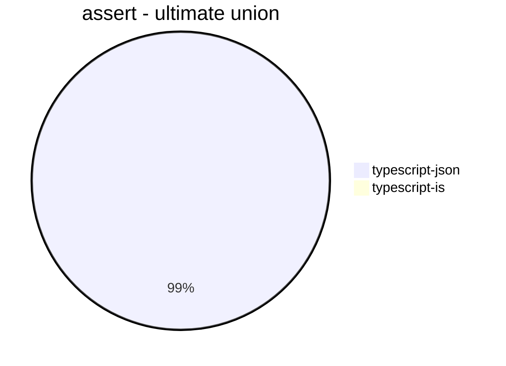


## is
 Components | typescript-json | typescript-is | ajv 
------------|-----------------|---------------|-----
object (hierarchical) | 97598.76206080466 | 47036.55446977923 | 72243.95236323038
object (recursive) | 68264.17829316905 | 40699.269252388985 | Failed
object (union, explicit) | 13328.762045959971 | Failed | 1149.4379952091397
object (union, implicit) | 13012.562814070352 | Failed | Failed
array (recursive) | 6745.682603163061 | 4257.938718662953 | Failed
array (union, explicit) | 6915.109740613097 | 974.8472871002516 | Failed
array (union, implicit) | 6118.457300275481 | 1090.8250092489827 | Failed
ultimate union | 13264.787687743372 | 274.79526842584164 | Failed


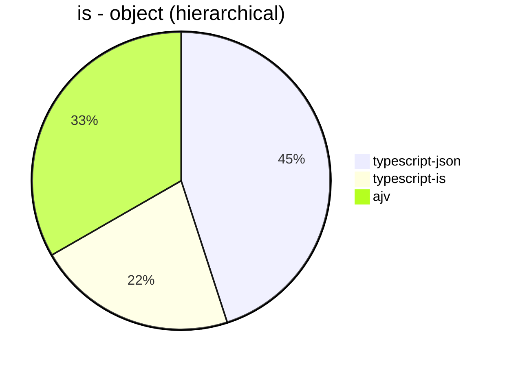


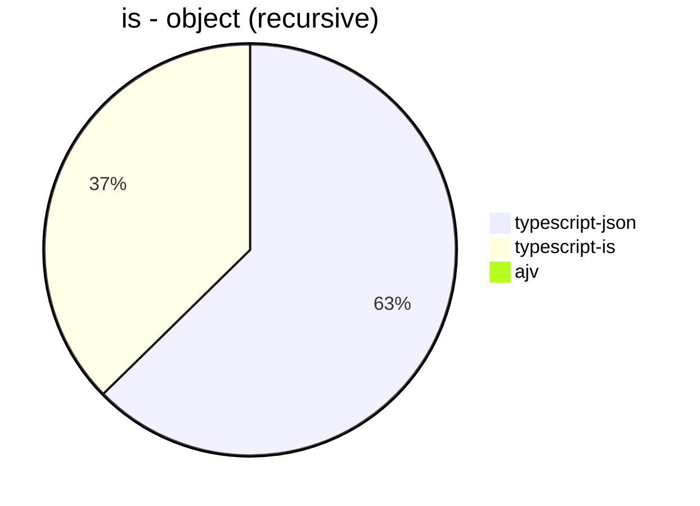


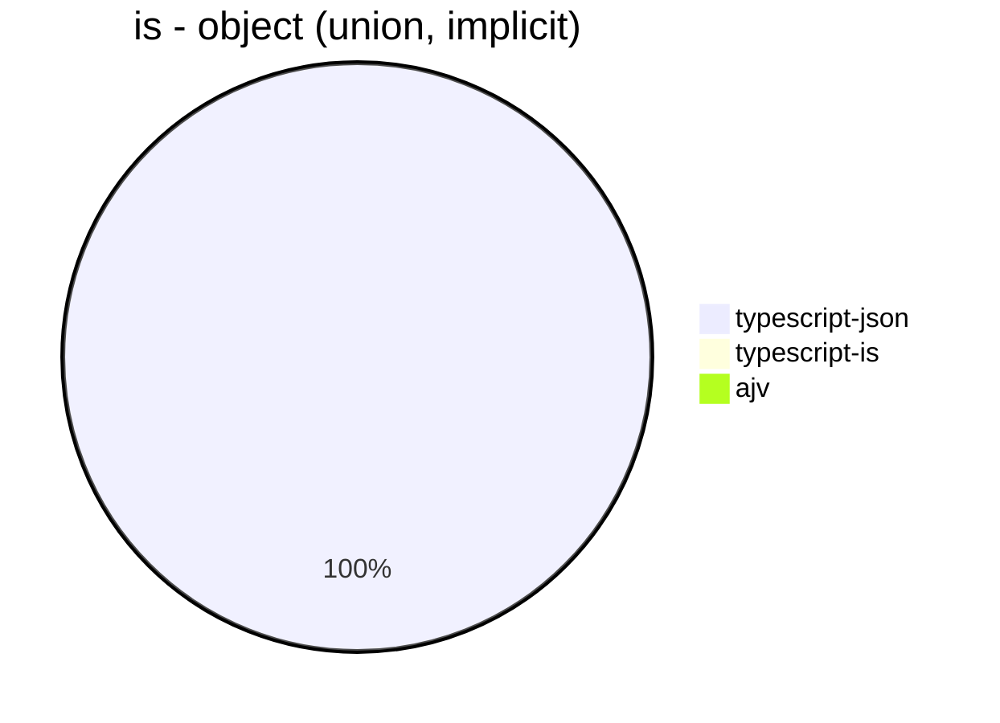


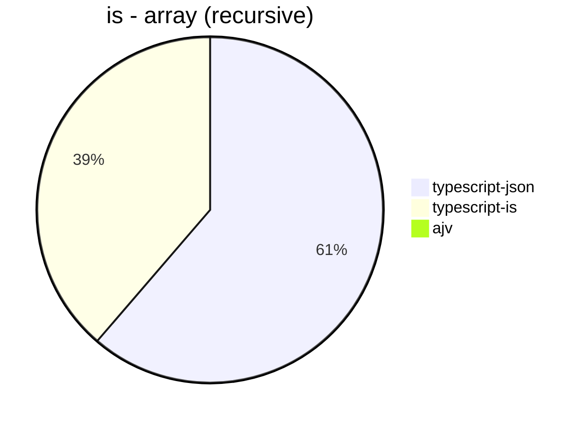


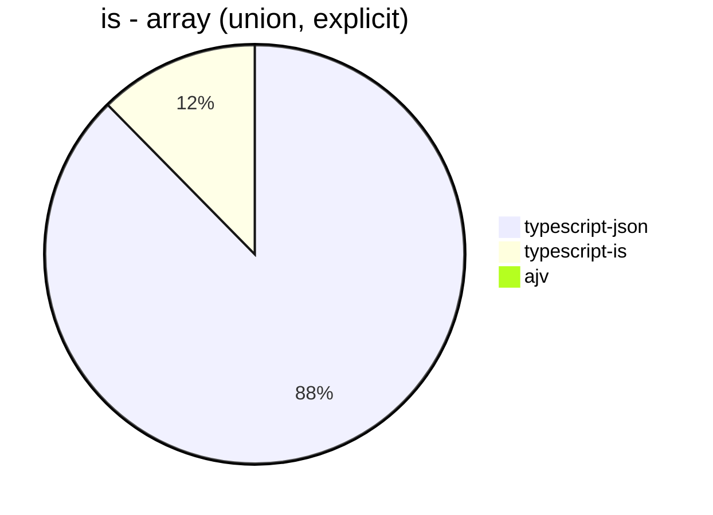


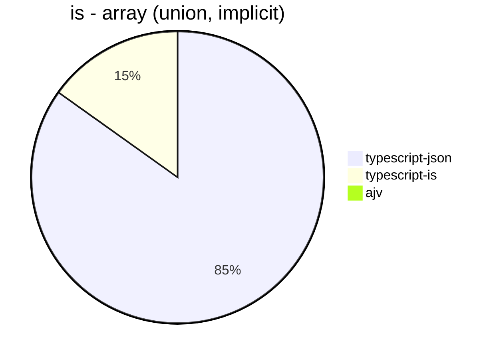


## optimizer
 Components | typescript-json | fast-json-stringify | JSON.stringify() 
------------|-----------------|---------------------|------------------
object (simple) | 38856.02189781021 | 4.772004241781548 | 5537.521158548053
object (hierarchical) | 4542.84649776453 | 1.0958904109589043 | 1451.6433698526635
object (recursive) | 4634.270617097565 | 46.291233825405506 | 1108.3270535041447
object (union) | 1889.0306122448978 | 0.9089256498818397 | 800.0368256306389
array (hierarchical) | 173.74658158614403 | 2.242571481965988 | 84.15660446395901
array (recursive) | 220.10869565217394 | 36.13555513948699 | 119.5509822263798
array (union) | 328.1695156695157 | 1.6800448011946985 | 229.2468389224849
ultimate union | 1108.5157255839617 | Failed | 182.17197924388435


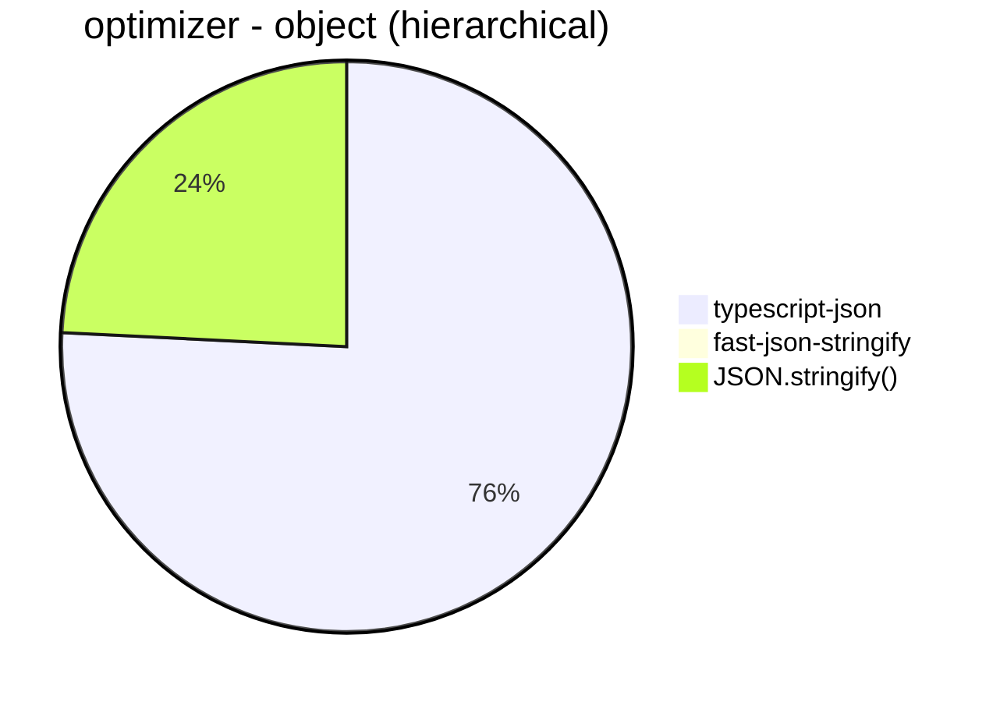


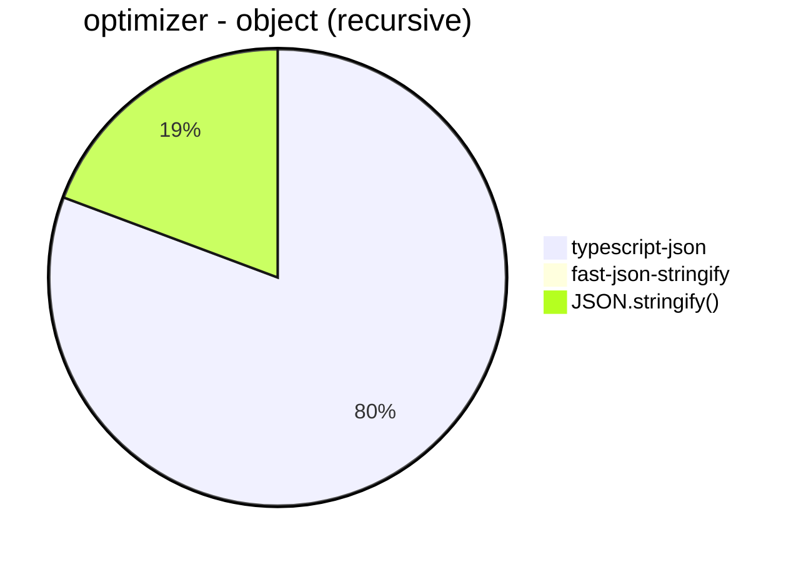


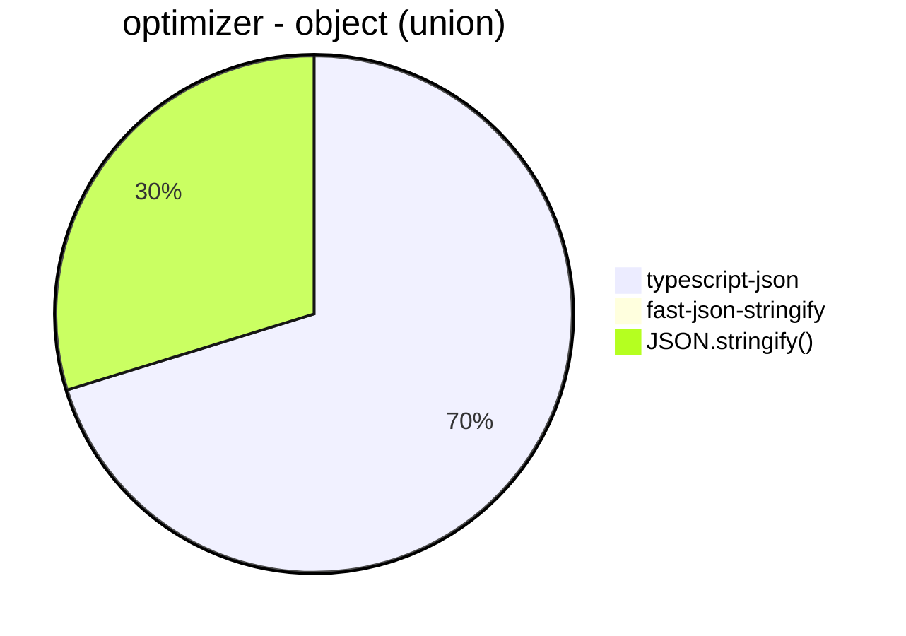


```mermaid
pie title optimizer - array (union)
  "typescript-json": 328.1695156695157
  "fast-json-stringify": 1.6800448011946985
  "JSON.stringify()": 229.2468389224849
```


```mermaid
pie title optimizer - ultimate union
  "typescript-json": 1108.5157255839617
  "fast-json-stringify": 0
  "JSON.stringify()": 182.17197924388435
```


## stringify
 Components | typescript-json | fast-json-stringify | JSON.stringify() 
------------|-----------------|---------------------|------------------
object (simple) | 38604.46542022145 | 29232.941176470587 | 5398.022702306847
object (hierarchical) | 3966.9104204753203 | 3878.471575023299 | 1448.6699138254028
object (recursive) | 4891.6136278547365 | 1100.0749625187407 | 1068.9341578755912
object (union) | 1832.3364147181437 | 1418.8764829030006 | 819.1708872631776
array (hierarchical) | 209.8067808968283 | 303.93788130892955 | 96.53782744092325
array (recursive) | 233.69362653745807 | 119.55307262569832 | 117.18607618006196
array (union) | 347.70063119927863 | 215.05979073243645 | 234.43019148540623
ultimate union | 1126.8575570859007 | Failed | 181.39792899408283


```mermaid
pie title stringify - object (simple)
  "typescript-json": 38604.46542022145
  "fast-json-stringify": 29232.941176470587
  "JSON.stringify()": 5398.022702306847
```


```mermaid
pie title stringify - object (hierarchical)
  "typescript-json": 3966.9104204753203
  "fast-json-stringify": 3878.471575023299
  "JSON.stringify()": 1448.6699138254028
```


```mermaid
pie title stringify - object (recursive)
  "typescript-json": 4891.6136278547365
  "fast-json-stringify": 1100.0749625187407
  "JSON.stringify()": 1068.9341578755912
```


```mermaid
pie title stringify - object (union)
  "typescript-json": 1832.3364147181437
  "fast-json-stringify": 1418.8764829030006
  "JSON.stringify()": 819.1708872631776
```


```mermaid
pie title stringify - array (hierarchical)
  "typescript-json": 209.8067808968283
  "fast-json-stringify": 303.93788130892955
  "JSON.stringify()": 96.53782744092325
```


```mermaid
pie title stringify - array (recursive)
  "typescript-json": 233.69362653745807
  "fast-json-stringify": 119.55307262569832
  "JSON.stringify()": 117.18607618006196
```


```mermaid
pie title stringify - array (union)
  "typescript-json": 347.70063119927863
  "fast-json-stringify": 215.05979073243645
  "JSON.stringify()": 234.43019148540623
```


```mermaid
pie title stringify - ultimate union
  "typescript-json": 1126.8575570859007
  "fast-json-stringify": 0
  "JSON.stringify()": 181.39792899408283
```


