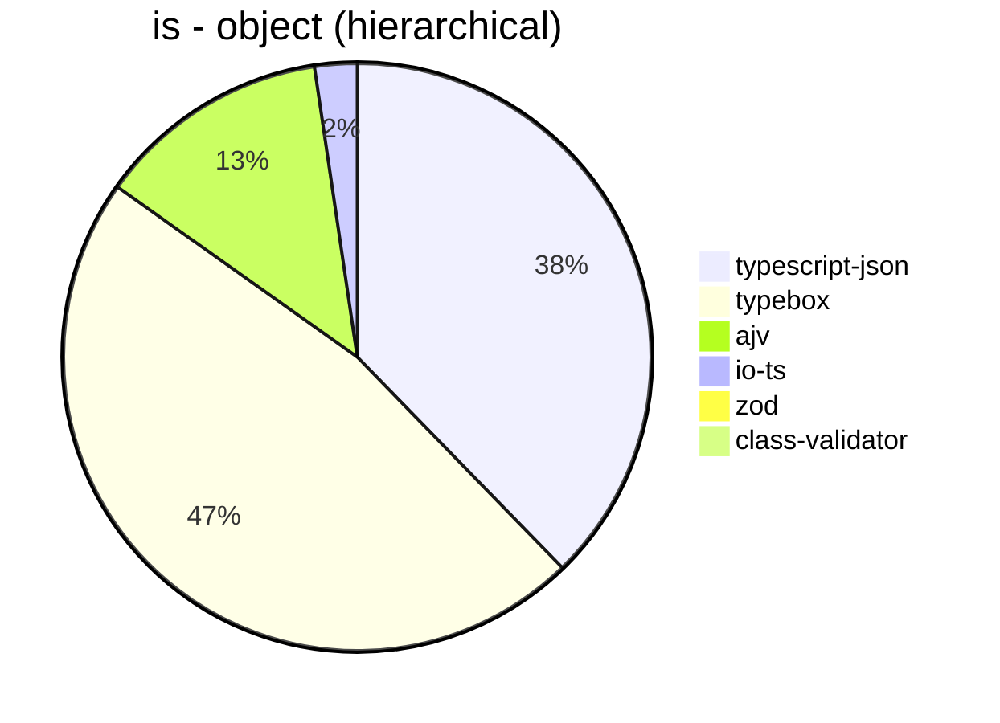
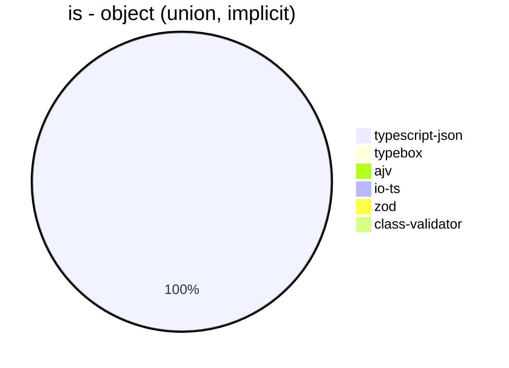
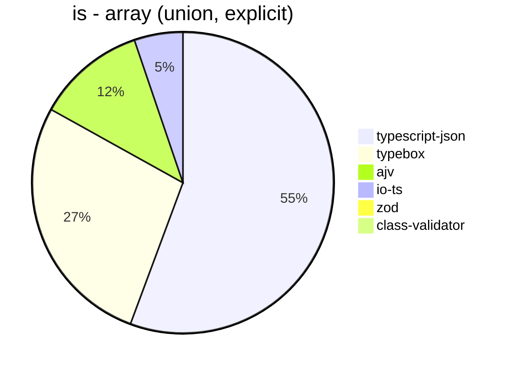
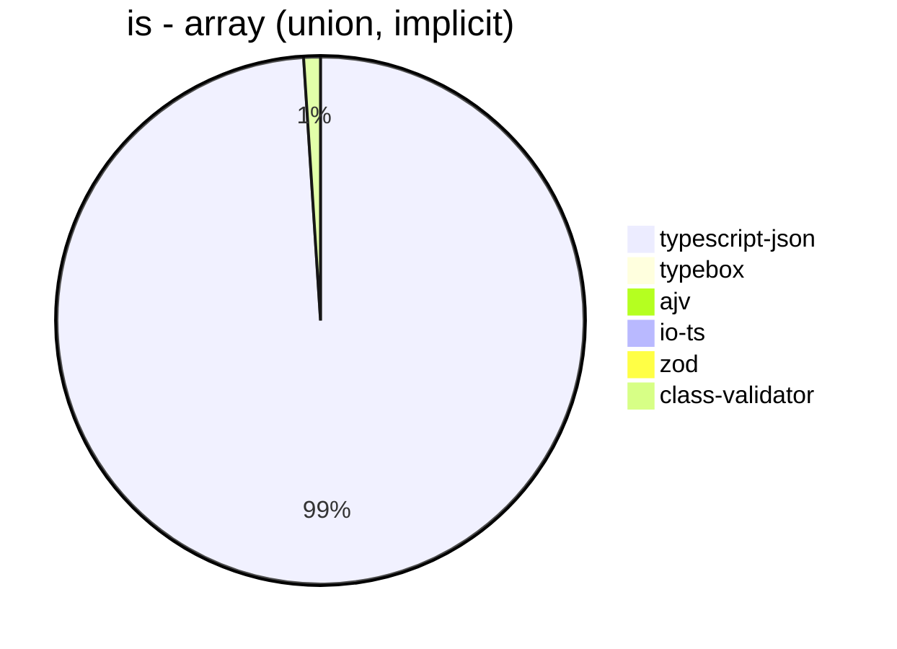
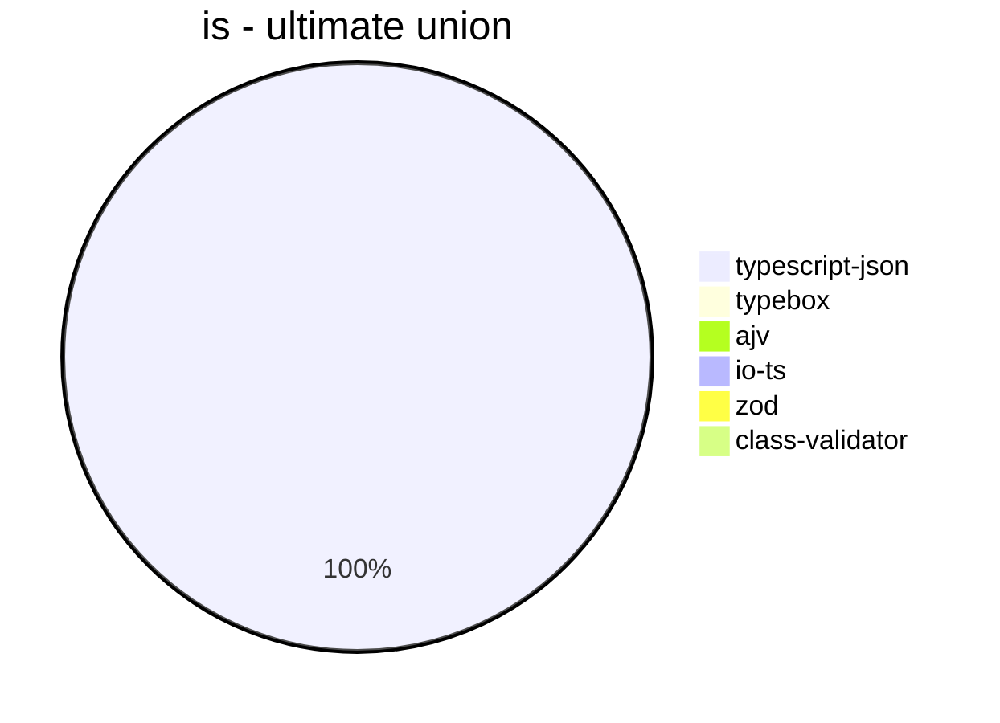
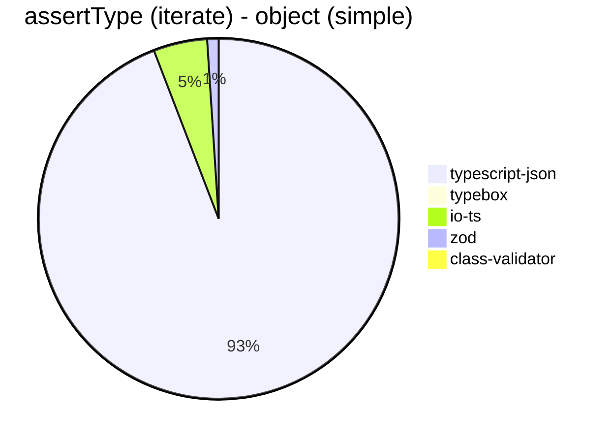
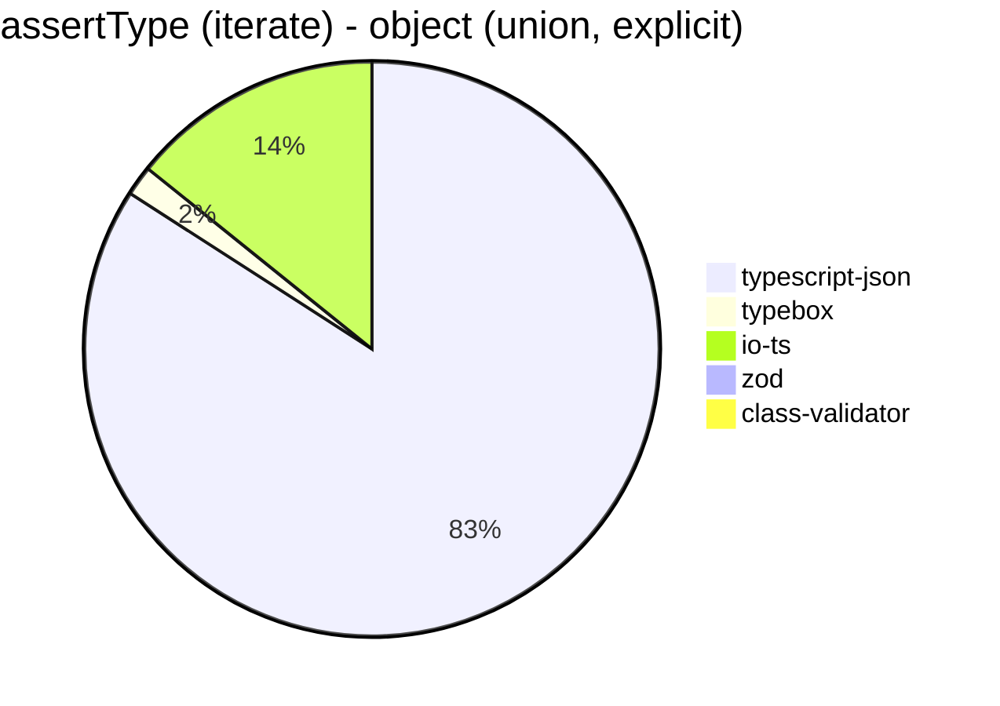
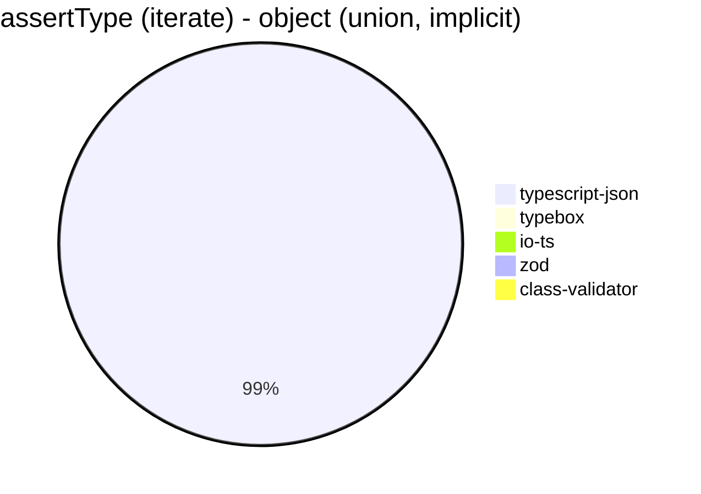
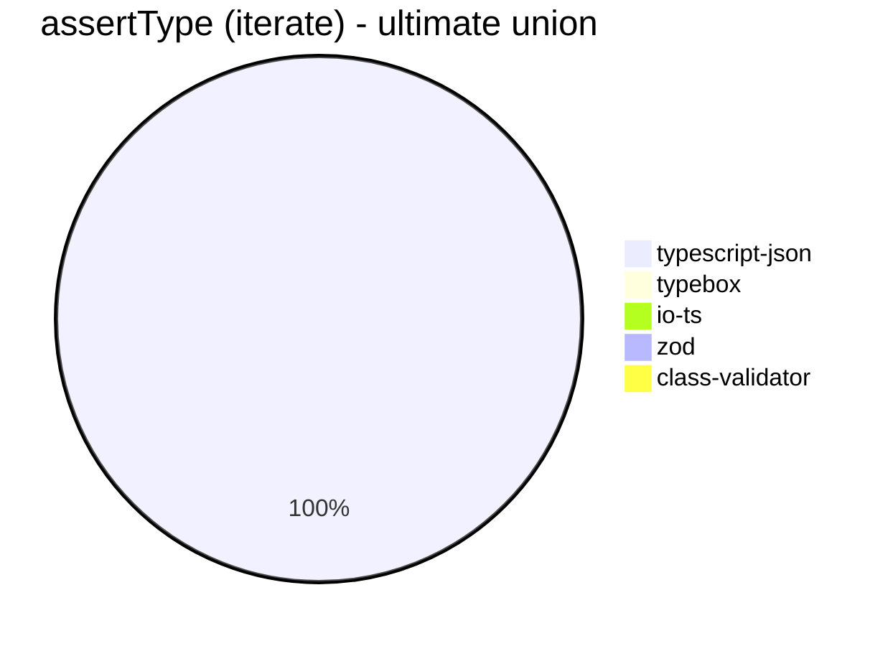
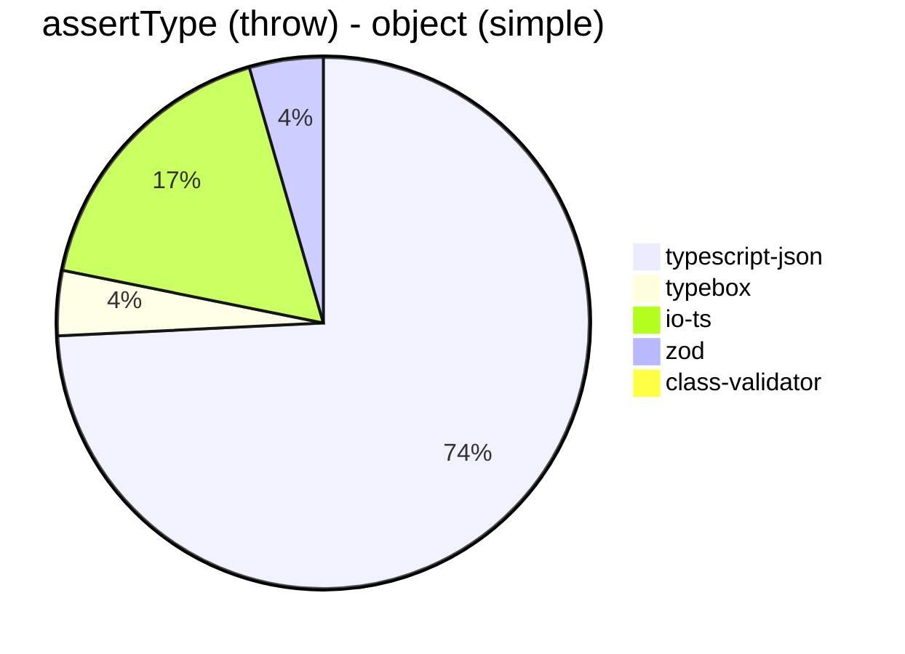

# Benchmark of `typescript-json`
> CPU: AMD Ryzen 7 5800H with Radeon Graphics
> Memory: 64,928 MB
> NodeJS version: v16.6.0
> TypeScript-JSON version: 3.3.18


## is
 Components | typescript-json | typebox | ajv | io-ts | zod | class-validator 
------------|-----------------|---------|-----|-------|-----|-----------------
object (simple) | 1010176.1939218525 | 1657972.9077750973 | 487063.9792899408 | 37044.35557171423 | 3809.8920863309354 | 165.27196652719667
object (hierarchical) | 149121.56505914466 | 186207.86106032907 | 50765.18438177874 | 9223.646209386283 | 429.95515695067263 | 58.64084764340518
object (recursive) | 91465.64462504617 | 82968.76712328769 | 40961.32697947214 | 5551.934097421205 | 66.47134224501008 | 36.397058823529406
object (union, explicit) | 17511.005692599625 | 13174.59429210968 | 7879.505300353357 | 3080.0561797752807 | 32.97297297297297 | 77.35304724125496
object (union, implicit) | 15959.27684441198 | Failed | Failed | Failed | 18.13186813186813 | 53.65126676602085
array (recursive) | 7421.620598258236 | 7135.331347728965 | 2205.237840726884 | 517.6966807262057 | 8.80410858400587 | 3.3320992225101813
array (union, explicit) | 3916.2640901771333 | 1928.8073394495414 | 823.6059479553903 | 367.1309192200557 | 2.8032143524574846 | 28.89518413597734
array (union, implicit) | 1972.1159103335158 | Failed | Failed | Failed | 2.2144307067724673 | 20.408163265306122
ultimate union | 644.1176470588234 | Failed | Failed | Failed | 0.4892367906066537 | Failed

















## assertType (iterate)
 Components | typescript-json | typebox | io-ts | zod | class-validator 
------------|-----------------|---------|-------|-----|-----------------
object (simple) | 329635.2097130243 | 3411.027106767472 | 16892.324481629683 | 3584.321719792439 | 178.95516858095593
object (hierarchical) | 60011.03752759382 | 815.0922711492783 | 3931.701030927835 | 400.69814440565864 | 58.96805896805897
object (recursive) | 43690.65934065934 | 353.5634743875279 | 1745.874587458746 | 68.74530428249437 | 36.49496293480327
object (union, explicit) | 7011.098779134296 | 140.58209774848984 | 1184.5781337306762 | 32.44374672946102 | 80.58877644894204
object (union, implicit) | 6022.744082840236 | Failed | Failed | 19.238023387400983 | 53.36721728081321
array (recursive) | 2616.714183891661 | 38.46153846153847 | 169.67835200578244 | 9.127210496292069 | 3.274513370929598
array (union, explicit) | 2542.2060164083864 | 19.02630106323447 | 80.86858854361662 | 2.813203300825206 | 28.687017285766828
array (union, implicit) | 1418.5022026431718 | Failed | Failed | 2.2317277292170354 | 21.57456472369417
ultimate union | 276.1801410743353 | Failed | Failed | 0.491480996068152 | Failed














## assertType (throw)
 Components | typescript-json | typebox | io-ts | zod | class-validator 
------------|-----------------|---------|-------|-----|-----------------
object (simple) | 57468.727005150846 | 3057.8206078576723 | 13421.939348558593 | 3472.485768500949 | 185.49434242255612
object (hierarchical) | 34464.944649446494 | 830.5647840531561 | 3501.09409190372 | 412.9129129129129 | 72.72727272727273
object (recursive) | 4829.699044872949 | Failed | Failed | 18.12250815512867 | 55.782818891781325
object (union, explicit) | 6031.164069660861 | 148.28544949026877 | 1104.868913857678 | 36.529680365296805 | 93.3184023889511
object (union, implicit) | 4901.784105244188 | Failed | Failed | 17.953321364452425 | 55.84512285927029
array (recursive) | 2134.7688880638575 | 36.88675765400222 | 186.70649738610905 | 16.608536787908985 | 12.367054167697255
array (union, explicit) | 463.4779384501297 | 17.924359204158453 | 73.6105999263894 | 11.981787682722262 | 35.37318712415989
array (union, implicit) | 164.86535995603592 | Failed | Failed | 10.049241282283187 | 17.988846914912752
ultimate union | 273.22404371584696 | Failed | Failed | 2.5234045774559033 | Failed





```mermaid
pie title assertType (throw) - object (recursive)
  "typescript-json": 4829.699044872949
  "typebox": 0
  "io-ts": 0
  "zod": 18.12250815512867
  "class-validator": 55.782818891781325
```


```mermaid
pie title assertType (throw) - object (union, explicit)
  "typescript-json": 6031.164069660861
  "typebox": 148.28544949026877
  "io-ts": 1104.868913857678
  "zod": 36.529680365296805
  "class-validator": 93.3184023889511
```


```mermaid
pie title assertType (throw) - object (union, implicit)
  "typescript-json": 4901.784105244188
  "typebox": 0
  "io-ts": 0
  "zod": 17.953321364452425
  "class-validator": 55.84512285927029
```


```mermaid
pie title assertType (throw) - array (recursive)
  "typescript-json": 2134.7688880638575
  "typebox": 36.88675765400222
  "io-ts": 186.70649738610905
  "zod": 16.608536787908985
  "class-validator": 12.367054167697255
```


```mermaid
pie title assertType (throw) - array (union, explicit)
  "typescript-json": 463.4779384501297
  "typebox": 17.924359204158453
  "io-ts": 73.6105999263894
  "zod": 11.981787682722262
  "class-validator": 35.37318712415989
```


```mermaid
pie title assertType (throw) - array (union, implicit)
  "typescript-json": 164.86535995603592
  "typebox": 0
  "io-ts": 0
  "zod": 10.049241282283187
  "class-validator": 17.988846914912752
```


```mermaid
pie title assertType (throw) - ultimate union
  "typescript-json": 273.22404371584696
  "typebox": 0
  "io-ts": 0
  "zod": 2.5234045774559033
  "class-validator": 0
```


## validate
 Components | typescript-json | typebox | io-ts | zod | class-validator 
------------|-----------------|---------|-------|-----|-----------------
object (simple) | 104628.54594112399 | 2966.2921348314603 | 15141.594584430237 | 3496.808316614992 | 173.08735756918068
object (hierarchical) | 31908.84229717411 | 796.3325618657648 | 3678.2133090246125 | 398.13606710158433 | 57.832678270634474
object (recursive) | 24970.472808820785 | 334.09350057012546 | 1659.3507930652895 | 69.37394247038918 | 35.166816952209196
object (union, explicit) | 5517.362393793868 | 140.06274220335854 | 1184.0087623220154 | 35.19553072625698 | 78.36425869212755
object (union, implicit) | 4217.948717948718 | 132.43546576879908 | 311.7574037949991 | 19.830028328611895 | 54.303657185075735
array (recursive) | 1487.924396219811 | 37.9746835443038 | 175.77241899020345 | 9.662751042061387 | 3.333950731616966
array (union, explicit) | 1968.9530685920577 | 18.41517857142857 | 81.86813186813187 | 2.7922561429635144 | 28.243268687629445
array (union, implicit) | 1126.0964912280701 | 12.744735869966753 | 59.817698442840864 | 2.215657311669128 | 20.971093897600603
ultimate union | 174.47246525990735 | Failed | Failed | 0.4835589941972921 | Failed


```mermaid
pie title validate - object (simple)
  "typescript-json": 104628.54594112399
  "typebox": 2966.2921348314603
  "io-ts": 15141.594584430237
  "zod": 3496.808316614992
  "class-validator": 173.08735756918068
```


```mermaid
pie title validate - object (hierarchical)
  "typescript-json": 31908.84229717411
  "typebox": 796.3325618657648
  "io-ts": 3678.2133090246125
  "zod": 398.13606710158433
  "class-validator": 57.832678270634474
```


```mermaid
pie title validate - object (recursive)
  "typescript-json": 24970.472808820785
  "typebox": 334.09350057012546
  "io-ts": 1659.3507930652895
  "zod": 69.37394247038918
  "class-validator": 35.166816952209196
```


```mermaid
pie title validate - object (union, explicit)
  "typescript-json": 5517.362393793868
  "typebox": 140.06274220335854
  "io-ts": 1184.0087623220154
  "zod": 35.19553072625698
  "class-validator": 78.36425869212755
```


```mermaid
pie title validate - object (union, implicit)
  "typescript-json": 4217.948717948718
  "typebox": 132.43546576879908
  "io-ts": 311.7574037949991
  "zod": 19.830028328611895
  "class-validator": 54.303657185075735
```


```mermaid
pie title validate - array (recursive)
  "typescript-json": 1487.924396219811
  "typebox": 37.9746835443038
  "io-ts": 175.77241899020345
  "zod": 9.662751042061387
  "class-validator": 3.333950731616966
```


```mermaid
pie title validate - array (union, explicit)
  "typescript-json": 1968.9530685920577
  "typebox": 18.41517857142857
  "io-ts": 81.86813186813187
  "zod": 2.7922561429635144
  "class-validator": 28.243268687629445
```


```mermaid
pie title validate - array (union, implicit)
  "typescript-json": 1126.0964912280701
  "typebox": 12.744735869966753
  "io-ts": 59.817698442840864
  "zod": 2.215657311669128
  "class-validator": 20.971093897600603
```


```mermaid
pie title validate - ultimate union
  "typescript-json": 174.47246525990735
  "typebox": 0
  "io-ts": 0
  "zod": 0.4835589941972921
  "class-validator": 0
```


## equals
 Components | typescript-json | typebox 
------------|-----------------|---------
object (simple) | 29807.421150278293 | 65332.17295712716
object (hierarchical) | 9148.718900854066 | 18913.658625068023
object (recursive) | 7152.608213096559 | 12635.641316685585
object (union, explicit) | 3017.912068029673 | 3390.65287192294
object (union, implicit) | 2002.0419528494524 | 2346.7032967032965
array (recursive) | 570.8388065303059 | 1072.358900144718
array (union, explicit) | 805.8035714285714 | 745.7872803044029
array (union, implicit) | 472.18155197657387 | 465.34653465346537
ultimate union | 321.81620839363245 | 209.8206196774778


```mermaid
pie title equals - object (simple)
  "typescript-json": 29807.421150278293
  "typebox": 65332.17295712716
```


```mermaid
pie title equals - object (hierarchical)
  "typescript-json": 9148.718900854066
  "typebox": 18913.658625068023
```


```mermaid
pie title equals - object (recursive)
  "typescript-json": 7152.608213096559
  "typebox": 12635.641316685585
```


```mermaid
pie title equals - object (union, explicit)
  "typescript-json": 3017.912068029673
  "typebox": 3390.65287192294
```


```mermaid
pie title equals - object (union, implicit)
  "typescript-json": 2002.0419528494524
  "typebox": 2346.7032967032965
```


```mermaid
pie title equals - array (recursive)
  "typescript-json": 570.8388065303059
  "typebox": 1072.358900144718
```


```mermaid
pie title equals - array (union, explicit)
  "typescript-json": 805.8035714285714
  "typebox": 745.7872803044029
```


```mermaid
pie title equals - array (union, implicit)
  "typescript-json": 472.18155197657387
  "typebox": 465.34653465346537
```


```mermaid
pie title equals - ultimate union
  "typescript-json": 321.81620839363245
  "typebox": 209.8206196774778
```


## assertEquals (iterate)
 Components | typescript-json | typebox 
------------|-----------------|---------
object (simple) | 31214.570496556724 | 2446.120298019262
object (hierarchical) | 7553.791557713859 | 671.6828775922188
object (recursive) | 6407.293735331288 | 321.05165710053694
object (union, explicit) | 2553.260869565218 | 105.56246667851431
object (union, implicit) | 1831.2455261274158 | 80.623942867882
array (recursive) | 552.7332965212589 | 34.20102603078092
array (union, explicit) | 401.61290322580646 | 15.288788221970556
array (union, implicit) | 249.68129666727376 | 6.772009029345373
ultimate union | 212.4130551096843 | 3.970504821327283


```mermaid
pie title assertEquals (iterate) - object (simple)
  "typescript-json": 31214.570496556724
  "typebox": 2446.120298019262
```


```mermaid
pie title assertEquals (iterate) - object (hierarchical)
  "typescript-json": 7553.791557713859
  "typebox": 671.6828775922188
```


```mermaid
pie title assertEquals (iterate) - object (recursive)
  "typescript-json": 6407.293735331288
  "typebox": 321.05165710053694
```


```mermaid
pie title assertEquals (iterate) - object (union, explicit)
  "typescript-json": 2553.260869565218
  "typebox": 105.56246667851431
```


```mermaid
pie title assertEquals (iterate) - object (union, implicit)
  "typescript-json": 1831.2455261274158
  "typebox": 80.623942867882
```


```mermaid
pie title assertEquals (iterate) - array (recursive)
  "typescript-json": 552.7332965212589
  "typebox": 34.20102603078092
```


```mermaid
pie title assertEquals (iterate) - array (union, explicit)
  "typescript-json": 401.61290322580646
  "typebox": 15.288788221970556
```


```mermaid
pie title assertEquals (iterate) - array (union, implicit)
  "typescript-json": 249.68129666727376
  "typebox": 6.772009029345373
```


```mermaid
pie title assertEquals (iterate) - ultimate union
  "typescript-json": 212.4130551096843
  "typebox": 3.970504821327283
```


## assertEquals (throw)
 Components | typescript-json | typebox 
------------|-----------------|---------
object (simple) | 17329.862402380066 | 2158.9428624604507
object (hierarchical) | 5948.754703458161 | 651.4657980456026
object (recursive) | 5237.4932273794475 | 318.94934333958724
object (union, explicit) | 2304.481945200508 | 108.79419764279238
object (union, implicit) | 1758.5206671501087 | 88.24567596187786
array (recursive) | 542.4616535727647 | 36.51634106262552
array (union, explicit) | 217.4306939662982 | 17.461148943600488
array (union, implicit) | 109.44910616563297 | 15.253203172666261
ultimate union | 216.29416005767843 | 14.068655036578503


```mermaid
pie title assertEquals (throw) - object (simple)
  "typescript-json": 17329.862402380066
  "typebox": 2158.9428624604507
```


```mermaid
pie title assertEquals (throw) - object (hierarchical)
  "typescript-json": 5948.754703458161
  "typebox": 651.4657980456026
```


```mermaid
pie title assertEquals (throw) - object (recursive)
  "typescript-json": 5237.4932273794475
  "typebox": 318.94934333958724
```


```mermaid
pie title assertEquals (throw) - object (union, explicit)
  "typescript-json": 2304.481945200508
  "typebox": 108.79419764279238
```


```mermaid
pie title assertEquals (throw) - object (union, implicit)
  "typescript-json": 1758.5206671501087
  "typebox": 88.24567596187786
```


```mermaid
pie title assertEquals (throw) - array (recursive)
  "typescript-json": 542.4616535727647
  "typebox": 36.51634106262552
```


```mermaid
pie title assertEquals (throw) - array (union, explicit)
  "typescript-json": 217.4306939662982
  "typebox": 17.461148943600488
```


```mermaid
pie title assertEquals (throw) - array (union, implicit)
  "typescript-json": 109.44910616563297
  "typebox": 15.253203172666261
```


```mermaid
pie title assertEquals (throw) - ultimate union
  "typescript-json": 216.29416005767843
  "typebox": 14.068655036578503
```


## validateEquals
 Components | typescript-json | typebox 
------------|-----------------|---------
object (simple) | 18104.260089686097 | 2429.943502824859
object (hierarchical) | 6272.080291970802 | 670.5947339348186
object (recursive) | 4674.768089053803 | 313.6565507031828
object (union, explicit) | 1617.6051318602995 | 108.49500847617253
object (union, implicit) | 1216.201522290685 | 78.05429864253394
array (recursive) | 376.0853835021708 | 33.3710407239819
array (union, explicit) | 363.4349030470914 | 15.849056603773587
array (union, implicit) | 201.45287030474842 | 6.697674418604651
ultimate union | 144.39655172413794 | 4.4493882091212456


```mermaid
pie title validateEquals - object (simple)
  "typescript-json": 18104.260089686097
  "typebox": 2429.943502824859
```


```mermaid
pie title validateEquals - object (hierarchical)
  "typescript-json": 6272.080291970802
  "typebox": 670.5947339348186
```


```mermaid
pie title validateEquals - object (recursive)
  "typescript-json": 4674.768089053803
  "typebox": 313.6565507031828
```


```mermaid
pie title validateEquals - object (union, explicit)
  "typescript-json": 1617.6051318602995
  "typebox": 108.49500847617253
```


```mermaid
pie title validateEquals - object (union, implicit)
  "typescript-json": 1216.201522290685
  "typebox": 78.05429864253394
```


```mermaid
pie title validateEquals - array (recursive)
  "typescript-json": 376.0853835021708
  "typebox": 33.3710407239819
```


```mermaid
pie title validateEquals - array (union, explicit)
  "typescript-json": 363.4349030470914
  "typebox": 15.849056603773587
```


```mermaid
pie title validateEquals - array (union, implicit)
  "typescript-json": 201.45287030474842
  "typebox": 6.697674418604651
```


```mermaid
pie title validateEquals - ultimate union
  "typescript-json": 144.39655172413794
  "typebox": 4.4493882091212456
```


## optimizer
 Components | typescript-json | typebox | ajv 
------------|-----------------|---------|-----
object (hierarchical) | 130573.66771159874 | 197.6994967649173 | 4.810261892036344
object (recursive) | 83223.02424578938 | 772.5193525686136 | 8.871989860583017
object (union) | 19039.0990990991 | 99.75759835912734 | 4.162142598624683
array (hierarchical) | 9054.231119199272 | 887.544483985765 | 6.370586093920641
array (recursive) | 6907.583379914291 | 751.3236851394281 | 9.053954175905396
array (union) | 4201.954998155662 | 240.79475027342326 | 6.049822064056939
ultimate union | 584.2635938062657 | 11.788175553137467 | 0.9099181073703366


```mermaid
pie title optimizer - object (hierarchical)
  "typescript-json": 130573.66771159874
  "typebox": 197.6994967649173
  "ajv": 4.810261892036344
```


```mermaid
pie title optimizer - object (recursive)
  "typescript-json": 83223.02424578938
  "typebox": 772.5193525686136
  "ajv": 8.871989860583017
```


```mermaid
pie title optimizer - object (union)
  "typescript-json": 19039.0990990991
  "typebox": 99.75759835912734
  "ajv": 4.162142598624683
```


```mermaid
pie title optimizer - array (hierarchical)
  "typescript-json": 9054.231119199272
  "typebox": 887.544483985765
  "ajv": 6.370586093920641
```


```mermaid
pie title optimizer - array (recursive)
  "typescript-json": 6907.583379914291
  "typebox": 751.3236851394281
  "ajv": 9.053954175905396
```


```mermaid
pie title optimizer - array (union)
  "typescript-json": 4201.954998155662
  "typebox": 240.79475027342326
  "ajv": 6.049822064056939
```


```mermaid
pie title optimizer - ultimate union
  "typescript-json": 584.2635938062657
  "typebox": 11.788175553137467
  "ajv": 0.9099181073703366
```


## stringify
 Components | TSON.stringify() | TSON.assertStringify() | TSON.isStringify() | JSON.stringify() | fast-json-stringify 
------------|------------------|------------------------|--------------------|------------------|---------------------
object (simple) | 44634.00378201822 | 39569.16711638784 | 42099.41198088938 | 4294.811762502341 | 31710.59758079076
object (hierarchical) | 5347.2326103216155 | 4648.567683954316 | 4780.270721305396 | 1166.2699139351766 | 4741.195891415994
object (recursive) | 5300.505523310241 | 4956.269856101663 | 5006.50876875791 | 915.9192825112107 | 909.0064995357475
object (union) | 1452.2466800072768 | 1103.7853207748356 | 1297.090909090909 | 379.840652214193 | 1397.4382433668802
array (hierarchical) | 271.5243791915896 | 246.27678895750088 | 260.96451319381254 | 71.13594040968343 | 382.7229004809471
array (recursive) | 252.28945950799067 | 234.81929921115395 | 247.42457689477558 | 70.30665669409125 | 69.93006993006993
array (union) | 333.09442752194946 | 290.21739130434787 | 307.70632173437787 | 157.18562874251495 | 143.51089145158338


```mermaid
pie title stringify - object (simple)
  "TSON.stringify()": 44634.00378201822
  "TSON.assertStringify()": 39569.16711638784
  "TSON.isStringify()": 42099.41198088938
  "JSON.stringify()": 4294.811762502341
  "fast-json-stringify": 31710.59758079076
```


```mermaid
pie title stringify - object (hierarchical)
  "TSON.stringify()": 5347.2326103216155
  "TSON.assertStringify()": 4648.567683954316
  "TSON.isStringify()": 4780.270721305396
  "JSON.stringify()": 1166.2699139351766
  "fast-json-stringify": 4741.195891415994
```


```mermaid
pie title stringify - object (recursive)
  "TSON.stringify()": 5300.505523310241
  "TSON.assertStringify()": 4956.269856101663
  "TSON.isStringify()": 5006.50876875791
  "JSON.stringify()": 915.9192825112107
  "fast-json-stringify": 909.0064995357475
```


```mermaid
pie title stringify - object (union)
  "TSON.stringify()": 1452.2466800072768
  "TSON.assertStringify()": 1103.7853207748356
  "TSON.isStringify()": 1297.090909090909
  "JSON.stringify()": 379.840652214193
  "fast-json-stringify": 1397.4382433668802
```


```mermaid
pie title stringify - array (hierarchical)
  "TSON.stringify()": 271.5243791915896
  "TSON.assertStringify()": 246.27678895750088
  "TSON.isStringify()": 260.96451319381254
  "JSON.stringify()": 71.13594040968343
  "fast-json-stringify": 382.7229004809471
```


```mermaid
pie title stringify - array (recursive)
  "TSON.stringify()": 252.28945950799067
  "TSON.assertStringify()": 234.81929921115395
  "TSON.isStringify()": 247.42457689477558
  "JSON.stringify()": 70.30665669409125
  "fast-json-stringify": 69.93006993006993
```


```mermaid
pie title stringify - array (union)
  "TSON.stringify()": 333.09442752194946
  "TSON.assertStringify()": 290.21739130434787
  "TSON.isStringify()": 307.70632173437787
  "JSON.stringify()": 157.18562874251495
  "fast-json-stringify": 143.51089145158338
```


> Total elapsed time: 1,753,030 ms
