# Benchmark of `typescript-json`
> CPU: AMD Ryzen 7 5800H with Radeon Graphics
> Memory: 64,928 MB
> NodeJS version: v16.6.0
> TypeScript-JSON version: 3.3.12


## is
 Components | typescript-json | typebox | ajv | io-ts | class-validator | zod 
------------|-----------------|---------|-----|-------|-----------------|-----
object (hierarchical) | 101362.17552533992 | 175157.17866093805 | 88388.31168831169 | 8728.605029853446 | 55.868875572788156 | 379.89601386481803
object (recursive) | 73601.20052522978 | 79260.83840917234 | Failed | 4564.314590224182 | 36.30974434975917 | 66.98302609965322
object (union, explicit) | 16727.091272001453 | 12976.50082614283 | 1215.3304943528976 | 3168.399927020617 | 15.5478324492409 | 32.92400783057484
object (union, implicit) | 14319.751507399964 | Failed | 4122.382671480144 | Failed | 15.39032078620434 | 18.78021569356638
array (recursive) | 7202.869596803487 | 6913.352790952207 | Failed | 478.1255720300201 | 3.380281690140845 | 8.44436104334772
array (union, explicit) | 3811.5619788771537 | 1970.2616224355356 | Failed | 365.78503095104105 | 6.912861560851374 | 2.826988315114964
array (union, implicit) | 3823.2295649007824 | 2414.997243153832 | Failed | 421.9674556213017 | 8.397225264695145 | 3.6087369420702755
ultimate union | 544.1258094357077 | 274.01746724890825 | Failed | Failed | Failed | 0.35001750087504374


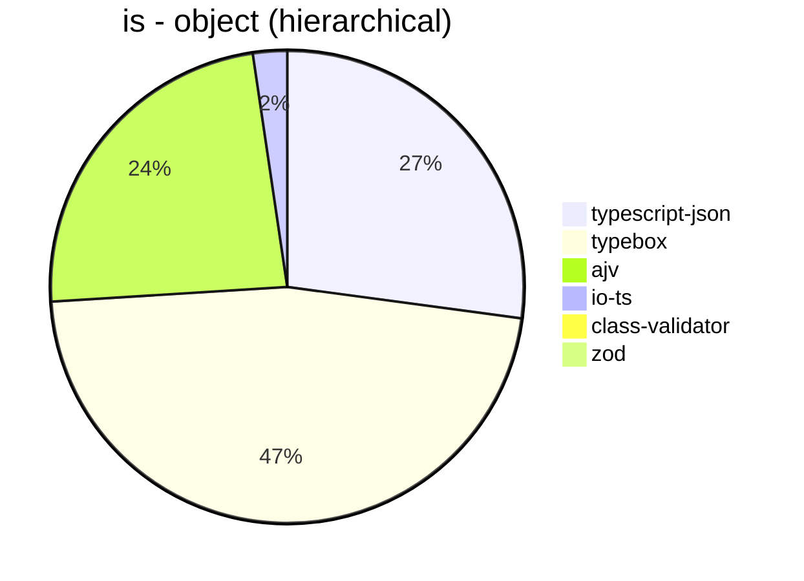


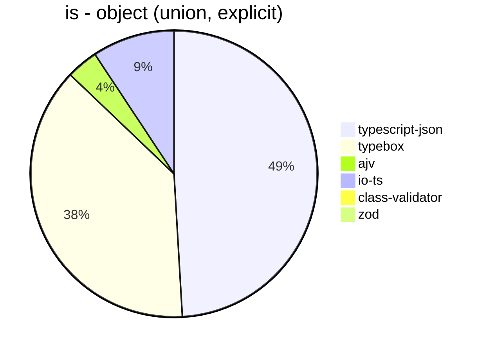


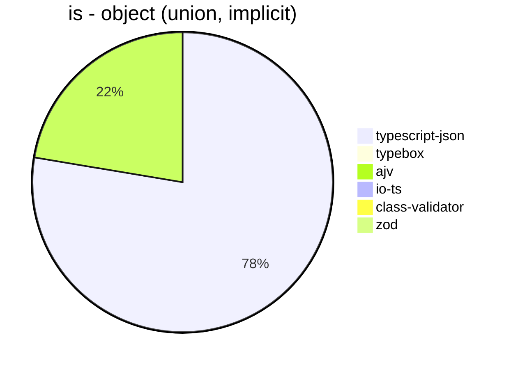


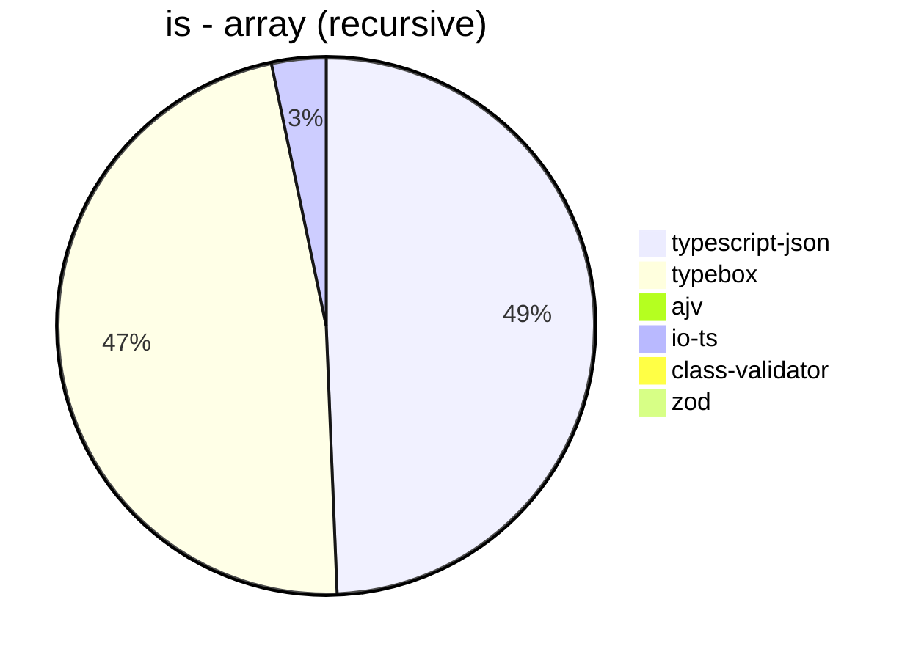


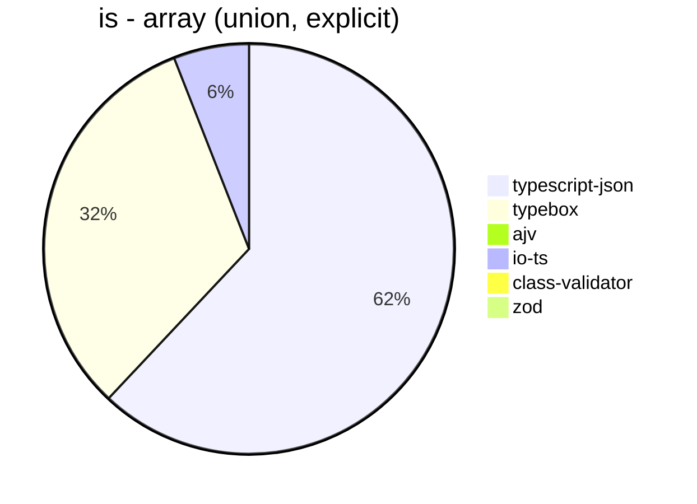


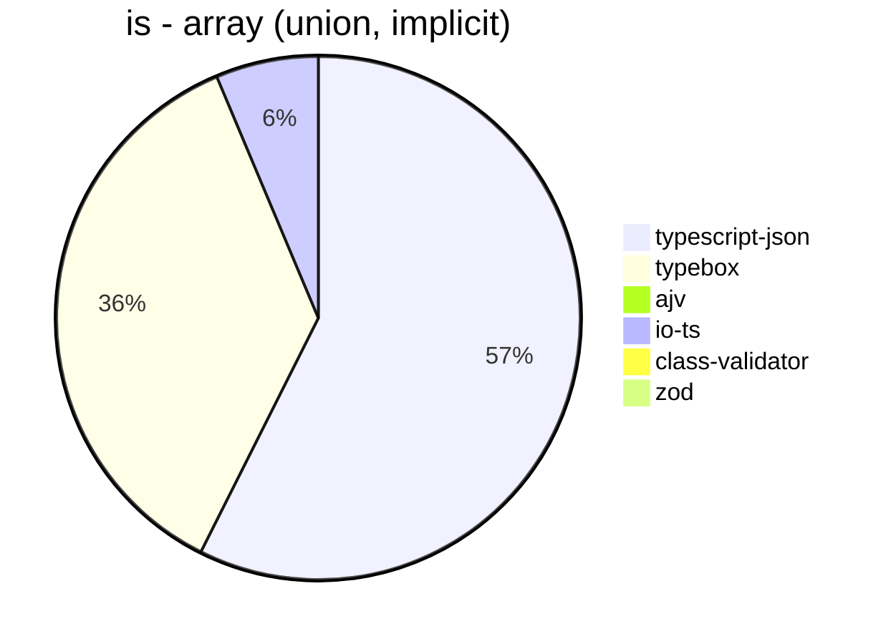


## assert
 Components | typescript-json | typebox | io-ts | zod | class-validator 
------------|-----------------|---------|-------|-----|-----------------
object (hierarchical) | 24167.12885930856 | 936.5988909426986 | 3733.608765942159 | 396.9635252730976 | 58.318425760286225
object (recursive) | 30918.894670733895 | 391.7432846583739 | 1802.4759793052476 | 70.17543859649123 | 37.92341678939617
object (union, explicit) | 4750 | 171.99061541238044 | 1163.6195752539243 | 34.35537495382342 | 16.03391079985256
object (union, implicit) | 4704.212454212454 | 71.51910193735289 | 344.32571849668386 | 19.140551698254832 | 14.721919302071974
array (recursive) | 1561.7746162485962 | 38.49645905211549 | 184.18121054585964 | 8.679245283018869 | 3.4207525655644244
array (union, explicit) | 2035.727239753355 | 19.83411467724486 | 84.88307862272141 | 2.800074668657831 | 7.387762833870052
array (union, implicit) | 2220.305480682839 | 26.64902664902665 | 108.39552238805969 | 3.7657691583505932 | 8.583690987124463
ultimate union | 247.97645327446654 | 4.224834680382072 | Failed | 0.35498757543485976 | Failed


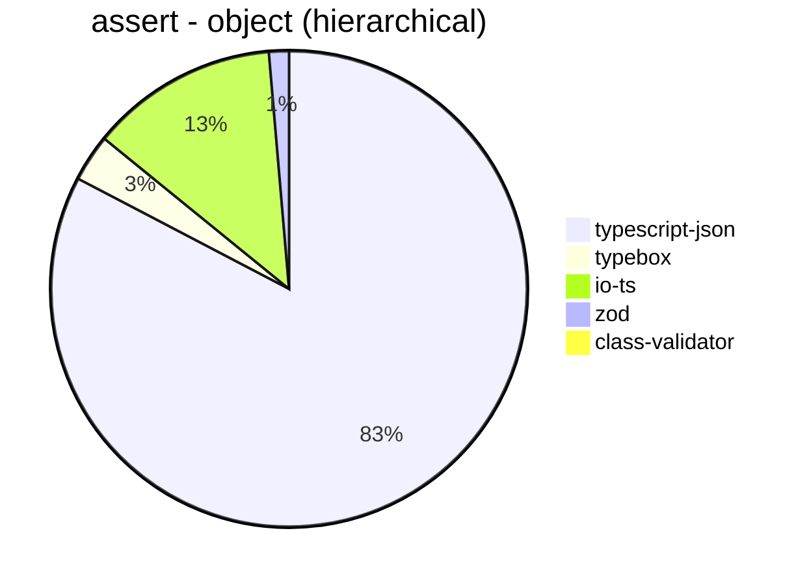


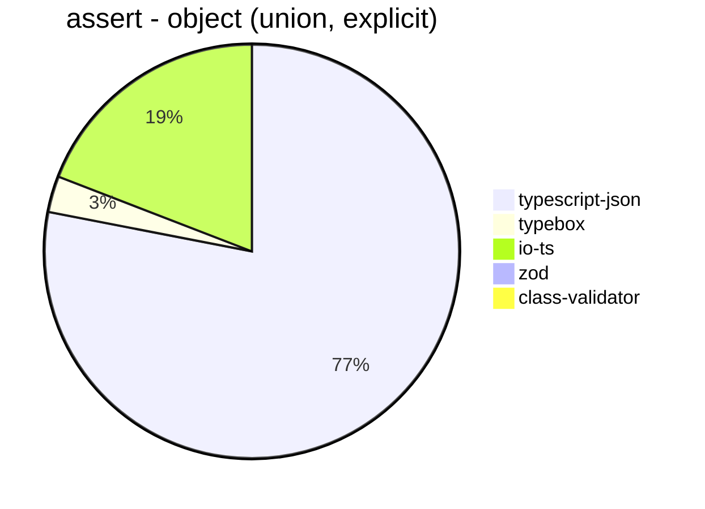


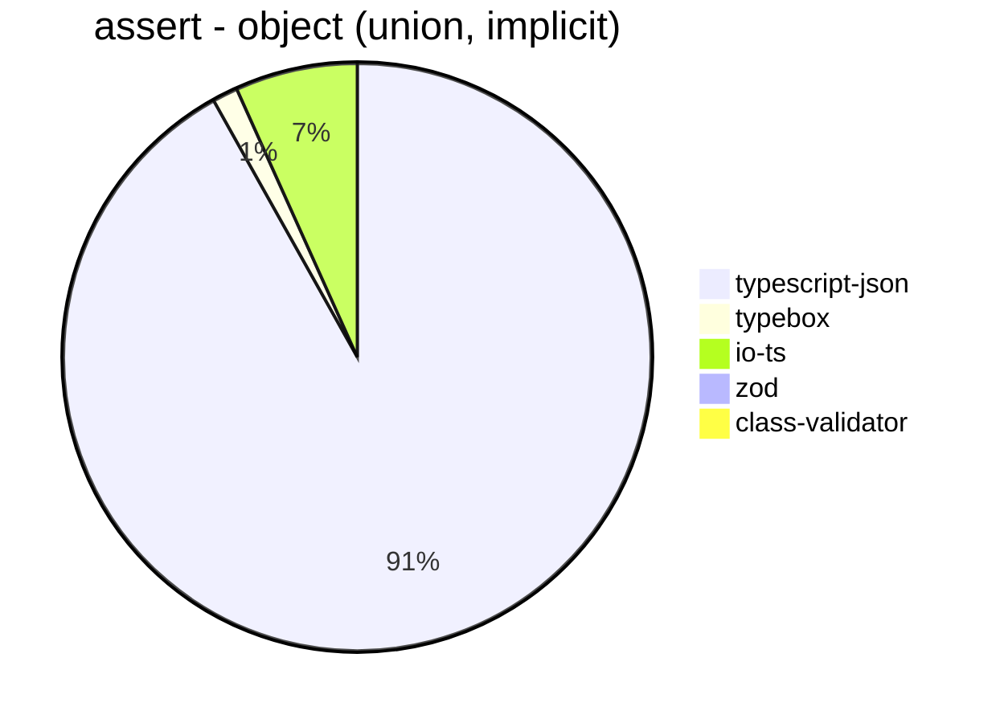


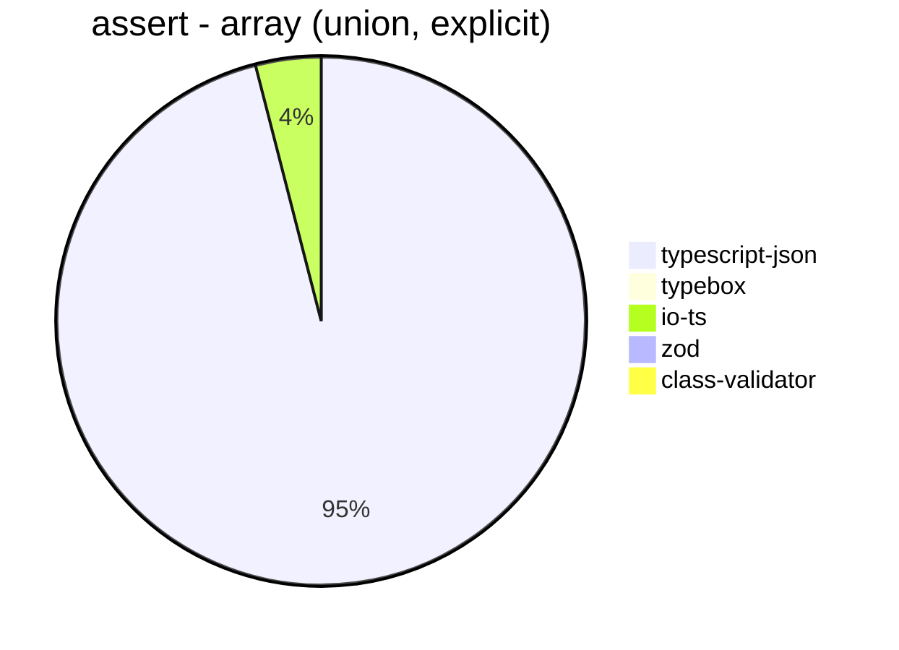


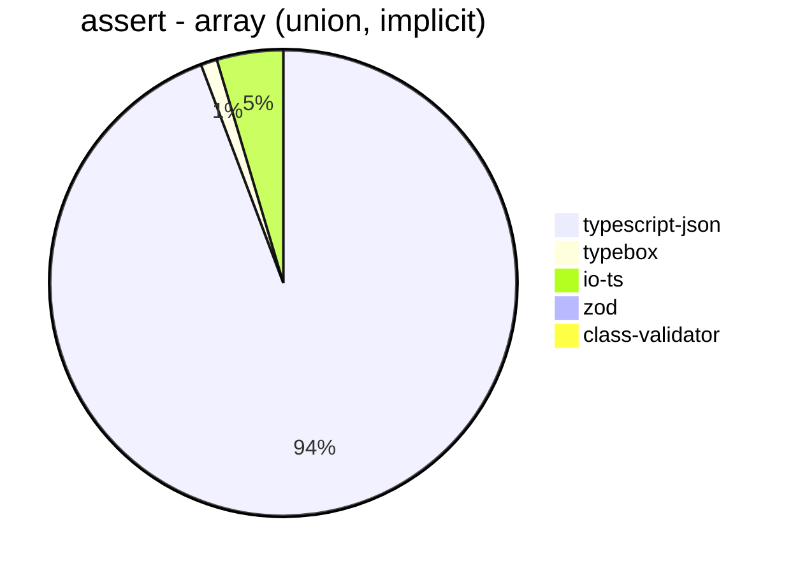


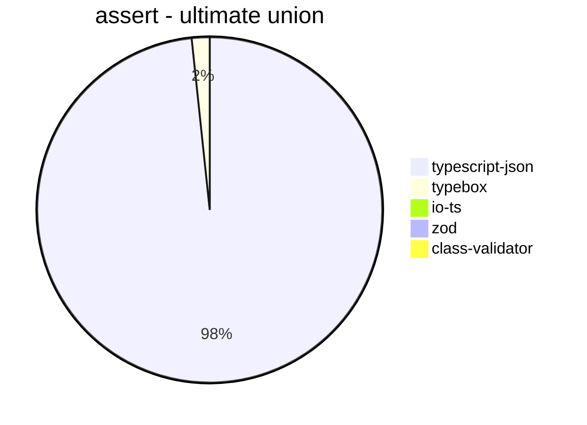


## valiadate
 Components | typescript-json | typebox | io-ts | zod | class-validator 
------------|-----------------|---------|-------|-----|-----------------
object (hierarchical) | 17096.11896989481 | 806.6847335140018 | 3654.1549953314657 | 414.6387474061498 | 59.25653294074346
object (recursive) | 17804.438784791706 | 369.0717844620779 | 1680.2201704545455 | 69.93268511593119 | 37.9182156133829
object (union, explicit) | 3906.177260519248 | 159.72607810475662 | 1151.0407400818358 | 34.45065176908752 | 15.716374269005847
object (union, implicit) | 3554.1172240201363 | 71.41514752866003 | 324.3391066545123 | 17.965204236006052 | 15.047371354263422
array (recursive) | 1159.300357344367 | 39.901197035911075 | 182.97067171239357 | 8.886367933446778 | 3.3917467495760314
array (union, explicit) | 1650.7795889440113 | 20.892687559354226 | 87.12908712908713 | 3.0126153266804745 | 6.749156355455568
array (union, implicit) | 1552.9766123316797 | 25.63176895306859 | 111.352133044107 | 3.9735099337748343 | 8.534322820037106
ultimate union | 142.7304964539007 | 4.736642667677151 | Failed | 0.35644270183567994 | Failed


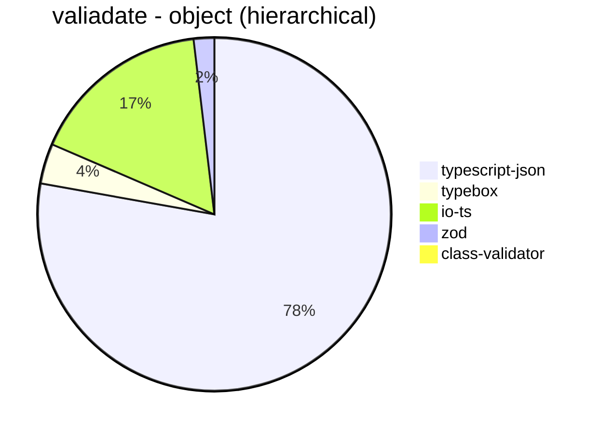


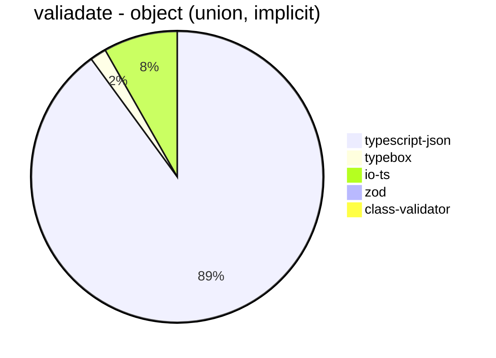


```mermaid
pie title valiadate - array (recursive)
  "typescript-json": 1159.300357344367
  "typebox": 39.901197035911075
  "io-ts": 182.97067171239357
  "zod": 8.886367933446778
  "class-validator": 3.3917467495760314
```


```mermaid
pie title valiadate - array (union, explicit)
  "typescript-json": 1650.7795889440113
  "typebox": 20.892687559354226
  "io-ts": 87.12908712908713
  "zod": 3.0126153266804745
  "class-validator": 6.749156355455568
```


```mermaid
pie title valiadate - array (union, implicit)
  "typescript-json": 1552.9766123316797
  "typebox": 25.63176895306859
  "io-ts": 111.352133044107
  "zod": 3.9735099337748343
  "class-validator": 8.534322820037106
```


```mermaid
pie title valiadate - ultimate union
  "typescript-json": 142.7304964539007
  "typebox": 4.736642667677151
  "io-ts": 0
  "zod": 0.35644270183567994
  "class-validator": 0
```


## optimizer
 Components | typescript-json | ajv | typebox 
------------|-----------------|-----|---------
object (hierarchical) | 88879.00162778079 | 4.926108374384237 | 211.118930330753
object (recursive) | 74301.21125757036 | 8.925318761384334 | 830.7072829131653
object (union) | 11958.441078684891 | 4.406904149834741 | 86.40636297903109
array (hierarchical) | 3111.456239722273 | 6.564551422319475 | 1061.0542282897231
array (recursive) | 5707.669507224899 | 9.483079211602826 | 833.616298811545
array (union) | 4043.1177446102824 | 6.283496581038626 | 253.52112676056336
ultimate union | 593.4492968171725 | 0.8987956138774044 | 11.063986723215931


```mermaid
pie title optimizer - object (hierarchical)
  "typescript-json": 88879.00162778079
  "ajv": 4.926108374384237
  "typebox": 211.118930330753
```


```mermaid
pie title optimizer - object (recursive)
  "typescript-json": 74301.21125757036
  "ajv": 8.925318761384334
  "typebox": 830.7072829131653
```


```mermaid
pie title optimizer - object (union)
  "typescript-json": 11958.441078684891
  "ajv": 4.406904149834741
  "typebox": 86.40636297903109
```


```mermaid
pie title optimizer - array (hierarchical)
  "typescript-json": 3111.456239722273
  "ajv": 6.564551422319475
  "typebox": 1061.0542282897231
```


```mermaid
pie title optimizer - array (recursive)
  "typescript-json": 5707.669507224899
  "ajv": 9.483079211602826
  "typebox": 833.616298811545
```


```mermaid
pie title optimizer - array (union)
  "typescript-json": 4043.1177446102824
  "ajv": 6.283496581038626
  "typebox": 253.52112676056336
```


```mermaid
pie title optimizer - ultimate union
  "typescript-json": 593.4492968171725
  "ajv": 0.8987956138774044
  "typebox": 11.063986723215931
```


## stringify
 Components | typescript-json | fast-json-stringify | JSON.stringify() 
------------|-----------------|---------------------|------------------
object (simple) | 127325.87287376903 | 28956.86414891713 | 4336.8780858336495
object (hierarchical) | 4652.506221116246 | 4347.802197802198 | 1190.414267137284
object (recursive) | 4995.341336678014 | 922.5365483197265 | 900.6936838262139
object (union) | 1240.5923344947735 | 1258.158614402917 | 386.3464447806354
array (hierarchical) | 66.72694394213381 | 89.76494540070333 | 17.008046817849305
array (recursive) | 249.26253687315634 | 68.62562767342385 | 67.05594273874553
array (union) | 320.50596828790304 | 151.64998146088246 | 159.26550496533633
ultimate union | 121.74704276615104 | 60.48180420297284 | 122.4186046511628


```mermaid
pie title stringify - object (simple)
  "typescript-json": 127325.87287376903
  "fast-json-stringify": 28956.86414891713
  "JSON.stringify()": 4336.8780858336495
```


```mermaid
pie title stringify - object (hierarchical)
  "typescript-json": 4652.506221116246
  "fast-json-stringify": 4347.802197802198
  "JSON.stringify()": 1190.414267137284
```


```mermaid
pie title stringify - object (recursive)
  "typescript-json": 4995.341336678014
  "fast-json-stringify": 922.5365483197265
  "JSON.stringify()": 900.6936838262139
```


```mermaid
pie title stringify - object (union)
  "typescript-json": 1240.5923344947735
  "fast-json-stringify": 1258.158614402917
  "JSON.stringify()": 386.3464447806354
```


```mermaid
pie title stringify - array (hierarchical)
  "typescript-json": 66.72694394213381
  "fast-json-stringify": 89.76494540070333
  "JSON.stringify()": 17.008046817849305
```


```mermaid
pie title stringify - array (recursive)
  "typescript-json": 249.26253687315634
  "fast-json-stringify": 68.62562767342385
  "JSON.stringify()": 67.05594273874553
```


```mermaid
pie title stringify - array (union)
  "typescript-json": 320.50596828790304
  "fast-json-stringify": 151.64998146088246
  "JSON.stringify()": 159.26550496533633
```


```mermaid
pie title stringify - ultimate union
  "typescript-json": 121.74704276615104
  "fast-json-stringify": 60.48180420297284
  "JSON.stringify()": 122.4186046511628
```


