# Benchmark of `typescript-json`
> CPU: AMD Ryzen 7 5800H with Radeon Graphics
> Memory: 64,928 MB
> NodeJS version: v16.6.0
> TypeScript-JSON version: 3.3.11


## valiadate
 Components | typescript-json | class-validator | io-ts | zod 
------------|-----------------|-----------------|-------|-----
object (hierarchical) | 18456.513828238716 | 102.07308503162332 | 3903.515195898938 | 431.7523533671253
object (recursive) | 19118.15668202765 | 66.03255899030547 | 1760.195758564437 | 72.13885373350209
object (union, explicit) | 3510.6532840288783 | Failed | 1257.4383164005806 | 34.07821229050279
object (union, implicit) | 3848.0163903892717 | Failed | 856.8040860999635 | 52.20137469812372
array (recursive) | 729.6484301560444 | 4.245892560457818 | 117.29659281325637 | 7.1612192434814546
array (union, explicit) | 1485.0213980028532 | Failed | 67.43451606910645 | 2.609992542878449
array (union, implicit) | 1603.419746276889 | Failed | 111.00763643136526 | 3.597122302158273
ultimate union | 153.9281905439033 | Failed | Failed | Failed


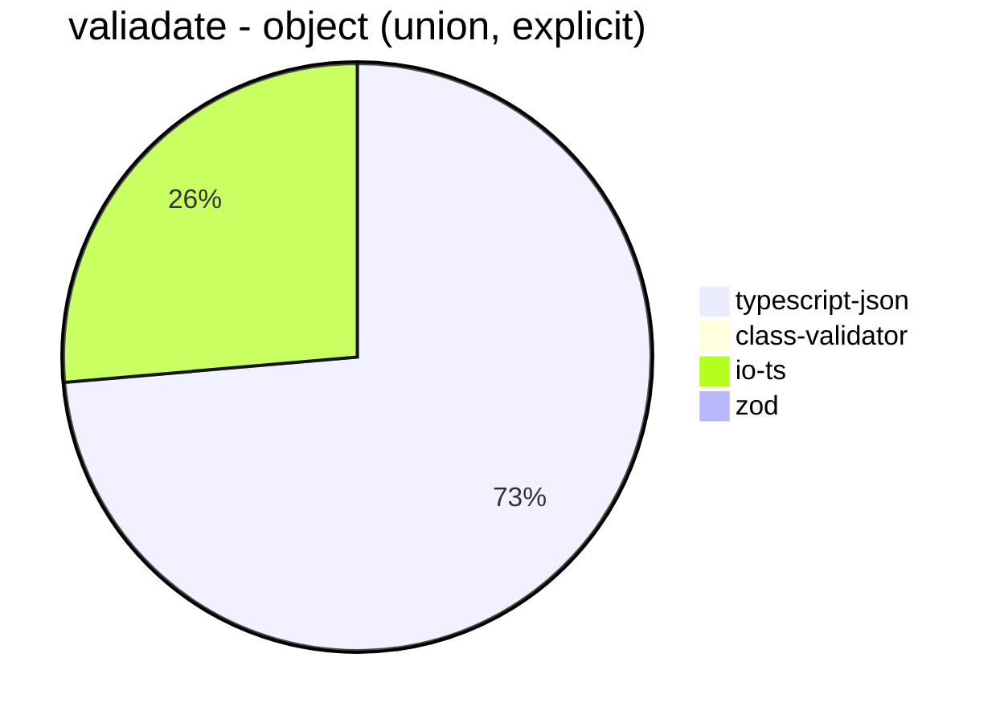


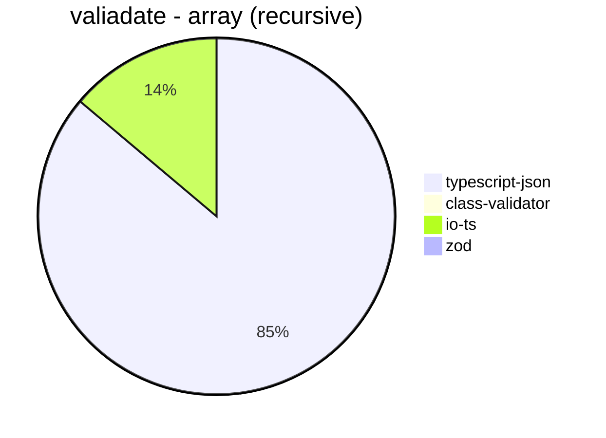


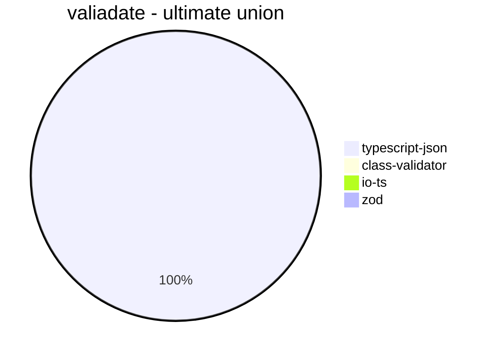


## is
 Components | typescript-json | io-ts | class-validatr | zod | ajv | class-validator 
------------|-----------------|-------|----------------|-----|-----|-----------------
object (hierarchical) | 103094.61187214612 | 8830.181818181818 | Failed | 396.7046894803549 | 84632.11125158028 | 99.04970760233917
object (recursive) | 74587.65159867695 | 4701.476216511755 | Failed | 68.32412523020258 | Failed | 64.15163112812101
object (union, explicit) | 13381.151262030144 | 3269.589552238806 | Failed | 33.205619412515965 | 1173.2806608008618 | Failed
object (union, implicit) | 13568.74654886803 | 3144.473293768546 | Failed | 50.342402369054234 | Failed | Failed
array (recursive) | 7331.532873905756 | 489.44760506514956 | Failed | 8.659638554216867 | Failed | 5.283018867924529
array (union, explicit) | 3689.475641502417 | 386.7120954003407 | Failed | 2.830722777882619 | Failed | Failed
array (union, implicit) | 3594.7772096420745 | 444.5255474452554 | Failed | 3.770739064856712 | Failed | Failed
ultimate union | 587.3247131670006 | Failed | Failed | Failed | Failed | Failed


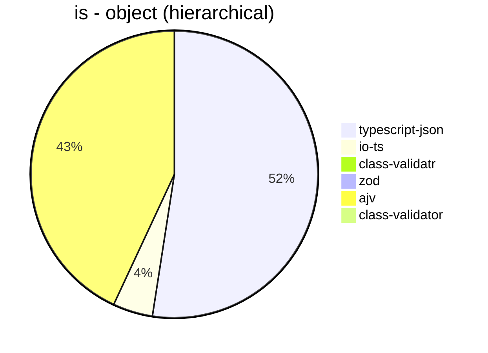


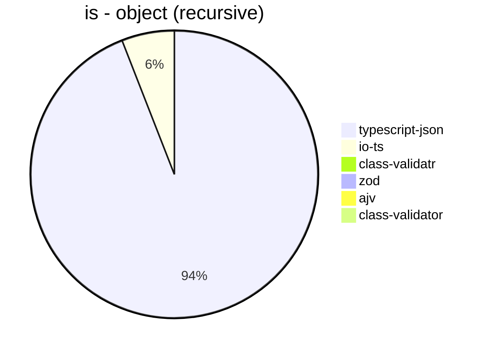


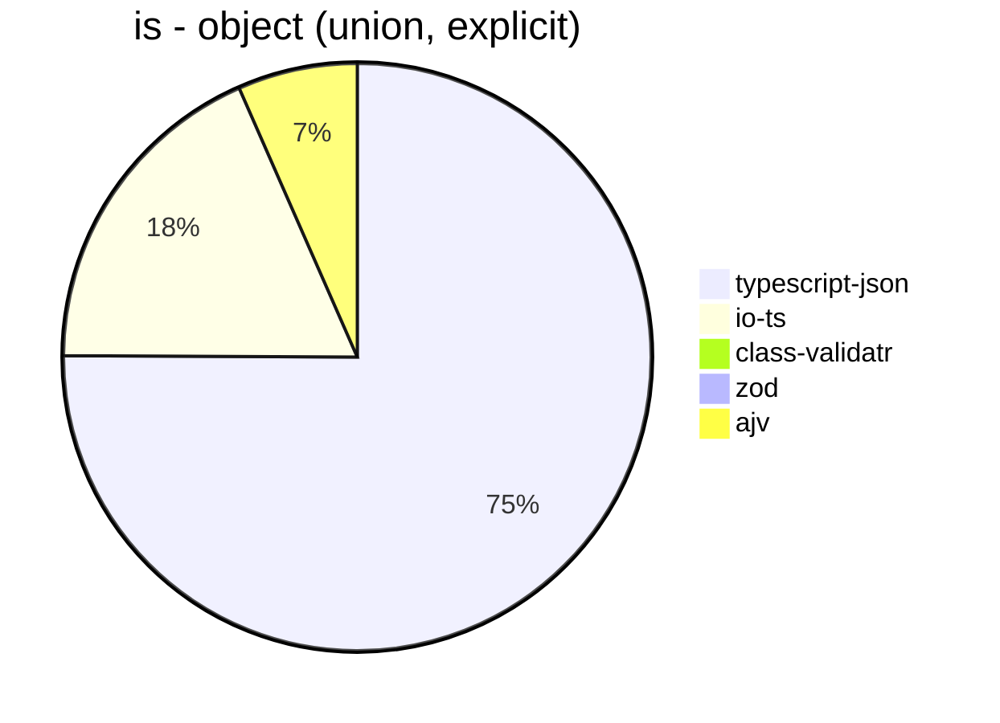


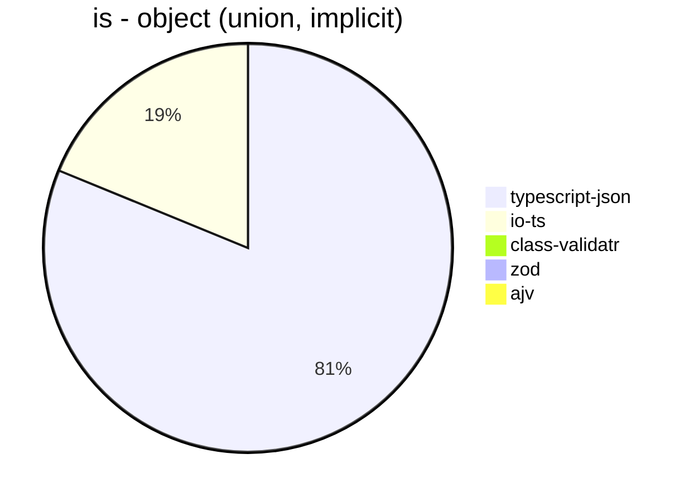


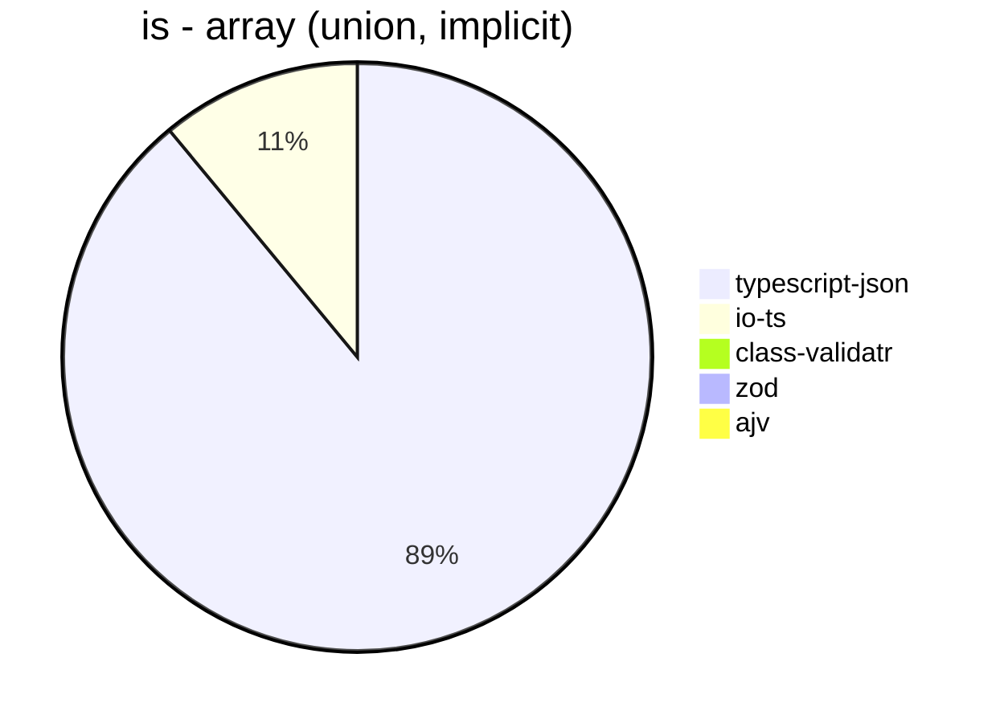


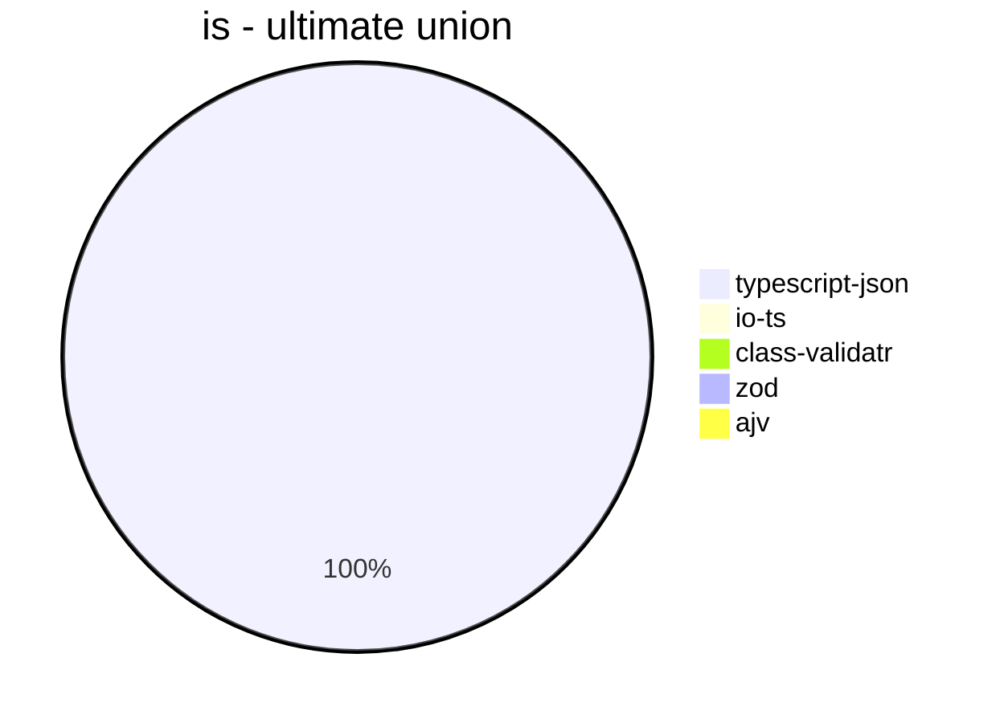


## optimizer
 Components | typescript-json | fast-json-stringify | JSON.stringify() 
------------|-----------------|---------------------|------------------
object (simple) | 118779.92417403864 | 28.738788211605346 | 3930.1777294160315
object (hierarchical) | 4303.002394547799 | 10.851572558396175 | 1150.605778191985
object (recursive) | 4472.574626865671 | 65.90951405697263 | 914.3874110153615
object (union) | 1924.2284235815932 | 1.0893246187363834 | 537.406015037594
array (hierarchical) | 68.1154127100073 | 9.359515507432556 | 20.42728635682159
array (recursive) | 215.31014700609538 | 34.17533432392273 | 66.46030589949017
array (union) | 290.0126880551024 | 2.4208566108007448 | 164.2635517430188
ultimate union | 115.17105498835751 | 0.16363933889707086 | 129.5912601243172


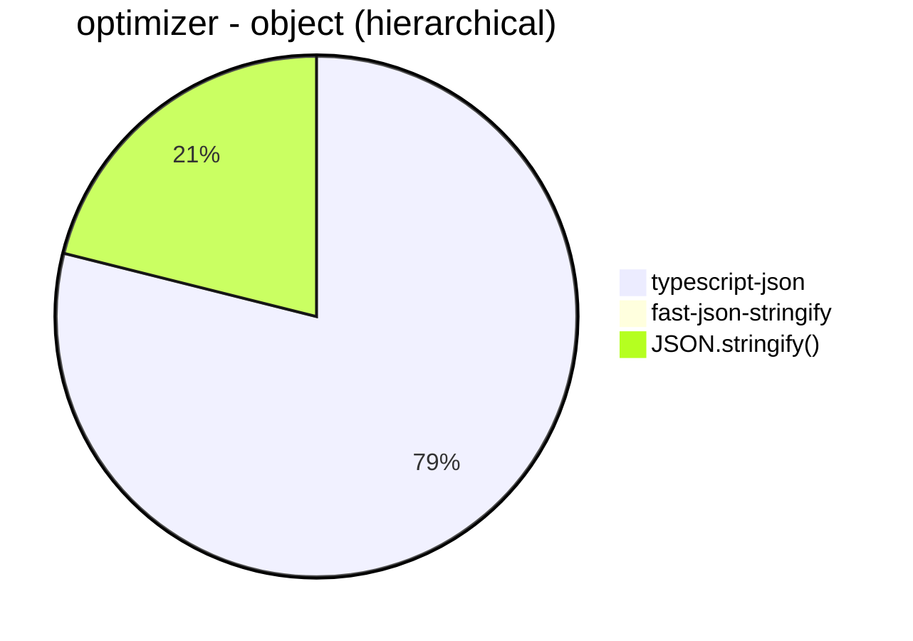


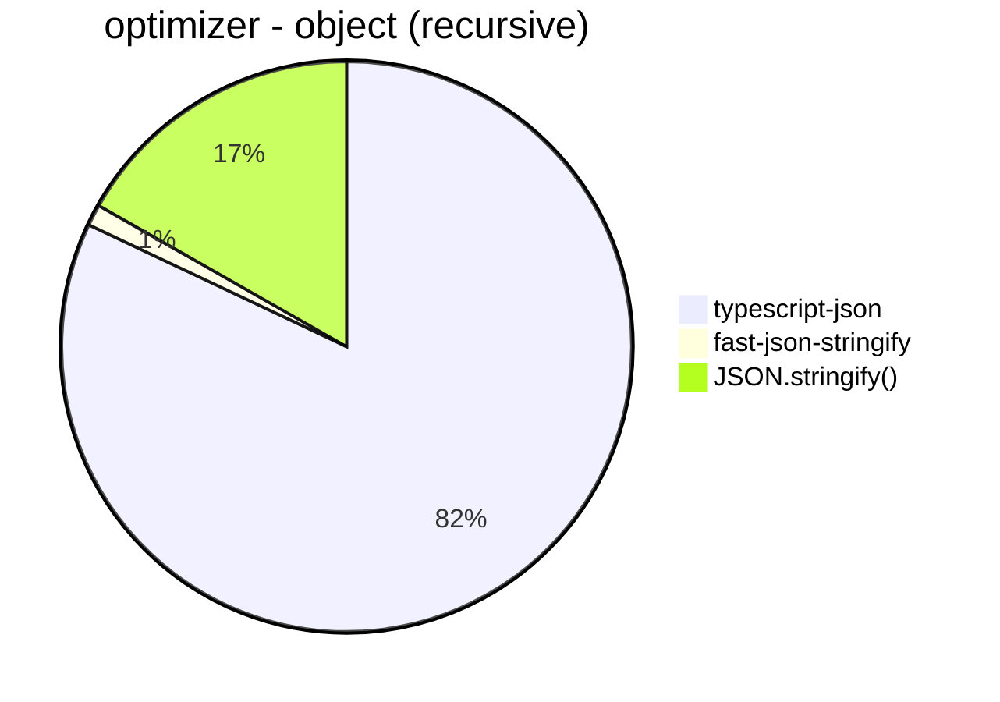


```mermaid
pie title optimizer - array (hierarchical)
  "typescript-json": 68.1154127100073
  "fast-json-stringify": 9.359515507432556
  "JSON.stringify()": 20.42728635682159
```


```mermaid
pie title optimizer - array (recursive)
  "typescript-json": 215.31014700609538
  "fast-json-stringify": 34.17533432392273
  "JSON.stringify()": 66.46030589949017
```


```mermaid
pie title optimizer - array (union)
  "typescript-json": 290.0126880551024
  "fast-json-stringify": 2.4208566108007448
  "JSON.stringify()": 164.2635517430188
```


```mermaid
pie title optimizer - ultimate union
  "typescript-json": 115.17105498835751
  "fast-json-stringify": 0.16363933889707086
  "JSON.stringify()": 129.5912601243172
```


## stringify
 Components | typescript-json | fast-json-stringify | JSON.stringify() 
------------|-----------------|---------------------|------------------
object (simple) | 100984.48773448775 | 24488.110599078344 | 4068.439650362656
object (hierarchical) | 4449.092928544983 | 4212.567592765243 | 1117.7753544165757
object (recursive) | 4787.867579064176 | 908.5090361445783 | 898.1430410001839
object (union) | 1827.7727682596935 | 1380.4247460757156 | 525.0732064421669
array (hierarchical) | 64.89515545914678 | 88.36772983114446 | 20.511855476100866
array (recursive) | 222.2222222222222 | 67.57754800590841 | 64.55122393472348
array (union) | 308.9401586157174 | 154.6769174446275 | 167.54418954494173
ultimate union | 121.02022867194373 | 61.59735514181312 | 130.7634164777022


```mermaid
pie title stringify - object (simple)
  "typescript-json": 100984.48773448775
  "fast-json-stringify": 24488.110599078344
  "JSON.stringify()": 4068.439650362656
```


```mermaid
pie title stringify - object (hierarchical)
  "typescript-json": 4449.092928544983
  "fast-json-stringify": 4212.567592765243
  "JSON.stringify()": 1117.7753544165757
```


```mermaid
pie title stringify - object (recursive)
  "typescript-json": 4787.867579064176
  "fast-json-stringify": 908.5090361445783
  "JSON.stringify()": 898.1430410001839
```


```mermaid
pie title stringify - object (union)
  "typescript-json": 1827.7727682596935
  "fast-json-stringify": 1380.4247460757156
  "JSON.stringify()": 525.0732064421669
```


```mermaid
pie title stringify - array (hierarchical)
  "typescript-json": 64.89515545914678
  "fast-json-stringify": 88.36772983114446
  "JSON.stringify()": 20.511855476100866
```


```mermaid
pie title stringify - array (recursive)
  "typescript-json": 222.2222222222222
  "fast-json-stringify": 67.57754800590841
  "JSON.stringify()": 64.55122393472348
```


```mermaid
pie title stringify - array (union)
  "typescript-json": 308.9401586157174
  "fast-json-stringify": 154.6769174446275
  "JSON.stringify()": 167.54418954494173
```


```mermaid
pie title stringify - ultimate union
  "typescript-json": 121.02022867194373
  "fast-json-stringify": 61.59735514181312
  "JSON.stringify()": 130.7634164777022
```


