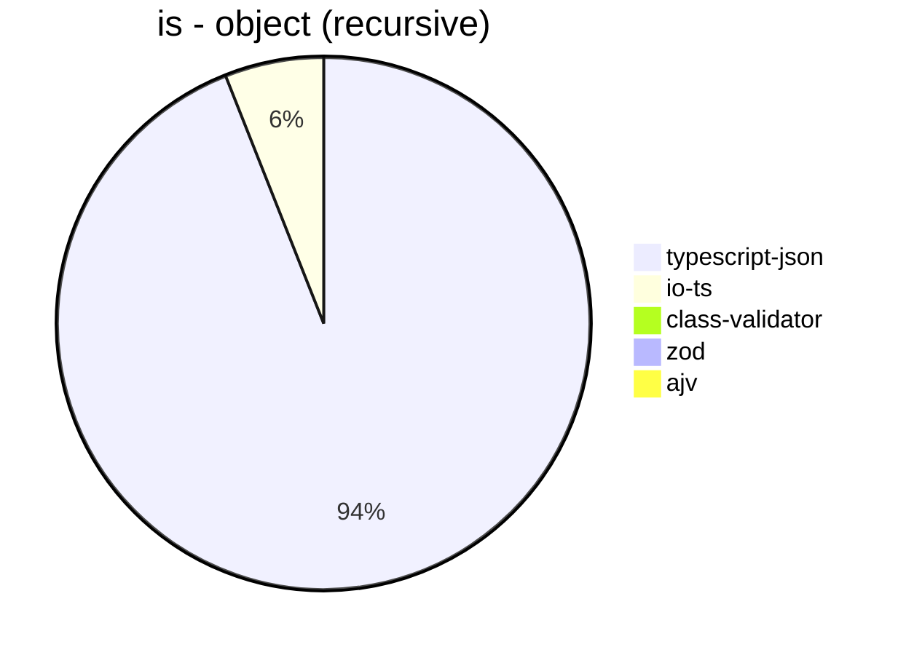
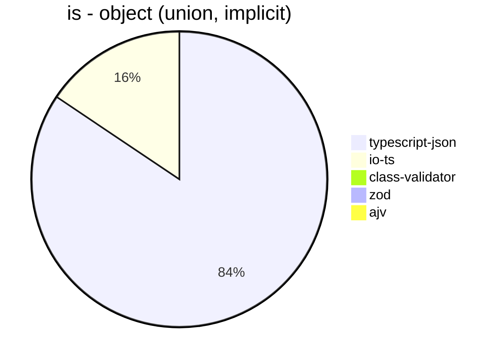
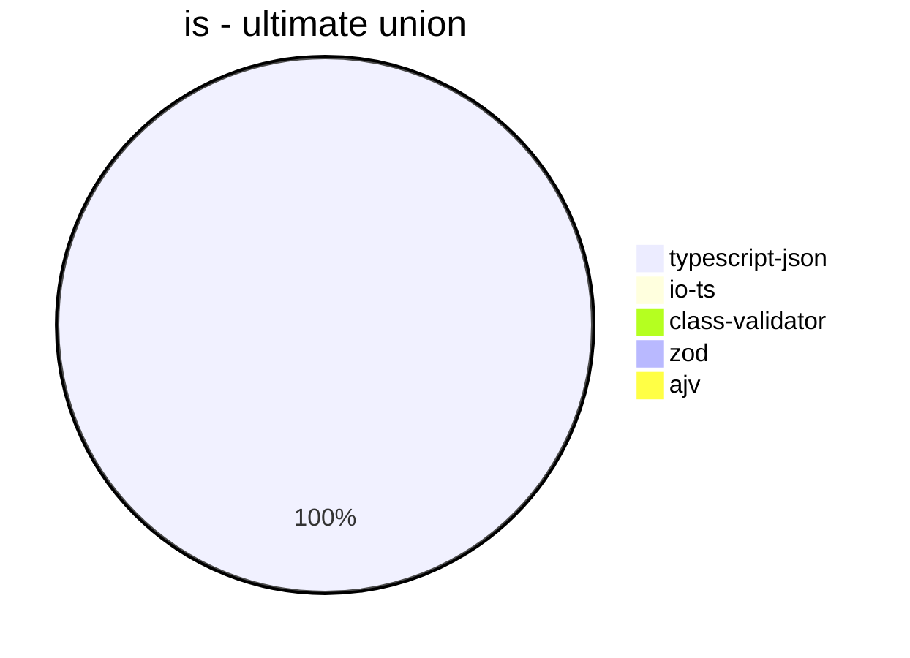
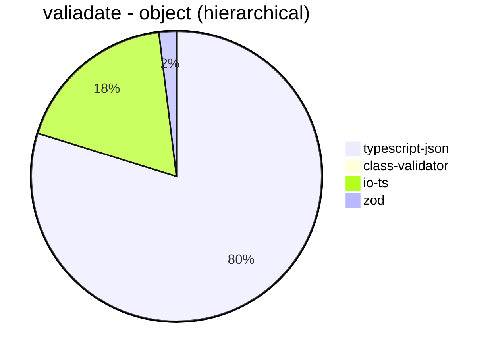
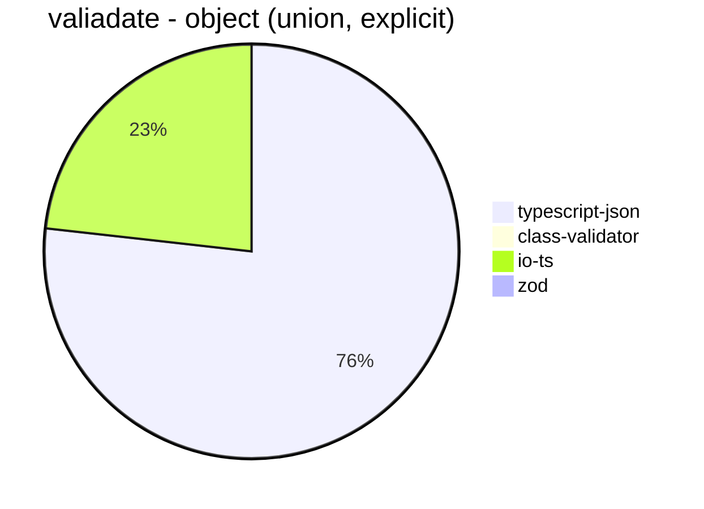
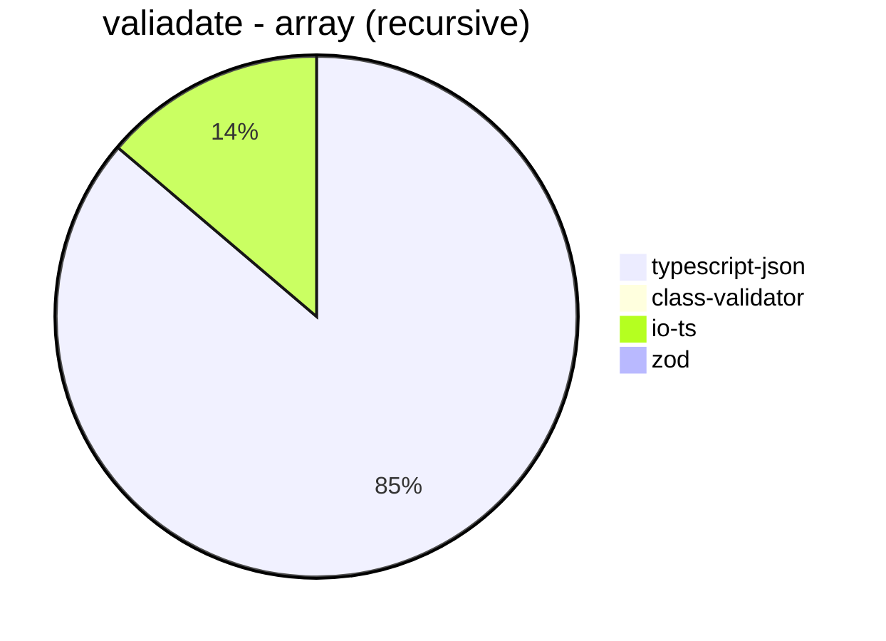
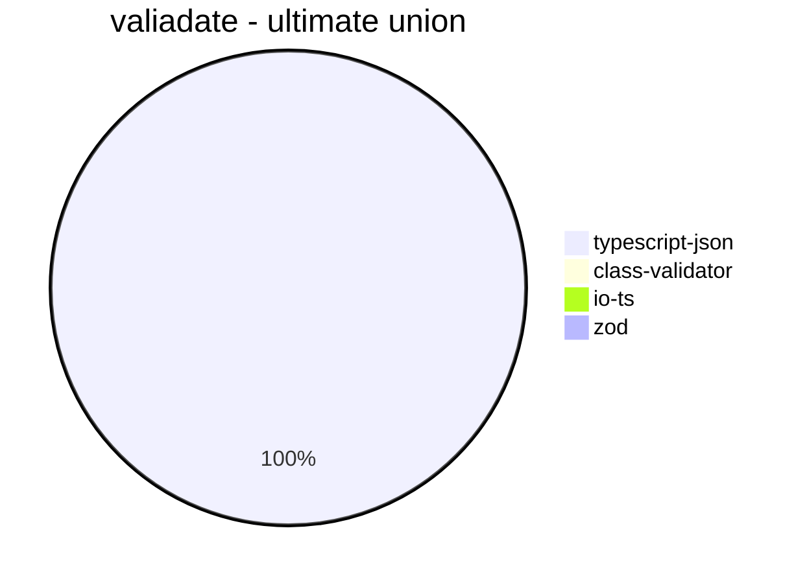
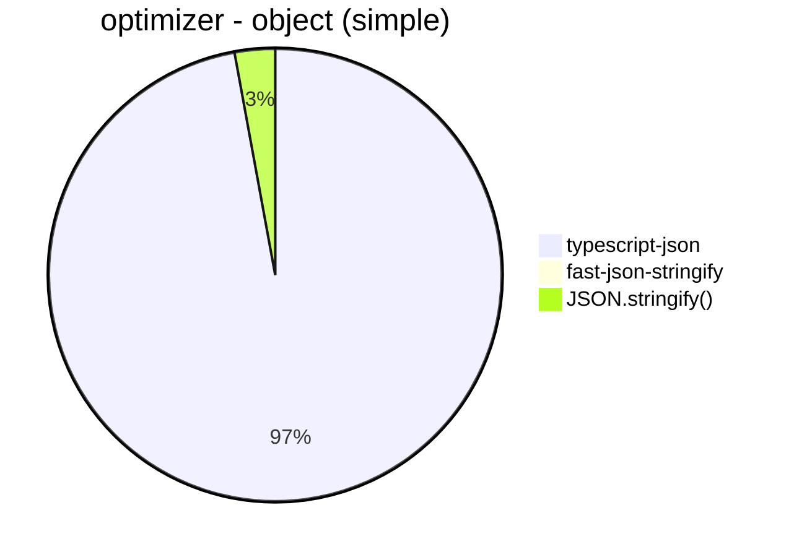
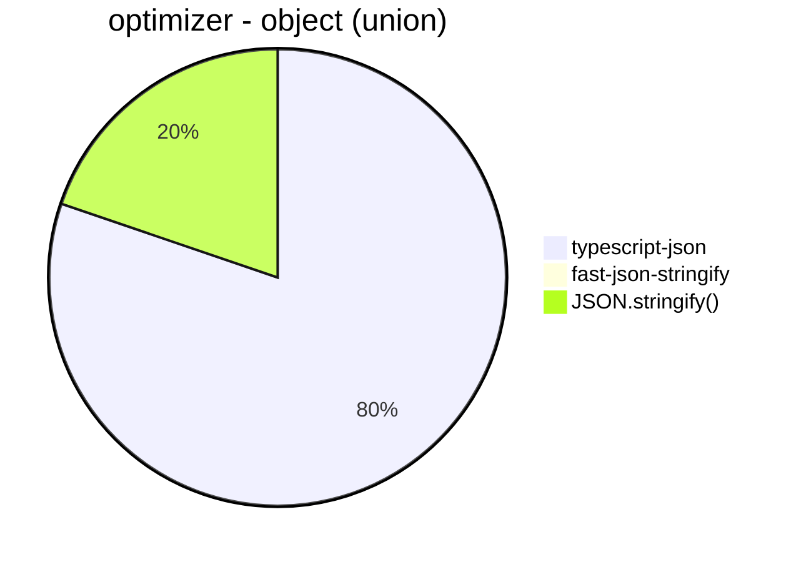

# Benchmark of `typescript-json`
> CPU: AMD Ryzen 7 5800H with Radeon Graphics
> Memory: 64,928 MB
> NodeJS version: v16.6.0
> TypeScript-JSON version: 3.3.12


## is
 Components | typescript-json | io-ts | class-validator | zod | ajv 
------------|-----------------|-------|-----------------|-----|-----
object (hierarchical) | 105018.20804038219 | 8947.152294233172 | 62.647969404480065 | 426.1384672343576 | 87703.76402461094
object (recursive) | 76773.3761598858 | 4899.49935101057 | 40.563067234673085 | 70.5796306454562 | Failed
object (union, explicit) | 14951.241453760345 | 3176.027274358514 | 16.05049594229035 | 34.47024673439768 | 1248.7671232876712
object (union, implicit) | 17336.20847861993 | 3201.3410318495066 | 16.73101673101673 | 51.9050248481502 | Failed
array (recursive) | 7315.894641235241 | 497.71355405158226 | 3.5998484274346345 | 8.867924528301888 | Failed
array (union, explicit) | 3961.9899385131357 | 395.55052790346906 | 6.884057971014493 | 2.8232636928289105 | Failed
array (union, implicit) | 3938.2422802850356 | 458.0681392736803 | 8.599738268835296 | 3.7369207772795217 | Failed
ultimate union | 683.8181818181819 | Failed | Failed | Failed | Failed











## valiadate
 Components | typescript-json | class-validator | io-ts | zod 
------------|-----------------|-----------------|-------|-----
object (hierarchical) | 17242.957746478874 | 62.236866190737686 | 3948.5559566787 | 420.199736197475
object (recursive) | 18419.019857897612 | 39.15383187975505 | 1864.879852125693 | 71.4552936775159
object (union, explicit) | 4059.1877617920236 | 16.802067946824224 | 1227.5774596847255 | 35.360149672591206
object (union, implicit) | 4099.184043517679 | 16.58255227108868 | 917.4766183752063 | 52.360830424398316
array (recursive) | 1097.8850832865432 | 3.5707573764330016 | 175.47412999447616 | 9.276789095039758
array (union, explicit) | 1772.1720658523632 | 6.827164929931729 | 85.79234972677595 | 2.8280542986425337
array (union, implicit) | 1667.821330902461 | 8.94187779433681 | 116.4021164021164 | 3.7593984962406015
ultimate union | 162.0826846566338 | Failed | Failed | Failed














## optimizer
 Components | typescript-json | fast-json-stringify | JSON.stringify() 
------------|-----------------|---------------------|------------------
object (simple) | 140410.97138691452 | 29.43800178412132 | 4166.043380703067
object (hierarchical) | 4429.471733086191 | 11.060743427017226 | 1147.1139430284857
object (recursive) | 4991.768794585696 | 69.02144530546043 | 924.3273542600896
object (union) | 2128.1957633308984 | 1.0897203051216855 | 524.4500999818215
array (hierarchical) | 161.6179303099282 | 12.141280353200884 | 44.01342782543827
array (recursive) | 252.8372093023256 | 35.807534502051475 | 69.78913976488151
array (union) | 319.46666666666664 | 2.5758969641214353 | 170.33171822586658
ultimate union | 123.46532941379905 | 0.16792611251049538 | 133.61988413380678








```mermaid
pie title optimizer - array (hierarchical)
  "typescript-json": 161.6179303099282
  "fast-json-stringify": 12.141280353200884
  "JSON.stringify()": 44.01342782543827
```


```mermaid
pie title optimizer - array (recursive)
  "typescript-json": 252.8372093023256
  "fast-json-stringify": 35.807534502051475
  "JSON.stringify()": 69.78913976488151
```


```mermaid
pie title optimizer - array (union)
  "typescript-json": 319.46666666666664
  "fast-json-stringify": 2.5758969641214353
  "JSON.stringify()": 170.33171822586658
```


```mermaid
pie title optimizer - ultimate union
  "typescript-json": 123.46532941379905
  "fast-json-stringify": 0.16792611251049538
  "JSON.stringify()": 133.61988413380678
```


## stringify
 Components | typescript-json | fast-json-stringify | JSON.stringify() 
------------|-----------------|---------------------|------------------
object (simple) | 133737.35877014263 | 30768.47110460863 | 4176.5361054390205
object (hierarchical) | 4661.770106500184 | 4432.817227264638 | 1188.3921863260707
object (recursive) | 5224.725274725275 | 902.8207461328481 | 913.9504563233377
object (union) | 2122.2407716564644 | 1505.6035274664707 | 545.0943396226415
array (hierarchical) | 100.61527325370974 | 138.53445133065986 | 27.272727272727273
array (recursive) | 249.5432955791012 | 67.26457399103138 | 67.1892497200448
array (union) | 325.1754543818607 | 155.91397849462365 | 166.79035250463824
ultimate union | 128.3603346982375 | 65.46080964685616 | 129.8050139275766


```mermaid
pie title stringify - object (simple)
  "typescript-json": 133737.35877014263
  "fast-json-stringify": 30768.47110460863
  "JSON.stringify()": 4176.5361054390205
```


```mermaid
pie title stringify - object (hierarchical)
  "typescript-json": 4661.770106500184
  "fast-json-stringify": 4432.817227264638
  "JSON.stringify()": 1188.3921863260707
```


```mermaid
pie title stringify - object (recursive)
  "typescript-json": 5224.725274725275
  "fast-json-stringify": 902.8207461328481
  "JSON.stringify()": 913.9504563233377
```


```mermaid
pie title stringify - object (union)
  "typescript-json": 2122.2407716564644
  "fast-json-stringify": 1505.6035274664707
  "JSON.stringify()": 545.0943396226415
```


```mermaid
pie title stringify - array (hierarchical)
  "typescript-json": 100.61527325370974
  "fast-json-stringify": 138.53445133065986
  "JSON.stringify()": 27.272727272727273
```


```mermaid
pie title stringify - array (recursive)
  "typescript-json": 249.5432955791012
  "fast-json-stringify": 67.26457399103138
  "JSON.stringify()": 67.1892497200448
```


```mermaid
pie title stringify - array (union)
  "typescript-json": 325.1754543818607
  "fast-json-stringify": 155.91397849462365
  "JSON.stringify()": 166.79035250463824
```


```mermaid
pie title stringify - ultimate union
  "typescript-json": 128.3603346982375
  "fast-json-stringify": 65.46080964685616
  "JSON.stringify()": 129.8050139275766
```


