# Benchmark of `typescript-json`
> CPU: AMD Ryzen 7 5800H with Radeon Graphics
> Memory: 64,928 MB
> NodeJS version: v16.6.0
> TypeScript-JSON version: 3.3.12

## is
 Components | typescript-json | io-ts | class-validator | zod | typebox | ajv 
------------|-----------------|-------|-----------------|-----|---------|-----
object (hierarchical) | 109426.97247706422 | 8741.385698406817 | 58.99332491430633 | 401.89469848788485 | 186383.75766586137 | 85754.77647931738
object (recursive) | 82627.6906238599 | 4717.732884399551 | 39.520509458700126 | 68.88489208633094 | 78604.4264886703 | Failed
object (union, explicit) | 14436.2611383888 | 3263.529849358378 | 15.944917557528537 | 32.939933063237625 | 13369.222303741746 | 1222.5249772933696
object (union, implicit) | 14263.87154326494 | 3178.1324527609613 | 15.994183933115231 | 51.989489489489486 | Failed | 4282.869260556888
array (recursive) | 7141.006661732051 | 491.2676056338028 | 3.3733133433283355 | 8.556547619047619 | 7052.944454765001 | Failed
array (union, explicit) | 3752.0273923229406 | 384.4580777096115 | 6.764168190127971 | 2.80688622754491 | 1961.120324304404 | Failed
array (union, implicit) | 3712.7172918572737 | 454.3400489549991 | 8.281192491718807 | 3.763643206624012 | 2300.5096468875136 | Failed
ultimate union | 633.8002211573903 | Failed | Failed | 0.3471619510501649 | Failed | Failed

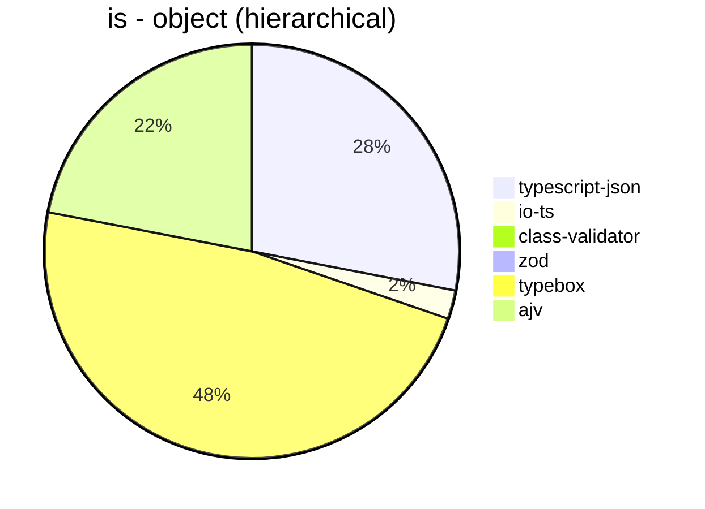
```mermaid
pie title is - object (hierarchical)
  "typescript-json": 109426.97247706422
  "io-ts": 8741.385698406817
  "class-validator": 58.99332491430633
  "zod": 401.89469848788485
  "typebox": 186383.75766586137
  "ajv": 85754.77647931738
```

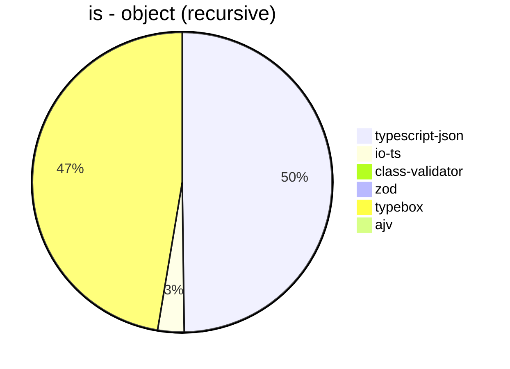
```mermaid
pie title is - object (recursive)
  "typescript-json": 82627.6906238599
  "io-ts": 4717.732884399551
  "class-validator": 39.520509458700126
  "zod": 68.88489208633094
  "typebox": 78604.4264886703
  "ajv": 0
```

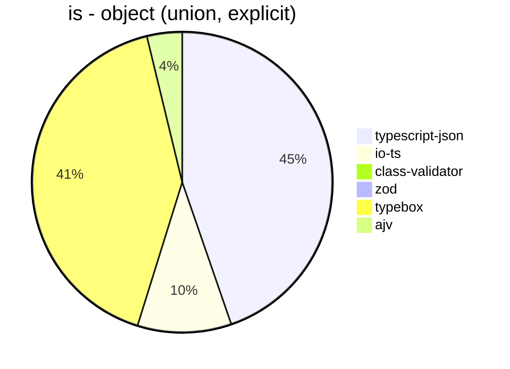
```mermaid
pie title is - object (union, explicit)
  "typescript-json": 14436.2611383888
  "io-ts": 3263.529849358378
  "class-validator": 15.944917557528537
  "zod": 32.939933063237625
  "typebox": 13369.222303741746
  "ajv": 1222.5249772933696
```

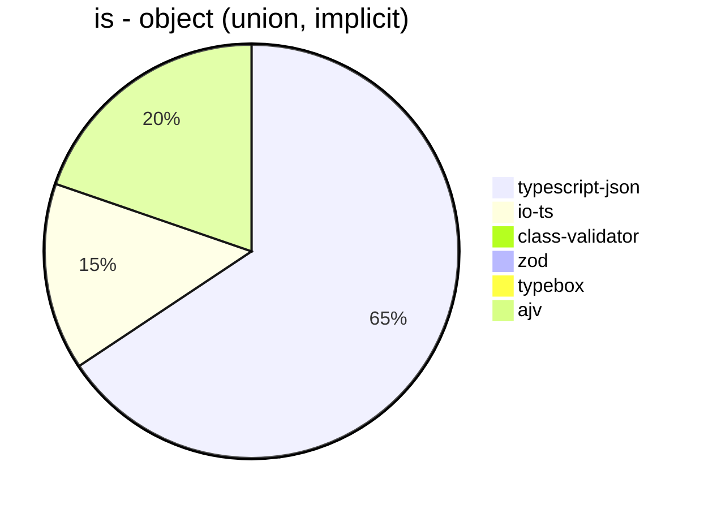
```mermaid
pie title is - object (union, implicit)
  "typescript-json": 14263.87154326494
  "io-ts": 3178.1324527609613
  "class-validator": 15.994183933115231
  "zod": 51.989489489489486
  "typebox": 0
  "ajv": 4282.869260556888
```

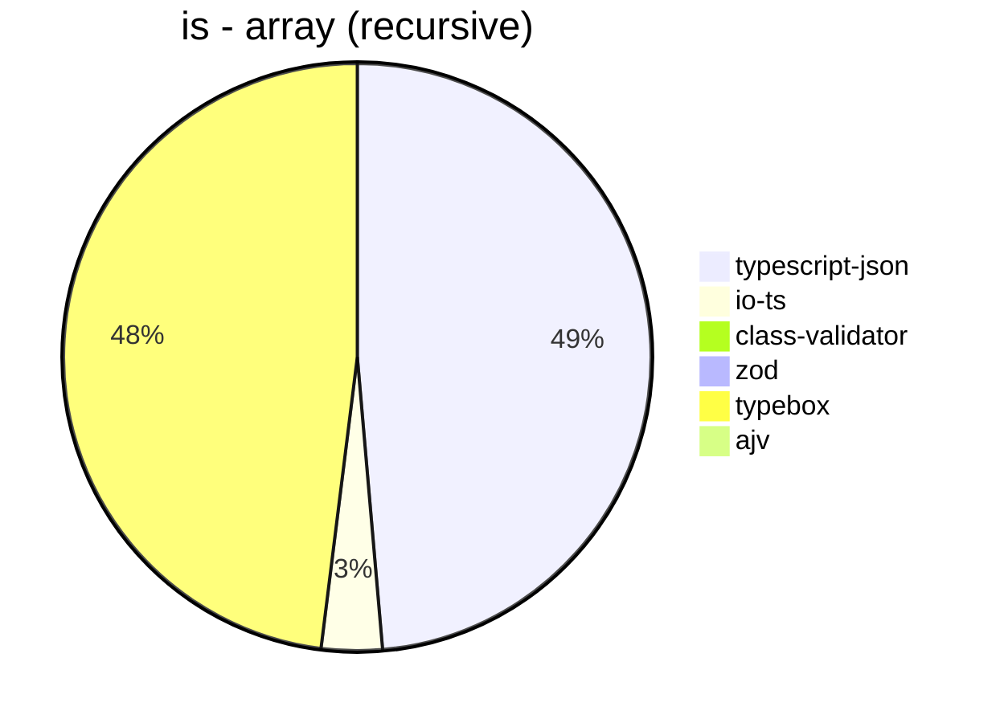
```mermaid
pie title is - array (recursive)
  "typescript-json": 7141.006661732051
  "io-ts": 491.2676056338028
  "class-validator": 3.3733133433283355
  "zod": 8.556547619047619
  "typebox": 7052.944454765001
  "ajv": 0
```

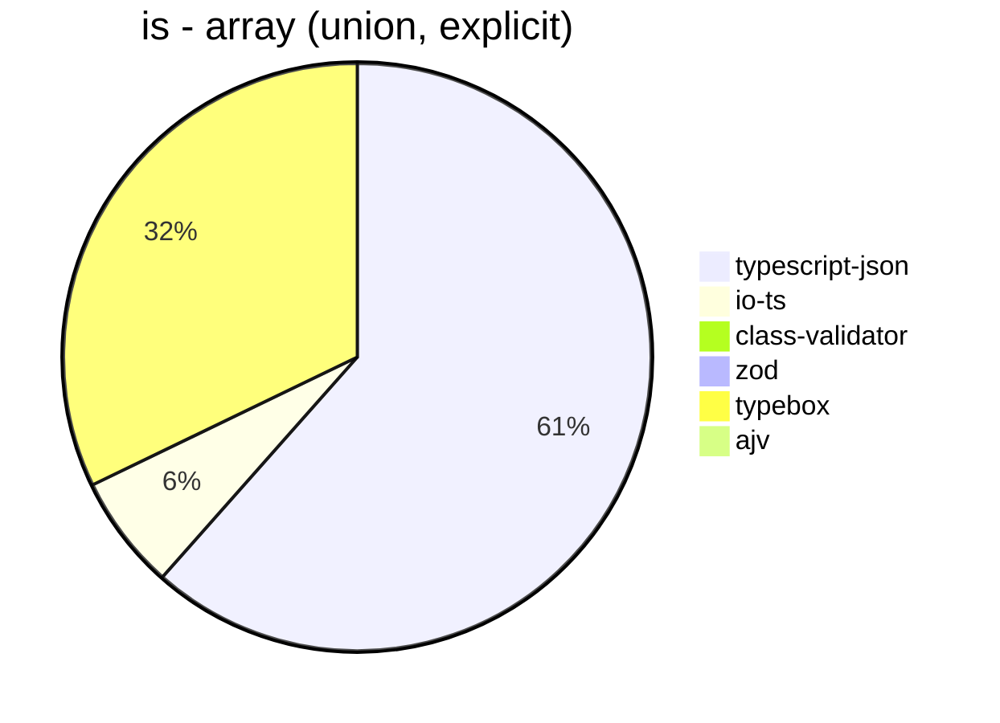
```mermaid
pie title is - array (union, explicit)
  "typescript-json": 3752.0273923229406
  "io-ts": 384.4580777096115
  "class-validator": 6.764168190127971
  "zod": 2.80688622754491
  "typebox": 1961.120324304404
  "ajv": 0
```

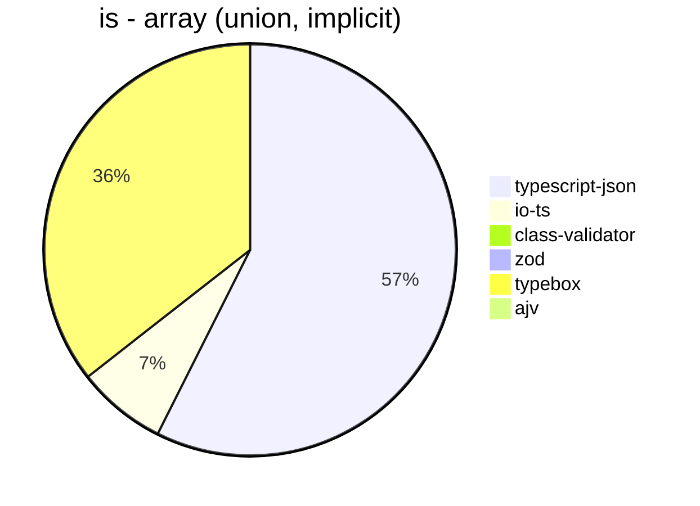
```mermaid
pie title is - array (union, implicit)
  "typescript-json": 3712.7172918572737
  "io-ts": 454.3400489549991
  "class-validator": 8.281192491718807
  "zod": 3.763643206624012
  "typebox": 2300.5096468875136
  "ajv": 0
```

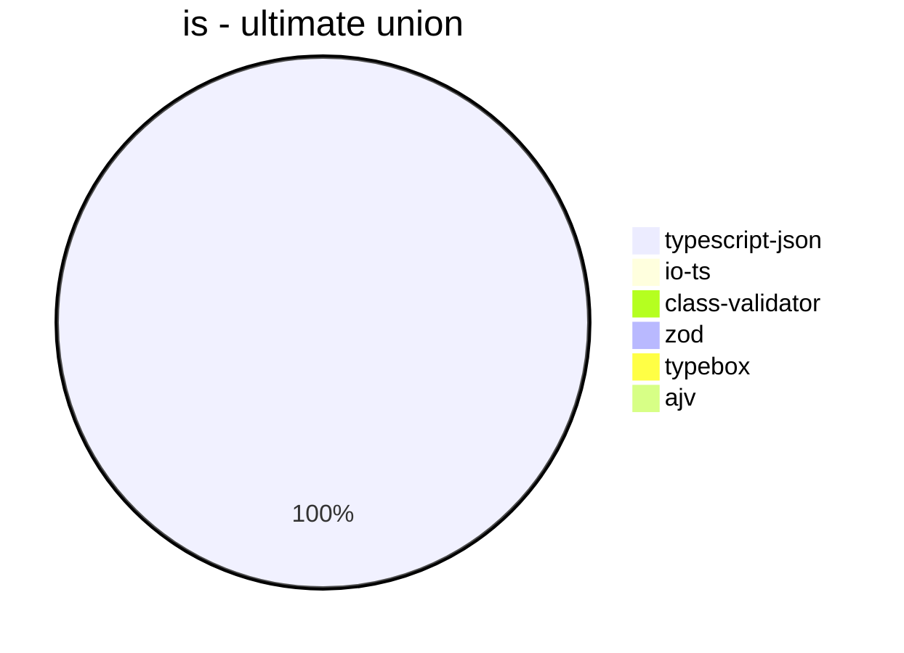
```mermaid
pie title is - ultimate union
  "typescript-json": 633.8002211573903
  "io-ts": 0
  "class-validator": 0
  "zod": 0.3471619510501649
  "typebox": 0
  "ajv": 0
```

## assert
 Components | typescript-json | class-validator | io-ts | zod | typebox 
------------|-----------------|-----------------|-------|-----|---------
object (hierarchical) | 23307.97035966022 | 59.84945841747751 | 3909.505564677979 | 387.3656909966655 | 887.772774506408
object (recursive) | 30708.485069191553 | 38.29078801331854 | 1700.1442481067436 | 67.66355140186916 | 387.04409363092
object (union, explicit) | 4940.955448201825 | 15.852293920179036 | 1222.6555246053854 | 34.24023690542292 | 168.81918819188192
object (union, implicit) | 4729.312247149687 | 16.458672454331705 | 863.8005780346822 | 53.455019556714475 | Failed
array (recursive) | 1502.034776174621 | 3.387278885961611 | 173.47509792949077 | 9.125475285171103 | 42.00112002986746
array (union, explicit) | 2215.187557182068 | 6.80397204854726 | 81.64766458256713 | 2.8005974607916357 | 22.27998514667657
array (union, implicit) | 1747.364594692839 | 8.61100711344066 | 117.59207328472611 | 3.5600524639310476 | 29.383886255924168
ultimate union | 270.74781367124757 | Failed | Failed | Failed | Failed

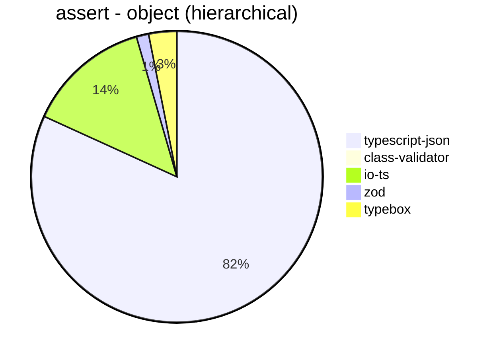
```mermaid
pie title assert - object (hierarchical)
  "typescript-json": 23307.97035966022
  "class-validator": 59.84945841747751
  "io-ts": 3909.505564677979
  "zod": 387.3656909966655
  "typebox": 887.772774506408
```

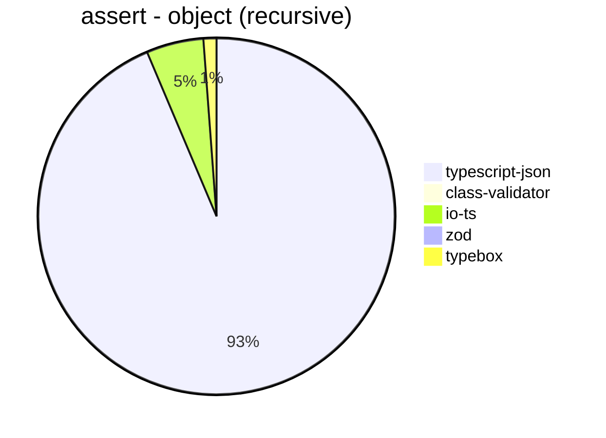
```mermaid
pie title assert - object (recursive)
  "typescript-json": 30708.485069191553
  "class-validator": 38.29078801331854
  "io-ts": 1700.1442481067436
  "zod": 67.66355140186916
  "typebox": 387.04409363092
```

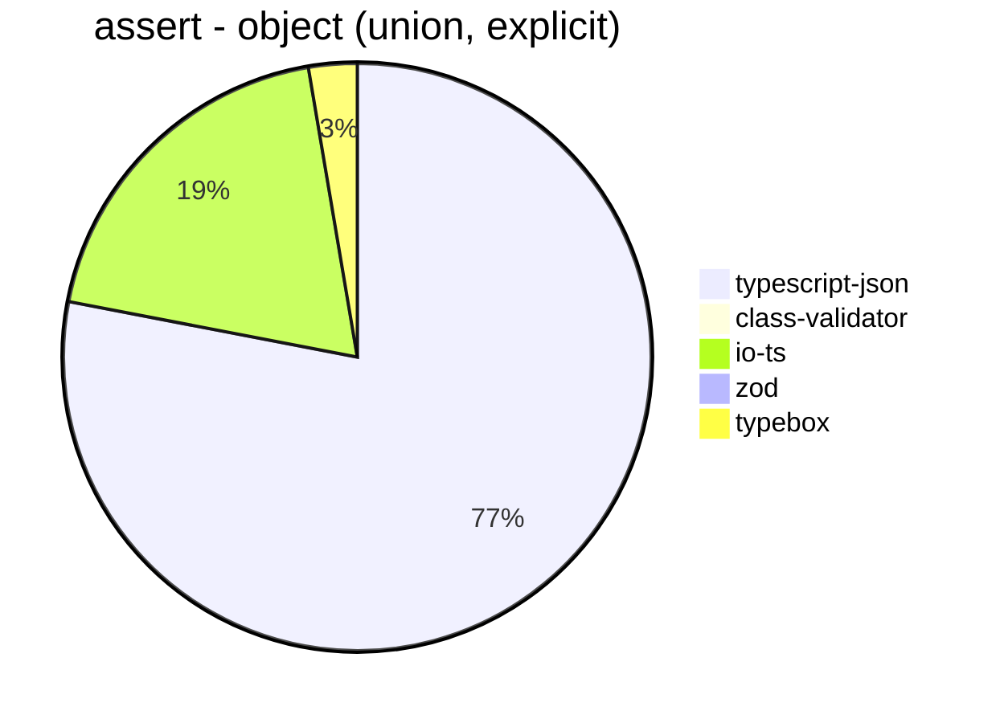
```mermaid
pie title assert - object (union, explicit)
  "typescript-json": 4940.955448201825
  "class-validator": 15.852293920179036
  "io-ts": 1222.6555246053854
  "zod": 34.24023690542292
  "typebox": 168.81918819188192
```

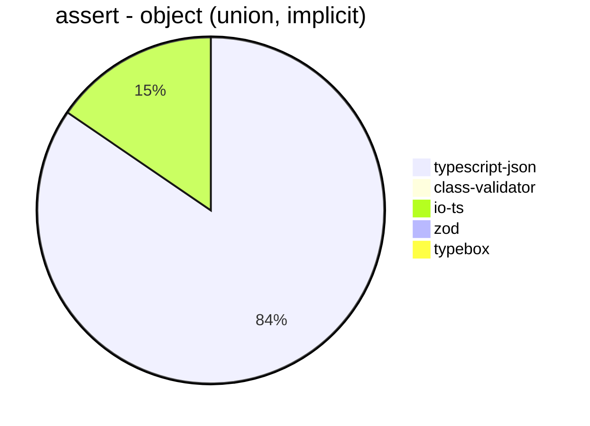
```mermaid
pie title assert - object (union, implicit)
  "typescript-json": 4729.312247149687
  "class-validator": 16.458672454331705
  "io-ts": 863.8005780346822
  "zod": 53.455019556714475
  "typebox": 0
```

```mermaid
pie title assert - array (recursive)
  "typescript-json": 1502.034776174621
  "class-validator": 3.387278885961611
  "io-ts": 173.47509792949077
  "zod": 9.125475285171103
  "typebox": 42.00112002986746
```

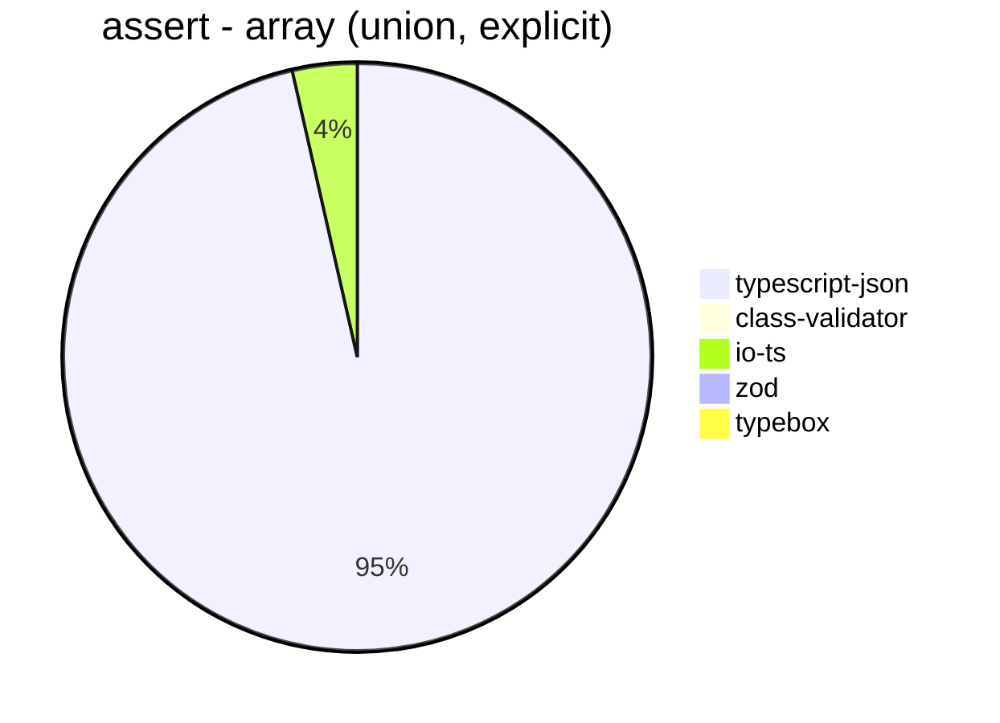
```mermaid
pie title assert - array (union, explicit)
  "typescript-json": 2215.187557182068
  "class-validator": 6.80397204854726
  "io-ts": 81.64766458256713
  "zod": 2.8005974607916357
  "typebox": 22.27998514667657
```

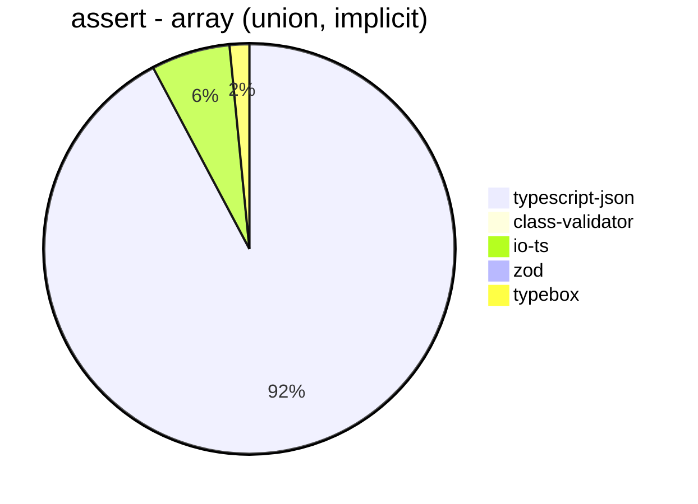
```mermaid
pie title assert - array (union, implicit)
  "typescript-json": 1747.364594692839
  "class-validator": 8.61100711344066
  "io-ts": 117.59207328472611
  "zod": 3.5600524639310476
  "typebox": 29.383886255924168
```

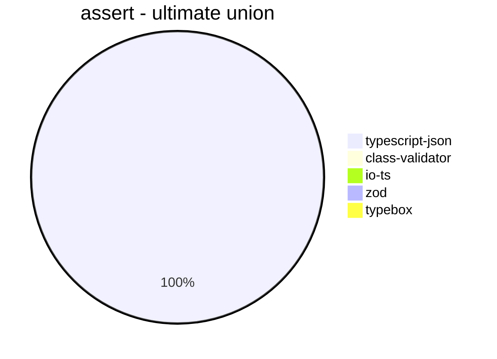
```mermaid
pie title assert - ultimate union
  "typescript-json": 270.74781367124757
  "class-validator": 0
  "io-ts": 0
  "zod": 0
  "typebox": 0
```

## valiadate
 Components | typescript-json | class-validator | io-ts | zod | typebox 
------------|-----------------|-----------------|-------|-----|---------
object (hierarchical) | 16872.401433691757 | 61.60241874527589 | 3686.122153957355 | 416.66666666666663 | 931.3743723265762
object (recursive) | 19587.45631782233 | 38.46153846153846 | 1772.7272727272727 | 71.72439759036145 | 410.6217616580311
object (union, explicit) | 3985.476443499823 | 16.140865737344093 | 1215.6349354778379 | 34.17880913833423 | 176.17069486404833
object (union, implicit) | 4032 | 16.29026286560533 | 784.5984194081971 | 52.485677323969696 | Failed
array (recursive) | 1063.3098852276935 | 3.5882908404154863 | 173.24122886747864 | 8.82132132132132 | 41.98832611560911
array (union, explicit) | 1732.8596802841919 | 6.97503671071953 | 85.95664467483506 | 2.817430503380917 | 22.61590652091971
array (union, implicit) | 1646.5723212644734 | 8.56770348295772 | 115.18614080353852 | 3.7509377344336086 | 28.771531326897595
ultimate union | 169.18646508279338 | Failed | Failed | Failed | Failed

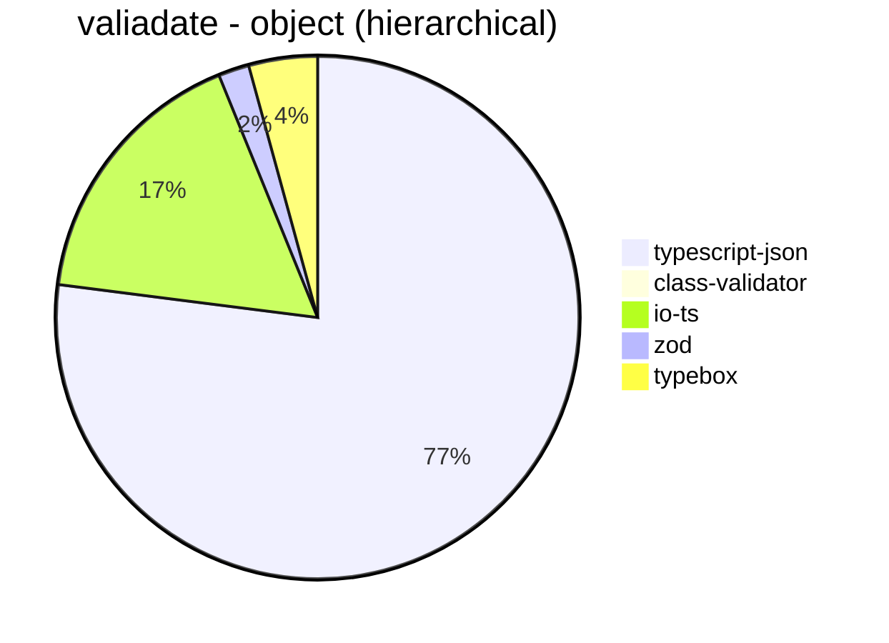
```mermaid
pie title valiadate - object (hierarchical)
  "typescript-json": 16872.401433691757
  "class-validator": 61.60241874527589
  "io-ts": 3686.122153957355
  "zod": 416.66666666666663
  "typebox": 931.3743723265762
```

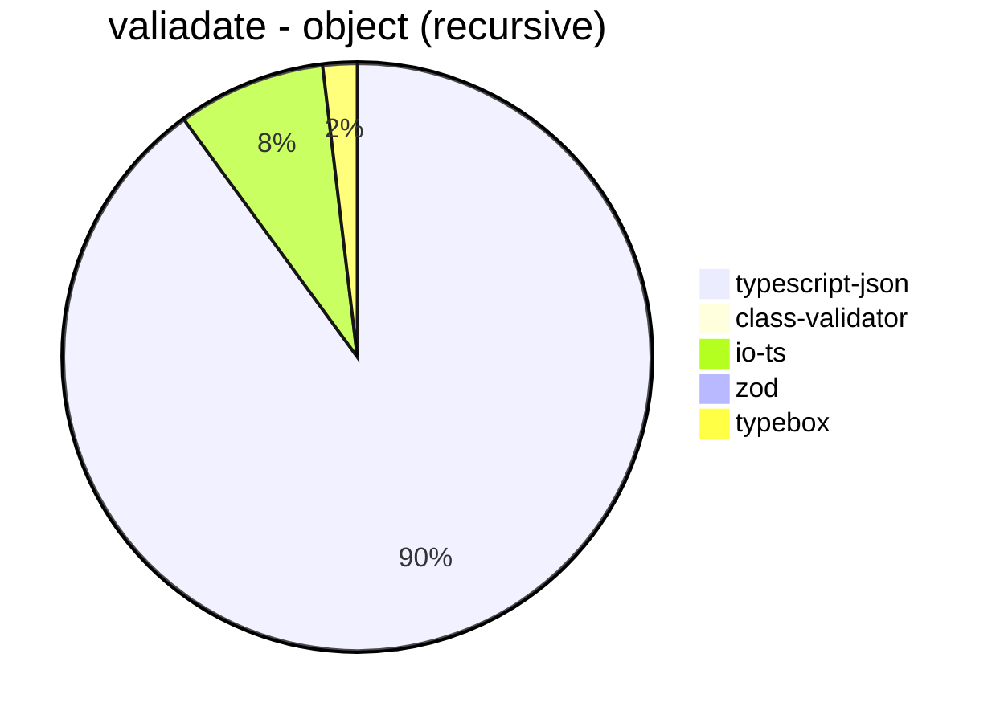
```mermaid
pie title valiadate - object (recursive)
  "typescript-json": 19587.45631782233
  "class-validator": 38.46153846153846
  "io-ts": 1772.7272727272727
  "zod": 71.72439759036145
  "typebox": 410.6217616580311
```

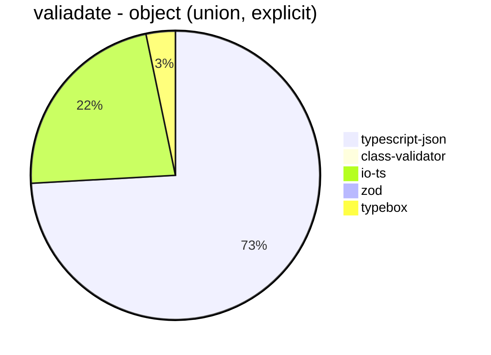
```mermaid
pie title valiadate - object (union, explicit)
  "typescript-json": 3985.476443499823
  "class-validator": 16.140865737344093
  "io-ts": 1215.6349354778379
  "zod": 34.17880913833423
  "typebox": 176.17069486404833
```

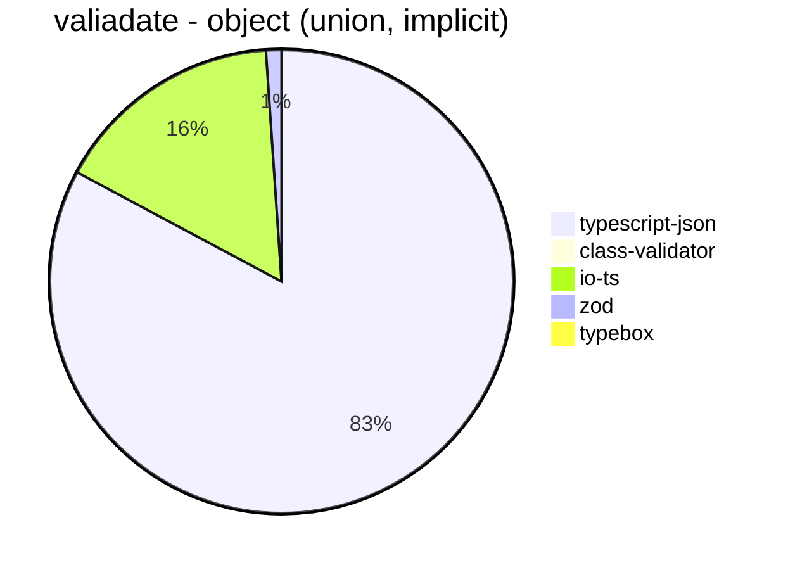
```mermaid
pie title valiadate - object (union, implicit)
  "typescript-json": 4032
  "class-validator": 16.29026286560533
  "io-ts": 784.5984194081971
  "zod": 52.485677323969696
  "typebox": 0
```

```mermaid
pie title valiadate - array (recursive)
  "typescript-json": 1063.3098852276935
  "class-validator": 3.5882908404154863
  "io-ts": 173.24122886747864
  "zod": 8.82132132132132
  "typebox": 41.98832611560911
```

```mermaid
pie title valiadate - array (union, explicit)
  "typescript-json": 1732.8596802841919
  "class-validator": 6.97503671071953
  "io-ts": 85.95664467483506
  "zod": 2.817430503380917
  "typebox": 22.61590652091971
```

```mermaid
pie title valiadate - array (union, implicit)
  "typescript-json": 1646.5723212644734
  "class-validator": 8.56770348295772
  "io-ts": 115.18614080353852
  "zod": 3.7509377344336086
  "typebox": 28.771531326897595
```

```mermaid
pie title valiadate - ultimate union
  "typescript-json": 169.18646508279338
  "class-validator": 0
  "io-ts": 0
  "zod": 0
  "typebox": 0
```

## optimizer
 Components | typescript-json | ajv | typebox 
------------|-----------------|-----|---------
object (hierarchical) | 95166.26326568608 | 4.887762490948588 | 220.14338171008916
object (recursive) | 79568.43679880329 | 9.300595238095237 | 878.1844277000359
object (union) | 13988.087016574586 | 4.929706043454446 | 271.06895293688433
array (hierarchical) | 3491.5130498266108 | 6.487488415199259 | 1054.7066591209204
array (recursive) | 5423.8327023616375 | 9.174311926605505 | 835.9563043880763
array (union) | 3892.7853881278543 | 6.330292310556692 | 265.6563812306007
ultimate union | 640.0927412163367 | 0.9117432530999271 | 21.195652173913047

```mermaid
pie title optimizer - object (hierarchical)
  "typescript-json": 95166.26326568608
  "ajv": 4.887762490948588
  "typebox": 220.14338171008916
```

```mermaid
pie title optimizer - object (recursive)
  "typescript-json": 79568.43679880329
  "ajv": 9.300595238095237
  "typebox": 878.1844277000359
```

```mermaid
pie title optimizer - object (union)
  "typescript-json": 13988.087016574586
  "ajv": 4.929706043454446
  "typebox": 271.06895293688433
```

```mermaid
pie title optimizer - array (hierarchical)
  "typescript-json": 3491.5130498266108
  "ajv": 6.487488415199259
  "typebox": 1054.7066591209204
```

```mermaid
pie title optimizer - array (recursive)
  "typescript-json": 5423.8327023616375
  "ajv": 9.174311926605505
  "typebox": 835.9563043880763
```

```mermaid
pie title optimizer - array (union)
  "typescript-json": 3892.7853881278543
  "ajv": 6.330292310556692
  "typebox": 265.6563812306007
```

```mermaid
pie title optimizer - ultimate union
  "typescript-json": 640.0927412163367
  "ajv": 0.9117432530999271
  "typebox": 21.195652173913047
```

## stringify
 Components | typescript-json | fast-json-stringify | JSON.stringify() 
------------|-----------------|---------------------|------------------
object (simple) | 134052.35602094242 | 30017.343173431735 | 4109.141274238227
object (hierarchical) | 4896.175839885633 | 4460.361356932153 | 1151.9553072625697
object (recursive) | 5271.799462846911 | 924.0269461077844 | 934.4200151630023
object (union) | 2119.874977017834 | 1454.6419098143235 | 472.3720930232558
array (hierarchical) | 94.4910616563298 | 137.02460850111856 | 23.3983286908078
array (recursive) | 252.10391511159898 | 68.30549821730156 | 65.77974870657798
array (union) | 340.1210787011558 | 153.70196813495784 | 158.5411239300335
ultimate union | 130.87426848732045 | 63.869543060981826 | 127.51801885048975

```mermaid
pie title stringify - object (simple)
  "typescript-json": 134052.35602094242
  "fast-json-stringify": 30017.343173431735
  "JSON.stringify()": 4109.141274238227
```

```mermaid
pie title stringify - object (hierarchical)
  "typescript-json": 4896.175839885633
  "fast-json-stringify": 4460.361356932153
  "JSON.stringify()": 1151.9553072625697
```

```mermaid
pie title stringify - object (recursive)
  "typescript-json": 5271.799462846911
  "fast-json-stringify": 924.0269461077844
  "JSON.stringify()": 934.4200151630023
```

```mermaid
pie title stringify - object (union)
  "typescript-json": 2119.874977017834
  "fast-json-stringify": 1454.6419098143235
  "JSON.stringify()": 472.3720930232558
```

```mermaid
pie title stringify - array (hierarchical)
  "typescript-json": 94.4910616563298
  "fast-json-stringify": 137.02460850111856
  "JSON.stringify()": 23.3983286908078
```

```mermaid
pie title stringify - array (recursive)
  "typescript-json": 252.10391511159898
  "fast-json-stringify": 68.30549821730156
  "JSON.stringify()": 65.77974870657798
```

```mermaid
pie title stringify - array (union)
  "typescript-json": 340.1210787011558
  "fast-json-stringify": 153.70196813495784
  "JSON.stringify()": 158.5411239300335
```

```mermaid
pie title stringify - ultimate union
  "typescript-json": 130.87426848732045
  "fast-json-stringify": 63.869543060981826
  "JSON.stringify()": 127.51801885048975
```

