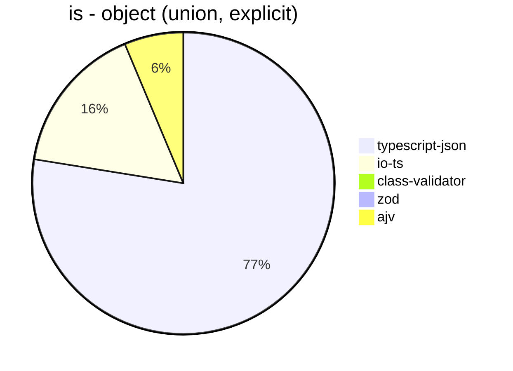
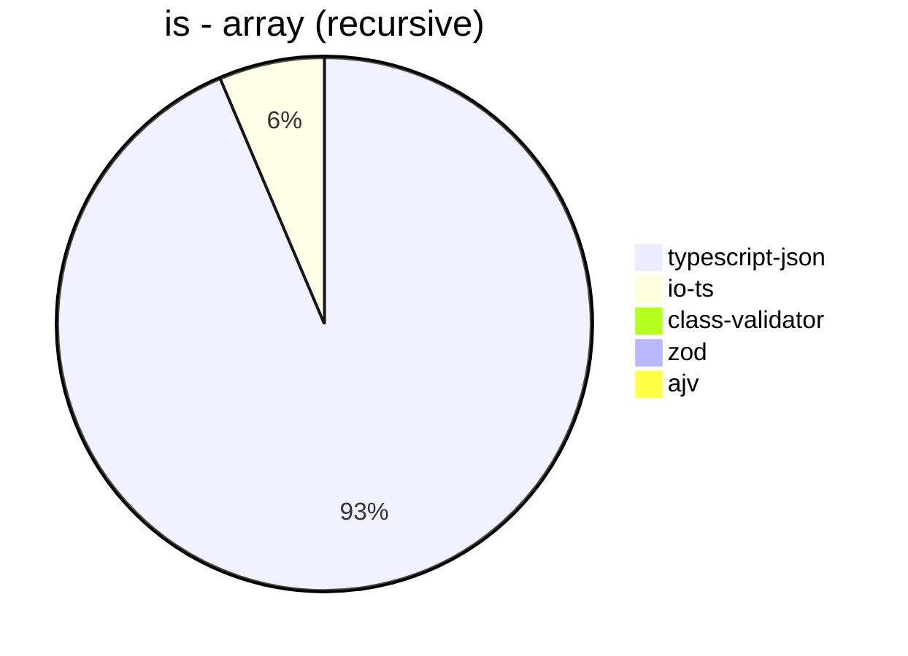
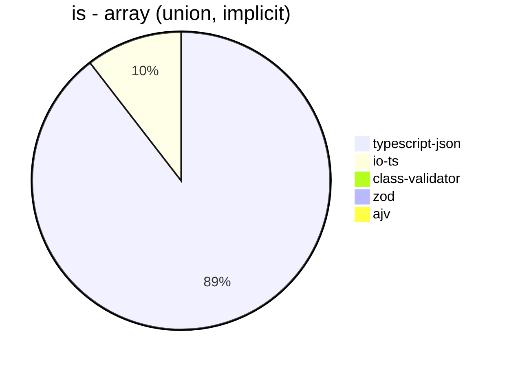
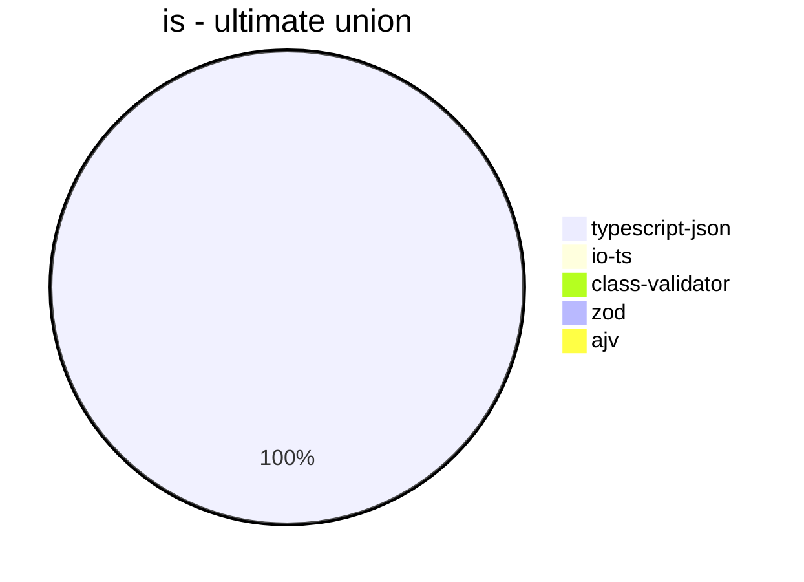
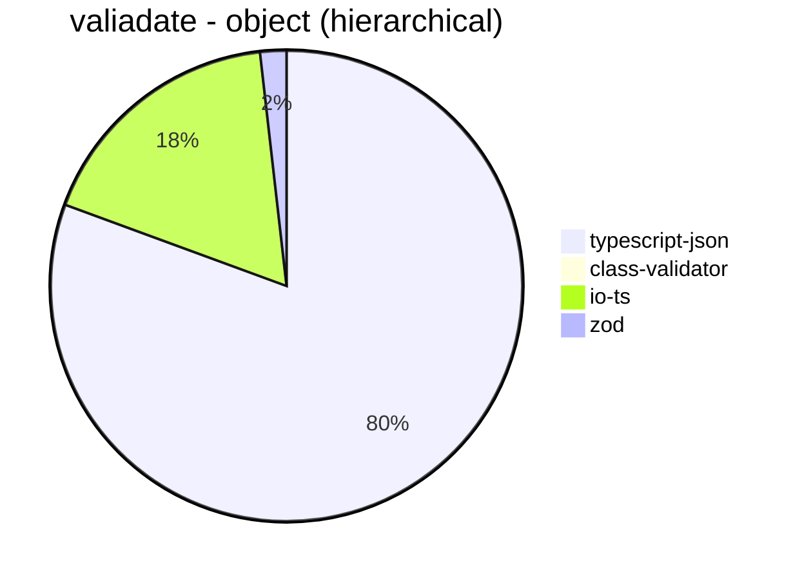
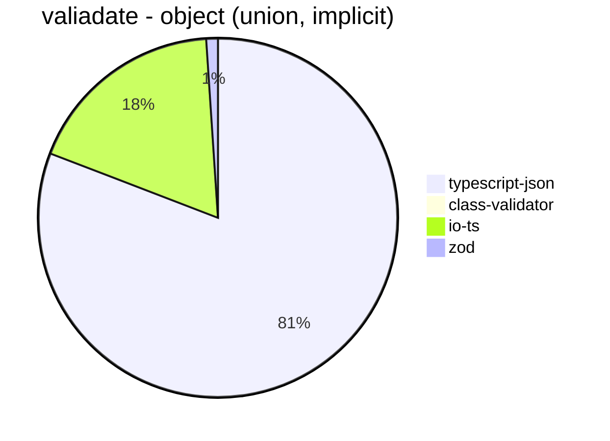
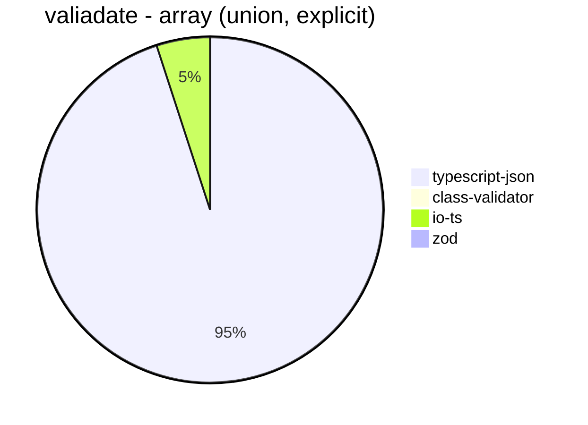
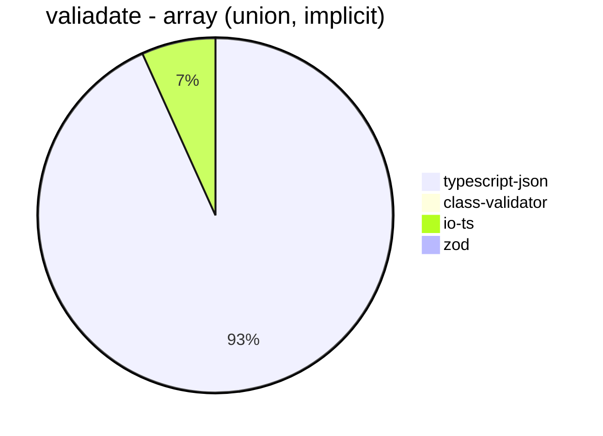
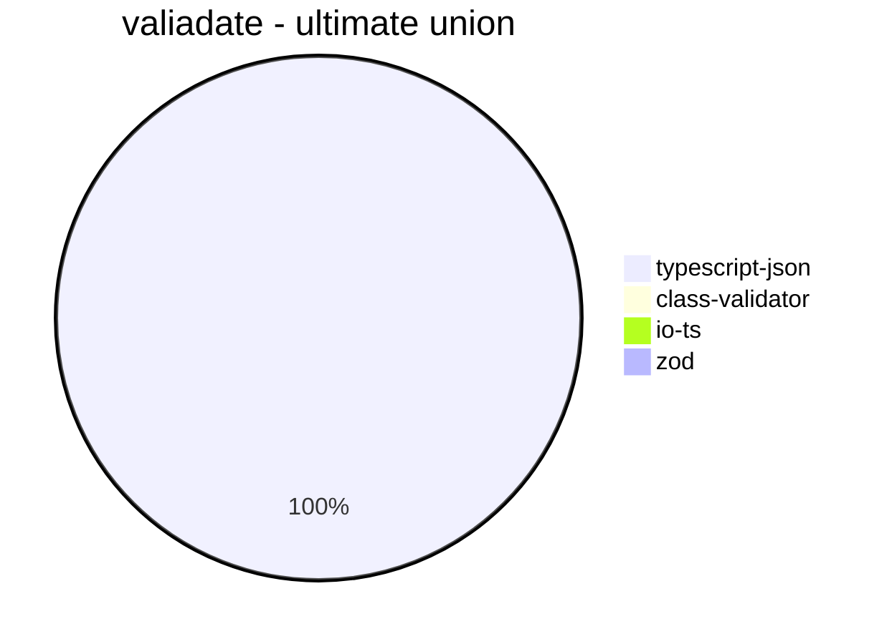
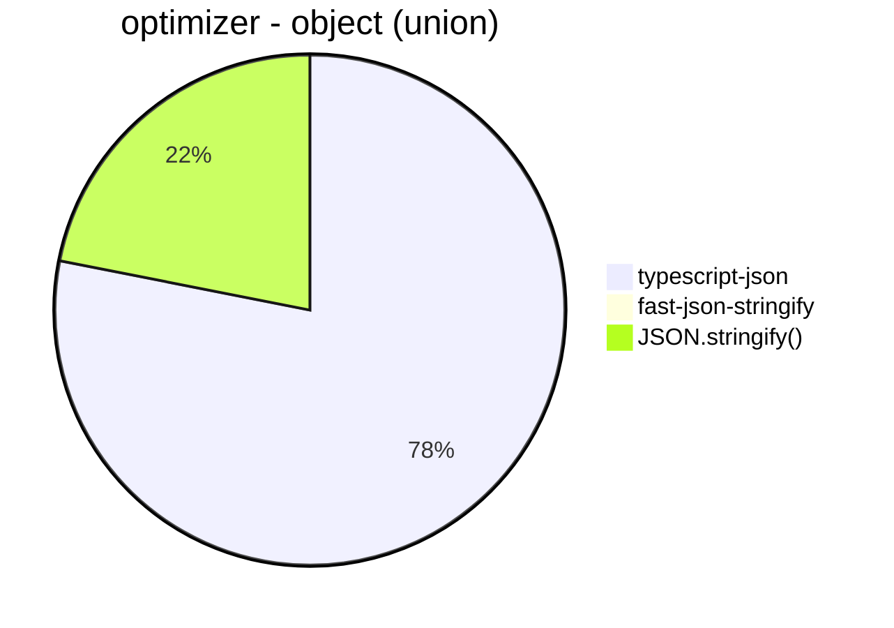

# Benchmark of `typescript-json`
> CPU: AMD Ryzen 7 5800H with Radeon Graphics
> Memory: 64,928 MB
> NodeJS version: v16.6.0
> TypeScript-JSON version: 3.3.11


## is
 Components | typescript-json | io-ts | class-validator | zod | ajv 
------------|-----------------|-------|-----------------|-----|-----
object (hierarchical) | 108502.45409925467 | 8477.989663161647 | 97.8656949505466 | 387.73006134969324 | 85526.92867540028
object (recursive) | 81610.78928312816 | 4836.22641509434 | 66.17647058823529 | 69.36838262139467 | Failed
object (union, explicit) | 14748.950921364714 | 3068.2788051209104 | Failed | 34.44444444444444 | 1203.4353193773484
object (union, implicit) | 14495.641118779513 | 3101.8518518518517 | Failed | 52.6515871507318 | Failed
array (recursive) | 7164.373509447808 | 488.72180451127815 | 5.303584491587418 | 8.775205377147126 | Failed
array (union, explicit) | 4025.7598220904374 | 382.31493446557135 | Failed | 2.81478701444924 | Failed
array (union, implicit) | 3832.5402635431915 | 447.4902759770328 | Failed | 3.5801771245524776 | Failed
ultimate union | 677.6097381040207 | Failed | Failed | Failed | Failed














## valiadate
 Components | typescript-json | class-validator | io-ts | zod 
------------|-----------------|-----------------|-------|-----
object (hierarchical) | 17908.1462237892 | 100.67232837933474 | 3909.240021869874 | 400.07443245254933
object (recursive) | 18673.66307720387 | 65.41040043486139 | 1874.243813015582 | 73.2119391777736
object (union, explicit) | 3883.5341365461845 | Failed | 1213.1057268722466 | 34.28358487050494
object (union, implicit) | 4063.213186017026 | Failed | 910.6852287109023 | 52.69100489273617
array (recursive) | 1108.1998114985863 | 5.568962316688324 | 168.18097533840165 | 8.955223880597014
array (union, explicit) | 1590.6744972415022 | Failed | 83.77344745947916 | 2.638522427440633
array (union, implicit) | 1399.3010851572558 | Failed | 101.2589928057554 | 3.5593855376545522
ultimate union | 127.03983154939463 | Failed | Failed | Failed

















## optimizer
 Components | typescript-json | fast-json-stringify | JSON.stringify() 
------------|-----------------|---------------------|------------------
object (simple) | 111341.84782608696 | 28.33423569752752 | 3940.7569939659897
object (hierarchical) | 4362.072155411655 | 10.877581120943953 | 1127.8265744720613
object (recursive) | 4400.074225273705 | 64.74050294275013 | 901.3268547934965
object (union) | 1865.3149891383055 | 1.0895224260032685 | 523.1277533039647
array (hierarchical) | 79.71014492753623 | 10.037878787878787 | 21.410114433370246
array (recursive) | 236.22186780081518 | 34.32108027006752 | 69.79815129220901
array (union) | 322.77688316335656 | 2.7767493520918176 | 171.9516798791997
ultimate union | 119.05582356995176 | 0.16683350016683351 | 126.7811472415053





```mermaid
pie title optimizer - array (hierarchical)
  "typescript-json": 79.71014492753623
  "fast-json-stringify": 10.037878787878787
  "JSON.stringify()": 21.410114433370246
```


```mermaid
pie title optimizer - array (recursive)
  "typescript-json": 236.22186780081518
  "fast-json-stringify": 34.32108027006752
  "JSON.stringify()": 69.79815129220901
```


```mermaid
pie title optimizer - array (union)
  "typescript-json": 322.77688316335656
  "fast-json-stringify": 2.7767493520918176
  "JSON.stringify()": 171.9516798791997
```


```mermaid
pie title optimizer - ultimate union
  "typescript-json": 119.05582356995176
  "fast-json-stringify": 0.16683350016683351
  "JSON.stringify()": 126.7811472415053
```


## stringify
 Components | typescript-json | fast-json-stringify | JSON.stringify() 
------------|-----------------|---------------------|------------------
object (simple) | 138095.46279491833 | 29966.765140324962 | 4128.219484882419
object (hierarchical) | 4963.382899628253 | 4449.208325920655 | 1160.0897699644659
object (recursive) | 5236.4877328906105 | 906.4910630291627 | 916.7608286252355
object (union) | 2047.9691233229187 | 1468.9012367807852 | 530.1071296638345
array (hierarchical) | 73.34428024083196 | 95.08686717728376 | 19.320081738807357
array (recursive) | 252.21238938053096 | 69.7455230914232 | 67.6328502415459
array (union) | 320.2777283247285 | 157.20604496866937 | 169.85735735735736
ultimate union | 127.37608811511815 | 67.62438682550805 | 129.55692652832303


```mermaid
pie title stringify - object (simple)
  "typescript-json": 138095.46279491833
  "fast-json-stringify": 29966.765140324962
  "JSON.stringify()": 4128.219484882419
```


```mermaid
pie title stringify - object (hierarchical)
  "typescript-json": 4963.382899628253
  "fast-json-stringify": 4449.208325920655
  "JSON.stringify()": 1160.0897699644659
```


```mermaid
pie title stringify - object (recursive)
  "typescript-json": 5236.4877328906105
  "fast-json-stringify": 906.4910630291627
  "JSON.stringify()": 916.7608286252355
```


```mermaid
pie title stringify - object (union)
  "typescript-json": 2047.9691233229187
  "fast-json-stringify": 1468.9012367807852
  "JSON.stringify()": 530.1071296638345
```


```mermaid
pie title stringify - array (hierarchical)
  "typescript-json": 73.34428024083196
  "fast-json-stringify": 95.08686717728376
  "JSON.stringify()": 19.320081738807357
```


```mermaid
pie title stringify - array (recursive)
  "typescript-json": 252.21238938053096
  "fast-json-stringify": 69.7455230914232
  "JSON.stringify()": 67.6328502415459
```


```mermaid
pie title stringify - array (union)
  "typescript-json": 320.2777283247285
  "fast-json-stringify": 157.20604496866937
  "JSON.stringify()": 169.85735735735736
```


```mermaid
pie title stringify - ultimate union
  "typescript-json": 127.37608811511815
  "fast-json-stringify": 67.62438682550805
  "JSON.stringify()": 129.55692652832303
```


