# Benchmark of `typescript-json`
> CPU: AMD Ryzen 7 5800H with Radeon Graphics
> Memory: 64,928 MB
> NodeJS version: v16.6.0
> TypeScript-JSON version: 3.3.17

## is
 Components | typescript-json | typebox | ajv | io-ts | zod | class-validator 
------------|-----------------|---------|-----|-------|-----|-----------------
object (hierarchical) | 111209.18918918919 | 241287.19084533036 | 58614.61090524087 | 9490.680937442334 | 445.01845018450183 | 54.88668555240793
object (recursive) | 81741.00327153763 | 86853.13921747042 | 41178.30582260113 | 5634.6408944476025 | 70.31814895155459 | 35.480349344978166
object (union, explicit) | 16431.882419446014 | 14122.869451208091 | 8109.391867578266 | 3196.9946857247573 | 34.18803418803419 | 78.54162887719934
object (union, implicit) | 16454.728002920776 | Failed | Failed | Failed | 19.472247497725203 | 52.488194696694514
array (recursive) | 6635.728726337071 | 7278.064992614475 | 2181.554629461859 | 520.9285322610126 | 8.511408909815284 | 3.165735567970205
array (union, explicit) | 4098.124098124098 | 2043.4541420118342 | 839.8479913137894 | 373.95504365595394 | 2.834467120181406 | 27.86669177179439
array (union, implicit) | 2154.161236268851 | Failed | Failed | Failed | 1.8702075930428277 | 20.148260786922638
ultimate union | 450.58242146134836 | Failed | Failed | Failed | 0.3597122302158274 | Failed

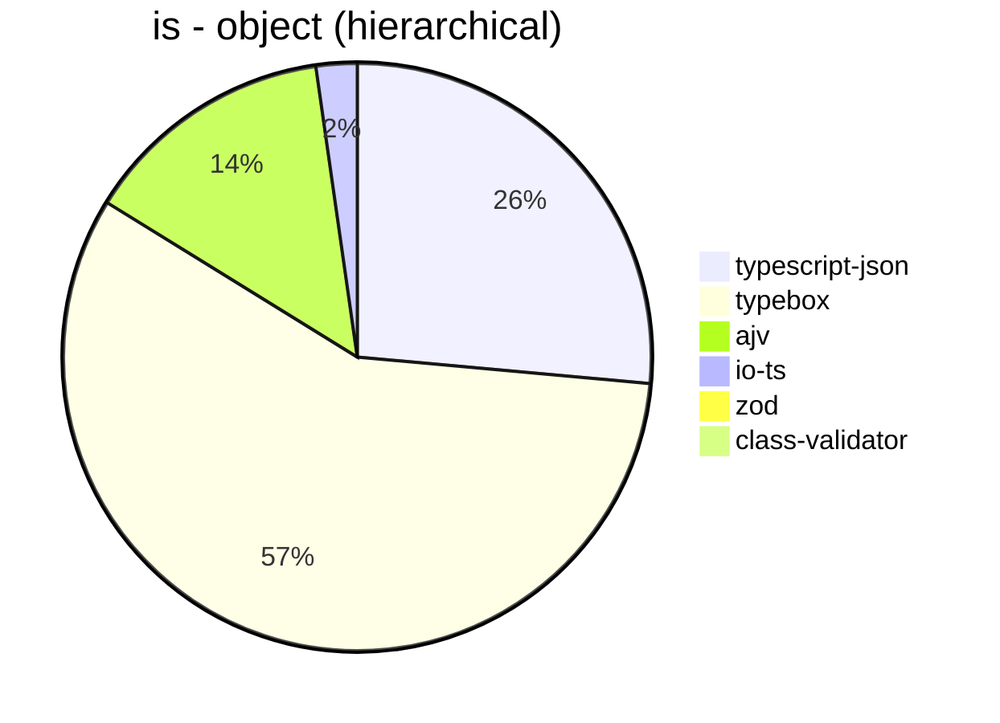
```mermaid
pie title is - object (hierarchical)
  "typescript-json": 111209.18918918919
  "typebox": 241287.19084533036
  "ajv": 58614.61090524087
  "io-ts": 9490.680937442334
  "zod": 445.01845018450183
  "class-validator": 54.88668555240793
```

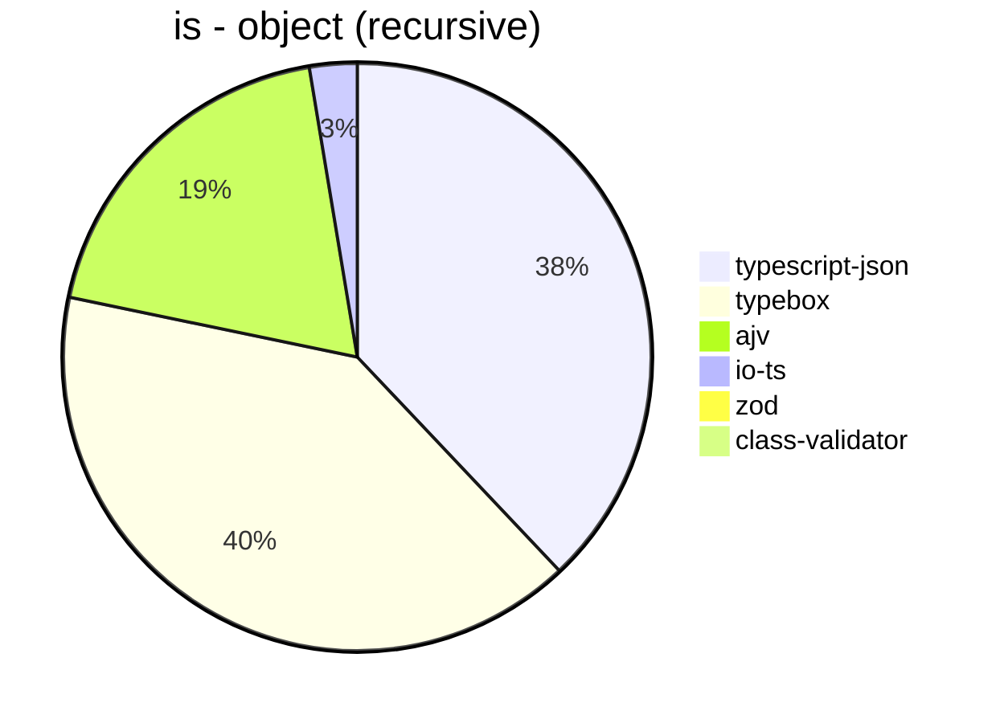
```mermaid
pie title is - object (recursive)
  "typescript-json": 81741.00327153763
  "typebox": 86853.13921747042
  "ajv": 41178.30582260113
  "io-ts": 5634.6408944476025
  "zod": 70.31814895155459
  "class-validator": 35.480349344978166
```

```mermaid
pie title is - object (union, explicit)
  "typescript-json": 16431.882419446014
  "typebox": 14122.869451208091
  "ajv": 8109.391867578266
  "io-ts": 3196.9946857247573
  "zod": 34.18803418803419
  "class-validator": 78.54162887719934
```

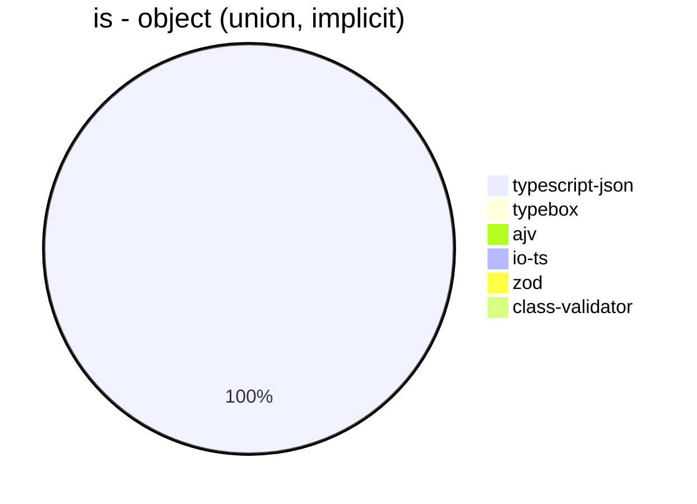
```mermaid
pie title is - object (union, implicit)
  "typescript-json": 16454.728002920776
  "typebox": 0
  "ajv": 0
  "io-ts": 0
  "zod": 19.472247497725203
  "class-validator": 52.488194696694514
```

```mermaid
pie title is - array (recursive)
  "typescript-json": 6635.728726337071
  "typebox": 7278.064992614475
  "ajv": 2181.554629461859
  "io-ts": 520.9285322610126
  "zod": 8.511408909815284
  "class-validator": 3.165735567970205
```

```mermaid
pie title is - array (union, explicit)
  "typescript-json": 4098.124098124098
  "typebox": 2043.4541420118342
  "ajv": 839.8479913137894
  "io-ts": 373.95504365595394
  "zod": 2.834467120181406
  "class-validator": 27.86669177179439
```

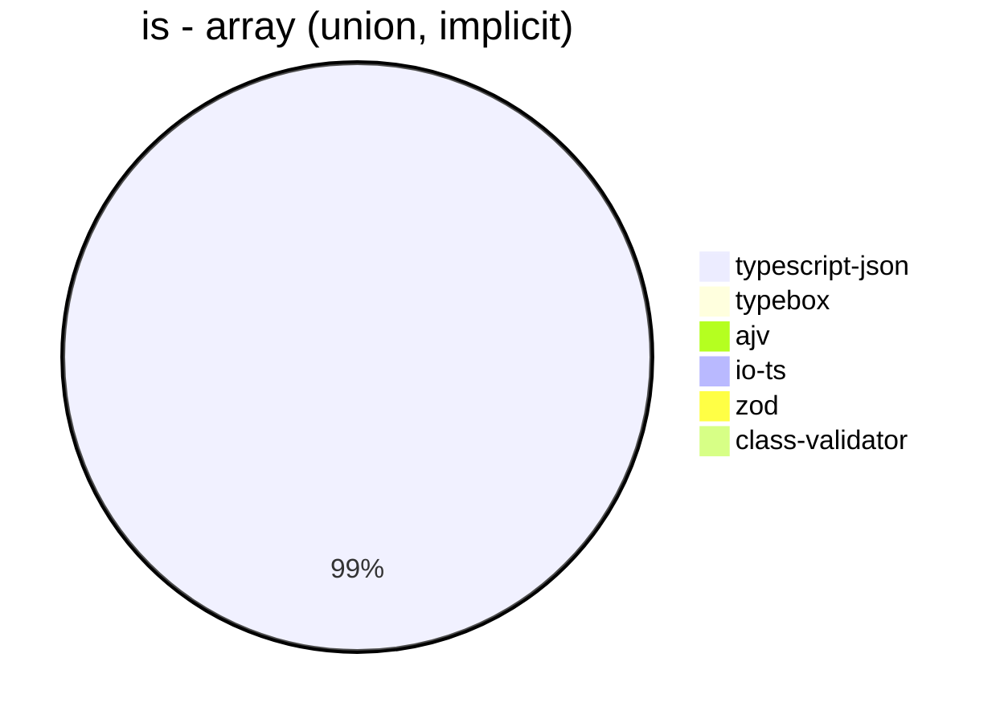
```mermaid
pie title is - array (union, implicit)
  "typescript-json": 2154.161236268851
  "typebox": 0
  "ajv": 0
  "io-ts": 0
  "zod": 1.8702075930428277
  "class-validator": 20.148260786922638
```

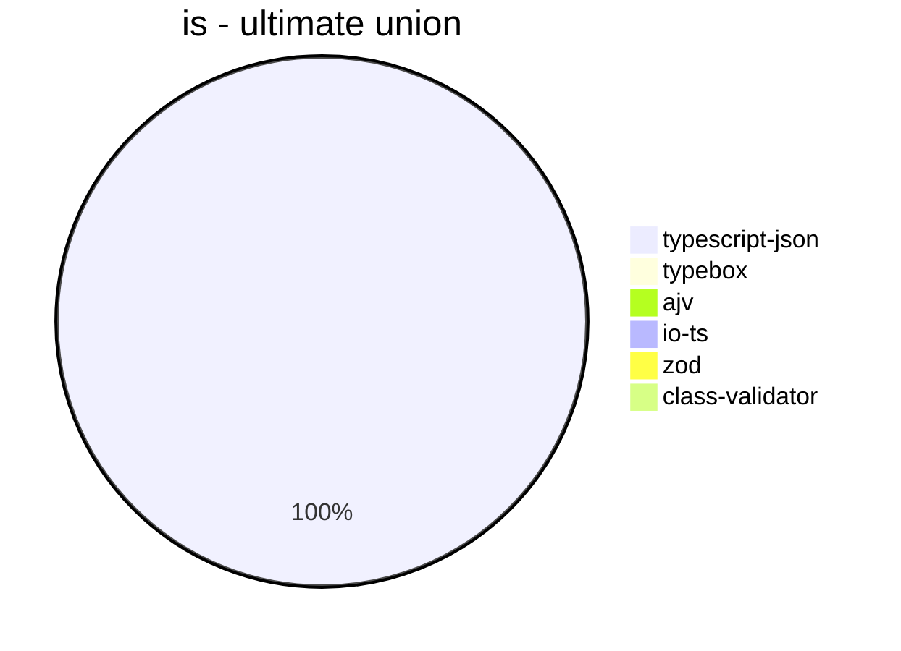
```mermaid
pie title is - ultimate union
  "typescript-json": 450.58242146134836
  "typebox": 0
  "ajv": 0
  "io-ts": 0
  "zod": 0.3597122302158274
  "class-validator": 0
```

## assertType (iterate)
 Components | typescript-json | typebox | io-ts | zod | class-validator 
------------|-----------------|---------|-------|-----|-----------------
object (hierarchical) | 24236.76931587682 | 803.8866108040648 | 3993.7430990062567 | 395.0913452666544 | 56.849440674857874
object (recursive) | 13814.118934695367 | 363.1501291036518 | 1755.3114872164206 | 69.75466861955329 | 36.234590960029884
object (union, explicit) | 3248.105377120173 | 145.77151335311572 | 1174.288800864242 | 34.560480841472575 | 77.87325456498388
object (union, implicit) | 2928.8848263254113 | Failed | Failed | 19.43762974146065 | 52.95723384895359
array (recursive) | 833.9389534883721 | 38.26151560178306 | 179.33976261127594 | 8.945565283593453 | 3.3482142857142856
array (union, explicit) | 1655.2165174492966 | 18.804691863712527 | 78.19905213270142 | 2.9968158831241802 | 24.628689603308892
array (union, implicit) | 657.080451401529 | Failed | Failed | 1.8747656542932134 | 18.69158878504673
ultimate union | 182.53119429590018 | Failed | Failed | 0.35925992455541583 | Failed

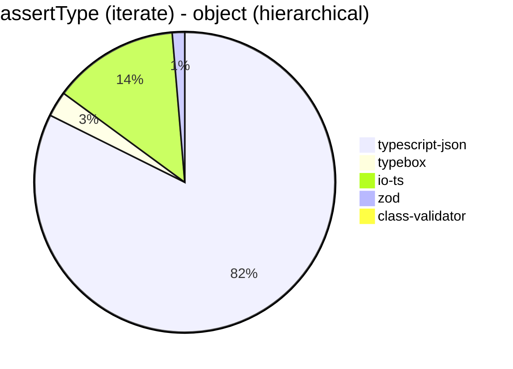
```mermaid
pie title assertType (iterate) - object (hierarchical)
  "typescript-json": 24236.76931587682
  "typebox": 803.8866108040648
  "io-ts": 3993.7430990062567
  "zod": 395.0913452666544
  "class-validator": 56.849440674857874
```

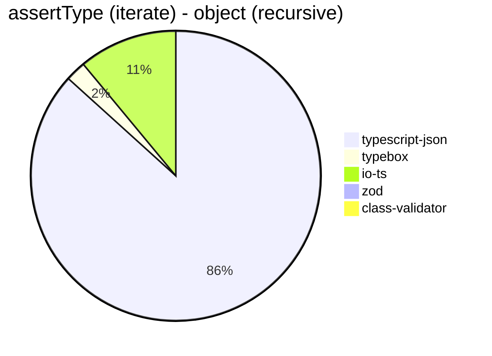
```mermaid
pie title assertType (iterate) - object (recursive)
  "typescript-json": 13814.118934695367
  "typebox": 363.1501291036518
  "io-ts": 1755.3114872164206
  "zod": 69.75466861955329
  "class-validator": 36.234590960029884
```

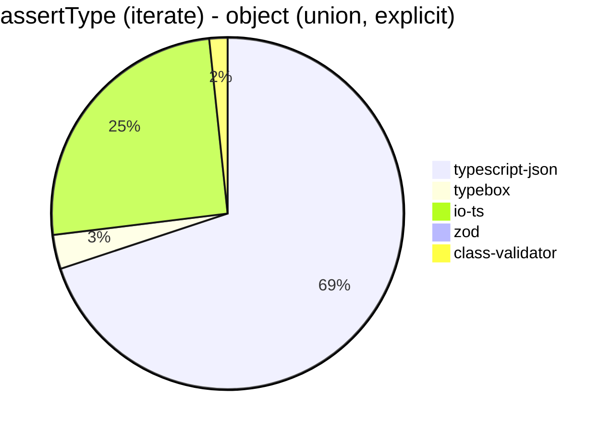
```mermaid
pie title assertType (iterate) - object (union, explicit)
  "typescript-json": 3248.105377120173
  "typebox": 145.77151335311572
  "io-ts": 1174.288800864242
  "zod": 34.560480841472575
  "class-validator": 77.87325456498388
```

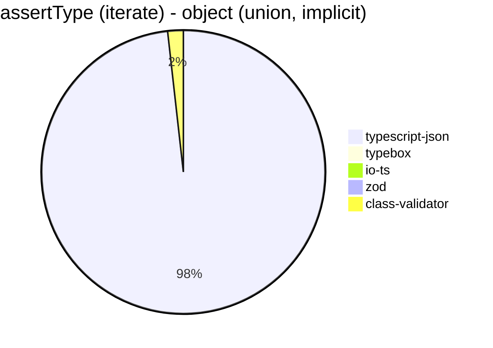
```mermaid
pie title assertType (iterate) - object (union, implicit)
  "typescript-json": 2928.8848263254113
  "typebox": 0
  "io-ts": 0
  "zod": 19.43762974146065
  "class-validator": 52.95723384895359
```

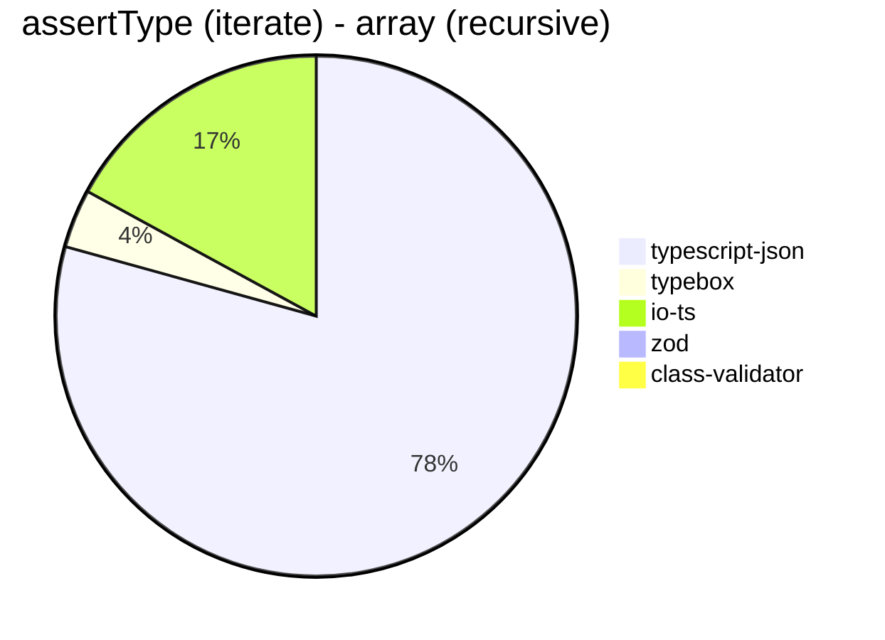
```mermaid
pie title assertType (iterate) - array (recursive)
  "typescript-json": 833.9389534883721
  "typebox": 38.26151560178306
  "io-ts": 179.33976261127594
  "zod": 8.945565283593453
  "class-validator": 3.3482142857142856
```

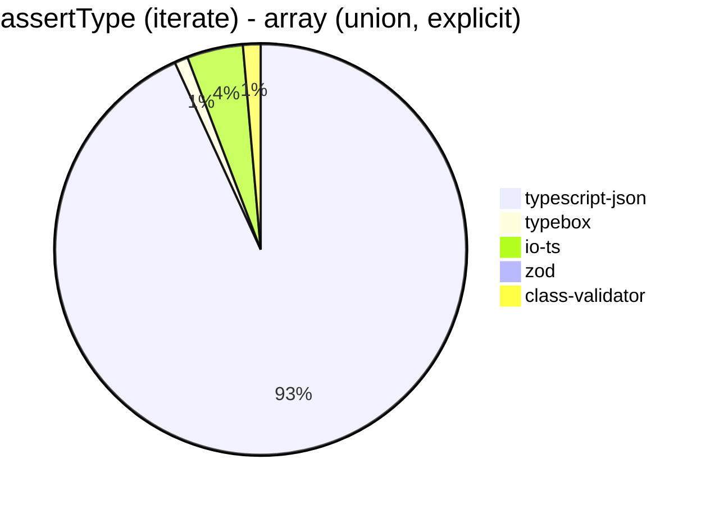
```mermaid
pie title assertType (iterate) - array (union, explicit)
  "typescript-json": 1655.2165174492966
  "typebox": 18.804691863712527
  "io-ts": 78.19905213270142
  "zod": 2.9968158831241802
  "class-validator": 24.628689603308892
```

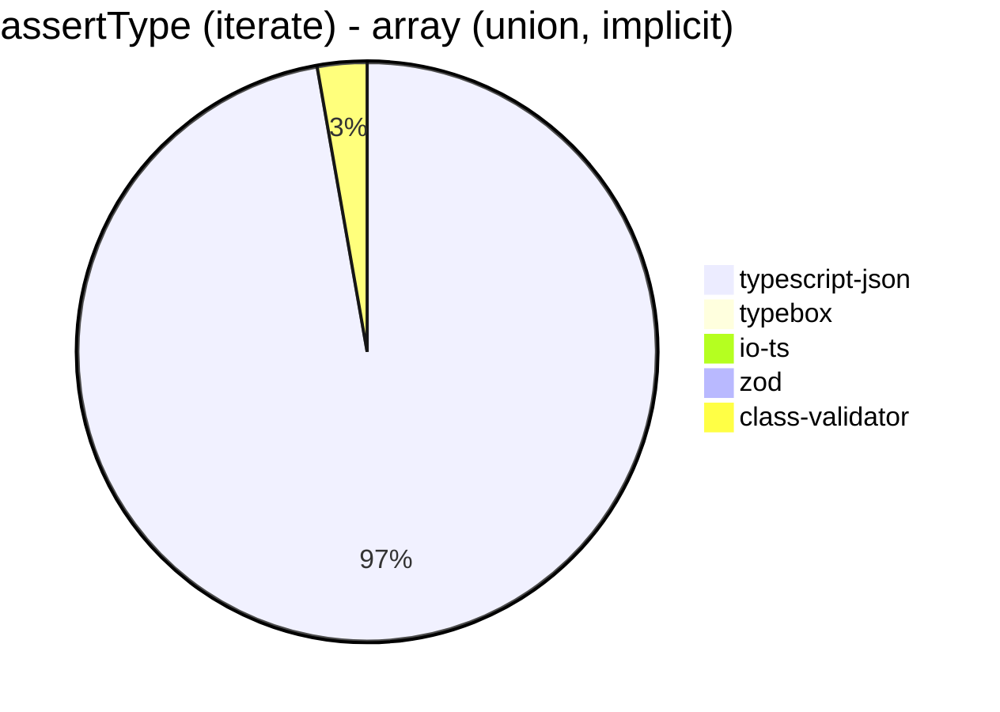
```mermaid
pie title assertType (iterate) - array (union, implicit)
  "typescript-json": 657.080451401529
  "typebox": 0
  "io-ts": 0
  "zod": 1.8747656542932134
  "class-validator": 18.69158878504673
```

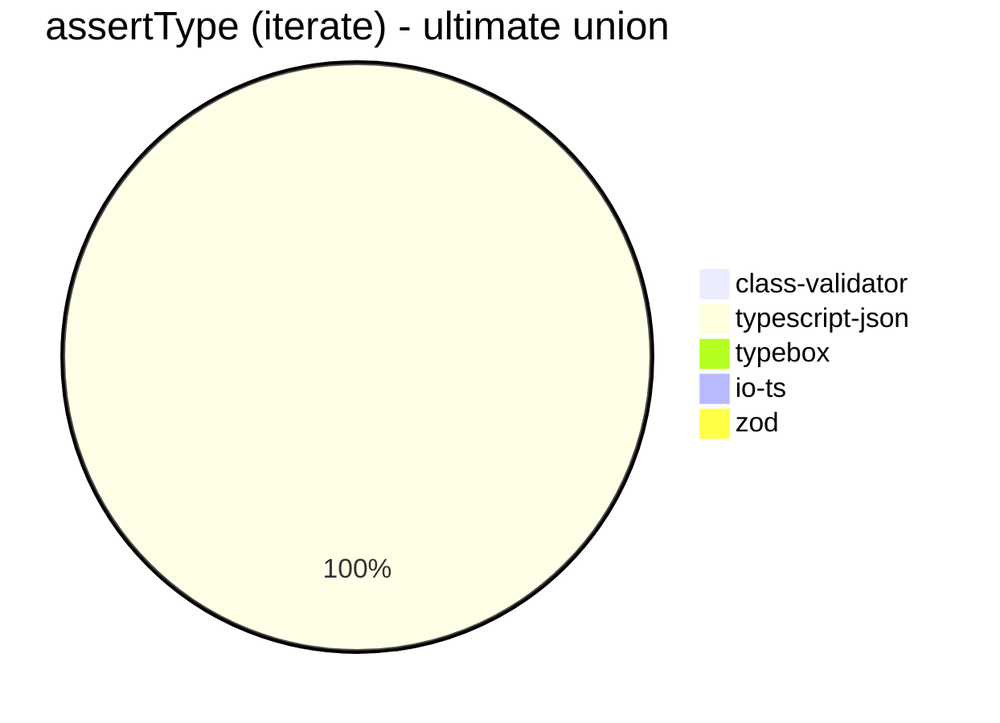
```mermaid
pie title assertType (iterate) - ultimate union
  "class-validator": 0
  "typescript-json": 182.53119429590018
  "typebox": 0
  "io-ts": 0
  "zod": 0.35925992455541583
```

## assertType (throw)
 Components | typescript-json | typebox | io-ts | zod | class-validator 
------------|-----------------|---------|-------|-----|-----------------
object (hierarchical) | 108.26521344232516 | 6.517690875232774 | 32.16042376087779 | 3.734129947722181 | 0.5580357142857143
object (recursive) | 21.33429759537154 | Failed | Failed | 0.18053800324968408 | 0.5313496280552603
object (union, explicit) | 23.128995863106432 | 1.1278195488721805 | 9.42684766214178 | 0.36456434560699963 | 0.7418397626112759
object (union, implicit) | 17.697500456121148 | Failed | Failed | 0.18198362147406733 | 0.552689756816507
array (recursive) | 5.666240175470663 | 0.35932446999640677 | 1.4823049842505094 | 0.1621271076523995 | 0.13022528975126968
array (union, explicit) | 3.8517975055025677 | 0.17385257301808069 | 0.5491488193300385 | 0.1142334932602239 | 0.35379444542720684
array (union, implicit) | 1.6375545851528384 | Failed | Failed | 0.10023053021950486 | 0.1812250815512867
ultimate union | 2.1711597611724263 | Failed | Failed | 0.025422005287777102 | Failed

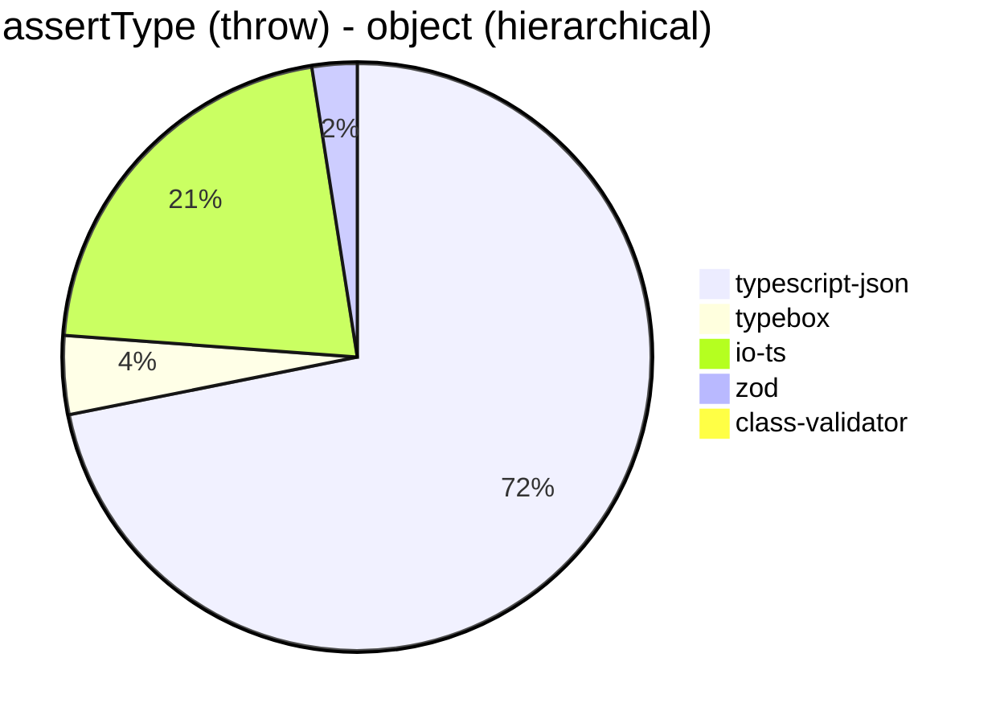
```mermaid
pie title assertType (throw) - object (hierarchical)
  "typescript-json": 108.26521344232516
  "typebox": 6.517690875232774
  "io-ts": 32.16042376087779
  "zod": 3.734129947722181
  "class-validator": 0.5580357142857143
```

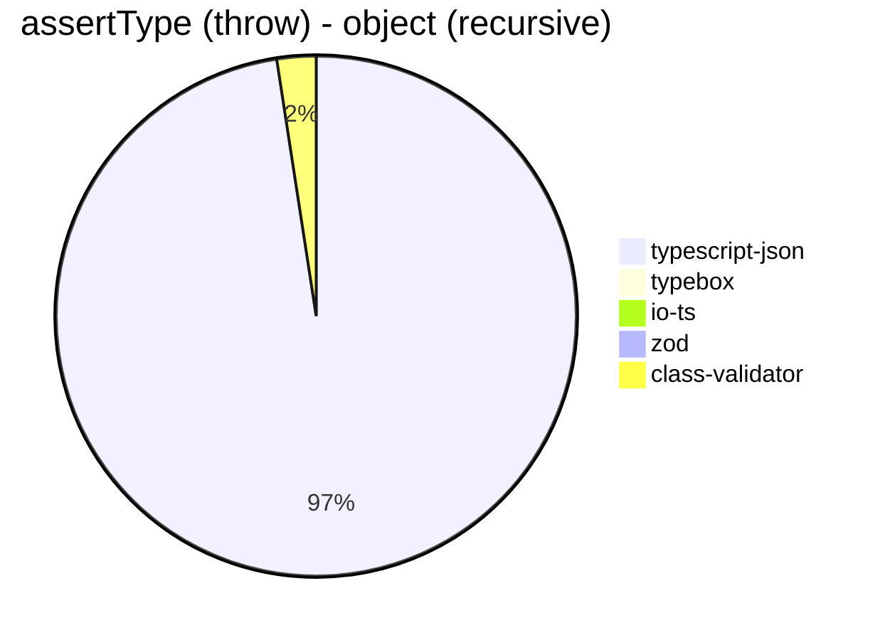
```mermaid
pie title assertType (throw) - object (recursive)
  "typescript-json": 21.33429759537154
  "typebox": 0
  "io-ts": 0
  "zod": 0.18053800324968408
  "class-validator": 0.5313496280552603
```

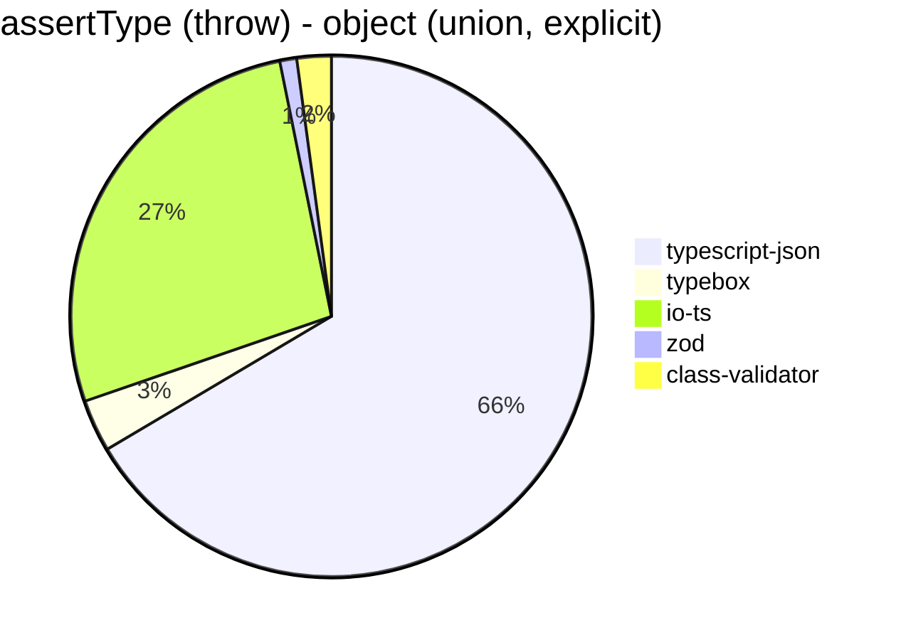
```mermaid
pie title assertType (throw) - object (union, explicit)
  "typescript-json": 23.128995863106432
  "typebox": 1.1278195488721805
  "io-ts": 9.42684766214178
  "zod": 0.36456434560699963
  "class-validator": 0.7418397626112759
```

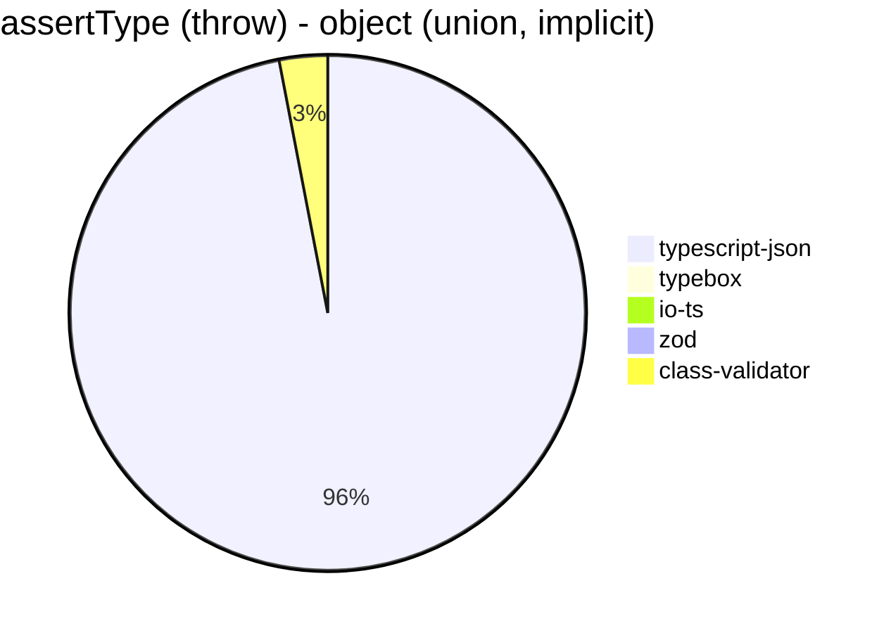
```mermaid
pie title assertType (throw) - object (union, implicit)
  "typescript-json": 17.697500456121148
  "typebox": 0
  "io-ts": 0
  "zod": 0.18198362147406733
  "class-validator": 0.552689756816507
```

```mermaid
pie title assertType (throw) - array (recursive)
  "typescript-json": 5.666240175470663
  "typebox": 0.35932446999640677
  "io-ts": 1.4823049842505094
  "zod": 0.1621271076523995
  "class-validator": 0.13022528975126968
```

```mermaid
pie title assertType (throw) - array (union, explicit)
  "typescript-json": 3.8517975055025677
  "typebox": 0.17385257301808069
  "io-ts": 0.5491488193300385
  "zod": 0.1142334932602239
  "class-validator": 0.35379444542720684
```

```mermaid
pie title assertType (throw) - array (union, implicit)
  "typescript-json": 1.6375545851528384
  "typebox": 0
  "io-ts": 0
  "zod": 0.10023053021950486
  "class-validator": 0.1812250815512867
```

```mermaid
pie title assertType (throw) - ultimate union
  "class-validator": 0
  "typescript-json": 2.1711597611724263
  "typebox": 0
  "io-ts": 0
  "zod": 0.025422005287777102
```

## validate
 Components | typescript-json | typebox | io-ts | zod | class-validator 
------------|-----------------|---------|-------|-----|-----------------
object (hierarchical) | 22243.928959768033 | 830.5337812616649 | 3635.6363636363635 | 388.2803943044907 | 54.717324122886744
object (recursive) | 7479.14802219438 | 357.06235912847484 | 1676.4016585541735 | 68.63661866467177 | 34.04791929382093
object (union, explicit) | 2531.2169312169312 | 131.80147058823528 | 1111.703104905383 | 33.20768264225453 | 78.56093979441997
object (union, implicit) | 1989.711556127136 | 130.5157326382424 | 315.5538977993286 | 18.41517857142857 | 53.074670571010245
array (recursive) | 500.6307442782483 | 38.91419893697798 | 175.21209885651052 | 8.874622356495468 | 3.162202380952381
array (union, explicit) | 1021.0142410559222 | 18.274302938960062 | 77.96355438662408 | 2.8137310073157002 | 27.483751160631385
array (union, implicit) | 650.3471604059106 | 12.837455163299982 | 57.949200376293504 | 1.8789928598271326 | 19.39936578996456
ultimate union | 134.59833303777265 | Failed | Failed | 0.35211267605633806 | Failed

```mermaid
pie title validate - object (hierarchical)
  "typescript-json": 22243.928959768033
  "typebox": 830.5337812616649
  "io-ts": 3635.6363636363635
  "zod": 388.2803943044907
  "class-validator": 54.717324122886744
```

```mermaid
pie title validate - object (recursive)
  "typescript-json": 7479.14802219438
  "typebox": 357.06235912847484
  "io-ts": 1676.4016585541735
  "zod": 68.63661866467177
  "class-validator": 34.04791929382093
```

```mermaid
pie title validate - object (union, explicit)
  "typescript-json": 2531.2169312169312
  "typebox": 131.80147058823528
  "io-ts": 1111.703104905383
  "zod": 33.20768264225453
  "class-validator": 78.56093979441997
```

```mermaid
pie title validate - object (union, implicit)
  "typescript-json": 1989.711556127136
  "typebox": 130.5157326382424
  "io-ts": 315.5538977993286
  "zod": 18.41517857142857
  "class-validator": 53.074670571010245
```

```mermaid
pie title validate - array (recursive)
  "typescript-json": 500.6307442782483
  "typebox": 38.91419893697798
  "io-ts": 175.21209885651052
  "zod": 8.874622356495468
  "class-validator": 3.162202380952381
```

```mermaid
pie title validate - array (union, explicit)
  "typescript-json": 1021.0142410559222
  "typebox": 18.274302938960062
  "io-ts": 77.96355438662408
  "zod": 2.8137310073157002
  "class-validator": 27.483751160631385
```

```mermaid
pie title validate - array (union, implicit)
  "typescript-json": 650.3471604059106
  "typebox": 12.837455163299982
  "io-ts": 57.949200376293504
  "zod": 1.8789928598271326
  "class-validator": 19.39936578996456
```

```mermaid
pie title validate - ultimate union
  "typescript-json": 134.59833303777265
  "typebox": 0
  "io-ts": 0
  "zod": 0.35211267605633806
  "class-validator": 0
```

## equals
 Components | typescript-json | typebox 
------------|-----------------|---------
object (hierarchical) | 7705.382947976879 | 19122.427062824416
object (recursive) | 5859.681945743686 | 11302.558398220244
object (union, explicit) | 2243.746576593025 | 3446.324599708879
object (union, implicit) | 1777.88001472212 | 2351.8085297822563
array (recursive) | 484.8878175412572 | 1131.8357576873505
array (union, explicit) | 384.01024515184776 | 760.4011887072808
array (union, implicit) | 248.1944689096354 | 469.40946976414256
ultimate union | 217.21758082092262 | 213.10582682882554

```mermaid
pie title equals - object (hierarchical)
  "typescript-json": 7705.382947976879
  "typebox": 19122.427062824416
```

```mermaid
pie title equals - object (recursive)
  "typescript-json": 5859.681945743686
  "typebox": 11302.558398220244
```

```mermaid
pie title equals - object (union, explicit)
  "typescript-json": 2243.746576593025
  "typebox": 3446.324599708879
```

```mermaid
pie title equals - object (union, implicit)
  "typescript-json": 1777.88001472212
  "typebox": 2351.8085297822563
```

```mermaid
pie title equals - array (recursive)
  "typescript-json": 484.8878175412572
  "typebox": 1131.8357576873505
```

```mermaid
pie title equals - array (union, explicit)
  "typescript-json": 384.01024515184776
  "typebox": 760.4011887072808
```

```mermaid
pie title equals - array (union, implicit)
  "typescript-json": 248.1944689096354
  "typebox": 469.40946976414256
```

```mermaid
pie title equals - ultimate union
  "typescript-json": 217.21758082092262
  "typebox": 213.10582682882554
```

## assertEquals (iterate)
 Components | typescript-json | typebox 
------------|-----------------|---------
object (hierarchical) | 4977.994227994228 | 688.2122174481599
object (recursive) | 4639.094955489614 | 321.8540580789278
object (union, explicit) | 1677.115987460815 | 106.61764705882352
object (union, implicit) | 1030.6816094065773 | 76.28398791540785
array (recursive) | 258.6081913736861 | 33.18250377073906
array (union, explicit) | 397.4711379879055 | 15.963511972633981
array (union, implicit) | 255.7312955393638 | 7.022205352059214
ultimate union | 208.7421944692239 | 3.9525691699604746

```mermaid
pie title assertEquals (iterate) - object (hierarchical)
  "typescript-json": 4977.994227994228
  "typebox": 688.2122174481599
```

```mermaid
pie title assertEquals (iterate) - object (recursive)
  "typescript-json": 4639.094955489614
  "typebox": 321.8540580789278
```

```mermaid
pie title assertEquals (iterate) - object (union, explicit)
  "typescript-json": 1677.115987460815
  "typebox": 106.61764705882352
```

```mermaid
pie title assertEquals (iterate) - object (union, implicit)
  "typescript-json": 1030.6816094065773
  "typebox": 76.28398791540785
```

```mermaid
pie title assertEquals (iterate) - array (recursive)
  "typescript-json": 258.6081913736861
  "typebox": 33.18250377073906
```

```mermaid
pie title assertEquals (iterate) - array (union, explicit)
  "typescript-json": 397.4711379879055
  "typebox": 15.963511972633981
```

```mermaid
pie title assertEquals (iterate) - array (union, implicit)
  "typescript-json": 255.7312955393638
  "typebox": 7.022205352059214
```

```mermaid
pie title assertEquals (iterate) - ultimate union
  "typescript-json": 208.7421944692239
  "typebox": 3.9525691699604746
```

## assertEquals (throw)
 Components | typescript-json | typebox 
------------|-----------------|---------
object (hierarchical) | 43.88828436706565 | 6.188569348380051
object (recursive) | 31.013476093778845 | 3.0097817908201656
object (union, explicit) | 13.670792536486235 | 1.1072153533862337
object (union, implicit) | 9.787626962142198 | 0.7462686567164178
array (recursive) | 2.5916327286190297 | 0.35945363048166784
array (union, explicit) | 1.9949220166848023 | 0.17325017325017325
array (union, implicit) | 0.9082652134423251 | 0.14954389113204725
ultimate union | 1.6369588941433248 | 0.1340662287169862

```mermaid
pie title assertEquals (throw) - object (hierarchical)
  "typescript-json": 43.88828436706565
  "typebox": 6.188569348380051
```

```mermaid
pie title assertEquals (throw) - object (recursive)
  "typescript-json": 31.013476093778845
  "typebox": 3.0097817908201656
```

```mermaid
pie title assertEquals (throw) - object (union, explicit)
  "typescript-json": 13.670792536486235
  "typebox": 1.1072153533862337
```

```mermaid
pie title assertEquals (throw) - object (union, implicit)
  "typescript-json": 9.787626962142198
  "typebox": 0.7462686567164178
```

```mermaid
pie title assertEquals (throw) - array (recursive)
  "typescript-json": 2.5916327286190297
  "typebox": 0.35945363048166784
```

```mermaid
pie title assertEquals (throw) - array (union, explicit)
  "typescript-json": 1.9949220166848023
  "typebox": 0.17325017325017325
```

```mermaid
pie title assertEquals (throw) - array (union, implicit)
  "typescript-json": 0.9082652134423251
  "typebox": 0.14954389113204725
```

```mermaid
pie title assertEquals (throw) - ultimate union
  "typescript-json": 1.6369588941433248
  "typebox": 0.1340662287169862
```

## validateEquals
 Components | typescript-json | typebox 
------------|-----------------|---------
object (hierarchical) | 3639.8350663320184 | 629.8557158712542
object (recursive) | 1826.4178293169052 | 296.1783439490446
object (union, explicit) | 856.1215370866846 | 96.65287702143664
object (union, implicit) | 612.6368695027822 | 71.17370892018779
array (recursive) | 152.91349981903727 | 29.755178907721284
array (union, explicit) | 235.76370409792443 | 14.533786334465836
array (union, implicit) | 163.72839937161808 | 6.411465208372619
ultimate union | 103.12171168011224 | 3.9414414414414414

```mermaid
pie title validateEquals - object (hierarchical)
  "typescript-json": 3639.8350663320184
  "typebox": 629.8557158712542
```

```mermaid
pie title validateEquals - object (recursive)
  "typescript-json": 1826.4178293169052
  "typebox": 296.1783439490446
```

```mermaid
pie title validateEquals - object (union, explicit)
  "typescript-json": 856.1215370866846
  "typebox": 96.65287702143664
```

```mermaid
pie title validateEquals - object (union, implicit)
  "typescript-json": 612.6368695027822
  "typebox": 71.17370892018779
```

```mermaid
pie title validateEquals - array (recursive)
  "typescript-json": 152.91349981903727
  "typebox": 29.755178907721284
```

```mermaid
pie title validateEquals - array (union, explicit)
  "typescript-json": 235.76370409792443
  "typebox": 14.533786334465836
```

```mermaid
pie title validateEquals - array (union, implicit)
  "typescript-json": 163.72839937161808
  "typebox": 6.411465208372619
```

```mermaid
pie title validateEquals - ultimate union
  "typescript-json": 103.12171168011224
  "typebox": 3.9414414414414414
```

## optimizer
 Components | typescript-json | typebox | ajv 
------------|-----------------|---------|-----
object (hierarchical) | 84118.92945763913 | 191.5090841675936 | 4.910876682429975
object (recursive) | 69027.63448784083 | 779.4379224475276 | 8.779952441924273
object (union) | 16245.101596516692 | 94.4637310433035 | 4.154624277456648
array (hierarchical) | 4147.7913106707865 | 967.5483023822921 | 6.185191922867019
array (recursive) | 6557.588805166846 | 798.076923076923 | 8.757220048444196
array (union) | 3716.6818596171374 | 236.70509483079212 | 6.088560885608856
ultimate union | 545.6866678825461 | 11.386593204775023 | 0.9035056017347308

```mermaid
pie title optimizer - object (hierarchical)
  "typescript-json": 84118.92945763913
  "typebox": 191.5090841675936
  "ajv": 4.910876682429975
```

```mermaid
pie title optimizer - object (recursive)
  "typescript-json": 69027.63448784083
  "typebox": 779.4379224475276
  "ajv": 8.779952441924273
```

```mermaid
pie title optimizer - object (union)
  "typescript-json": 16245.101596516692
  "typebox": 94.4637310433035
  "ajv": 4.154624277456648
```

```mermaid
pie title optimizer - array (hierarchical)
  "typescript-json": 4147.7913106707865
  "typebox": 967.5483023822921
  "ajv": 6.185191922867019
```

```mermaid
pie title optimizer - array (recursive)
  "typescript-json": 6557.588805166846
  "typebox": 798.076923076923
  "ajv": 8.757220048444196
```

```mermaid
pie title optimizer - array (union)
  "typescript-json": 3716.6818596171374
  "typebox": 236.70509483079212
  "ajv": 6.088560885608856
```

```mermaid
pie title optimizer - ultimate union
  "typescript-json": 545.6866678825461
  "typebox": 11.386593204775023
  "ajv": 0.9035056017347308
```

## stringify
 Components | TSON.stringify() | TSON.assertStringify() | TSON.isStringify() | JSON.stringify() | fast-json-stringify 
------------|------------------|------------------------|--------------------|------------------|---------------------
object (simple) | 117252.7570259694 | 24510.275874837993 | 33094.24368984928 | 4421.610563511252 | 26889.61729270021
object (hierarchical) | 4540.6828913912095 | 3594.324176823722 | 4104.363636363636 | 1128.4168042560998 | 4395.029673590504
object (recursive) | 5054.2566482241655 | 4505.437788018433 | 4738.759970993474 | 850.424197713021 | 891.6256157635469
object (union) | 1278.8550323176362 | 960.146252285192 | 1165.0867465569665 | 345.44793748864254 | 1217.2407508656825
array (hierarchical) | 99.55156950672645 | 87.61384335154827 | 98.18050801657358 | 27.72573997751967 | 146.09617846041323
array (recursive) | 233.77827215424546 | 204.46364290856732 | 213.78000345363495 | 70.73305162594158 | 69.9724517906336
array (union) | 312.2500908760451 | 271.43882310728384 | 283.2672196177425 | 157.70081061164333 | 151.17788907438324

```mermaid
pie title stringify - object (simple)
  "TSON.stringify()": 117252.7570259694
  "TSON.assertStringify()": 24510.275874837993
  "TSON.isStringify()": 33094.24368984928
  "JSON.stringify()": 4421.610563511252
  "fast-json-stringify": 26889.61729270021
```

```mermaid
pie title stringify - object (hierarchical)
  "TSON.stringify()": 4540.6828913912095
  "TSON.assertStringify()": 3594.324176823722
  "TSON.isStringify()": 4104.363636363636
  "JSON.stringify()": 1128.4168042560998
  "fast-json-stringify": 4395.029673590504
```

```mermaid
pie title stringify - object (recursive)
  "TSON.stringify()": 5054.2566482241655
  "TSON.assertStringify()": 4505.437788018433
  "TSON.isStringify()": 4738.759970993474
  "JSON.stringify()": 850.424197713021
  "fast-json-stringify": 891.6256157635469
```

```mermaid
pie title stringify - object (union)
  "TSON.stringify()": 1278.8550323176362
  "TSON.assertStringify()": 960.146252285192
  "TSON.isStringify()": 1165.0867465569665
  "JSON.stringify()": 345.44793748864254
  "fast-json-stringify": 1217.2407508656825
```

```mermaid
pie title stringify - array (hierarchical)
  "TSON.stringify()": 99.55156950672645
  "TSON.assertStringify()": 87.61384335154827
  "TSON.isStringify()": 98.18050801657358
  "JSON.stringify()": 27.72573997751967
  "fast-json-stringify": 146.09617846041323
```

```mermaid
pie title stringify - array (recursive)
  "TSON.stringify()": 233.77827215424546
  "TSON.assertStringify()": 204.46364290856732
  "TSON.isStringify()": 213.78000345363495
  "JSON.stringify()": 70.73305162594158
  "fast-json-stringify": 69.9724517906336
```

```mermaid
pie title stringify - array (union)
  "TSON.stringify()": 312.2500908760451
  "TSON.assertStringify()": 271.43882310728384
  "TSON.isStringify()": 283.2672196177425
  "JSON.stringify()": 157.70081061164333
  "fast-json-stringify": 151.17788907438324
```

> Total elapsed time: 1,600,451 ms
