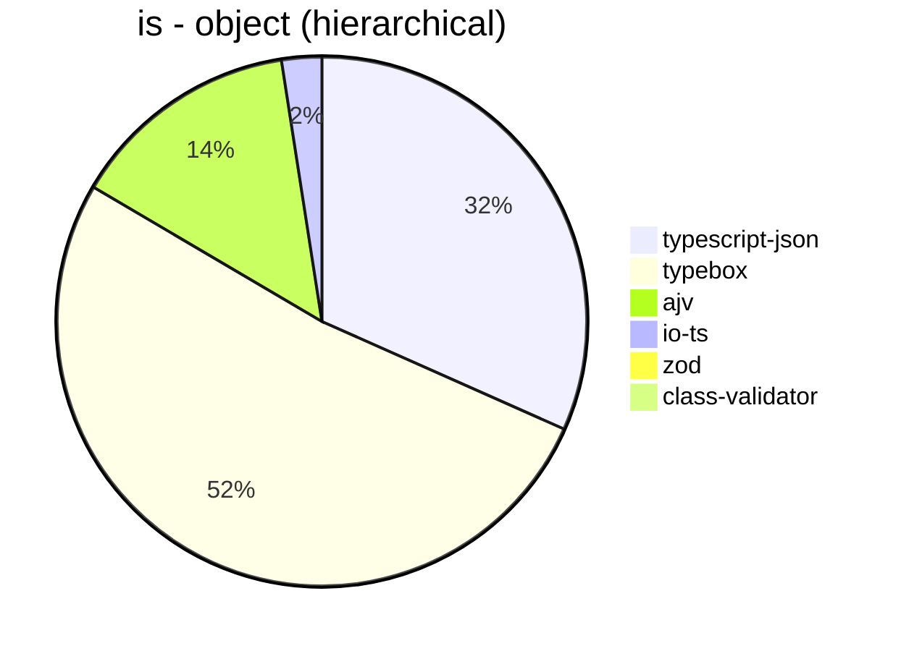
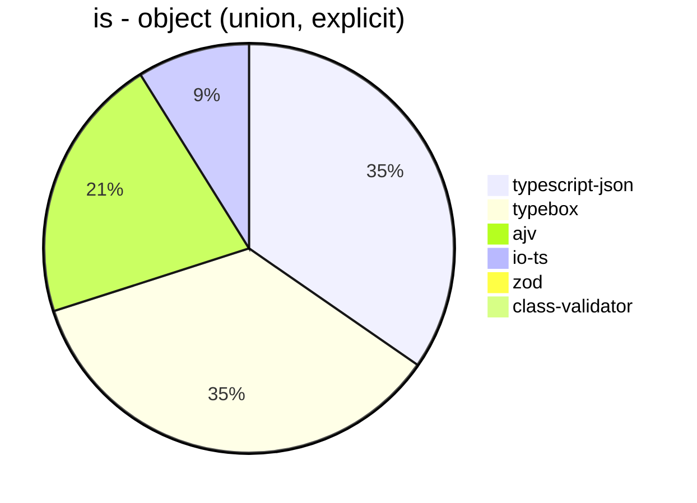
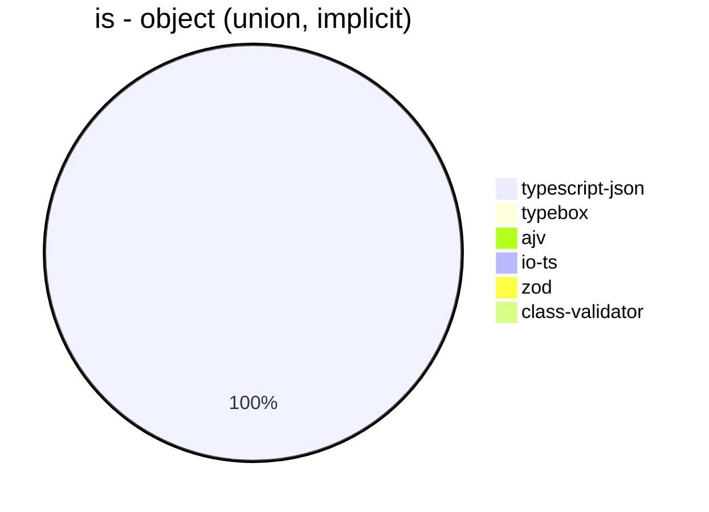
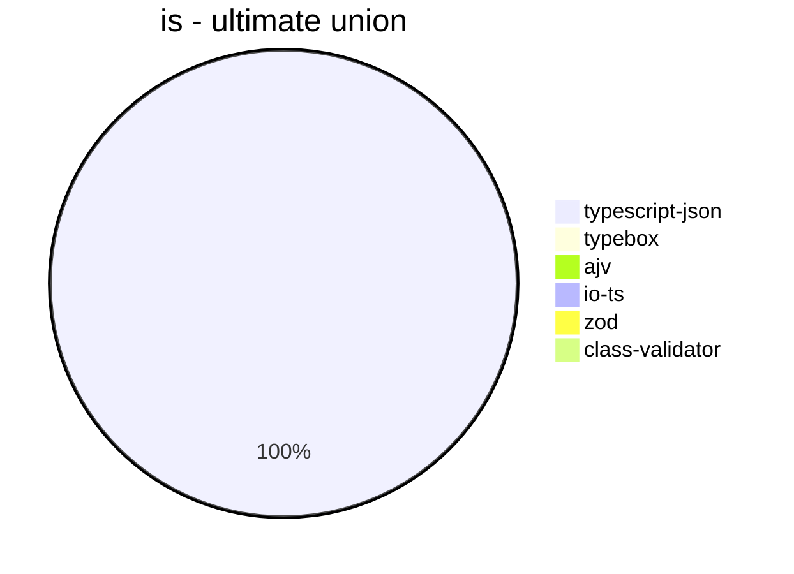
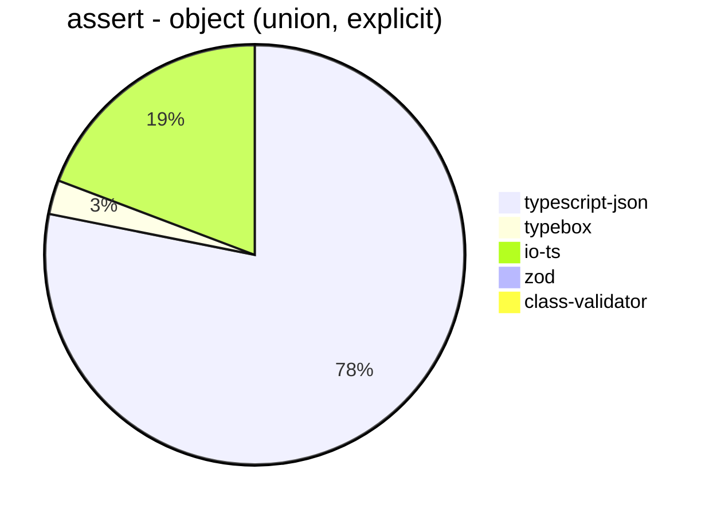
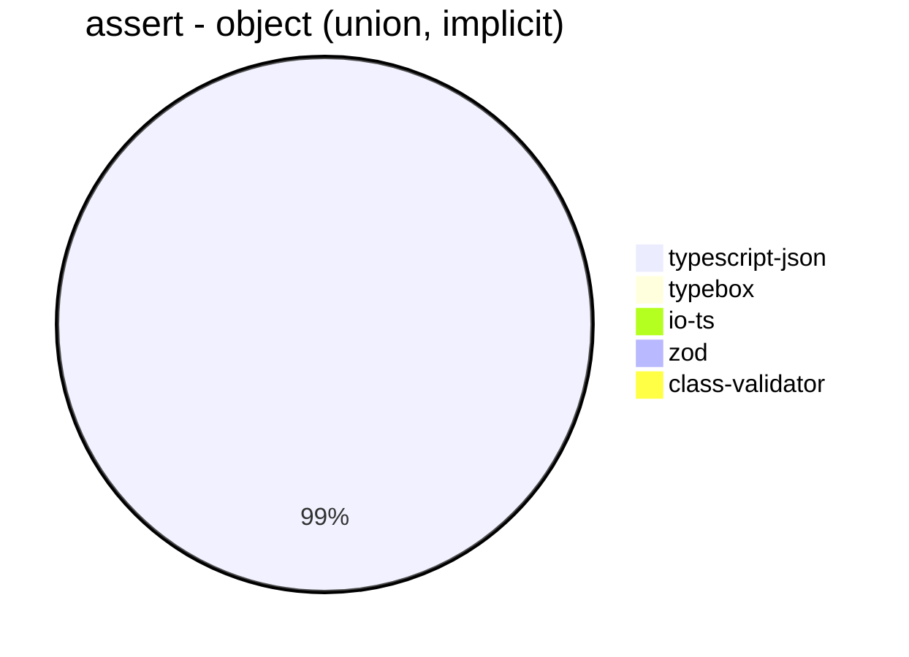
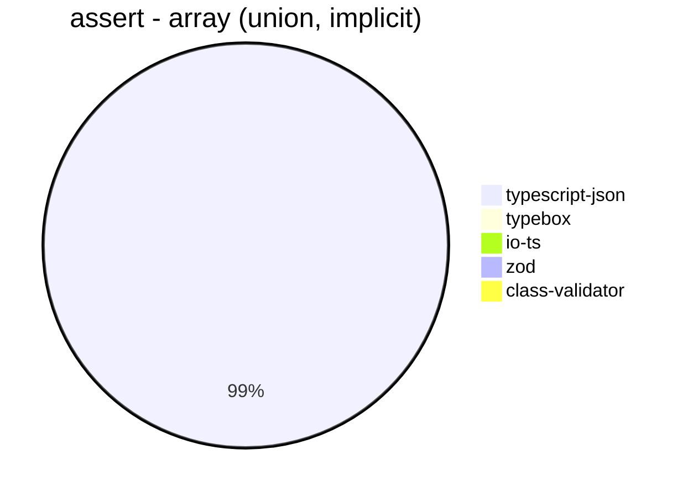
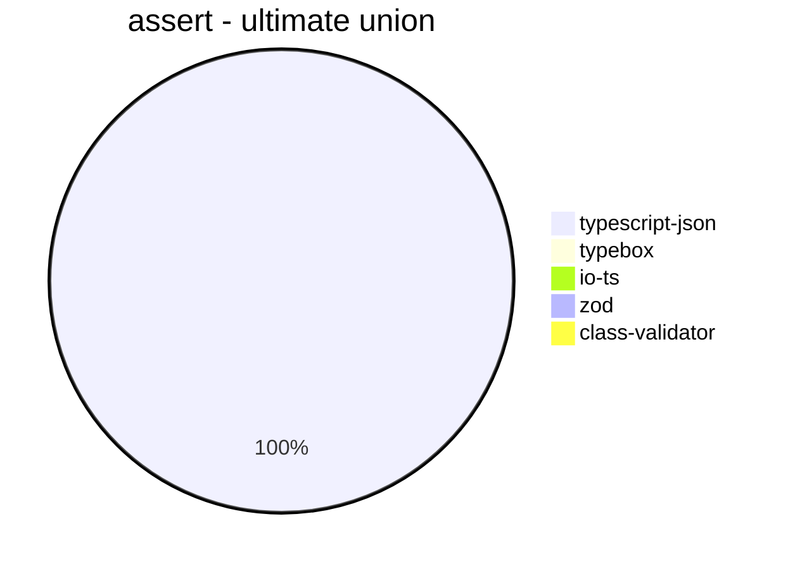
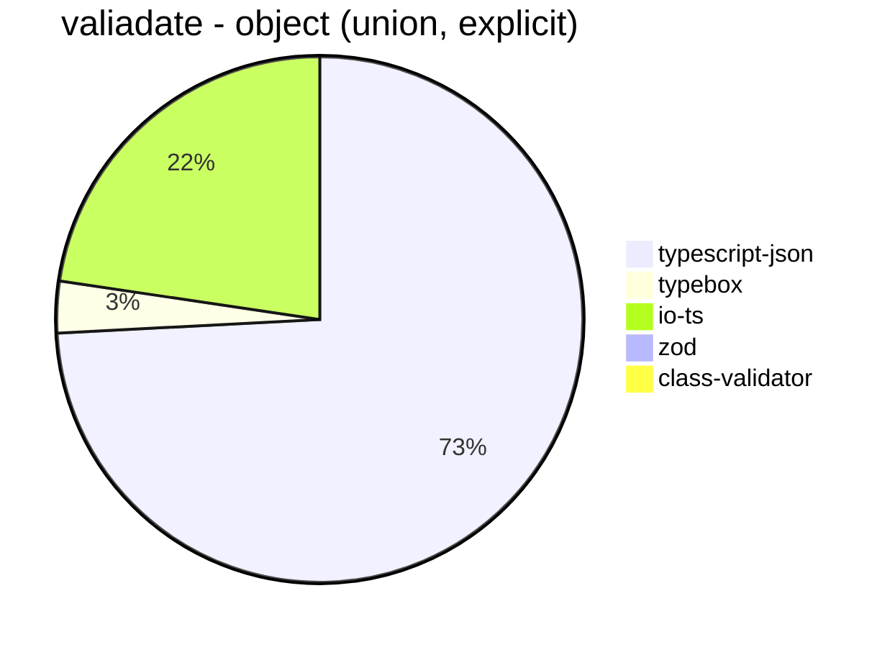
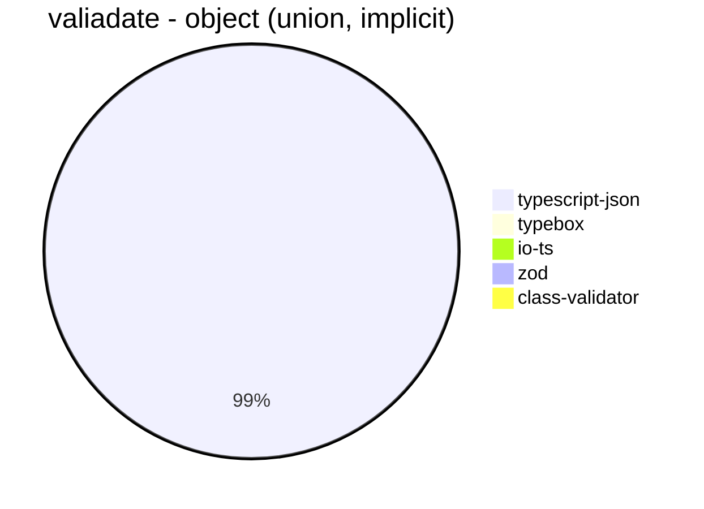

# Benchmark of `typescript-json`
> CPU: AMD Ryzen 7 5800H with Radeon Graphics
> Memory: 64,928 MB
> NodeJS version: v16.6.0
> TypeScript-JSON version: 3.3.12


## is
 Components | typescript-json | typebox | ajv | io-ts | zod | class-validator 
------------|-----------------|---------|-----|-------|-----|-----------------
object (hierarchical) | 111292.12454212454 | 182121.67159763313 | 49491.52851156859 | 8601.880310974508 | 408.98345153664303 | 57.29260798843303
object (recursive) | 72938.19507748404 | 80253.13190862196 | 33571.35026493696 | 4576.697247706422 | 67.71124790151092 | 35.74736062233747
object (union, explicit) | 12505.327794834748 | 12776.566757493189 | 7611.069836552749 | 3201.711268887675 | 34.33556050482554 | 15.235971757710889
object (union, implicit) | 12603.480192521289 | Failed | Failed | Failed | 18.867924528301888 | 13.721490821435195
array (recursive) | 7089.541284403669 | 6843.205574912891 | 1942.1532846715327 | 504.82553823311065 | 8.458646616541353 | 3.138268414251431
array (union, explicit) | 2414.39028744867 | 1995.8862457521016 | 799.8526974774443 | 374.11148522259634 | 2.8232636928289105 | 7.329449351625635
array (union, implicit) | 1638.903912024518 | Failed | Failed | Failed | 1.869158878504673 | 4.43213296398892
ultimate union | 531.6894977168951 | Failed | Failed | Failed | 0.354924578527063 | Failed














## assert
 Components | typescript-json | typebox | io-ts | zod | class-validator 
------------|-----------------|---------|-------|-----|-----------------
object (hierarchical) | 21766.92543780466 | 884.012539184953 | 3810.975609756098 | 385.9680602906872 | 56.610664718772824
object (recursive) | 29390.99526066351 | 377.8767631774313 | 1626.3815908679107 | 66.09300622482607 | 35.620547431571055
object (union, explicit) | 4756.962495358336 | 159.88265493215988 | 1171.7981417380215 | 33.97880891487029 | 15.336289726533629
object (union, implicit) | 4600.074335625348 | Failed | Failed | 18.76974540048318 | 13.77000372162263
array (recursive) | 1492.7889117812324 | 40.7709414381023 | 172.08697268165767 | 8.846226237530585 | 3.2021096251648142
array (union, explicit) | 2139.5010016390456 | 19.64023494860499 | 81.6215233593892 | 2.815843814529754 | 6.551410373066424
array (union, implicit) | 1158.7738619676945 | Failed | Failed | 1.8811136192626035 | 4.527447651386531
ultimate union | 249.590089269448 | Failed | Failed | 0.3578457684737878 | Failed














## valiadate
 Components | typescript-json | typebox | io-ts | zod | class-validator 
------------|-----------------|---------|-------|-----|-----------------
object (hierarchical) | 16285.312719606465 | 921.9012115563839 | 3707.98087532181 | 421.759697256386 | 57.51803218050675
object (recursive) | 17822.31252308829 | 359.5422665190107 | 1717.065036131184 | 69.25260170293282 | 35.98342125094197
object (union, explicit) | 3869.455463397043 | 165.39392810579253 | 1181.7847286108556 | 34.612490594431904 | 15.322134022521691
object (union, implicit) | 3434.078507305052 | Failed | Failed | 17.926446128257254 | 13.824884792626728
array (recursive) | 1047.1412343809163 | 38.892908827785824 | 170.4628949301984 | 9.082308420056764 | 3.4090909090909087
array (union, explicit) | 1777.1779597915115 | 22.2473604826546 | 85.21113425487597 | 2.8142589118198873 | 6.877323420074349
array (union, implicit) | 868.7716736630772 | Failed | Failed | 1.8811136192626035 | 4.276682781703236
ultimate union | 141.48845166809238 | Failed | Failed | 0.36081544290095613 | Failed








```mermaid
pie title valiadate - array (recursive)
  "typescript-json": 1047.1412343809163
  "typebox": 38.892908827785824
  "io-ts": 170.4628949301984
  "zod": 9.082308420056764
  "class-validator": 3.4090909090909087
```


```mermaid
pie title valiadate - array (union, explicit)
  "typescript-json": 1777.1779597915115
  "typebox": 22.2473604826546
  "io-ts": 85.21113425487597
  "zod": 2.8142589118198873
  "class-validator": 6.877323420074349
```


```mermaid
pie title valiadate - array (union, implicit)
  "typescript-json": 868.7716736630772
  "typebox": 0
  "io-ts": 0
  "zod": 1.8811136192626035
  "class-validator": 4.276682781703236
```


```mermaid
pie title valiadate - ultimate union
  "typescript-json": 141.48845166809238
  "typebox": 0
  "io-ts": 0
  "zod": 0.36081544290095613
  "class-validator": 0
```


## optimizer
 Components | typescript-json | typebox | ajv 
------------|-----------------|---------|-----
object (hierarchical) | 100224.78491671242 | 223.15253003276302 | 4.90107097476856
object (recursive) | 72265.79043446513 | 852.3283203478891 | 9.042258719320909
object (union) | 12271.058315334772 | 87.00380641653072 | 4.2170883755042174
array (hierarchical) | 3023.5884101040115 | 1053.4163835409588 | 6.424375917767988
array (recursive) | 5452.087994034303 | 804.4787354158825 | 9.369832812787067
array (union) | 3959.8896044158237 | 244.86856319769535 | 6.306807642366908
ultimate union | 565.8160455296494 | 11.76470588235294 | 0.9035056017347308


```mermaid
pie title optimizer - object (hierarchical)
  "typescript-json": 100224.78491671242
  "typebox": 223.15253003276302
  "ajv": 4.90107097476856
```


```mermaid
pie title optimizer - object (recursive)
  "typescript-json": 72265.79043446513
  "typebox": 852.3283203478891
  "ajv": 9.042258719320909
```


```mermaid
pie title optimizer - object (union)
  "typescript-json": 12271.058315334772
  "typebox": 87.00380641653072
  "ajv": 4.2170883755042174
```


```mermaid
pie title optimizer - array (hierarchical)
  "typescript-json": 3023.5884101040115
  "typebox": 1053.4163835409588
  "ajv": 6.424375917767988
```


```mermaid
pie title optimizer - array (recursive)
  "typescript-json": 5452.087994034303
  "typebox": 804.4787354158825
  "ajv": 9.369832812787067
```


```mermaid
pie title optimizer - array (union)
  "typescript-json": 3959.8896044158237
  "typebox": 244.86856319769535
  "ajv": 6.306807642366908
```


```mermaid
pie title optimizer - ultimate union
  "typescript-json": 565.8160455296494
  "typebox": 11.76470588235294
  "ajv": 0.9035056017347308
```


## stringify
 Components | typescript-json | fast-json-stringify | JSON.stringify() 
------------|-----------------|---------------------|------------------
object (simple) | 129580.20164986252 | 28294.41247447559 | 4295.7009345794395
object (hierarchical) | 4674.050632911392 | 4395.675265553869 | 1198.2710016914114
object (recursive) | 4951.672862453532 | 918.2799702159344 | 920.3209554021273
object (union) | 1224.6153846153845 | 1241.8054809242342 | 356.0966678872208
array (hierarchical) | 108.04931109499637 | 148.86672710788758 | 26.416469302240845
array (recursive) | 241.75229853975122 | 72.58360896729144 | 73.46553352219075
array (union) | 322.3065798987708 | 148.22170066799063 | 164.37081161578556
ultimate union | 124.123043712898 | 60.99656357388316 | 126.28676470588235


```mermaid
pie title stringify - object (simple)
  "typescript-json": 129580.20164986252
  "fast-json-stringify": 28294.41247447559
  "JSON.stringify()": 4295.7009345794395
```


```mermaid
pie title stringify - object (hierarchical)
  "typescript-json": 4674.050632911392
  "fast-json-stringify": 4395.675265553869
  "JSON.stringify()": 1198.2710016914114
```


```mermaid
pie title stringify - object (recursive)
  "typescript-json": 4951.672862453532
  "fast-json-stringify": 918.2799702159344
  "JSON.stringify()": 920.3209554021273
```


```mermaid
pie title stringify - object (union)
  "typescript-json": 1224.6153846153845
  "fast-json-stringify": 1241.8054809242342
  "JSON.stringify()": 356.0966678872208
```


```mermaid
pie title stringify - array (hierarchical)
  "typescript-json": 108.04931109499637
  "fast-json-stringify": 148.86672710788758
  "JSON.stringify()": 26.416469302240845
```


```mermaid
pie title stringify - array (recursive)
  "typescript-json": 241.75229853975122
  "fast-json-stringify": 72.58360896729144
  "JSON.stringify()": 73.46553352219075
```


```mermaid
pie title stringify - array (union)
  "typescript-json": 322.3065798987708
  "fast-json-stringify": 148.22170066799063
  "JSON.stringify()": 164.37081161578556
```


```mermaid
pie title stringify - ultimate union
  "typescript-json": 124.123043712898
  "fast-json-stringify": 60.99656357388316
  "JSON.stringify()": 126.28676470588235
```


