# Benchmark of `typescript-json`
> CPU: AMD Ryzen 7 5800H with Radeon Graphics
> Memory: 64,928 MB
> NodeJS version: v16.6.0
> TypeScript-JSON version: 3.3.17

## TSON iterate
 Components | is | assert | validate 
------------|----|--------|----------
simple | 425557.293561295 | 225752.24811892092 | 88579.36648380817
object (hierarchical) | 111467.79475982532 | 62368.527731711816 | 32779.38219703893
object (recursive) | 71854.86135486135 | 44807.72686433064 | 26741.812227074235
object (union, explicit) | 22411.570247933883 | 6916.503471604059 | 4929.93744414656
object (union, implicit) | 18883.758533956163 | 6337.058719176867 | 4316.260744985673
array (recursive) | 6953.159979335284 | 2708.001448225923 | 1591.8068763716167
array (union, explicit) | 4327.1236959761545 | 2661.4611380362594 | 2110.569105691057
array (union, implicit) | 2226.772505863251 | 1562.1123848900584 | 1091.4893617021278
ultimate union | 454.0617240156084 | 253.6656891495601 | 185.93414459556192

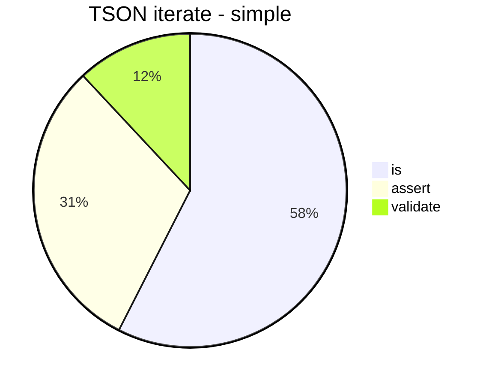
```mermaid
pie title TSON iterate - simple
  "is": 425557.293561295
  "assert": 225752.24811892092
  "validate": 88579.36648380817
```

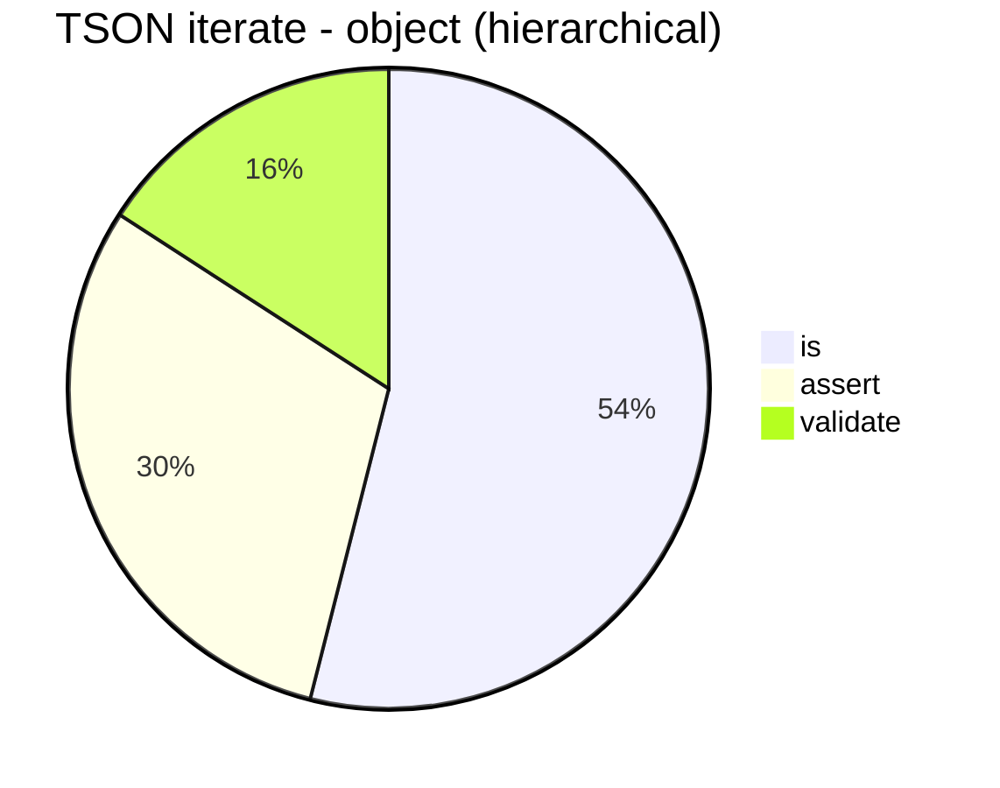
```mermaid
pie title TSON iterate - object (hierarchical)
  "is": 111467.79475982532
  "assert": 62368.527731711816
  "validate": 32779.38219703893
```

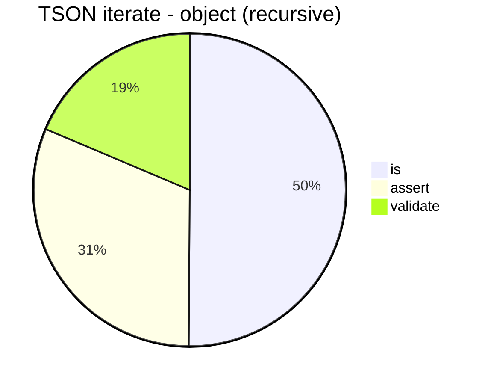
```mermaid
pie title TSON iterate - object (recursive)
  "is": 71854.86135486135
  "assert": 44807.72686433064
  "validate": 26741.812227074235
```

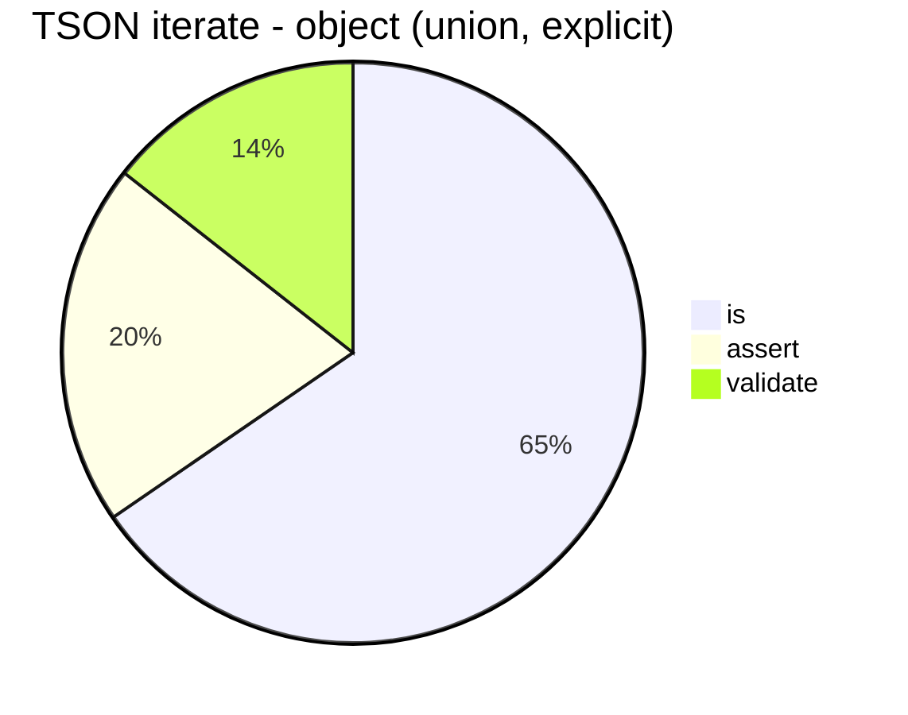
```mermaid
pie title TSON iterate - object (union, explicit)
  "is": 22411.570247933883
  "assert": 6916.503471604059
  "validate": 4929.93744414656
```

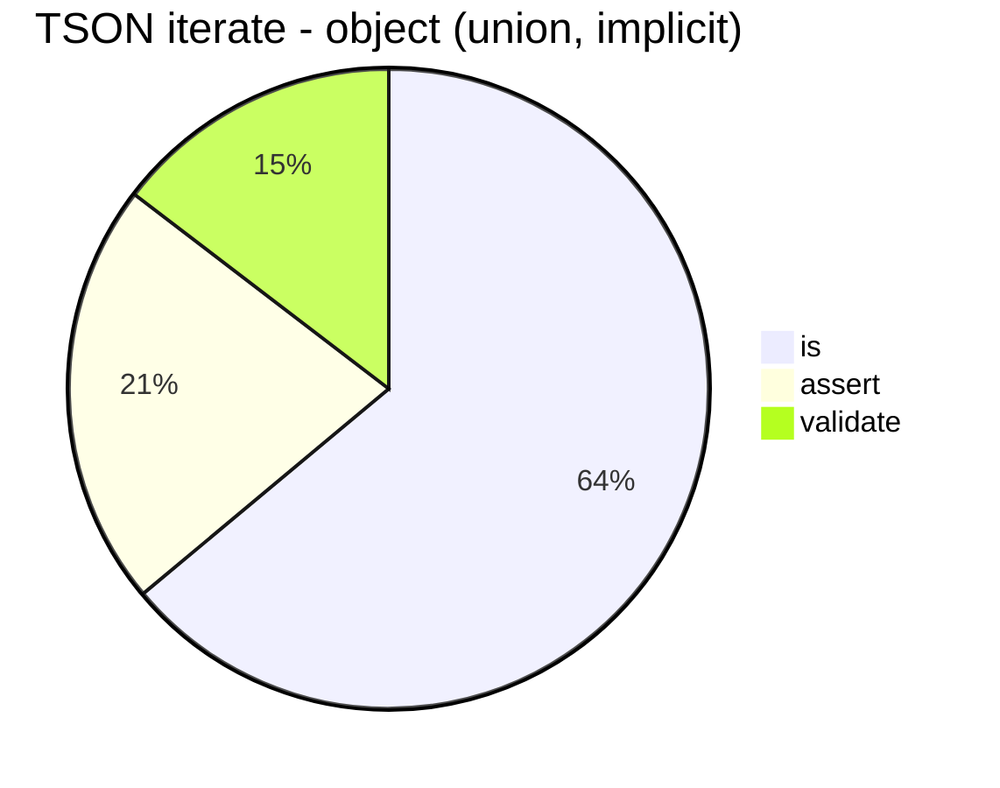
```mermaid
pie title TSON iterate - object (union, implicit)
  "is": 18883.758533956163
  "assert": 6337.058719176867
  "validate": 4316.260744985673
```

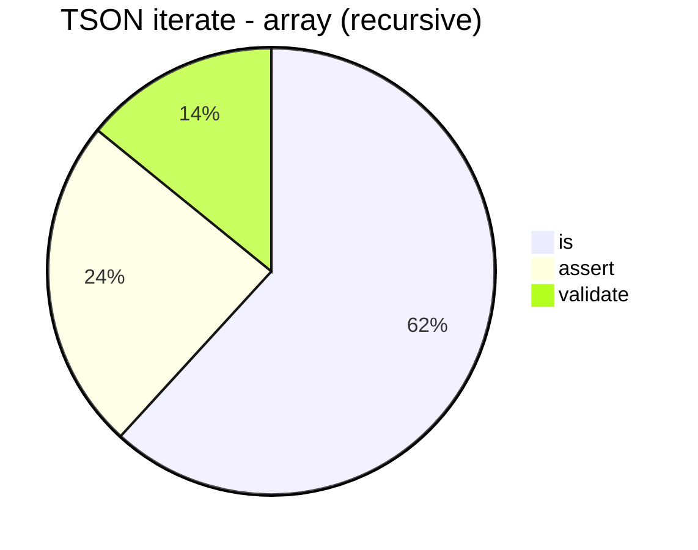
```mermaid
pie title TSON iterate - array (recursive)
  "is": 6953.159979335284
  "assert": 2708.001448225923
  "validate": 1591.8068763716167
```

```mermaid
pie title TSON iterate - array (union, explicit)
  "is": 4327.1236959761545
  "assert": 2661.4611380362594
  "validate": 2110.569105691057
```

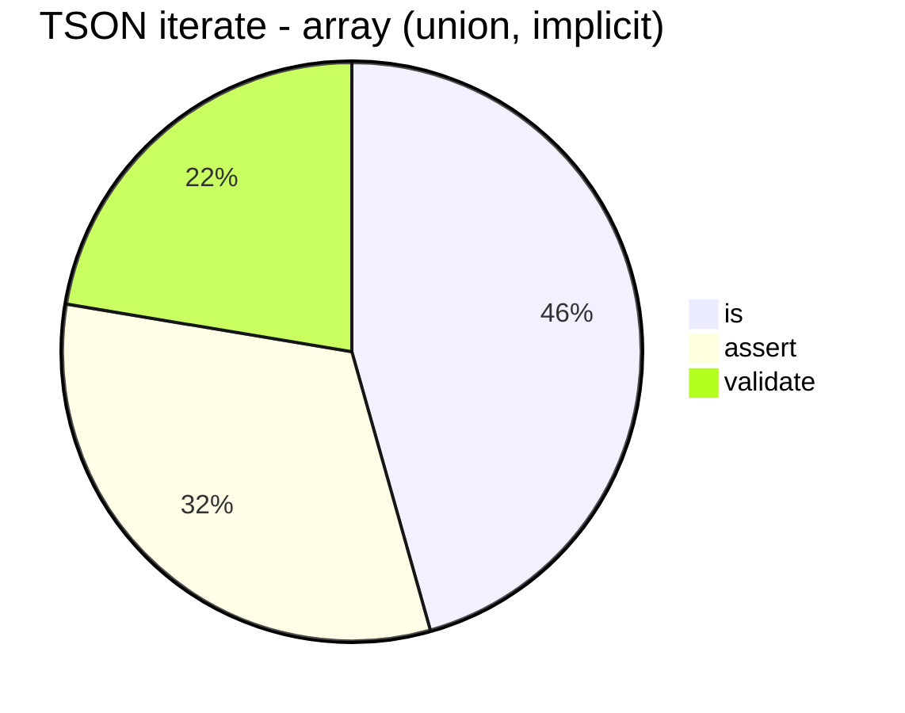
```mermaid
pie title TSON iterate - array (union, implicit)
  "is": 2226.772505863251
  "assert": 1562.1123848900584
  "validate": 1091.4893617021278
```

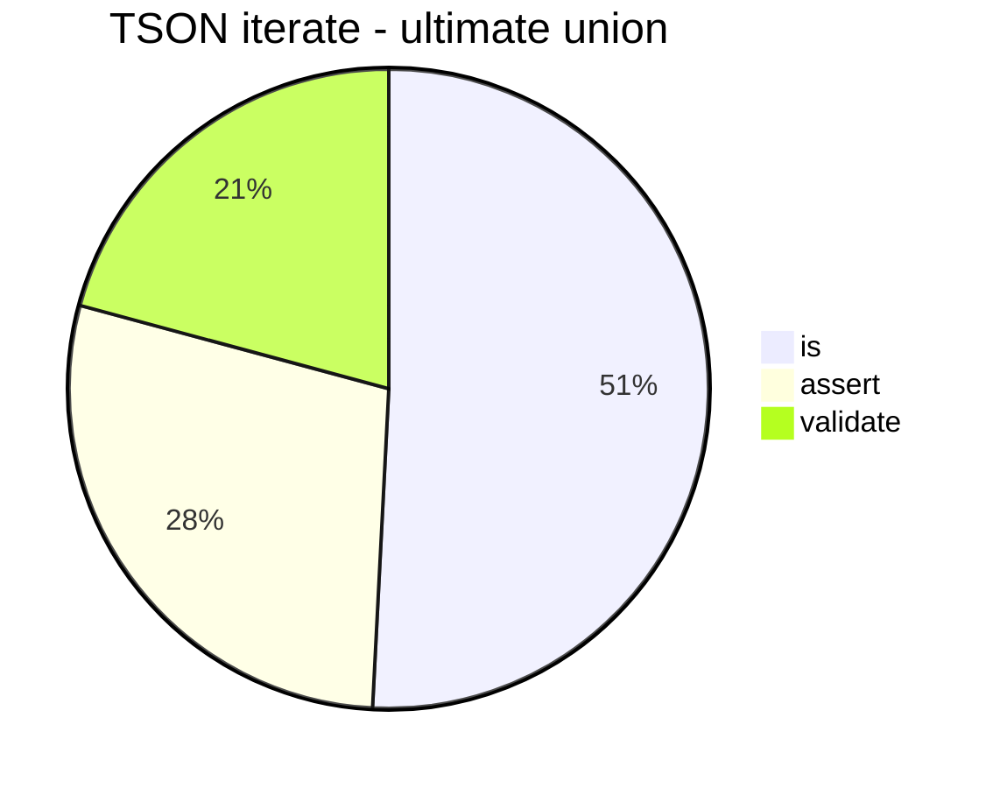
```mermaid
pie title TSON iterate - ultimate union
  "is": 454.0617240156084
  "assert": 253.6656891495601
  "validate": 185.93414459556192
```

## is
 Components | typescript-json | typebox | ajv | io-ts | zod | class-validator 
------------|-----------------|---------|-----|-------|-----|-----------------
object (simple) | 437742.0405209841 | 1590825.9903739356 | 399417.94968081114 | 39230.65392542627 | 3790.1102810387765 | 170.67912324829322
object (hierarchical) | 103906.89216221131 | 175195.01625135427 | 47388.601959038286 | 9325.92869143177 | 452.3633677991137 | 47.7119545938276
object (recursive) | 80206.72478206723 | 86641.03472714387 | 43477.73877701829 | 5573.996971990916 | 69.32314410480349 | 36.63952627683198
object (union, explicit) | 15200.182149362478 | 13452.157943067034 | 7651.616303583977 | 3292.086599477417 | 35.51711446448289 | 82.58204111071042
object (union, implicit) | 16153.873744619801 | Failed | Failed | Failed | 18.945022288261516 | 57.30337078651686
array (recursive) | 6061.746437705517 | 6455.9926806953345 | 2251.5700036941266 | 492.02031193326076 | 9.262689885142645 | 3.34075723830735
array (union, explicit) | 4127.8414257137665 | 2026.8242356030762 | 844.0677966101695 | 376.67910447761193 | 2.835538752362949 | 28.623853211009173
array (union, implicit) | 2056.5428109854606 | Failed | Failed | Failed | 1.8747656542932134 | 20.8679593721145
ultimate union | 466.1722141823445 | Failed | Failed | Failed | 0.3582945180938732 | Failed

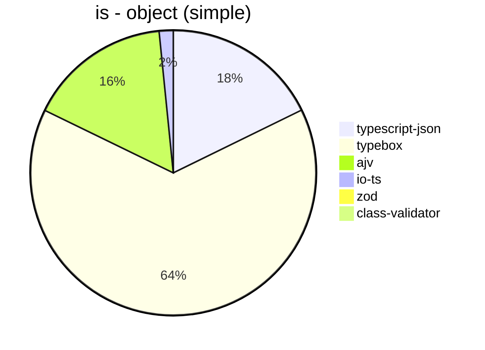
```mermaid
pie title is - object (simple)
  "typescript-json": 437742.0405209841
  "typebox": 1590825.9903739356
  "ajv": 399417.94968081114
  "io-ts": 39230.65392542627
  "zod": 3790.1102810387765
  "class-validator": 170.67912324829322
```

```mermaid
pie title is - object (hierarchical)
  "typescript-json": 103906.89216221131
  "typebox": 175195.01625135427
  "ajv": 47388.601959038286
  "io-ts": 9325.92869143177
  "zod": 452.3633677991137
  "class-validator": 47.7119545938276
```

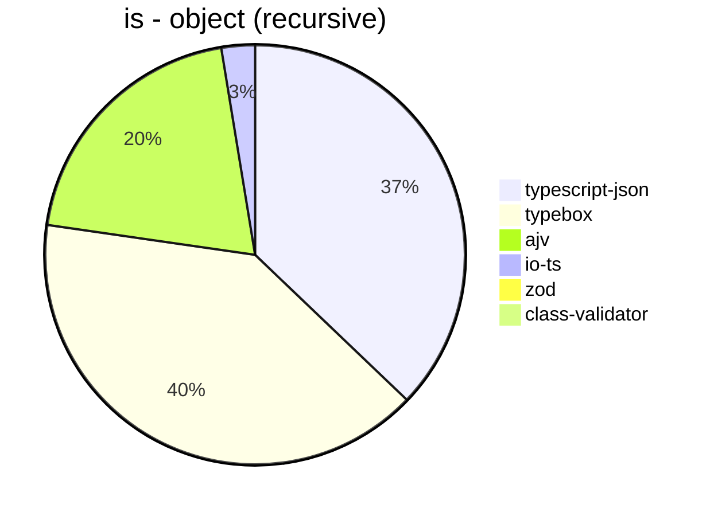
```mermaid
pie title is - object (recursive)
  "typescript-json": 80206.72478206723
  "typebox": 86641.03472714387
  "ajv": 43477.73877701829
  "io-ts": 5573.996971990916
  "zod": 69.32314410480349
  "class-validator": 36.63952627683198
```

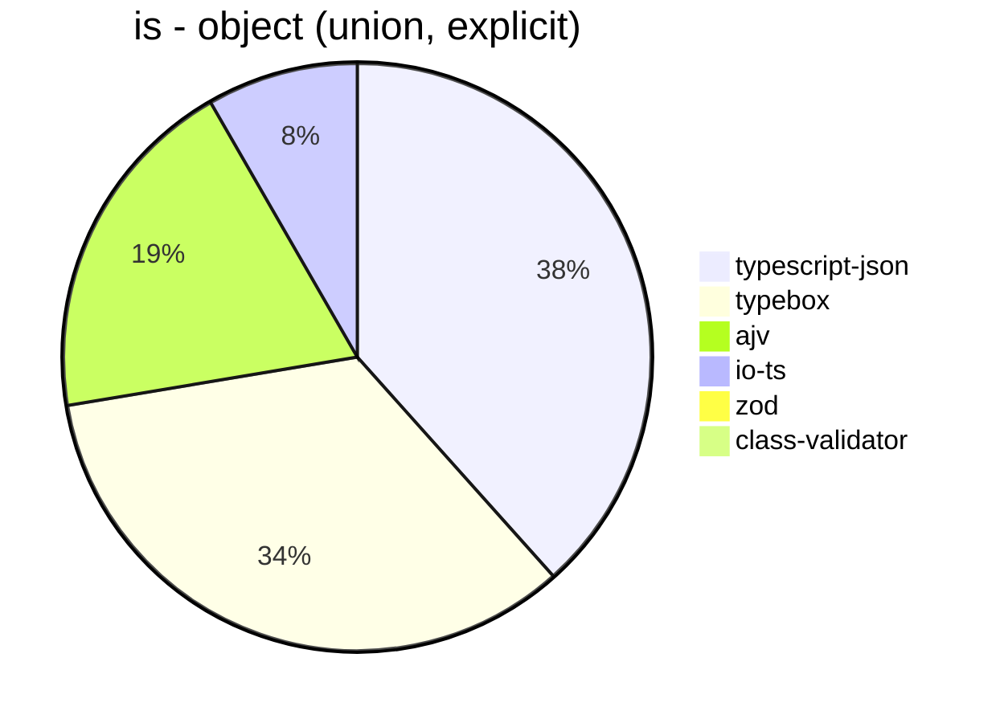
```mermaid
pie title is - object (union, explicit)
  "typescript-json": 15200.182149362478
  "typebox": 13452.157943067034
  "ajv": 7651.616303583977
  "io-ts": 3292.086599477417
  "zod": 35.51711446448289
  "class-validator": 82.58204111071042
```

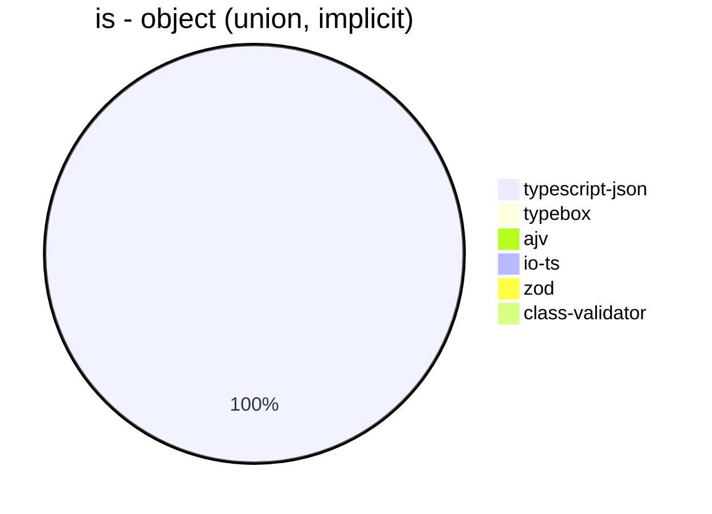
```mermaid
pie title is - object (union, implicit)
  "typescript-json": 16153.873744619801
  "typebox": 0
  "ajv": 0
  "io-ts": 0
  "zod": 18.945022288261516
  "class-validator": 57.30337078651686
```

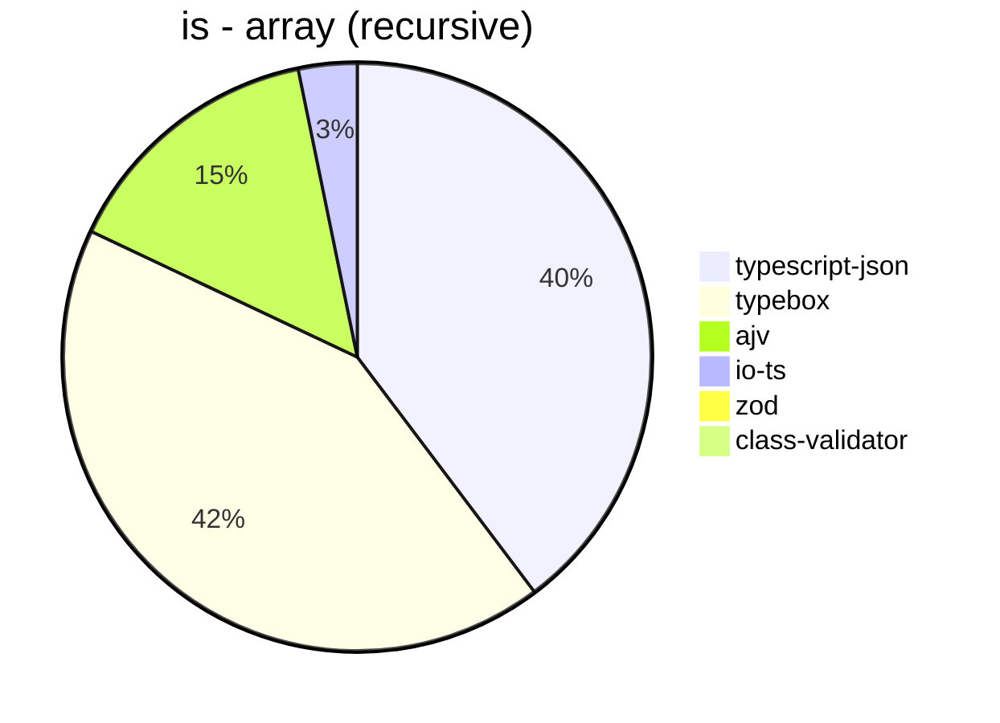
```mermaid
pie title is - array (recursive)
  "typescript-json": 6061.746437705517
  "typebox": 6455.9926806953345
  "ajv": 2251.5700036941266
  "io-ts": 492.02031193326076
  "zod": 9.262689885142645
  "class-validator": 3.34075723830735
```

```mermaid
pie title is - array (union, explicit)
  "typescript-json": 4127.8414257137665
  "typebox": 2026.8242356030762
  "ajv": 844.0677966101695
  "io-ts": 376.67910447761193
  "zod": 2.835538752362949
  "class-validator": 28.623853211009173
```

```mermaid
pie title is - array (union, implicit)
  "typescript-json": 2056.5428109854606
  "typebox": 0
  "ajv": 0
  "io-ts": 0
  "zod": 1.8747656542932134
  "class-validator": 20.8679593721145
```

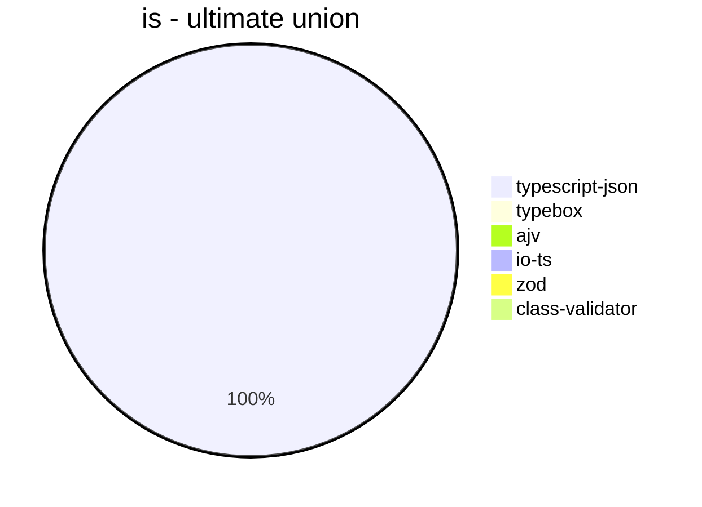
```mermaid
pie title is - ultimate union
  "typescript-json": 466.1722141823445
  "typebox": 0
  "ajv": 0
  "io-ts": 0
  "zod": 0.3582945180938732
  "class-validator": 0
```

## assertType (iterate)
 Components | typescript-json | typebox | io-ts | zod | class-validator 
------------|-----------------|---------|-------|-----|-----------------
object (simple) | 230076.04973869165 | 3445.9283991838247 | 16583.609576427258 | 3558.596620132256 | 171.55555555555554
object (hierarchical) | 57111.683532658695 | 846.2107208872458 | 3745.6043956043954 | 422.04549657850936 | 58.53301627949516
object (recursive) | 45118.46879535559 | 378.3083472145105 | 1907.6693968726731 | 74.21289355322338 | 37.68607499528924
object (union, explicit) | 6491.279069767443 | 143.16979755608244 | 1213.0881557598702 | 35.31390134529148 | 81.38699245418613
object (union, implicit) | 6183.563175549758 | Failed | Failed | 19.212657750988885 | 55.30371713508613
array (recursive) | 2666.112035496395 | 37.46345029239766 | 184.89289740698985 | 9.231348907309721 | 3.145817912657291
array (union, explicit) | 2592.205491585474 | 18.662232076866225 | 86.38059701492537 | 3.005259203606311 | 28.701180744777474
array (union, implicit) | 1467.6337262012694 | Failed | Failed | 1.873711823121604 | 20.99201188928107
ultimate union | 264.84975541579314 | Failed | Failed | 0.35778175313059035 | Failed

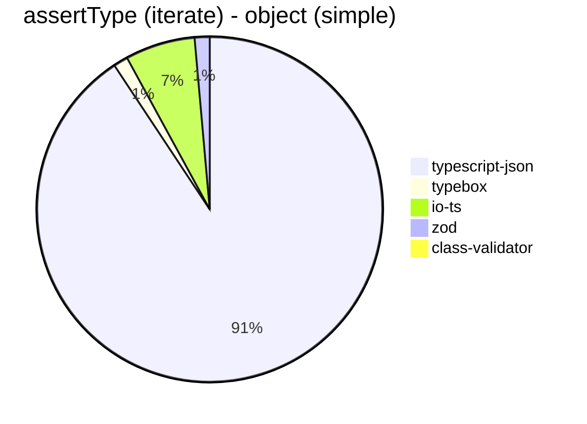
```mermaid
pie title assertType (iterate) - object (simple)
  "typescript-json": 230076.04973869165
  "typebox": 3445.9283991838247
  "io-ts": 16583.609576427258
  "zod": 3558.596620132256
  "class-validator": 171.55555555555554
```

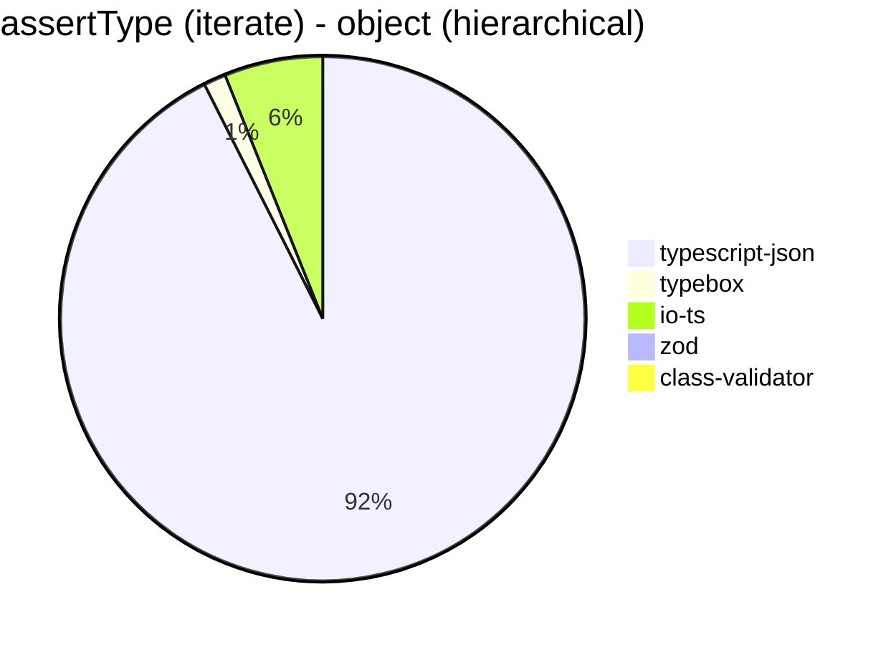
```mermaid
pie title assertType (iterate) - object (hierarchical)
  "typescript-json": 57111.683532658695
  "typebox": 846.2107208872458
  "io-ts": 3745.6043956043954
  "zod": 422.04549657850936
  "class-validator": 58.53301627949516
```

```mermaid
pie title assertType (iterate) - object (recursive)
  "typescript-json": 45118.46879535559
  "typebox": 378.3083472145105
  "io-ts": 1907.6693968726731
  "zod": 74.21289355322338
  "class-validator": 37.68607499528924
```

```mermaid
pie title assertType (iterate) - object (union, explicit)
  "typescript-json": 6491.279069767443
  "typebox": 143.16979755608244
  "io-ts": 1213.0881557598702
  "zod": 35.31390134529148
  "class-validator": 81.38699245418613
```

```mermaid
pie title assertType (iterate) - object (union, implicit)
  "typescript-json": 6183.563175549758
  "typebox": 0
  "io-ts": 0
  "zod": 19.212657750988885
  "class-validator": 55.30371713508613
```

```mermaid
pie title assertType (iterate) - array (recursive)
  "typescript-json": 2666.112035496395
  "typebox": 37.46345029239766
  "io-ts": 184.89289740698985
  "zod": 9.231348907309721
  "class-validator": 3.145817912657291
```

```mermaid
pie title assertType (iterate) - array (union, explicit)
  "typescript-json": 2592.205491585474
  "typebox": 18.662232076866225
  "io-ts": 86.38059701492537
  "zod": 3.005259203606311
  "class-validator": 28.701180744777474
```

```mermaid
pie title assertType (iterate) - array (union, implicit)
  "typescript-json": 1467.6337262012694
  "typebox": 0
  "io-ts": 0
  "zod": 1.873711823121604
  "class-validator": 20.99201188928107
```

```mermaid
pie title assertType (iterate) - ultimate union
  "class-validator": 0
  "typescript-json": 264.84975541579314
  "typebox": 0
  "io-ts": 0
  "zod": 0.35778175313059035
```

## assertType (throw)
 Components | typescript-json | typebox | io-ts | zod | class-validator 
------------|-----------------|---------|-------|-----|-----------------
object (simple) | 498.8700564971752 | 26.929982046678635 | 122.02882275874977 | 33.57447597848265 | 1.8412815319462346
object (hierarchical) | 294.2630185348632 | 7.962962962962963 | 35.114215593732304 | 4.096071495066095 | 0.7301935012778387
object (recursive) | 48.360505587103866 | Failed | Failed | 0.18338529249954152 | 0.5597014925373134
object (union, explicit) | 57.96306454562077 | 1.4825796886582654 | 12.1580547112462 | 0.36396724294813465 | 0.916590284142988
object (union, implicit) | 46.14825581395349 | Failed | Failed | 0.17497812773403326 | 0.5520794994479205
array (recursive) | 16.32801161103048 | 0.36503011498448623 | 1.6844469399213924 | 0.168321831341525 | 0.12706480304955528
array (union, explicit) | 4.810360777058279 | 0.18063583815028902 | 0.7401924500370096 | 0.11498217776244683 | 0.3580379520229144
array (union, implicit) | 1.8385732671446957 | Failed | Failed | 0.0963948332369385 | 0.36496350364963503
ultimate union | 2.727272727272727 | Failed | Failed | 0.028098569782798056 | Failed

```mermaid
pie title assertType (throw) - object (simple)
  "typescript-json": 498.8700564971752
  "typebox": 26.929982046678635
  "io-ts": 122.02882275874977
  "zod": 33.57447597848265
  "class-validator": 1.8412815319462346
```

```mermaid
pie title assertType (throw) - object (hierarchical)
  "typescript-json": 294.2630185348632
  "typebox": 7.962962962962963
  "io-ts": 35.114215593732304
  "zod": 4.096071495066095
  "class-validator": 0.7301935012778387
```

```mermaid
pie title assertType (throw) - object (recursive)
  "typescript-json": 48.360505587103866
  "typebox": 0
  "io-ts": 0
  "zod": 0.18338529249954152
  "class-validator": 0.5597014925373134
```

```mermaid
pie title assertType (throw) - object (union, explicit)
  "typescript-json": 57.96306454562077
  "typebox": 1.4825796886582654
  "io-ts": 12.1580547112462
  "zod": 0.36396724294813465
  "class-validator": 0.916590284142988
```

```mermaid
pie title assertType (throw) - object (union, implicit)
  "typescript-json": 46.14825581395349
  "typebox": 0
  "io-ts": 0
  "zod": 0.17497812773403326
  "class-validator": 0.5520794994479205
```

```mermaid
pie title assertType (throw) - array (recursive)
  "typescript-json": 16.32801161103048
  "typebox": 0.36503011498448623
  "io-ts": 1.6844469399213924
  "zod": 0.168321831341525
  "class-validator": 0.12706480304955528
```

```mermaid
pie title assertType (throw) - array (union, explicit)
  "typescript-json": 4.810360777058279
  "typebox": 0.18063583815028902
  "io-ts": 0.7401924500370096
  "zod": 0.11498217776244683
  "class-validator": 0.3580379520229144
```

```mermaid
pie title assertType (throw) - array (union, implicit)
  "typescript-json": 1.8385732671446957
  "typebox": 0
  "io-ts": 0
  "zod": 0.0963948332369385
  "class-validator": 0.36496350364963503
```

```mermaid
pie title assertType (throw) - ultimate union
  "class-validator": 0
  "typescript-json": 2.727272727272727
  "typebox": 0
  "io-ts": 0
  "zod": 0.028098569782798056
```

## validate
 Components | typescript-json | typebox | io-ts | zod | class-validator 
------------|-----------------|---------|-------|-----|-----------------
object (simple) | 95410.2283105023 | 2944.8022079116836 | 14744.173140954495 | 3559.078341013825 | 176.51349380014588
object (hierarchical) | 33309.62936690902 | 813.3918770581778 | 3568.1111720607055 | 428.0655982109579 | 58.52137222527977
object (recursive) | 26934.810012605798 | 383.40594809623036 | 1806.14132445431 | 73.17528467425798 | 37.16781267422412
object (union, explicit) | 5098.785571868769 | 144.60511679644048 | 1202.7814320616426 | 35.50952469021639 | 81.20733021918792
object (union, implicit) | 4263.567293777135 | 135.29520636683324 | 350.0948766603416 | 19.19850885368127 | 55.11811023622047
array (recursive) | 1514.947138169887 | 38.42583998514944 | 181.13349651666354 | 9.46790380609733 | 3.1865042174320526
array (union, explicit) | 2139.4015409424833 | 18.93798737467508 | 86.4542574995342 | 3.0308770600492516 | 28.955725761255373
array (union, implicit) | 1067.5866949752299 | 13.416477702191989 | 60.192023633677984 | 1.8733608092918697 | 20.512820512820515
ultimate union | 176.51134592066518 | Failed | Failed | 0.3577177606868181 | Failed

```mermaid
pie title validate - object (simple)
  "typescript-json": 95410.2283105023
  "typebox": 2944.8022079116836
  "io-ts": 14744.173140954495
  "zod": 3559.078341013825
  "class-validator": 176.51349380014588
```

```mermaid
pie title validate - object (hierarchical)
  "typescript-json": 33309.62936690902
  "typebox": 813.3918770581778
  "io-ts": 3568.1111720607055
  "zod": 428.0655982109579
  "class-validator": 58.52137222527977
```

```mermaid
pie title validate - object (recursive)
  "typescript-json": 26934.810012605798
  "typebox": 383.40594809623036
  "io-ts": 1806.14132445431
  "zod": 73.17528467425798
  "class-validator": 37.16781267422412
```

```mermaid
pie title validate - object (union, explicit)
  "typescript-json": 5098.785571868769
  "typebox": 144.60511679644048
  "io-ts": 1202.7814320616426
  "zod": 35.50952469021639
  "class-validator": 81.20733021918792
```

```mermaid
pie title validate - object (union, implicit)
  "typescript-json": 4263.567293777135
  "typebox": 135.29520636683324
  "io-ts": 350.0948766603416
  "zod": 19.19850885368127
  "class-validator": 55.11811023622047
```

```mermaid
pie title validate - array (recursive)
  "typescript-json": 1514.947138169887
  "typebox": 38.42583998514944
  "io-ts": 181.13349651666354
  "zod": 9.46790380609733
  "class-validator": 3.1865042174320526
```

```mermaid
pie title validate - array (union, explicit)
  "typescript-json": 2139.4015409424833
  "typebox": 18.93798737467508
  "io-ts": 86.4542574995342
  "zod": 3.0308770600492516
  "class-validator": 28.955725761255373
```

```mermaid
pie title validate - array (union, implicit)
  "typescript-json": 1067.5866949752299
  "typebox": 13.416477702191989
  "io-ts": 60.192023633677984
  "zod": 1.8733608092918697
  "class-validator": 20.512820512820515
```

```mermaid
pie title validate - ultimate union
  "typescript-json": 176.51134592066518
  "typebox": 0
  "io-ts": 0
  "zod": 0.3577177606868181
  "class-validator": 0
```

## equals
 Components | typescript-json | typebox 
------------|-----------------|---------
object (simple) | 27246.156661786234 | 62738.15597667638
object (hierarchical) | 7687.253141831238 | 16958.34081522715
object (recursive) | 6018.765788523999 | 11223.736822973464
object (union, explicit) | 2830.9833694866234 | 3481.631899575411
object (union, implicit) | 1896.859386152748 | 2347.8868319944113
array (recursive) | 599.9635833940276 | 1114.4144144144145
array (union, explicit) | 404.30411007232317 | 753.0749161386508
array (union, implicit) | 256.4147320649328 | 474.112961622013
ultimate union | 340.44902465955096 | 218.8894840207106

```mermaid
pie title equals - object (simple)
  "typescript-json": 27246.156661786234
  "typebox": 62738.15597667638
```

```mermaid
pie title equals - object (hierarchical)
  "typescript-json": 7687.253141831238
  "typebox": 16958.34081522715
```

```mermaid
pie title equals - object (recursive)
  "typescript-json": 6018.765788523999
  "typebox": 11223.736822973464
```

```mermaid
pie title equals - object (union, explicit)
  "typescript-json": 2830.9833694866234
  "typebox": 3481.631899575411
```

```mermaid
pie title equals - object (union, implicit)
  "typescript-json": 1896.859386152748
  "typebox": 2347.8868319944113
```

```mermaid
pie title equals - array (recursive)
  "typescript-json": 599.9635833940276
  "typebox": 1114.4144144144145
```

```mermaid
pie title equals - array (union, explicit)
  "typescript-json": 404.30411007232317
  "typebox": 753.0749161386508
```

```mermaid
pie title equals - array (union, implicit)
  "typescript-json": 256.4147320649328
  "typebox": 474.112961622013
```

```mermaid
pie title equals - ultimate union
  "typescript-json": 340.44902465955096
  "typebox": 218.8894840207106
```

## assertEquals (iterate)
 Components | typescript-json | typebox 
------------|-----------------|---------
object (simple) | 31929.403067824805 | 2491.5377616014557
object (hierarchical) | 7496.2921764923985 | 715.0537634408602
object (recursive) | 6248.818611414032 | 329.44011865035225
object (union, explicit) | 2487.707881417209 | 112.87640864585258
object (union, implicit) | 1855.5838486722444 | 83.20867614061332
array (recursive) | 562.5 | 34.41754916792738
array (union, explicit) | 422.58652094717667 | 16.427492447129907
array (union, implicit) | 279.5737764132202 | 7.3598792224948095
ultimate union | 214.51327433628316 | 4.3676414736042535

```mermaid
pie title assertEquals (iterate) - object (simple)
  "typescript-json": 31929.403067824805
  "typebox": 2491.5377616014557
```

```mermaid
pie title assertEquals (iterate) - object (hierarchical)
  "typescript-json": 7496.2921764923985
  "typebox": 715.0537634408602
```

```mermaid
pie title assertEquals (iterate) - object (recursive)
  "typescript-json": 6248.818611414032
  "typebox": 329.44011865035225
```

```mermaid
pie title assertEquals (iterate) - object (union, explicit)
  "typescript-json": 2487.707881417209
  "typebox": 112.87640864585258
```

```mermaid
pie title assertEquals (iterate) - object (union, implicit)
  "typescript-json": 1855.5838486722444
  "typebox": 83.20867614061332
```

```mermaid
pie title assertEquals (iterate) - array (recursive)
  "typescript-json": 562.5
  "typebox": 34.41754916792738
```

```mermaid
pie title assertEquals (iterate) - array (union, explicit)
  "typescript-json": 422.58652094717667
  "typebox": 16.427492447129907
```

```mermaid
pie title assertEquals (iterate) - array (union, implicit)
  "typescript-json": 279.5737764132202
  "typebox": 7.3598792224948095
```

```mermaid
pie title assertEquals (iterate) - ultimate union
  "typescript-json": 214.51327433628316
  "typebox": 4.3676414736042535
```

## assertEquals (throw)
 Components | typescript-json | typebox 
------------|-----------------|---------
object (simple) | 177.39864245092645 | 22.130262684418856
object (hierarchical) | 65.77761758875472 | 6.516477378514242
object (recursive) | 53.94954888602467 | 3.1722336256764323
object (union, explicit) | 22.20655622136059 | 1.1152416356877324
object (union, implicit) | 16.355555555555554 | 0.9373828271466067
array (recursive) | 5.0170220390611 | 0.36596523330283626
array (union, explicit) | 2.3709648002918113 | 0.17743080198722497
array (union, implicit) | 1.0960906101571062 | 0.15775358889414734
ultimate union | 2.1664560389962086 | 0.1361841209314994

```mermaid
pie title assertEquals (throw) - object (simple)
  "typescript-json": 177.39864245092645
  "typebox": 22.130262684418856
```

```mermaid
pie title assertEquals (throw) - object (hierarchical)
  "typescript-json": 65.77761758875472
  "typebox": 6.516477378514242
```

```mermaid
pie title assertEquals (throw) - object (recursive)
  "typescript-json": 53.94954888602467
  "typebox": 3.1722336256764323
```

```mermaid
pie title assertEquals (throw) - object (union, explicit)
  "typescript-json": 22.20655622136059
  "typebox": 1.1152416356877324
```

```mermaid
pie title assertEquals (throw) - object (union, implicit)
  "typescript-json": 16.355555555555554
  "typebox": 0.9373828271466067
```

```mermaid
pie title assertEquals (throw) - array (recursive)
  "typescript-json": 5.0170220390611
  "typebox": 0.36596523330283626
```

```mermaid
pie title assertEquals (throw) - array (union, explicit)
  "typescript-json": 2.3709648002918113
  "typebox": 0.17743080198722497
```

```mermaid
pie title assertEquals (throw) - array (union, implicit)
  "typescript-json": 1.0960906101571062
  "typebox": 0.15775358889414734
```

```mermaid
pie title assertEquals (throw) - ultimate union
  "typescript-json": 2.1664560389962086
  "typebox": 0.1361841209314994
```

## validateEquals
 Components | typescript-json | typebox 
------------|-----------------|---------
object (simple) | 21353.718111091006 | 2460.014540167212
object (hierarchical) | 6534.244046520214 | 686.8487243981315
object (recursive) | 4493.2659932659935 | 324.3293246993524
object (union, explicit) | 1606.4264157642465 | 111.88026192703461
object (union, implicit) | 1204.537398085785 | 81.31455399061032
array (recursive) | 366.3770172016315 | 34.00840657241116
array (union, explicit) | 364.28571428571433 | 16.025641025641026
array (union, implicit) | 229.32783221591885 | 7.082945013979496
ultimate union | 152.09537572254337 | 4.3568857738208

```mermaid
pie title validateEquals - object (simple)
  "typescript-json": 21353.718111091006
  "typebox": 2460.014540167212
```

```mermaid
pie title validateEquals - object (hierarchical)
  "typescript-json": 6534.244046520214
  "typebox": 686.8487243981315
```

```mermaid
pie title validateEquals - object (recursive)
  "typescript-json": 4493.2659932659935
  "typebox": 324.3293246993524
```

```mermaid
pie title validateEquals - object (union, explicit)
  "typescript-json": 1606.4264157642465
  "typebox": 111.88026192703461
```

```mermaid
pie title validateEquals - object (union, implicit)
  "typescript-json": 1204.537398085785
  "typebox": 81.31455399061032
```

```mermaid
pie title validateEquals - array (recursive)
  "typescript-json": 366.3770172016315
  "typebox": 34.00840657241116
```

```mermaid
pie title validateEquals - array (union, explicit)
  "typescript-json": 364.28571428571433
  "typebox": 16.025641025641026
```

```mermaid
pie title validateEquals - array (union, implicit)
  "typescript-json": 229.32783221591885
  "typebox": 7.082945013979496
```

```mermaid
pie title validateEquals - ultimate union
  "typescript-json": 152.09537572254337
  "typebox": 4.3568857738208
```

## optimizer
 Components | typescript-json | typebox | ajv 
------------|-----------------|---------|-----
object (hierarchical) | 112593.01245121725 | 208.24053452115814 | 4.791481810115351
object (recursive) | 70739.52254641909 | 851.2858740216177 | 8.74531500981617
object (union) | 17716.722942953616 | 104.50781968721252 | 4.252172305416898
array (hierarchical) | 3317.5090252707582 | 1017.8470787150103 | 6.411430664956952
array (recursive) | 7066.824471959213 | 827.9269202087994 | 9.121370067014148
array (union) | 4121.636363636364 | 263.95089285714283 | 6.193078324225865
ultimate union | 596.7596759675968 | 12.523020257826888 | 0.8997660608241856

```mermaid
pie title optimizer - object (hierarchical)
  "typescript-json": 112593.01245121725
  "typebox": 208.24053452115814
  "ajv": 4.791481810115351
```

```mermaid
pie title optimizer - object (recursive)
  "typescript-json": 70739.52254641909
  "typebox": 851.2858740216177
  "ajv": 8.74531500981617
```

```mermaid
pie title optimizer - object (union)
  "typescript-json": 17716.722942953616
  "typebox": 104.50781968721252
  "ajv": 4.252172305416898
```

```mermaid
pie title optimizer - array (hierarchical)
  "typescript-json": 3317.5090252707582
  "typebox": 1017.8470787150103
  "ajv": 6.411430664956952
```

```mermaid
pie title optimizer - array (recursive)
  "typescript-json": 7066.824471959213
  "typebox": 827.9269202087994
  "ajv": 9.121370067014148
```

```mermaid
pie title optimizer - array (union)
  "typescript-json": 4121.636363636364
  "typebox": 263.95089285714283
  "ajv": 6.193078324225865
```

```mermaid
pie title optimizer - ultimate union
  "typescript-json": 596.7596759675968
  "typebox": 12.523020257826888
  "ajv": 0.8997660608241856
```

## stringify
 Components | TSON.stringify() | TSON.assertStringify() | TSON.isStringify() | JSON.stringify() | fast-json-stringify 
------------|------------------|------------------------|--------------------|------------------|---------------------
object (simple) | 41553.222567098775 | 31187.409812409816 | 38636.771300448425 | 4609.33983495874 | 31230.713378108547
object (hierarchical) | 5063.426835804895 | 4475.433526011561 | 4557.4324324324325 | 1258.6887093744128 | 4515.757790368272
object (recursive) | 5797.550565967712 | 5047.969123322919 | 5256.438157417482 | 938.4153210664665 | 946.7488789237667
object (union) | 1439.1163793103449 | 1126.2969588550984 | 1320.758155640605 | 368.2363804247461 | 1378.33068643021
array (hierarchical) | 161.8476086561193 | 144.7111111111111 | 151.81282371852117 | 41.580820378348 | 226.13882863340564
array (recursive) | 261.00456621004565 | 235.60689402273562 | 247.22321748477248 | 77.24926253687315 | 79.07680665909952
array (union) | 342.485549132948 | 302.76062477297495 | 308.9807555238774 | 164.66678973601626 | 155.24193548387095

```mermaid
pie title stringify - object (simple)
  "TSON.stringify()": 41553.222567098775
  "TSON.assertStringify()": 31187.409812409816
  "TSON.isStringify()": 38636.771300448425
  "JSON.stringify()": 4609.33983495874
  "fast-json-stringify": 31230.713378108547
```

```mermaid
pie title stringify - object (hierarchical)
  "TSON.stringify()": 5063.426835804895
  "TSON.assertStringify()": 4475.433526011561
  "TSON.isStringify()": 4557.4324324324325
  "JSON.stringify()": 1258.6887093744128
  "fast-json-stringify": 4515.757790368272
```

```mermaid
pie title stringify - object (recursive)
  "TSON.stringify()": 5797.550565967712
  "TSON.assertStringify()": 5047.969123322919
  "TSON.isStringify()": 5256.438157417482
  "JSON.stringify()": 938.4153210664665
  "fast-json-stringify": 946.7488789237667
```

```mermaid
pie title stringify - object (union)
  "TSON.stringify()": 1439.1163793103449
  "TSON.assertStringify()": 1126.2969588550984
  "TSON.isStringify()": 1320.758155640605
  "JSON.stringify()": 368.2363804247461
  "fast-json-stringify": 1378.33068643021
```

```mermaid
pie title stringify - array (hierarchical)
  "TSON.stringify()": 161.8476086561193
  "TSON.assertStringify()": 144.7111111111111
  "TSON.isStringify()": 151.81282371852117
  "JSON.stringify()": 41.580820378348
  "fast-json-stringify": 226.13882863340564
```

```mermaid
pie title stringify - array (recursive)
  "TSON.stringify()": 261.00456621004565
  "TSON.assertStringify()": 235.60689402273562
  "TSON.isStringify()": 247.22321748477248
  "JSON.stringify()": 77.24926253687315
  "fast-json-stringify": 79.07680665909952
```

```mermaid
pie title stringify - array (union)
  "TSON.stringify()": 342.485549132948
  "TSON.assertStringify()": 302.76062477297495
  "TSON.isStringify()": 308.9807555238774
  "JSON.stringify()": 164.66678973601626
  "fast-json-stringify": 155.24193548387095
```

> Total elapsed time: 1,905,193 ms
